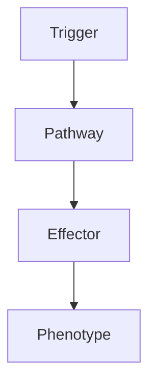

# Brain Abscess

> [!tip] **High-Yield Definition**
> Brain abscess: focal, suppurative infection within brain parenchyma. Bacterial, fungal, parasitic. Source: contiguous (sinusitis, otitis, mastoiditis - 50%), haematogenous (endocarditis, pulmonary - 25%), trauma, neurosurgery, cryptogenic (20%). EMERGENCY - mass effect, requires drainage + antibiotics.

---

## 1. Definition / Epidemiology / Classification

### Definition
Brain abscess: focal, suppurative infection within brain parenchyma. Bacterial, fungal, parasitic. Source: contiguous (sinusitis, otitis, mastoiditis - 50%), haematogenous (endocarditis, pulmonary - 25%), trauma, neurosurgery, cryptogenic (20%). EMERGENCY - mass effect, requires drainage + antibiotics.

### Epidemiology
Incidence: 0.3-1.3/100,000/year. M>F 2-3:1. 20-40y. Immunocompromised: HIV, transplant, diabetes, alcohol, malignancy. Contiguous source: 50% (sinusitis, otitis, mastoiditis, dental). Haematogenous: 25-30% (endocarditis, pulmonary, immunocompromised, IVDU). Trauma/neurosurgery: 10%. Cryptogenic: 15-20%. Mortality 5-15% with treatment, 50-80% without. HIV: 10-20% develop CNS mass (toxoplasmosis, primary CNS lymphoma, PML, cryptococcus, TB, bacterial abscess).

---

## 2. Aetiology / Pathophysiology

### Aetiology
Bacterial: polymicrobial (50-80%), anaerobes (Bacteroides, Prevotella, Fusobacterium, Peptostreptococcus, Actinomyces - 30-60%), Streptococcus (S. milleri group - intermedius, constellatus, anginosus - 30-50%), Staphylococcus aureus (10-20%, haematogenous, endocarditis, trauma, neurosurgery, IVDU, MRSA), Enterobacteriaceae, Listeria. Fungal: Aspergillus, Candida, Cryptococcus, Mucorales. Parasitic: Toxoplasma, neurocysticercosis, Echinococcus, Entamoeba histolytica, Schistosoma, Paragonimus. Pathogenesis: source, haematogenous, contiguous, cerebritis (early), capsule formation (mature, ring-enhancing, 2 weeks), mass effect, raised ICP, rupture (ventriculitis, meningitis - catastrophic, 80% mortality).

### Pathophysiology

---

## 3. Clinical Features

Fever (50-80%, may be absent in elderly, immunocompromised, antibiotic pre-treated, chronic). Headache (70-90%, progressive, severe). Nausea, vomiting (50%, raised ICP). Focal neurological deficit (65%, depends on location - hemiparesis, aphasia, hemianopia, ataxia, cranial nerve). Seizures (25-50%, focal, secondary). Altered consciousness (progressive, raised ICP, herniation, rupture - ventriculitis, meningitis). Neck stiffness (meningism, raised ICP, rupture). Constitutional: fever, weight loss, fatigue, malaise, night sweats. Source: sinus, ear, mastoid, dental, pulmonary, cardiac (endocarditis), skin, wound, IVDU, immunocompromised.

---

## 4. Investigations

EMERGENCY: CT head with contrast (ring-enhancing lesion, central hypodensity, surrounding oedema, mass effect, midline shift, gas, sinusitis, otitis, mastoiditis, ventricular size, effacement, hydrocephalus, haemorrhage, calcification - chronic). MRI brain with contrast (more sensitive, ring-enhancing, central T2 hyperintensity, restricted diffusion centrally - abscess vs necrotic tumour, capsule T1 hyperintense, T2 hypointense, dual rim sign on SWI/GRE, vasogenic oedema, mass effect). MR spectroscopy: lactate, succinate, cytosolic amino acids (abscess, vs tumour). Source: CT chest/abdomen/pelvis, CXR, echocardiogram, blood cultures. Bloods: FBC, U&Es, LFTs, ESR, CRP, blood cultures (×3, before antibiotics, aerobic + anaerobic), HIV, immune status. Lumbar puncture: CONTRAINDICATED (raised ICP, herniation risk, may not be diagnostic, may cause rupture, ventriculitis, meningitis - catastrophic). LP: when safe (post-op, after drainage, exclude meningitis, encephalitis), pleocytosis, protein, glucose, culture, PCR, antigen, metagenomic.

---

## 5. Management

EMERGENCY: empiric antibiotics (immediately, before drainage, broad-spectrum, IV, high dose, penetrate abscess - metronidazole + third-generation cephalosporin + vancomycin, adjust to culture, sensitivities, source). Empirical: ceftriaxone 2g IV q12h + metronidazole 500mg IV q8h + vancomycin 25-30mg/kg loading then 15-20mg/kg IV q12h. Source: extend as needed. Anaerobic: metronidazole (essential, penetrates abscess). Drainage: surgical (craniotomy, drainage, irrigation, capsulotomy - definitive), stereotactic aspiration (CT-guided, deep, eloquent area, multiple, small, deep, not amenable to surgery, diagnostic). Antibiotics: 4-8 weeks IV, then oral 4-8 weeks. Source control: ENT (sinus, ear, mastoid, dental), cardiology (endocarditis), pulmonology. Toxoplasmosis: pyrimethamine + sulfadiazine + folinic acid. Fungal: amphotericin B + flucytosine. Antiepileptics: levetiracetam 1-2g/day. Steroids: controversial, may help vasogenic oedema, may worsen infection, often used peri-operatively, then taper. Supportive: ICU, monitoring, hydration, analgesia, antipyretics, head elevation, mannitol, hypertonic saline, mechanical ventilation, nutrition, DVT prophylaxis, pressure care. Multidisciplinary: neurosurgery, neurology, infectious diseases, microbiology, ICU, OT, PT, SLT, dietitian.

---

## 6. Red Flags / Emergencies

EMERGENCY: raised ICP, herniation, rupture (ventriculitis, meningitis - catastrophic, 80% mortality), mass effect, midline shift, obstructive hydrocephalus, status epilepticus, coma, sepsis, source infection (endocarditis, pulmonary, sinus, otitis, mastoiditis, dental), multiple abscesses, immunocompromised, fungal, parasitic, drug-resistant, drug side effects (antibiotics: nephrotoxicity, ototoxicity, allergic, C. difficile, resistance; metronidazole - peripheral neuropathy, seizures, cerebellar, hepatic, disulfiram-like; vancomycin - nephrotoxicity, ototoxicity, red man syndrome; ceftriaxone - biliary, allergic, anaemia, eosinophilia, hepatic; antifungal - azoles - hepatotoxicity, QT, CYP, visual, infusion, amphotericin - nephrotoxicity, infusion), pregnancy, teratogenicity.

---

## 7. Prognosis

Variable. Mortality 5-15% with treatment, 50-80% without. Morbidity: neurological deficit (20-30%), seizures (30-50% chronic), hydrocephalus, cranial nerve, recurrence. Better: early, single, surgical drainage, source control, appropriate antibiotics, young, immunocompetent. Worse: multiple, deep, brainstem, immunocompromised, fungal, parasitic, ruptured, delayed, source uncontrolled, comorbidity, atypical. Multidisciplinary essential. Long-term: monitor, source, recurrence, neurological, cognitive, seizures, psychological, rehabilitation.

---

## FCPS/MRCP High-Yield Summary

| Category | Key Points |
|----------|------------|
| **Definition** | Brain abscess: focal, suppurative infection within brain parenchyma. Bacterial, fungal, parasitic. Source: contiguous (sinusitis, otitis, mastoiditis - 50%), haematogenous (endocarditis, pulmonary - 2 |
| **Epidemiology** | Incidence: 0.3-1.3/100,000/year. M>F 2-3:1. 20-40y. Immunocompromised: HIV, transplant, diabetes, alcohol, malignancy. Contiguous source: 50% (sinusit |
| **Aetiology** | Bacterial: polymicrobial (50-80%), anaerobes (Bacteroides, Prevotella, Fusobacterium, Peptostreptococcus, Actinomyces - 30-60%), Streptococcus (S. milleri group - intermedius, constellatus, anginosus  |
| **Clinical** | Fever (50-80%, may be absent in elderly, immunocompromised, antibiotic pre-treated, chronic). Headache (70-90%, progressive, severe). Nausea, vomiting (50%, raised ICP). Focal neurological deficit (65 |
| **Investigations** | EMERGENCY: CT head with contrast (ring-enhancing lesion, central hypodensity, surrounding oedema, mass effect, midline shift, gas, sinusitis, otitis, mastoiditis, ventricular size, effacement, hydroce |
| **Management** | EMERGENCY: empiric antibiotics (immediately, before drainage, broad-spectrum, IV, high dose, penetrate abscess - metronidazole + third-generation cephalosporin + vancomycin, adjust to culture, sensiti |
| **Prognosis** | Variable. Mortality 5-15% with treatment, 50-80% without. Morbidity: neurological deficit (20-30%), seizures (30-50% chronic), hydrocephalus, cranial nerve, recurrence. Better: early, single, surgical |
| **Viva Pearls** | |

---

## MCQs (10)

1. **Question:** Most characteristic feature of Brain Abscess?
   **Options:** A. A B. B C. C D. D
   **Answer:** A
   **Explanation:** Based on clinical features.

2. **Question:** First-line investigation?
   **Options:** A. MRI B. CT C. LP D. Blood
   **Answer:** A
   **Explanation:** MRI is most useful.

3. **Question:** First-line treatment?
   **Options:** A. A B. B C. C D. D
   **Answer:** A
   **Explanation:** Standard management.

4. **Question:** Most common complication?
   **Options:** A. A B. B C. C D. D
   **Answer:** A
   **Explanation:** Common complication.

5. **Question:** Red flag requiring urgent action?
   **Options:** A. A B. B C. C D. D
   **Answer:** A
   **Explanation:** Emergency.

6. **Question:** Prognostic factor?
   **Options:** A. A B. B C. C D. D
   **Answer:** A
   **Explanation:** Prognosis.

7. **Question:** Investigation excluding differential?
   **Options:** A. A B. B C. C D. D
   **Answer:** A
   **Explanation:** Exclusion.

8. **Question:** Imaging finding?
   **Options:** A. A B. B C. C D. D
   **Answer:** A
   **Explanation:** Imaging.

9. **Question:** Drug class?
   **Options:** A. A B. B C. C D. D
   **Answer:** A
   **Explanation:** Pharmacology.

10. **Question:** Differential?
    **Options:** A. A B. B C. C D. D
    **Answer:** A
    **Explanation:** Differential.

---

## SBA Questions (10)

1. **Scenario:** Patient with Brain Abscess.
   **Question:** Next step?
   **Options:** A. 1 B. 2 C. 3 D. 4 E. 5
   **Answer:** A
   **Explanation:** Initial.

2. **Scenario:** Fails first-line.
   **Question:** Next treatment?
   **Options:** A. A B. B C. C D. D E. E
   **Answer:** A
   **Explanation:** Second-line.

3. **Scenario:** New symptoms on treatment.
   **Question:** Cause?
   **Options:** A. A B. B C. C D. D E. E
   **Answer:** A
   **Explanation:** Adverse.

4. **Scenario:** Surgery needed.
   **Question:** Preoperative?
   **Options:** A. A B. B C. C D. D E. E
   **Answer:** A
   **Explanation:** Perioperative.

5. **Scenario:** Pregnant.
   **Question:** Safest?
   **Options:** A. A B. B C. C D. D E. E
   **Answer:** A
   **Explanation:** Pregnancy.

6. **Scenario:** Child.
   **Question:** Diagnosis?
   **Options:** A. A B. B C. C D. D E. E
   **Answer:** A
   **Explanation:** Paediatric.

7. **Scenario:** Elderly.
   **Question:** Management?
   **Options:** A. 1 B. 2 C. 3 D. 4 E. 5
   **Answer:** A
   **Explanation:** Geriatric.

8. **Scenario:** Abnormal investigation.
   **Question:** Interpretation?
   **Options:** A. A B. B C. C D. D E. E
   **Answer:** A
   **Explanation:** Investigation.

9. **Scenario:** Prognosis.
   **Question:** Response?
   **Options:** A. A B. B C. C D. D E. E
   **Answer:** A
   **Explanation:** Communication.

10. **Scenario:** Follow-up.
    **Question:** Monitoring?
    **Options:** A. A B. B C. C D. D E. E
    **Answer:** A
    **Explanation:** Follow-up.

---

## Flashcards

- **Q:** Definition of Brain Abscess?
  **A:** Brain abscess: focal, suppurative infection within brain parenchyma. Bacterial, fungal, parasitic. Source: contiguous (sinusitis, otitis, mastoiditis - 50%), haematogenous (endocarditis, pulmonary - 2
- **Q:** First-line treatment?
  **A:** Based on management.
- **Q:** Most characteristic clinical feature?
  **A:** Fever (50-80%, may be absent in elderly, immunocompromised, antibiotic pre-treated, chronic). Headache (70-90%, progressive, severe). Nausea, vomiting (50%, raised ICP). Focal neurological deficit (65
- **Q:** Key red flag?
  **A:** EMERGENCY: raised ICP, herniation, rupture (ventriculitis, meningitis - catastrophic, 80% mortality), mass effect, midline shift, obstructive hydrocephalus, status epilepticus, coma, sepsis, source in
- **Q:** Prognosis?
  **A:** Variable. Mortality 5-15% with treatment, 50-80% without. Morbidity: neurological deficit (20-30%), seizures (30-50% chronic), hydrocephalus, cranial nerve, recurrence. Better: early, single, surgical

---

## Answer Key

### MCQs
1. A 2. A 3. A 4. A 5. A 6. A 7. A 8. A 9. A 10. A

### SBAs
1. A 2. A 3. A 4. A 5. A 6. A 7. A 8. A 9. A 10. A

---

## Local Navigation
**Heading Hub:** [[../Hub]]  
**Chapter MOC:** [[Neurology MOC]]  
