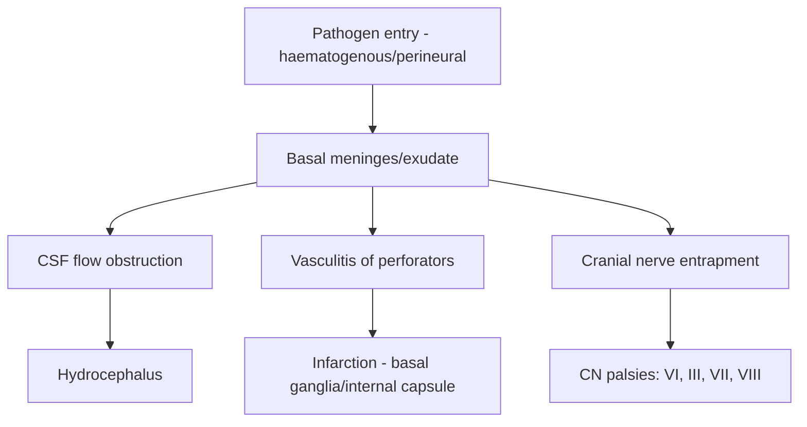
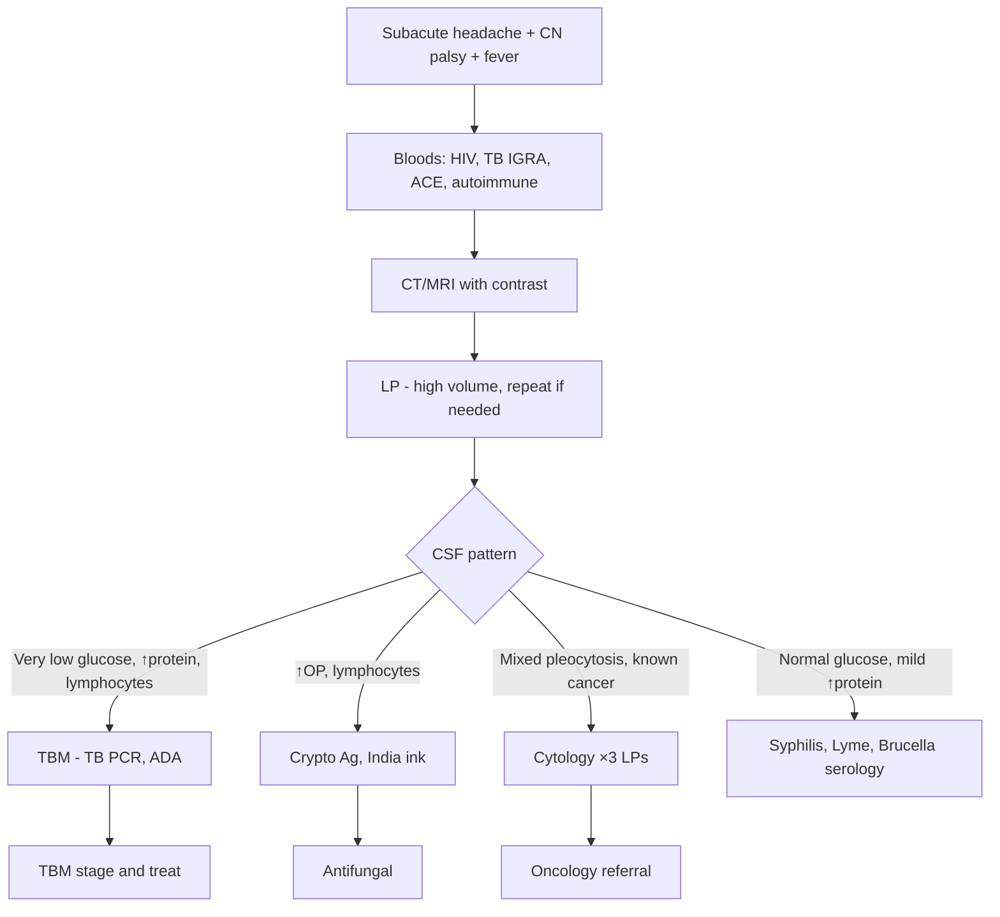

# Chronic Meningitis

> [!tip] **Definition:** Meningeal inflammation persisting **>4 weeks** with progressive neurological symptoms + CSF pleocytosis.
> **FCPS Pearl:** "TBM is the great mimicker" — subacute, basal meningeal signs, hydrocephalus, very low CSF glucose. Always exclude TB, fungal, carcinomatous.

## 1. Definition / Epidemiology / Classification

### Definition
Meningeal inflammation with progressive neurological symptoms (headache, cranial neuropathies, cognitive decline) lasting >4 weeks, with persistent CSF pleocytosis.

### Epidemiology
- **TBM:** ~10/100,000 in endemic areas (Asia, Africa); leading CNS infection worldwide
- **Cryptococcal:** 1 million cases/year globally; HIV-associated
- **Carcinomatous:** 5-10% of cancer patients; breast, lung, melanoma most common
- **Age:** TBM bimodal (children + young adults); cryptococcal peaks 20-40 yr (HIV)

### Classification
| Type | Common Pathogens/Causes |
|------|------------------------|
| **Infectious — TB** | *Mycobacterium tuberculosis* (TBM = most common chronic meningitis worldwide) |
| **Infectious — Fungal** | *Cryptococcus neoformans/gattii*, *Coccidioides*, *Histoplasma*, *Candida* |
| **Infectious — Other** | *Treponema pallidum* (syphilis), *Borrelia* (Lyme), *Brucella*, *Nocardia*, *Actinomyces* |
| **Neoplastic** | Leptomeningeal metastases (breast, lung, melanoma, lymphoma) |
| **Autoimmune/Inflammatory** | Neurosarcoidosis, Behçet's, vasculitis (PAN, GPA), IgG4 |
| **Parameningeal** | Cranial/spinal epidural abscess, sinus infection |

## 2. Aetiology / Pathophysiology

### Pathophysiology

### Molecular Basis
- **TB:** Cord factor (trehalose dimycolate) → granulomatous inflammation; **caseating granulomas** in basal meninges
- **Cryptococcus:** Polysaccharide capsule (glucuronoxylomannan) → immune evasion; **gelatinous pseudocysts** in perivascular spaces
- **Carcinomatous:** Malignant cells seed meninges via **Batson's venous plexus** or perineural/perivascular spaces

## 3. Clinical Features

### History
- **Subacute/chronic onset (weeks-months):** Insidious headache, low-grade fever, malaise
- **Headache:** Progressive, severe, often basal
- **Cranial neuropathies:** Diplopia (CN VI), facial weakness (CN VII), hearing loss (CN VIII), optic neuropathy
- **Cognitive/behavioural change:** Confusion, personality change, dementia
- **Seizures, raised ICP (vomiting, papilloedema)**
- **Systemic:** Weight loss, night sweats (TB), skin lesions (cryptococcosis, Behçet's), lymphadenopathy

### Examination
| Domain | Findings | Localisation |
|--------|----------|--------------|
| **Higher cortical** | Cognitive decline, confusion | Cortical/subcortical involvement |
| **Cranial nerves** | VI, III, VII, VIII palsies (basal) | Basal meningitis |
| **Motor** | Hemiparesis (stroke from vasculitis) | Infarction |
| **Sensory** | Variable | Cord/root involvement |
| **Neck** | Mild nuchal rigidity | Meningeal irritation |
| **Systemic** | Fever, lymphadenopathy, skin signs | Underlying disease |

### Specific Syndromes
| Syndrome | Features | Cause |
|----------|----------|-------|
| **TBM** | Basal signs, hydrocephalus, infarcts, very low glucose | TB |
| **Cryptococcal** | ↑↑ICP, papilloedema, minimal meningeal signs (HIV) | Cryptococcus |
| **Carcinomatous** | Multifocal deficits, known primary, radiculopathy | Metastases |
| **Neurosarcoidosis** | Facial palsy, optic neuropathy, hypothalamic | Sarcoid granulomas |
| **Behçet's** | Oral/genital ulcers, uveitis, meningoencephalitis | Behçet's |

## 4. Diagnostic Approach

### TBM Staging (British Medical Research Council)
| Stage | GCS | Neurological Deficit |
|-------|-----|----------------------|
| **I** | 15 (alert) | None or minimal (headache, meningismus) |
| **II** | 11-14 (confused) | Focal signs, cranial nerve palsies |
| **III** | <11 (coma) | Dense deficit, decerebrate |

## 5. Investigations

### CSF Analysis
| Parameter | TBM | Cryptococcal | Carcinomatous |
|-----------|-----|--------------|---------------|
| **Opening pressure** | Mild-moderately ↑ | **↑↑ (very high)** | Variable |
| **Appearance** | Clear/slightly turbid | Clear | Clear |
| **WCC** | 100-500 | <50 (HIV: <20) | Variable |
| **Differential** | Lymphocytes (early: neutrophils) | Lymphocytes | Mixed/lymphs + malignant cells |
| **Protein** | **↑↑ (1-5 g/L)** | Mildly ↑ | Mildly-moderately ↑ |
| **Glucose** | **↓↓ (<2.2 or <60% serum)** | **↓↓** | **↓↓** |
| **Specific tests** | AFB stain (low yield 10-20%), **TB PCR** (50-80%), **ADA** (>10 U/L suggestive) | **India ink** (60-80% HIV+), **CrAg** (>95% sensitive) | **Cytology** (50% first LP, 90% third LP), flow cytometry |

### Neuroimaging
- **MRI with contrast:** Basal meningeal enhancement (TBM, sarcoid), hydrocephalus, tuberculomas, infarcts (basal ganglia)
- **Cryptococcoma:** Dilated perivascular spaces (gelatinous pseudocysts); "soap bubble" lesions
- **Carcinomatous:** Leptomeningeal enhancement, nerve root enhancement, subependymal deposits

### Specific Tests
- **TB:** TB PCR (Xpert MTB/RIF Ultra), ADA, IGRA (supportive, not diagnostic in active TBM)
- **Cryptococcus:** Serum/CSF **CrAg** (>95% sens), India ink
- **Carcinomatous:** CSF cytology ×3, tumour markers (CEA, CA-125, CA 15-3)
- **Syphilis:** VDRL/TPPA in serum + CSF
- **Sarcoidosis:** Serum ACE (40% sensitive), chest CT, biopsy
- **Cytology/Flow cytometry** if lymphoma suspected

## 6. Differential Diagnosis
| Differential | Distinguishing Features | Key Test |
|--------------|--------------------------|----------|
| **Acute bacterial meningitis** | Acute onset, neutrophilic CSF | CSF culture |
| **Viral meningitis** | Acute, self-limiting | CSF PCR |
| **Brain abscess** | Focal mass, ring-enhancing | MRI |
| **ADEM** | Post-infectious, encephalopathy | MRI |
| **Autoimmune encephalitis** | Seizures, behavioural change | Antibody panel |
| **Lymphoma (PCNSL)** | Immunocompromised, EBV+ | MRI, biopsy |
| **Vasculitis** | Stroke-like, systemic features | ANCA, biopsy |

## 7. Management

### TBM Treatment (Intensive + Continuation)
| Phase | Regimen | Duration |
|-------|---------|----------|
| **Intensive** | **HRZE** (Isoniazid + Rifampicin + Pyrazinamide + Ethambutol) + **Prednisolone** | 2 months |
| **Continuation** | **HR** (Isoniazid + Rifampicin) | 7-10 months |
| **Total** | | 9-12 months |
- **Adjunctive dexamethasone:** 0.15mg/kg IV q6h × 1 week → taper over 6-8 weeks (reduces mortality, especially Stage II/III)
- **Pyridoxine 25-50 mg daily** with isoniazid (prevent neuropathy)
- **VP shunt** for hydrocephalus (especially non-communicating)

### Cryptococcal Meningitis
| Phase | Regimen | Duration |
|-------|---------|----------|
| **Induction** | **Amphotericin B 0.7-1mg/kg/d IV** + **Flucytosine 100mg/kg/d PO q6h** | 2 weeks |
| **Consolidation** | **Fluconazole 400-800mg/d PO** | 8 weeks |
| **Maintenance** | **Fluconazole 200mg/d PO** | ≥1 year (until CD4 >200) |
- **Therapeutic LPs** for raised ICP (often daily initially)
- **IRIS** risk on ART initiation — start ART 4-6 weeks after antifungal

### Carcinomatous Meningitis
- **Intrathecal chemotherapy:** Methotrexate ± cytarabine (liposomal)
- **Systemic therapy:** Per primary (e.g., HER2+ breast → trastuzumab)
- **Radiotherapy:** Focal/symptomatic sites
- **Prognosis:** Poor (weeks-months)

### Neurosarcoidosis
- **Prednisolone 1mg/kg/d** → taper
- **Steroid-sparing:** Methotrexate, azathioprine, infliximab

## 8. Drug Cautions
| Drug | Caution | Management |
|------|---------|------------|
| **Isoniazid** | Hepatotoxicity, neuropathy | LFTs, pyridoxine 25-50mg |
| **Rifampicin** | CYP450 inducer, hepatotoxicity, orange body fluids | LFTs, drug interactions |
| **Pyrazinamide** | Hepatotoxicity, hyperuricaemia | LFTs, uric acid |
| **Amphotericin B** | **Nephrotoxicity**, hypokalaemia, fever/rigors | Pre-hydrate, monitor U&E, K+ replacement |
| **Flucytosine** | Myelosuppression, hepatotoxicity | FBC, LFTs |
| **Methotrexate (IT)** | Meningitis, myelopathy, mucositis | Folate, leucovorin rescue |

## 9. Procedures

### Lumbar Puncture (high-volume)
- **Volume:** 10-15 mL for cytology (vs 3-4 mL standard)
- **Repeat LPs:** 3 separate LPs if carcinomatous suspected
- **Therapeutic LP:** Cryptococcal raised ICP (remove 20-30 mL)

### VP Shunt
- **Indication:** Hydrocephalus in TBM (especially non-communicating)
- **Timing:** Early for hydrocephalus with neurological decline
- **Risk:** TB shunt infection

## 10. Complications
| Complication | Frequency | Management |
|--------------|-----------|------------|
| **Hydrocephalus** | 30-70% TBM | VP shunt, EVD |
| **Stroke (vasculitis)** | 20-40% TBM | Aspirin (controversial), rehabilitation |
| **Visual loss** | 5-10% (CN II compression) | Steroids, shunting |
| **SIADH** | 30-50% TBM | Fluid restriction |
| **Seizures** | 10-20% | AED |
| **Drug toxicity** | Variable | Monitor LFTs, U&E |
| **IRIS** (cryptococcal + ART) | 10-20% | Steroids, continue both |

## 11. Red Flags
| Red Flag | Action |
|----------|--------|
| **GCS <13 / rapid decline** | ICU, consider shunt |
| **New focal deficit** | Stroke (vasculitis); MRI |
| **Raised ICP with papilloedema** | Urgent imaging, therapeutic LP |
| **Stage III TBM** | Aggressive Rx, adjunctive steroids |
| **HIV with cryptococcal + ICP** | Serial therapeutic LPs |
| **New ART initiation + symptoms** | IRIS — steroids, continue therapy |

## 12. Prognosis
- **TBM:** Mortality 20-40% (HIV+ worse); 50% neurological sequelae in survivors; worse in Stage III
- **Cryptococcal:** Mortality 20-40% in HIV+ (up to 70% if delayed)
- **Carcinomatous:** Median survival 3-6 months
- **Sarcoidosis:** Generally good with treatment; relapses common

## 13. Topic Correlation
| Related Topic | Key Overlap |
|---------------|-------------|
| Tuberculous Meningitis | Most common chronic meningitis worldwide |
| Fungal Meningitis | Cryptococcus, Coccidioides |
| Acute Bacterial Meningitis | Must exclude (acute vs chronic) |
| HIV CNS Complications | Opportunistic infections |
| Carcinomatous Meningitis | Cancer staging |

## 14. Special Situations
| Situation | Consideration |
|-----------|---------------|
| **Pregnancy** | TBM: HRZ + ethambutol safe; avoid streptomycin; fluconazole teratogenic |
| **HIV** | TBM: longer Rx; cryptococcal: 1 year fluconazole; ART after 2-8 weeks |
| **Paediatric** | TBM more common; BCG protective; steroids reduce mortality |
| **Elderly** | Consider cryptococcal, Listeria, TB |
| **Immunocompromised** | Broader infectious differential; consider non-infectious |

---

## FCPS/MRCP High-Yield Summary
| Category | Key Points |
|----------|------------|
| **Definition** | Meningeal inflammation >4 weeks; subacute presentation |
| **Epidemiology** | TBM = #1 chronic meningitis globally; cryptococcal = HIV |
| **Pathophysiology** | Basal meningitis → CN palsies, hydrocephalus, vasculitis, infarcts |
| **Clinical** | Subacute headache, CN palsies, hydrocephalus, low glucose CSF |
| **Diagnosis** | MRI basal enhancement; CSF (very low glucose, lymphocytic); specific tests (TB PCR, CrAg, cytology) |
| **Management** | TBM: HRZE + steroids; Crypto: amphotericin + flucytosine; Carcinomatous: IT MTX |
| **Complications** | Hydrocephalus, stroke, visual loss, IRIS |
| **Prognosis** | TBM 20-40% mortality; worse with HIV/Stage III |
| **Viva Pearls** | "Always send CSF for CrAg in HIV + headache"; TBM staging guides Rx; TBM = basal signs |

## Viva Questions
1. **Q:** Most common chronic meningitis worldwide? **A:** Tuberculous meningitis.
2. **Q:** TBM CSF findings? **A:** Lymphocytic pleocytosis, very low glucose, ↑↑ protein (1-5 g/L).
3. **Q:** TBM treatment regimen? **A:** HRZE intensive 2 months + HR continuation 7-10 months + steroids.
4. **Q:** Cryptococcal treatment? **A:** Amphotericin B + flucytosine 2 weeks → fluconazole consolidation/maintenance.
5. **Q:** Most sensitive test for cryptococcal meningitis? **A:** CSF cryptococcal antigen (CrAg) — >95% sensitivity.
6. **Q:** TBM stages? **A:** I = GCS 15 no deficit; II = GCS 11-14 with deficit; III = GCS <11.
7. **Q:** Carcinomatous meningitis diagnosis? **A:** CSF cytology ×3 (sensitivity improves to 90% with 3 LPs).
8. **Q:** Neurosarcoidosis features? **A:** Facial palsy, optic neuropathy, hypothalamic involvement, systemic sarcoid.
9. **Q:** Cryptococcal IRIS? **A:** Worsening symptoms on ART initiation; treat with steroids, continue both.
10. **Q:** Why TBM gives strokes? **A:** Vasculitis of perforating vessels at base of brain → basal ganglia/Internal capsule infarcts.

## Common Confusions
| Confusion | Clarification |
|-----------|---------------|
| TBM vs viral meningitis | TBM = weeks duration, very low glucose, basal signs |
| Cryptococcal vs TBM | Crypto = ↑↑OP, India ink, CrAg; TBM = basal infarcts |
| Carcinomatous vs chronic infection | Cytology ×3 LPs; known primary often |
| ADA in TBM | Supportive (sensitivity 60-80%), not specific (raised in other conditions) |

## Mnemonics
1. **"TBM BASAL"** = **B**asal enhancement, **A**dipose CSF, **S**troke, **A**denopathy, **L**ow glucose
2. **"CRYPTO"** = **C**apsule (mucicarmine+), **R**aised ICP, **Y**east on India ink, **P**erivascular pseudocysts, **T**hin capsule, **O**pal CSF
3. **"HRZE"** = **H**I, **R**ifampicin, **Z** = Pyrazinamide, **E**thambutol — intensive TBM
4. **"CARCINOMATOUS"** = **C**ytology, **A**denocarcinoma (breast/lung), **R**adiculopathy, **C**SF cytology ×3

## MCQs (10)
1. **Question:** Most common chronic meningitis worldwide:
   **Options:** A. Cryptococcal B. TBM C. Carcinomatous D. Neurosarcoidosis
   **Answer:** B
2. **Question:** Characteristic CSF in TBM:
   **Options:** A. Neutrophilic, normal glucose B. Lymphocytic, very low glucose, ↑↑ protein C. Eosinophilic D. Frank blood
   **Answer:** B
3. **Question:** Adjunctive steroid in TBM:
   **Options:** A. Harmful B. Reduces mortality, especially Stage II/III C. Only in HIV D. Only in children
   **Answer:** B
4. **Question:** Most sensitive test for cryptococcal meningitis:
   **Options:** A. India ink B. CSF CrAg C. CSF culture D. Serum HIV
   **Answer:** B
5. **Question:** First-line induction for cryptococcal meningitis:
   **Options:** A. Fluconazole alone B. Amphotericin B + flucytosine C. Voriconazole D. Caspofungin
   **Answer:** B
6. **Question:** Best diagnostic test for leptomeningeal metastases:
   **Options:** A. Single CSF cytology B. CSF cytology ×3 (50%, 70%, 90%) C. MRI alone D. PET
   **Answer:** B
7. **Question:** TBM Stage II features:
   **Options:** A. GCS 15, no deficit B. GCS 11-14 with focal/CN signs C. GCS <11 D. Asymptomatic
   **Answer:** B
8. **Question:** Cryptococcal IRIS occurs:
   **Options:** A. Before ART B. Weeks-months after ART initiation C. Only in children D. Only in bacterial meningitis
   **Answer:** B
9. **Question:** Treatment duration for TBM:
   **Options:** A. 6 months B. 9-12 months C. 2 years D. Lifelong
   **Answer:** B
10. **Question:** Neurosarcoidosis first-line treatment:
    **Options:** A. Antifungal B. Steroids C. Chemotherapy D. Antivirals
    **Answer:** B

## SBA Questions (10)
1. **Scenario:** 30-year-old HIV+ with 4-week headache, vomiting, papilloedema. CD4 50. CSF OP 35 cm, 5 lymphocytes, India ink positive.
   **Question:** Diagnosis and treatment?
   **Options:** A. TBM; HRZE B. Cryptococcal; amphotericin B + flucytosine C. Toxoplasmosis; pyrimethamine D. PML; ART
   **Answer:** B
2. **Scenario:** Child with 3-week fever, headache, vomiting, VI palsy, GCS 13. CSF: 200 lymphocytes, protein 2.0, glucose 1.5.
   **Question:** Diagnosis and stage?
   **Options:** A. TBM Stage II B. Bacterial; ceftriaxone C. Viral; supportive D. Cryptococcal
   **Answer:** A
3. **Scenario:** 50-year-old with breast cancer, progressive leg weakness, radiculopathy, headache. MRI shows leptomeningeal enhancement.
   **Question:** Best next test?
   **Options:** A. Single CSF cytology B. CSF cytology ×3 + flow cytometry C. PET D. Re-MRI
   **Answer:** B
4. **Scenario:** TBM on treatment, day 14 develops new hemiparesis. MRI shows basal ganglia infarct.
   **Question:** Mechanism?
   **Options:** A. Drug toxicity B. Vasculitis of perforators C. Herniation D. Tumour
   **Answer:** B
5. **Scenario:** HIV+ with cryptococcal meningitis on fluconazole maintenance 6 months, CD4 now 200, asymptomatic.
   **Question:** Next step?
   **Options:** A. Lifelong fluconazole B. Continue fluconazole until CD4 >200 sustained C. Stop ART D. Restart amphotericin
   **Answer:** B
6. **Scenario:** Sarcoidosis patient with bilateral facial palsy, headache, hypothalamic involvement.
   **Question:** Treatment?
   **Options:** A. Antifungal B. Prednisolone 1mg/kg/d C. Ceftriaxone D. Surgery
   **Answer:** B
7. **Scenario:** 35-year-old with progressive headache, CN palsies, hydrocephalus. CSF protein 3.0, glucose 1.0. CXR shows miliary TB.
   **Question:** Treatment?
   **Options:** A. Antifungal B. HRZE + steroids + consider VP shunt C. Acyclovir D. NSAID
   **Answer:** B
8. **Scenario:** HIV+ on ART with cryptococcal meningitis develops worsening headache and fever 2 weeks after ART initiation.
   **Question:** Diagnosis and management?
   **Options:** A. Resistant crypto; switch Rx B. IRIS; continue both, add steroids C. New infection D. Stop ART
   **Answer:** B
9. **Scenario:** 60-year-old with lung cancer, headache, diplopia, areflexic legs. CSF shows malignant cells.
   **Question:** Treatment?
   **Options:** A. Surgery B. Intrathecal methotrexate + systemic Rx C. Antibiotics D. Acyclovir
   **Answer:** B
10. **Scenario:** TBM patient on treatment, GCS drops to 8. CT shows hydrocephalus.
    **Question:** Management?
    **Options:** A. Stop treatment B. VP shunt or EVD C. Sedation only D. Steroid increase
    **Answer:** B

## Flashcards
- **Q:** Most common chronic meningitis worldwide? **A:** TBM.
- **Q:** TBM CSF? **A:** Lymphocytic, very low glucose, ↑↑ protein (1-5 g/L).
- **Q:** TBM Rx? **A:** HRZE 2/12 + HR 7-10/12 + steroids.
- **Q:** Crypto Rx? **A:** Amphotericin B + flucytosine 2/52 → fluconazole consolidation/maintenance.
- **Q:** CrAg sensitivity? **A:** >95% in HIV-associated cryptococcal meningitis.
- **Q:** TBM stages? **A:** I = GCS 15; II = 11-14 with deficit; III = <11.
- **Q:** Carcinomatous diagnosis? **A:** CSF cytology ×3 (sensitivity 50%, 70%, 90%).
- **Q:** Neurosarcoidosis Rx? **A:** Prednisolone 1mg/kg → taper; steroid-sparing agent.
- **Q:** IRIS timing? **A:** Weeks-months after ART initiation in cryptococcal.
- **Q:** TBM stroke mechanism? **A:** Vasculitis of basal perforators → basal ganglia infarcts.

## Answer Key with Explanations
**MCQs:**
1. **B** — TBM = #1 chronic meningitis globally
2. **B** — Lymphocytic + very low glucose + ↑↑ protein is TBM hallmark
3. **B** — Adjunctive dexamethasone reduces mortality in TBM (Stage II/III)
4. **B** — CrAg >95% sensitivity vs India ink 60-80%
5. **B** — Amphotericin B + flucytosine is gold standard induction
6. **B** — 3 LPs increase cytology yield to 90%
7. **B** — TBM Stage II = GCS 11-14 with focal/CN signs
8. **B** — IRIS = immune reconstitution inflammatory syndrome weeks after ART
9. **B** — 9-12 months total (intensive 2 + continuation 7-10)
10. **B** — Steroids are first-line for neurosarcoidosis

**SBAs:**
1. **B** — HIV + ↑OP + India ink + = cryptococcal; amphotericin + flucytosine
2. **A** — Subacute + CN palsy + low glucose = TBM Stage II
3. **B** — Cancer + leptomeningeal enhancement + radiculopathy = carcinomatous; ×3 LPs
4. **B** — TBM stroke = basal perforator vasculitis
5. **B** — Stop fluconazole when CD4 sustained >200 on ART
6. **B** — Neurosarcoidosis → high-dose steroids
7. **B** — TBM miliary = HRZE + steroids + shunt for hydrocephalus
8. **B** — IRIS = continue both + add steroids (don't stop ART)
9. **B** — Carcinomatous = intrathecal MTX + systemic + radiotherapy
10. **B** — Hydrocephalus in TBM = VP shunt/EVD (don't stop treatment)

## PasTest Scenario SBAs (Clinical Vignettes)

> **Auto-generated PasTest/Mediscope-style scenario SBAs** grounded in the authored source. Each scenario tests a real clinical fact (triad, specific sign, contraindication, trial, first-line Rx) extracted from the topic. *Source: Ch 27: Neurology & Stroke — Chronic Meningitis*

**Q1.** Which of the following features is most specific or characteristic of Chronic Meningitis?

  - **A.** TB:
  - **B.** A feature common to many acute inflammatory conditions
  - **C.** A non-specific sign that does not localise the diagnosis
  - **D.** An investigation finding rather than a clinical feature

  > **Answer: A** — TB:
  >
  > *Source:* :** Leptomeningeal enhancement, nerve root enhancement, subependymal deposits

### Specific Tests
- **TB:** TB PCR (Xpert MTB/RIF Ultra), ADA, IGRA (supportive, not diagnostic in active TBM)
- **Crypt

**Q2.** What is the most appropriate first-line therapy for Chronic Meningitis?

  - **A.** IRIS
  - **B.** An advanced/surgical therapy reserved for refractory disease
  - **C.** Symptomatic treatment only, no disease-modifying therapy
  - **D.** Empiric broad-spectrum therapy without specific indication

  > **Answer: A** — IRIS
  >
  > *Source:* **IRIS** risk on ART initiation — start ART 4-6 weeks after antifungal

