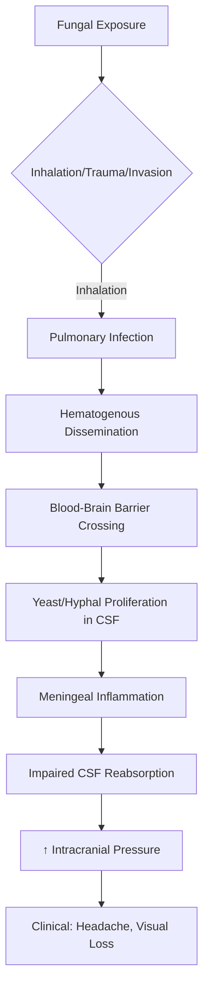
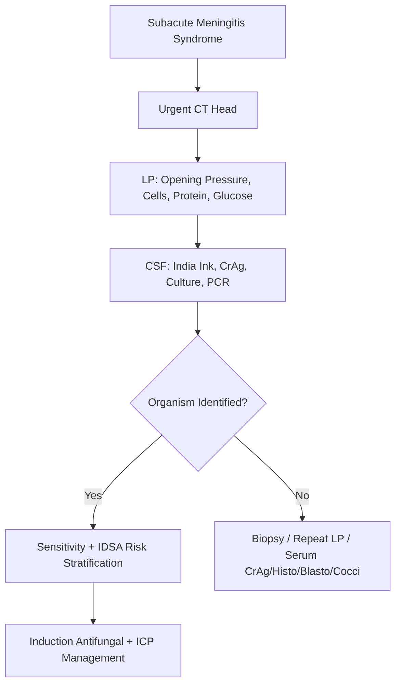

# Fungal Meningitis

Related: [[CNS Infections Hub]], [[Meningitis Hub]], [[Cryptococcal Meningitis]], [[HIV CNS Complications]], [[TB Meningitis]]

> [!tip] **Definition**
> Subacute-to-chronic meningitis caused by fungal pathogens (most commonly *Cryptococcus neoformans/gattii*, *Candida*, *Aspergillus*, endemic mycoses: *Histoplasma*, *Coccidioides*, *Blastomyces*, *Talaromyces*). Predominantly affects immunocompromised hosts but endemic mycoses affect immunocompetent.

> [!tip] **Exam Pearl**
> Fungal meningitis is a **chronic meningitis with high opening pressure**. **Cryptococcus** is the most common cause worldwide; **Coccidioides** is geographically restricted (SW USA/NW Mexico). Always check HIV status + CD4 count.

## Learning Objectives
- [ ] Define fungal meningitis and classify by organism
- [ ] Describe epidemiology (HIV, geography, iatrogenic)
- [ ] Explain pathophysiology of CNS invasion
- [ ] List clinical features (subacute headache, fever, raised ICP)
- [ ] Outline diagnostic approach (LP with India ink, CrAg, culture)
- [ ] Differentiate from TB, carcinomatous, bacterial meningitis
- [ ] Detail management (induction → consolidation → maintenance)
- [ ] Identify complications (raised ICP, immune reconstitution)
- [ ] Recall FCPS/MRCP doses, duration, IRIS

---

## 1. Definition / Epidemiology / Classification

### Definition
Inflammation of meninges caused by fungal invasion. Classified by organism and host immune status. Hallmark: **subacute-to-chronic** course (weeks-months) with **lymphocytic CSF**, **markedly elevated opening pressure**, and often **normal/low glucose**.

### Epidemiology
- **Incidence:** 1-5% of all meningitis in immunocompetent; up to 10-20% in HIV/AIDS
- **Age:** Bimodal — young adults (HIV) + elderly (immunosuppression)
- **Sex:** M>F for endemic mycoses; equal for cryptococcal
- **Geography:** Cryptococcus worldwide; Coccidioides (SW USA, Mexico, Central/South America); Histoplasma (Ohio/Mississippi valleys, bat/bird droppings); Blastomyces (SE USA, Great Lakes); Talaromyces (SE Asia, HIV with CD4<100)
- **Risk factors:** HIV/AIDS (CD4<100), transplant, steroids, chemotherapy, DM, malignancy, TNF inhibitors, neurosurgery, spinal anaesthesia, neonatal prematurity

### Classification
|| Organism | Key Features | Geography/Host |
|----------|------------|---------------|
| *Cryptococcus neoformans/gattii* | Most common fungal meningitis; HIV, transplant | Worldwide |
| *Candida* spp | Neonates, ICU, indwelling catheters | Worldwide |
| *Aspergillus* | Direct invasion, abscess, angioinvasive | Immunocompromised |
| *Coccidioides immitis* | "Valley fever"; erythema nodosum | SW USA, Mexico |
| *Histoplasma capsulatum* | Pulmonary → disseminated | Ohio/Mississippi |
| *Blastomyces dermatitidis* | Pulmonary, skin, bone | SE USA |
| *Talaromyces (Penicillium) marneffei* | Disseminated, papular rash | SE Asia, AIDS |
| *Sporothrix schenckii* | Rare, traumatic inoculation | Tropical |

---

## 2. Aetiology / Pathophysiology

### Pathophysiology

### Molecular/Pathogenic Mechanisms
- **Cryptococcus:** Polysaccharide capsule (glucuronoxylomannan) → antiphagocytic; melanin → antioxidant; urease → CNS invasion; titan cells → persistence
- **Immune status:** HIV with CD4<100 = highest risk for cryptococcal/Talaromyces
- **Iatrogenic:** Contaminated methylprednisolone (2012 US outbreak — *Exserohilum rostratum*), epidural anaesthesia, neurosurgical devices

---

## 3. Clinical Features

### History
- **Onset:** Subacute (cryptococcal: days-weeks); chronic (Coccidioides: weeks-months)
- **Symptoms:** Headache (90%), fever (60-80%), nausea/vomiting (raised ICP), photophobia, neck stiffness (50%), altered mental status (lethargy → coma)
- **Cryptococcal-specific:** Often afebrile; minimal meningismus despite florid CSF; visual loss, diplopia (CN VI palsy from ↑ICP)
- **Coccidioidal:** Erythema nodosum, arthralgias ("desert rheumatism"), pulmonary symptoms

### Examination
|| Domain | Findings | Localisation |
|--------|---------|------------|
| **Higher cortical** | Encephalopathy, confusion, obtundation | Diffuse meningeal |
| **Cranial nerves** | **CN VI palsy** (false localising sign of ↑ICP), CN II papilloedema, visual loss | ↑ICP |
| **Motor** | Normal or mild weakness | — |
| **Sensory** | Normal | — |
| **Coordination** | Ataxia (↑ICP, cerebellar involvement) | Cerebellum/↑ICP |
| **Gait** | Ataxic | ↑ICP |

### Specific Syndromes
|| Syndrome | Features | Organism |
|----------|---------|----------|
| **Cryptococcal meningoencephalitis** | Headache, ↑ICP, blindness, CN VI palsy | C. neoformans/gattii |
| **Coccidioidal meningitis** | Basilar, hydrocephalus, vasculitis → stroke | C. immitis |
| **CNS candidiasis** | Microabscesses, chorioretinitis, vasculitis | Candida |
| **Aspergillus CNS** | Angioinvasive, haemorrhagic infarcts, abscesses | Aspergillus |

---

## 4. Diagnostic Approach / Algorithm

### Diagnostic Criteria (Cryptococcal)
- **Definite:** Positive CSF culture OR positive CSF CrAg OR positive India ink + clinical syndrome
- **Probable:** Compatible clinical + positive serum CrAg + suggestive CSF (lymphocytic, low glucose, ↑protein)

### Severity/Staging
|| Risk | Criteria | Management |
|------|---------|--------------|
| **Low risk** | HIV, normal mental status, no focal signs, no comorbidities | Standard induction |
| **Intermediate** | Altered mental status OR focal signs | Enhanced monitoring |
| **High risk** | Coma, very high ICP, multiorgan failure | ICU, aggressive ICP control |

---

## 5. Investigations

### First-Line
|| Test | Indication | Finding |
|------|-----------|----------|
| **CT Head** | All suspected | Hydrocephalus, basal enhancement, infarcts |
| **MRI Brain with contrast** | All confirmed/suspected | Basal meningeal enhancement, dilated ventricles, cryptococcomas, gelatinous pseudocysts |
| **LP + Opening Pressure** | All (if safe) | ↑↑OP (>25 cmH2O in cryptococcal) |

### CSF Analysis
|| Parameter | Normal | Fungal Meningitis |
|-----------|--------|------------------|
| **Opening pressure** | 5-20 cmH2O | **Markedly ↑** (cryptococcal: often >25-50) |
| **Appearance** | Clear | Clear (gelatinous in cryptococcal) |
| **WCC** | <5/μL | 20-500/μL; lymphocytic (occasionally neutrophils early) |
| **Protein** | 0.15-0.45 g/L | 0.5-2.0 g/L (markedly ↑) |
| **Glucose (CSF:Serum)** | >0.6 | **Low** (<0.5; often <2 mmol/L) |
| **India ink** | Negative | **Positive in 60-80% cryptococcal** (encapsulated yeasts) |
| **CrAg (CrAg LFA)** | Negative | **Positive >95%** (gold standard) |
| **Fungal culture** | Negative | Gold standard; species + sensitivity |
| **PCR** | Negative | Coccidioides, Histoplasma, Aspergillus, Cryptococcus |

### Laboratory
- **HIV test** (all patients), **CD4 count**
- **Serum CrAg** (positive in HIV with cryptococcal meningitis in >95%)
- **Endemic mycoses serology:** Cocci serology (complement fixation, immunodiffusion); Histo/Blasto urinary antigen
- **Galactomannan** (Aspergillus); β-D-glucan (Pneumocystis, Candida)

---

## 6. Differential Diagnosis

|| Differential | Distinguishing Features | Key Test |
|--------------|------------------------|----------|
| **TB meningitis** | Basilar enhancement, longer prodrome, TB contact, positive TB IGRA | CSF AFB, culture, GeneXpert |
| **Bacterial meningitis** | Acute (hours-days), neutrophilic CSF, very low glucose | CSF Gram stain, culture |
| **Carcinomatous meningitis** | Known primary, very high protein, atypical cells | CSF cytology (×3 LPs) |
| **Other chronic meningitis** (syphilis, Lyme, Brucella) | Serology, exposure | Specific serology |
| **Autoimmune encephalitis** | Young, psychiatric, seizures | CSF neuronal Abs |
| **Viral meningitis/encephalitis** | Acute, less elevated protein, HSV PCR | CSF PCR |

---

## 7. Management

### Emergency / Acute
|| Situation | Action |
|-----------|--------|
| **Markedly ↑ICP (>25 cmH2O)** | **Therapeutic LP** (remove 20-30 mL); repeat daily PRN; consider Ommaya/VP shunt if refractory |
| **Hydrocephalus** | Serial LPs, neurosurgical shunt (VP or LPs) |
| **Visual loss** | Urgent ICP control; ophthalmology review |
| **Coma/seizures** | ICU; LP deferred until CT |

### Disease-Modifying Therapy (Cryptococcal, IDSA 2010)
|| Phase | Regimen | Duration |
|-------|--------|---------|
| **Induction** | **Amphotericin B deoxycholate 0.7-1 mg/kg/d IV + Flucytosine 100 mg/kg/d PO 6-hrly** | 2 weeks |
| **Alternative induction** | Liposomal AmB 3-6 mg/kg/d + 5-FC (if renal impairment) | 2 weeks |
| **Consolidation** | **Fluconazole 400 mg/d PO** | 8 weeks |
| **Maintenance (secondary prophylaxis)** | **Fluconazole 200 mg/d PO** | ≥1 year (HIV: until CD4>200, stable on ART) |

### Other Organisms
- **Coccidioides:** Fluconazole 400-800 mg/d IV/PO lifelong; or intrathecal AmB for refractory
- **Histoplasma:** Liposomal AmB 5 mg/kg/d ×2 weeks → itraconazole 200 mg BD ×12 months
- **Candida:** AmB + 5-FC induction → fluconazole
- **Aspergillus:** Voriconazole 6 mg/kg IV q12h → 4 mg/kg q12h (preferred) ± AmB
- **Talaromyces:** AmB induction → itraconazole maintenance

### Symptomatic / Supportive
- **ICP control:** Therapeutic LPs, acetazolamide 250 mg q6h (limited evidence), mannitol, shunt
- **Anticonvulsants** if seizures
- **ART in HIV:** Start 4-6 weeks after antifungal induction (risk of **IRIS**)
- **Steroids:** Generally AVOID (worsen cryptococcal); consider in Coccidioides vasculitis

### Special Populations
- **Pregnancy:** AmB deoxycholate (Category B) is safe; avoid azoles (teratogenic — fluconazole embryopathy with high first-trimester doses)
- **Renal impairment:** Liposomal AmB
- **Paediatric:** Same regimens; weight-based dosing

---

## 8. Drug Interactions / Cautions

|| Drug | Interaction/Caution | Management |
|------|---------------------|------------|
| **Amphotericin B** | Nephrotoxic (↑with aminoglycosides, ciclosporin, diuretics); K+/Mg2+ wasting | IV prehydration, daily U&E, replace electrolytes, liposomal if Cr >1.5 |
| **Flucytosine** | Myelosuppression (esp. with zidovudine, ganciclovir); hepatotoxic | Levels (peak 50-100 μg/mL), FBC, LFT |
| **Fluconazole** | CYP3A4 inhibitor (↑warfarin, phenytoin, ciclosporin, tacrolimus); QT prolongation | Drug levels (ciclosporin/tacrolimus), INR, ECG |
| **Voriconazole** | CYP3A4 (similar to fluconazole); visual disturbances; hepatotoxic | LFT, eye exam, levels (trough 1-5.5 mg/L) |
| **Itraconazole** | CYP3A4; negative inotrope (HF) | Levels, echo if long-term |

---

## 9. Procedures

### Lumbar Puncture
- **Indications:** Diagnostic; therapeutic (↑ICP)
- **Pre-LP CT:** Immunocompromised, focal signs, papilloedema, seizures, GCS<13
- **Opening pressure:** Always measure (sitting preferred for accuracy)
- **Complications:** Post-LP headache, tonsillar herniation, infection

---

## 10. Complications

|| Complication | Frequency | Management |
|--------------|-----------|------------|
| **↑ICP / Vision loss** | 50% cryptococcal | Serial LPs, shunt |
| **Hydrocephalus** | 20-30% | VP/LP shunt |
| **Cryptococcoma** | 10-20% | Prolonged antifungals ± surgery |
| **IRIS (HIV)** | 10-30% | Continue ART, steroids for severe |
| **Relapse** | 5-15% (without fluconazole maintenance) | Re-induction, lifelong fluconazole |
| **Cranial nerve palsies** | 10-20% | Usually resolve with ICP control |
| **Vasculitis/stroke** | 5-10% (Coccidioides) | Antifungals ± steroids |

---

## 11. Red Flags / Emergencies

|| Red Flag | Action |
|----------|--------|
| **Visual loss** | Urgent LP/shunt |
| **Coma** | ICU; aggressive ICP management |
| **New seizure** | CT, AED, correct electrolytes |
| **Markedly ↑ICP (>40 cmH2O)** | Therapeutic LP, neurosurgery |
| **HIV+ with CD4<100 + headache** | Urgent serum CrAg + LP |

---

## 12. Prognosis

|| Good Prognosis | Poor Prognosis |
|----------------|----------------|
| Early diagnosis, immunocompetent | HIV with CD4<100, late presentation |
| Cryptococcal (treated) mortality 10-30% | Coccidioidal mortality 30-50% |
| Normal mental status | Coma at presentation, ↑ICP >30 cmH2O |
| Effective ART (HIV) | No ART, IRIS |

- **Cryptococcal mortality:** 10-30% in HIV with optimal management; up to 50-100% in resource-limited
- **Coccidioidal:** 30% mortality even with treatment
- **Long-term:** Visual loss (10-20%), cognitive impairment, hydrocephalus requiring shunt

---

## 13. Topic Correlation

|| Topic | Overlap |
|-------|---------|
| [[TB Meningitis]] | Chronic meningitis differential; basilar involvement |
| [[HIV CNS Complications]] | Opportunistic infection; ART timing; IRIS |
| [[Carcinomatous Meningitis]] | Chronic meningitis, very high protein |
| [[Acute Bacterial Meningitis]] | Acute meningitis (differentiated by course) |

---

## 14. Special Situations

|| Situation | Consideration |
|-----------|---------------|
| **Pregnancy** | AmB safe; avoid azoles (teratogenic); continue throughout |
| **HIV** | CD4 monitoring; start ART 4-6 weeks post-induction; watch for IRIS |
| **Transplant** | Drug interactions (ciclosporin/tacrolimus with azoles) |
| **Neonates (Candida)** | AmB + 5-FC; remove indwelling catheters |

---

## FCPS/MRCP High-Yield Summary

|| Category | Key Points |
|----------|------------|
| **Definition** | Subacute/chronic meningitis; Cryptococcus most common |
| **Epidemiology** | HIV CD4<100; endemic mycoses by geography |
| **Pathophysiology** | Encapsulated yeast (Cr); hematogenous spread; ↑ICP from impaired CSF reabsorption |
| **Localisation** | Basal meninges; perivascular spaces |
| **Clinical** | Headache, ↑ICP, visual loss, CN VI palsy; cryptococcal often afebrile |
| **Diagnosis** | **CSF CrAg LFA** (>95% sensitive); India ink; culture; OP measurement essential |
| **Investigations** | CT/LP, serum CrAg, HIV, CD4, endemic serology |
| **Management** | **Induction: AmB + 5-FC ×2 weeks → Consolidation: Fluconazole 400 mg ×8 weeks → Maintenance: Fluconazole 200 mg ≥1y** |
| **Complications** | ↑ICP, vision loss, hydrocephalus, IRIS, relapse |
| **Prognosis** | Crypto 10-30% mortality; Coccidioides 30%; worse with coma |

---

## Viva Questions (PACES/FCPS Style)

1. **Q:** What is the most common cause of fungal meningitis worldwide?
   **A:** *Cryptococcus neoformans* (HIV-associated) followed by *Coccidioides immitis* (endemic).

2. **Q:** Describe the induction regimen for cryptococcal meningitis.
   **A:** Amphotericin B deoxycholate 0.7-1 mg/kg/d IV + Flucytosine 100 mg/kg/d PO q6h for 2 weeks.

3. **Q:** How is raised ICP managed in cryptococcal meningitis?
   **A:** Serial therapeutic LPs (remove 20-30 mL), acetazolamide, VP/LP shunt if refractory. Target OP <25 cmH2O.

4. **Q:** When should ART be started in HIV with cryptococcal meningitis?
   **A:** **4-6 weeks after starting antifungal induction** to reduce IRIS risk (COAT trial).

5. **Q:** What CSF findings distinguish cryptococcal from TB meningitis?
   **A:** Both lymphocytic/low glucose. Cryptococcal: **markedly ↑OP**, India ink +, CrAg +. TB: basal enhancement, longer prodrome, AFB/PCR.

6. **Q:** Coccidioides meningitis — first-line treatment?
   **A:** **Fluconazole 400-800 mg/d** lifelong (azole suppression); intrathecal AmB if refractory.

---

## Common Confusions / Exam Traps

|| Confusion | Clarification |
|-----------|---------------|
| Cryptococcal vs bacterial meningitis | Bacterial = acute, neutrophilic; Cryptococcal = subacute, lymphocytic |
| Fluconazole dose | Induction 1200 mg/d (Crypto) vs maintenance 200 mg/d; Coccidioides 400-800 mg/d |
| AmB timing in pregnancy | Safe in all trimesters; azoles teratogenic |
| ART timing in HIV | Defer 4-6 weeks (not immediate) to reduce IRIS |

---

## Mnemonics

1. **CRYPTO** — **C**apsule, **R**enal (AmB toxicity), **Y**east, **P**apilloedema, **T**herapeutic LP, **O**maya/shunt
2. **5-FC** — **F**lucytosine, levels, marrow toxicity (monitor FBC)

---

## MCQs (10)

1. **Q:** Most common cause of fungal meningitis worldwide?
   A. Coccidioides B. Histoplasma C. **Cryptococcus** D. Candida
2. **Q:** Cryptococcal meningitis opening pressure?
   A. Normal B. **Markedly elevated (>25 cmH2O)** C. Mildly elevated D. Decreased
3. **Q:** Gold standard antifungal regimen for cryptococcal meningitis?
   A. Fluconazole alone B. AmB + 5-FC C. Voriconazole D. Caspofungin
4. **Q:** Serum CrAg sensitivity in HIV with cryptococcal meningitis?
   A. 50% B. 70% C. **>95%** D. 30%
5. **Q:** When to start ART in HIV with cryptococcal meningitis?
   A. Immediately B. 1 week C. **4-6 weeks** D. 6 months
6. **Q:** Coccidioides is endemic in?
   A. NE USA B. **SW USA / NW Mexico** C. SE Asia D. Europe
7. **Q:** Cryptococcal antigen LFA sensitivity in CSF?
   A. 50% B. 70% C. **>95%** D. 100% (always)
8. **Q:** Flucytosine main toxicity?
   A. Hepatotoxicity B. **Myelosuppression** C. Nephrotoxicity D. Cardiotoxicity
9. **Q:** First-line for CNS aspergillosis?
   A. Fluconazole B. **Voriconazole** C. AmB alone D. Caspofungin
10. **Q:** Pregnant patient with cryptococcal meningitis — preferred regimen?
    A. High-dose fluconazole B. **AmB + 5-FC** C. Voriconazole D. Echinocandin

---

## SBA Questions (10)

1. **Scenario:** 35-year-old HIV+ man, CD4 50, 2-week headache, blurred vision. CT normal. LP: OP 40 cmH2O, lymphocytic, protein 1.0, glucose 1.5, India ink +. Best next step?
   A. Start fluconazole 200 mg B. **AmB + 5-FC + serial LPs** C. Voriconazole D. Acetazolamide alone
2. **Scenario:** HIV patient on fluconazole 200 mg maintenance; CD4 rises to 250 on ART. Can maintenance be stopped?
   A. Never B. **Yes, if CD4 >200 and stable ≥1 year** C. After 6 months D. After CrAg negative
3. **Scenario:** Patient on AmB develops Cr 2.5 mg/dL, K+ 2.8. Action?
   A. Stop AmB permanently B. **Switch to liposomal AmB, replace K+, hydrate** C. Add ACEi D. Stop 5-FC only
4. **Scenario:** HIV+ patient with cryptococcal meningitis started AmB/5-FC. Develops worse headache, fever, visual loss at 3 weeks on ART. Diagnosis?
   A. Treatment failure B. **Cryptococcal IRIS** C. Bacterial superinfection D. Drug toxicity
5. **Scenario:** Pregnant woman with cryptococcal meningitis. Best treatment?
   A. High-dose fluconazole B. **AmB deoxycholate + 5-FC** C. Voriconazole D. No treatment
6. **Scenario:** Farmer from Arizona with chronic meningitis, ↑CSF eosinophils. Most likely organism?
   A. Cryptococcus B. **Coccidioides** C. Histoplasma D. TB
7. **Scenario:** Patient with cryptococcal meningitis, OP 45 cmH2O, visual loss. Most urgent action?
   A. Increase fluconazole B. **Therapeutic LP** C. Steroids D. AED prophylaxis
8. **Scenario:** CNS aspergillosis — drug of choice?
   A. Fluconazole B. AmB deoxycholate C. **Voriconazole** D. Caspofungin
9. **Scenario:** Talaromyces marneffei CNS disease in HIV. Induction regimen?
   A. Fluconazole B. **AmB induction → itraconazole** C. Voriconazole D. Caspofungin
10. **Scenario:** HIV+ patient with CD4 80, headache, serum CrAg positive, CSF normal. Next step?
    A. No treatment B. **Treat for cryptococcal meningitis — do LP first** C. Start fluconazole 200 mg D. Repeat in 1 month

---

## Flashcards

- **Q:** Most common fungal meningitis worldwide?
  A: Cryptococcus neoformans (HIV CD4<100)
- **Q:** Cryptococcal CSF gold standard test?
  A: CSF CrAg LFA (>95% sensitive) + culture
- **Q:** Opening pressure target in cryptococcal meningitis?
  A: <25 cmH2O; therapeutic LPs to achieve
- **Q:** Induction regimen?
  A: AmB 0.7-1 mg/kg/d + 5-FC 100 mg/kg/d q6h × 2 weeks
- **Q:** Consolidation regimen?
  A: Fluconazole 400 mg/d × 8 weeks
- **Q:** Maintenance?
  A: Fluconazole 200 mg/d ≥1 year (HIV: until CD4>200 stable on ART)
- **Q:** ART timing in HIV crypto?
  A: 4-6 weeks after antifungal induction (COAT trial)
- **Q:** Coccidioides treatment?
  A: Fluconazole 400-800 mg/d lifelong
- **Q:** Talaromyces treatment?
  A: AmB induction → itraconazole consolidation/maintenance
- **Q:** AmB main toxicity?
  A: Nephrotoxicity, K+/Mg2+ wasting

---

## Answer Key

**MCQs:** 1-C, 2-B, 3-B, 4-C, 5-C, 6-B, 7-C, 8-B, 9-B, 10-B
**SBAs:** 1-B (AmB+5-FC+ICP control), 2-B (CD4>200 stable), 3-B (liposomal AmB), 4-B (IRIS), 5-B (AmB safe in pregnancy), 6-B (Coccidioides — SW USA), 7-B (therapeutic LP), 8-C (voriconazole), 9-B (AmB→itraconazole), 10-B (LP first to confirm CNS)

---

## One-Page Revision Card

| Item | Key Point |
|------|-----------|
| **Commonest** | Cryptococcus (HIV CD4<100) |
| **Hallmark** | Subacute, lymphocytic, **very high OP** |
| **Gold Dx** | CSF CrAg LFA + culture |
| **Induction** | AmB 0.7-1 mg/kg + 5-FC 100 mg/kg q6h × 2 wk |
| **Consolidation** | Fluconazole 400 mg/d × 8 wk |
| **Maintenance** | Fluconazole 200 mg/d ≥1 yr (HIV: until CD4>200) |
| **ICP** | Serial LPs, target <25 cmH2O |
| **ART** | Start 4-6 weeks post-induction |
| **Coccidioides** | Fluconazole 400-800 mg lifelong |
| **Pregnancy** | AmB safe; avoid azoles |

---

**Summary:** Fungal meningitis is a **subacute/chronic meningitis** predominantly affecting immunocompromised hosts. **Cryptococcus** is the most common cause. Hallmark findings are **lymphocytic CSF, very high opening pressure, and low glucose**. Diagnosis hinges on **CSF CrAg LFA** and culture. Treatment is **phase-based**: AmB + flucytosine induction → fluconazole consolidation → maintenance. Raised ICP is treated with **serial therapeutic LPs** and is the major determinant of morbidity (visual loss, mortality). In HIV, ART should be delayed 4-6 weeks to reduce IRIS risk.

## PasTest Scenario SBAs (Clinical Vignettes)

> **Auto-generated PasTest/Mediscope-style scenario SBAs** grounded in the authored source. Each scenario tests a real clinical fact (triad, specific sign, contraindication, trial, first-line Rx) extracted from the topic. *Source: Ch 27: Neurology & Stroke — Fungal Meningitis*

**Q1.** Which of the following features is most specific or characteristic of Fungal Meningitis?

  - **A.** Carcinomatous meningitis
  - **B.** A feature common to many acute inflammatory conditions
  - **C.** A non-specific sign that does not localise the diagnosis
  - **D.** An investigation finding rather than a clinical feature

  > **Answer: A** — Carcinomatous meningitis
  >
  > *Source:* meningitis** | Acute (hours-days), neutrophilic CSF, very low glucose | CSF Gram stain, culture |
| **Carcinomatous meningitis** | Known primary, very high protein, atypical cells | CSF cytology (×3 L

**Q2.** What is the most appropriate first-line therapy for Fungal Meningitis?

  - **A.** ART in HIV: + IRIS
  - **B.** An advanced/surgical therapy reserved for refractory disease
  - **C.** Symptomatic treatment only, no disease-modifying therapy
  - **D.** Empiric broad-spectrum therapy without specific indication

  > **Answer: A** — ART in HIV: + IRIS
  >
  > *Source:* **ART in HIV:** Start 4-6 weeks after antifungal induction (risk of **IRIS**)

