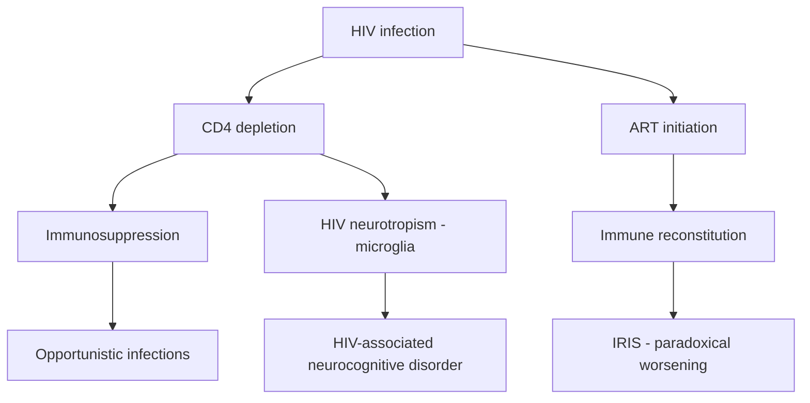
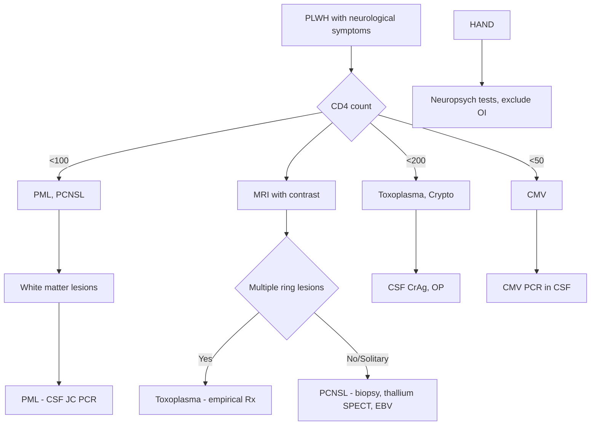

# HIV CNS Complications

> [!tip] **Definition:** Neurological disorders directly caused by HIV, opportunistic infections, IRIS, ART toxicity, or comorbid conditions in PLWH.
> **FCPS Pearl:** CNS disease occurs in **40-70%** of PLWH. CD4 count stratifies aetiology: **<200 → Toxoplasma, Crypto**; **<100 → PML, PCNSL**; **<50 → CMV**.

## 1. Definition / Epidemiology / Classification

### Definition
Spectrum of CNS disorders in PLWH including: (1) HIV-direct (HAND, aseptic meningitis, vacuolar myelopathy), (2) Opportunistic infections (Toxoplasma, Crypto, PML, TB, VZV, CMV), (3) Opportunistic tumours (PCNSL), (4) IRIS, (5) ART complications.

### Epidemiology
- **40-70% of PLWH** develop neurological disease
- **CD4 strata:**
  - >500: HAND, aseptic meningitis
  - 200-500: cryptococcal, TB
  - <200: Toxoplasma, Crypto
  - <100: PML, PCNSL
  - <50: CMV encephalitis

### Classification
| Category | Examples | CD4 Threshold |
|----------|----------|---------------|
| **HIV-direct** | HAND, aseptic meningitis, vacuolar myelopathy | Any |
| **Opportunistic — Protozoa** | Toxoplasmosis | <200 |
| **Opportunistic — Fungal** | Cryptococcal meningitis | <100 |
| **Opportunistic — Viral** | PML (JC), CMV encephalitis, VZV | <200 (PML/CMV <100) |
| **Opportunistic — Bacterial** | TB meningitis, neurosyphilis | Variable |
| **Tumours** | Primary CNS lymphoma | <100 |
| **IRIS** | Paradoxical worsening on ART | Variable |
| **ART toxicity** | Efavirenz neurotoxicity, IRIS | Variable |

## 2. Aetiology / Pathophysiology

### Pathophysiology by Category

### Molecular Basis
- **HIV tropism:** **Macrophages/microglia** (CD4 + CCR5); synaptodendritic injury
- **Toxoplasma:** Tachyzoites → bradyzoite cysts; **ring-enhancing lesions**
- **JC virus:** Reactivation in immunosuppression → **PML** (oligodendrocyte infection)
- **PCNSL:** EBV-driven B-cell lymphoma in CNS

## 3. Clinical Features

### Toxoplasmosis (CD4 <200)
- **Subacute (days-weeks):** Headache, confusion, focal deficit, seizures, fever
- **Multiple ring-enhancing lesions** in basal ganglia/corticomedullary junction

### Cryptococcal Meningitis
- **Subacute:** Headache, fever, altered consciousness; **markedly raised ICP** (often with minimal meningismus)
- See Chronic Meningitis chapter

### PML (CD4 <200, often <100)
- **Progressive (days-weeks):** Focal deficit, hemiparesis, visual field defect, ataxia, cognitive decline
- **Multifocal white matter lesions** (no mass effect, no enhancement)

### Primary CNS Lymphoma (CD4 <100)
- **Subacute:** Confusion, focal deficit, seizures, raised ICP
- **Solitary or few periventricular enhancing lesions** (often EBV-driven)

### HIV-Associated Neurocognitive Disorder (HAND)
- **Spectrum:** Asymptomatic neurocognitive impairment → **Mild Neurocognitive Disorder (MND)** → **HIV-associated dementia (HAD)**
- **Triad:** Cognitive decline, motor slowing, behavioural change
- **HAD:** Subcortical dementia — psychomotor slowing, retrieval deficit (vs Alzheimer's encoding deficit)

### HIV Myelopathy
- **Vacuolar myelopathy:** Spastic paraparesis, ataxia, urinary urgency (vit B12-deficiency-like)
- **Distal symmetric polyneuropathy:** Painful, length-dependent

### IRIS
- **Paradoxical worsening** of known OI (often TB, crypto) or **unmasking** of subclinical infection weeks-months after ART initiation
- **Risk:** Low CD4, high viral load, short interval to ART

### ART Toxicity
- **Efavirenz:** Vivid dreams, dizziness, depression, teratogenic
- **Zidovudine (AZT):** Myopathy
- **Stavudine (d4T):** Peripheral neuropathy, lactic acidosis, lipoatrophy
- **Tenofovir:** Nephrotoxicity

## 4. Diagnostic Approach

### HIV Staging
| WHO Stage | CD4 / Features |
|-----------|----------------|
| **Stage 4 (AIDS)** | CD4 <200 OR AIDS-defining illness |
| **CNS AIDS-defining** | Toxoplasmosis, PCNSL, cryptococcal meningitis, PML |

## 5. Investigations

### First-Line
| Test | Indication | Expected Finding |
|------|------------|------------------|
| **CD4 count** | All | Stratifies OI risk |
| **HIV viral load** | All | Correlates with disease activity |
| **MRI brain with contrast** | All focal/global | See imaging table |
| **CSF analysis** | Most cases | OI-specific tests |
| **Toxoplasma serology** | All (IgG) | Usually positive (latent) |

### MRI Findings
| Condition | Characteristic |
|-----------|----------------|
| **Toxoplasmosis** | **Multiple ring-enhancing lesions** in basal ganglia, corticomedullary junction; surrounding oedema |
| **PCNSL** | **Solitary or few periventricular enhancing lesions**; subependymal spread; often crosses corpus callosum |
| **PML** | **Multifocal asymmetric white matter lesions**, NO mass effect, NO enhancement (occasionally faint) |
| **Cryptococcoma** | Dilated perivascular spaces ("soap bubble"), gelatinous pseudocysts |
| **HAND** | MRI may be normal or show diffuse atrophy |
| **CMV** | Periventricular hyperintensity |
| **TB/tuberculoma** | Basal meningeal enhancement, ring-enhancing tuberculomas |

### CSF
| Test | Indication |
|------|------------|
| **CrAg** | All PLWH + headache (sensitivity >95%) |
| **JC virus PCR** | Suspected PML (sensitivity 70-90%) |
| **CMV PCR** | Suspected CMV encephalitis |
| **EBV PCR** | Supports PCNSL (when MRI suggestive) |
| **Cytology/Flow** | Lymphoma, carcinomatous |
| **TB PCR/ADA** | Suspected TBM |
| **VDRL** | Suspected neurosyphilis |
| **HSV/VZV PCR** | Encephalitis |

### Special Tests
- **Thallium-201 SPECT or PET:** PCNSL is **hot** (high uptake); toxoplasmosis is **cold** (low uptake) — helps differentiate
- **Brain biopsy:** If lesions don't respond to 2-week empirical toxoplasmosis treatment, consider lymphoma biopsy
- **FDG-PET:** Differentiates PCNSL from toxoplasmosis

## 6. Differential Diagnosis
| Differential | Distinguishing Features | Key Test |
|--------------|--------------------------|----------|
| **Toxoplasmosis vs PCNSL** | Toxo: multiple, basal ganglia, "cold" on SPECT; PCNSL: solitary, periventricular, "hot" on SPECT, EBV+ CSF | SPECT, EBV PCR, response to empirical Rx |
| **PML vs HIV encephalitis** | PML: focal, white matter, asymmetric; HE: diffuse, grey matter | MRI, JC PCR |
| **IRIS vs OI relapse** | IRIS: paradoxical worsening on ART; OI: inadequate Rx | Clinical, time course |
| **CMV vs HIV encephalitis** | CMV: periventricular, retinitis; HIV: diffuse | CSF CMV PCR |

## 7. Management

### Toxoplasmosis
| Drug | Dose | Duration |
|------|------|----------|
| **Pyrimethamine** | 200mg loading → 50-75mg/d | 6 weeks |
| **Sulfadiazine** | 1-1.5g q6h | 6 weeks |
| **Leucovorin (folinic acid)** | 10-25mg/d | Throughout (prevents pyrimethamine marrow toxicity) |
| **Alternative (sulfa allergy):** | **Pyrimethamine + Clindamycin 600mg q6h** | Same |
| **Adjunctive:** | **Dexamethasone** if significant oedema; **AED** for seizures |  |
- **Response:** Clinical + radiological improvement in **2 weeks** confirms diagnosis
- **No response:** Brain biopsy for lymphoma

### PML
- **ART intensification** (optimize immune reconstitution) — only proven therapy
- **No specific antiviral** for JC virus
- **Mirtazapine/mefloquin:** Investigational (in vitro anti-JC)
- **Prognosis:** Improved with ART; ~50-70% survival at 1 year

### PCNSL
- **ART intensification**
- **High-dose methotrexate ± cytarabine** (chemotherapy)
- **Whole-brain radiotherapy** (if chemo not feasible)
- **Prognosis:** Median survival 12-18 months

### Cryptococcal Meningitis
- See Chronic Meningitis chapter
- **Amphotericin B + flucytosine** → fluconazole

### HAND
- **ART intensification** (best Rx)
- **Optimize CNS-penetrating regimens** (zidovudine, abacavir, nevirapine, efavirenz)
- **Stimulant trial:** Methylphenidate for psychomotor slowing
- **Memantine:** Investigational

### IRIS
- **Continue ART** (do not stop)
- **Add corticosteroids** (prednisolone 1-2mg/kg)
- **Therapeutic LPs** for cryptococcal IRIS
- **Severe:** Temporarily hold ART (rare)

### ART Toxicity
- **Efavirenz:** Switch to nevirapine/integrase inhibitor
- **Stavudine (d4T):** Replace with TDF/TAF (peripheral neuropathy often irreversible)

## 8. Drug Cautions
| Drug | Caution | Management |
|------|---------|------------|
| **Pyrimethamine** | Marrow suppression | Folinic acid (NOT folic acid — interferes) |
| **Sulfadiazine** | Crystalluria, rash, marrow suppression | Hydrate, monitor U&E/FBC |
| **Amphotericin B** | Nephrotoxicity | Pre-hydrate, K+ |
| **Efavirenz** | Teratogenic, vivid dreams, depression | Avoid in pregnancy/psychiatric hx |
| **Stavudine** | Peripheral neuropathy, lactic acidosis | Replace with safer NRTI |
| **Methotrexate (high-dose)** | Nephrotoxicity, mucositis | Hydration, leucovorin, monitor |

## 9. Procedures

### Brain Biopsy
- **Indication:** Suspected PCNSL (no response to 2-week empirical toxoplasmosis Rx)
- **Approach:** Stereotactic; risks: haemorrhage, infection
- **Findings:** Lymphoma (EBV+ B-cell), toxoplasmosis, PML, others

### Therapeutic LP
- **Cryptococcal:** Daily in induction to control ICP (remove 20-30 mL)
- **Goal:** OP <25 cm H2O

## 10. Complications
| Complication | Frequency | Management |
|--------------|-----------|------------|
| **IRIS** | 10-25% (timing varies) | Steroids, continue ART |
| **Toxoplasma relapse** | 30% (without secondary prophylaxis) | Continue pyrimethamine/sulfadiazine until CD4 >200 × 3 months |
| **Seizures** | 10-30% | AED (avoid enzyme inducers with ART) |
| **Hydrocephalus** (crypto) | 10-20% | Serial therapeutic LPs, VP shunt |
| **Visual loss** (CMV retinitis) | 20-40% (untreated) | Ganciclovir, ophthalmology |
| **Polyneuropathy** | 30-50% (NRTI) | Switch ART, gabapentin |

## 11. Red Flags
| Red Flag | Action |
|----------|--------|
| **New focal deficit + CD4 <200** | MRI, consider toxoplasmosis vs PCNSL |
| **No response to empirical toxoplasmosis Rx 2 weeks** | Brain biopsy for PCNSL |
| **Worsening on ART** | Consider IRIS; do NOT stop ART; add steroids |
| **Visual symptoms + CD4 <50** | Urgent ophthalmology (CMV retinitis) |
| **↑↑ ICP + CD4 <100** | Therapeutic LPs, exclude crypto |

## 12. Prognosis
- **Toxoplasmosis:** 90% respond to Rx; mortality 5-10% with treatment
- **PML:** Improved with ART (~50-70% 1-year survival); 90% mortality without ART
- **PCNSL:** Median survival 12-18 months with chemo + ART
- **Cryptococcal:** 20-40% mortality in HIV+
- **HAND:** Improves with ART but may persist; HAD = poor prognosis
- **Overall:** ART dramatically improved outcomes

## 13. Topic Correlation
| Related Topic | Key Overlap |
|---------------|-------------|
| Toxoplasmosis | Most common focal lesion in HIV |
| PML | JC virus reactivation in AIDS |
| PCNSL | EBV-driven CNS lymphoma |
| Cryptococcal Meningitis | HIV OI |
| HIV-Associated Neurocognitive Disorder | Spectrum of HIV-direct disease |

## 14. Special Situations
| Situation | Consideration |
|-----------|---------------|
| **Pregnancy** | Avoid efavirenz (1st trimester); preferred: TDF/3TC/ATV/r; PJP prophylaxis safe |
| **Children** | HIV encephalopathy (regression of milestones); LIP (lymphoid interstitial pneumonitis) |
| **PJP prophylaxis** | CD4 <200 → co-trimoxazole |
| **Toxoplasma prophylaxis** | CD4 <100 + Toxo IgG+ → co-trimoxazole |
| **MAC prophylaxis** | CD4 <50 → azithromycin |
| **IRIS prevention** | Treat OI first, delay ART 2-8 weeks (varies by OI) |
| **Drug interactions** | ART + rifampicin (TB) — use efavirenz or double-dose lopinavir |

---

## FCPS/MRCP High-Yield Summary
| Category | Key Points |
|----------|------------|
| **Definition** | CNS disease in PLWH: HIV-direct, OI, IRIS, ART toxicity |
| **Epidemiology** | 40-70% develop neuro disease; CD4 stratifies risk |
| **Pathophysiology** | HIV neurotropism (microglia); CD4 depletion → OI |
| **Clinical** | Subacute focal/global; CD4 <200 = Toxo/Crypto; <100 = PML/PCNSL |
| **Diagnosis** | MRI + CSF (CrAg, JC PCR, EBV PCR); SPECT for Toxo vs PCNSL |
| **Management** | Toxoplasmosis: Pyrimethamine + sulfadiazine; PML: ART; PCNSL: chemo |
| **Complications** | IRIS, relapse, seizures, IRIS |
| **Prognosis** | ART improves all outcomes; PCNSL still poor |
| **Viva Pearls** | "CD4 stratifies OI"; "Thallium SPECT differentiates Toxo from PCNSL" |

## Viva Questions
1. **Q:** Most common CNS OI in HIV? **A:** Toxoplasmosis (CD4 <200).
2. **Q:** Empirical treatment for toxoplasmosis? **A:** Pyrimethamine + sulfadiazine + folinic acid.
3. **Q:** When to suspect PCNSL? **A:** Solitary periventricular enhancing lesion, EBV+ CSF, no response to 2-week empirical toxoplasmosis Rx.
4. **Q:** PML features? **A:** Multifocal white matter lesions, no enhancement, JC PCR+ CSF.
5. **Q:** PML treatment? **A:** ART intensification (only proven).
6. **Q:** Cryptococcal management? **A:** Amphotericin + flucytosine → fluconazole; therapeutic LPs.
7. **Q:** HAND triad? **A:** Cognitive decline, motor slowing, behavioural change.
8. **Q:** IRIS management? **A:** Continue ART, add steroids.
9. **Q:** Toxo vs PCNSL on thallium SPECT? **A:** Toxo = cold; PCNSL = hot.
10. **Q:** When to start PJP/Toxo prophylaxis? **A:** PJP at CD4 <200; Toxo at CD4 <100 + IgG+.

## Common Confusions
| Confusion | Clarification |
|-----------|---------------|
| Toxo vs PCNSL | Multiple ring = Toxo; solitary periventricular = PCNSL |
| PML vs HIV encephalitis | PML: focal white matter; HE: diffuse grey |
| IRIS vs OI relapse | IRIS: paradoxical on ART; relapse: Rx failure |
| CMV vs HIV encephalitis | CMV: periventricular, retinitis; HIV: diffuse |

## Mnemonics
1. **"CD4-OI"** = CD4 **<50** = CMV; **<100** = PML/PCNSL; **<200** = Toxo/Crypto
2. **"TOXOPLASMA"** = **T**hin-walled abscesses, **O**edema, **X**-linked? No, **O**bligate intracellular
3. **"PML"** = **P**rogressive, **M**ultifocal, **L**eukoencephalopathy (no enhancement)
4. **"IRIS"** = **I**mmune **R**econstitution **I**nflammatory **S**yndrome

## MCQs (10)
1. **Question:** Most common focal CNS lesion in HIV (CD4 <200):
   **Options:** A. PML B. Toxoplasmosis C. PCNSL D. Cryptococcoma
   **Answer:** B
2. **Question:** Empirical treatment for toxoplasmosis:
   **Options:** A. Ceftriaxone B. Pyrimethamine + sulfadiazine + folinic acid C. Ganciclovir D. Acyclovir
   **Answer:** B
3. **Question:** PML MRI feature:
   **Options:** A. Multiple ring-enhancing lesions B. Multifocal white matter lesions, no enhancement C. Solitary periventricular mass D. Basal meningeal enhancement
   **Answer:** B
4. **Question:** PCNSL distinguishing feature from toxoplasmosis:
   **Options:** A. Multiple lesions B. Solitary periventricular, "hot" on thallium SPECT, EBV+ CSF C. Basal ganglia location D. No enhancement
   **Answer:** B
5. **Question:** Treatment of PML:
   **Options:** A. Ganciclovir B. ART intensification C. Pyrimethamine D. Steroids
   **Answer:** B
6. **Question:** CD4 threshold for PJP prophylaxis:
   **Options:** A. <500 B. <200 C. <100 D. <50
   **Answer:** B
7. **Question:** Cryptococcal IRIS management:
   **Options:** A. Stop ART B. Continue ART + add steroids C. Restart amphotericin D. Switch ART
   **Answer:** B
8. **Question:** First-line cryptococcal induction:
   **Options:** A. Fluconazole alone B. Amphotericin B + flucytosine C. Caspofungin D. Voriconazole
   **Answer:** B
9. **Question:** HAND treatment:
   **Options:** A. Acyclovir B. ART intensification C. Steroids D. Pyrimethamine
   **Answer:** B
10. **Question:** Efavirenz main toxicity:
    **Options:** A. Nephrotoxicity B. CNS toxicity (vivid dreams, depression), teratogenic C. Pancreatitis D. Marrow suppression
    **Answer:** B

## SBA Questions (10)
1. **Scenario:** HIV+ with CD4 80, headache, focal seizure, MRI shows multiple ring-enhancing lesions.
   **Question:** Most likely diagnosis and Rx?
   **Options:** A. PCNSL; chemo B. Toxoplasmosis; pyrimethamine + sulfadiazine C. PML; ART D. Crypto; amphotericin
   **Answer:** B
2. **Scenario:** HIV+ with CD4 50, progressive hemiparesis, MRI shows white matter lesion, no enhancement. JC PCR+.
   **Question:** Treatment?
   **Options:** A. Pyrimethamine B. ART intensification C. Chemo D. Ganciclovir
   **Answer:** B
3. **Scenario:** HIV+ on ART 6 weeks, presents with worsening headache. CD4 rose from 30 to 150. MRI: tuberculoma enlargement.
   **Question:** Diagnosis and Rx?
   **Options:** A. TB relapse; switch Rx B. TB-IRIS; continue ART, add steroids C. New infection D. Stop ART
   **Answer:** B
4. **Scenario:** HIV+ with CD4 100, solitary periventricular enhancing lesion, EBV CSF PCR positive.
   **Question:** Diagnosis?
   **Options:** A. Toxoplasmosis B. PCNSL C. PML D. Tuberculoma
   **Answer:** B
5. **Scenario:** HIV+ with CD4 30, visual floaters, fundus shows retinitis with haemorrhage.
   **Question:** Diagnosis and Rx?
   **Options:** A. Toxo retinitis; pyrimethamine B. CMV retinitis; ganciclovir C. HIV retinopathy; ART D. HSV; acyclovir
   **Answer:** B
6. **Scenario:** HIV+ with CD4 60, 4-week headache. CSF CrAg positive. OP 35.
   **Question:** Treatment?
   **Options:** A. Fluconazole alone B. Amphotericin B + flucytosine; therapeutic LPs C. Pyrimethamine D. Acyclovir
   **Answer:** B
7. **Scenario:** HIV+ with CD4 100, no prior OI, asymptomatic. Toxo IgG+.
   **Question:** Prophylaxis?
   **Options:** A. Azithromycin B. Co-trimoxazole C. Ganciclovir D. None
   **Answer:** B
8. **Scenario:** HIV+ on efavirenz with vivid dreams, depression, suicide ideation.
   **Question:** Management?
   **Options:** A. Continue efavirenz B. Switch ART regimen (e.g., to integrase inhibitor) C. Add haloperidol D. Hospitalise, no change
   **Answer:** B
9. **Scenario:** HIV+ with CD4 80, treated for toxoplasmosis 3 weeks ago, no clinical/radiological improvement.
   **Question:** Next step?
   **Options:** A. Continue Rx B. Brain biopsy (consider PCNSL) C. Add steroids D. Stop Rx
   **Answer:** B
10. **Scenario:** HIV+ with progressive cognitive decline, MMSE 20/30, MRI normal.
    **Question:** Diagnosis?
    **Options:** A. Toxoplasmosis B. HAND (HIV-associated neurocognitive disorder) C. PML D. CMV
    **Answer:** B

## Flashcards
- **Q:** Most common focal CNS lesion HIV? **A:** Toxoplasmosis (CD4 <200).
- **Q:** Empirical Toxo Rx? **A:** Pyrimethamine + sulfadiazine + folinic acid.
- **Q:** PML MRI? **A:** Multifocal white matter, no enhancement.
- **Q:** PCNSL distinguishing? **A:** Solitary periventricular, "hot" on SPECT, EBV+ CSF.
- **Q:** PML Rx? **A:** ART intensification.
- **Q:** HAND triad? **A:** Cognitive decline, motor slowing, behavioural change.
- **Q:** IRIS Rx? **A:** Continue ART, add steroids.
- **Q:** Toxo vs PCNSL SPECT? **A:** Toxo = cold; PCNSL = hot.
- **Q:** PJP prophylaxis CD4? **A:** <200 → co-trimoxazole.
- **Q:** Toxo prophylaxis CD4? **A:** <100 + IgG+ → co-trimoxazole.

## Answer Key with Explanations
**MCQs:**
1. **B** — Toxoplasmosis = most common focal lesion
2. **B** — Pyrimethamine + sulfadiazine + folinic acid
3. **B** — PML: white matter, NO enhancement
4. **B** — Solitary periventricular + SPECT hot + EBV+ = PCNSL
5. **B** — Only proven Rx for PML is ART
6. **B** — PJP prophylaxis at CD4 <200
7. **B** — IRIS: continue ART, add steroids (don't stop)
8. **B** — Amphotericin + flucytosine is gold standard
9. **B** — ART intensification is mainstay
10. **B** — Efavirenz = CNS toxicity + teratogenic

**SBAs:**
1. **B** — Multiple ring-enhancing in HIV = Toxo
2. **B** — PML: white matter, no enhancement, JC+ = ART
3. **B** — Worsening on ART + new finding = IRIS; steroids, continue ART
4. **B** — Solitary + periventricular + EBV+ = PCNSL
5. **B** — CD4 <50 + retinitis + haemorrhage = CMV; ganciclovir
6. **B** — CrAg+ + ↑↑OP = crypto; amphotericin + flucytosine + LPs
7. **B** — Toxo prophylaxis at CD4 <100 + IgG+ = co-trimoxazole
8. **B** — Efavirenz toxicity = switch to integrase inhibitor
9. **B** — No response to empirical Toxo Rx → biopsy for PCNSL
10. **B** — Cognitive decline + normal MRI + CD4 low = HAND

## PasTest Scenario SBAs (Clinical Vignettes)

> **Auto-generated PasTest/Mediscope-style scenario SBAs** grounded in the authored source. Each scenario tests a real clinical fact (triad, specific sign, contraindication, trial, first-line Rx) extracted from the topic. *Source: Ch 27: Neurology & Stroke — HIV CNS Complications*

**Q1.** Which of the following features is most specific or characteristic of HIV CNS Complications?

  - **A.** CSF analysis
  - **B.** A feature common to many acute inflammatory conditions
  - **C.** A non-specific sign that does not localise the diagnosis
  - **D.** An investigation finding rather than a clinical feature

  > **Answer: A** — CSF analysis
  >
  > *Source:* es with disease activity |
| **MRI brain with contrast** | All focal/global | See imaging table |
| **CSF analysis** | Most cases | OI-specific tests |
| **Toxoplasma serology** | All (IgG) | Usually 

**Q2.** What is the most appropriate first-line therapy for HIV CNS Complications?

  - **A.** ART intensification
  - **B.** An advanced/surgical therapy reserved for refractory disease
  - **C.** Symptomatic treatment only, no disease-modifying therapy
  - **D.** Empiric broad-spectrum therapy without specific indication

  > **Answer: A** — ART intensification
  >
  > *Source:* **ART intensification** (optimize immune reconstitution) — only proven therapy

