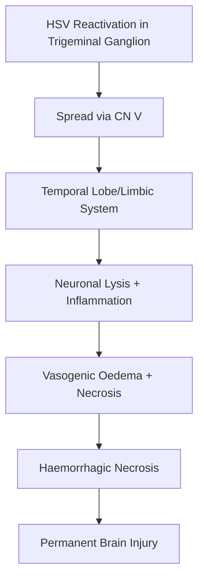
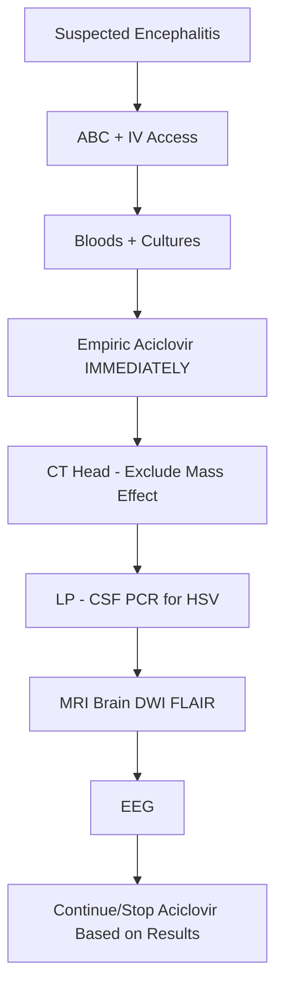
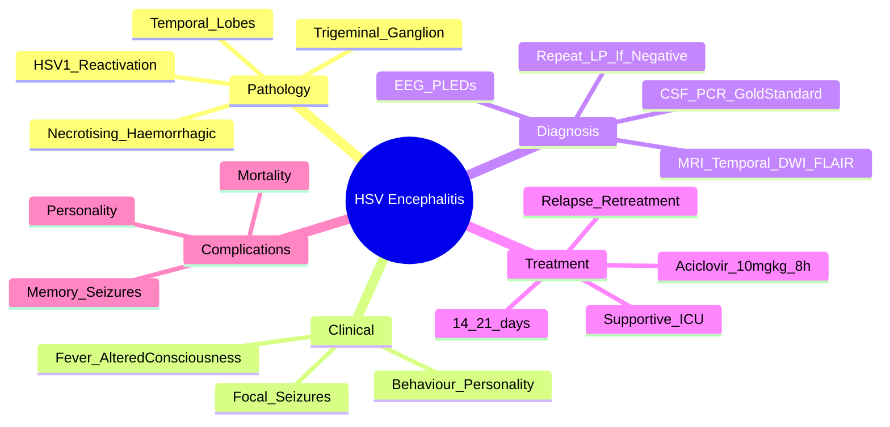

# HSV Encephalitis

> [!tip] **HSV-1 encephalitis = acute febrile illness + altered consciousness + behavioural change + focal neurology/TEMPORAL LOBE signs**
> **MRI (DWI/FLAIR): temporal lobe hyperintensity**; **CSF PCR** for HSV = gold standard
> **Aciclovir 10 mg/kg IV q8h ×14-21 days** — start empirically IMMEDIATELY (don't wait for LP/PCR!)

## 1. Definition / Epidemiology / Classification

### Definition
Acute viral infection of the brain parenchyma, most commonly caused by **HSV-1 (95% adult)**, affecting the **temporal lobes** and limbic system, presenting with fever, altered consciousness, behavioural change, and focal neurological deficits.

### Epidemiology
- **Incidence:** 1-2/100,000/year (HSV); 5-10/100,000/year (all encephalitis)
- **Age:** Bimodal — young adults (5-30y) + elderly (>50y); affects all ages including neonates
- **Sex:** M = F
- **Mortality (untreated):** 70-80%
- **Mortality (treated):** 20-30%
- **Sequelae:** 50-70% survivors have neurological deficits

### Pathogens
| Pathogen | Notes |
|----------|-------|
| **HSV-1** | **95% adult encephalitis**; temporal/limbic |
| **HSV-2** | Neonates (disseminated); adults (meningitis, recurrent Mollaret's) |
| **VZV** | Post-infectious cerebellitis; vasculopathy (granulomatous arteritis) |
| **EBV** | Immunocompromised |
| **CMV** | Immunocompromised (HIV/AIDS) |
| **Enteroviruses** | Children, mild |
| **Arboviruses** | West Nile, Japanese B, Tick-borne |

---

## 2. Aetiology / Pathophysiology

### Aetiology / Risk Factors
- **Reactivation:** HSV-1 in trigeminal ganglion → spread to meninges → temporal lobe
- **Primary infection:** Less common (esp. children)
- **Risk factors:** Immunocompromise, age (extremes)

### Pathophysiology

### Pathology
- **Acute haemorrhagic necrotising encephalitis**
- **Temporal lobes, inferior frontal, cingulate, insula**
- **Cowan A intranuclear inclusions**
- **Perivascular cuffing, neuronal loss, microglial nodules**

---

## 3. Clinical Features

### Hallmark Presentation
- **Fever** (90%)
- **Altered consciousness** (confusion, drowsiness, coma)
- **Behavioural/personality change** (frontal/temporal)
- **Headache** (80%)
- **Focal neurology** (60%): aphasia, hemiparesis, visual field defects
- **Seizures** (40-60%): focal or secondary generalised
- **Psychiatric features:** psychosis, agitation, hallucinations

### Examination Findings
| Sign | Localisation |
|------|--------------|
| **Aphasia** | Dominant temporal |
| **Visual field defects** | Temporal/parieto-occipital |
| **Hemiparesis** | Adjacent motor cortex |
| **Memory deficits** | Hippocampal involvement |
| **Personality change** | Frontal/limbic |
| **Complex partial seizures** | Mesial temporal |

### Specific Forms
- **Neonatal HSV encephalitis:** Disseminated; HSV-2 (vertical transmission); high mortality
- **HSV-2 meningitis:** Recurrent (Mollaret's); lymphocytic; benign
- **Atypical/chronic:** Subacute presentation in immunocompromised

---

## 4. Diagnostic Approach / Algorithm

### UK Aetiology (2013-2016 Study)
- **40% Unknown**
- **15-20% HSV-1**
- **Anti-NMDA receptor encephalitis (immune)**
- **Other infections, vasculitis**

### When to Suspect Encephalitis (NICE NG240)
**Suspect encephalitis if:** Fever + altered consciousness + behavioural change ± seizures ± focal neurology.

---

## 5. Investigations

### Immediate (with treatment initiation)
| Test | Indication | Finding |
|------|------------|---------|
| **Bloods** | All | FBC, U&E, LFT, glucose, CRP, blood cultures |
| **CT Head** | All suspected (exclude mass, abscess, contraindication for LP) | Often normal early; temporal hypodensity/oedema late |
| **MRI Brain (DWI, FLAIR, T2)** | All | **Temporal lobe hyperintensity** (DWI most sensitive early); haemorrhage (T2*/SWI) |
| **LP (CSF)** | All (after CT if needed) | See below |

### CSF Analysis
| Parameter | Typical HSV Encephalitis |
|-----------|--------------------------|
| **Opening pressure** | ↑ |
| **WCC** | 10-500 (predominantly lymphocytes); may be neutrophils early |
| **Protein** | ↑ (0.5-1.5 g/L) |
| **Glucose** | Normal (usually) |
| **HSV PCR** | **Gold standard** (sensitivity 95-99%, specificity >99%) |
| **Repeat LP** | If initial PCR negative but clinical suspicion high (PCR false-negative in first 48-72h) |

### MRI Characteristics
| Sequence | Finding |
|----------|---------|
| **T2/FLAIR** | Hyperintensity in **medial temporal lobes**, insula, inferior frontal, cingulate |
| **DWI** | Restriction (acute injury); most sensitive early |
| **T1 + gad** | Patchy enhancement |
| **T2*/SWI** | Haemorrhage (T2*) — characteristic |
| **Asymmetry** | Common (unilateral initially) |

### EEG
- **Periodic lateralised epileptiform discharges (PLEDs)** — characteristic (not pathognomonic)
- **Temporal slowing**, seizure activity

### When to Consider
| Test | Indication |
|------|------------|
| **Autoimmune encephalitis panel** | Atypical, young female, NMDA-R features |
| **HIV test** | All suspected |
| **Brain biopsy** | Rarely; if deteriorating despite treatment |
| **Serum HSV IgG/IgM** | Limited value (sero-prevalence high) |

---

## 6. Differential Diagnosis
| Condition | Distinguishing Feature |
|-----------|----------------------|
| **Autoimmune encephalitis (anti-NMDA-R)** | Young female, psychiatric, seizures, dyskinesias, teratoma; CSF/serum antibodies |
| **LGI1/CASPR2 encephalitis** | Older, faciobrachial dystonic seizures, hyponatraemia |
| **Bacterial meningitis** | Fever + meningism (no focal/temporal); CSF neutrophilic |
| **Brain abscess** | Focal, ring-enhancing, mass effect |
| **Cerebral venous thrombosis** | Headache, seizures, MRV; CT/MR venography |
| **Cerebellitis** | Ataxia prominent; VZV |
| **CJD** | Rapid dementia, myoclonus, PSWCs; 14-3-3 |
| **Acute disseminated encephalomyelitis (ADEM)** | Multifocal, post-infectious; perivenous demyelination |
| **Vasculitis (PACNS)** | Multifocal, stepwise, angiography |
| **Metabolic encephalopathy** | No fever; reversible |

---

## 7. Management

### Emergency — **Start Aciclovir IMMEDIATELY**
| Action | Timing | Detail |
|--------|--------|--------|
| **ABCs** | Immediate | Secure airway if GCS ↓ |
| **Empiric Aciclovir** | **Within 1 hour of suspected diagnosis** | **10 mg/kg IV q8h** |
| **Empiric antibiotics** | If bacterial meningitis possible | Ceftriaxone + ampicillin |
| **LP** | After CT if needed | Send CSF PCR |
| **MRI** | Urgent | Temporal lobe changes |
| **EEG** | For seizures | PLEDs characteristic |
| **Anticonvulsants** | If seizures | Levetiracetam |

### Aciclovir Specifics
| Parameter | Detail |
|-----------|--------|
| **Dose** | **10 mg/kg IV q8h** (15 mg/kg in immunocompromised/HSV-2 meningitis) |
| **Duration** | **14 days** (immunocompetent); **21 days** (immunocompromised, neonates, severe) |
| **Renal dosing** | CrCl 25-50: q12h; CrCl 10-25: q24h |
| **Side effects** | Crystalluria/nephrotoxicity (IV fluids), neurotoxicity (confusion, tremor, hallucinations), thrombophlebitis |
| **Monitoring** | U&E daily; urine output; neurological status |
| **Switch to oral** | ONLY when patient improving + can swallow; valaciclovir 1g TDS (rare in encephalitis) |

> [!tip] **Do NOT stop aciclovir based on a single negative PCR in first 48h** — repeat LP if clinical suspicion remains. False negatives early.

### Supportive Care
- **ICU admission:** GCS ↓, seizures, raised ICP
- **Head elevation, ICP management** (mannitol, hypertonic saline)
- **Seizure control:** Levetiracetam preferred; consider cEEG if not waking
- **Mechanical ventilation if required**
- **DVT prophylaxis**
- **Fluid balance, electrolytes**
- **Nutrition (NG tube if NBM)**
- **VTE prophylaxis**

### Relapse Management
- **Suspect:** New symptoms/signs after completion of treatment; may be due to:
  - True viral relapse (incomplete treatment, immunocompromise)
  - Post-infectious immune-mediated encephalitis
- **Re-treatment:** Aciclovir 21-day course if relapse
- **Consider steroids:** For immune-mediated post-HSV encephalitis

### Steroid Use — **CONTROVERSIAL**
- **Not routinely recommended** (no RCT evidence for benefit)
- **Consider:** Mass effect, severe oedema, immune-mediated relapse

### Rehabilitation
- **MDT:** PT, OT, SALT, neuropsychology
- **Cognitive rehabilitation:** Memory, executive function
- **Antiepileptic drug continuation:** If seizures during illness (often lifelong)
- **Long-term follow-up:** Memory, behaviour, seizures

---

## 8. Drug Interactions / Cautions
| Drug | Caution |
|------|---------|
| **Aciclovir + nephrotoxic drugs** | ↑ Nephrotoxicity (cyclosporine, tacrolimus, aminoglycosides) |
| **Aciclovir renal dose** | CrCl adjust; IV fluids to prevent crystalluria |
| **Probenecid** | ↓ Aciclovir clearance |
| **Methotrexate** | ↑ Toxicity |

---

## 9. Procedures
### Lumbar Puncture
- **Indication:** All suspected encephalitis (after CT if needed)
- **CSF for:** HSV PCR, WBC, protein, glucose, bacterial culture, oligoclonal bands (later)
- **Contraindications:** Mass effect, raised ICP, coagulopathy, cardiorespiratory instability

### MRI Brain
- **Indication:** All suspected encephalitis; repeat if initially normal and clinical suspicion high
- **Sequences:** DWI (most sensitive early), FLAIR, T2, T1+contrast, T2*/SWI (haemorrhage)
- **Findings:** Temporal lobe (medial) hyperintensity, asymmetry

### EEG
- **Indication:** Altered consciousness, suspected non-convulsive status
- **Finding:** PLEDs, temporal slowing, seizure activity

---

## 10. Complications
| Complication | Frequency | Management |
|--------------|-----------|------------|
| **Mortality** | 20-30% (treated); 70-80% (untreated) | Early treatment |
| **Cognitive impairment** | 50-70% survivors | Rehabilitation |
| **Memory deficit** | Common | Strategies, neuropsychology |
| **Seizures** | 30-40% | Anticonvulsants (often lifelong) |
| **Personality change** | Common | Family support, behaviour therapy |
| **Aphasia** | Common | SALT |
| **Korsakoff-like amnesia** | Severe cases | Supportive |
| **Hydrocephalus** | Rare | Shunt |

---

## 11. Red Flags
| Red Flag | Action |
|----------|--------|
| **GCS <8 / coma** | ICU; intubation |
| **Status epilepticus** | ICU; cEEG; anaesthetics |
| **Petechial rash** | Consider meningococcal; start ceftriaxone |
| **Immunocompromised** | Add broad cover; longer aciclovir (21d) |
| **No improvement at 48-72h** | Repeat LP; consider autoimmune |
| **Relapse after treatment** | Re-treat aciclovir; consider immune; ±steroids |

---

## 12. Prognosis
| Factor | Good | Poor |
|--------|------|------|
| **Age** | <30y | >50y |
| **Onset to treatment** | <2 days | >4 days |
| **GCS at admission** | 13-15 | <8 |
| **MRI** | Unilateral temporal | Bilateral, extensive |
| **Seizures** | None or controlled | Status epilepticus |
| **Immune status** | Competent | Immunocompromised |

- **Mortality:** 20-30% with treatment
- **Survivors:** 50-70% neurological sequelae (memory, personality, seizures)

---

## 13. Topic Correlation
| Topic | Overlap |
|-------|---------|
| **Autoimmune Encephalitis** | NMDA-R, LGI1; mimic; antibody testing |
| **Bacterial Meningitis** | Co-existing (treat empirically) |
| **Brain Abscess** | Focal, ring-enhancing |
| **Cerebral Venous Thrombosis** | Headache, seizures; MRV |
| **CJD** | Rapid dementia, PSWCs |

---

## 14. Special Situations
- **Pregnancy:** Aciclovir considered safe; avoid chloramphenicol; multidisciplinary
- **Paediatric:** Neonatal HSV-2 (disseminated); aciclovir 20 mg/kg IV q8h for HSV encephalitis
- **Elderly:** Worse prognosis; consider autoimmune (LGI1)
- **Immunocompromised:** Add CMV/VZV/EBV cover (ganciclovir?); longer aciclovir (21d); ID input
- **Driving (DVLA):** Notify; medical assessment; depends on residual deficit (seizures, cognition)

---

## FCPS/MRCP High-Yield Summary
| Category | Key Points |
|----------|------------|
| **Pathogen** | HSV-1 (95% adult), HSV-2 (neonates) |
| **Localisation** | **Temporal lobes, limbic system, inferior frontal, insula** |
| **Clinical** | Fever + altered consciousness + behavioural change + focal |
| **Diagnosis** | **CSF PCR** (gold standard) + **MRI** (temporal lobe hyperintensity) |
| **EEG** | PLEDs (periodic lateralised epileptiform discharges) |
| **Treatment** | **Aciclovir 10 mg/kg IV q8h ×14-21d** — start IMMEDIATELY |
| **Don't** | Wait for PCR result before starting; stop early based on single negative PCR |
| **Relapse** | Re-treat; consider immune-mediated; ±steroids |
| **Complications** | Memory, seizures, personality change |
| **Mortality** | 20-30% (treated); 70-80% (untreated) |

---

## Viva Questions
1. **HSV encephalitis localisation?** Temporal lobes, limbic, insula, inferior frontal.
2. **Aciclovir dose and duration?** **10 mg/kg IV q8h ×14 days** (21d in immunocompromised).
3. **When to start aciclovir?** **Immediately** when suspected — don't wait for LP/PCR.
4. **Diagnostic gold standard?** **CSF HSV PCR** (95-99% sensitivity).
5. **MRI finding?** **Medial temporal lobe hyperintensity** (DWI/FLAIR); asymmetry common.
6. **EEG finding?** **PLEDs** (periodic lateralised epileptiform discharges).
7. **CSF typical?** ↑WCC (lymphocytic), ↑protein, normal glucose.
8. **When to repeat LP?** If clinical suspicion remains high and initial PCR negative (especially if first LP within 48h).
9. **Cause of relapse?** Incomplete treatment OR immune-mediated post-infectious encephalitis.
10. **Mortality untreated vs treated?** Untreated 70-80%; Treated 20-30%.

---

## Common Confusions
| Confusion | Clarification |
|-----------|---------------|
| **HSV vs NMDA-R encephalitis** | HSV: fever, temporal; NMDA: psychiatric, dyskinesias, ovarian teratoma |
| **Stop aciclovir if PCR negative** | NO — repeat LP if clinical suspicion remains (early false negative) |
| **Bilateral temporal involvement** | HSV is often unilateral/bilateral asymmetric; bilateral symmetric = consider ischaemia, paraneoplastic |
| **Aciclovir dose in obesity** | Use ideal body weight + adjust; can use adjusted body weight |
| **Aciclovir renal toxicity** | Crystalluria; prevent with IV fluids; dose adjust for CrCl |
| **Repeat MRI** | Useful to monitor; may become more extensive before improving |

---

## Mnemonics
1. **HSV encephalitis features:** "**F**ever, **A**ltered consciousness, **B**ehaviour change, **F**ocal signs" — "FABF"
2. **Aciclovir dose:** "**10, 8, 14-21**" — 10 mg/kg, q8h, 14-21 days
3. **MRI:** "**T**emporal lobe, **T**wo sides asymmetric" (usually)
4. **Don't delay:** "**Treat First, Test Later**"

---

## Mind Map

---

## One-Page Revision Card
| **Topic** | **HSV Encephalitis** |
|-----------|----------------------|
| **Pathogen** | HSV-1 (95%); HSV-2 (neonates) |
| **Localisation** | Temporal lobes, limbic, insula, inferior frontal |
| **Clinical** | Fever + altered consciousness + behaviour + focal |
| **MRI** | Medial temporal lobe hyperintensity (DWI/FLAIR); asymmetry |
| **EEG** | PLEDs characteristic |
| **Diagnosis** | CSF HSV PCR (gold standard) |
| **Treatment** | **Aciclovir 10 mg/kg IV q8h ×14-21 days** — IMMEDIATELY |
| **Don't delay** | Start before LP/PCR result; don't stop on single early negative |
| **Relapse** | Re-treat aciclovir; consider immune ±steroids |
| **Mortality** | 20-30% (treated); 70-80% (untreated) |

---

## MCQs (10)

1. **HSV encephalitis affects which area primarily?**
   A. Cerebellum B. **Temporal lobes** C. Frontal lobe D. Parietal
   *Answer: B*

2. **Aciclovir dose for HSV encephalitis:**
   A. 5 mg/kg IV q8h B. **10 mg/kg IV q8h** C. 15 mg/kg IV q12h D. 500 mg PO q8h
   *Answer: B*

3. **Gold standard diagnosis:**
   A. EEG B. MRI C. **CSF PCR for HSV** D. Serum antibodies
   *Answer: C*

4. **Aciclovir should be started:**
   A. After LP confirms HSV B. After MRI confirms C. **Immediately on clinical suspicion** D. Only in PCR-positive
   *Answer: C*

5. **PLEDs on EEG suggest:**
   A. CJD B. **HSV encephalitis** C. NMDA-R encephalitis D. Status epilepticus
   *Answer: B*

6. **CSF in HSV encephalitis typically shows:**
   A. Neutrophilic pleocytosis B. **Lymphocytic pleocytosis + ↑protein** C. ↓ Protein D. ↓ Glucose
   *Answer: B*

7. **Duration of aciclovir treatment in immunocompetent:**
   A. 7 days B. **14 days** C. 28 days D. 6 weeks
   *Answer: B*

8. **Acyclovir renal dose adjustment is based on:**
   A. Age B. **Creatinine clearance** C. BP D. Urine output only
   *Answer: B*

9. **Most common cause of sporadic encephalitis in adults is:**
   A. VZV B. EBV C. **HSV-1** D. Enterovirus
   *Answer: C*

10. **Relapse of HSV encephalitis may be due to:**
    A. Antibiotic resistance B. **Incomplete treatment or immune-mediated** C. Bacterial superinfection D. CSF leak
    *Answer: B*

---

## SBAs (10)

1. **A 35-year-old has fever, headache, confusion, and aphasia. MRI shows left temporal lobe hyperintensity. Best management?**
   A. Wait for LP B. **Start aciclovir 10 mg/kg IV q8h immediately** C. Steroids alone D. Wait for culture
   *Answer: B* — Clinical + MRI = start aciclovir immediately; don't delay.

2. **A 40-year-old with fever, confusion, personality change. CT normal. LP shows lymphocytic pleocytosis, ↑protein. CSF PCR for HSV sent. Best management?**
   A. Wait for PCR B. **Start aciclovir empirically** C. Antibiotics only D. Antivirals if PCR+
   *Answer: B* — Empiric aciclovir in suspected encephalitis; don't wait.

3. **A patient with HSV encephalitis on aciclovir develops AKI. Next step?**
   A. Stop aciclovir B. **Dose adjust for CrCl; ensure hydration** C. Switch to ganciclovir D. Continue same dose
   *Answer: B* — Renal dose adjustment; prevent crystalluria with IV fluids.

4. **CSF PCR for HSV is negative at 24 hours in a patient with classic clinical features. Best next step?**
   A. Stop aciclovir B. **Continue aciclovir; repeat LP at 48-72h** C. Switch antibiotics D. Brain biopsy
   *Answer: B* — False-negative PCR early (first 48h); repeat if suspicion high.

5. **A patient with HSV encephalitis improves on aciclovir but 1 week after stopping develops new symptoms. Best management?**
   A. Wait B. **Restart aciclovir + consider steroids (immune-mediated)** C. Antibiotics D. IVIG
   *Answer: B* — Relapse may be viral or immune-mediated; re-treat.

6. **HSV encephalitis is associated with which antibody?**
   A. NMDA-R B. LGI1 C. **Anti-HSV IgG in CSF** D. No antibodies
   *Answer: C* — Diagnosis by CSF PCR (DNA); CSF IgG may be supportive.

7. **Aciclovir mechanism of action:**
   A. DNA polymerase inhibitor (host) B. **Viral DNA polymerase inhibitor (after phosphorylation)** C. Reverse transcriptase inhibitor D. Protease inhibitor
   *Answer: B* — Aciclovir phosphorylated → inhibits viral DNA polymerase.

8. **A neonate with HSV encephalitis. Aciclovir dose:**
   A. 10 mg/kg q8h B. **20 mg/kg IV q8h** C. 5 mg/kg IV q12h D. 30 mg/kg IV q12h
   *Answer: B* — Neonates require higher dose (20 mg/kg IV q8h) for HSV encephalitis.

9. **EEG showing periodic lateralised epileptiform discharges (PLEDs) is most characteristic of:**
   A. CJD B. **HSV encephalitis** C. Status epilepticus D. NMDA-R encephalitis
   *Answer: B* — PLEDs classically associated with HSV encephalitis.

10. **A patient with HSV encephalitis has refractory status epilepticus. Best management?**
    A. Continue aciclovir only B. **Anaesthetics + cEEG; ensure aciclovir dose adequate** C. Stop aciclovir D. Add only levetiracetam
    *Answer: B* — Treat status with anaesthetics (midazolam, propofol); ensure aciclovir is being given correctly.

---

## Flashcards

- **Q:** HSV encephalitis localisation?
  **A:** Temporal lobes, limbic, insula, inferior frontal
- **Q:** Aciclovir dose?
  **A:** 10 mg/kg IV q8h (15 mg/kg immunocompromised)
- **Q:** Duration of treatment?
  **A:** 14 days (immunocompetent); 21 days (immunocompromised/neonates)
- **Q:** Gold standard diagnosis?
  **A:** CSF HSV PCR
- **Q:** MRI finding?
  **A:** Medial temporal hyperintensity (DWI/FLAIR)
- **Q:** EEG finding?
  **A:** PLEDs (periodic lateralised epileptiform discharges)
- **Q:** When to repeat LP?
  **A:** If initial PCR negative + clinical suspicion (early false negative)
- **Q:** Relapse causes?
  **A:** Incomplete treatment OR immune-mediated post-infectious
- **Q:** Mortality untreated?
  **A:** 70-80%
- **Q:** Most common cause of sporadic encephalitis?
  **A:** HSV-1

---

## Answer Key

### MCQs
1. **B** — Temporal lobes
2. **B** — 10 mg/kg IV q8h
3. **C** — CSF PCR gold standard
4. **C** — Start immediately
5. **B** — PLEDs suggest HSV
6. **B** — Lymphocytic CSF
7. **B** — 14 days
8. **B** — Renal dose adjust for CrCl
9. **C** — HSV-1 most common
10. **B** — Relapse = viral or immune

### SBAs
1. **B** — Start aciclovir immediately
2. **B** — Empirical aciclovir
3. **B** — Renal adjust + hydrate
4. **B** — Repeat LP, continue aciclovir
5. **B** — Re-treat ± steroids
6. **C** — CSF anti-HSV IgG (CSF PCR for DNA)
7. **B** — Viral DNA polymerase inhibitor
8. **B** — Neonates 20 mg/kg q8h
9. **B** — PLEDs = HSV
10. **B** — Anaesthetics + cEEG + aciclovir

---

## Local Navigation
**Heading Hub:** [[12_CNS_Infections/CNS Infections Hub]]
**Topic-Group Hub:** [[12_CNS_Infections/CNS Infections MOC]]
**Chapter Hierarchy:** [[Davidson Chapter 25 - Neurology Hierarchy]]
