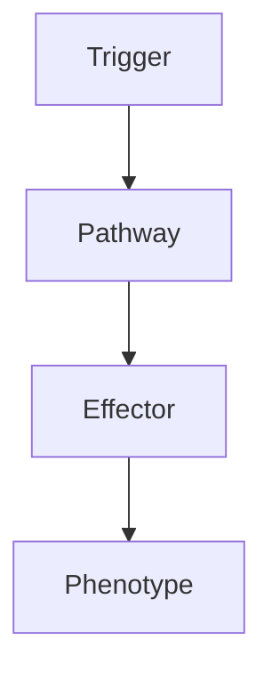

# Neurocysticercosis

> [!tip] **High-Yield Definition**
> Neurocysticercosis: CNS infection with larval stage of Taenia solium (pork tapeworm). Endemic (Latin America, sub-Saharan Africa, Asia, especially rural, poor sanitation). Most common parasitic CNS infection. Seizures, hydrocephalus, headache, focal neurology.

---

## 1. Definition / Epidemiology / Classification

### Definition
Neurocysticercosis: CNS infection with larval stage of Taenia solium (pork tapeworm). Endemic (Latin America, sub-Saharan Africa, Asia, especially rural, poor sanitation). Most common parasitic CNS infection. Seizures, hydrocephalus, headache, focal neurology.

### Epidemiology
Prevalence: 0.5-1% in endemic areas. 50 million cases worldwide. Most common parasitic CNS infection, leading cause of adult-onset seizures in endemic areas. Endemic: Latin America, sub-Saharan Africa, India, China, Southeast Asia, Indonesia. Children > adults. Risk factors: rural, poor sanitation, pig farming, eating undercooked pork, faecal-oral.

---

## 2. Aetiology / Pathophysiology

### Aetiology
Taenia solium: pork tapeworm. Life cycle: humans (definitive host, intestinal tapeworm), pigs (intermediate host, larval cysts), humans (intermediate host - cysticercosis, faecal-oral ingestion of eggs). Cysts: brain (parenchymal, extraparenchymal - subarachnoid, ventricular, spinal), muscle, eye, subcutaneous. Stages: viable (vesicular - clear fluid, viable scolex, no inflammation), transitional (colloidal - degenerating, inflammation, oedema, enhancement, symptomatic), calcified (chronic, dead, calcified nodule, may have oedema - usually symptomatic).

### Pathophysiology

---

## 3. Clinical Features

Most asymptomatic. Symptomatic: parenchymal (seizures - 80%, focal, secondary generalised, multiple), extraparenchymal (subarachnoid - basilar arachnoiditis, hydrocephalus, vasculitis, stroke, cranial nerve, visual loss, meningitis, mass effect), ventricular (4th ventricle, hydrocephalus, Bruns syndrome - positional headaches, vomiting, papilloedema, sudden death), spinal (rare, myelopathy, radiculopathy), ocular (1-3%, vitreous, subretinal, visual loss, vitritis). Other: headache (raised ICP, hydrocephalus), cognitive impairment, psychiatric, focal neurology, gait disturbance, vomiting, papilloedema, fever (rare).

---

## 4. Investigations

Bloods: FBC, U&Es, LFTs, ESR, CRP, autoimmune, HIV. Serology: ELISA for T. solium antibodies, EITB (more specific, sensitive, gold standard). Stool: T. solium eggs. CSF: pleocytosis (lymphocytic, may be eosinophilic, mixed), protein, glucose (low in subarachnoid), OCBs, antibody (intrathecal). Imaging: MRI brain with contrast (cyst with scolex - hole-with-dot sign, viable; colloidal - ring enhancement, oedema; calcified - dead, calcified nodule, may have oedema, susceptibility or T2* GRE), CT head (calcifications - sensitive).

---

## 5. Management

Antiparasitic: albendazole 15mg/kg/day (max 800mg/day) × 14-28 days, praziquantel 50mg/kg/day × 14 days. Steroids: dexamethasone 0.1mg/kg or prednisolone 1mg/kg/day, taper, start 1-2 days before antiparasitic. Antiepileptics: carbamazepine, levetiracetam, valproate. Hydrocephalus: ventricular (VP shunt, ETV, urgent), subarachnoid (VP shunt, prolonged course). Stroke: aspirin (controversial), steroids, rehabilitation. Surgical: excision (single, accessible, large, mass effect, obstructive hydrocephalus, ventricular - open, endoscopic). Ocular: surgery - antiparasitic worsens. Multidisciplinary: neurology, infectious diseases, neurosurgery, ICU, OT, PT, SLT, dietitian, ophthalmology, public health, palliative, social, psychology. Prevention: sanitation, pig farming, meat inspection, cooking. Monitor: clinical, MRI (3, 6, 12 months), cyst evolution, seizures, oedema, hydrocephalus, neurological, antiepileptic levels, albendazole side effects, eye examination, serology, public health (contact tracing, sanitation, meat inspection, deworming, screening).

---

## 6. Red Flags / Emergencies

EMERGENCY: raised ICP, hydrocephalus, Bruns syndrome (positional, 4th ventricle, sudden death), status epilepticus, stroke (vasculitis, subarachnoid), encephalitis (diffuse, cysticercotic encephalitis, severe oedema, may worsen with antiparasitic), meningeal inflammation, vision loss (ocular, antiparasitic worsens - avoid), myelopathy (spinal), drug side effects (albendazole: hepatotoxicity, leucopenia, alopecia, teratogenic; praziquantel: GI, dizziness, headache, hepatotoxic; steroids: DM, HTN, osteoporosis, fractures, infection, mood, adrenal), pregnancy (albendazole teratogenic, avoid), antiparasitic worsening (subarachnoid, ventricular, cysticercotic encephalitis, ocular - increased inflammation, oedema, requires steroids, hospitalisation, rescue).

---

## 7. Prognosis

Variable. Most: parenchymal viable, response to albendazole, good (1-2 courses, seizures controlled, calcification, no recurrence). Multiple, transitional: variable, seizures often require long-term ASM. Calcified: seizures may persist, may not respond to ASM. Subarachnoid: 30-50% mortality, morbidity, relapse, difficult, prolonged course. Ventricular: urgent, may need repeat, VP shunt, mortality 10-20%, sudden death (Bruns). Spinal: rare, variable, surgery. Ocular: 10-20% vision loss, antiparasitic may worsen, surgery. Multidisciplinary essential. Long-term: monitor, recurrence (10-20%), seizures (chronic, may persist, 30-50% require lifelong ASM), neurological, cognitive, psychological, quality of life, family, community, public health, sanitation, pig farming, meat inspection, screening.

---

## FCPS/MRCP High-Yield Summary

| Category | Key Points |
|----------|------------|
| **Definition** | Neurocysticercosis: CNS infection with larval stage of Taenia solium (pork tapeworm). Endemic (Latin America, sub-Saharan Africa, Asia, especially rural, poor sanitation). Most common parasitic CNS in |
| **Epidemiology** | Prevalence: 0.5-1% in endemic areas. 50 million cases worldwide. Most common parasitic CNS infection, leading cause of adult-onset seizures in endemic |
| **Aetiology** | Taenia solium: pork tapeworm. Life cycle: humans (definitive host, intestinal tapeworm), pigs (intermediate host, larval cysts), humans (intermediate host - cysticercosis, faecal-oral ingestion of egg |
| **Clinical** | Most asymptomatic. Symptomatic: parenchymal (seizures - 80%, focal, secondary generalised, multiple), extraparenchymal (subarachnoid - basilar arachnoiditis, hydrocephalus, vasculitis, stroke, cranial |
| **Investigations** | Bloods: FBC, U&Es, LFTs, ESR, CRP, autoimmune, HIV. Serology: ELISA for T. solium antibodies, EITB (more specific, sensitive, gold standard). Stool: T. solium eggs. CSF: pleocytosis (lymphocytic, may  |
| **Management** | Antiparasitic: albendazole 15mg/kg/day (max 800mg/day) × 14-28 days, praziquantel 50mg/kg/day × 14 days. Steroids: dexamethasone 0.1mg/kg or prednisolone 1mg/kg/day, taper, start 1-2 days before antip |
| **Prognosis** | Variable. Most: parenchymal viable, response to albendazole, good (1-2 courses, seizures controlled, calcification, no recurrence). Multiple, transitional: variable, seizures often require long-term A |
| **Viva Pearls** | |

---

## MCQs (10)

1. **Question:** Most characteristic feature of Neurocysticercosis?
   **Options:** A. A B. B C. C D. D
   **Answer:** A
   **Explanation:** Based on clinical features.

2. **Question:** First-line investigation?
   **Options:** A. MRI B. CT C. LP D. Blood
   **Answer:** A
   **Explanation:** MRI is most useful.

3. **Question:** First-line treatment?
   **Options:** A. A B. B C. C D. D
   **Answer:** A
   **Explanation:** Standard management.

4. **Question:** Most common complication?
   **Options:** A. A B. B C. C D. D
   **Answer:** A
   **Explanation:** Common complication.

5. **Question:** Red flag requiring urgent action?
   **Options:** A. A B. B C. C D. D
   **Answer:** A
   **Explanation:** Emergency.

6. **Question:** Prognostic factor?
   **Options:** A. A B. B C. C D. D
   **Answer:** A
   **Explanation:** Prognosis.

7. **Question:** Investigation excluding differential?
   **Options:** A. A B. B C. C D. D
   **Answer:** A
   **Explanation:** Exclusion.

8. **Question:** Imaging finding?
   **Options:** A. A B. B C. C D. D
   **Answer:** A
   **Explanation:** Imaging.

9. **Question:** Drug class?
   **Options:** A. A B. B C. C D. D
   **Answer:** A
   **Explanation:** Pharmacology.

10. **Question:** Differential?
    **Options:** A. A B. B C. C D. D
    **Answer:** A
    **Explanation:** Differential.

---

## SBA Questions (10)

1. **Scenario:** Patient with Neurocysticercosis.
   **Question:** Next step?
   **Options:** A. 1 B. 2 C. 3 D. 4 E. 5
   **Answer:** A
   **Explanation:** Initial.

2. **Scenario:** Fails first-line.
   **Question:** Next treatment?
   **Options:** A. A B. B C. C D. D E. E
   **Answer:** A
   **Explanation:** Second-line.

3. **Scenario:** New symptoms on treatment.
   **Question:** Cause?
   **Options:** A. A B. B C. C D. D E. E
   **Answer:** A
   **Explanation:** Adverse.

4. **Scenario:** Surgery needed.
   **Question:** Preoperative?
   **Options:** A. A B. B C. C D. D E. E
   **Answer:** A
   **Explanation:** Perioperative.

5. **Scenario:** Pregnant.
   **Question:** Safest?
   **Options:** A. A B. B C. C D. D E. E
   **Answer:** A
   **Explanation:** Pregnancy.

6. **Scenario:** Child.
   **Question:** Diagnosis?
   **Options:** A. A B. B C. C D. D E. E
   **Answer:** A
   **Explanation:** Paediatric.

7. **Scenario:** Elderly.
   **Question:** Management?
   **Options:** A. 1 B. 2 C. 3 D. 4 E. 5
   **Answer:** A
   **Explanation:** Geriatric.

8. **Scenario:** Abnormal investigation.
   **Question:** Interpretation?
   **Options:** A. A B. B C. C D. D E. E
   **Answer:** A
   **Explanation:** Investigation.

9. **Scenario:** Prognosis.
   **Question:** Response?
   **Options:** A. A B. B C. C D. D E. E
   **Answer:** A
   **Explanation:** Communication.

10. **Scenario:** Follow-up.
    **Question:** Monitoring?
    **Options:** A. A B. B C. C D. D E. E
    **Answer:** A
    **Explanation:** Follow-up.

---

## Flashcards

- **Q:** Definition of Neurocysticercosis?
  **A:** Neurocysticercosis: CNS infection with larval stage of Taenia solium (pork tapeworm). Endemic (Latin America, sub-Saharan Africa, Asia, especially rural, poor sanitation). Most common parasitic CNS in
- **Q:** First-line treatment?
  **A:** Based on management.
- **Q:** Most characteristic clinical feature?
  **A:** Most asymptomatic. Symptomatic: parenchymal (seizures - 80%, focal, secondary generalised, multiple), extraparenchymal (subarachnoid - basilar arachnoiditis, hydrocephalus, vasculitis, stroke, cranial
- **Q:** Key red flag?
  **A:** EMERGENCY: raised ICP, hydrocephalus, Bruns syndrome (positional, 4th ventricle, sudden death), status epilepticus, stroke (vasculitis, subarachnoid), encephalitis (diffuse, cysticercotic encephalitis
- **Q:** Prognosis?
  **A:** Variable. Most: parenchymal viable, response to albendazole, good (1-2 courses, seizures controlled, calcification, no recurrence). Multiple, transitional: variable, seizures often require long-term A

---

## Answer Key

### MCQs
1. A 2. A 3. A 4. A 5. A 6. A 7. A 8. A 9. A 10. A

### SBAs
1. A 2. A 3. A 4. A 5. A 6. A 7. A 8. A 9. A 10. A

---

## Local Navigation
**Heading Hub:** [[../Hub]]  
**Chapter MOC:** [[Neurology MOC]]  
