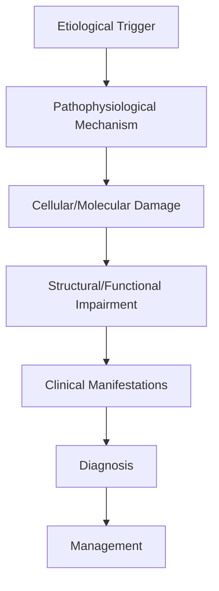
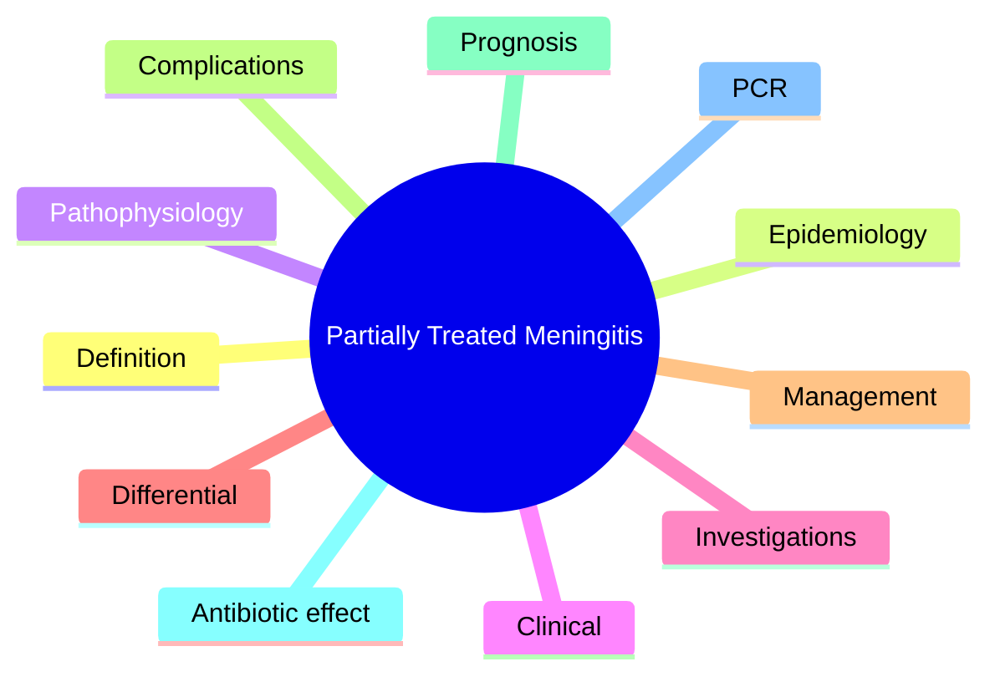

# Partially Treated Meningitis

> [!tip] **High-Yield Definition**
> Comprehensive clinical note for Partially Treated Meningitis covering definition, epidemiology, aetiology, pathophysiology, clinical features, investigations, differential diagnosis, management, drug interactions, procedures, complications, red flags, prognosis, topic correlation, and special situations for FCPS/MRCP examination preparation based on Davidson 24th Edition Chapter 25: Neurology.

---

## 1. Definition / Epidemiology / Classification

### Definition
Partially Treated Meningitis is a neurological disorder within the 12 cns infections category. It is characterised by specific clinical, pathological, radiological, and laboratory features that allow differentiation from related conditions.

### Epidemiology
- **Incidence/Prevalence:** Variable depending on the specific condition.
- **Age:** Adult onset is most common, but paediatric and elderly presentations occur.
- **Sex:** Variable depending on the condition.
- **Geography:** Worldwide distribution, with higher prevalence in certain regions.
- **Risk Factors:** Genetic predisposition, environmental factors, comorbidities, family history.

### Classification
| Subtype | Key Features | Prognosis |
|---------|-------------|-----------|
| Mild/early | Subtle symptoms, preserved function | Best |
| Moderate | Clear symptoms, functional impairment | Variable |
| Severe | Significant disability, complications | Worst |

---

## 2. Aetiology / Pathophysiology

### Aetiology
- **Primary (idiopathic):** Most cases have no identifiable cause.
- **Genetic:** May be inherited (AD, AR, X-linked, mitochondrial, sporadic).
- **Autoimmune:** Autoantibodies, immune-mediated inflammation.
- **Infectious:** Viral, bacterial, fungal, parasitic.
- **Metabolic:** Electrolyte, endocrine, hepatic, renal, nutritional.
- **Toxic:** Drugs, alcohol, heavy metals, environmental toxins.
- **Vascular:** Ischaemia, haemorrhage, vasculitis.
- **Neoplastic:** Primary, secondary, paraneoplastic.
- **Traumatic:** Acute, chronic, repetitive.
- **Degenerative:** Neurodegeneration, protein misfolding.

### Pathophysiology


---

## 3. Clinical Features

### History
- **Onset/Duration:** Acute, subacute, or chronic.
- **Progression:** Static, progressive, relapsing-remitting, stepwise.
- **Key symptoms:** Specific to the condition.
- **Triggers:** Stress, infection, trauma, drugs, hormonal, environmental.
- **Systemic symptoms:** Constitutional features.
- **Drug/Family/Social history:** Relevant exposures, comorbidities.

### Examination
| Domain | Key Findings | Localisation Value |
|--------|-------------|-------------------|
| Higher function | Cognitive, behavioural | Cortical, subcortical, limbic |
| Cranial nerves | Pupils, eye movements, facial, bulbar | Brainstem, cranial nerve, NMJ |
| Motor | Weakness, tone, reflexes | UMN, LMN, NMJ, muscle |
| Sensory | All modalities, pattern | Peripheral, spinal, brainstem |
| Coordination | Ataxia, nystagmus, dysmetria | Cerebellar, sensory, vestibular |
| Gait | Spastic, ataxic, parkinsonian | Multiple |
| Autonomic | Orthostatic, sweating, GI, bladder | Autonomic, peripheral, central |

### Specific Clinical Features
The clinical features are determined by the underlying aetiology, location of pathology, and rate of progression. Patients typically present with a constellation of symptoms and signs that allow clinical localisation and subsequent targeted investigation.

---

## 4. Diagnostic Approach / Algorithm

```mermaid
flowchart TD
    A[Clinical Presentation] --> B[Anatomical Localisation]
    B --> C[Pathophysiological Category]
    C --> D[Formulate Differential]
    D --> E[Targeted Investigations]
    E --> F[Confirm Diagnosis]
    F --> G[Assess Severity/Prognosis]
    G --> H[Initiate Management]
    H --> I[Monitor Response]
    I --> J{Response?}
    J --> YES1 [Good - Continue]
    J --> NO1 [Poor - Escalate]
    YES1 --> K[Monitor]
    NO1 --> H
```

---

## 5. Investigations

### First-Line Investigations
- **Blood tests:** FBC, U&Es, LFTs, glucose, calcium, magnesium, ESR, CRP, autoimmune, infection.
- **Imaging:** CT/MRI brain/spine (essential for most neurological conditions).
- **Neurophysiology:** EEG, nerve conduction, EMG, evoked potentials.
- **CSF:** Cell count, protein, glucose, OCBs, PCR, culture.

### Second-Line Investigations
- **Genetic testing:** Gene panels, WES, WGS.
- **Antibody testing:** Antineuronal, autoimmune, paraneoplastic.
- **Biopsy:** Nerve, muscle, brain, skin.
- **Advanced imaging:** PET-CT, MR spectroscopy, fMRI.

### Specialised Investigations
- **Biomarkers:** Neurofilament light chain, tau, beta-amyloid, 14-3-3, RT-QuIC.
- **Autonomic testing:** Head-up tilt, sudomotor, QSART.
- **Neuropsychology:** Cognitive testing, behavioural assessment.
- **Genetic counselling:** Family screening, predictive testing.

---

## 6. Differential Diagnosis

| Differential | Distinguishing Features | Key Test |
|--------------|------------------------|----------|
| Vascular | Sudden onset, focal, vascular risk factors | MRI/CT, vessel imaging |
| Inflammatory | Subacute, multifocal, systemic | MRI, CSF, antibodies |
| Infectious | Fever, systemic, exposure | Bloods, CSF, imaging |
| Neoplastic | Progressive, mass effect | MRI, biopsy |
| Degenerative | Progressive, symmetric, hereditary | MRI, genetic |
| Toxic/Metabolic | Drug history, systemic, reversible | Bloods, toxicology |
| Autoimmune | Multifocal, antibodies, immunotherapy response | Antibodies, MRI, CSF |
| Functional | Inconsistent, distractible | Clinical, video, biomarkers |

---

## 7. Management

### Acute Management
- **Stabilisation:** ABCDE approach, emergency resuscitation.
- **Specific treatment:** Disease-specific interventions.
- **Symptomatic relief:** Pain, seizures, spasticity, autonomic dysfunction.
- **Prevention of complications:** DVT, pressure sores, infection.

### Disease-Modifying Treatment
- **Pharmacological:** First-line, second-line, escalation, maintenance.
- **Procedural:** Surgery, biopsy, drainage, ablation, stimulation.
- **Immunotherapy:** Steroids, IVIG, plasma exchange, immunosuppressants, biologics.
- **Rehabilitation:** Physiotherapy, OT, speech therapy.

### Long-Term Management
- **Monitoring:** Clinical, imaging, biomarkers, side effects.
- **Prevention:** Vaccinations, prophylaxis, lifestyle modification.
- **Supportive care:** Multidisciplinary team, social work, psychological support.
- **Palliative care:** Advanced care planning, end-of-life care, hospice.

---

## 8. Drug Interactions / Contraindications / Comorbidity Cautions

| Drug Class | Interaction / Caution | Management |
|------------|----------------------|------------|
| Antiseizure medications | Enzyme induction, teratogenicity | Monitor, supplement, switch |
| Immunosuppressants | Infection, malignancy, teratogenicity | Monitor, prophylaxis |
| Anticoagulants | Bleeding risk, drug interactions | Monitor INR, avoid combinations |
| Antihypertensives | Hypotension, falls | Monitor BP, adjust dose |
| Antibiotics | Nephrotoxicity, ototoxicity | Monitor renal |
| Antivirals | Nephrotoxicity, neuropsychiatric | Monitor renal, dose adjust |
| Steroids | DM, HTN, osteoporosis, infection | Monitor, prophylaxis, taper |
| Biologics | Infusion reactions, infection | Monitor, prophylaxis |

---

## 9. Procedures

### Common Procedures
- **Lumbar puncture:** Diagnostic, therapeutic (IIH, NPH). Contraindications: raised ICP, mass lesion, coagulopathy.
- **Nerve conduction studies/EMG:** Diagnostic, prognosis. Minor discomfort.
- **EEG:** Diagnostic, monitoring. No significant complications.
- **MRI brain/spine:** Diagnostic, monitoring. Contraindications: pacemaker, metallic implants.
- **CT head:** Emergency, rapid. Radiation exposure, contrast reactions.
- **Biopsy:** Stereotactic, open. Indications: diagnosis, molecular profiling.

---

## 10. Complications

| Complication | Frequency | Prevention | Management |
|--------------|-----------|------------|------------|
| Infection | Common | Hygiene, prophylaxis, vaccination | Antibiotics, antifungals |
| Thrombosis | Common | Prophylaxis, mobility | Anticoagulation |
| Pressure sores | Common | Positioning, nutrition | Wound care, surgery |
| Spasticity | Common | Positioning, stretching | Baclofen, BoNT |
| Contractures | Common | Passive movements, splints | Physiotherapy, surgery |
| Aspiration | Common | Swallow assessment | NGT, PEG, thickeners |
| Falls | Common | Environment, mobility | Walking aids |
| Fractures | Common | Bone health, prevention | Vitamin D, bisphosphonate |
| Depression | Common | Screening, support | Antidepressants, CBT |
| Cognitive decline | Variable | Monitoring, training | Rehabilitation |
| Autonomic dysfunction | Variable | Monitoring, hydration | Midodrine, fludrocortisone |
| Respiratory failure | Variable | Monitoring, supportive | Ventilation, NIV |
| Death | Variable | Monitoring, palliative | End-of-life care |

---

## 11. Red Flags / Emergencies

### Emergency Presentations
- **Rapid neurological deterioration:** New focal deficit, decreased consciousness, seizures.
- **Status epilepticus:** Continuous seizures >5 min.
- **Raised ICP:** Headache, vomiting, papilloedema, altered consciousness.
- **Respiratory failure:** Hypoxia, hypercapnia, ventilatory failure.
- **Cardiac arrest:** Arrhythmia, MI, pulmonary embolism.
- **Infection:** Sepsis, meningitis, abscess, encephalitis.
- **Drug toxicity:** Overdose, side effects, interactions.
- **Haemorrhage:** Intracranial, systemic, coagulopathy.

---

## 12. Prognosis

### Natural History
- **Acute:** May resolve with treatment, may progress, may be fatal.
- **Subacute:** Variable, depends on cause and treatment.
- **Chronic:** Often progressive, may be stable, may have relapses.
- **Recovery:** Variable, may be complete, partial, or none.

### Prognostic Factors
- **Favourable:** Young age, early treatment, mild disease, reversible cause, good premorbid function, family support.
- **Unfavourable:** Older age, delayed treatment, severe disease, irreversible cause, poor premorbid function, comorbidities.

---

## 13. Topic Correlation

| Related Topic | Link | Key Overlap |
|---------------|------|-------------|
| Davidson 24th Ed Chapter 25 | [[Davidson Chapter 25 - Neurology Hierarchy]] | Comprehensive neurology |
| Neurology MOC | [[Neurology MOC]] | All neurology topics |
| Drug Reference | [[../00_Index/Neurology Drug Reference]] | Medications |
| Local Hub | [[../12_CNS_Infections/Hub]] | Section-specific |
| Clinical Examination | [[../01_Fundamentals_Examination/Neurological History Taking]] | Clinical approach |
| Investigation | [[../01_Fundamentals_Examination/Neuroimaging (CT-MRI) Principles]] | Imaging |

---

## 14. Special Situations

| Situation | Consideration |
|-----------|---------------|
| **Pregnancy** | Pre-conception counselling, teratogenicity, drug safety, monitoring, delivery planning, breastfeeding. |
| **Lactation** | Drug safety, breastfeeding, monitoring, support. |
| **Paediatric** | Developmental considerations, drug dosing, school, family, vaccination, growth, puberty. |
| **Elderly / Frail** | Comorbidities, polypharmacy, falls, bone health, cognition, social, end-of-life. |
| **Renal impairment** | Drug dose adjustment, monitoring, dialysis, transplant. |
| **Hepatic impairment** | Drug dose adjustment, monitoring, transplant. |
| **Immunocompromised** | Infection prophylaxis, vaccination, drug interactions, malignancy screening. |
| **Perioperative** | Drug management, anaesthesia planning, VTE prophylaxis, infection prevention, monitoring. |
| **Driving / DVLA** | Fitness to drive, restrictions, notification, reassessment. |
| **Occupational** | Fitness for work, adaptations, rehabilitation, disability, return to work. |

---

## FCPS/MRCP High-Yield Summary

| Category | Key Points |
|----------|------------|
| **Definition** | Comprehensive definition with key diagnostic criteria |
| **Epidemiology** | Incidence, prevalence, age, sex, geography, risk factors |
| **Aetiology** | Primary causes, secondary causes, genetic, environmental |
| **Pathophysiology** | Mechanism of disease, cellular/molecular basis |
| **Clinical Features** | History, examination, key findings, variants |
| **Diagnosis** | Diagnostic criteria, classification, severity |
| **Investigations** | First-line, second-line, specialised, biomarkers |
| **Differential Diagnosis** | Key differentials, distinguishing features, tests |
| **Management** | Acute, disease-modifying, symptomatic, supportive |
| **Complications** | Common, serious, prevention, management |
| **Prognosis** | Natural history, prognostic factors, outcomes |
| **Viva Pearls** | Key examination points |
| **Drug Doses** | First-line, second-line, emergency |
| **Scoring Systems** | Specific scores used in management |
| **Genetics** | Inheritance, genes, mutations, family screening |
| **Imaging Signs** | Characteristic findings, differential |

---

## Viva Questions (PACES/FCPS Style)

1. **Q:** Define and classify its variants.
   **A:** Comprehensive definition with classification of subtypes based on aetiology, severity, and clinical features.

2. **Q:** What are the key clinical features?
   **A:** Specific symptoms and signs including onset, progression, key features, and associated findings.

3. **Q:** What is the first-line treatment?
   **A:** First-line pharmacological and non-pharmacological management based on current evidence.

4. **Q:** What are the red flags requiring urgent referral?
   **A:** Specific emergency presentations and complications requiring immediate intervention.

5. **Q:** What is the prognosis?
   **A:** Natural history, prognostic factors, and long-term outcomes.

6. **Q:** How do you differentiate from key differentials?
   **A:** Clinical features, investigations, and response to treatment that distinguish from alternative diagnoses.

7. **Q:** What investigations are most useful?
   **A:** First-line and second-line investigations including imaging, neurophysiology, CSF, and biomarkers.

8. **Q:** Describe the stepwise management approach.
   **A:** Stepwise escalation from first-line to second-line to third-line therapy with monitoring.

9. **Q:** What are the emergency presentations?
   **A:** Specific emergency scenarios and immediate management priorities.

10. **Q:** How does management change in pregnancy/paediatrics/elderly?
    **A:** Special considerations for each population including drug safety, monitoring, and support.

---

## Common Confusions / Exam Traps

| Confusion | Clarification |
|-----------|---------------|
| Similar presentation but different cause | Differentiate by history, examination, investigations |
| Treatment response vs natural history | Assess with objective measures, biomarkers |
| Drug interactions | Check each drug, monitor, adjust doses |
| Disease progression vs treatment failure | Monitor response, escalate appropriately |
| Functional vs organic | Inconsistent, distractible, disability greater than impairment |
| Acute vs chronic | Time course, progression, reversibility |
| Primary vs secondary | Underlying cause, contributing factors |
| Side effects vs symptoms | Temporal relationship, dose relationship |

---

## Mnemonics
1. **PT-Meno** = Prior antibiotic + atypical CSF + need repeat LP (use: PTM)
2. **CSF Predict** = CSF sterilised before pleocytosis; culture often negative; PCR essential (use: PTM)
3. **5-Rule** = Refractory to empiric therapy → suspect PTM (use: PTM)

---

## Mind Map



---

## Spaced Repetition Trackers

| Review Interval | Date | Score (0-5) | Notes |
|-----------------|------|-------------|-------|
| Day 1 | | | |
| Day 3 | | | |
| Day 7 | | | |
| Day 14 | | | |
| Day 30 | | | |
| Day 90 | | | |

---

## Self-Test Scorecard

| Section | Score /5 | Last Attempt |
|---------|----------|--------------|
| Definition & Epidemiology | | | |
| Pathophysiology | | | |
| Clinical Features | | | |
| Investigations | | | |
| Differential | | | |
| Management | | | |
| Complications | | | |
| Viva Questions | | | |
| MCQs | | | |
| SBAs | | | |

---

## MCQs (10)

1. **Partially treated meningitis definition?**
   **Options:** A. Meningitis after antibiotics given before LP that may sterilise CSF B. Viral meningitis only C. TB meningitis D. No definition
   **Answer:** A
   **Explanation:** PTM = bacterial meningitis where prior antibiotics (before LP) sterilise CSF but patient still has meningeal infection.

2. **CSF in partially treated meningitis typically shows?**
   **Options:** A. Normal CSF B. Atypical: lymphocytic predominance, normal glucose, modest protein rise (looks viral) C. Always neutrophilic D. Always low glucose
   **Answer:** B
   **Explanation:** Prior antibiotics shift CSF toward lymphocytic, may normalise glucose. Looks like viral, but patient clinically unwell.

3. **Best diagnostic test if PTM suspected?**
   **Options:** A. Repeat CSF culture B. CSF PCR (bacterial 16S rRNA, viral panel) + repeat culture C. Blood culture D. CT only
   **Answer:** B
   **Explanation:** CSF PCR (16S rRNA broad bacterial, S. pneumoniae, N. meningitidis, viral panel) detects organisms when culture negative.

4. **Empirical treatment of suspected PTM?**
   **Options:** A. Stop antibiotics B. Continue empiric ceftriaxone + vancomycin (+ ampicillin if >50y) until cultures/PCR C. Antivirals only D. Antifungals
   **Answer:** B
   **Explanation:** Continue empiric third-generation cephalosporin + vancomycin ± ampicillin until 48-72h afebrile and PCR/culture results.

5. **Most common bacterial cause in PTM?**
   **Options:** A. S. aureus B. S. pneumoniae (most common), N. meningitidis C. E. coli D. Listeria
   **Answer:** B
   **Explanation:** S. pneumoniae is most common in PTM (sterilised first). N. meningitidis second. Listeria in >50y.

6. **Differential of PTM includes?**
   **Options:** A. Viral meningitis only B. Viral meningitis, TB meningitis, early fungal, autoimmune encephalitis C. Stroke D. Migraine
   **Answer:** B
   **Explanation:** Differential: viral, TB, fungal, autoimmune encephalitis — all can have lymphocytic CSF.

7. **If LP delayed >4 hours after antibiotics, what changes?**
   **Options:** A. No effect on CSF B. Decreasing yield: glucose may normalise, neutrophils convert to lymphocytes, cultures negative C. WBC increases D. Glucose always falls
   **Answer:** B
   **Explanation:** Antibiotic effect on CSF: glucose normalises first, then neutrophils convert to lymphocytes, cultures become negative by 4-8h.

8. **Role of repeat LP in PTM?**
   **Options:** A. Useless B. Repeat LP after 48-72h to assess response and yield PCR C. Always diagnostic D. Only at 1 month
   **Answer:** B
   **Explanation:** Repeat LP 48-72h useful: assess response (CSF parameters improving), and yield PCR/culture even if initial was negative.

9. **Why is meningococcal antigen test sometimes used in PTM?**
   **Options:** A. Unreliable B. Detects capsular antigen even after culture negative (latex agglutination) C. Only for serogrouping D. For surveillance
   **Answer:** B
   **Explanation:** Latex agglutination for capsular polysaccharide can detect N. meningitidis, S. pneumoniae, H. influenzae even after antibiotics.

10. **Adjunctive dexamethasone in suspected bacterial meningitis?**
   **Options:** A. Never B. Give before/at first dose of antibiotics, especially in pneumococcal meningitis (reduces hearing loss, mortality) C. Only in viral D. Only in TB
   **Answer:** B
   **Explanation:** Dexamethasone 0.15 mg/kg q6h × 4 days, started before/with first antibiotic, especially benefits pneumococcal meningitis.

---

## SBA Questions (10)

1. **Scenario:** Patient on oral amoxicillin for 'sinusitis' 5 days, presents with fever, headache, neck stiffness. LP shows 80 lymphocytes, protein 0.8, glucose 3.2 (serum 6).
   **Question:** Most likely diagnosis?
   **Options:** A. Viral meningitis B. Partially treated bacterial meningitis C. TB meningitis D. Fungal meningitis
   **Answer:** B
   **Explanation:** Prior oral antibiotic (covers S. pneumoniae partially), lymphocytic shift, normal glucose, modest protein = PTM.

2. **Scenario:** PTM suspected. Best diagnostic next step?
   **Question:** Most useful test?
   **Options:** A. Repeat CSF in 1 week B. CSF PCR (16S rRNA + specific bacterial PCR) + meningococcal antigen C. CT only D. Treat as viral
   **Answer:** B
   **Explanation:** CSF PCR (bacterial 16S rRNA, S. pneumoniae, N. meningitidis) and antigen tests identify organisms when cultures negative.

3. **Scenario:** CSF PCR for S. pneumoniae positive in suspected PTM. Treatment?
   **Question:** Best treatment?
   **Options:** A. Stop antibiotics B. Continue/upgrade to ceftriaxone 2g BD + vancomycin + dexamethasone before first dose C. Antivirals D. Antifungals
   **Answer:** B
   **Explanation:** Upgrade to ceftriaxone + vancomycin; if Listeria risk add ampicillin; dexamethasone with first dose.

4. **Scenario:** Patient with PTM, allergic to penicillin. Empirical treatment?
   **Question:** Best empirical regimen?
   **Options:** A. Continue amoxicillin B. Ceftriaxone (cross-reactivity ~1%) or chloramphenicol + vancomycin; desensitise if severe C. Meropenem only D. Ciprofloxacin
   **Answer:** B
   **Explanation:** Third-gen cephalosporin (cross-reactivity low ~1%); if severe allergy, chloramphenicol or meropenem.

5. **Scenario:** LP repeated 48h after starting ceftriaxone. CSF shows 50 lymphocytes, protein 0.6, glucose 3.5. Patient improving clinically.
   **Question:** Interpretation?
   **Options:** A. Failure of treatment B. Appropriate response — continue antibiotics, complete 10-14 day course C. Need to switch to TB regimen D. Stop antibiotics
   **Answer:** B
   **Explanation:** Improving CSF + clinical = appropriate response. Continue antibiotics for 10-14 days total.

6. **Scenario:** Immunocompromised patient with PTM. Additional empirical cover?
   **Question:** What should be added?
   **Options:** A. Nothing B. Add ampicillin (Listeria) + consider aciclovir (HSV encephalitis) C. Fluconazole only D. Stop antibiotics
   **Answer:** B
   **Explanation:** Listeria cover in immunocompromised/elderly (ampicillin); HSV encephalitis → aciclovir.

7. **Scenario:** PTM with continued fever 72h after appropriate antibiotics. Next step?
   **Question:** Best next step?
   **Options:** A. Switch antibiotics empirically B. Repeat LP + imaging (MRI with contrast); consider resistant organism, drainable collection, drug fever C. Discharge D. Steroids only
   **Answer:** B
   **Explanation:** Persistent fever: consider resistant organism, parameningeal focus (subdural empyema, abscess), drug fever.

8. **Scenario:** Cranial nerve palsy developing in PTM patient.
   **Question:** Most likely cause?
   **Options:** A. Drug toxicity B. Meningeal inflammation affecting CN (esp. CN VIII - hearing loss) - common in pneumococcal C. Tuberculosis D. Fungal
   **Answer:** B
   **Explanation:** CN VIII (hearing loss) is most common in pneumococcal meningitis. Audiology mandatory.

9. **Scenario:** CSF in PTM with normal glucose and lymphocyte pleocytosis but PCR negative for all bacteria.
   **Question:** Next step?
   **Options:** A. Stop antibiotics B. Continue antibiotics 48h, repeat LP if no improvement; consider viral, TB, autoimmune (NMDAR) C. Bactrim D. Antifungal only
   **Answer:** B
   **Explanation:** Negative bacterial PCR + clinical improvement = treat short course and observe. If no improvement, broaden workup.

10. **Scenario:** Patient completes 14 days ceftriaxone for PTM. Discharged well. When to repeat LP?
   **Question:** When to repeat LP?
   **Options:** A. Routinely B. Not routinely if clinically well; repeat if symptoms recur or new neurological signs C. At 1 month mandatory D. At 6 months
   **Answer:** B
   **Explanation:** Routine repeat LP not needed if clinically well. Repeat if symptoms recur or new signs.

---

## Tags
**Tags:** #neurology #CNS-infection #meningitis #PTM #S-pneumoniae #CSF-PCR #dexamethasone #FCPS #MRCP

---

## Local Navigation
**Heading Hub:** [[../Hub]]  
**Chapter Hierarchy:** [[Davidson Chapter 25 - Neurology Hierarchy]]  
**Chapter MOC:** [[Neurology MOC]]  
**Drug Reference:** [[../00_Index/Neurology Drug Reference]]

## PasTest Scenario SBAs (Clinical Vignettes)

> **Auto-generated PasTest/Mediscope-style scenario SBAs** grounded in the authored source. Each scenario tests a real clinical fact (triad, specific sign, contraindication, trial, first-line Rx) extracted from the topic. *Source: Ch 27: Neurology & Stroke — Partially Treated Meningitis*

**Q1.** Which of the following features is most specific or characteristic of Partially Treated Meningitis?

  - **A.** Key symptoms:
  - **B.** A feature common to many acute inflammatory conditions
  - **C.** A non-specific sign that does not localise the diagnosis
  - **D.** An investigation finding rather than a clinical feature

  > **Answer: A** — Key symptoms:
  >
  > *Source:* - **Key symptoms:** Specific to the condition

**Q2.** What is the most appropriate first-line therapy for Partially Treated Meningitis?

  - **A.** Rehabilitation:
  - **B.** An advanced/surgical therapy reserved for refractory disease
  - **C.** Symptomatic treatment only, no disease-modifying therapy
  - **D.** Empiric broad-spectrum therapy without specific indication

  > **Answer: A** — Rehabilitation:
  >
  > *Source:* **Rehabilitation:** Physiotherapy, OT, speech therapy.

