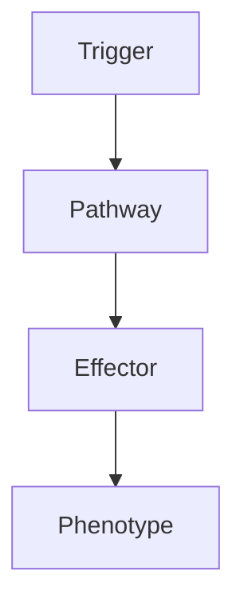

# Astrocytoma

> [!tip] **High-Yield Definition**
> Astrocytoma: glioma from astrocytes. WHO 2021 CNS5: (1) Adult-type diffuse glioma: IDH-mutant astrocytoma (grade 2, 3, 4 - if CDKN2A/B homozygous deleted = grade 4), (2) Pediatric-type diffuse low-grade glioma, (3) Circumscribed astrocytic glioma (pilocytic, subependymal giant cell, pleomorphic xanthoastrocytoma). Molecular classification critical.

---

## 1. Definition / Epidemiology / Classification

### Definition
Astrocytoma: glioma from astrocytes. WHO 2021 CNS5: (1) Adult-type diffuse glioma: IDH-mutant astrocytoma (grade 2, 3, 4 - if CDKN2A/B homozygous deleted = grade 4), (2) Pediatric-type diffuse low-grade glioma, (3) Circumscribed astrocytic glioma (pilocytic, subependymal giant cell, pleomorphic xanthoastrocytoma). Molecular classification critical.

### Epidemiology
Incidence: 0.5-1/100,000/year. 60-70% of gliomas. Adult-type IDH-mutant: 30-50y. M:F 1.5:1. Glioblastoma (IDH-wildtype, grade 4): older, 60-70y. Pediatric-type: children. Circumscribed: any age. Pilocytic astrocytoma: most common paediatric glioma, children, 5-15y, often cerebellar, optic pathway, thalamus, brainstem.

---

## 2. Aetiology / Pathophysiology

### Aetiology
Adult-type IDH-mutant astrocytoma: IDH1/2 mutation (80-90%, R132H most common), ATRX loss (70%), TP53 mutation (60%), CDKN2A/B homozygous deletion (worse prognosis, grade 4 even if histology grade 2-3), 1p/19q intact (vs oligodendroglioma - co-deleted), TERT promoter wild type (vs oligodendroglioma, glioblastoma), MGMT methylation (predicts temozolomide, less frequent than glioblastoma). Pathogenesis: IDH mutation produces 2-HG, DNA hypermethylation, slow growth, secondary glioblastoma. Risk factors: NF1 (optic pathway glioma, low-grade), Li-Fraumeni (TP53), Turcot, Maffucci, Ollier, hereditary retinoblastoma (RB1).

### Pathophysiology

---

## 3. Clinical Features

Seizures (60-80%, most common, focal, secondary generalised, may be only symptom for years, low-grade). Headache (50%, raised ICP, mass effect, worse morning, Valsalva, progressive). Focal neurological deficit (30-50%, hemiparesis, aphasia, hemianopia, ataxia, cranial nerve, cognitive, behavioural, depends on location). Cognitive/behavioural (30-50%, frontal, limbic, executive, memory, personality change, aphasia, neglect). Asymptomatic (20-30%, incidental, especially low-grade, slow). Rapid progression (high-grade, glioblastoma, mass effect, raised ICP, herniation, stroke-like). Constitutional: weight loss, fatigue, cognitive decline, depression.

---

## 4. Investigations

MRI brain with gadolinium (gold standard): location, size, mass effect, oedema, enhancement, multifocal, leptomeningeal. T1 iso/hypointense, T2/FLAIR hyperintense, restricted diffusion (high-grade, cellular), enhancement (ring - high-grade, nodular - intermediate, none - low-grade), central necrosis (high-grade, ring), oedema, mass effect, midline shift, hydrocephalus, leptomeningeal. CT: hypodense, calcification (10-20%, oligodendroglioma more), haemorrhage (rare), bone (rare), surgical planning. MR spectroscopy: elevated choline, decreased NAA, lactate (glioma, high-grade), 2-HG (IDH-mutant). PET: amino acid (FET, MET - high uptake, recurrence, high-grade), FDG (variable, high-grade high). Genetic: IDH1/2 mutation (sequencing, IHC for R132H), ATRX loss (IHC, sequencing, ALT), TP53 mutation (IHC, sequencing), 1p/19q (FISH, array, NGS, PCR - intact vs co-deleted), TERT promoter (sequencing - wild type), MGMT methylation (PCR), CDKN2A/B (FISH, array, NGS - homozygous deletion, grade 4 even if histology grade 2-3), Ki-67 (proliferation), IDH1 R132H IHC, BRAF (V600E in PXA, ganglioglioma, pilocytic). Histology: astrocytic, fibrillary, gemistocytic, cellularity, mitoses, microvascular proliferation, necrosis (high-grade), Ki-67, IHC (GFAP, IDH1 R132H, ATRX, p53, MGMT, BRAF). WHO grade: 2 (diffuse astrocytoma, low-grade, IDH-mutant, mitoses rare, no MVP, no necrosis), 3 (anaplastic, mitoses, focal atypia, no necrosis), 4 (glioblastoma, MVP, necrosis, or CDKN2A/B homozygous deletion, IDH-mutant or wild type - 90% wild type). Exclude: oligodendroglioma (1p/19q co-deleted, IDH-mutant, ATRX retained, TERT, better prognosis), glioblastoma (IDH-wildtype, most common), ependymoma, medulloblastoma, pilocytic astrocytoma (circumscribed, paediatric, BRAF, excellent prognosis), other gliomas, primary CNS lymphoma (periventricular, enhancement, EBV, immunosuppressed), metastasis, tumefactive demyelinating (MS, ADEM, MOG, NMO), abscess, toxoplasmosis, TB, fungal, vascular (stroke, cavernoma, AVM, PRES, vasculitis), sarcoid, Behcet's, IgG4, radiation necrosis, post-treatment, pseudoprogression, autoimmune (ADEM, MOG, NMO, sarcoid, Behcet's, IgG4, MS), toxic, metabolic, infection, congenital, developmental.

---

## 5. Management

Multidisciplinary: neuro-oncology, neurosurgery, radiation oncology, medical oncology, neurology, palliative, neuroradiology, pathology (molecular, genetic), neuropsychology, OT, PT, SLT, dietitian, social, palliative, clinical trials. Surgery: maximal safe resection (>90% GTR, EOR critical, especially low-grade, may be curative, IDH-mutant, longer survival, monitor, biopsy if deep, eloquent, multifocal, diagnostic, may not be safe to resect completely, brainstem, thalamus, basal ganglia, multiple, elderly, comorbidity). Radiotherapy: focal (50-60 Gy, 1.8-2 Gy fractions, 25-30 fractions, postoperative, residual, high-grade, anaplastic, symptomatic, progression, may be omitted in low-grade, complete resection, young, IDH-mutant grade 2 - may observe or early RT, controversial, watch and wait, late RT, IDH-mutant grade 3 - early postoperative RT, standard, IDH-mutant grade 4 - postoperative RT + temozolomide, similar to glioblastoma, but better prognosis), re-irradiation (recurrence, palliative, may be possible with careful planning, dose, volume, response, stereotactic, hypofractionated, brachytherapy, focused ultrasound). Chemotherapy: temozolomide (first-line, oral, outpatient, well-tolerated, MGMT methylated - better, IDH-mutant - better, anaplastic astrocytoma - standard postoperative, EORTC 26951, NOA-04, CATNON - concurrent + adjuvant temozolomide with RT in anaplastic, IDH-mutant grade 3 - significant benefit, IDH-mutant grade 2 - may benefit, especially residual, PCV (lomustine + procarbazine + vincristine - CODEL, EORTC 26951 - 1p/19q, IDH-mutant astrocytoma - may benefit, more toxic), other (BCNU/carmustine - wafers, Gliadel - intraoperative, recurrent, high-grade, limited, controversial, temozolomide rechallenge, CCNU/lomustine monotherapy, irinotecan, carboplatin), IDH inhibitors (vorasidenib - IDH1/2, INDIGO trial, PFS benefit, approved for IDH-mutant grade 2 astrocytoma and oligodendroglioma requiring surgery, not grade 3-4, oral, well-tolerated, promising, ivosidenib - IDH1, AML, glioma trials), targeted (BRAF/MEK - V600E in PXA, ganglioglioma, some pilocytic, FGFR, NTRK, ROS1, ALK, MET, CDK4/6, MEK, mTOR, WEE1, DNA repair, PARP, epigenetic - clinical trials), immunotherapy (PD-1, CTLA-4 - limited, single-agent, combinations, may benefit hypermutator, MMR deficient, biallelic mismatch repair deficiency, bMMRD, germline, secondary, temozolomide-induced, vaccines, CAR-T, oncolytic virus, intraventricular, CED - clinical trials), TTFields (Optune - glioblastoma, may help, controversial, IDH-mutant grade 4 - similar, expensive, time-consuming, may help), antiangiogenic (bevacizumab - pseudoresponse, not overall survival, mass effect, vasogenic oedema, recurrence, IDH-wildtype, off-label, may help symptoms, may worsen IDH-mutant, controversial). Symptomatic: steroids (dexamethasone 4-10mg q6-8h, raised ICP, vasogenic oedema, taper, peri-op, palliative, may interfere with chemo, controversial), antiepileptics (levetiracetam preferred, after seizure, prophylactic not routine, may interfere with chemo, valproate - alternative, may have anti-tumour effect, but enzyme inhibitor - interactions), VTE prophylaxis (controversial, intracranial haemorrhage risk, mechanical first, LMWH if stable, treat if symptomatic - LMWH preferred over warfarin/DOAC, may improve survival in glioblastoma). Supportive: rehabilitation, OT, PT, speech, swallow, cognitive, psychological, palliative, family, social, end-of-life, advanced care planning, fertility, pregnancy, clinical trials, novel agents, quality of life. Multidisciplinary essential. Monitor: MRI (3, 6, 12 months, then q6 months for 2-3y, then annually if stable, IDH-mutant - slower progression, may extend interval, but always MRI + clinical, RANO criteria, pseudoprogression vs true progression - difficult, often requires perfusion, amino acid PET, repeat imaging, steroid trial, biopsy), clinical, neurocognitive, KPS, treatment toxicity, molecular (IDH, 1p/19q, MGMT, TERT, CDKN2A/B - prognostic, predictive), clinical trials. Long-term: monitor, recurrence, treatment toxicity, second malignancy (radiation, temozolomide - rare, leukaemia, lymphoma), late effects, cognitive (radiation, chemo, especially young, infant, WNT, IDH-mutant), psychological, family, genetic (germline - 5%, especially TP53 - Li-Fraumeni, NF1, MSH2/6, PMS2, BRCA1/2, family screening, predictive, ethical), fertility, pregnancy, quality of life, end-of-life, clinical trials. Research: IDH inhibitors (vorasidenib - approved, ivosidenib - approved, IDH1/2-mutant glioma), targeted (BRAF/MEK, FGFR, NTRK, ROS1, ALK, MET, CDK4/6, MEK, mTOR, WEE1, DNA repair, PARP, epigenetic - HDAC, EZH2, IDH), immunotherapy (PD-1, CTLA-4, vaccines, CAR-T, B7-H3, GD2, oncolytic virus, intraventricular, CED, hypermutator, bMMRD), BBB disruption (focused ultrasound, CED, intra-arterial, intrathecal, nanoparticles), TTFields, gene therapy, liquid biopsy (ctDNA, CSF - early detection, monitoring, recurrence), precision medicine, AI, clinical trials, de-escalation (low-risk, WNT, infant SHH), escalation (high-risk, novel), biomarkers (predictive, prognostic, response, resistance - serial, liquid biopsy, imaging - amino acid PET, perfusion, diffusion, susceptibility), early detection, prevention, risk stratification, molecular subgroups, integrated diagnosis, classification (WHO 2021 CNS5, upcoming updates - methylation, integrated layered, molecular first, histology integration, AI).

---

## 6. Red Flags / Emergencies

EMERGENCY: raised ICP, herniation, hydrocephalus, brainstem compression, status epilepticus, stroke, haemorrhage (rare), progression, transformation (higher grade, glioblastoma), recurrence, leptomeningeal, drop metastases (rare), systemic (chemotherapy, infection, VTE, malnutrition, dehydration, hyperthermia, autonomic, especially brainstem), drug side effects (chemotherapy - myelosuppression, neutropenic sepsis, fatigue, nausea, liver, lung, kidney, fertility, teratogenicity, especially temozolomide - lymphopenia, opportunistic, lomustine - pulmonary, renal, leukaemia; PCV - vincristine neuropathy, procarbazine - monoamine oxidase, alcohol, tyramine; IDH inhibitors - differentiation syndrome, QT, leukocytosis, arthralgia, GI, fatigue; immunotherapy - irAEs, colitis, hepatitis, pneumonitis, thyroiditis, hypophysitis, hypopituitarism, DM, myositis, myocarditis, neuropathy, skin, severe, life-threatening; steroids - DM, HTN, osteoporosis, infection, mood, adrenal, myopathy, cataracts, glaucoma; antiepileptics - levetiracetam behavioural, valproate hepatic, weight, teratogenic, thrombocytopenia, pancreatitis, enzyme-inducing - interactions, OCP, warfarin, DOACs, ART, chemotherapy, especially important - many chemo agents are metabolised by CYP3A4, dexamethasone - many interactions; bevacizumab - HTN, proteinuria, thrombosis, haemorrhage, wound healing, GI perforation, fistula, RPLS; TTFields - skin irritation, time burden), pregnancy (teratogenicity - MTX, alkylating, valproate, topiramate, carbamazepine, phenobarbital, contraception essential, especially with chemo), pseudoprogression (especially within 3 months, immunotherapy, bevacizumab, radiation, often requires repeat imaging, perfusion, amino acid PET, biopsy), treatment failure, clinical trials, end-of-life, palliative, hospice, family, advanced care planning, driving, work, quality of life.

---

## 7. Prognosis

Variable. Median survival: IDH-mutant grade 2 (5-10y), IDH-mutant grade 3 (3-5y), IDH-mutant grade 4 (similar to glioblastoma, but better, 18-36 months, IDH-mutation is favourable), IDH-wildtype glioblastoma (12-18 months, poor), pilocytic (excellent, 90%+ 20y, paediatric). 5-year survival: IDH-mutant grade 2 (50-60%), IDH-mutant grade 3 (30-40%), IDH-mutant grade 4 (20-30%), IDH-wildtype glioblastoma (5-10%), pilocytic (90%+). Better: young, KPS ≥70, GTR >90%, IDH-mutant, MGMT methylated, low grade (2), no neurological deficit, frontal, female, complete resection, adjuvant chemotherapy, chemosensitive, IDH inhibitor (vorasidenib - PFS benefit, INDIGO, especially IDH-mutant grade 2, oligodendroglioma), clinical trials. Worse: old, KPS <70, STR, IDH-wildtype, MGMT unmethylated, high grade (3-4, especially glioblastoma), neurological deficit, multifocal, eloquent, brainstem, leptomeningeal, drop metastases, recurrence, CDKN2A/B deletion, second malignancy, treatment toxicity, late effects. Multidisciplinary essential. Long-term: monitor, recurrence, progression, treatment toxicity, second malignancy, cognitive, psychological, family, genetic (germline - 5%, especially TP53 - Li-Fraumeni, NF1, MSH2/6, PMS2, BRCA1/2, family screening, predictive, ethical), fertility, pregnancy, quality of life, end-of-life, palliative, hospice, advanced care planning, clinical trials. Genetic: IDH1/2 (prognostic, predictive - ivosidenib, vorasidenib), ATRX (prognostic, vs oligodendroglioma - retained), TP53 (prognostic - poor, especially SHH-TP53-mutant medulloblastoma, Li-Fraumeni, secondary), TERT (prognostic - poor in astrocytoma, good in oligodendroglioma), MGMT (predictive - temozolomide), CDKN2A/B (prognostic - grade 4 even if histology grade 2-3), 1p/19q (prognostic, predictive - oligodendroglioma), BRAF (targeted, V600E - PXA, ganglioglioma), H3K27me3 (prognostic - poor in diffuse midline glioma, paediatric, DMG), H3G34 (prognostic - young adults, hemispheric).

---

## FCPS/MRCP High-Yield Summary

| Category | Key Points |
|----------|------------|
| **Definition** | Astrocytoma: glioma from astrocytes. WHO 2021 CNS5: (1) Adult-type diffuse glioma: IDH-mutant astrocytoma (grade 2, 3, 4 - if CDKN2A/B homozygous deleted = grade 4), (2) Pediatric-type diffuse low-gra |
| **Epidemiology** | Incidence: 0.5-1/100,000/year. 60-70% of gliomas. Adult-type IDH-mutant: 30-50y. M:F 1.5:1. Glioblastoma (IDH-wildtype, grade 4): older, 60-70y. Pedia |
| **Aetiology** | Adult-type IDH-mutant astrocytoma: IDH1/2 mutation (80-90%, R132H most common), ATRX loss (70%), TP53 mutation (60%), CDKN2A/B homozygous deletion (worse prognosis, grade 4 even if histology grade 2-3 |
| **Clinical** | Seizures (60-80%, most common, focal, secondary generalised, may be only symptom for years, low-grade). Headache (50%, raised ICP, mass effect, worse morning, Valsalva, progressive). Focal neurologica |
| **Investigations** | MRI brain with gadolinium (gold standard): location, size, mass effect, oedema, enhancement, multifocal, leptomeningeal. T1 iso/hypointense, T2/FLAIR hyperintense, restricted diffusion (high-grade, ce |
| **Management** | Multidisciplinary: neuro-oncology, neurosurgery, radiation oncology, medical oncology, neurology, palliative, neuroradiology, pathology (molecular, genetic), neuropsychology, OT, PT, SLT, dietitian, s |
| **Prognosis** | Variable. Median survival: IDH-mutant grade 2 (5-10y), IDH-mutant grade 3 (3-5y), IDH-mutant grade 4 (similar to glioblastoma, but better, 18-36 months, IDH-mutation is favourable), IDH-wildtype gliob |
| **Viva Pearls** | |

---

## MCQs (10)

1. **Question:** Most characteristic feature of Astrocytoma?
   **Options:** A. A B. B C. C D. D
   **Answer:** A
   **Explanation:** Based on clinical features.

2. **Question:** First-line investigation?
   **Options:** A. MRI B. CT C. LP D. Blood
   **Answer:** A
   **Explanation:** MRI is most useful.

3. **Question:** First-line treatment?
   **Options:** A. A B. B C. C D. D
   **Answer:** A
   **Explanation:** Standard management.

4. **Question:** Most common complication?
   **Options:** A. A B. B C. C D. D
   **Answer:** A
   **Explanation:** Common complication.

5. **Question:** Red flag requiring urgent action?
   **Options:** A. A B. B C. C D. D
   **Answer:** A
   **Explanation:** Emergency.

6. **Question:** Prognostic factor?
   **Options:** A. A B. B C. C D. D
   **Answer:** A
   **Explanation:** Prognosis.

7. **Question:** Investigation excluding differential?
   **Options:** A. A B. B C. C D. D
   **Answer:** A
   **Explanation:** Exclusion.

8. **Question:** Imaging finding?
   **Options:** A. A B. B C. C D. D
   **Answer:** A
   **Explanation:** Imaging.

9. **Question:** Drug class?
   **Options:** A. A B. B C. C D. D
   **Answer:** A
   **Explanation:** Pharmacology.

10. **Question:** Differential?
    **Options:** A. A B. B C. C D. D
    **Answer:** A
    **Explanation:** Differential.

---

## SBA Questions (10)

1. **Scenario:** Patient with Astrocytoma.
   **Question:** Next step?
   **Options:** A. 1 B. 2 C. 3 D. 4 E. 5
   **Answer:** A
   **Explanation:** Initial.

2. **Scenario:** Fails first-line.
   **Question:** Next treatment?
   **Options:** A. A B. B C. C D. D E. E
   **Answer:** A
   **Explanation:** Second-line.

3. **Scenario:** New symptoms on treatment.
   **Question:** Cause?
   **Options:** A. A B. B C. C D. D E. E
   **Answer:** A
   **Explanation:** Adverse.

4. **Scenario:** Surgery needed.
   **Question:** Preoperative?
   **Options:** A. A B. B C. C D. D E. E
   **Answer:** A
   **Explanation:** Perioperative.

5. **Scenario:** Pregnant.
   **Question:** Safest?
   **Options:** A. A B. B C. C D. D E. E
   **Answer:** A
   **Explanation:** Pregnancy.

6. **Scenario:** Child.
   **Question:** Diagnosis?
   **Options:** A. A B. B C. C D. D E. E
   **Answer:** A
   **Explanation:** Paediatric.

7. **Scenario:** Elderly.
   **Question:** Management?
   **Options:** A. 1 B. 2 C. 3 D. 4 E. 5
   **Answer:** A
   **Explanation:** Geriatric.

8. **Scenario:** Abnormal investigation.
   **Question:** Interpretation?
   **Options:** A. A B. B C. C D. D E. E
   **Answer:** A
   **Explanation:** Investigation.

9. **Scenario:** Prognosis.
   **Question:** Response?
   **Options:** A. A B. B C. C D. D E. E
   **Answer:** A
   **Explanation:** Communication.

10. **Scenario:** Follow-up.
    **Question:** Monitoring?
    **Options:** A. A B. B C. C D. D E. E
    **Answer:** A
    **Explanation:** Follow-up.

---

## Flashcards

- **Q:** Definition of Astrocytoma?
  **A:** Astrocytoma: glioma from astrocytes. WHO 2021 CNS5: (1) Adult-type diffuse glioma: IDH-mutant astrocytoma (grade 2, 3, 4 - if CDKN2A/B homozygous deleted = grade 4), (2) Pediatric-type diffuse low-gra
- **Q:** First-line treatment?
  **A:** Based on management.
- **Q:** Most characteristic clinical feature?
  **A:** Seizures (60-80%, most common, focal, secondary generalised, may be only symptom for years, low-grade). Headache (50%, raised ICP, mass effect, worse morning, Valsalva, progressive). Focal neurologica
- **Q:** Key red flag?
  **A:** EMERGENCY: raised ICP, herniation, hydrocephalus, brainstem compression, status epilepticus, stroke, haemorrhage (rare), progression, transformation (higher grade, glioblastoma), recurrence, leptomeni
- **Q:** Prognosis?
  **A:** Variable. Median survival: IDH-mutant grade 2 (5-10y), IDH-mutant grade 3 (3-5y), IDH-mutant grade 4 (similar to glioblastoma, but better, 18-36 months, IDH-mutation is favourable), IDH-wildtype gliob

---

## Answer Key

### MCQs
1. A 2. A 3. A 4. A 5. A 6. A 7. A 8. A 9. A 10. A

### SBAs
1. A 2. A 3. A 4. A 5. A 6. A 7. A 8. A 9. A 10. A

---

## Local Navigation
**Heading Hub:** [[../Hub]]  
**Chapter MOC:** [[Neurology MOC]]  
