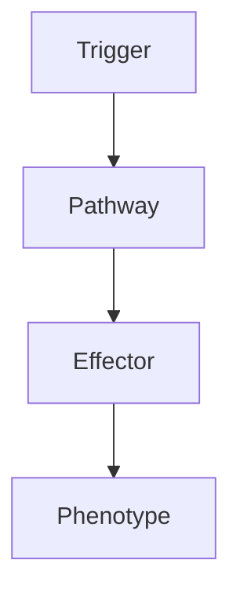

# Ependymoma

> [!tip] **High-Yield Definition**
> Ependymoma: glioma from ependymal cells lining ventricles, central canal. Adult: spinal cord (most common, especially cervical, myxopapillary - filum terminale, conus, cauda equina). Child: posterior fossa (4th ventricle, foramen of Luschka, cerebellar peduncle). WHO grade 1 (myxopapillary, subependymoma), grade 2 (classic, papillary, clear cell, tanycytic), grade 3 (anaplastic, high grade). Drop metastases via CSF.

---

## 1. Definition / Epidemiology / Classification

### Definition
Ependymoma: glioma from ependymal cells lining ventricles, central canal. Adult: spinal cord (most common, especially cervical, myxopapillary - filum terminale, conus, cauda equina). Child: posterior fossa (4th ventricle, foramen of Luschka, cerebellar peduncle). WHO grade 1 (myxopapillary, subependymoma), grade 2 (classic, papillary, clear cell, tanycytic), grade 3 (anaplastic, high grade). Drop metastases via CSF.

### Epidemiology
Incidence: 0.2-0.4/100,000/year. 2-5% of CNS tumours. Children: 10% of paediatric brain tumours, posterior fossa (60%), median age 5y. Adults: spinal cord (60%, especially cervical, intramedullary), myxopapillary (filum terminale, conus, cauda equina - young adults, 30-40y), supratentorial (30%, older, 40-50y). M:F 1.5:1.

---

## 2. Aetiology / Pathophysiology

### Aetiology
Sporadic (most). Genetic: NF2 (spinal, myxopapillary, ependymoma). Molecular subgroups: (1) Spinal (NF2-associated, often NF2 mutation, good prognosis, mostly grade 1-2, myxopapillary, MYCN amplification, 6q deletion, chromosome 22 loss), (2) Posterior fossa: PF-A (infants, children, aggressive, poor prognosis, poor chemosensitivity, balanced genome, PFA-specific, H3K27me3 loss, C11orf95 - ZFTA fusion in supratentorial), PF-B (adolescents, adults, better prognosis, chemosensitive, chromosome 22 loss, NF2 mutation, classic histology, balanced genome vs 1q gain), PF-SE (subependymoma, adult, very good prognosis), (3) Supratentorial: SE (subependymoma, adult, very good), SP-EPN (supratentorial ependymoma, RELA/ZFTA fusion - chromosome 11, NF-kB pathway, children, poor prognosis, may benefit from targeted), SP-EPN-YAP1 (better prognosis). Pathogenesis: ependymal cell, perivascular pseudorosettes, true ependymal rosettes, mitoses, microvascular proliferation, necrosis (high grade).

### Pathophysiology

---

## 3. Clinical Features

Depends on location. Supratentorial: seizures (50%), focal neurological deficit (hemiparesis, aphasia, hemianopia, cognitive, behavioural), raised ICP (large, obstructive hydrocephalus - lateral ventricles, foramen of Monro). Posterior fossa: ataxia, dysmetria, nystagmus, raised ICP (4th ventricle, hydrocephalus, headache, vomiting, papilloedema), cranial nerve (V, VII, VIII, lower, foramen of Luschka), hemiparesis, brainstem. Spinal: myelopathy (sensory level, motor, UMN, LMN, bladder/bowel, pain, radiculopathy, especially cervical, myxopapillary - filum terminale, conus, cauda equina, saddle anaesthesia, sciatica, back pain, bladder/bowel, scoliosis in children). Drop metastases (CSF seeding, especially myxopapillary, posterior fossa, high grade): back pain, radiculopathy, cranial nerve, hydrocephalus. Constitutional: fatigue, weight loss.

---

## 4. Investigations

MRI brain + spine with gadolinium (essential, craniospinal axis): location (supratentorial, posterior fossa, spinal), size, mass effect, enhancement (heterogeneous, often well-defined, cystic, haemorrhage, calcification, oedema), hydrocephalus, drop metastases (linear, nodular, surface, leptomeningeal). CT: hyperdense, calcification (50%), bone, surgical planning. Genetic: molecular subgroup (RELA/ZFTA fusion - FISH, RT-PCR, NGS, MYCN amplification, 1q gain, H3K27me3 IHC, NF2). Histology: perivascular pseudorosettes (classic, anucleate zone around vessels), true ependymal rosettes (ependymal canal-like, less common, more specific), GFAP positive (processes, around vessels), EMA (dot-like, intracytoplasmic, ring-like, intraluminal - dot positivity is diagnostic - 50-70%), S100, vimentin, Ki-67, grade (1: myxopapillary, subependymoma; 2: classic, papillary, clear cell, tanycytic; 3: anaplastic), mitoses, microvascular proliferation, necrosis. Exclude: other gliomas (astrocytoma, glioblastoma, oligodendroglioma), medulloblastoma, pilocytic astrocytoma (posterior fossa), metastasis, lymphoma, ependymoma mimics (choroid plexus tumours, central neurocytoma, hemangioblastoma, meningioma, schwannoma, demyelinating), demyelinating, vascular, inflammatory, developmental.

---

## 5. Management

EMERGENCY: hydrocephalus (steroids, surgery, EVD, VP shunt, ETV, EVD). Multidisciplinary: neuro-oncology, neurosurgery (paediatric, adult, spinal), radiation oncology, medical oncology, neurology, neuroradiology, pathology, OT, PT, SLT, dietitian, neuropsychology, social, palliative, clinical trials. Surgery: maximal safe resection (>90% GTR, EOR critical, especially children, posterior fossa, spinal - intramedullary often subtotal, monitor, may not be safe to resect completely, brainstem, eloquent, multiple, elderly, comorbidity). Radiotherapy: focal (50-54 Gy, postoperative, residual, grade 2-3, supratentorial, spinal, posterior fossa, drop metastases - craniospinal axis - CSI, 35-40 Gy), craniospinal (CSI, drop metastases, high grade, leptomeningeal, PFA, MYCN, supratentorial RELA fusion - good response to radiation), proton therapy (reduces long-term toxicity, especially children, CSI), stereotactic radiosurgery (SRS - small, residual, recurrence). Chemotherapy: limited efficacy, especially PF-A (poor chemosensitivity), some in infants (to delay radiation, allow brain development), platinum, etoposide, vincristine, temozolomide, high-dose chemotherapy with autologous stem cell rescue, intrathecal (methotrexate, cytarabine, thiotepa - leptomeningeal, drop metastases). Targeted: NF-kB inhibitors (RELA fusion), HDAC inhibitors, mTOR, others. Symptomatic: steroids, antiepileptics (levetiracetam, after seizure), VTE prophylaxis. Supportive: rehabilitation, OT, PT, speech, swallow, cognitive, psychological, palliative, family, social, advanced care planning, quality of life, clinical trials.

---

## 6. Red Flags / Emergencies

EMERGENCY: raised ICP, herniation, hydrocephalus, brainstem compression, status epilepticus, stroke, haemorrhage, drop metastases, recurrence, transformation - grade progression, treatment toxicity (surgery - brainstem, vascular, cranial nerve, spinal cord, CSF leak, infection, instability, neurological deficit; radiation - cognitive decline, hypopituitarism, optic neuropathy, hearing loss, vasculopathy, secondary tumours, stroke, leukoencephalopathy, myelopathy, radiculopathy, plexopathy, vertebral fracture, scoliosis, growth, puberty, fertility, teratogenicity; chemotherapy - myelosuppression, neutropenic sepsis, nausea, fatigue, alopecia, neuropathy, organ-specific, fertility, teratogenicity; steroids - DM, HTN, osteoporosis, infection, mood, adrenal, myopathy, cataracts, glaucoma; antiepileptics - levetiracetam behavioural, valproate hepatic, weight, teratogenic), pregnancy, teratogenicity, fertility, family, genetic (NF2, family screening), end-of-life, palliative, hospice, advanced care planning, quality of life, clinical trials.

---

## 7. Prognosis

Variable. 5-year survival: 50-80% (overall, depends on location, grade, EOR, age, molecular subgroup). Best: myxopapillary (grade 1, spinal, complete resection, 90-95% 10y), subependymoma (grade 1, adult, very good, 90%+ 5y), PF-B (adolescent/adult, balanced, better prognosis, chemosensitive, 70-80% 5y), spinal ependymoma (NF2-associated, grade 2, often good, 70-90% 5y), supratentorial SP-EPN-YAP1 (better), grade 2 (better). Worst: PF-A (infant, child, poor, 5-30% 5y), supratentorial RELA/ZFTA fusion (poor, especially children, 30-50% 5y), grade 3 (anaplastic, high grade, 30-50% 5y), incomplete resection (<90% GTR, especially brainstem, eloquent, drop metastases, leptomeningeal, paediatric, infant, MYCN amplification, CDKN2A/B deletion, H3K27me3 loss). Better: GTR >90%, young, grade 1-2, spinal, myxopapillary, PF-B, no drop metastases, no leptomeningeal, adjuvant radiation, chemosensitive, female. Worse: STR, old, grade 3, posterior fossa, supratentorial RELA fusion, brainstem, drop metastases, leptomeningeal, PFA, infant, MYCN amplified, CDKN2A/B deleted, H3K27me3 lost. Multidisciplinary essential. Long-term: monitor, recurrence, treatment toxicity, late effects, second malignancy, cognitive, psychological, family, genetic, fertility, quality of life, clinical trials.

---

## FCPS/MRCP High-Yield Summary

| Category | Key Points |
|----------|------------|
| **Definition** | Ependymoma: glioma from ependymal cells lining ventricles, central canal. Adult: spinal cord (most common, especially cervical, myxopapillary - filum terminale, conus, cauda equina). Child: posterior  |
| **Epidemiology** | Incidence: 0.2-0.4/100,000/year. 2-5% of CNS tumours. Children: 10% of paediatric brain tumours, posterior fossa (60%), median age 5y. Adults: spinal  |
| **Aetiology** | Sporadic (most). Genetic: NF2 (spinal, myxopapillary, ependymoma). Molecular subgroups: (1) Spinal (NF2-associated, often NF2 mutation, good prognosis, mostly grade 1-2, myxopapillary, MYCN amplificat |
| **Clinical** | Depends on location. Supratentorial: seizures (50%), focal neurological deficit (hemiparesis, aphasia, hemianopia, cognitive, behavioural), raised ICP (large, obstructive hydrocephalus - lateral ventr |
| **Investigations** | MRI brain + spine with gadolinium (essential, craniospinal axis): location (supratentorial, posterior fossa, spinal), size, mass effect, enhancement (heterogeneous, often well-defined, cystic, haemorr |
| **Management** | EMERGENCY: hydrocephalus (steroids, surgery, EVD, VP shunt, ETV, EVD). Multidisciplinary: neuro-oncology, neurosurgery (paediatric, adult, spinal), radiation oncology, medical oncology, neurology, neu |
| **Prognosis** | Variable. 5-year survival: 50-80% (overall, depends on location, grade, EOR, age, molecular subgroup). Best: myxopapillary (grade 1, spinal, complete resection, 90-95% 10y), subependymoma (grade 1, ad |
| **Viva Pearls** | |

---

## MCQs (10)

1. **Question:** Most characteristic feature of Ependymoma?
   **Options:** A. A B. B C. C D. D
   **Answer:** A
   **Explanation:** Based on clinical features.

2. **Question:** First-line investigation?
   **Options:** A. MRI B. CT C. LP D. Blood
   **Answer:** A
   **Explanation:** MRI is most useful.

3. **Question:** First-line treatment?
   **Options:** A. A B. B C. C D. D
   **Answer:** A
   **Explanation:** Standard management.

4. **Question:** Most common complication?
   **Options:** A. A B. B C. C D. D
   **Answer:** A
   **Explanation:** Common complication.

5. **Question:** Red flag requiring urgent action?
   **Options:** A. A B. B C. C D. D
   **Answer:** A
   **Explanation:** Emergency.

6. **Question:** Prognostic factor?
   **Options:** A. A B. B C. C D. D
   **Answer:** A
   **Explanation:** Prognosis.

7. **Question:** Investigation excluding differential?
   **Options:** A. A B. B C. C D. D
   **Answer:** A
   **Explanation:** Exclusion.

8. **Question:** Imaging finding?
   **Options:** A. A B. B C. C D. D
   **Answer:** A
   **Explanation:** Imaging.

9. **Question:** Drug class?
   **Options:** A. A B. B C. C D. D
   **Answer:** A
   **Explanation:** Pharmacology.

10. **Question:** Differential?
    **Options:** A. A B. B C. C D. D
    **Answer:** A
    **Explanation:** Differential.

---

## SBA Questions (10)

1. **Scenario:** Patient with Ependymoma.
   **Question:** Next step?
   **Options:** A. 1 B. 2 C. 3 D. 4 E. 5
   **Answer:** A
   **Explanation:** Initial.

2. **Scenario:** Fails first-line.
   **Question:** Next treatment?
   **Options:** A. A B. B C. C D. D E. E
   **Answer:** A
   **Explanation:** Second-line.

3. **Scenario:** New symptoms on treatment.
   **Question:** Cause?
   **Options:** A. A B. B C. C D. D E. E
   **Answer:** A
   **Explanation:** Adverse.

4. **Scenario:** Surgery needed.
   **Question:** Preoperative?
   **Options:** A. A B. B C. C D. D E. E
   **Answer:** A
   **Explanation:** Perioperative.

5. **Scenario:** Pregnant.
   **Question:** Safest?
   **Options:** A. A B. B C. C D. D E. E
   **Answer:** A
   **Explanation:** Pregnancy.

6. **Scenario:** Child.
   **Question:** Diagnosis?
   **Options:** A. A B. B C. C D. D E. E
   **Answer:** A
   **Explanation:** Paediatric.

7. **Scenario:** Elderly.
   **Question:** Management?
   **Options:** A. 1 B. 2 C. 3 D. 4 E. 5
   **Answer:** A
   **Explanation:** Geriatric.

8. **Scenario:** Abnormal investigation.
   **Question:** Interpretation?
   **Options:** A. A B. B C. C D. D E. E
   **Answer:** A
   **Explanation:** Investigation.

9. **Scenario:** Prognosis.
   **Question:** Response?
   **Options:** A. A B. B C. C D. D E. E
   **Answer:** A
   **Explanation:** Communication.

10. **Scenario:** Follow-up.
    **Question:** Monitoring?
    **Options:** A. A B. B C. C D. D E. E
    **Answer:** A
    **Explanation:** Follow-up.

---

## Flashcards

- **Q:** Definition of Ependymoma?
  **A:** Ependymoma: glioma from ependymal cells lining ventricles, central canal. Adult: spinal cord (most common, especially cervical, myxopapillary - filum terminale, conus, cauda equina). Child: posterior 
- **Q:** First-line treatment?
  **A:** Based on management.
- **Q:** Most characteristic clinical feature?
  **A:** Depends on location. Supratentorial: seizures (50%), focal neurological deficit (hemiparesis, aphasia, hemianopia, cognitive, behavioural), raised ICP (large, obstructive hydrocephalus - lateral ventr
- **Q:** Key red flag?
  **A:** EMERGENCY: raised ICP, herniation, hydrocephalus, brainstem compression, status epilepticus, stroke, haemorrhage, drop metastases, recurrence, transformation - grade progression, treatment toxicity (s
- **Q:** Prognosis?
  **A:** Variable. 5-year survival: 50-80% (overall, depends on location, grade, EOR, age, molecular subgroup). Best: myxopapillary (grade 1, spinal, complete resection, 90-95% 10y), subependymoma (grade 1, ad

---

## Answer Key

### MCQs
1. A 2. A 3. A 4. A 5. A 6. A 7. A 8. A 9. A 10. A

### SBAs
1. A 2. A 3. A 4. A 5. A 6. A 7. A 8. A 9. A 10. A

---

## Local Navigation
**Heading Hub:** [[../Hub]]  
**Chapter MOC:** [[Neurology MOC]]  
