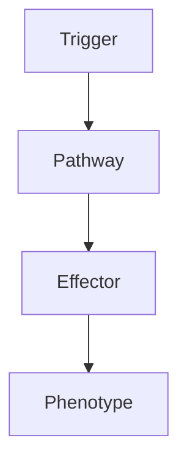

# Gliomatosis Cerebri

> [!tip] **High-Yield Definition**
> Gliomatosis cerebri: rare, diffusely infiltrating glioma involving ≥3 cerebral lobes, often bilateral, often with relative preservation of underlying architecture. WHO 2021: reclassified as diffuse glioma (astrocytoma, IDH-mutant or oligodendroglioma, IDH-mutant + 1p/19q co-deleted) with extensive infiltration. Adult onset, poor prognosis.

---

## 1. Definition / Epidemiology / Classification

### Definition
Gliomatosis cerebri: rare, diffusely infiltrating glioma involving ≥3 cerebral lobes, often bilateral, often with relative preservation of underlying architecture. WHO 2021: reclassified as diffuse glioma (astrocytoma, IDH-mutant or oligodendroglioma, IDH-mutant + 1p/19q co-deleted) with extensive infiltration. Adult onset, poor prognosis.

### Epidemiology
Rare. 0.05/100,000/year. Adult onset (40-60y). M:F 1.5:1. Often young, large, extensive, poor prognosis.

---

## 2. Aetiology / Pathophysiology

### Aetiology
Diffuse glioma: IDH mutation, 1p/19q co-deletion, ATRX loss, p53 mutation, TERT promoter, MGMT methylation. Pathogenesis: diffuse infiltration, often bilateral, often crosses corpus callosum, often spares cortex, extensive.

### Pathophysiology

---

## 3. Clinical Features

Insidious onset, slowly progressive, often non-specific, large tumour burden, often bilateral. Cognitive/behavioural change (50%, frontal, memory, personality, executive, dementia-like), seizures (30-50%, focal, secondary), focal neurological deficit (30-50%, hemiparesis, aphasia, hemianopia, ataxia, cranial nerve), raised ICP (headache, vomiting, papilloedema, altered consciousness, hydrocephalus, large), gait disturbance, incontinence, sensory, visual, speech, swallow. Often subtle, large, late presentation, difficult to localise.

---

## 4. Investigations

MRI brain with gadolinium (gold standard): diffuse, infiltrating, ≥3 lobes, often bilateral, often crossing corpus callosum, T2/FLAIR hyperintense, T1 iso/hypointense, often minimal or no enhancement, mass effect often minimal, often spares cortex, basal ganglia, thalamus, brainstem, cerebellum, smear or infiltrative appearance, expansion of white matter. CT: hypodense, no enhancement, mass effect minimal. MR spectroscopy: elevated choline, decreased NAA, lactate. PET: amino acid (FET, MET - high uptake, recurrence), FDG (variable, low-grade may be normal). Genetic: IDH1/2, 1p/19q, TERT, ATRX, p53, MGMT, CDKN2A/B. Biopsy: stereotactic (essential, may be difficult, deep, eloquent, bilateral, navigation, frame, robotic, awake, may need multiple targets), open (if accessible, large, mass effect, debulking). Histology: same as diffuse glioma - astrocytoma (IDH-mutant, ATRX loss, p53 mutant) or oligodendroglioma (IDH-mutant + 1p/19q co-deleted), Ki-67, grade. Exclude: multifocal/multicentric glioma, primary CNS lymphoma, viral encephalitis, demyelinating, metabolic, vascular, inflammatory, toxic, drug-induced, ADEM, HIV PML.

---

## 5. Management

Multidisciplinary: neuro-oncology, neurosurgery, radiation oncology, medical oncology, neurology, palliative, neuroradiology, pathology, OT, PT, SLT, dietitian, neuropsychology, social, palliative, clinical trials. Biopsy: stereotactic (essential), open (if accessible, large, mass effect, debulking). Surgery: limited role (diffuse, eloquent, bilateral, extensive, may not benefit, may worsen, may be palliative for mass effect, hydrocephalus, large, accessible, biopsy, debulking), biopsy only often. Radiotherapy: focal (symptomatic, mass effect, progression, may be limited, large, bilateral, dose-limiting, normal brain toxicity, cognitive decline, especially young), whole brain (limited, toxic, may not benefit), focal to symptomatic area or highest grade. Chemotherapy: temozolomide (first-line, oral, outpatient, well-tolerated, especially with MGMT methylation, IDH-mutant, oligodendroglioma - PCV or temozolomide, IDH-mutant astrocytoma - temozolomide or PCV), PCV (oligodendroglioma, 1p/19q - CODEL trial, similar efficacy, different toxicity), other (lomustine, CCNU, carmustine, BCNU - wafers, Gliadel, intraoperative), IDH inhibitors (vorasidenib - IDH1/2, INDIGO trial, PFS benefit, approved for IDH-mutant grade 2 astrocytoma and oligodendroglioma requiring surgery), targeted, immunotherapy (PD-1, CTLA-4 - limited, trial). Symptomatic: steroids, antiepileptics (levetiracetam preferred), VTE prophylaxis. Supportive: rehabilitation, OT, PT, speech, swallow, cognitive, psychological, palliative, family, social, advanced care planning, quality of life, clinical trials.

---

## 6. Red Flags / Emergencies

Progression, transformation to higher grade, raised ICP, hydrocephalus, status epilepticus, herniation, leptomeningeal (rare), systemic, drug side effects (chemotherapy - myelosuppression, neutropenic sepsis, fatigue, nausea, liver, lung, kidney, fertility, teratogenicity; IDH inhibitors - differentiation syndrome, QT, leukocytosis, arthralgia, GI, fatigue; immunotherapy - irAEs, colitis, hepatitis, pneumonitis, thyroiditis, hypophysitis, hypopituitarism, DM, myositis, myocarditis, neuropathy, skin, severe, life-threatening; steroids - DM, HTN, osteoporosis, infection, mood, adrenal, myopathy, cataracts, glaucoma; antiepileptics - levetiracetam behavioural, valproate hepatic, weight, teratogenic; enzyme-inducing - interactions, OCP, warfarin, DOACs, ART, chemotherapy; radiation - radiation necrosis, cognitive decline, optic neuropathy, hypopituitarism, secondary tumours, vasculopathy, stroke, leukoencephalopathy; VTE prophylaxis - intracranial haemorrhage, heparin-induced thrombocytopenia), pseudoprogression, treatment failure, end-of-life, palliative, hospice, family, advanced care planning, driving, work, quality of life, clinical trials.

---

## 7. Prognosis

Variable. Median survival: 12-24 months (better with IDH-mutant + 1p/19q co-deletion - oligodendroglioma, 24-60 months; worse with IDH-mutant only astrocytoma, 12-24 months; worst with IDH-wildtype, 6-12 months). Grade matters. Treatment: response to temozolomide, PCV, IDH inhibitors (vorasidenib - promising, INDIGO - improved PFS), radiation (response, but large, bilateral, cognitive, dose-limiting). Worse: older, KPS <70, neurological deficit, IDH-wildtype, 1p/19q intact, CDKN2A/B deletion, multiple lobes, brainstem, leptomeningeal, progressive, no treatment. Better: young, KPS ≥70, no neurological deficit, IDH-mutant + 1p/19q, MGMT methylated, oligodendroglioma, grade 2, focal, resectable, treatment. Multidisciplinary essential. Long-term: monitor, recurrence, treatment toxicity, cognitive, psychological, family, quality of life, clinical trials, end-of-life, palliative, hospice, advanced care planning. Genetic: IDH, 1p/19q, ATRX, p53, TERT, MGMT, CDKN2A/B.

---

## FCPS/MRCP High-Yield Summary

| Category | Key Points |
|----------|------------|
| **Definition** | Gliomatosis cerebri: rare, diffusely infiltrating glioma involving ≥3 cerebral lobes, often bilateral, often with relative preservation of underlying architecture. WHO 2021: reclassified as diffuse gl |
| **Epidemiology** | Rare. 0.05/100,000/year. Adult onset (40-60y). M:F 1.5:1. Often young, large, extensive, poor prognosis. |
| **Aetiology** | Diffuse glioma: IDH mutation, 1p/19q co-deletion, ATRX loss, p53 mutation, TERT promoter, MGMT methylation. Pathogenesis: diffuse infiltration, often bilateral, often crosses corpus callosum, often sp |
| **Clinical** | Insidious onset, slowly progressive, often non-specific, large tumour burden, often bilateral. Cognitive/behavioural change (50%, frontal, memory, personality, executive, dementia-like), seizures (30- |
| **Investigations** | MRI brain with gadolinium (gold standard): diffuse, infiltrating, ≥3 lobes, often bilateral, often crossing corpus callosum, T2/FLAIR hyperintense, T1 iso/hypointense, often minimal or no enhancement, |
| **Management** | Multidisciplinary: neuro-oncology, neurosurgery, radiation oncology, medical oncology, neurology, palliative, neuroradiology, pathology, OT, PT, SLT, dietitian, neuropsychology, social, palliative, cl |
| **Prognosis** | Variable. Median survival: 12-24 months (better with IDH-mutant + 1p/19q co-deletion - oligodendroglioma, 24-60 months; worse with IDH-mutant only astrocytoma, 12-24 months; worst with IDH-wildtype, 6 |
| **Viva Pearls** | |

---

## MCQs (10)

1. **Question:** Most characteristic feature of Gliomatosis Cerebri?
   **Options:** A. A B. B C. C D. D
   **Answer:** A
   **Explanation:** Based on clinical features.

2. **Question:** First-line investigation?
   **Options:** A. MRI B. CT C. LP D. Blood
   **Answer:** A
   **Explanation:** MRI is most useful.

3. **Question:** First-line treatment?
   **Options:** A. A B. B C. C D. D
   **Answer:** A
   **Explanation:** Standard management.

4. **Question:** Most common complication?
   **Options:** A. A B. B C. C D. D
   **Answer:** A
   **Explanation:** Common complication.

5. **Question:** Red flag requiring urgent action?
   **Options:** A. A B. B C. C D. D
   **Answer:** A
   **Explanation:** Emergency.

6. **Question:** Prognostic factor?
   **Options:** A. A B. B C. C D. D
   **Answer:** A
   **Explanation:** Prognosis.

7. **Question:** Investigation excluding differential?
   **Options:** A. A B. B C. C D. D
   **Answer:** A
   **Explanation:** Exclusion.

8. **Question:** Imaging finding?
   **Options:** A. A B. B C. C D. D
   **Answer:** A
   **Explanation:** Imaging.

9. **Question:** Drug class?
   **Options:** A. A B. B C. C D. D
   **Answer:** A
   **Explanation:** Pharmacology.

10. **Question:** Differential?
    **Options:** A. A B. B C. C D. D
    **Answer:** A
    **Explanation:** Differential.

---

## SBA Questions (10)

1. **Scenario:** Patient with Gliomatosis Cerebri.
   **Question:** Next step?
   **Options:** A. 1 B. 2 C. 3 D. 4 E. 5
   **Answer:** A
   **Explanation:** Initial.

2. **Scenario:** Fails first-line.
   **Question:** Next treatment?
   **Options:** A. A B. B C. C D. D E. E
   **Answer:** A
   **Explanation:** Second-line.

3. **Scenario:** New symptoms on treatment.
   **Question:** Cause?
   **Options:** A. A B. B C. C D. D E. E
   **Answer:** A
   **Explanation:** Adverse.

4. **Scenario:** Surgery needed.
   **Question:** Preoperative?
   **Options:** A. A B. B C. C D. D E. E
   **Answer:** A
   **Explanation:** Perioperative.

5. **Scenario:** Pregnant.
   **Question:** Safest?
   **Options:** A. A B. B C. C D. D E. E
   **Answer:** A
   **Explanation:** Pregnancy.

6. **Scenario:** Child.
   **Question:** Diagnosis?
   **Options:** A. A B. B C. C D. D E. E
   **Answer:** A
   **Explanation:** Paediatric.

7. **Scenario:** Elderly.
   **Question:** Management?
   **Options:** A. 1 B. 2 C. 3 D. 4 E. 5
   **Answer:** A
   **Explanation:** Geriatric.

8. **Scenario:** Abnormal investigation.
   **Question:** Interpretation?
   **Options:** A. A B. B C. C D. D E. E
   **Answer:** A
   **Explanation:** Investigation.

9. **Scenario:** Prognosis.
   **Question:** Response?
   **Options:** A. A B. B C. C D. D E. E
   **Answer:** A
   **Explanation:** Communication.

10. **Scenario:** Follow-up.
    **Question:** Monitoring?
    **Options:** A. A B. B C. C D. D E. E
    **Answer:** A
    **Explanation:** Follow-up.

---

## Flashcards

- **Q:** Definition of Gliomatosis Cerebri?
  **A:** Gliomatosis cerebri: rare, diffusely infiltrating glioma involving ≥3 cerebral lobes, often bilateral, often with relative preservation of underlying architecture. WHO 2021: reclassified as diffuse gl
- **Q:** First-line treatment?
  **A:** Based on management.
- **Q:** Most characteristic clinical feature?
  **A:** Insidious onset, slowly progressive, often non-specific, large tumour burden, often bilateral. Cognitive/behavioural change (50%, frontal, memory, personality, executive, dementia-like), seizures (30-
- **Q:** Key red flag?
  **A:** Progression, transformation to higher grade, raised ICP, hydrocephalus, status epilepticus, herniation, leptomeningeal (rare), systemic, drug side effects (chemotherapy - myelosuppression, neutropenic
- **Q:** Prognosis?
  **A:** Variable. Median survival: 12-24 months (better with IDH-mutant + 1p/19q co-deletion - oligodendroglioma, 24-60 months; worse with IDH-mutant only astrocytoma, 12-24 months; worst with IDH-wildtype, 6

---

## Answer Key

### MCQs
1. A 2. A 3. A 4. A 5. A 6. A 7. A 8. A 9. A 10. A

### SBAs
1. A 2. A 3. A 4. A 5. A 6. A 7. A 8. A 9. A 10. A

---

## Local Navigation
**Heading Hub:** [[../Hub]]  
**Chapter MOC:** [[Neurology MOC]]  
