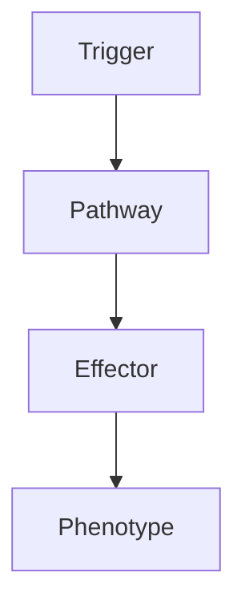

# Medulloblastoma

> [!tip] **High-Yield Definition**
> Medulloblastoma: malignant, embryonal, small round blue cell tumour of cerebellum (vermis, hemispheres), 4th ventricle. Most common malignant brain tumour in children (peak 3-7y). WHO grade 4. Drop metastases via CSF (up to 30% at diagnosis). Highly radiosensitive, chemosensitive.

---

## 1. Definition / Epidemiology / Classification

### Definition
Medulloblastoma: malignant, embryonal, small round blue cell tumour of cerebellum (vermis, hemispheres), 4th ventricle. Most common malignant brain tumour in children (peak 3-7y). WHO grade 4. Drop metastases via CSF (up to 30% at diagnosis). Highly radiosensitive, chemosensitive.

### Epidemiology
Incidence: 0.5-1/100,000/year. 20% of paediatric brain tumours. Most common malignant paediatric brain tumour. Bimodal: children (peak 3-7y), young adults (20-40y). M:F 1.5:1. Risk factors: Gorlin syndrome, Turcot syndrome, Li-Fraumeni.

---

## 2. Aetiology / Pathophysiology

### Aetiology
Cerebellum (vermis - midline, classical, children; hemispheres - lateral, adult). Molecular subgroups (2012, 2020, 2024): WNT (best prognosis, 90%+ 5y, children, beta-catenin, monosomy 6, CTNNB1), SHH (children, adults, intermediate, PTCH1, SUFU, SMO, TP53, GLI2, infant, adolescent, adult - desmoplastic, MBEN, medulloblastoma with extensive nodularity, TP53 mutation - poor), Group 3 (children, worst prognosis, 50-60% 5y, MYC amplification, isochromosome 17q, classic histology, often metastatic, infants, CSF seeding), Group 4 (children, intermediate prognosis, 70-80% 5y, isochromosome 17q, classic histology, cerebellar, often metastatic). Pathogenesis: SHH pathway, WNT pathway, MYC, TP53, chromatin remodelling, neuronal development, granule cell precursor, embryonal, small round blue cell, Homer Wright rosettes, mitoses, high Ki-67, undifferentiated.

### Pathophysiology

---

## 3. Clinical Features

Children: cerebellar (ataxia, truncal, gait, limb, dysmetria, dysarthria, nystagmus, dysdiadochokinesia, broad-based gait, falling), raised ICP (4th ventricle, hydrocephalus, headache - morning, Valsalva, vomiting, papilloedema, Cushing triad - bradycardia, hypertension, irregular respiration, lethargy, coma), behavioural (irritability, lethargy, fatigue, decline), focal neurological (cranial nerve VI, VII, brainstem, hemiparesis, diplopia, visual, torticollis, neck stiffness), seizures (10-20%), truncal ataxia (midline, vermis), appendicular ataxia (hemispheres). Adult: often lateral, hemispheric, more subtle, slower, more likely cerebellar hemispheric. Constitutional: weight loss, fatigue, nausea. Drop metastases: back pain, radiculopathy, sciatica, cauda equina, myelopathy, leptomeningeal, cranial nerve, hydrocephalus. Recurrence: at primary site, drop metastases, leptomeningeal, supratentorial (rare, 5%).

---

## 4. Investigations

MRI brain + craniospinal axis with gadolinium (essential): cerebellum (vermis, midline, 4th ventricle, hemispheres), T2/FLAIR hyperintense, T1 hypointense, heterogeneous enhancement, restricted diffusion, often well-defined, mass effect, hydrocephalus (4th ventricle, foramen of Luschka), drop metastases (linear, nodular, surface, leptomeningeal, cranial nerve, spinal - cauda equina, conus, lumbar, thoracic, cervical), staging (Chang classification: M0 no metastasis, M1 CSF cells, M2 intracranial, M3 spinal, M4 extraneural). CT: hyperdense, calcification (20%), haemorrhage (rare), hydrocephalus, staging. CSF: cytology (positive 10-30%, increases with metastasis, send after surgery - false positive from surgery), protein, glucose, opening pressure, cytology, flow cytometry, biomarkers (CSF - ctDNA, GFAP, beta-catenin, WNT - SHH - Group 3/4 - emerging). Bloods: FBC, U&Es, LFTs, coagulation, tumour markers (AFP, beta-hCG - exclude germ cell), genetic counselling. Genetic: germline (PTCH1 - Gorlin, APC - Turcot, TP53 - Li-Fraumeni), somatic (CTNNB1, PTCH1, SUFU, SMO, GLI2, MYC, TP53, isochromosome 17q, monosomy 6), molecular subgroup (WNT - beta-catenin IHC, monosomy 6, CTNNB1, SHH - PTCH1, SMO, SUFU, GLI2, TP53, desmoplastic, MBEN, Group 3 - MYC amplification, isochromosome 17q, Group 4 - isochromosome 17q, SNCAIP, KDM6A), NGS panel, methylation profiling. Histology: small round blue cell, Homer Wright rosettes (neuroblastic, around central neuropil), mitoses, high Ki-67, undifferentiated, classic, desmoplastic/nodular, MBEN, large cell/anaplastic. Exclude: ependymoma, pilocytic astrocytoma, ATRT, PNET, pineoblastoma, retinoblastoma, germ cell, teratoma, metastasis, lymphoma, demyelinating, vascular, inflammatory, developmental.

---

## 5. Management

EMERGENCY: hydrocephalus (steroids, EVD, shunt, ETV, surgery - upfront, may resolve, may be needed). Multidisciplinary: paediatric/clinical oncology, neurosurgery, radiation oncology, neurology, neuroradiology, pathology, neuropsychology, OT, PT, SLT, dietitian, social, palliative, clinical trials, school, education, fertility, late effects. Surgery: maximal safe resection (>90% GTR, EOR critical, may need second look, postoperative, depends on brainstem, eloquent, residual, hydrocephalus, age). Risk stratification: average risk (GTR/near-total, no metastasis, age >3y, favourable biology - WNT, SHH-non-TP53-mutant), high risk (subtotal, metastasis, age <3y, unfavourable biology - Group 3, SHH-TP53-mutant, large cell/anaplastic). Radiotherapy: craniospinal axis (CSI - 23.4-36 Gy, 1.6-1.8 Gy fractions, 13-20 fractions, posterior fossa boost 54 Gy, standard for >3y), reduced-dose CSI (low-risk, 18-23.4 Gy, to reduce cognitive - WNT, infant, SHH), proton therapy (reduces long-term toxicity, cognitive, endocrine, hearing, growth, secondary malignancy, dose to normal brain, OAR sparing), focal (WNT, infant - controversial, SHH - controversial, may be omitted in selected). Chemotherapy: standard (vincristine, etoposide, carboplatin/cisplatin, cyclophosphamide - COJEC, Head Start, SIOP), high-dose (with autologous stem cell rescue - Head Start III, COJEC), maintenance (oral - temozolomide, etoposide - controversial), intrathecal (methotrexate, cytarabine, thiotepa - high-risk, leptomeningeal), targeted (SHH - SMO inhibitors - vismodegib, sonidegib, arsenic trioxide, itraconazole - hedgehog pathway - clinical trials, controversial, may select for resistance; SHH-TP53-mutant - ineffective; WNT - targeted, mostly favourable, may de-escalate; Group 3/4 - conventional chemo, no targeted, trials), immunotherapy (pembrolizumab, nivolumab - clinical trials, checkpoint, vaccines - emerging, CAR-T - emerging, GD2 - dinutuximab, anti-B7-H3, oncolytic virus), intraventricular (etoposide, methotrexate - emerging). Symptomatic: steroids, antiepileptics (levetiracetam, after seizure, not routine, may interfere with chemo), VTE prophylaxis (controversial, mechanical first, LMWH if stable), rehabilitation, OT, PT, speech, swallow, cognitive, psychological, palliative, family, social, fertility, pregnancy, end-of-life, advanced care planning, clinical trials.

---

## 6. Red Flags / Emergencies

EMERGENCY: raised ICP, herniation, hydrocephalus, brainstem compression, status epilepticus, stroke, haemorrhage (rare), drop metastases (up to 30% at diagnosis, often asymptomatic, may cause myelopathy, radiculopathy, cranial nerve, hydrocephalus, intracranial), leptomeningeal, recurrence (5-10y, often late, can be at primary site or drop metastases, especially high-risk, Group 3, MYC, TP53, residual, metastatic), transformation (rare), treatment toxicity (surgery - brainstem, cerebellar mutism syndrome, posterior fossa syndrome, 25% of paediatric, temporary, 1-2 weeks, mutism, ataxia, emotional lability, dysarthria, dysphagia, lasts days-weeks, may persist; radiation - cognitive decline - especially children, IQ drop, learning, attention, memory, processing, executive, behavioural, growth, endocrine - GH deficiency, hypothyroidism, hypogonadism, adrenal, puberty, fertility, hearing - cisplatin, ototoxicity, tinnitus, high-frequency; kidney, neurocognitive, vasculopathy, Moya-Moya, stroke, secondary tumours, optic neuropathy, cataract, brain necrosis; chemotherapy - myelosuppression, neutropenic sepsis, infection, mucositis, nausea, vomiting, diarrhoea, hepatotoxicity, nephrotoxicity - cisplatin, ototoxicity, peripheral neuropathy, fertility, teratogenicity, secondary leukaemia, alopecia, fatigue, fertility, hormonal; immunotherapy - irAEs, colitis, hepatitis, pneumonitis, thyroiditis, hypophysitis, hypopituitarism, DM, myositis, myocarditis, neuropathy, skin, severe, life-threatening; steroids - DM, HTN, osteoporosis, infection, mood, adrenal, myopathy, cataracts, glaucoma; antiepileptics - levetiracetam behavioural, valproate hepatic, weight, teratogenic; enzyme-inducing - interactions, OCP, warfarin, DOACs, ART, chemotherapy, especially important - many chemo agents are metabolised by CYP3A4, dexamethasone - many interactions), pregnancy (teratogenicity - MTX, alkylating, contraception essential), fertility (sperm, oocyte, ovarian, testicular, cryopreservation, hormonal protection - GnRH agonists, experimental), family, genetic (germline - 5%, especially SHH - Gorlin, TP53 - Li-Fraumeni, APC - Turcot), end-of-life, palliative, hospice, advanced care planning, driving, work, quality of life, clinical trials.

---

## 7. Prognosis

Variable. 5-year survival: 70-80% (average risk), 50-60% (high risk), 90%+ (WNT), 30-50% (Group 3, high-risk), 60-70% (SHH non-TP53), 40% (SHH-TP53, poor, infants, adolescents), 70-80% (Group 4, often metastatic, but better than Group 3, isochromosome 17q, SNCAIP, KDM6A). Best: WNT (90%+ 5y, often de-escalation, may omit radiation - WNT), infant SHH (MBEN, desmoplastic - 80-90% 5y, may de-escalate). Worst: Group 3, MYC amplified, TP53 mutated, SHH-TP53-mutant, infant <3y, metastatic, residual, recurrence, large cell/anaplastic histology, second malignancy, treatment toxicity, late effects, cognitive decline, endocrine, growth, fertility, family, quality of life, end-of-life. 10-year survival: 50-70% (long-term, treatment toxicity, late effects, secondary malignancy, recurrence, quality of life). Multidisciplinary essential. Long-term: monitor, MRI craniospinal axis (3, 6, 12 months, then q6-12 months for 5y, then annually if stable), CSF (cytology, biomarkers), bloods, endocrine, cognitive, hearing, growth, puberty, fertility, secondary malignancy, late effects, neuropsychology, family, genetic (germline, family screening, predictive, ethical), fertility, pregnancy, quality of life, clinical trials, support, advanced care planning. Genetic: germline (5%, WNT - monosomy 6, CTNNB1, APC - Turcot, SHH - PTCH1, SUFU, SMO, TP53 - Li-Fraumeni, BRCA2, PALB2, MSH2, MSH6, PMS2, NF1, Fanconi), somatic (WNT - CTNNB1, monosomy 6, SHH - PTCH1, SUFU, SMO, GLI2, MYCN, TP53, Group 3 - MYC amplification, isochromosome 17q, OTX2, Group 4 - isochromosome 17q, SNCAIP, KDM6A, RB1, KBTBD4), methylation profiling (best, reference). Research: targeted (SMO inhibitors, IDH, BRAF, FGFR, NTRK, EZH2, CDK4/6, MEK, PI3K, AKT, mTOR, WEE1, DNA repair, PARP, epigenetic), immunotherapy (PD-1, CTLA-4, vaccines, CAR-T, B7-H3, GD2, oncolytic virus, intraventricular, CED, hypermutator, bMMRD), BBB disruption (focused ultrasound, CED, intra-arterial, intrathecal, nanoparticles), gene therapy, liquid biopsy (ctDNA, CSF - early detection, monitoring, recurrence), precision medicine, AI, clinical trials, de-escalation (low-risk, WNT, infant SHH), escalation (high-risk, novel), biomarkers (predictive, prognostic, response, resistance - serial, liquid biopsy, imaging - amino acid PET, perfusion, diffusion, susceptibility), early detection, prevention, risk stratification, molecular subgroups, integrated diagnosis, classification (WHO 2021 CNS5, upcoming updates - methylation, integrated layered, molecular first, histology integration, AI).

---

## FCPS/MRCP High-Yield Summary

| Category | Key Points |
|----------|------------|
| **Definition** | Medulloblastoma: malignant, embryonal, small round blue cell tumour of cerebellum (vermis, hemispheres), 4th ventricle. Most common malignant brain tumour in children (peak 3-7y). WHO grade 4. Drop me |
| **Epidemiology** | Incidence: 0.5-1/100,000/year. 20% of paediatric brain tumours. Most common malignant paediatric brain tumour. Bimodal: children (peak 3-7y), young ad |
| **Aetiology** | Cerebellum (vermis - midline, classical, children; hemispheres - lateral, adult). Molecular subgroups (2012, 2020, 2024): WNT (best prognosis, 90%+ 5y, children, beta-catenin, monosomy 6, CTNNB1), SHH |
| **Clinical** | Children: cerebellar (ataxia, truncal, gait, limb, dysmetria, dysarthria, nystagmus, dysdiadochokinesia, broad-based gait, falling), raised ICP (4th ventricle, hydrocephalus, headache - morning, Valsa |
| **Investigations** | MRI brain + craniospinal axis with gadolinium (essential): cerebellum (vermis, midline, 4th ventricle, hemispheres), T2/FLAIR hyperintense, T1 hypointense, heterogeneous enhancement, restricted diffus |
| **Management** | EMERGENCY: hydrocephalus (steroids, EVD, shunt, ETV, surgery - upfront, may resolve, may be needed). Multidisciplinary: paediatric/clinical oncology, neurosurgery, radiation oncology, neurology, neuro |
| **Prognosis** | Variable. 5-year survival: 70-80% (average risk), 50-60% (high risk), 90%+ (WNT), 30-50% (Group 3, high-risk), 60-70% (SHH non-TP53), 40% (SHH-TP53, poor, infants, adolescents), 70-80% (Group 4, often |
| **Viva Pearls** | |

---

## MCQs (10)

1. **Question:** Most characteristic feature of Medulloblastoma?
   **Options:** A. A B. B C. C D. D
   **Answer:** A
   **Explanation:** Based on clinical features.

2. **Question:** First-line investigation?
   **Options:** A. MRI B. CT C. LP D. Blood
   **Answer:** A
   **Explanation:** MRI is most useful.

3. **Question:** First-line treatment?
   **Options:** A. A B. B C. C D. D
   **Answer:** A
   **Explanation:** Standard management.

4. **Question:** Most common complication?
   **Options:** A. A B. B C. C D. D
   **Answer:** A
   **Explanation:** Common complication.

5. **Question:** Red flag requiring urgent action?
   **Options:** A. A B. B C. C D. D
   **Answer:** A
   **Explanation:** Emergency.

6. **Question:** Prognostic factor?
   **Options:** A. A B. B C. C D. D
   **Answer:** A
   **Explanation:** Prognosis.

7. **Question:** Investigation excluding differential?
   **Options:** A. A B. B C. C D. D
   **Answer:** A
   **Explanation:** Exclusion.

8. **Question:** Imaging finding?
   **Options:** A. A B. B C. C D. D
   **Answer:** A
   **Explanation:** Imaging.

9. **Question:** Drug class?
   **Options:** A. A B. B C. C D. D
   **Answer:** A
   **Explanation:** Pharmacology.

10. **Question:** Differential?
    **Options:** A. A B. B C. C D. D
    **Answer:** A
    **Explanation:** Differential.

---

## SBA Questions (10)

1. **Scenario:** Patient with Medulloblastoma.
   **Question:** Next step?
   **Options:** A. 1 B. 2 C. 3 D. 4 E. 5
   **Answer:** A
   **Explanation:** Initial.

2. **Scenario:** Fails first-line.
   **Question:** Next treatment?
   **Options:** A. A B. B C. C D. D E. E
   **Answer:** A
   **Explanation:** Second-line.

3. **Scenario:** New symptoms on treatment.
   **Question:** Cause?
   **Options:** A. A B. B C. C D. D E. E
   **Answer:** A
   **Explanation:** Adverse.

4. **Scenario:** Surgery needed.
   **Question:** Preoperative?
   **Options:** A. A B. B C. C D. D E. E
   **Answer:** A
   **Explanation:** Perioperative.

5. **Scenario:** Pregnant.
   **Question:** Safest?
   **Options:** A. A B. B C. C D. D E. E
   **Answer:** A
   **Explanation:** Pregnancy.

6. **Scenario:** Child.
   **Question:** Diagnosis?
   **Options:** A. A B. B C. C D. D E. E
   **Answer:** A
   **Explanation:** Paediatric.

7. **Scenario:** Elderly.
   **Question:** Management?
   **Options:** A. 1 B. 2 C. 3 D. 4 E. 5
   **Answer:** A
   **Explanation:** Geriatric.

8. **Scenario:** Abnormal investigation.
   **Question:** Interpretation?
   **Options:** A. A B. B C. C D. D E. E
   **Answer:** A
   **Explanation:** Investigation.

9. **Scenario:** Prognosis.
   **Question:** Response?
   **Options:** A. A B. B C. C D. D E. E
   **Answer:** A
   **Explanation:** Communication.

10. **Scenario:** Follow-up.
    **Question:** Monitoring?
    **Options:** A. A B. B C. C D. D E. E
    **Answer:** A
    **Explanation:** Follow-up.

---

## Flashcards

- **Q:** Definition of Medulloblastoma?
  **A:** Medulloblastoma: malignant, embryonal, small round blue cell tumour of cerebellum (vermis, hemispheres), 4th ventricle. Most common malignant brain tumour in children (peak 3-7y). WHO grade 4. Drop me
- **Q:** First-line treatment?
  **A:** Based on management.
- **Q:** Most characteristic clinical feature?
  **A:** Children: cerebellar (ataxia, truncal, gait, limb, dysmetria, dysarthria, nystagmus, dysdiadochokinesia, broad-based gait, falling), raised ICP (4th ventricle, hydrocephalus, headache - morning, Valsa
- **Q:** Key red flag?
  **A:** EMERGENCY: raised ICP, herniation, hydrocephalus, brainstem compression, status epilepticus, stroke, haemorrhage (rare), drop metastases (up to 30% at diagnosis, often asymptomatic, may cause myelopat
- **Q:** Prognosis?
  **A:** Variable. 5-year survival: 70-80% (average risk), 50-60% (high risk), 90%+ (WNT), 30-50% (Group 3, high-risk), 60-70% (SHH non-TP53), 40% (SHH-TP53, poor, infants, adolescents), 70-80% (Group 4, often

---

## Answer Key

### MCQs
1. A 2. A 3. A 4. A 5. A 6. A 7. A 8. A 9. A 10. A

### SBAs
1. A 2. A 3. A 4. A 5. A 6. A 7. A 8. A 9. A 10. A

---

## Local Navigation
**Heading Hub:** [[../Hub]]  
**Chapter MOC:** [[Neurology MOC]]  
