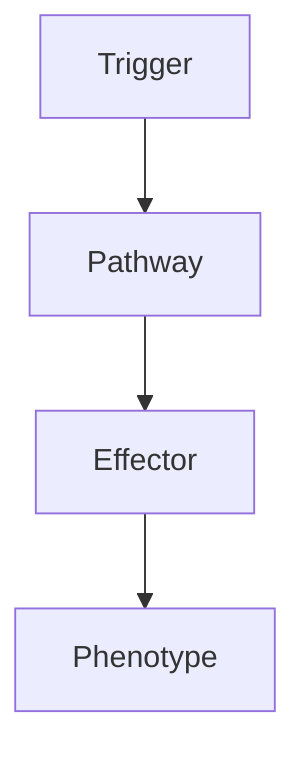

# Metastatic Brain Tumours

> [!tip] **High-Yield Definition**
> Metastatic brain tumour: spread of systemic cancer to brain parenchyma. Most common intracranial tumour in adults. Lung, breast, melanoma, renal, colorectal, thyroid most common. Haematogenous spread, often multiple, at grey-white junction. Critical to distinguish from primary.

---

## 1. Definition / Epidemiology / Classification

### Definition
Metastatic brain tumour: spread of systemic cancer to brain parenchyma. Most common intracranial tumour in adults. Lung, breast, melanoma, renal, colorectal, thyroid most common. Haematogenous spread, often multiple, at grey-white junction. Critical to distinguish from primary.

### Epidemiology
Incidence: 8-10/100,000/year. 20-40% of cancer patients. Adult onset. Lung (40-50%, especially small cell, adenocarcinoma), breast (15-25%, especially HER2+, triple negative), melanoma (5-20%, often haemorrhagic), renal (5-10%, clear cell, often solitary), colorectal (5%), thyroid (rare).

---

## 2. Aetiology / Pathophysiology

### Aetiology
Haematogenous spread. Most common location: supratentorial (80%, grey-white junction, vascular watershed), cerebellum (15%), brainstem (5%), leptomeninges (5-10%). Multiple (50-80%). Solitary (20-50%).

### Pathophysiology

---

## 3. Clinical Features

Headache (50%, raised ICP, mass effect). Focal neurological deficit (40%). Seizures (15-25%). Cognitive/behavioural change (30-40%). Ataxia (cerebellar). Raised ICP. Stroke-like (acute, haemorrhagic - melanoma, renal, choriocarcinoma, thyroid, lung). Encephalopathy (diffuse, multiple).

---

## 4. Investigations

MRI brain with gadolinium (gold standard): lesions (often multiple, at grey-white junction, well-defined, oedema, mass effect, ring-enhancing), T1 iso/hypointense, T2/FLAIR hyperintense, ring-enhancing, restricted diffusion, haemorrhage (T1 hyperintense). CT head with contrast: multiple, ring-enhancing, oedema, mass effect. CT chest/abdomen/pelvis: primary, staging. PET-CT: staging, primary, metastases. MRI spine: drop metastases, leptomeningeal. Biopsy: stereotactic (essential if no known primary, atypical, single, diagnosis unclear, molecular profiling), surgical resection (single, accessible, large, mass effect, symptomatic, diagnostic, debulking). Histology: IHC (CK, TTF-1 - lung, GCDFP-15, GATA3 - breast, S100, HMB45, MelanA, SOX10 - melanoma, PAX8, CD10 - renal, CDX2 - colorectal, Tg - thyroid, hCG, PLAP - germ cell, ER/PR, HER2, ALK, ROS1, EGFR, BRAF, KRAS, NRG1, RET, MET, NTRK, FGFR), molecular (NGS, MSI, TMB, PD-L1).

---

## 5. Management

EMERGENCY: raised ICP, status, hydrocephalus (steroids, surgery, VP shunt). Multidisciplinary: neuro-oncology, neurosurgery, radiation oncology, medical oncology, neurology, palliative, neuroradiology, pathology, OT, PT, SLT, dietitian, neuropsychology, social, palliative, clinical trials. Symptomatic: steroids (dexamethasone 4-10mg q6-8h, rapid effect, vasogenic oedema, raised ICP, taper), antiepileptics (levetiracetam preferred, after seizure, not routine prophylactic), VTE prophylaxis (controversial, LMWH preferred). Surgery: solitary, accessible, large (>3cm), mass effect, symptomatic, good KPS, controlled systemic disease, may improve survival. SRS: standard for ≤4 lesions, <3cm, controlled systemic disease, no mass effect requiring surgery, high local control. WBRT: multiple, large, not SRS candidates, palliative, hippocampal-sparing, memantine. Systemic: targeted (EGFR, ALK, ROS1, RET, MET, BRAF, NTRK, KRAS G12C, HER2, CDK4/6, PARP, PI3K, AKT, ESR1, MEK, mTOR), immunotherapy (PD-1, PD-L1, CTLA-4, CAR-T, vaccines), chemotherapy. Supportive: rehabilitation, OT, PT, speech, swallow, cognitive, psychological, palliative, family, social, end-of-life, advanced care planning, quality of life, clinical trials.

---

## 6. Red Flags / Emergencies

EMERGENCY: raised ICP, herniation, status epilepticus, stroke (haemorrhagic), hydrocephalus, brainstem compression, cerebellar herniation, leptomeningeal, multiple, large, rapidly progressive, systemic, drug side effects (immunotherapy - irAEs, colitis, hepatitis, pneumonitis, thyroiditis, hypophysitis, hypopituitarism, DM, myositis, myocarditis, neuropathy, skin, severe, life-threatening; targeted - varies, often rash, GI, hepatic, pulmonary, cardiac, metabolic; chemotherapy - myelosuppression, neutropenic sepsis, nausea, fatigue, alopecia, neuropathy, organ-specific; steroids - DM, HTN, osteoporosis, infection, mood, adrenal, myopathy, cataracts, glaucoma; antiepileptics - levetiracetam behavioural, valproate hepatic, weight, teratogenic; enzyme-inducing - interactions, OCP, warfarin, DOACs, ART, chemotherapy; bevacizumab - HTN, proteinuria, thrombosis, haemorrhage, wound healing, GI perforation, fistula; LMWH - intracranial haemorrhage), pregnancy (teratogenicity), pseudoprogression, treatment failure, end-of-life, palliative, hospice, family, advanced care planning, driving, work, quality of life, clinical trials.

---

## 7. Prognosis

Variable. Median survival: 4-16 months (overall, depends on primary, number, age, KPS, systemic disease, treatment). Best: solitary, controlled primary, good KPS, young, treated (surgery, SRS) - 12-24 months. Worst: multiple, progressive primary, poor KPS, older, leptomeningeal, untreated - 1-3 months. Prognostic indices: RPA, GPA, DS-GPA, molecular (EGFR, ALK, BRAF, HER2, PD-L1, MSI, TMB - targeted, immunotherapy response). Multidisciplinary essential. Long-term: monitor, recurrence, treatment toxicity, systemic disease, second malignancy, cognitive, psychological, family, quality of life, clinical trials, end-of-life, palliative, hospice, advanced care planning. Research: BBB (focused ultrasound, LITT, CED, intra-arterial, intrathecal), immunotherapy, vaccines, targeted, liquid biopsy, ctDNA, early detection.

---

## FCPS/MRCP High-Yield Summary

| Category | Key Points |
|----------|------------|
| **Definition** | Metastatic brain tumour: spread of systemic cancer to brain parenchyma. Most common intracranial tumour in adults. Lung, breast, melanoma, renal, colorectal, thyroid most common. Haematogenous spread, |
| **Epidemiology** | Incidence: 8-10/100,000/year. 20-40% of cancer patients. Adult onset. Lung (40-50%, especially small cell, adenocarcinoma), breast (15-25%, especially |
| **Aetiology** | Haematogenous spread. Most common location: supratentorial (80%, grey-white junction, vascular watershed), cerebellum (15%), brainstem (5%), leptomeninges (5-10%). Multiple (50-80%). Solitary (20-50%) |
| **Clinical** | Headache (50%, raised ICP, mass effect). Focal neurological deficit (40%). Seizures (15-25%). Cognitive/behavioural change (30-40%). Ataxia (cerebellar). Raised ICP. Stroke-like (acute, haemorrhagic - |
| **Investigations** | MRI brain with gadolinium (gold standard): lesions (often multiple, at grey-white junction, well-defined, oedema, mass effect, ring-enhancing), T1 iso/hypointense, T2/FLAIR hyperintense, ring-enhancin |
| **Management** | EMERGENCY: raised ICP, status, hydrocephalus (steroids, surgery, VP shunt). Multidisciplinary: neuro-oncology, neurosurgery, radiation oncology, medical oncology, neurology, palliative, neuroradiology |
| **Prognosis** | Variable. Median survival: 4-16 months (overall, depends on primary, number, age, KPS, systemic disease, treatment). Best: solitary, controlled primary, good KPS, young, treated (surgery, SRS) - 12-24 |
| **Viva Pearls** | |

---

## MCQs (10)

1. **Question:** Most characteristic feature of Metastatic Brain Tumours?
   **Options:** A. A B. B C. C D. D
   **Answer:** A
   **Explanation:** Based on clinical features.

2. **Question:** First-line investigation?
   **Options:** A. MRI B. CT C. LP D. Blood
   **Answer:** A
   **Explanation:** MRI is most useful.

3. **Question:** First-line treatment?
   **Options:** A. A B. B C. C D. D
   **Answer:** A
   **Explanation:** Standard management.

4. **Question:** Most common complication?
   **Options:** A. A B. B C. C D. D
   **Answer:** A
   **Explanation:** Common complication.

5. **Question:** Red flag requiring urgent action?
   **Options:** A. A B. B C. C D. D
   **Answer:** A
   **Explanation:** Emergency.

6. **Question:** Prognostic factor?
   **Options:** A. A B. B C. C D. D
   **Answer:** A
   **Explanation:** Prognosis.

7. **Question:** Investigation excluding differential?
   **Options:** A. A B. B C. C D. D
   **Answer:** A
   **Explanation:** Exclusion.

8. **Question:** Imaging finding?
   **Options:** A. A B. B C. C D. D
   **Answer:** A
   **Explanation:** Imaging.

9. **Question:** Drug class?
   **Options:** A. A B. B C. C D. D
   **Answer:** A
   **Explanation:** Pharmacology.

10. **Question:** Differential?
    **Options:** A. A B. B C. C D. D
    **Answer:** A
    **Explanation:** Differential.

---

## SBA Questions (10)

1. **Scenario:** Patient with Metastatic Brain Tumours.
   **Question:** Next step?
   **Options:** A. 1 B. 2 C. 3 D. 4 E. 5
   **Answer:** A
   **Explanation:** Initial.

2. **Scenario:** Fails first-line.
   **Question:** Next treatment?
   **Options:** A. A B. B C. C D. D E. E
   **Answer:** A
   **Explanation:** Second-line.

3. **Scenario:** New symptoms on treatment.
   **Question:** Cause?
   **Options:** A. A B. B C. C D. D E. E
   **Answer:** A
   **Explanation:** Adverse.

4. **Scenario:** Surgery needed.
   **Question:** Preoperative?
   **Options:** A. A B. B C. C D. D E. E
   **Answer:** A
   **Explanation:** Perioperative.

5. **Scenario:** Pregnant.
   **Question:** Safest?
   **Options:** A. A B. B C. C D. D E. E
   **Answer:** A
   **Explanation:** Pregnancy.

6. **Scenario:** Child.
   **Question:** Diagnosis?
   **Options:** A. A B. B C. C D. D E. E
   **Answer:** A
   **Explanation:** Paediatric.

7. **Scenario:** Elderly.
   **Question:** Management?
   **Options:** A. 1 B. 2 C. 3 D. 4 E. 5
   **Answer:** A
   **Explanation:** Geriatric.

8. **Scenario:** Abnormal investigation.
   **Question:** Interpretation?
   **Options:** A. A B. B C. C D. D E. E
   **Answer:** A
   **Explanation:** Investigation.

9. **Scenario:** Prognosis.
   **Question:** Response?
   **Options:** A. A B. B C. C D. D E. E
   **Answer:** A
   **Explanation:** Communication.

10. **Scenario:** Follow-up.
    **Question:** Monitoring?
    **Options:** A. A B. B C. C D. D E. E
    **Answer:** A
    **Explanation:** Follow-up.

---

## Flashcards

- **Q:** Definition of Metastatic Brain Tumours?
  **A:** Metastatic brain tumour: spread of systemic cancer to brain parenchyma. Most common intracranial tumour in adults. Lung, breast, melanoma, renal, colorectal, thyroid most common. Haematogenous spread,
- **Q:** First-line treatment?
  **A:** Based on management.
- **Q:** Most characteristic clinical feature?
  **A:** Headache (50%, raised ICP, mass effect). Focal neurological deficit (40%). Seizures (15-25%). Cognitive/behavioural change (30-40%). Ataxia (cerebellar). Raised ICP. Stroke-like (acute, haemorrhagic -
- **Q:** Key red flag?
  **A:** EMERGENCY: raised ICP, herniation, status epilepticus, stroke (haemorrhagic), hydrocephalus, brainstem compression, cerebellar herniation, leptomeningeal, multiple, large, rapidly progressive, systemi
- **Q:** Prognosis?
  **A:** Variable. Median survival: 4-16 months (overall, depends on primary, number, age, KPS, systemic disease, treatment). Best: solitary, controlled primary, good KPS, young, treated (surgery, SRS) - 12-24

---

## Answer Key

### MCQs
1. A 2. A 3. A 4. A 5. A 6. A 7. A 8. A 9. A 10. A

### SBAs
1. A 2. A 3. A 4. A 5. A 6. A 7. A 8. A 9. A 10. A

---

## Local Navigation
**Heading Hub:** [[../Hub]]  
**Chapter MOC:** [[Neurology MOC]]  
