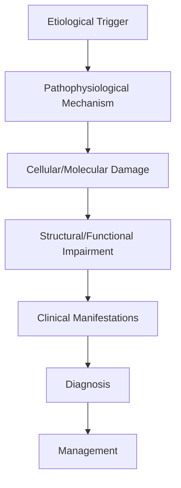
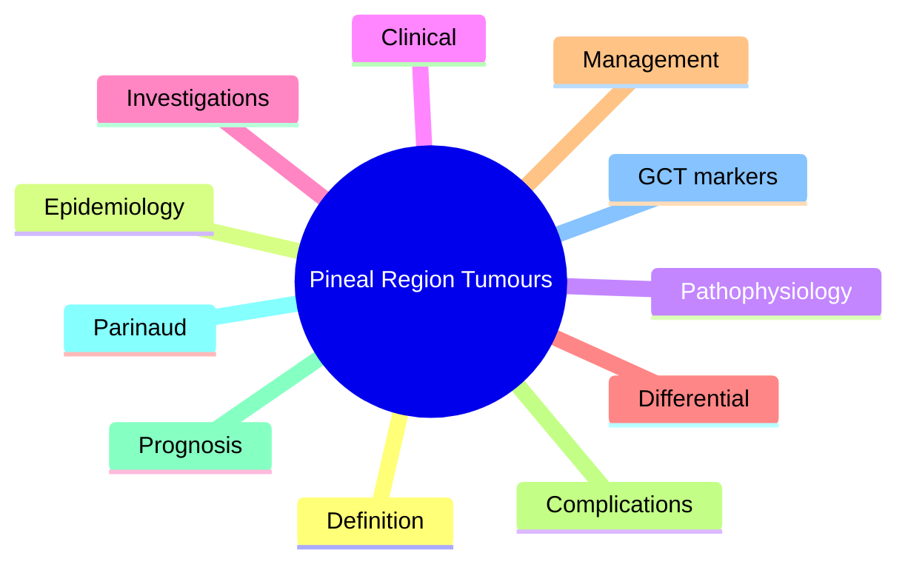

# Pineal Region Tumours

> [!tip] **High-Yield Definition**
> Comprehensive clinical note for Pineal Region Tumours covering definition, epidemiology, aetiology, pathophysiology, clinical features, investigations, differential diagnosis, management, drug interactions, procedures, complications, red flags, prognosis, topic correlation, and special situations for FCPS/MRCP examination preparation based on Davidson 24th Edition Chapter 25: Neurology.

---

## 1. Definition / Epidemiology / Classification

### Definition
Pineal Region Tumours is a neurological disorder within the 13 brain tumours category. It is characterised by specific clinical, pathological, radiological, and laboratory features that allow differentiation from related conditions.

### Epidemiology
- **Incidence/Prevalence:** Variable depending on the specific condition.
- **Age:** Adult onset is most common, but paediatric and elderly presentations occur.
- **Sex:** Variable depending on the condition.
- **Geography:** Worldwide distribution, with higher prevalence in certain regions.
- **Risk Factors:** Genetic predisposition, environmental factors, comorbidities, family history.

### Classification
| Subtype | Key Features | Prognosis |
|---------|-------------|-----------|
| Mild/early | Subtle symptoms, preserved function | Best |
| Moderate | Clear symptoms, functional impairment | Variable |
| Severe | Significant disability, complications | Worst |

---

## 2. Aetiology / Pathophysiology

### Aetiology
- **Primary (idiopathic):** Most cases have no identifiable cause.
- **Genetic:** May be inherited (AD, AR, X-linked, mitochondrial, sporadic).
- **Autoimmune:** Autoantibodies, immune-mediated inflammation.
- **Infectious:** Viral, bacterial, fungal, parasitic.
- **Metabolic:** Electrolyte, endocrine, hepatic, renal, nutritional.
- **Toxic:** Drugs, alcohol, heavy metals, environmental toxins.
- **Vascular:** Ischaemia, haemorrhage, vasculitis.
- **Neoplastic:** Primary, secondary, paraneoplastic.
- **Traumatic:** Acute, chronic, repetitive.
- **Degenerative:** Neurodegeneration, protein misfolding.

### Pathophysiology


---

## 3. Clinical Features

### History
- **Onset/Duration:** Acute, subacute, or chronic.
- **Progression:** Static, progressive, relapsing-remitting, stepwise.
- **Key symptoms:** Specific to the condition.
- **Triggers:** Stress, infection, trauma, drugs, hormonal, environmental.
- **Systemic symptoms:** Constitutional features.
- **Drug/Family/Social history:** Relevant exposures, comorbidities.

### Examination
| Domain | Key Findings | Localisation Value |
|--------|-------------|-------------------|
| Higher function | Cognitive, behavioural | Cortical, subcortical, limbic |
| Cranial nerves | Pupils, eye movements, facial, bulbar | Brainstem, cranial nerve, NMJ |
| Motor | Weakness, tone, reflexes | UMN, LMN, NMJ, muscle |
| Sensory | All modalities, pattern | Peripheral, spinal, brainstem |
| Coordination | Ataxia, nystagmus, dysmetria | Cerebellar, sensory, vestibular |
| Gait | Spastic, ataxic, parkinsonian | Multiple |
| Autonomic | Orthostatic, sweating, GI, bladder | Autonomic, peripheral, central |

### Specific Clinical Features
The clinical features are determined by the underlying aetiology, location of pathology, and rate of progression. Patients typically present with a constellation of symptoms and signs that allow clinical localisation and subsequent targeted investigation.

---

## 4. Diagnostic Approach / Algorithm

```mermaid
flowchart TD
    A[Clinical Presentation] --> B[Anatomical Localisation]
    B --> C[Pathophysiological Category]
    C --> D[Formulate Differential]
    D --> E[Targeted Investigations]
    E --> F[Confirm Diagnosis]
    F --> G[Assess Severity/Prognosis]
    G --> H[Initiate Management]
    H --> I[Monitor Response]
    I --> J{Response?}
    J --> YES1 [Good - Continue]
    J --> NO1 [Poor - Escalate]
    YES1 --> K[Monitor]
    NO1 --> H
```

---

## 5. Investigations

### First-Line Investigations
- **Blood tests:** FBC, U&Es, LFTs, glucose, calcium, magnesium, ESR, CRP, autoimmune, infection.
- **Imaging:** CT/MRI brain/spine (essential for most neurological conditions).
- **Neurophysiology:** EEG, nerve conduction, EMG, evoked potentials.
- **CSF:** Cell count, protein, glucose, OCBs, PCR, culture.

### Second-Line Investigations
- **Genetic testing:** Gene panels, WES, WGS.
- **Antibody testing:** Antineuronal, autoimmune, paraneoplastic.
- **Biopsy:** Nerve, muscle, brain, skin.
- **Advanced imaging:** PET-CT, MR spectroscopy, fMRI.

### Specialised Investigations
- **Biomarkers:** Neurofilament light chain, tau, beta-amyloid, 14-3-3, RT-QuIC.
- **Autonomic testing:** Head-up tilt, sudomotor, QSART.
- **Neuropsychology:** Cognitive testing, behavioural assessment.
- **Genetic counselling:** Family screening, predictive testing.

---

## 6. Differential Diagnosis

| Differential | Distinguishing Features | Key Test |
|--------------|------------------------|----------|
| Vascular | Sudden onset, focal, vascular risk factors | MRI/CT, vessel imaging |
| Inflammatory | Subacute, multifocal, systemic | MRI, CSF, antibodies |
| Infectious | Fever, systemic, exposure | Bloods, CSF, imaging |
| Neoplastic | Progressive, mass effect | MRI, biopsy |
| Degenerative | Progressive, symmetric, hereditary | MRI, genetic |
| Toxic/Metabolic | Drug history, systemic, reversible | Bloods, toxicology |
| Autoimmune | Multifocal, antibodies, immunotherapy response | Antibodies, MRI, CSF |
| Functional | Inconsistent, distractible | Clinical, video, biomarkers |

---

## 7. Management

### Acute Management
- **Stabilisation:** ABCDE approach, emergency resuscitation.
- **Specific treatment:** Disease-specific interventions.
- **Symptomatic relief:** Pain, seizures, spasticity, autonomic dysfunction.
- **Prevention of complications:** DVT, pressure sores, infection.

### Disease-Modifying Treatment
- **Pharmacological:** First-line, second-line, escalation, maintenance.
- **Procedural:** Surgery, biopsy, drainage, ablation, stimulation.
- **Immunotherapy:** Steroids, IVIG, plasma exchange, immunosuppressants, biologics.
- **Rehabilitation:** Physiotherapy, OT, speech therapy.

### Long-Term Management
- **Monitoring:** Clinical, imaging, biomarkers, side effects.
- **Prevention:** Vaccinations, prophylaxis, lifestyle modification.
- **Supportive care:** Multidisciplinary team, social work, psychological support.
- **Palliative care:** Advanced care planning, end-of-life care, hospice.

---

## 8. Drug Interactions / Contraindications / Comorbidity Cautions

| Drug Class | Interaction / Caution | Management |
|------------|----------------------|------------|
| Antiseizure medications | Enzyme induction, teratogenicity | Monitor, supplement, switch |
| Immunosuppressants | Infection, malignancy, teratogenicity | Monitor, prophylaxis |
| Anticoagulants | Bleeding risk, drug interactions | Monitor INR, avoid combinations |
| Antihypertensives | Hypotension, falls | Monitor BP, adjust dose |
| Antibiotics | Nephrotoxicity, ototoxicity | Monitor renal |
| Antivirals | Nephrotoxicity, neuropsychiatric | Monitor renal, dose adjust |
| Steroids | DM, HTN, osteoporosis, infection | Monitor, prophylaxis, taper |
| Biologics | Infusion reactions, infection | Monitor, prophylaxis |

---

## 9. Procedures

### Common Procedures
- **Lumbar puncture:** Diagnostic, therapeutic (IIH, NPH). Contraindications: raised ICP, mass lesion, coagulopathy.
- **Nerve conduction studies/EMG:** Diagnostic, prognosis. Minor discomfort.
- **EEG:** Diagnostic, monitoring. No significant complications.
- **MRI brain/spine:** Diagnostic, monitoring. Contraindications: pacemaker, metallic implants.
- **CT head:** Emergency, rapid. Radiation exposure, contrast reactions.
- **Biopsy:** Stereotactic, open. Indications: diagnosis, molecular profiling.

---

## 10. Complications

| Complication | Frequency | Prevention | Management |
|--------------|-----------|------------|------------|
| Infection | Common | Hygiene, prophylaxis, vaccination | Antibiotics, antifungals |
| Thrombosis | Common | Prophylaxis, mobility | Anticoagulation |
| Pressure sores | Common | Positioning, nutrition | Wound care, surgery |
| Spasticity | Common | Positioning, stretching | Baclofen, BoNT |
| Contractures | Common | Passive movements, splints | Physiotherapy, surgery |
| Aspiration | Common | Swallow assessment | NGT, PEG, thickeners |
| Falls | Common | Environment, mobility | Walking aids |
| Fractures | Common | Bone health, prevention | Vitamin D, bisphosphonate |
| Depression | Common | Screening, support | Antidepressants, CBT |
| Cognitive decline | Variable | Monitoring, training | Rehabilitation |
| Autonomic dysfunction | Variable | Monitoring, hydration | Midodrine, fludrocortisone |
| Respiratory failure | Variable | Monitoring, supportive | Ventilation, NIV |
| Death | Variable | Monitoring, palliative | End-of-life care |

---

## 11. Red Flags / Emergencies

### Emergency Presentations
- **Rapid neurological deterioration:** New focal deficit, decreased consciousness, seizures.
- **Status epilepticus:** Continuous seizures >5 min.
- **Raised ICP:** Headache, vomiting, papilloedema, altered consciousness.
- **Respiratory failure:** Hypoxia, hypercapnia, ventilatory failure.
- **Cardiac arrest:** Arrhythmia, MI, pulmonary embolism.
- **Infection:** Sepsis, meningitis, abscess, encephalitis.
- **Drug toxicity:** Overdose, side effects, interactions.
- **Haemorrhage:** Intracranial, systemic, coagulopathy.

---

## 12. Prognosis

### Natural History
- **Acute:** May resolve with treatment, may progress, may be fatal.
- **Subacute:** Variable, depends on cause and treatment.
- **Chronic:** Often progressive, may be stable, may have relapses.
- **Recovery:** Variable, may be complete, partial, or none.

### Prognostic Factors
- **Favourable:** Young age, early treatment, mild disease, reversible cause, good premorbid function, family support.
- **Unfavourable:** Older age, delayed treatment, severe disease, irreversible cause, poor premorbid function, comorbidities.

---

## 13. Topic Correlation

| Related Topic | Link | Key Overlap |
|---------------|------|-------------|
| Davidson 24th Ed Chapter 25 | [[Davidson Chapter 25 - Neurology Hierarchy]] | Comprehensive neurology |
| Neurology MOC | [[Neurology MOC]] | All neurology topics |
| Drug Reference | [[../00_Index/Neurology Drug Reference]] | Medications |
| Local Hub | [[../13_Brain_Tumours/Hub]] | Section-specific |
| Clinical Examination | [[../01_Fundamentals_Examination/Neurological History Taking]] | Clinical approach |
| Investigation | [[../01_Fundamentals_Examination/Neuroimaging (CT-MRI) Principles]] | Imaging |

---

## 14. Special Situations

| Situation | Consideration |
|-----------|---------------|
| **Pregnancy** | Pre-conception counselling, teratogenicity, drug safety, monitoring, delivery planning, breastfeeding. |
| **Lactation** | Drug safety, breastfeeding, monitoring, support. |
| **Paediatric** | Developmental considerations, drug dosing, school, family, vaccination, growth, puberty. |
| **Elderly / Frail** | Comorbidities, polypharmacy, falls, bone health, cognition, social, end-of-life. |
| **Renal impairment** | Drug dose adjustment, monitoring, dialysis, transplant. |
| **Hepatic impairment** | Drug dose adjustment, monitoring, transplant. |
| **Immunocompromised** | Infection prophylaxis, vaccination, drug interactions, malignancy screening. |
| **Perioperative** | Drug management, anaesthesia planning, VTE prophylaxis, infection prevention, monitoring. |
| **Driving / DVLA** | Fitness to drive, restrictions, notification, reassessment. |
| **Occupational** | Fitness for work, adaptations, rehabilitation, disability, return to work. |

---

## FCPS/MRCP High-Yield Summary

| Category | Key Points |
|----------|------------|
| **Definition** | Comprehensive definition with key diagnostic criteria |
| **Epidemiology** | Incidence, prevalence, age, sex, geography, risk factors |
| **Aetiology** | Primary causes, secondary causes, genetic, environmental |
| **Pathophysiology** | Mechanism of disease, cellular/molecular basis |
| **Clinical Features** | History, examination, key findings, variants |
| **Diagnosis** | Diagnostic criteria, classification, severity |
| **Investigations** | First-line, second-line, specialised, biomarkers |
| **Differential Diagnosis** | Key differentials, distinguishing features, tests |
| **Management** | Acute, disease-modifying, symptomatic, supportive |
| **Complications** | Common, serious, prevention, management |
| **Prognosis** | Natural history, prognostic factors, outcomes |
| **Viva Pearls** | Key examination points |
| **Drug Doses** | First-line, second-line, emergency |
| **Scoring Systems** | Specific scores used in management |
| **Genetics** | Inheritance, genes, mutations, family screening |
| **Imaging Signs** | Characteristic findings, differential |

---

## Viva Questions (PACES/FCPS Style)

1. **Q:** Define and classify its variants.
   **A:** Comprehensive definition with classification of subtypes based on aetiology, severity, and clinical features.

2. **Q:** What are the key clinical features?
   **A:** Specific symptoms and signs including onset, progression, key features, and associated findings.

3. **Q:** What is the first-line treatment?
   **A:** First-line pharmacological and non-pharmacological management based on current evidence.

4. **Q:** What are the red flags requiring urgent referral?
   **A:** Specific emergency presentations and complications requiring immediate intervention.

5. **Q:** What is the prognosis?
   **A:** Natural history, prognostic factors, and long-term outcomes.

6. **Q:** How do you differentiate from key differentials?
   **A:** Clinical features, investigations, and response to treatment that distinguish from alternative diagnoses.

7. **Q:** What investigations are most useful?
   **A:** First-line and second-line investigations including imaging, neurophysiology, CSF, and biomarkers.

8. **Q:** Describe the stepwise management approach.
   **A:** Stepwise escalation from first-line to second-line to third-line therapy with monitoring.

9. **Q:** What are the emergency presentations?
   **A:** Specific emergency scenarios and immediate management priorities.

10. **Q:** How does management change in pregnancy/paediatrics/elderly?
    **A:** Special considerations for each population including drug safety, monitoring, and support.

---

## Common Confusions / Exam Traps

| Confusion | Clarification |
|-----------|---------------|
| Similar presentation but different cause | Differentiate by history, examination, investigations |
| Treatment response vs natural history | Assess with objective measures, biomarkers |
| Drug interactions | Check each drug, monitor, adjust doses |
| Disease progression vs treatment failure | Monitor response, escalate appropriately |
| Functional vs organic | Inconsistent, distractible, disability greater than impairment |
| Acute vs chronic | Time course, progression, reversibility |
| Primary vs secondary | Underlying cause, contributing factors |
| Side effects vs symptoms | Temporal relationship, dose relationship |

---

## Mnemonics
1. **PINeAL** = Parinaud + Increased ICP + Nystagmus (use: Parinaud syndrome triad)
2. **Germ Cell Types** = Germinoma + Teratoma + Embryonal + Yolk sac + Choriocarcinoma (use: GCT histological subtypes)
3. **Tumour Markers** = AFP (yolk sac) + βhCG (choriocarcinoma/germinoma) + PLAP (germinoma) (use: marker patterns)

---

## Mind Map



---

## Spaced Repetition Trackers

| Review Interval | Date | Score (0-5) | Notes |
|-----------------|------|-------------|-------|
| Day 1 | | | |
| Day 3 | | | |
| Day 7 | | | |
| Day 14 | | | |
| Day 30 | | | |
| Day 90 | | | |

---

## Self-Test Scorecard

| Section | Score /5 | Last Attempt |
|---------|----------|--------------|
| Definition & Epidemiology | | | |
| Pathophysiology | | | |
| Clinical Features | | | |
| Investigations | | | |
| Differential | | | |
| Management | | | |
| Complications | | | |
| Viva Questions | | | |
| MCQs | | | |
| SBAs | | | |

---

## MCQs (10)

1. **Most common pineal region tumour?**
   **Options:** A. Pineoblastoma B. Germinoma C. Pineocytoma D. Teratoma
   **Answer:** B
   **Explanation:** Germinoma accounts for ~50% of pineal region tumours; pineoblastoma is rare and aggressive.

2. **Parinaud syndrome (dorsal midbrain syndrome) includes all EXCEPT:**
   **Options:** A. Upgaze palsy B. Light-near dissociation C. Convergence-retraction nystagmus D. Bilateral INO with preserved upgaze
   **Answer:** D
   **Explanation:** Parinaud = upgaze palsy + light-near dissociation + convergence-retraction nystagmus + lid retraction (Collier).

3. **Marker for pineal germinoma?**
   **Options:** A. AFP B. PLAP ± mild βhCG C. CEA D. CA 19-9
   **Answer:** B
   **Explanation:** Germinomas: PLAP, mild βhCG. Yolk sac → AFP. Choriocarcinoma → high βhCG.

4. **Marker for pineal region yolk sac tumour?**
   **Options:** A. AFP B. βhCG C. LDH D. CA125
   **Answer:** A
   **Explanation:** Yolk sac tumour (endodermal sinus) → raised AFP in serum and CSF.

5. **Best imaging for pineal region tumour?**
   **Options:** A. CT only B. MRI brain with contrast + spine C. Skull X-ray D. PET only
   **Answer:** B
   **Explanation:** MRI brain + whole spine (drop mets), germ cell markers in serum/CSF, ± biopsy.

6. **Most aggressive pineal parenchymal tumour?**
   **Options:** A. Pineocytoma B. Pineoblastoma C. Pineal cyst D. Epidermoid
   **Answer:** B
   **Explanation:** Pineoblastoma = WHO grade 4, primitive neuroectodermal, mets via CSF, poor prognosis (1-2y).

7. **First-line treatment for pineal germinoma?**
   **Options:** A. Surgery only B. Radiotherapy (highly radiosensitive) ± chemo C. Observation D. Antibiotics
   **Answer:** B
   **Explanation:** Germinomas are highly radiosensitive; 5y survival >90%.

8. **Pineal region compression causing obstructive hydrocephalus presents with:**
   **Options:** A. Dementia B. Headache, vomiting, papilloedema, Parinaud C. Hemiparesis D. Aphasia
   **Answer:** B
   **Explanation:** Aqueduct of Sylvius compression → obstructive hydrocephalus → raised ICP + dorsal midbrain compression.

9. **Intradural-extramedullary location of pineal region tumour makes it amenable to:**
   **Options:** A. Endoscopic third ventriculostomy (ETV) + biopsy B. Only open craniotomy C. No intervention D. Stereotactic radiosurgery only
   **Answer:** A
   **Explanation:** ETV relieves hydrocephalus + biopsy; definitive surgery via supracerebellar-infratentorial or transcallosal.

10. **Differential of pineal region mass includes:**
   **Options:** A. Only germinoma B. Germinoma, pineoblastoma, pineocytoma, teratoma, meningioma, pineal cyst, vein of Galen malformation C. Pineoblastoma only D. Pineocytoma only
   **Answer:** B
   **Explanation:** Wide differential: germ cell tumours, pineal parenchymal, meningioma, cysts, vascular malformations.

---

## SBA Questions (10)

1. **Scenario:** 15-year-old boy with headache, vomiting, upgaze palsy, bilateral papilloedema. MRI shows pineal mass with hydrocephalus.
   **Question:** Next best step?
   **Options:** A. Urgent CSF diversion (ETV) + tumour markers in serum/CSF B. Radical resection C. Observation D. Biopsy only
   **Answer:** A
   **Explanation:** Emergency hydrocephalus management (ETV or VP shunt) + germ cell markers before biopsy.

2. **Scenario:** Pineal mass, serum AFP 800, βhCG normal, PLAP mildly raised. Diagnosis?
   **Question:** Most likely diagnosis?
   **Options:** A. Germinoma B. Yolk sac tumour C. Pineoblastoma D. Pineocytoma
   **Answer:** B
   **Explanation:** AFP markedly raised + normal βhCG = yolk sac tumour (non-seminomatous GCT).

3. **Scenario:** Pineal mass, mild βhCG rise, normal AFP, PLAP raised. Treatment?
   **Question:** Best treatment?
   **Options:** A. Radical surgery B. Radiotherapy ± chemotherapy C. Observation D. Antibiotics
   **Answer:** B
   **Explanation:** Germinoma: highly radiosensitive, 5y OS >90% with RT; ± chemo.

4. **Scenario:** Pineoblastoma in 4-year-old. Best management?
   **Question:** Best management approach?
   **Options:** A. Surgery only B. Multi-modal: surgery + craniospinal RT + chemo C. Observation D. Radiosurgery
   **Answer:** B
   **Explanation:** Pineoblastoma = PNET-like, treated with multi-modal therapy.

5. **Scenario:** Germinoma patient, stable, presents 2y later with spinal drop mets. Action?
   **Question:** Best next step?
   **Options:** A. Palliative only B. Re-biopsy, craniospinal RT if not given, ± chemo C. Observation D. Steroids only
   **Answer:** B
   **Explanation:** Treat recurrence: craniospinal RT if not used; high-dose chemo + autologous stem cell rescue.

6. **Scenario:** Biopsy of pineal region lesion: large polygonal cells with lymphocytic infiltrate. Diagnosis?
   **Question:** Diagnosis?
   **Options:** A. Pineoblastoma B. Germinoma (two-cell pattern) C. Meningioma D. Pineocytoma
   **Answer:** B
   **Explanation:** Germinoma histology: large clear cells + lymphocytic infiltrate (T-cell predominant).

7. **Scenario:** Pre-op evaluation of pineal region mass must include:
   **Question:** Most appropriate workup?
   **Options:** A. Only MRI B. MRI brain + spine, serum/CSF markers, pituitary hormones, ophthalmology (Parinaud) C. CT chest only D. Skull X-ray
   **Answer:** B
   **Explanation:** Comprehensive: MRI brain + spine, markers in serum AND CSF, pituitary function, eye exam.

8. **Scenario:** Pineal teratoma in adult. Typical findings?
   **Question:** Characteristic imaging?
   **Options:** A. Homogeneous enhancement B. Heterogeneous mass with fat, calcification, cysts C. Pure cystic D. Pure solid
   **Answer:** B
   **Explanation:** Teratoma: heterogeneous with fat (T1 hyperintense), calcification, cystic components.

9. **Scenario:** Vein of Galen malformation differential from pineal tumour on imaging?
   **Question:** Best distinguishing feature?
   **Options:** A. Vascular flow voids, enhancement of feeding arteries/draining veins B. No flow voids C. Calcification only D. CSF only
   **Answer:** A
   **Explanation:** VOGM: enlarged vein of Galen with arterial feeders; flow voids on MRI, AV shunting on angio.

10. **Scenario:** 15-year-old with pineal germinoma, 4cm, obstructive hydrocephalus. Sequence?
   **Question:** Sequence of management?
   **Options:** A. Surgery → chemo → RT B. ETV (CSF diversion) → markers → RT ± chemo C. Biopsy → RT D. Only RT
   **Answer:** B
   **Explanation:** Hydrocephalus is emergency (ETV). Markers diagnostic in many germinomas.

---

## Tags
**Tags:** #neurology #brain-tumour #pineal #germinoma #pineoblastoma #pineocytoma #Parinaud #AFP #βhCG #ETV #FCPS #MRCP

---

## Local Navigation
**Heading Hub:** [[../Hub]]  
**Chapter Hierarchy:** [[Davidson Chapter 25 - Neurology Hierarchy]]  
**Chapter MOC:** [[Neurology MOC]]  
**Drug Reference:** [[../00_Index/Neurology Drug Reference]]  
