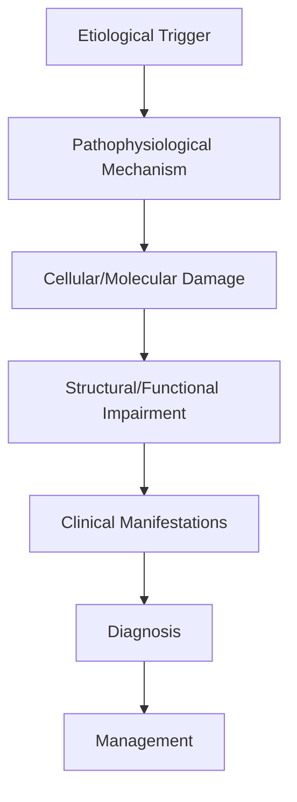
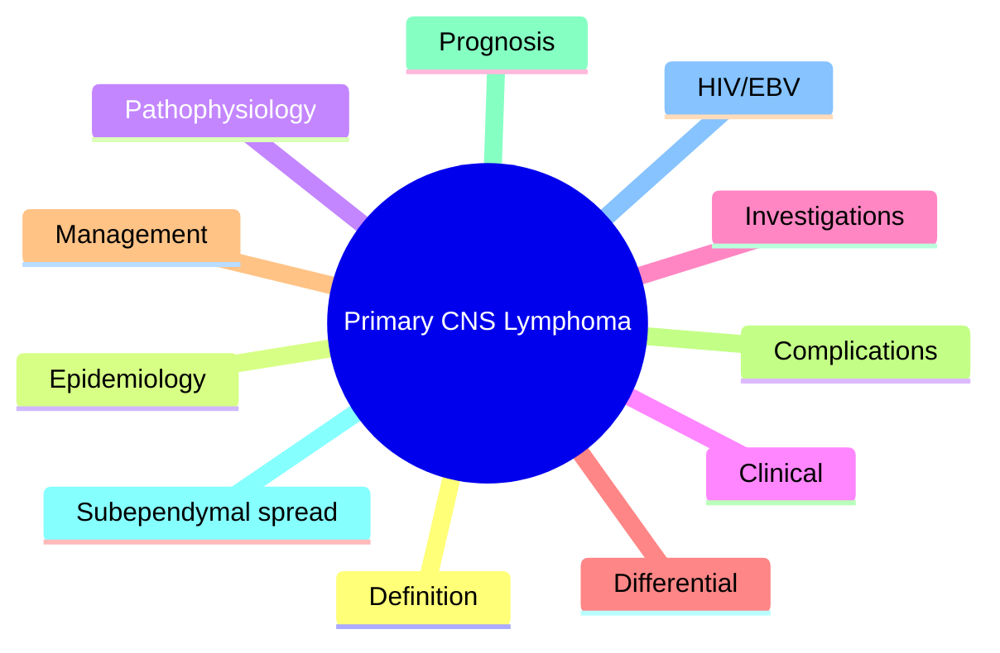

# Primary CNS Lymphoma

> [!tip] **High-Yield Definition**
> Comprehensive clinical note for Primary CNS Lymphoma covering definition, epidemiology, aetiology, pathophysiology, clinical features, investigations, differential diagnosis, management, drug interactions, procedures, complications, red flags, prognosis, topic correlation, and special situations for FCPS/MRCP examination preparation based on Davidson 24th Edition Chapter 25: Neurology.

---

## 1. Definition / Epidemiology / Classification

### Definition
Primary CNS Lymphoma is a neurological disorder within the 13 brain tumours category. It is characterised by specific clinical, pathological, radiological, and laboratory features that allow differentiation from related conditions.

### Epidemiology
- **Incidence/Prevalence:** Variable depending on the specific condition.
- **Age:** Adult onset is most common, but paediatric and elderly presentations occur.
- **Sex:** Variable depending on the condition.
- **Geography:** Worldwide distribution, with higher prevalence in certain regions.
- **Risk Factors:** Genetic predisposition, environmental factors, comorbidities, family history.

### Classification
| Subtype | Key Features | Prognosis |
|---------|-------------|-----------|
| Mild/early | Subtle symptoms, preserved function | Best |
| Moderate | Clear symptoms, functional impairment | Variable |
| Severe | Significant disability, complications | Worst |

---

## 2. Aetiology / Pathophysiology

### Aetiology
- **Primary (idiopathic):** Most cases have no identifiable cause.
- **Genetic:** May be inherited (AD, AR, X-linked, mitochondrial, sporadic).
- **Autoimmune:** Autoantibodies, immune-mediated inflammation.
- **Infectious:** Viral, bacterial, fungal, parasitic.
- **Metabolic:** Electrolyte, endocrine, hepatic, renal, nutritional.
- **Toxic:** Drugs, alcohol, heavy metals, environmental toxins.
- **Vascular:** Ischaemia, haemorrhage, vasculitis.
- **Neoplastic:** Primary, secondary, paraneoplastic.
- **Traumatic:** Acute, chronic, repetitive.
- **Degenerative:** Neurodegeneration, protein misfolding.

### Pathophysiology


---

## 3. Clinical Features

### History
- **Onset/Duration:** Acute, subacute, or chronic.
- **Progression:** Static, progressive, relapsing-remitting, stepwise.
- **Key symptoms:** Specific to the condition.
- **Triggers:** Stress, infection, trauma, drugs, hormonal, environmental.
- **Systemic symptoms:** Constitutional features.
- **Drug/Family/Social history:** Relevant exposures, comorbidities.

### Examination
| Domain | Key Findings | Localisation Value |
|--------|-------------|-------------------|
| Higher function | Cognitive, behavioural | Cortical, subcortical, limbic |
| Cranial nerves | Pupils, eye movements, facial, bulbar | Brainstem, cranial nerve, NMJ |
| Motor | Weakness, tone, reflexes | UMN, LMN, NMJ, muscle |
| Sensory | All modalities, pattern | Peripheral, spinal, brainstem |
| Coordination | Ataxia, nystagmus, dysmetria | Cerebellar, sensory, vestibular |
| Gait | Spastic, ataxic, parkinsonian | Multiple |
| Autonomic | Orthostatic, sweating, GI, bladder | Autonomic, peripheral, central |

### Specific Clinical Features
The clinical features are determined by the underlying aetiology, location of pathology, and rate of progression. Patients typically present with a constellation of symptoms and signs that allow clinical localisation and subsequent targeted investigation.

---

## 4. Diagnostic Approach / Algorithm

```mermaid
flowchart TD
    A[Clinical Presentation] --> B[Anatomical Localisation]
    B --> C[Pathophysiological Category]
    C --> D[Formulate Differential]
    D --> E[Targeted Investigations]
    E --> F[Confirm Diagnosis]
    F --> G[Assess Severity/Prognosis]
    G --> H[Initiate Management]
    H --> I[Monitor Response]
    I --> J{Response?}
    J --> YES1 [Good - Continue]
    J --> NO1 [Poor - Escalate]
    YES1 --> K[Monitor]
    NO1 --> H
```

---

## 5. Investigations

### First-Line Investigations
- **Blood tests:** FBC, U&Es, LFTs, glucose, calcium, magnesium, ESR, CRP, autoimmune, infection.
- **Imaging:** CT/MRI brain/spine (essential for most neurological conditions).
- **Neurophysiology:** EEG, nerve conduction, EMG, evoked potentials.
- **CSF:** Cell count, protein, glucose, OCBs, PCR, culture.

### Second-Line Investigations
- **Genetic testing:** Gene panels, WES, WGS.
- **Antibody testing:** Antineuronal, autoimmune, paraneoplastic.
- **Biopsy:** Nerve, muscle, brain, skin.
- **Advanced imaging:** PET-CT, MR spectroscopy, fMRI.

### Specialised Investigations
- **Biomarkers:** Neurofilament light chain, tau, beta-amyloid, 14-3-3, RT-QuIC.
- **Autonomic testing:** Head-up tilt, sudomotor, QSART.
- **Neuropsychology:** Cognitive testing, behavioural assessment.
- **Genetic counselling:** Family screening, predictive testing.

---

## 6. Differential Diagnosis

| Differential | Distinguishing Features | Key Test |
|--------------|------------------------|----------|
| Vascular | Sudden onset, focal, vascular risk factors | MRI/CT, vessel imaging |
| Inflammatory | Subacute, multifocal, systemic | MRI, CSF, antibodies |
| Infectious | Fever, systemic, exposure | Bloods, CSF, imaging |
| Neoplastic | Progressive, mass effect | MRI, biopsy |
| Degenerative | Progressive, symmetric, hereditary | MRI, genetic |
| Toxic/Metabolic | Drug history, systemic, reversible | Bloods, toxicology |
| Autoimmune | Multifocal, antibodies, immunotherapy response | Antibodies, MRI, CSF |
| Functional | Inconsistent, distractible | Clinical, video, biomarkers |

---

## 7. Management

### Acute Management
- **Stabilisation:** ABCDE approach, emergency resuscitation.
- **Specific treatment:** Disease-specific interventions.
- **Symptomatic relief:** Pain, seizures, spasticity, autonomic dysfunction.
- **Prevention of complications:** DVT, pressure sores, infection.

### Disease-Modifying Treatment
- **Pharmacological:** First-line, second-line, escalation, maintenance.
- **Procedural:** Surgery, biopsy, drainage, ablation, stimulation.
- **Immunotherapy:** Steroids, IVIG, plasma exchange, immunosuppressants, biologics.
- **Rehabilitation:** Physiotherapy, OT, speech therapy.

### Long-Term Management
- **Monitoring:** Clinical, imaging, biomarkers, side effects.
- **Prevention:** Vaccinations, prophylaxis, lifestyle modification.
- **Supportive care:** Multidisciplinary team, social work, psychological support.
- **Palliative care:** Advanced care planning, end-of-life care, hospice.

---

## 8. Drug Interactions / Contraindications / Comorbidity Cautions

| Drug Class | Interaction / Caution | Management |
|------------|----------------------|------------|
| Antiseizure medications | Enzyme induction, teratogenicity | Monitor, supplement, switch |
| Immunosuppressants | Infection, malignancy, teratogenicity | Monitor, prophylaxis |
| Anticoagulants | Bleeding risk, drug interactions | Monitor INR, avoid combinations |
| Antihypertensives | Hypotension, falls | Monitor BP, adjust dose |
| Antibiotics | Nephrotoxicity, ototoxicity | Monitor renal |
| Antivirals | Nephrotoxicity, neuropsychiatric | Monitor renal, dose adjust |
| Steroids | DM, HTN, osteoporosis, infection | Monitor, prophylaxis, taper |
| Biologics | Infusion reactions, infection | Monitor, prophylaxis |

---

## 9. Procedures

### Common Procedures
- **Lumbar puncture:** Diagnostic, therapeutic (IIH, NPH). Contraindications: raised ICP, mass lesion, coagulopathy.
- **Nerve conduction studies/EMG:** Diagnostic, prognosis. Minor discomfort.
- **EEG:** Diagnostic, monitoring. No significant complications.
- **MRI brain/spine:** Diagnostic, monitoring. Contraindications: pacemaker, metallic implants.
- **CT head:** Emergency, rapid. Radiation exposure, contrast reactions.
- **Biopsy:** Stereotactic, open. Indications: diagnosis, molecular profiling.

---

## 10. Complications

| Complication | Frequency | Prevention | Management |
|--------------|-----------|------------|------------|
| Infection | Common | Hygiene, prophylaxis, vaccination | Antibiotics, antifungals |
| Thrombosis | Common | Prophylaxis, mobility | Anticoagulation |
| Pressure sores | Common | Positioning, nutrition | Wound care, surgery |
| Spasticity | Common | Positioning, stretching | Baclofen, BoNT |
| Contractures | Common | Passive movements, splints | Physiotherapy, surgery |
| Aspiration | Common | Swallow assessment | NGT, PEG, thickeners |
| Falls | Common | Environment, mobility | Walking aids |
| Fractures | Common | Bone health, prevention | Vitamin D, bisphosphonate |
| Depression | Common | Screening, support | Antidepressants, CBT |
| Cognitive decline | Variable | Monitoring, training | Rehabilitation |
| Autonomic dysfunction | Variable | Monitoring, hydration | Midodrine, fludrocortisone |
| Respiratory failure | Variable | Monitoring, supportive | Ventilation, NIV |
| Death | Variable | Monitoring, palliative | End-of-life care |

---

## 11. Red Flags / Emergencies

### Emergency Presentations
- **Rapid neurological deterioration:** New focal deficit, decreased consciousness, seizures.
- **Status epilepticus:** Continuous seizures >5 min.
- **Raised ICP:** Headache, vomiting, papilloedema, altered consciousness.
- **Respiratory failure:** Hypoxia, hypercapnia, ventilatory failure.
- **Cardiac arrest:** Arrhythmia, MI, pulmonary embolism.
- **Infection:** Sepsis, meningitis, abscess, encephalitis.
- **Drug toxicity:** Overdose, side effects, interactions.
- **Haemorrhage:** Intracranial, systemic, coagulopathy.

---

## 12. Prognosis

### Natural History
- **Acute:** May resolve with treatment, may progress, may be fatal.
- **Subacute:** Variable, depends on cause and treatment.
- **Chronic:** Often progressive, may be stable, may have relapses.
- **Recovery:** Variable, may be complete, partial, or none.

### Prognostic Factors
- **Favourable:** Young age, early treatment, mild disease, reversible cause, good premorbid function, family support.
- **Unfavourable:** Older age, delayed treatment, severe disease, irreversible cause, poor premorbid function, comorbidities.

---

## 13. Topic Correlation

| Related Topic | Link | Key Overlap |
|---------------|------|-------------|
| Davidson 24th Ed Chapter 25 | [[Davidson Chapter 25 - Neurology Hierarchy]] | Comprehensive neurology |
| Neurology MOC | [[Neurology MOC]] | All neurology topics |
| Drug Reference | [[../00_Index/Neurology Drug Reference]] | Medications |
| Local Hub | [[../13_Brain_Tumours/Hub]] | Section-specific |
| Clinical Examination | [[../01_Fundamentals_Examination/Neurological History Taking]] | Clinical approach |
| Investigation | [[../01_Fundamentals_Examination/Neuroimaging (CT-MRI) Principles]] | Imaging |

---

## 14. Special Situations

| Situation | Consideration |
|-----------|---------------|
| **Pregnancy** | Pre-conception counselling, teratogenicity, drug safety, monitoring, delivery planning, breastfeeding. |
| **Lactation** | Drug safety, breastfeeding, monitoring, support. |
| **Paediatric** | Developmental considerations, drug dosing, school, family, vaccination, growth, puberty. |
| **Elderly / Frail** | Comorbidities, polypharmacy, falls, bone health, cognition, social, end-of-life. |
| **Renal impairment** | Drug dose adjustment, monitoring, dialysis, transplant. |
| **Hepatic impairment** | Drug dose adjustment, monitoring, transplant. |
| **Immunocompromised** | Infection prophylaxis, vaccination, drug interactions, malignancy screening. |
| **Perioperative** | Drug management, anaesthesia planning, VTE prophylaxis, infection prevention, monitoring. |
| **Driving / DVLA** | Fitness to drive, restrictions, notification, reassessment. |
| **Occupational** | Fitness for work, adaptations, rehabilitation, disability, return to work. |

---

## FCPS/MRCP High-Yield Summary

| Category | Key Points |
|----------|------------|
| **Definition** | Comprehensive definition with key diagnostic criteria |
| **Epidemiology** | Incidence, prevalence, age, sex, geography, risk factors |
| **Aetiology** | Primary causes, secondary causes, genetic, environmental |
| **Pathophysiology** | Mechanism of disease, cellular/molecular basis |
| **Clinical Features** | History, examination, key findings, variants |
| **Diagnosis** | Diagnostic criteria, classification, severity |
| **Investigations** | First-line, second-line, specialised, biomarkers |
| **Differential Diagnosis** | Key differentials, distinguishing features, tests |
| **Management** | Acute, disease-modifying, symptomatic, supportive |
| **Complications** | Common, serious, prevention, management |
| **Prognosis** | Natural history, prognostic factors, outcomes |
| **Viva Pearls** | Key examination points |
| **Drug Doses** | First-line, second-line, emergency |
| **Scoring Systems** | Specific scores used in management |
| **Genetics** | Inheritance, genes, mutations, family screening |
| **Imaging Signs** | Characteristic findings, differential |

---

## Viva Questions (PACES/FCPS Style)

1. **Q:** Define and classify its variants.
   **A:** Comprehensive definition with classification of subtypes based on aetiology, severity, and clinical features.

2. **Q:** What are the key clinical features?
   **A:** Specific symptoms and signs including onset, progression, key features, and associated findings.

3. **Q:** What is the first-line treatment?
   **A:** First-line pharmacological and non-pharmacological management based on current evidence.

4. **Q:** What are the red flags requiring urgent referral?
   **A:** Specific emergency presentations and complications requiring immediate intervention.

5. **Q:** What is the prognosis?
   **A:** Natural history, prognostic factors, and long-term outcomes.

6. **Q:** How do you differentiate from key differentials?
   **A:** Clinical features, investigations, and response to treatment that distinguish from alternative diagnoses.

7. **Q:** What investigations are most useful?
   **A:** First-line and second-line investigations including imaging, neurophysiology, CSF, and biomarkers.

8. **Q:** Describe the stepwise management approach.
   **A:** Stepwise escalation from first-line to second-line to third-line therapy with monitoring.

9. **Q:** What are the emergency presentations?
   **A:** Specific emergency scenarios and immediate management priorities.

10. **Q:** How does management change in pregnancy/paediatrics/elderly?
    **A:** Special considerations for each population including drug safety, monitoring, and support.

---

## Common Confusions / Exam Traps

| Confusion | Clarification |
|-----------|---------------|
| Similar presentation but different cause | Differentiate by history, examination, investigations |
| Treatment response vs natural history | Assess with objective measures, biomarkers |
| Drug interactions | Check each drug, monitor, adjust doses |
| Disease progression vs treatment failure | Monitor response, escalate appropriately |
| Functional vs organic | Inconsistent, distractible, disability greater than impairment |
| Acute vs chronic | Time course, progression, reversibility |
| Primary vs secondary | Underlying cause, contributing factors |
| Side effects vs symptoms | Temporal relationship, dose relationship |

---

## Mnemonics
1. **PCNSL** = Periventricular + C-spine-negative + No-systemic + Steroid-responsive (use: PCNSL triad)
2. **DLBCL-ABC** = Diffuse Large B-Cell Lymphoma, Activated B-Cell subtype, often EBV-driven if HIV (use: Histology)
3. **AVOID-S** = AVOID Steroids pre-biopsy in suspected PCNSL (use: Pre-biopsy pitfall)

---

## Mind Map



---

## Spaced Repetition Trackers

| Review Interval | Date | Score (0-5) | Notes |
|-----------------|------|-------------|-------|
| Day 1 | | | |
| Day 3 | | | |
| Day 7 | | | |
| Day 14 | | | |
| Day 30 | | | |
| Day 90 | | | |

---

## Self-Test Scorecard

| Section | Score /5 | Last Attempt |
|---------|----------|--------------|
| Definition & Epidemiology | | | |
| Pathophysiology | | | |
| Clinical Features | | | |
| Investigations | | | |
| Differential | | | |
| Management | | | |
| Complications | | | |
| Viva Questions | | | |
| MCQs | | | |
| SBAs | | | |

---

## MCQs (10)

1. **Most common histology of primary CNS lymphoma?**
   **Options:** A. Follicular B. DLBCL (diffuse large B-cell) C. Burkitt D. Hodgkin
   **Answer:** B
   **Explanation:** PCNSL = DLBCL in >90%; activated B-cell (ABC) subtype, often with CD20+, BCL6+, MUM1+.

2. **Typical location of PCNSL?**
   **Options:** A. Cortical B. Periventricular, deep grey matter, corpus callosum C. Cerebellum only D. Brainstem only
   **Answer:** B
   **Explanation:** Periventricular, deep grey, corpus callosum, often crosses midline; differs from GBM.

3. **Imaging hallmark of PCNSL?**
   **Options:** A. Ring enhancement B. Homogeneous enhancement, restricted diffusion, low ADC C. No enhancement D. Haemorrhage
   **Answer:** B
   **Explanation:** Homogeneous enhancement (not ring), restricted diffusion (high cellularity, low ADC), high CBV (on perfusion).

4. **Strongest risk factor for PCNSL?**
   **Options:** A. Smoking B. Immunosuppression (HIV, post-transplant) C. Alcohol D. Hypertension
   **Answer:** B
   **Explanation:** Immunocompromise (HIV/AIDS, post-transplant, iatrogenic) is the major risk factor; EBV-driven in HIV+.

5. **Steroid pre-biopsy effect on PCNSL?**
   **Options:** A. No effect B. Tumour regression (ghost tumour) → diagnostic delay C. Tumour growth D. Haemorrhage
   **Answer:** B
   **Explanation:** PCNSL is exquisitely steroid-sensitive; AVOID steroids before biopsy (may cause diagnostic delay due to tumour regression).

6. **First-line treatment of PCNSL in immunocompetent?**
   **Options:** A. Surgery only B. High-dose methotrexate-based chemo ± rituximab ± WBRT C. Steroids only D. Temozolomide
   **Answer:** B
   **Explanation:** HD-MTX (≥3g/m²) ± rituximab (anti-CD20) is cornerstone; WBRT reserved for refractory/relapse (neurotoxicity in elderly).

7. **CSF cytology in PCNSL?**
   **Options:** A. Always positive B. Positive in ~25-30% (cell-free CSF for MYD88 L265P improves yield) C. Never positive D. 100% sensitive
   **Answer:** B
   **Explanation:** CSF cytology positive in 25-30%; CSF MYD88 L265P (NGS) and IL-10 improve sensitivity.

8. **Glass-pattern enhancement of PCNSL vs toxoplasmosis?**
   **Options:** A. Both ring-enhancing B. PCNSL: homogeneous, subependymal spread, restricted diffusion. Toxo: ring, multiple, no restriction C. PCNSL is always ring D. Toxo is homogeneous
   **Answer:** B
   **Explanation:** PCNSL: homogeneous, subependymal spread, restricted diffusion (low ADC), positive thallium SPECT. Toxo: multiple, ring, basal ganglia, no restriction.

9. **Ocular involvement in PCNSL?**
   **Options:** A. Never B. Vitreoretinal lymphoma in 15-25% (need slit-lamp) C. Always D. Only in HIV
   **Answer:** B
   **Explanation:** Vitreoretinal (intraocular) lymphoma in 15-25% of PCNSL; slit-lamp examination ± vitreous biopsy essential.

10. **WBRT in PCNSL: major concern in elderly?**
   **Options:** A. Cardiotoxicity B. Neurotoxicity (leukoencephalopathy, dementia) C. Hepatotoxicity D. Renal failure
   **Answer:** B
   **Explanation:** Delayed neurotoxicity (leukoencephalopathy, cognitive decline) especially >60y; avoid in elderly if possible.

---

## SBA Questions (10)

1. **Scenario:** 62-year-old, new hemiparesis, MRI shows homogeneous enhancing periventricular mass with restricted diffusion, crosses corpus callosum.
   **Question:** Best next step before treatment?
   **Options:** A. Stereotactic biopsy without steroids B. Start steroids and observe C. Whole brain RT D. Biopsy 1 week after high-dose steroids
   **Answer:** A
   **Explanation:** AVOID steroids pre-biopsy; homogeneous enhancement + restriction = PCNSL until proven otherwise; biopsy first.

2. **Scenario:** HIV+ patient with multiple ring-enhancing lesions, toxoplasma serology positive, CD4 50. Best initial management?
   **Question:** Best initial approach?
   **Options:** A. Empirical anti-toxoplasmosis 2-4 weeks; re-image if no response → biopsy B. Whole brain RT C. Biopsy immediately D. Steroids only
   **Answer:** A
   **Explanation:** Empirical anti-toxo treatment 2-4 wk. If no response, brain biopsy. Stereotactic biopsy is now often first-line to exclude PCNSL.

3. **Scenario:** PCNSL confirmed by biopsy. Next step in management?
   **Question:** Best treatment?
   **Options:** A. Surgery only B. High-dose methotrexate (≥3g/m²) ± rituximab ± WBRT C. Temozolomide D. Steroids only
   **Answer:** B
   **Explanation:** HD-MTX-based chemo is first-line; ± rituximab (anti-CD20); WBRT reserved for refractory/relapse or poor candidates.

4. **Scenario:** PCNSL patient after HD-MTX achieves CR. 6 months later, new lesion. Next step?
   **Question:** Best management of relapse?
   **Options:** A. Whole brain RT B. Re-biopsy if feasible, second-line chemo (rituximab, lenalidomide, ibrutinib, ASCT) ± re-irradiation C. Palliative only D. Surgery
   **Answer:** B
   **Explanation:** Relapse: consider re-biopsy, second-line systemic therapy (lenalidomide, ibrutinib, pemetrexed), ASCT in fit, ± re-irradiation.

5. **Scenario:** PCNSL patient, baseline cognitive function normal, age 75. Is WBRT appropriate?
   **Question:** Should WBRT be used?
   **Options:** A. Yes, always B. Avoid WBRT in elderly (delayed neurotoxicity risk); use systemic chemo + ASCT if fit C. WBRT alone D. WBRT + chemo
   **Answer:** B
   **Explanation:** WBRT in elderly PCNSL has high risk of delayed neurotoxicity; systemic therapy preferred.

6. **Scenario:** Suspected PCNSL, vitreous cells on slit-lamp. Best next step?
   **Question:** Most appropriate investigation?
   **Options:** A. MRI brain B. Vitreous biopsy (diagnostic/therapeutic) C. Skull X-ray D. CT chest
   **Answer:** B
   **Explanation:** Vitreous biopsy confirms intraocular lymphoma; informs treatment (intravitreal methotrexate).

7. **Scenario:** PCNSL histology shows CD20+, CD3-, MUM1+, BCL6+, BCL2+. Most likely subtype?
   **Question:** Most likely classification?
   **Options:** A. Germinal centre B-cell (GCB) DLBCL B. Activated B-cell (ABC) DLBCL (most common in PCNSL) C. Burkitt D. Follicular
   **Answer:** B
   **Explanation:** PCNSL typically ABC subtype, often with MYD88 L265P and CD79B mutations.

8. **Scenario:** Steroids given before biopsy in suspected PCNSL. Tumour shrinks. What now?
   **Question:** What to do next?
   **Options:** A. Continue steroids B. Stop steroids, wait 1-2 weeks (may rebound) then biopsy; if impossible, treat presumptively or re-biopsy C. WBRT now D. Chemotherapy only
   **Answer:** B
   **Explanation:** Stop steroids if possible; tumour may rebound allowing biopsy. If not, treat presumptively or re-biopsy on progression.

9. **Scenario:** Young PCNSL patient (35y) on HD-MTX. Wants to preserve cognition long-term. Best strategy?
   **Question:** Best approach to minimise late neurotoxicity?
   **Options:** A. WBRT B. HD-MTX + cytarabine + rituximab (MATRix protocol); avoid WBRT upfront; reserve for relapse C. Surgery D. Steroids
   **Answer:** B
   **Explanation:** MATRix (MTX, cytarabine, thiotepa, rituximab) induction followed by ASCT is preferred in young/fit patients; WBRT reserved for salvage.

10. **Scenario:** CSF in PCNSL: which test adds sensitivity over cytology?
   **Question:** Best CSF test?
   **Options:** A. Glucose B. CSF MYD88 L265P (NGS) and IL-10 elevation C. Protein only D. Opening pressure
   **Answer:** B
   **Explanation:** CSF MYD88 L265P (NGS) and elevated IL-10 (with low IL-6) are highly suggestive of PCNSL; improves sensitivity over cytology.

---

## Tags
**Tags:** #neurology #brain-tumour #PCNSL #DLBCL #HIV #EBV #HD-MTX #rituximab #periventricular #subependymal #FCPS #MRCP

---

## Local Navigation
**Heading Hub:** [[../Hub]]  
**Chapter Hierarchy:** [[Davidson Chapter 25 - Neurology Hierarchy]]  
**Chapter MOC:** [[Neurology MOC]]  
**Drug Reference:** [[../00_Index/Neurology Drug Reference]]  
