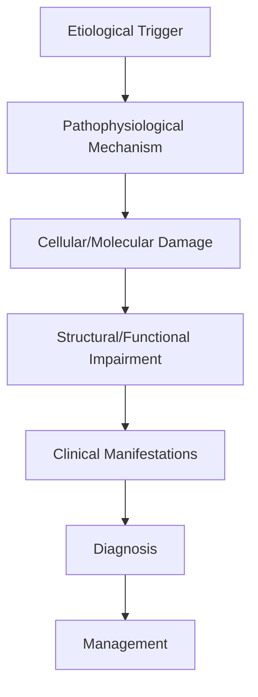
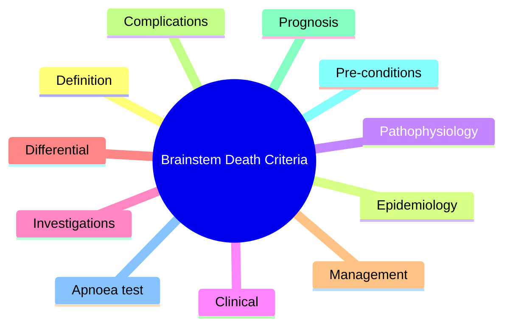

# Brainstem Death Criteria

> [!tip] **High-Yield Definition**
> Comprehensive clinical note for Brainstem Death Criteria covering definition, epidemiology, aetiology, pathophysiology, clinical features, investigations, differential diagnosis, management, drug interactions, procedures, complications, red flags, prognosis, topic correlation, and special situations for FCPS/MRCP examination preparation based on Davidson 24th Edition Chapter 25: Neurology.

---

## 1. Definition / Epidemiology / Classification

### Definition
Brainstem Death Criteria is a neurological disorder within the 14 coma disorders consciousness category. It is characterised by specific clinical, pathological, radiological, and laboratory features that allow differentiation from related conditions.

### Epidemiology
- **Incidence/Prevalence:** Variable depending on the specific condition.
- **Age:** Adult onset is most common, but paediatric and elderly presentations occur.
- **Sex:** Variable depending on the condition.
- **Geography:** Worldwide distribution, with higher prevalence in certain regions.
- **Risk Factors:** Genetic predisposition, environmental factors, comorbidities, family history.

### Classification
| Subtype | Key Features | Prognosis |
|---------|-------------|-----------|
| Mild/early | Subtle symptoms, preserved function | Best |
| Moderate | Clear symptoms, functional impairment | Variable |
| Severe | Significant disability, complications | Worst |

---

## 2. Aetiology / Pathophysiology

### Aetiology
- **Primary (idiopathic):** Most cases have no identifiable cause.
- **Genetic:** May be inherited (AD, AR, X-linked, mitochondrial, sporadic).
- **Autoimmune:** Autoantibodies, immune-mediated inflammation.
- **Infectious:** Viral, bacterial, fungal, parasitic.
- **Metabolic:** Electrolyte, endocrine, hepatic, renal, nutritional.
- **Toxic:** Drugs, alcohol, heavy metals, environmental toxins.
- **Vascular:** Ischaemia, haemorrhage, vasculitis.
- **Neoplastic:** Primary, secondary, paraneoplastic.
- **Traumatic:** Acute, chronic, repetitive.
- **Degenerative:** Neurodegeneration, protein misfolding.

### Pathophysiology


---

## 3. Clinical Features

### History
- **Onset/Duration:** Acute, subacute, or chronic.
- **Progression:** Static, progressive, relapsing-remitting, stepwise.
- **Key symptoms:** Specific to the condition.
- **Triggers:** Stress, infection, trauma, drugs, hormonal, environmental.
- **Systemic symptoms:** Constitutional features.
- **Drug/Family/Social history:** Relevant exposures, comorbidities.

### Examination
| Domain | Key Findings | Localisation Value |
|--------|-------------|-------------------|
| Higher function | Cognitive, behavioural | Cortical, subcortical, limbic |
| Cranial nerves | Pupils, eye movements, facial, bulbar | Brainstem, cranial nerve, NMJ |
| Motor | Weakness, tone, reflexes | UMN, LMN, NMJ, muscle |
| Sensory | All modalities, pattern | Peripheral, spinal, brainstem |
| Coordination | Ataxia, nystagmus, dysmetria | Cerebellar, sensory, vestibular |
| Gait | Spastic, ataxic, parkinsonian | Multiple |
| Autonomic | Orthostatic, sweating, GI, bladder | Autonomic, peripheral, central |

### Specific Clinical Features
The clinical features are determined by the underlying aetiology, location of pathology, and rate of progression. Patients typically present with a constellation of symptoms and signs that allow clinical localisation and subsequent targeted investigation.

---

## 4. Diagnostic Approach / Algorithm

```mermaid
flowchart TD
    A[Clinical Presentation] --> B[Anatomical Localisation]
    B --> C[Pathophysiological Category]
    C --> D[Formulate Differential]
    D --> E[Targeted Investigations]
    E --> F[Confirm Diagnosis]
    F --> G[Assess Severity/Prognosis]
    G --> H[Initiate Management]
    H --> I[Monitor Response]
    I --> J{Response?}
    J --> YES1 [Good - Continue]
    J --> NO1 [Poor - Escalate]
    YES1 --> K[Monitor]
    NO1 --> H
```

---

## 5. Investigations

### First-Line Investigations
- **Blood tests:** FBC, U&Es, LFTs, glucose, calcium, magnesium, ESR, CRP, autoimmune, infection.
- **Imaging:** CT/MRI brain/spine (essential for most neurological conditions).
- **Neurophysiology:** EEG, nerve conduction, EMG, evoked potentials.
- **CSF:** Cell count, protein, glucose, OCBs, PCR, culture.

### Second-Line Investigations
- **Genetic testing:** Gene panels, WES, WGS.
- **Antibody testing:** Antineuronal, autoimmune, paraneoplastic.
- **Biopsy:** Nerve, muscle, brain, skin.
- **Advanced imaging:** PET-CT, MR spectroscopy, fMRI.

### Specialised Investigations
- **Biomarkers:** Neurofilament light chain, tau, beta-amyloid, 14-3-3, RT-QuIC.
- **Autonomic testing:** Head-up tilt, sudomotor, QSART.
- **Neuropsychology:** Cognitive testing, behavioural assessment.
- **Genetic counselling:** Family screening, predictive testing.

---

## 6. Differential Diagnosis

| Differential | Distinguishing Features | Key Test |
|--------------|------------------------|----------|
| Vascular | Sudden onset, focal, vascular risk factors | MRI/CT, vessel imaging |
| Inflammatory | Subacute, multifocal, systemic | MRI, CSF, antibodies |
| Infectious | Fever, systemic, exposure | Bloods, CSF, imaging |
| Neoplastic | Progressive, mass effect | MRI, biopsy |
| Degenerative | Progressive, symmetric, hereditary | MRI, genetic |
| Toxic/Metabolic | Drug history, systemic, reversible | Bloods, toxicology |
| Autoimmune | Multifocal, antibodies, immunotherapy response | Antibodies, MRI, CSF |
| Functional | Inconsistent, distractible | Clinical, video, biomarkers |

---

## 7. Management

### Acute Management
- **Stabilisation:** ABCDE approach, emergency resuscitation.
- **Specific treatment:** Disease-specific interventions.
- **Symptomatic relief:** Pain, seizures, spasticity, autonomic dysfunction.
- **Prevention of complications:** DVT, pressure sores, infection.

### Disease-Modifying Treatment
- **Pharmacological:** First-line, second-line, escalation, maintenance.
- **Procedural:** Surgery, biopsy, drainage, ablation, stimulation.
- **Immunotherapy:** Steroids, IVIG, plasma exchange, immunosuppressants, biologics.
- **Rehabilitation:** Physiotherapy, OT, speech therapy.

### Long-Term Management
- **Monitoring:** Clinical, imaging, biomarkers, side effects.
- **Prevention:** Vaccinations, prophylaxis, lifestyle modification.
- **Supportive care:** Multidisciplinary team, social work, psychological support.
- **Palliative care:** Advanced care planning, end-of-life care, hospice.

---

## 8. Drug Interactions / Contraindications / Comorbidity Cautions

| Drug Class | Interaction / Caution | Management |
|------------|----------------------|------------|
| Antiseizure medications | Enzyme induction, teratogenicity | Monitor, supplement, switch |
| Immunosuppressants | Infection, malignancy, teratogenicity | Monitor, prophylaxis |
| Anticoagulants | Bleeding risk, drug interactions | Monitor INR, avoid combinations |
| Antihypertensives | Hypotension, falls | Monitor BP, adjust dose |
| Antibiotics | Nephrotoxicity, ototoxicity | Monitor renal |
| Antivirals | Nephrotoxicity, neuropsychiatric | Monitor renal, dose adjust |
| Steroids | DM, HTN, osteoporosis, infection | Monitor, prophylaxis, taper |
| Biologics | Infusion reactions, infection | Monitor, prophylaxis |

---

## 9. Procedures

### Common Procedures
- **Lumbar puncture:** Diagnostic, therapeutic (IIH, NPH). Contraindications: raised ICP, mass lesion, coagulopathy.
- **Nerve conduction studies/EMG:** Diagnostic, prognosis. Minor discomfort.
- **EEG:** Diagnostic, monitoring. No significant complications.
- **MRI brain/spine:** Diagnostic, monitoring. Contraindications: pacemaker, metallic implants.
- **CT head:** Emergency, rapid. Radiation exposure, contrast reactions.
- **Biopsy:** Stereotactic, open. Indications: diagnosis, molecular profiling.

---

## 10. Complications

| Complication | Frequency | Prevention | Management |
|--------------|-----------|------------|------------|
| Infection | Common | Hygiene, prophylaxis, vaccination | Antibiotics, antifungals |
| Thrombosis | Common | Prophylaxis, mobility | Anticoagulation |
| Pressure sores | Common | Positioning, nutrition | Wound care, surgery |
| Spasticity | Common | Positioning, stretching | Baclofen, BoNT |
| Contractures | Common | Passive movements, splints | Physiotherapy, surgery |
| Aspiration | Common | Swallow assessment | NGT, PEG, thickeners |
| Falls | Common | Environment, mobility | Walking aids |
| Fractures | Common | Bone health, prevention | Vitamin D, bisphosphonate |
| Depression | Common | Screening, support | Antidepressants, CBT |
| Cognitive decline | Variable | Monitoring, training | Rehabilitation |
| Autonomic dysfunction | Variable | Monitoring, hydration | Midodrine, fludrocortisone |
| Respiratory failure | Variable | Monitoring, supportive | Ventilation, NIV |
| Death | Variable | Monitoring, palliative | End-of-life care |

---

## 11. Red Flags / Emergencies

### Emergency Presentations
- **Rapid neurological deterioration:** New focal deficit, decreased consciousness, seizures.
- **Status epilepticus:** Continuous seizures >5 min.
- **Raised ICP:** Headache, vomiting, papilloedema, altered consciousness.
- **Respiratory failure:** Hypoxia, hypercapnia, ventilatory failure.
- **Cardiac arrest:** Arrhythmia, MI, pulmonary embolism.
- **Infection:** Sepsis, meningitis, abscess, encephalitis.
- **Drug toxicity:** Overdose, side effects, interactions.
- **Haemorrhage:** Intracranial, systemic, coagulopathy.

---

## 12. Prognosis

### Natural History
- **Acute:** May resolve with treatment, may progress, may be fatal.
- **Subacute:** Variable, depends on cause and treatment.
- **Chronic:** Often progressive, may be stable, may have relapses.
- **Recovery:** Variable, may be complete, partial, or none.

### Prognostic Factors
- **Favourable:** Young age, early treatment, mild disease, reversible cause, good premorbid function, family support.
- **Unfavourable:** Older age, delayed treatment, severe disease, irreversible cause, poor premorbid function, comorbidities.

---

## 13. Topic Correlation

| Related Topic | Link | Key Overlap |
|---------------|------|-------------|
| Davidson 24th Ed Chapter 25 | [[Davidson Chapter 25 - Neurology Hierarchy]] | Comprehensive neurology |
| Neurology MOC | [[Neurology MOC]] | All neurology topics |
| Drug Reference | [[../00_Index/Neurology Drug Reference]] | Medications |
| Local Hub | [[../14_Coma_Disorders_Consciousness/Hub]] | Section-specific |
| Clinical Examination | [[../01_Fundamentals_Examination/Neurological History Taking]] | Clinical approach |
| Investigation | [[../01_Fundamentals_Examination/Neuroimaging (CT-MRI) Principles]] | Imaging |

---

## 14. Special Situations

| Situation | Consideration |
|-----------|---------------|
| **Pregnancy** | Pre-conception counselling, teratogenicity, drug safety, monitoring, delivery planning, breastfeeding. |
| **Lactation** | Drug safety, breastfeeding, monitoring, support. |
| **Paediatric** | Developmental considerations, drug dosing, school, family, vaccination, growth, puberty. |
| **Elderly / Frail** | Comorbidities, polypharmacy, falls, bone health, cognition, social, end-of-life. |
| **Renal impairment** | Drug dose adjustment, monitoring, dialysis, transplant. |
| **Hepatic impairment** | Drug dose adjustment, monitoring, transplant. |
| **Immunocompromised** | Infection prophylaxis, vaccination, drug interactions, malignancy screening. |
| **Perioperative** | Drug management, anaesthesia planning, VTE prophylaxis, infection prevention, monitoring. |
| **Driving / DVLA** | Fitness to drive, restrictions, notification, reassessment. |
| **Occupational** | Fitness for work, adaptations, rehabilitation, disability, return to work. |

---

## FCPS/MRCP High-Yield Summary

| Category | Key Points |
|----------|------------|
| **Definition** | Comprehensive definition with key diagnostic criteria |
| **Epidemiology** | Incidence, prevalence, age, sex, geography, risk factors |
| **Aetiology** | Primary causes, secondary causes, genetic, environmental |
| **Pathophysiology** | Mechanism of disease, cellular/molecular basis |
| **Clinical Features** | History, examination, key findings, variants |
| **Diagnosis** | Diagnostic criteria, classification, severity |
| **Investigations** | First-line, second-line, specialised, biomarkers |
| **Differential Diagnosis** | Key differentials, distinguishing features, tests |
| **Management** | Acute, disease-modifying, symptomatic, supportive |
| **Complications** | Common, serious, prevention, management |
| **Prognosis** | Natural history, prognostic factors, outcomes |
| **Viva Pearls** | Key examination points |
| **Drug Doses** | First-line, second-line, emergency |
| **Scoring Systems** | Specific scores used in management |
| **Genetics** | Inheritance, genes, mutations, family screening |
| **Imaging Signs** | Characteristic findings, differential |

---

## Viva Questions (PACES/FCPS Style)

1. **Q:** Define and classify its variants.
   **A:** Comprehensive definition with classification of subtypes based on aetiology, severity, and clinical features.

2. **Q:** What are the key clinical features?
   **A:** Specific symptoms and signs including onset, progression, key features, and associated findings.

3. **Q:** What is the first-line treatment?
   **A:** First-line pharmacological and non-pharmacological management based on current evidence.

4. **Q:** What are the red flags requiring urgent referral?
   **A:** Specific emergency presentations and complications requiring immediate intervention.

5. **Q:** What is the prognosis?
   **A:** Natural history, prognostic factors, and long-term outcomes.

6. **Q:** How do you differentiate from key differentials?
   **A:** Clinical features, investigations, and response to treatment that distinguish from alternative diagnoses.

7. **Q:** What investigations are most useful?
   **A:** First-line and second-line investigations including imaging, neurophysiology, CSF, and biomarkers.

8. **Q:** Describe the stepwise management approach.
   **A:** Stepwise escalation from first-line to second-line to third-line therapy with monitoring.

9. **Q:** What are the emergency presentations?
   **A:** Specific emergency scenarios and immediate management priorities.

10. **Q:** How does management change in pregnancy/paediatrics/elderly?
    **A:** Special considerations for each population including drug safety, monitoring, and support.

---

## Common Confusions / Exam Traps

| Confusion | Clarification |
|-----------|---------------|
| Similar presentation but different cause | Differentiate by history, examination, investigations |
| Treatment response vs natural history | Assess with objective measures, biomarkers |
| Drug interactions | Check each drug, monitor, adjust doses |
| Disease progression vs treatment failure | Monitor response, escalate appropriately |
| Functional vs organic | Inconsistent, distractible, disability greater than impairment |
| Acute vs chronic | Time course, progression, reversibility |
| Primary vs secondary | Underlying cause, contributing factors |
| Side effects vs symptoms | Temporal relationship, dose relationship |

---

## Mnemonics
1. **Pre-Conditions** = Cause known, irreversible, severe brain injury, exclude confounders (drugs, metabolic, hypothermia) (use: Pre-conditions)
2. **Brainstem Reflexes** = Pupillary + Corneal + Oculo-vestibular + Oculo-cephalic + Gag + Cough + Facial (no response to noxious stimuli above foramen magnum) (use: Reflexes)
3. **Apnoea Test** = PaCO2 >6.0 kPa (45 mmHg) with no respiratory effort (use: Apnoea)

---

## Mind Map



---

## Spaced Repetition Trackers

| Review Interval | Date | Score (0-5) | Notes |
|-----------------|------|-------------|-------|
| Day 1 | | | |
| Day 3 | | | |
| Day 7 | | | |
| Day 14 | | | |
| Day 30 | | | |
| Day 90 | | | |

---

## Self-Test Scorecard

| Section | Score /5 | Last Attempt |
|---------|----------|--------------|
| Definition & Epidemiology | | | |
| Pathophysiology | | | |
| Clinical Features | | | |
| Investigations | | | |
| Differential | | | |
| Management | | | |
| Complications | | | |
| Viva Questions | | | |
| MCQs | | | |
| SBAs | | | |

---

## MCQs (10)

1. **Pre-conditions for brainstem death testing?**
   **Options:** A. Any comatose patient B. Known irreversible severe brain injury, exclude confounders (drugs, hypothermia <35°C, severe metabolic/endocrine), normotension C. Only trauma D. Only anoxia
   **Answer:** B
   **Explanation:** Pre-conditions: known irreversible brain injury, exclude confounders (sedatives, neuromuscular blockers, hypothermia <35°C, severe electrolyte/acid-base/endocrine, hypotension).

2. **UK code: prerequisites before brainstem death testing?**
   **Options:** A. No prerequisites B. Pre-conditions met, apnoea test explained, two doctors (experienced, one consultant, registered with HSE), ≥6h apart or imaging confirms C. Single doctor D. No timing required
   **Answer:** B
   **Explanation:** UK: two medical practitioners (≥5y registration, one consultant, neither from transplant team), test criteria met, two sets of tests separated by interval (or as per local policy).

3. **Pupillary reflex in brainstem death?**
   **Options:** A. Normal B. Absent (no response to light, pupils fixed, usually mid-position or dilated) C. Brisk D. Sluggish
   **Answer:** B
   **Explanation:** Pupils fixed, no response to light. Size varies (mid, dilated); absolute absence of reflex is key.

4. **Corneal reflex testing in brainstem death?**
   **Options:** A. Touch cornea with cotton B. No blink response to corneal stimulation (touch with cotton wool/squirt of water) C. Use forceps D. No testing needed
   **Answer:** B
   **Explanation:** No blink response to light touch of cornea with cotton wool (or sterile water/saline squirt).

5. **Oculo-vestibular (caloric) test in brainstem death?**
   **Options:** A. Nystagmus to cold water B. No eye movement with 50mL ice-cold water in each ear (after confirming intact tympanic membrane, head elevated 30°) C. Eye deviation only D. Only horizontal
   **Answer:** B
   **Explanation:** No eye movement (nystagmus absent) with ice-cold water caloric in each ear (5 min apart, head at 30°). Confirms absent brainstem reflexes.

6. **Apnoea test in brainstem death?**
   **Options:** A. Stop ventilation, observe B. Disconnect ventilator, give 100% O2 via tracheal catheter, observe for respiratory effort; PaCO2 must rise >6.0 kPa (45 mmHg) for valid test C. Always 1 min D. No gas analysis
   **Answer:** B
   **Explanation:** Apnoea test: 100% O2, disconnect ventilator, observe for respiratory effort. Pre: normal PaCO2; post: PaCO2 >6.0 kPa (45 mmHg) confirms no respiratory drive.

7. **Apnoea test complications?**
   **Options:** A. None B. Hypotension, hypoxaemia, arrhythmia, pneumothorax, raised ICP; abort if haemodynamic instability C. Cardiac arrest always D. Hyperthermia
   **Answer:** B
   **Explanation:** Apnoea test complications: hypotension, hypoxaemia, arrhythmia, raised ICP, pneumothorax (rare). Abort if instability.

8. **Ancillary tests for brainstem death?**
   **Options:** A. Required B. Not required if clinical criteria met; EEG, transcranial Doppler, nuclear scan if clinical exam not possible C. Always required D. Never useful
   **Answer:** B
   **Explanation:** Ancillary tests (EEG, TCD, nuclear scan) used when clinical examination cannot be reliably performed (severe facial trauma, high cervical cord injury).

9. **Time of death in brainstem death?**
   **Options:** A. When heart stops B. Time of completion of SECOND set of brainstem death tests (or first in some jurisdictions) C. Time of injury D. Time of consent
   **Answer:** B
   **Explanation:** Legal time of death: when second set of brainstem death tests completed (UK); allows organ donation to proceed.

10. **Brainstem death vs persistent vegetative state?**
   **Options:** A. Same B. BSD: no brainstem reflexes, no respiratory drive, apnoea test positive. PVS: preserved brainstem reflexes, sleep-wake cycles, awareness absent C. BSD is milder D. PVS is dead
   **Answer:** B
   **Explanation:** BSD = irreversible loss of brainstem function; apnoea; legally dead. PVS (vegetative state) = preserved brainstem function, sleep-wake cycles, no awareness.

---

## SBA Questions (10)

1. **Scenario:** 22-year-old, severe TBI, GCS 3, off sedation 48h, no brainstem reflexes. PaCO2 4.5, Na 138, T 36.5, off inotropes.
   **Question:** Ready for brainstem death testing?
   **Options:** A. Yes, perform tests B. No - exclude confounders (temperature, metabolic, drug levels); correct any reversible cause first C. Always no D. Stop ICU
   **Answer:** B
   **Explanation:** Pre-conditions: normothermia (>35°C), normotension, no severe metabolic/endocrine derangement, no sedative/relaxant effect. Correct first.

2. **Scenario:** First set of brainstem death tests: pupils fixed, no corneal, no gag, no cough, no caloric response, apnoea test positive. Next step?
   **Question:** Best next step?
   **Options:** A. Declare death now B. Second set of brainstem death tests by independent senior doctor (interval as per local policy) C. Wait 24h D. Ancillary tests only
   **Answer:** B
   **Explanation:** Two sets of brainstem death tests required (UK code), usually by two senior doctors; legal time of death = completion of second set.

3. **Scenario:** During apnoea test, patient develops hypotension (BP 80/40) and SpO2 88%. Action?
   **Question:** Best immediate action?
   **Options:** A. Continue test B. Abort apnoea test, re-institute ventilation, manage haemodynamic instability; can repeat later C. Decline death D. Sedate
   **Answer:** B
   **Explanation:** Abort apnoea test if cardiovascular/respiratory instability; re-institute ventilation; manage cause; can repeat when stable.

4. **Scenario:** Brainstem death testing in patient with high cervical cord injury (C1-C2) and facial trauma.
   **Question:** Best approach?
   **Options:** A. Clinical exam sufficient B. Ancillary tests (EEG, TCD, nuclear scan) since brainstem reflexes may be confounded by cord injury; document inability to perform clinical exam C. Skip apnoea test D. Stop testing
   **Answer:** B
   **Explanation:** If clinical exam cannot be reliably performed, use ancillary tests. Spinal cord injury doesn't preclude brainstem testing, but document.

5. **Scenario:** EEG in brainstem death?
   **Question:** EEG finding?
   **Options:** A. Normal B. Isoelectric (electrical silence) over 30 min at high sensitivity C. Slow waves D. Alpha
   **Answer:** B
   **Explanation:** EEG in brainstem death: isoelectric (electrical silence); 30 min at high sensitivity. Ancillary test.

6. **Scenario:** Transcranial Doppler in brainstem death?
   **Question:** TCD finding?
   **Options:** A. Normal flow B. Reverberating flow or absent diastolic flow (small vessels); systolic spikes (large vessels); no flow in late phase C. High flow D. Turbulent flow
   **Answer:** B
   **Explanation:** TCD in BSD: reverberating flow, absent diastolic flow, small systolic spikes, eventual no flow. Confirms cerebral circulatory arrest.

7. **Scenario:** Nuclear medicine scan in brainstem death?
   **Question:** Scan finding?
   **Options:** A. Normal uptake B. Absent intracranial perfusion (no uptake of tracer in brain; 'hollow skull phenomenon') C. Increased uptake D. Focal uptake
   **Answer:** B
   **Explanation:** Nuclear scan: absent intracranial perfusion ('hollow skull phenomenon') = BSD. Highly specific ancillary test.

8. **Scenario:** Patient declared brainstem dead, family asks about organ donation.
   **Question:** Best approach?
   **Options:** A. No donation possible B. Discuss with specialist nurse for organ donation; family approach per local protocol; donation does not conflict with declaration of death C. Stop ICU D. Proceed to theatre only
   **Answer:** B
   **Explanation:** After BSD declaration, organ donation discussed by specialist nurses (UK). Donation does not change declaration or care.

9. **Scenario:** Brainstem death testing in child?
   **Question:** Different in children?
   **Options:** A. Same as adult B. Different in neonates and infants (UK code: testing after 2 months corrected age is same as adult; pre-2mo use different criteria) C. Never test D. Always more strict
   **Answer:** B
   **Explanation:** Brainstem death testing in infants <2 months: different criteria. After 2 months corrected age: same as adults.

10. **Scenario:** Spontaneous movements (Lazarus sign) in brainstem death?
   **Question:** Significance?
   **Options:** A. Brain is alive B. Spinal reflexes only; does not invalidate brainstem death diagnosis; common and benign C. Brain function D. Sedation
   **Answer:** B
   **Explanation:** Spinal reflexes (Lazarus sign, arm/leg movements) can persist after BSD; do NOT invalidate brainstem death; document, reassure family.

---

## Tags
**Tags:** #neurology #brain-death #BSD #brainstem #apnoea-test #EEG #TCD #nuclear-scan #organ-donation #FCPS #MRCP

---

## Local Navigation
**Heading Hub:** [[../Hub]]  
**Chapter Hierarchy:** [[Davidson Chapter 25 - Neurology Hierarchy]]  
**Chapter MOC:** [[Neurology MOC]]  
**Drug Reference:** [[../00_Index/Neurology Drug Reference]]

## PasTest Scenario SBAs (Clinical Vignettes)

> **Auto-generated PasTest/Mediscope-style scenario SBAs** grounded in the authored source. Each scenario tests a real clinical fact (triad, specific sign, contraindication, trial, first-line Rx) extracted from the topic. *Source: Ch 27: Neurology & Stroke — Brainstem Death Criteria*

**Q1.** Which of the following features is most specific or characteristic of Brainstem Death Criteria?

  - **A.** Key symptoms:
  - **B.** A feature common to many acute inflammatory conditions
  - **C.** A non-specific sign that does not localise the diagnosis
  - **D.** An investigation finding rather than a clinical feature

  > **Answer: A** — Key symptoms:
  >
  > *Source:* - **Key symptoms:** Specific to the condition

**Q2.** What is the most appropriate first-line therapy for Brainstem Death Criteria?

  - **A.** Rehabilitation:
  - **B.** An advanced/surgical therapy reserved for refractory disease
  - **C.** Symptomatic treatment only, no disease-modifying therapy
  - **D.** Empiric broad-spectrum therapy without specific indication

  > **Answer: A** — Rehabilitation:
  >
  > *Source:* **Rehabilitation:** Physiotherapy, OT, speech therapy.

