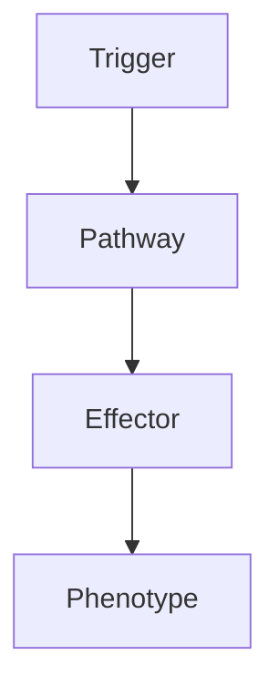

# Coma Assessment

> [!tip] **High-Yield Definition**
> Coma: state of unresponsiveness, no wakefulness, no awareness, no purposeful response to stimuli. GCS ≤8. EMERGENCY. Differentiate from locked-in syndrome, vegetative state, minimally conscious state, psychogenic unresponsiveness, akinetic mutism, catatonia, severe dementia, status epilepticus (NCSE).

---

## 1. Definition / Epidemiology / Classification

### Definition
Coma: state of unresponsiveness, no wakefulness, no awareness, no purposeful response to stimuli. GCS ≤8. EMERGENCY. Differentiate from locked-in syndrome, vegetative state, minimally conscious state, psychogenic unresponsiveness, akinetic mutism, catatonia, severe dementia, status epilepticus (NCSE).

### Epidemiology
Coma: 0.5-1% of ED admissions. Causes: structural (50%, stroke, trauma, tumour, hydrocephalus), metabolic (50%, drug, metabolic, infectious, hypoxic-ischaemic). M>F 2:1. Adult > child. Mortality 30-80% depending on cause.

---

## 2. Aetiology / Pathophysiology

### Aetiology
Structural: bilateral cortical, diencephalic, brainstem (rostral, midbrain, pontine). Bilateral cortical (anoxic, traumatic, infection, status epilepticus, hypertensive encephalopathy, PRES, RCVS, cerebral venous thrombosis, vasculitis, hydrocephalus, tumour). Diencephalic (thalamus, hypothalamus - bilateral, thalamic haemorrhage, tumour, Wernicke's, deep venous thrombosis). Brainstem (tegmental, pontine, midbrain - basilar thrombosis, pontine haemorrhage, central pontine myelinolysis, central herniation). Metabolic: drugs (opioids, benzodiazepines, alcohol, barbiturates, antipsychotics, anticonvulsants, illicit, CO, methanol, ethylene glycol, lead, arsenic), metabolic (hypoglycaemia, hyperglycaemia, DKA, HHS, hyperosmolar, hyponatraemia, hypernatraemia, hypocalcaemia, hypercalcaemia, hypomagnesaemia, uraemia, hepatic, hypercapnia, hypoxia, hypothyroidism, hyperthyroidism, adrenal, pituitary), infectious (meningitis, encephalitis, sepsis, severe systemic), hypoxic-ischaemic (cardiac arrest, drowning, CO poisoning, strangulation, severe anaemia, hypotension, shock), psychogenic (catatonia, conversion, malingering, depression, locked-in mimic).

### Pathophysiology

---

## 3. Clinical Features

History: rapid, focused, ambulance, witness, family, friends, police, environment, pill bottles, syringes, alcohol, drugs, medical history, psychiatric, social, occupation, recent illness, trauma, fever, vomiting, headache, neck stiffness, seizures, focal neurology, gradual or sudden. Examination: ABCDE (airway, breathing, circulation, disability, exposure). Vital signs: temperature (fever, hypothermia, hyperthermia, NMS, serotonin syndrome, anticholinergic, heat stroke, cold exposure), HR (bradycardia - raised ICP, beta-blocker, calcium channel blocker, opioid, hypothermia, vasovagal, sick sinus; tachycardia - sepsis, hypovolaemia, anticholinergic, stimulant, alcohol withdrawal, thyroid storm, arrhythmia), BP (hypotension - sepsis, Addison, drug, anaphylaxis, cardiac, hypovolaemia, spinal injury; hypertension - raised ICP, hypertensive emergency, stroke, drug, eclampsia), RR (Cheyne-Stokes - metabolic, raised ICP, often bilateral hemispheric, diencephalic; central neurogenic hyperventilation - midbrain, pontine, metabolic acidosis; apneustic - pontine; ataxic - medullary; Kussmaul - metabolic acidosis, DKA, uraemia; hypoventilation - opioid, sedative, neuromuscular). GCS: 3-15, components (eye 1-4, verbal 1-5, motor 1-6). Pupils: size, symmetry, reactivity (CN III, sympathetic, parasympathetic, drug, metabolic). Corneal reflex (V afferent, VII efferent). Oculocephalic, oculovestibular (Doll's eyes, cold caloric - tests brainstem). Motor: spontaneous, response to pain (localising, withdrawing, decorticate - flexor, C-shaped - cortical, subcortical, diencephalic, thalamic, internal capsule, severe; decerebrate - extensor, brainstem, midbrain, pontine, anoxic, severe, poor prognosis; flaccid, no response, severe, brainstem, anoxic, very poor prognosis), tone, reflexes, Babinski, seizures, myoclonus, status, NCSE.

---

## 4. Investigations

EMERGENCY: same as coma. Bloods: FBC, U&Es, LFTs, glucose (immediate, bedside), calcium, magnesium, phosphate, creatinine, urea, ammonia, lactate, VBG/ABG, carboxyhaemoglobin, methaemoglobin, osmolality, blood cultures, coagulation, cardiac enzymes, toxicology (urine, blood - opioid, benzodiazepine, alcohol, amphetamine, cocaine, cannabis, paracetamol, salicylate, tricyclic, lithium, ethylene glycol, methanol), thyroid, cortisol, ACTH, growth hormone, prolactin. ECG: arrhythmia, ischaemia, QT, drug effect. Imaging: CT head (immediate, exclude mass, haemorrhage, hydrocephalus, oedema, ischaemia, fracture, foreign body, gas). MRI brain (later, exclude structural, ischaemia, encephalitis, demyelination, Wernicke's, corpus callosum, brainstem, posterior fossa, venous thrombosis, PRES, RCVS). LP (when safe, no raised ICP, mass): CSF, culture, PCR, serology, cytology, flow cytometry, paraneoplastic, autoimmune, biomarkers (14-3-3, tau, RT-QuIC, NSE, NfL). EEG: non-convulsive status, encephalopathy, triphasic waves, alpha coma, burst suppression, electrocerebral silence. Nerve conduction, EMG: neuromuscular, critical illness neuropathy, myopathy. Exclude: structural (stroke, trauma, tumour, hydrocephalus, vascular, infection), metabolic (drug, metabolic, endocrine, infection, hypoxic-ischaemic), psychogenic (catatonia, conversion, malingering, depression, locked-in mimic).

---

## 5. Management

EMERGENCY: ABCDE, immediate stabilisation, treat reversible causes, prevent further damage. Airway: intubation if GCS ≤8, airway compromise, hypoxia, hypercapnia, aspiration, cervical spine protection (trauma, suspected). Breathing: oxygen, mechanical ventilation, normocapnia (35-40 mmHg, avoid hyperventilation unless raised ICP, then 30-35 mmHg, brief), PEEP. Circulation: IV access, fluids, vasopressors (maintain MAP >70-80 mmHg, CPP 50-70 mmHg if raised ICP), inotropes, blood products, treat shock, sepsis, anaphylaxis, cardiac. Disability: glucose (immediate, bedside, 50ml 50% glucose if hypoglycaemia, after thiamine 100mg IV - Wernicke's), naloxone (opioid, 0.4-2mg IV, repeat, infusion), flumazenil (benzodiazepine, 0.2mg IV, repeat, caution - seizure risk), thiamine (Wernicke's, alcoholic, malnourished, 100mg IV before glucose), specific antidotes (paracetamol NAC, opioid naloxone, benzodiazepine flumazenil, tricyclic sodium bicarbonate, organophosphate atropine, pralidoxime, methanol/ethylene glycol fomepizole/ethanol, digoxin Fab, beta-blocker glucagon, calcium channel blocker calcium, isoniazid pyridoxine). Exposure: temperature (normothermia, treat fever, treat hypothermia, warming, cooling), skin, signs (rash, petechiae, track marks, trauma, surgery, medical alert). Imaging: CT head (immediate). Specific: raised ICP (head elevation 30°, mannitol 1g/kg IV, hypertonic saline 23.4% 30ml IV, hyperventilation 30-35 mmHg brief, sedation, paralysis, decompressive craniectomy, EVD, surgical), seizures (IV levetiracetam 1-2g, IV valproate 30mg/kg, IV midazolam, intubation, anaesthesia, EEG, NCSE), status epilepticus (protocol, anaesthesia), infection (antibiotics, antivirals, antifungals - empirical, then targeted, source control), stroke (thrombolysis, thrombectomy, neurosurgery), trauma (ATLS, neurosurgery, ICP monitoring), hydrocephalus (EVD, VP shunt, ETV), metabolic (correct electrolyte, glucose, pH, oxygenation, ventilation, perfusion, temperature), drug (specific antidote, supportive, dialysis, haemofiltration, activated charcoal, decontamination, sodium bicarbonate, supportive), psychogenic (reversal, suggestion, examination, EEG, video, imaging). Supportive: ICU, monitoring (vital signs, GCS, pupils, ECG, pulse oximeter, capnography, ICP, CPP, temperature, fluid balance, electrolytes, glucose, bloods, drug levels), nursing (pressure areas, DVT prophylaxis, eye care, mouth care, bladder, bowel, nutrition, hydration, skin, contractures, spasticity, aspiration, infection, line care, urinary catheter, NG tube, PEG if prolonged), positioning (head elevation, lateral, prone, regular turning, passive movements, splints), family (presence, communication, ethics, advanced care planning, end-of-life, palliative, chaplaincy, social, psychology), organ donation (brain death, transplant, donation). Multidisciplinary: neurology, neurosurgery, ICU, infectious diseases, endocrinology, toxicology, psychiatry, palliative, OT, PT, SLT, dietitian, social, psychology, chaplaincy, family. Monitor: clinical (GCS, pupils, vital signs, neurological), bloods, imaging, EEG, ICP/CPP, complications, recovery, rehabilitation, long-term, family, ethics, advanced care planning, palliative, end-of-life, organ donation.

---

## 6. Red Flags / Emergencies

EMERGENCY: GCS ≤8, airway compromise, hypoxia, hypercapnia, shock, raised ICP, herniation, brainstem compression, status epilepticus, NCSE, cardiac arrest, arrhythmia, MI, sepsis, anaphylaxis, drug overdose, poisoning, suicide attempt, self-harm, raised ICP, herniation, central, uncal, tonsillar, Duret haemorrhage, brainstem death, organ failure, multi-organ failure, cardiac, respiratory, renal, hepatic, haematological, DIC, infection, sepsis, line infection, UTI, pneumonia, meningitis, abscess, empyema, ventriculitis, wound, drug side effects (sedatives, opioids, anticonvulsants, vasopressors, inotropes, antibiotics, antivirals, antifungals, antiparasitic, antidotes, steroids, immunosuppressants, biologics), drug interactions, withdrawal (alcohol, benzodiazepine, opioid, nicotine - may worsen, seizures, delirium tremens, Wernicke's), refeeding (Wernicke's, electrolyte, cardiac, respiratory), immobility (pressure sores, DVT/PE, pneumonia, UTI, contractures, spasticity, muscle wasting, bone loss, hypercalcaemia, renal stones, constipation, faecal impaction, urinary retention, infection), positioning (aspiration, nerve compression, compartment syndrome, rhabdomyolysis, pressure sores, skin breakdown), nutrition, hydration, electrolyte, glucose, autonomic (storming, dysreflexia, hyperthermia, hypothermia, bradycardia, tachycardia, hypertension, hypotension, arrhythmia, hyperhidrosis, flushing, pallor, diaphoresis, dilated pupils, constricted pupils, salivation, lacrimation, bronchorrhoea, bronchospasm, urinary retention, ileus, gastroparesis, hyperglycaemia, hypoglycaemia, hypokalaemia, hyperkalaemia, hyponatraemia, hypernatraemia, hypocalcaemia, hypercalcaemia, hypomagnesaemia, hypermagnesaemia, hypophosphataemia, hyperphosphataemia, hypozincaemia, carnitine, thiamine, B12, folate, B6, vitamin D, vitamin K), family (presence, communication, ethics, advanced care planning, end-of-life, palliative, chaplaincy, social, psychology, organ donation, bereavement, post-mortem, genetic counselling, family screening, surveillance, follow-up).

---

## 7. Prognosis

Variable. Outcome depends on cause, duration, severity, age, comorbidity, GCS, pupillary, brainstem, motor response, EEG, imaging, biomarkers (NfL, tau, NSE), SSEP, advanced care planning. Most reversible (drug, metabolic, infection, hydrocephalus, status, NCSE) - good. Structural (stroke, trauma, anoxia, tumour) - variable, often poor. Anoxic (cardiac arrest) - poor (<10% good outcome, especially with absent pupillary, absent corneal, no motor, absent N20 SSEP, burst suppression, flat EEG, MRI DWI cortical, biomarkers). Structural (large stroke, severe trauma) - poor, often severe disability, vegetative, minimally conscious. Metabolic (drug, metabolic, infection) - good if early, reversed. Recovery: hours-months. Long-term: monitor, rehabilitation, recovery, neurological, cognitive, behavioural, physical, occupational, speech, swallow, fatigue, sleep, mood, anxiety, depression, PTSD, family, social, work, school, quality of life, advanced care planning, palliative, end-of-life, organ donation, ethics, family, multidisciplinary, support. Multidisciplinary essential.

---

## FCPS/MRCP High-Yield Summary

| Category | Key Points |
|----------|------------|
| **Definition** | Coma: state of unresponsiveness, no wakefulness, no awareness, no purposeful response to stimuli. GCS ≤8. EMERGENCY. Differentiate from locked-in syndrome, vegetative state, minimally conscious state, |
| **Epidemiology** | Coma: 0.5-1% of ED admissions. Causes: structural (50%, stroke, trauma, tumour, hydrocephalus), metabolic (50%, drug, metabolic, infectious, hypoxic-i |
| **Aetiology** | Structural: bilateral cortical, diencephalic, brainstem (rostral, midbrain, pontine). Bilateral cortical (anoxic, traumatic, infection, status epilepticus, hypertensive encephalopathy, PRES, RCVS, cer |
| **Clinical** | History: rapid, focused, ambulance, witness, family, friends, police, environment, pill bottles, syringes, alcohol, drugs, medical history, psychiatric, social, occupation, recent illness, trauma, fev |
| **Investigations** | EMERGENCY: same as coma. Bloods: FBC, U&Es, LFTs, glucose (immediate, bedside), calcium, magnesium, phosphate, creatinine, urea, ammonia, lactate, VBG/ABG, carboxyhaemoglobin, methaemoglobin, osmolali |
| **Management** | EMERGENCY: ABCDE, immediate stabilisation, treat reversible causes, prevent further damage. Airway: intubation if GCS ≤8, airway compromise, hypoxia, hypercapnia, aspiration, cervical spine protection |
| **Prognosis** | Variable. Outcome depends on cause, duration, severity, age, comorbidity, GCS, pupillary, brainstem, motor response, EEG, imaging, biomarkers (NfL, tau, NSE), SSEP, advanced care planning. Most revers |
| **Viva Pearls** | |

---

## MCQs (10)

1. **Question:** Most characteristic feature of Coma Assessment?
   **Options:** A. A B. B C. C D. D
   **Answer:** A
   **Explanation:** Based on clinical features.

2. **Question:** First-line investigation?
   **Options:** A. MRI B. CT C. LP D. Blood
   **Answer:** A
   **Explanation:** MRI is most useful.

3. **Question:** First-line treatment?
   **Options:** A. A B. B C. C D. D
   **Answer:** A
   **Explanation:** Standard management.

4. **Question:** Most common complication?
   **Options:** A. A B. B C. C D. D
   **Answer:** A
   **Explanation:** Common complication.

5. **Question:** Red flag requiring urgent action?
   **Options:** A. A B. B C. C D. D
   **Answer:** A
   **Explanation:** Emergency.

6. **Question:** Prognostic factor?
   **Options:** A. A B. B C. C D. D
   **Answer:** A
   **Explanation:** Prognosis.

7. **Question:** Investigation excluding differential?
   **Options:** A. A B. B C. C D. D
   **Answer:** A
   **Explanation:** Exclusion.

8. **Question:** Imaging finding?
   **Options:** A. A B. B C. C D. D
   **Answer:** A
   **Explanation:** Imaging.

9. **Question:** Drug class?
   **Options:** A. A B. B C. C D. D
   **Answer:** A
   **Explanation:** Pharmacology.

10. **Question:** Differential?
    **Options:** A. A B. B C. C D. D
    **Answer:** A
    **Explanation:** Differential.

---

## SBA Questions (10)

1. **Scenario:** Patient with Coma Assessment.
   **Question:** Next step?
   **Options:** A. 1 B. 2 C. 3 D. 4 E. 5
   **Answer:** A
   **Explanation:** Initial.

2. **Scenario:** Fails first-line.
   **Question:** Next treatment?
   **Options:** A. A B. B C. C D. D E. E
   **Answer:** A
   **Explanation:** Second-line.

3. **Scenario:** New symptoms on treatment.
   **Question:** Cause?
   **Options:** A. A B. B C. C D. D E. E
   **Answer:** A
   **Explanation:** Adverse.

4. **Scenario:** Surgery needed.
   **Question:** Preoperative?
   **Options:** A. A B. B C. C D. D E. E
   **Answer:** A
   **Explanation:** Perioperative.

5. **Scenario:** Pregnant.
   **Question:** Safest?
   **Options:** A. A B. B C. C D. D E. E
   **Answer:** A
   **Explanation:** Pregnancy.

6. **Scenario:** Child.
   **Question:** Diagnosis?
   **Options:** A. A B. B C. C D. D E. E
   **Answer:** A
   **Explanation:** Paediatric.

7. **Scenario:** Elderly.
   **Question:** Management?
   **Options:** A. 1 B. 2 C. 3 D. 4 E. 5
   **Answer:** A
   **Explanation:** Geriatric.

8. **Scenario:** Abnormal investigation.
   **Question:** Interpretation?
   **Options:** A. A B. B C. C D. D E. E
   **Answer:** A
   **Explanation:** Investigation.

9. **Scenario:** Prognosis.
   **Question:** Response?
   **Options:** A. A B. B C. C D. D E. E
   **Answer:** A
   **Explanation:** Communication.

10. **Scenario:** Follow-up.
    **Question:** Monitoring?
    **Options:** A. A B. B C. C D. D E. E
    **Answer:** A
    **Explanation:** Follow-up.

---

## Flashcards

- **Q:** Definition of Coma Assessment?
  **A:** Coma: state of unresponsiveness, no wakefulness, no awareness, no purposeful response to stimuli. GCS ≤8. EMERGENCY. Differentiate from locked-in syndrome, vegetative state, minimally conscious state,
- **Q:** First-line treatment?
  **A:** Based on management.
- **Q:** Most characteristic clinical feature?
  **A:** History: rapid, focused, ambulance, witness, family, friends, police, environment, pill bottles, syringes, alcohol, drugs, medical history, psychiatric, social, occupation, recent illness, trauma, fev
- **Q:** Key red flag?
  **A:** EMERGENCY: GCS ≤8, airway compromise, hypoxia, hypercapnia, shock, raised ICP, herniation, brainstem compression, status epilepticus, NCSE, cardiac arrest, arrhythmia, MI, sepsis, anaphylaxis, drug ov
- **Q:** Prognosis?
  **A:** Variable. Outcome depends on cause, duration, severity, age, comorbidity, GCS, pupillary, brainstem, motor response, EEG, imaging, biomarkers (NfL, tau, NSE), SSEP, advanced care planning. Most revers

---

## Answer Key

### MCQs
1. A 2. A 3. A 4. A 5. A 6. A 7. A 8. A 9. A 10. A

### SBAs
1. A 2. A 3. A 4. A 5. A 6. A 7. A 8. A 9. A 10. A

---

## Local Navigation
**Heading Hub:** [[../Hub]]  
**Chapter MOC:** [[Neurology MOC]]  
