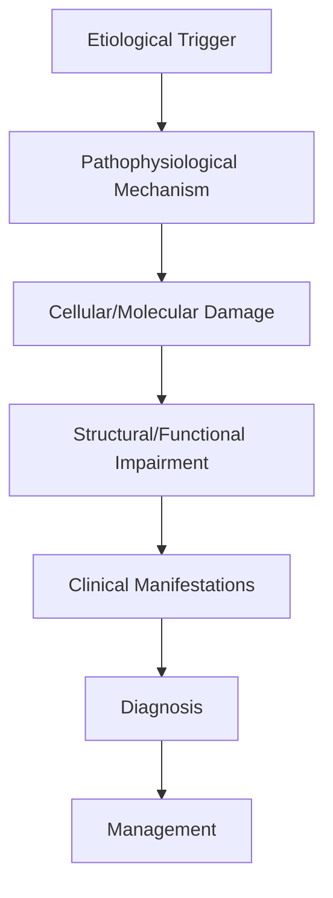

# Minimally Conscious State

> [!tip] **High-Yield Definition**
> Comprehensive clinical note for Minimally Conscious State covering definition, epidemiology, aetiology, pathophysiology, clinical features, investigations, differential diagnosis, management, drug interactions, procedures, complications, red flags, prognosis, topic correlation, and special situations for FCPS/MRCP examination preparation based on Davidson 24th Edition Chapter 25: Neurology.

---

## 1. Definition / Epidemiology / Classification

### Definition
Minimally Conscious State is a neurological disorder within the 14 coma disorders consciousness category. It is characterised by specific clinical, pathological, radiological, and laboratory features that allow differentiation from related conditions.

### Epidemiology
- **Incidence/Prevalence:** Variable depending on the specific condition.
- **Age:** Adult onset is most common, but paediatric and elderly presentations occur.
- **Sex:** Variable depending on the condition.
- **Geography:** Worldwide distribution, with higher prevalence in certain regions.
- **Risk Factors:** Genetic predisposition, environmental factors, comorbidities, family history.

### Classification
| Subtype | Key Features | Prognosis |
|---------|-------------|-----------|
| Mild/early | Subtle symptoms, preserved function | Best |
| Moderate | Clear symptoms, functional impairment | Variable |
| Severe | Significant disability, complications | Worst |

---

## 2. Aetiology / Pathophysiology

### Aetiology
- **Primary (idiopathic):** Most cases have no identifiable cause.
- **Genetic:** May be inherited (AD, AR, X-linked, mitochondrial, sporadic).
- **Autoimmune:** Autoantibodies, immune-mediated inflammation.
- **Infectious:** Viral, bacterial, fungal, parasitic.
- **Metabolic:** Electrolyte, endocrine, hepatic, renal, nutritional.
- **Toxic:** Drugs, alcohol, heavy metals, environmental toxins.
- **Vascular:** Ischaemia, haemorrhage, vasculitis.
- **Neoplastic:** Primary, secondary, paraneoplastic.
- **Traumatic:** Acute, chronic, repetitive.
- **Degenerative:** Neurodegeneration, protein misfolding.

### Pathophysiology


---

## 3. Clinical Features

### History
- **Onset/Duration:** Acute, subacute, or chronic.
- **Progression:** Static, progressive, relapsing-remitting, stepwise.
- **Key symptoms:** Specific to the condition.
- **Triggers:** Stress, infection, trauma, drugs, hormonal, environmental.
- **Systemic symptoms:** Constitutional features.
- **Drug/Family/Social history:** Relevant exposures, comorbidities.

### Examination
| Domain | Key Findings | Localisation Value |
|--------|-------------|-------------------|
| Higher function | Cognitive, behavioural | Cortical, subcortical, limbic |
| Cranial nerves | Pupils, eye movements, facial, bulbar | Brainstem, cranial nerve, NMJ |
| Motor | Weakness, tone, reflexes | UMN, LMN, NMJ, muscle |
| Sensory | All modalities, pattern | Peripheral, spinal, brainstem |
| Coordination | Ataxia, nystagmus, dysmetria | Cerebellar, sensory, vestibular |
| Gait | Spastic, ataxic, parkinsonian | Multiple |
| Autonomic | Orthostatic, sweating, GI, bladder | Autonomic, peripheral, central |

### Specific Clinical Features
The clinical features are determined by the underlying aetiology, location of pathology, and rate of progression. Patients typically present with a constellation of symptoms and signs that allow clinical localisation and subsequent targeted investigation.

---

## 4. Diagnostic Approach / Algorithm

```mermaid
flowchart TD
    A[Clinical Presentation] --> B[Anatomical Localisation]
    B --> C[Pathophysiological Category]
    C --> D[Formulate Differential]
    D --> E[Targeted Investigations]
    E --> F[Confirm Diagnosis]
    F --> G[Assess Severity/Prognosis]
    G --> H[Initiate Management]
    H --> I[Monitor Response]
    I --> J{Response?}
    J --> YES1 [Good - Continue]
    J --> NO1 [Poor - Escalate]
    YES1 --> K[Monitor]
    NO1 --> H
```

---

## 5. Investigations

### First-Line Investigations
- **Blood tests:** FBC, U&Es, LFTs, glucose, calcium, magnesium, ESR, CRP, autoimmune, infection.
- **Imaging:** CT/MRI brain/spine (essential for most neurological conditions).
- **Neurophysiology:** EEG, nerve conduction, EMG, evoked potentials.
- **CSF:** Cell count, protein, glucose, OCBs, PCR, culture.

### Second-Line Investigations
- **Genetic testing:** Gene panels, WES, WGS.
- **Antibody testing:** Antineuronal, autoimmune, paraneoplastic.
- **Biopsy:** Nerve, muscle, brain, skin.
- **Advanced imaging:** PET-CT, MR spectroscopy, fMRI.

### Specialised Investigations
- **Biomarkers:** Neurofilament light chain, tau, beta-amyloid, 14-3-3, RT-QuIC.
- **Autonomic testing:** Head-up tilt, sudomotor, QSART.
- **Neuropsychology:** Cognitive testing, behavioural assessment.
- **Genetic counselling:** Family screening, predictive testing.

---

## 6. Differential Diagnosis

| Differential | Distinguishing Features | Key Test |
|--------------|------------------------|----------|
| Vascular | Sudden onset, focal, vascular risk factors | MRI/CT, vessel imaging |
| Inflammatory | Subacute, multifocal, systemic | MRI, CSF, antibodies |
| Infectious | Fever, systemic, exposure | Bloods, CSF, imaging |
| Neoplastic | Progressive, mass effect | MRI, biopsy |
| Degenerative | Progressive, symmetric, hereditary | MRI, genetic |
| Toxic/Metabolic | Drug history, systemic, reversible | Bloods, toxicology |
| Autoimmune | Multifocal, antibodies, immunotherapy response | Antibodies, MRI, CSF |
| Functional | Inconsistent, distractible | Clinical, video, biomarkers |

---

## 7. Management

### Acute Management
- **Stabilisation:** ABCDE approach, emergency resuscitation.
- **Specific treatment:** Disease-specific interventions.
- **Symptomatic relief:** Pain, seizures, spasticity, autonomic dysfunction.
- **Prevention of complications:** DVT, pressure sores, infection.

### Disease-Modifying Treatment
- **Pharmacological:** First-line, second-line, escalation, maintenance.
- **Procedural:** Surgery, biopsy, drainage, ablation, stimulation.
- **Immunotherapy:** Steroids, IVIG, plasma exchange, immunosuppressants, biologics.
- **Rehabilitation:** Physiotherapy, OT, speech therapy.

### Long-Term Management
- **Monitoring:** Clinical, imaging, biomarkers, side effects.
- **Prevention:** Vaccinations, prophylaxis, lifestyle modification.
- **Supportive care:** Multidisciplinary team, social work, psychological support.
- **Palliative care:** Advanced care planning, end-of-life care, hospice.

---

## 8. Drug Interactions / Contraindications / Comorbidity Cautions

| Drug Class | Interaction / Caution | Management |
|------------|----------------------|------------|
| Antiseizure medications | Enzyme induction, teratogenicity | Monitor, supplement, switch |
| Immunosuppressants | Infection, malignancy, teratogenicity | Monitor, prophylaxis |
| Anticoagulants | Bleeding risk, drug interactions | Monitor INR, avoid combinations |
| Antihypertensives | Hypotension, falls | Monitor BP, adjust dose |
| Antibiotics | Nephrotoxicity, ototoxicity | Monitor renal |
| Antivirals | Nephrotoxicity, neuropsychiatric | Monitor renal, dose adjust |
| Steroids | DM, HTN, osteoporosis, infection | Monitor, prophylaxis, taper |
| Biologics | Infusion reactions, infection | Monitor, prophylaxis |

---

## 9. Procedures

### Common Procedures
- **Lumbar puncture:** Diagnostic, therapeutic (IIH, NPH). Contraindications: raised ICP, mass lesion, coagulopathy.
- **Nerve conduction studies/EMG:** Diagnostic, prognosis. Minor discomfort.
- **EEG:** Diagnostic, monitoring. No significant complications.
- **MRI brain/spine:** Diagnostic, monitoring. Contraindications: pacemaker, metallic implants.
- **CT head:** Emergency, rapid. Radiation exposure, contrast reactions.
- **Biopsy:** Stereotactic, open. Indications: diagnosis, molecular profiling.

---

## 10. Complications

| Complication | Frequency | Prevention | Management |
|--------------|-----------|------------|------------|
| Infection | Common | Hygiene, prophylaxis, vaccination | Antibiotics, antifungals |
| Thrombosis | Common | Prophylaxis, mobility | Anticoagulation |
| Pressure sores | Common | Positioning, nutrition | Wound care, surgery |
| Spasticity | Common | Positioning, stretching | Baclofen, BoNT |
| Contractures | Common | Passive movements, splints | Physiotherapy, surgery |
| Aspiration | Common | Swallow assessment | NGT, PEG, thickeners |
| Falls | Common | Environment, mobility | Walking aids |
| Fractures | Common | Bone health, prevention | Vitamin D, bisphosphonate |
| Depression | Common | Screening, support | Antidepressants, CBT |
| Cognitive decline | Variable | Monitoring, training | Rehabilitation |
| Autonomic dysfunction | Variable | Monitoring, hydration | Midodrine, fludrocortisone |
| Respiratory failure | Variable | Monitoring, supportive | Ventilation, NIV |
| Death | Variable | Monitoring, palliative | End-of-life care |

---

## 11. Red Flags / Emergencies

### Emergency Presentations
- **Rapid neurological deterioration:** New focal deficit, decreased consciousness, seizures.
- **Status epilepticus:** Continuous seizures >5 min.
- **Raised ICP:** Headache, vomiting, papilloedema, altered consciousness.
- **Respiratory failure:** Hypoxia, hypercapnia, ventilatory failure.
- **Cardiac arrest:** Arrhythmia, MI, pulmonary embolism.
- **Infection:** Sepsis, meningitis, abscess, encephalitis.
- **Drug toxicity:** Overdose, side effects, interactions.
- **Haemorrhage:** Intracranial, systemic, coagulopathy.

---

## 12. Prognosis

### Natural History
- **Acute:** May resolve with treatment, may progress, may be fatal.
- **Subacute:** Variable, depends on cause and treatment.
- **Chronic:** Often progressive, may be stable, may have relapses.
- **Recovery:** Variable, may be complete, partial, or none.

### Prognostic Factors
- **Favourable:** Young age, early treatment, mild disease, reversible cause, good premorbid function, family support.
- **Unfavourable:** Older age, delayed treatment, severe disease, irreversible cause, poor premorbid function, comorbidities.

---

## 13. Topic Correlation

| Related Topic | Link | Key Overlap |
|---------------|------|-------------|
| Davidson 24th Ed Chapter 25 | [[Davidson Chapter 25 - Neurology Hierarchy]] | Comprehensive neurology |
| Neurology MOC | [[Neurology MOC]] | All neurology topics |
| Drug Reference | [[../00_Index/Neurology Drug Reference]] | Medications |
| Local Hub | [[../14_Coma_Disorders_Consciousness/Hub]] | Section-specific |
| Clinical Examination | [[../01_Fundamentals_Examination/Neurological History Taking]] | Clinical approach |
| Investigation | [[../01_Fundamentals_Examination/Neuroimaging (CT-MRI) Principles]] | Imaging |

---

## 14. Special Situations

| Situation | Consideration |
|-----------|---------------|
| **Pregnancy** | Pre-conception counselling, teratogenicity, drug safety, monitoring, delivery planning, breastfeeding. |
| **Lactation** | Drug safety, breastfeeding, monitoring, support. |
| **Paediatric** | Developmental considerations, drug dosing, school, family, vaccination, growth, puberty. |
| **Elderly / Frail** | Comorbidities, polypharmacy, falls, bone health, cognition, social, end-of-life. |
| **Renal impairment** | Drug dose adjustment, monitoring, dialysis, transplant. |
| **Hepatic impairment** | Drug dose adjustment, monitoring, transplant. |
| **Immunocompromised** | Infection prophylaxis, vaccination, drug interactions, malignancy screening. |
| **Perioperative** | Drug management, anaesthesia planning, VTE prophylaxis, infection prevention, monitoring. |
| **Driving / DVLA** | Fitness to drive, restrictions, notification, reassessment. |
| **Occupational** | Fitness for work, adaptations, rehabilitation, disability, return to work. |

---

## FCPS/MRCP High-Yield Summary

| Category | Key Points |
|----------|------------|
| **Definition** | Comprehensive definition with key diagnostic criteria |
| **Epidemiology** | Incidence, prevalence, age, sex, geography, risk factors |
| **Aetiology** | Primary causes, secondary causes, genetic, environmental |
| **Pathophysiology** | Mechanism of disease, cellular/molecular basis |
| **Clinical Features** | History, examination, key findings, variants |
| **Diagnosis** | Diagnostic criteria, classification, severity |
| **Investigations** | First-line, second-line, specialised, biomarkers |
| **Differential Diagnosis** | Key differentials, distinguishing features, tests |
| **Management** | Acute, disease-modifying, symptomatic, supportive |
| **Complications** | Common, serious, prevention, management |
| **Prognosis** | Natural history, prognostic factors, outcomes |
| **Viva Pearls** | Key examination points |
| **Drug Doses** | First-line, second-line, emergency |
| **Scoring Systems** | Specific scores used in management |
| **Genetics** | Inheritance, genes, mutations, family screening |
| **Imaging Signs** | Characteristic findings, differential |

---

## Viva Questions (PACES/FCPS Style)

1. **Q:** Define and classify its variants.
   **A:** Comprehensive definition with classification of subtypes based on aetiology, severity, and clinical features.

2. **Q:** What are the key clinical features?
   **A:** Specific symptoms and signs including onset, progression, key features, and associated findings.

3. **Q:** What is the first-line treatment?
   **A:** First-line pharmacological and non-pharmacological management based on current evidence.

4. **Q:** What are the red flags requiring urgent referral?
   **A:** Specific emergency presentations and complications requiring immediate intervention.

5. **Q:** What is the prognosis?
   **A:** Natural history, prognostic factors, and long-term outcomes.

6. **Q:** How do you differentiate from key differentials?
   **A:** Clinical features, investigations, and response to treatment that distinguish from alternative diagnoses.

7. **Q:** What investigations are most useful?
   **A:** First-line and second-line investigations including imaging, neurophysiology, CSF, and biomarkers.

8. **Q:** Describe the stepwise management approach.
   **A:** Stepwise escalation from first-line to second-line to third-line therapy with monitoring.

9. **Q:** What are the emergency presentations?
   **A:** Specific emergency scenarios and immediate management priorities.

10. **Q:** How does management change in pregnancy/paediatrics/elderly?
    **A:** Special considerations for each population including drug safety, monitoring, and support.

---

## Common Confusions / Exam Traps

| Confusion | Clarification |
|-----------|---------------|
| Similar presentation but different cause | Differentiate by history, examination, investigations |
| Treatment response vs natural history | Assess with objective measures, biomarkers |
| Drug interactions | Check each drug, monitor, adjust doses |
| Disease progression vs treatment failure | Monitor response, escalate appropriately |
| Functional vs organic | Inconsistent, distractible, disability greater than impairment |
| Acute vs chronic | Time course, progression, reversibility |
| Primary vs secondary | Underlying cause, contributing factors |
| Side effects vs symptoms | Temporal relationship, dose relationship |

---

## Mnemonics
1. ****MCS = INCONSISTENT** = Reproducible but inconsistent goal-directed behaviour (command following, yes/no, intelligible verbalisation, purposeful behaviour)**
2. ****MCS- vs MCS+** = MCS- (no language), MCS+ (preserved language)**
3. ****CRS-R** = Coma Recovery Scale-Revised = standard assessment tool**

---

## Mind Map

```mermaid
mindmap
  root((Minimally Conscious State (MCS)))
    Definition
    Epidemiology
    Pathophysiology
    Clinical
    Investigations
    Differential
    Management
    Prognosis
```

---

## Spaced Repetition Trackers

| Review Interval | Date | Score (0-5) | Notes |
|-----------------|------|-------------|-------|
| Day 1 | | | |
| Day 3 | | | |
| Day 7 | | | |
| Day 14 | | | |
| Day 30 | | | |
| Day 90 | | | |

---

## Self-Test Scorecard

| Section | Score /5 | Last Attempt |
|---------|----------|--------------|
| Definition | | | |
| Pathophysiology | | | |
| Clinical | | | |
| Investigations | | | |
| Differential | | | |
| Management Acute | | | |
| Management Long-term | | | |
| Complications | | | |
| Viva | | | |
| MCQs | | | |
| SBAs | | | |

---

## MCQs (10)

1. **Q:** 6 months after severe TBI, patient inconsistently follows simple commands, sometimes says single words. Diagnosis?
   **Options:** A. Vegetative state B. MCS C. LIS D. Brain death
   **Answer:** B
   **Explanation:** MCS: reproducible but inconsistent evidence of consciousness. Inconsistent command following, yes/no responses, intelligible verbalisation, purposeful behaviour.

2. **Q:** MCS- vs MCS+?
   **Options:** A. MCS+ worse B. MCS+ = preserved language (command following, intelligible verbalisation); MCS- = no language, only non-language conscious behaviour C. Same D. MCS- worse
   **Answer:** B
   **Explanation:** MCS+ (PLUS) = preserved language function. MCS- (MINUS) = no language but reproducible non-language conscious behaviour.

3. **Q:** What percentage of 'vegetative state' patients are actually MCS on detailed assessment?
   **Options:** A. <5% B. 10-20% C. ~30-40% D. >80%
   **Answer:** C
   **Explanation:** Studies show 30-40% of patients diagnosed with VS in fact have signs of consciousness (MCS) when formally assessed (CRS-R, fMRI, EEG). Emphasises importance of structured assessment and serial examinations.

4. **Q:** Standardised assessment tool for disorders of consciousness?
   **Options:** A. GCS B. CRS-R C. MMSE D. NIHSS
   **Answer:** B
   **Explanation:** CRS-R = gold standard. 23 items, 6 subscales (auditory, visual, motor, oromotor, communication, arousal). Identifies emergence from MCS, distinguishes VS from MCS.

5. **Q:** Time cut-off for persistent vs permanent vegetative state?
   **Options:** A. 1 month B. 3 months non-traumatic, 12 months traumatic C. 6 months for both D. 2 years
   **Answer:** B
   **Explanation:** Persistent VS >=1 month. Permanent VS: 3 months non-traumatic, 12 months traumatic. MCS: 50-70% chance of recovery if traumatic within 6-12 months.

6. **Q:** fMRI paradigms for detecting covert consciousness include:
   **Options:** A. Mental imagery tasks (imagine playing tennis, navigating) B. Just structural MRI C. PET only D. X-ray
   **Answer:** A
   **Explanation:** Active paradigms: mental imagery (imagine playing tennis = motor cortex activation; imagine navigating = parahippocampal activation). Discovered ~20% of clinically diagnosed VS show command following on fMRI. Raises ethical questions about treatment decisions.

7. **Q:** Management approach for MCS?
   **Options:** A. Withdraw care immediately B. Aggressive rehab, prevent complications, nutrition, family support, regular reassessment; amantadine may help C. Palliation only D. Nothing
   **Answer:** B
   **Explanation:** MCS: aggressive rehabilitation (sensory, motor, communication), prevent complications (pressure sores, DVT, pneumonia, contractures), nutrition (PEG consideration), family support, advance care planning. Amantadine 100-200mg BD may accelerate recovery in post-traumatic DOC.

8. **Q:** Differential of 'low-awareness' states?
   **Options:** A. VS, MCS, LIS, akinetic mutism B. Only MCS C. Only VS D. Only coma
   **Answer:** A
   **Explanation:** Differential: VS (unresponsive wakefulness), MCS (MCS- and MCS+), locked-in, akinetic mutism (abulia, bilateral frontal/anterior cingulate), severe dementia. Differentiate by structured assessment.

9. **Q:** LIS vs VS clinical key?
   **Options:** A. Pupil reaction B. Preserved vertical eye movements and blinking; presence of attempted communication C. Same as VS D. Random eye movements
   **Answer:** B
   **Explanation:** LIS: vertical eye movements and blinking preserved. Communication via vertical eye up = yes, down = no. Conscious, aware. fMRI mental imagery can confirm.

10. **Q:** Brain-computer interface in LIS/MCS aims to:
    **Options:** A. Cure the disease B. Allow communication/control of environment via EEG/ECoG signals C. Sedation D. Experimental only
    **Answer:** B
    **Explanation:** BCI: decodes brain signals (EEG, ECoG, fMRI) to control computers/spelling/communication. Useful for LIS patients and MCS+. Some assistive systems (eye-tracking) widely available.

---

## SBA Questions (10)

1. **Scenario:** 50-year-old with severe TBI 4 months ago. Opens eyes spontaneously, no command following, no speech, no purposeful behaviour, but cries and smiles spontaneously.
   **Question:** Diagnosis?
   **Options:** A. VS B. MCS C. LIS D. Brain death
   **Answer:** A
   **Explanation:** VS/UWS: wakefulness but NO reproducible signs of consciousness. Reflexive crying/smiling possible (limbic). MCS requires reproducible signs. CRS-R essential.

2. **Scenario:** 30-year-old severe TBI 2 months. Inconsistent command following, occasionally says yes/no, smiles appropriately when family visits.
   **Question:** Diagnosis and management?
   **Options:** A. MCS; aggressive rehab, sensory stimulation, amantadine 100-200mg BD trial, family involvement B. VS - palliate C. LIS D. Brain death
   **Answer:** A
   **Explanation:** MCS: reproducible but inconsistent consciousness. Aggressive rehab, amantadine trial, family involvement, advance care planning.

3. **Scenario:** Hypoxic-ischaemic encephalopathy post-CA, 2 weeks, GCS 6, inconsistent eye opening, occasional command following.
   **Question:** Prognosis?
   **Options:** A. Excellent B. Poor - 90% die or remain in VS; predictors: absent pupillary/corneal reflexes, N20 on SSEP, status myoclonus, high lactate on MRS C. Complete recovery D. Depends on age only
   **Answer:** B
   **Explanation:** HIE prognosis: poor if absent pupillary/corneal reflexes at 72h, absent N20 SSEP, status myoclonus, unfavourable MRI/MRS. Multimodal prognostication (ERC/ESICM).

4. **Scenario:** 6 months post-TBI, persistent VS. Family asks about 'keeping alive'.
   **Question:** Best answer?
   **Options:** A. Always continue B. Discuss honestly: persistent VS at 6 months (non-traumatic) or 12 months (traumatic) = permanent VS; AC planning, palliative care, ethics, family support, consider organ donation C. Stop immediately D. Ask court
   **Answer:** B
   **Explanation:** Persistent VS at 6mo non-traumatic / 12mo traumatic = permanent VS. Honest MDT discussion. AC planning. Palliative care. Consider organ donation.

5. **Scenario:** Patient clinically in VS for 6 months. fMRI mental imagery task (imagine playing tennis vs spatial navigation) shows appropriate activation patterns.
   **Question:** Implication?
   **Options:** A. Covert consciousness - misdiagnosis of MCS; reconsider AC decisions; sensitive family discussion B. Brain death C. Fake fMRI D. Need for fMRI in all VS
   **Answer:** A
   **Explanation:** fMRI active paradigms detect command following in 15-20% of clinically diagnosed VS. Indicates covert consciousness. Major ethical implications. Sensitive MDT and family discussion.

6. **Scenario:** MCS patient transferred to rehab. Suddenly develops fever, tachycardia, hypotension, increased secretions.
   **Question:** Likely cause?
   **Options:** A. Aspiration pneumonia; IV antibiotics, suction, chest physio; consider aspiration prevention B. Brain death C. Drug reaction D. Withdrawal
   **Answer:** A
   **Explanation:** Aspiration pneumonia = leading cause of death in DOC. Treat actively: IV antibiotics, suction, chest physio, optimise reflux prevention.

7. **Scenario:** MCS patient on PEG, develops recurrent hypoglycaemia, weight loss, diarrhoea.
   **Question:** Likely cause?
   **Options:** A. Feed intolerance; review feed rate, formula, position, prokinetics; rule out infection (H. pylori, C. diff) B. Brain death C. Stroke D. DKA
   **Answer:** A
   **Explanation:** PEG complications: feed intolerance, infection, medications, pancreatic insufficiency. Review formula, rate, method.

8. **Scenario:** MCS patient at 6 months, family asks about long-term placement.
   **Question:** Approach?
   **Options:** A. Acute hospital discharge B. Long-term care facility (specialist nursing home, slow-stream rehab); home care possible with extensive support; family training, respite, financial support, AC planning C. Hospice only D. Independent
   **Answer:** B
   **Explanation:** MCS: long-term care planning. Specialist nursing home for DOC, or home with extensive MDT support. Family training essential. AC planning. Palliative care input.

9. **Scenario:** VS 5 years, awake, no awareness. Family wants to know about organ donation.
   **Question:** Approach?
   **Options:** A. Not eligible B. Discuss with SN-OD; brain death = standard donation; some countries allow DCD (donation after circulatory death) in VS/MCS after withdrawal C. Mandatory D. Always no
   **Answer:** B
   **Explanation:** Donation options: brain death (typical), DCD (Maastricht III). For VS/MCS, can discuss with SN-OD, family. Some centres have DCD pathways. Sensitive MDT/family discussion.

10. **Scenario:** MCS patient, family asks about new drug 'amantadine'.
    **Question:** Best answer?
    **Options:** A. Useless B. Amantadine 100-200mg BD may accelerate recovery in post-traumatic DOC; trial evidence (Giacino 2018); side effects (livedo reticularis, corneal deposits, hallucinations) C. Always cure D. Very toxic
    **Answer:** B
    **Explanation:** Amantadine: NMDA antagonist + dopamine agonist. RCT (Giacino 2018) in post-traumatic VS/MCS: faster recovery. Used off-label. Side effects: livedo reticularis, corneal deposits, confusion.

---

## Tags
**Tags:** #neurology #minimally-conscious-state #MCS #vegetative-state #disorders-of-consciousness #DOC #CRS-R #amantadine #FCPS #MRCP

---

## Local Navigation
**Heading Hub:** [[../Hub]]  
**Chapter Hierarchy:** [[Davidson Chapter 25 - Neurology Hierarchy]]  
**Chapter MOC:** [[Neurology MOC]]  
**Drug Reference:** [[../00_Index/Neurology Drug Reference]]  
