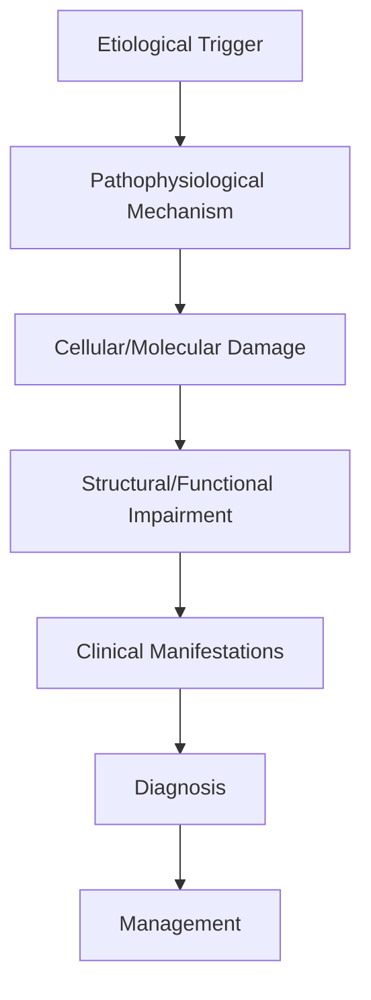

# Non-Convulsive Status Epilepticus

> [!tip] **High-Yield Definition**
> Comprehensive clinical note for Non-Convulsive Status Epilepticus covering definition, epidemiology, aetiology, pathophysiology, clinical features, investigations, differential diagnosis, management, drug interactions, procedures, complications, red flags, prognosis, topic correlation, and special situations for FCPS/MRCP examination preparation based on Davidson 24th Edition Chapter 25: Neurology.

---

## 1. Definition / Epidemiology / Classification

### Definition
Non-Convulsive Status Epilepticus is a neurological disorder within the 14 coma disorders consciousness category. It is characterised by specific clinical, pathological, radiological, and laboratory features that allow differentiation from related conditions.

### Epidemiology
- **Incidence/Prevalence:** Variable depending on the specific condition.
- **Age:** Adult onset is most common, but paediatric and elderly presentations occur.
- **Sex:** Variable depending on the condition.
- **Geography:** Worldwide distribution, with higher prevalence in certain regions.
- **Risk Factors:** Genetic predisposition, environmental factors, comorbidities, family history.

### Classification
| Subtype | Key Features | Prognosis |
|---------|-------------|-----------|
| Mild/early | Subtle symptoms, preserved function | Best |
| Moderate | Clear symptoms, functional impairment | Variable |
| Severe | Significant disability, complications | Worst |

---

## 2. Aetiology / Pathophysiology

### Aetiology
- **Primary (idiopathic):** Most cases have no identifiable cause.
- **Genetic:** May be inherited (AD, AR, X-linked, mitochondrial, sporadic).
- **Autoimmune:** Autoantibodies, immune-mediated inflammation.
- **Infectious:** Viral, bacterial, fungal, parasitic.
- **Metabolic:** Electrolyte, endocrine, hepatic, renal, nutritional.
- **Toxic:** Drugs, alcohol, heavy metals, environmental toxins.
- **Vascular:** Ischaemia, haemorrhage, vasculitis.
- **Neoplastic:** Primary, secondary, paraneoplastic.
- **Traumatic:** Acute, chronic, repetitive.
- **Degenerative:** Neurodegeneration, protein misfolding.

### Pathophysiology


---

## 3. Clinical Features

### History
- **Onset/Duration:** Acute, subacute, or chronic.
- **Progression:** Static, progressive, relapsing-remitting, stepwise.
- **Key symptoms:** Specific to the condition.
- **Triggers:** Stress, infection, trauma, drugs, hormonal, environmental.
- **Systemic symptoms:** Constitutional features.
- **Drug/Family/Social history:** Relevant exposures, comorbidities.

### Examination
| Domain | Key Findings | Localisation Value |
|--------|-------------|-------------------|
| Higher function | Cognitive, behavioural | Cortical, subcortical, limbic |
| Cranial nerves | Pupils, eye movements, facial, bulbar | Brainstem, cranial nerve, NMJ |
| Motor | Weakness, tone, reflexes | UMN, LMN, NMJ, muscle |
| Sensory | All modalities, pattern | Peripheral, spinal, brainstem |
| Coordination | Ataxia, nystagmus, dysmetria | Cerebellar, sensory, vestibular |
| Gait | Spastic, ataxic, parkinsonian | Multiple |
| Autonomic | Orthostatic, sweating, GI, bladder | Autonomic, peripheral, central |

### Specific Clinical Features
The clinical features are determined by the underlying aetiology, location of pathology, and rate of progression. Patients typically present with a constellation of symptoms and signs that allow clinical localisation and subsequent targeted investigation.

---

## 4. Diagnostic Approach / Algorithm

```mermaid
flowchart TD
    A[Clinical Presentation] --> B[Anatomical Localisation]
    B --> C[Pathophysiological Category]
    C --> D[Formulate Differential]
    D --> E[Targeted Investigations]
    E --> F[Confirm Diagnosis]
    F --> G[Assess Severity/Prognosis]
    G --> H[Initiate Management]
    H --> I[Monitor Response]
    I --> J{Response?}
    J --> YES1 [Good - Continue]
    J --> NO1 [Poor - Escalate]
    YES1 --> K[Monitor]
    NO1 --> H
```

---

## 5. Investigations

### First-Line Investigations
- **Blood tests:** FBC, U&Es, LFTs, glucose, calcium, magnesium, ESR, CRP, autoimmune, infection.
- **Imaging:** CT/MRI brain/spine (essential for most neurological conditions).
- **Neurophysiology:** EEG, nerve conduction, EMG, evoked potentials.
- **CSF:** Cell count, protein, glucose, OCBs, PCR, culture.

### Second-Line Investigations
- **Genetic testing:** Gene panels, WES, WGS.
- **Antibody testing:** Antineuronal, autoimmune, paraneoplastic.
- **Biopsy:** Nerve, muscle, brain, skin.
- **Advanced imaging:** PET-CT, MR spectroscopy, fMRI.

### Specialised Investigations
- **Biomarkers:** Neurofilament light chain, tau, beta-amyloid, 14-3-3, RT-QuIC.
- **Autonomic testing:** Head-up tilt, sudomotor, QSART.
- **Neuropsychology:** Cognitive testing, behavioural assessment.
- **Genetic counselling:** Family screening, predictive testing.

---

## 6. Differential Diagnosis

| Differential | Distinguishing Features | Key Test |
|--------------|------------------------|----------|
| Vascular | Sudden onset, focal, vascular risk factors | MRI/CT, vessel imaging |
| Inflammatory | Subacute, multifocal, systemic | MRI, CSF, antibodies |
| Infectious | Fever, systemic, exposure | Bloods, CSF, imaging |
| Neoplastic | Progressive, mass effect | MRI, biopsy |
| Degenerative | Progressive, symmetric, hereditary | MRI, genetic |
| Toxic/Metabolic | Drug history, systemic, reversible | Bloods, toxicology |
| Autoimmune | Multifocal, antibodies, immunotherapy response | Antibodies, MRI, CSF |
| Functional | Inconsistent, distractible | Clinical, video, biomarkers |

---

## 7. Management

### Acute Management
- **Stabilisation:** ABCDE approach, emergency resuscitation.
- **Specific treatment:** Disease-specific interventions.
- **Symptomatic relief:** Pain, seizures, spasticity, autonomic dysfunction.
- **Prevention of complications:** DVT, pressure sores, infection.

### Disease-Modifying Treatment
- **Pharmacological:** First-line, second-line, escalation, maintenance.
- **Procedural:** Surgery, biopsy, drainage, ablation, stimulation.
- **Immunotherapy:** Steroids, IVIG, plasma exchange, immunosuppressants, biologics.
- **Rehabilitation:** Physiotherapy, OT, speech therapy.

### Long-Term Management
- **Monitoring:** Clinical, imaging, biomarkers, side effects.
- **Prevention:** Vaccinations, prophylaxis, lifestyle modification.
- **Supportive care:** Multidisciplinary team, social work, psychological support.
- **Palliative care:** Advanced care planning, end-of-life care, hospice.

---

## 8. Drug Interactions / Contraindications / Comorbidity Cautions

| Drug Class | Interaction / Caution | Management |
|------------|----------------------|------------|
| Antiseizure medications | Enzyme induction, teratogenicity | Monitor, supplement, switch |
| Immunosuppressants | Infection, malignancy, teratogenicity | Monitor, prophylaxis |
| Anticoagulants | Bleeding risk, drug interactions | Monitor INR, avoid combinations |
| Antihypertensives | Hypotension, falls | Monitor BP, adjust dose |
| Antibiotics | Nephrotoxicity, ototoxicity | Monitor renal |
| Antivirals | Nephrotoxicity, neuropsychiatric | Monitor renal, dose adjust |
| Steroids | DM, HTN, osteoporosis, infection | Monitor, prophylaxis, taper |
| Biologics | Infusion reactions, infection | Monitor, prophylaxis |

---

## 9. Procedures

### Common Procedures
- **Lumbar puncture:** Diagnostic, therapeutic (IIH, NPH). Contraindications: raised ICP, mass lesion, coagulopathy.
- **Nerve conduction studies/EMG:** Diagnostic, prognosis. Minor discomfort.
- **EEG:** Diagnostic, monitoring. No significant complications.
- **MRI brain/spine:** Diagnostic, monitoring. Contraindications: pacemaker, metallic implants.
- **CT head:** Emergency, rapid. Radiation exposure, contrast reactions.
- **Biopsy:** Stereotactic, open. Indications: diagnosis, molecular profiling.

---

## 10. Complications

| Complication | Frequency | Prevention | Management |
|--------------|-----------|------------|------------|
| Infection | Common | Hygiene, prophylaxis, vaccination | Antibiotics, antifungals |
| Thrombosis | Common | Prophylaxis, mobility | Anticoagulation |
| Pressure sores | Common | Positioning, nutrition | Wound care, surgery |
| Spasticity | Common | Positioning, stretching | Baclofen, BoNT |
| Contractures | Common | Passive movements, splints | Physiotherapy, surgery |
| Aspiration | Common | Swallow assessment | NGT, PEG, thickeners |
| Falls | Common | Environment, mobility | Walking aids |
| Fractures | Common | Bone health, prevention | Vitamin D, bisphosphonate |
| Depression | Common | Screening, support | Antidepressants, CBT |
| Cognitive decline | Variable | Monitoring, training | Rehabilitation |
| Autonomic dysfunction | Variable | Monitoring, hydration | Midodrine, fludrocortisone |
| Respiratory failure | Variable | Monitoring, supportive | Ventilation, NIV |
| Death | Variable | Monitoring, palliative | End-of-life care |

---

## 11. Red Flags / Emergencies

### Emergency Presentations
- **Rapid neurological deterioration:** New focal deficit, decreased consciousness, seizures.
- **Status epilepticus:** Continuous seizures >5 min.
- **Raised ICP:** Headache, vomiting, papilloedema, altered consciousness.
- **Respiratory failure:** Hypoxia, hypercapnia, ventilatory failure.
- **Cardiac arrest:** Arrhythmia, MI, pulmonary embolism.
- **Infection:** Sepsis, meningitis, abscess, encephalitis.
- **Drug toxicity:** Overdose, side effects, interactions.
- **Haemorrhage:** Intracranial, systemic, coagulopathy.

---

## 12. Prognosis

### Natural History
- **Acute:** May resolve with treatment, may progress, may be fatal.
- **Subacute:** Variable, depends on cause and treatment.
- **Chronic:** Often progressive, may be stable, may have relapses.
- **Recovery:** Variable, may be complete, partial, or none.

### Prognostic Factors
- **Favourable:** Young age, early treatment, mild disease, reversible cause, good premorbid function, family support.
- **Unfavourable:** Older age, delayed treatment, severe disease, irreversible cause, poor premorbid function, comorbidities.

---

## 13. Topic Correlation

| Related Topic | Link | Key Overlap |
|---------------|------|-------------|
| Davidson 24th Ed Chapter 25 | [[Davidson Chapter 25 - Neurology Hierarchy]] | Comprehensive neurology |
| Neurology MOC | [[Neurology MOC]] | All neurology topics |
| Drug Reference | [[../00_Index/Neurology Drug Reference]] | Medications |
| Local Hub | [[../14_Coma_Disorders_Consciousness/Hub]] | Section-specific |
| Clinical Examination | [[../01_Fundamentals_Examination/Neurological History Taking]] | Clinical approach |
| Investigation | [[../01_Fundamentals_Examination/Neuroimaging (CT-MRI) Principles]] | Imaging |

---

## 14. Special Situations

| Situation | Consideration |
|-----------|---------------|
| **Pregnancy** | Pre-conception counselling, teratogenicity, drug safety, monitoring, delivery planning, breastfeeding. |
| **Lactation** | Drug safety, breastfeeding, monitoring, support. |
| **Paediatric** | Developmental considerations, drug dosing, school, family, vaccination, growth, puberty. |
| **Elderly / Frail** | Comorbidities, polypharmacy, falls, bone health, cognition, social, end-of-life. |
| **Renal impairment** | Drug dose adjustment, monitoring, dialysis, transplant. |
| **Hepatic impairment** | Drug dose adjustment, monitoring, transplant. |
| **Immunocompromised** | Infection prophylaxis, vaccination, drug interactions, malignancy screening. |
| **Perioperative** | Drug management, anaesthesia planning, VTE prophylaxis, infection prevention, monitoring. |
| **Driving / DVLA** | Fitness to drive, restrictions, notification, reassessment. |
| **Occupational** | Fitness for work, adaptations, rehabilitation, disability, return to work. |

---

## FCPS/MRCP High-Yield Summary

| Category | Key Points |
|----------|------------|
| **Definition** | Comprehensive definition with key diagnostic criteria |
| **Epidemiology** | Incidence, prevalence, age, sex, geography, risk factors |
| **Aetiology** | Primary causes, secondary causes, genetic, environmental |
| **Pathophysiology** | Mechanism of disease, cellular/molecular basis |
| **Clinical Features** | History, examination, key findings, variants |
| **Diagnosis** | Diagnostic criteria, classification, severity |
| **Investigations** | First-line, second-line, specialised, biomarkers |
| **Differential Diagnosis** | Key differentials, distinguishing features, tests |
| **Management** | Acute, disease-modifying, symptomatic, supportive |
| **Complications** | Common, serious, prevention, management |
| **Prognosis** | Natural history, prognostic factors, outcomes |
| **Viva Pearls** | Key examination points |
| **Drug Doses** | First-line, second-line, emergency |
| **Scoring Systems** | Specific scores used in management |
| **Genetics** | Inheritance, genes, mutations, family screening |
| **Imaging Signs** | Characteristic findings, differential |

---

## Viva Questions (PACES/FCPS Style)

1. **Q:** Define and classify its variants.
   **A:** Comprehensive definition with classification of subtypes based on aetiology, severity, and clinical features.

2. **Q:** What are the key clinical features?
   **A:** Specific symptoms and signs including onset, progression, key features, and associated findings.

3. **Q:** What is the first-line treatment?
   **A:** First-line pharmacological and non-pharmacological management based on current evidence.

4. **Q:** What are the red flags requiring urgent referral?
   **A:** Specific emergency presentations and complications requiring immediate intervention.

5. **Q:** What is the prognosis?
   **A:** Natural history, prognostic factors, and long-term outcomes.

6. **Q:** How do you differentiate from key differentials?
   **A:** Clinical features, investigations, and response to treatment that distinguish from alternative diagnoses.

7. **Q:** What investigations are most useful?
   **A:** First-line and second-line investigations including imaging, neurophysiology, CSF, and biomarkers.

8. **Q:** Describe the stepwise management approach.
   **A:** Stepwise escalation from first-line to second-line to third-line therapy with monitoring.

9. **Q:** What are the emergency presentations?
   **A:** Specific emergency scenarios and immediate management priorities.

10. **Q:** How does management change in pregnancy/paediatrics/elderly?
    **A:** Special considerations for each population including drug safety, monitoring, and support.

---

## Common Confusions / Exam Traps

| Confusion | Clarification |
|-----------|---------------|
| Similar presentation but different cause | Differentiate by history, examination, investigations |
| Treatment response vs natural history | Assess with objective measures, biomarkers |
| Drug interactions | Check each drug, monitor, adjust doses |
| Disease progression vs treatment failure | Monitor response, escalate appropriately |
| Functional vs organic | Inconsistent, distractible, disability greater than impairment |
| Acute vs chronic | Time course, progression, reversibility |
| Primary vs secondary | Underlying cause, contributing factors |
| Side effects vs symptoms | Temporal relationship, dose relationship |

---

## Mnemonics
1. ****NCSE** = Continuous epileptiform activity on EEG >30 min WITHOUT convulsive motor signs**
2. ****SALZBURG CRITERIA** = EEG (epileptiform discharges >25/min) + clinical (epileptic) + response to treatment**
3. ****NCSE = THINK OF IT** in unexplained coma/altered mental state**

---

## Mind Map

```mermaid
mindmap
  root((Non-Convulsive Status Epilepticus (NCSE)))
    Definition
    Epidemiology
    Pathophysiology
    Clinical
    Investigations
    Differential
    Management
    Prognosis
```

---

## Spaced Repetition Trackers

| Review Interval | Date | Score (0-5) | Notes |
|-----------------|------|-------------|-------|
| Day 1 | | | |
| Day 3 | | | |
| Day 7 | | | |
| Day 14 | | | |
| Day 30 | | | |
| Day 90 | | | |

---

## Self-Test Scorecard

| Section | Score /5 | Last Attempt |
|---------|----------|--------------|
| Definition | | | |
| Pathophysiology | | | |
| Clinical | | | |
| Investigations | | | |
| Differential | | | |
| Management Acute | | | |
| Management Long-term | | | |
| Complications | | | |
| Viva | | | |
| MCQs | | | |
| SBAs | | | |

---

## MCQs (10)

1. **Q:** 70-year-old with sudden confusion, no convulsions, GCS fluctuates 8-12. CT head unremarkable. LP normal. Next step?
   **Options:** A. Empirical antibiotics B. Urgent EEG (think NCSE) C. Discharge home D. Repeat CT in 1 month
   **Answer:** B
   **Explanation:** Unexplained altered mental status in elderly = consider NCSE. EEG is essential. ~8-20% of unexplained coma is NCSE.

2. **Q:** Most common type of NCSE in elderly?
   **Options:** A. Focal NCSE (temporal lobe most often) B. Generalized NCSE C. Myoclonic NCSE D. Tonic NCSE
   **Answer:** A
   **Explanation:** Focal NCSE (complex partial status) most common, often temporal lobe. Subtle: aphasia, confusion, automatisms.

3. **Q:** EEG diagnostic of NCSE (Salzburg criteria)?
   **Options:** A. Normal B. Epileptiform discharges (spikes, sharp waves) at >2.5/sec for >10 sec, OR rhythmic activity >0.5/sec with evolution + clinical improvement with treatment C. Slow waves only D. Flat
   **Answer:** B
   **Explanation:** Salzburg criteria: (1) epileptiform discharges >2.5/sec, OR (2) rhythmic activity >0.5/sec + secondary criteria (evolution, response to treatment, clinical correlate). Plus improvement with IV AEDs.

4. **Q:** Most common cause of NCSE in ICU?
   **Options:** A. Idiopathic B. Acute brain injury (stroke, trauma, infection, tumour), metabolic, drug, post-convulsive C. Infection only D. Stroke only
   **Answer:** B
   **Explanation:** NCSE in ICU: post-convulsive, acute brain injury (stroke, trauma, infection, tumour, SAH), metabolic, drugs (cephalosporins, quinolones, ifosfamide), AED withdrawal, autoimmune encephalitis.

5. **Q:** Treatment of NCSE?
   **Options:** A. Reassure B. IV benzodiazepine trial (lorazepam/midazolam); load with phenytoin/levetiracetam/valproate; anaesthetic doses if refractory C. Aspirin only D. Steroids
   **Answer:** B
   **Explanation:** Treat as status epilepticus: IV lorazepam 0.1 mg/kg or midazolam. If response + EEG improvement = NCSE confirmed. Load with phenytoin/levetiracetam/valproate. If refractory, ICU, anaesthetic doses, EEG monitoring.

6. **Q:** The diagnosis of NCSE in coma is supported by all EXCEPT:
   **Options:** A. EEG with epileptiform activity B. Clinical improvement with IV AEDs C. Spontaneous fluctuation alone D. Resolution on EEG after treatment
   **Answer:** C
   **Explanation:** Spontaneous fluctuation alone doesnt diagnose NCSE. Need EEG + clinical correlate + response to treatment.

7. **Q:** Morbidity of untreated NCSE?
   **Options:** A. None B. Significant - neuronal injury, increased mortality, prolonged ICU stay, worse GOS; treatment improves outcome C. Spontaneous recovery D. Same as treated
   **Answer:** B
   **Explanation:** Untreated NCSE causes ongoing neuronal injury, prolonged coma, increased mortality. Even subtle NCSE should be treated aggressively.

8. **Q:** Drugs that can precipitate NCSE?
   **Options:** A. beta-lactams, fluoroquinolones, ifosfamide, tramadol, in renal failure B. Aspirin C. Paracetamol D. Statins
   **Answer:** A
   **Explanation:** Many drugs lower seizure threshold: beta-lactams (especially in renal failure), fluoroquinolones, ifosfamide (esp. in renal failure), tramadol. Always review medication list in NCSE.

9. **Q:** Comorbidities that can cause or worsen NCSE?
   **Options:** A. Hypoglycaemia, hyponatraemia, hypocalcaemia, uraemia, hepatic encephalopathy B. Healthy lifestyle C. Adequate sleep D. Hydration
   **Answer:** A
   **Explanation:** Metabolic precipitants: hypoglycaemia, hyponatraemia, hypocalcaemia, uraemia, hepatic encephalopathy. Always check and correct.

10. **Q:** Role of continuous EEG monitoring in ICU?
    **Options:** A. Useless B. Detect NCSE in unexplained coma, monitor treatment response, detect non-convulsive seizures (5-20% of ICU patients with altered mental status); better than intermittent EEG C. Only for research D. Same as routine EEG
    **Answer:** B
    **Explanation:** cEEG: standard in many ICUs. Detects NCSE in 5-20% of unexplained coma, monitors treatment response. Superior to intermittent EEG.

---

## SBA Questions (10)

1. **Scenario:** 60-year-old post-cardiac arrest, TTM, GCS 5, on sedation. cEEG started.
   **Question:** When to suspect NCSE?
   **Options:** A. Unexplained persistent coma despite stopping sedation; rhythmic patterns on EEG B. Always treat as status C. Reassure D. MRI
   **Answer:** A
   **Explanation:** Post-CA: consider NCSE if persistent coma without obvious cause after sedation held. Note: myoclonic status in post-CA has poor prognosis (vs NCSE - treat).

2. **Scenario:** Patient with chronic epilepsy on phenytoin. Admitted with confusion, GCS 12, no convulsions. Phenytoin level subtherapeutic.
   **Question:** Most likely diagnosis?
   **Options:** A. NCSE due to subtherapeutic phenytoin; EEG to confirm, load with IV AED B. TIA C. Stroke D. Withdraw care
   **Answer:** A
   **Explanation:** Subtherapeutic AED = most common cause of NCSE in known epilepsy. Always check levels.

3. **Scenario:** 75-year-old with new confusion, aphasia, fluctuating consciousness. Stroke? NCSE?
   **Question:** Investigation?
   **Options:** A. MRI brain + urgent EEG (NCSE can mimic stroke) + consider IV AED trial B. Aspirin only C. Reassure D. Discharge
   **Answer:** A
   **Explanation:** Aphasia + confusion can be NCSE or stroke. MRI brain to exclude structural. EEG essential. If EEG epileptiform, trial IV AED.

4. **Scenario:** Patient in NCSE on EEG, given IV lorazepam 4mg. No clinical improvement. Repeat EEG in 30 min: persistent epileptiform discharges.
   **Question:** Next step?
   **Options:** A. Another lorazepam dose, then load with levetiracetam/valproate/phenytoin; if still refractory, ICU + anaesthetic doses + cEEG monitoring B. Stop C. Wait D. Surgery
   **Answer:** A
   **Explanation:** Refractory NCSE: 2nd line AED. If still uncontrolled, ICU, anaesthetic doses. cEEG monitoring.

5. **Scenario:** 25-year-old with autoimmune encephalitis (anti-NMDA), seizures + NCSE + psychiatric features.
   **Question:** Specific considerations?
   **Options:** A. AEDs only B. Early aggressive immunotherapy + AEDs; consider tumour (ovarian teratoma) screening; prolonged course C. Palliation C. Antibiotics D. Watch
   **Answer:** B
   **Explanation:** Autoimmune encephalitis: immunotherapy is key (steroids + IVIG + PLEX first line). Tumour screening. Course often prolonged.

6. **Scenario:** 80-year-old in NCSE, treated with levetiracetam 2g/24h. eGFR 25.
   **Question:** Dose adjustment?
   **Options:** A. Yes, levetiracetam renally excreted, reduce dose B. No C. Double the dose D. Switch to phenytoin automatically
   **Answer:** A
   **Explanation:** Levetiracetam: 100% renally excreted, dose adjust if eGFR <50. eGFR 25 = max 500-1000mg/day.

7. **Scenario:** NCSE patient on midazolam infusion in ICU. Develops hypotension and respiratory depression.
   **Question:** Cause and management?
   **Options:** A. Midazolam/propofol side effects; reduce rate, fluid resus, vasopressors if needed B. Sepsis C. Pneumonia D. Brain death
   **Answer:** A
   **Explanation:** Anaesthetic AEDs: cause hypotension, respiratory depression. Reduce rate, fluid resus, vasopressors.

8. **Scenario:** Patient recovered from NCSE, off anaesthetics, on levetiracetam 1g BD. Discharge.
   **Question:** Approach?
   **Options:** A. Stop all AEDs B. Continue AED minimum 6-12 months; address underlying cause; driving regulations (DVLA: 6 months seizure-free); MDT follow-up C. Driving immediately D. No follow-up
   **Answer:** B
   **Explanation:** Post-NCSE: continue AED minimum 6-12 months. Address cause. Driving: DVLA Group 1 - 6 months off driving if provoked. MDT follow-up.

---

## Tags
**Tags:** #neurology #NCSE #non-convulsive-status-epilepticus #EEG #Salzburg-criteria #altered-mental-state #cEEG #anaesthetic-AEDs #FCPS #MRCP

---

## Local Navigation
**Heading Hub:** [[../Hub]]  
**Chapter Hierarchy:** [[Davidson Chapter 25 - Neurology Hierarchy]]  
**Chapter MOC:** [[Neurology MOC]]  
**Drug Reference:** [[../00_Index/Neurology Drug Reference]]  
