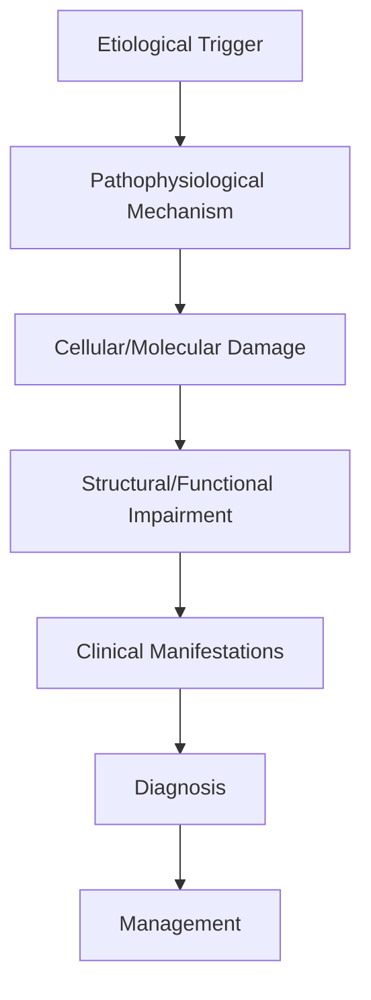
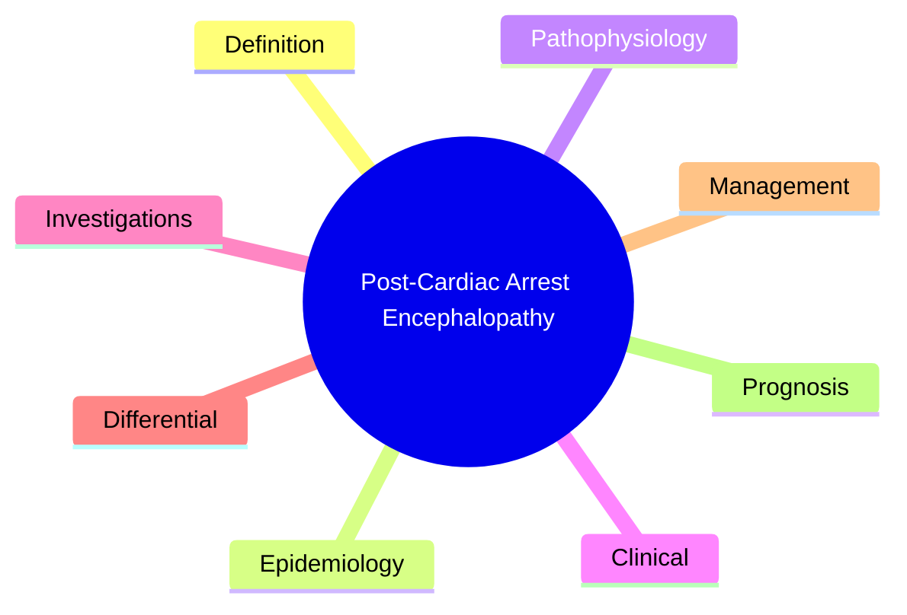

# Post-Cardiac Arrest Encephalopathy

> [!tip] **High-Yield Definition**
> Comprehensive clinical note for Post-Cardiac Arrest Encephalopathy covering definition, epidemiology, aetiology, pathophysiology, clinical features, investigations, differential diagnosis, management, drug interactions, procedures, complications, red flags, prognosis, topic correlation, and special situations for FCPS/MRCP examination preparation based on Davidson 24th Edition Chapter 25: Neurology.

---

## 1. Definition / Epidemiology / Classification

### Definition
Post-Cardiac Arrest Encephalopathy is a neurological disorder within the 14 coma disorders consciousness category. It is characterised by specific clinical, pathological, radiological, and laboratory features that allow differentiation from related conditions.

### Epidemiology
- **Incidence/Prevalence:** Variable depending on the specific condition.
- **Age:** Adult onset is most common, but paediatric and elderly presentations occur.
- **Sex:** Variable depending on the condition.
- **Geography:** Worldwide distribution, with higher prevalence in certain regions.
- **Risk Factors:** Genetic predisposition, environmental factors, comorbidities, family history.

### Classification
| Subtype | Key Features | Prognosis |
|---------|-------------|-----------|
| Mild/early | Subtle symptoms, preserved function | Best |
| Moderate | Clear symptoms, functional impairment | Variable |
| Severe | Significant disability, complications | Worst |

---

## 2. Aetiology / Pathophysiology

### Aetiology
- **Primary (idiopathic):** Most cases have no identifiable cause.
- **Genetic:** May be inherited (AD, AR, X-linked, mitochondrial, sporadic).
- **Autoimmune:** Autoantibodies, immune-mediated inflammation.
- **Infectious:** Viral, bacterial, fungal, parasitic.
- **Metabolic:** Electrolyte, endocrine, hepatic, renal, nutritional.
- **Toxic:** Drugs, alcohol, heavy metals, environmental toxins.
- **Vascular:** Ischaemia, haemorrhage, vasculitis.
- **Neoplastic:** Primary, secondary, paraneoplastic.
- **Traumatic:** Acute, chronic, repetitive.
- **Degenerative:** Neurodegeneration, protein misfolding.

### Pathophysiology


---

## 3. Clinical Features

### History
- **Onset/Duration:** Acute, subacute, or chronic.
- **Progression:** Static, progressive, relapsing-remitting, stepwise.
- **Key symptoms:** Specific to the condition.
- **Triggers:** Stress, infection, trauma, drugs, hormonal, environmental.
- **Systemic symptoms:** Constitutional features.
- **Drug/Family/Social history:** Relevant exposures, comorbidities.

### Examination
| Domain | Key Findings | Localisation Value |
|--------|-------------|-------------------|
| Higher function | Cognitive, behavioural | Cortical, subcortical, limbic |
| Cranial nerves | Pupils, eye movements, facial, bulbar | Brainstem, cranial nerve, NMJ |
| Motor | Weakness, tone, reflexes | UMN, LMN, NMJ, muscle |
| Sensory | All modalities, pattern | Peripheral, spinal, brainstem |
| Coordination | Ataxia, nystagmus, dysmetria | Cerebellar, sensory, vestibular |
| Gait | Spastic, ataxic, parkinsonian | Multiple |
| Autonomic | Orthostatic, sweating, GI, bladder | Autonomic, peripheral, central |

### Specific Clinical Features
The clinical features are determined by the underlying aetiology, location of pathology, and rate of progression. Patients typically present with a constellation of symptoms and signs that allow clinical localisation and subsequent targeted investigation.

---

## 4. Diagnostic Approach / Algorithm

```mermaid
flowchart TD
    A[Clinical Presentation] --> B[Anatomical Localisation]
    B --> C[Pathophysiological Category]
    C --> D[Formulate Differential]
    D --> E[Targeted Investigations]
    E --> F[Confirm Diagnosis]
    F --> G[Assess Severity/Prognosis]
    G --> H[Initiate Management]
    H --> I[Monitor Response]
    I --> J{Response?}
    J --> YES1 [Good - Continue]
    J --> NO1 [Poor - Escalate]
    YES1 --> K[Monitor]
    NO1 --> H
```

---

## 5. Investigations

### First-Line Investigations
- **Blood tests:** FBC, U&Es, LFTs, glucose, calcium, magnesium, ESR, CRP, autoimmune, infection.
- **Imaging:** CT/MRI brain/spine (essential for most neurological conditions).
- **Neurophysiology:** EEG, nerve conduction, EMG, evoked potentials.
- **CSF:** Cell count, protein, glucose, OCBs, PCR, culture.

### Second-Line Investigations
- **Genetic testing:** Gene panels, WES, WGS.
- **Antibody testing:** Antineuronal, autoimmune, paraneoplastic.
- **Biopsy:** Nerve, muscle, brain, skin.
- **Advanced imaging:** PET-CT, MR spectroscopy, fMRI.

### Specialised Investigations
- **Biomarkers:** Neurofilament light chain, tau, beta-amyloid, 14-3-3, RT-QuIC.
- **Autonomic testing:** Head-up tilt, sudomotor, QSART.
- **Neuropsychology:** Cognitive testing, behavioural assessment.
- **Genetic counselling:** Family screening, predictive testing.

---

## 6. Differential Diagnosis

| Differential | Distinguishing Features | Key Test |
|--------------|------------------------|----------|
| Vascular | Sudden onset, focal, vascular risk factors | MRI/CT, vessel imaging |
| Inflammatory | Subacute, multifocal, systemic | MRI, CSF, antibodies |
| Infectious | Fever, systemic, exposure | Bloods, CSF, imaging |
| Neoplastic | Progressive, mass effect | MRI, biopsy |
| Degenerative | Progressive, symmetric, hereditary | MRI, genetic |
| Toxic/Metabolic | Drug history, systemic, reversible | Bloods, toxicology |
| Autoimmune | Multifocal, antibodies, immunotherapy response | Antibodies, MRI, CSF |
| Functional | Inconsistent, distractible | Clinical, video, biomarkers |

---

## 7. Management

### Acute Management
- **Stabilisation:** ABCDE approach, emergency resuscitation.
- **Specific treatment:** Disease-specific interventions.
- **Symptomatic relief:** Pain, seizures, spasticity, autonomic dysfunction.
- **Prevention of complications:** DVT, pressure sores, infection.

### Disease-Modifying Treatment
- **Pharmacological:** First-line, second-line, escalation, maintenance.
- **Procedural:** Surgery, biopsy, drainage, ablation, stimulation.
- **Immunotherapy:** Steroids, IVIG, plasma exchange, immunosuppressants, biologics.
- **Rehabilitation:** Physiotherapy, OT, speech therapy.

### Long-Term Management
- **Monitoring:** Clinical, imaging, biomarkers, side effects.
- **Prevention:** Vaccinations, prophylaxis, lifestyle modification.
- **Supportive care:** Multidisciplinary team, social work, psychological support.
- **Palliative care:** Advanced care planning, end-of-life care, hospice.

---

## 8. Drug Interactions / Contraindications / Comorbidity Cautions

| Drug Class | Interaction / Caution | Management |
|------------|----------------------|------------|
| Antiseizure medications | Enzyme induction, teratogenicity | Monitor, supplement, switch |
| Immunosuppressants | Infection, malignancy, teratogenicity | Monitor, prophylaxis |
| Anticoagulants | Bleeding risk, drug interactions | Monitor INR, avoid combinations |
| Antihypertensives | Hypotension, falls | Monitor BP, adjust dose |
| Antibiotics | Nephrotoxicity, ototoxicity | Monitor renal |
| Antivirals | Nephrotoxicity, neuropsychiatric | Monitor renal, dose adjust |
| Steroids | DM, HTN, osteoporosis, infection | Monitor, prophylaxis, taper |
| Biologics | Infusion reactions, infection | Monitor, prophylaxis |

---

## 9. Procedures

### Common Procedures
- **Lumbar puncture:** Diagnostic, therapeutic (IIH, NPH). Contraindications: raised ICP, mass lesion, coagulopathy.
- **Nerve conduction studies/EMG:** Diagnostic, prognosis. Minor discomfort.
- **EEG:** Diagnostic, monitoring. No significant complications.
- **MRI brain/spine:** Diagnostic, monitoring. Contraindications: pacemaker, metallic implants.
- **CT head:** Emergency, rapid. Radiation exposure, contrast reactions.
- **Biopsy:** Stereotactic, open. Indications: diagnosis, molecular profiling.

---

## 10. Complications

| Complication | Frequency | Prevention | Management |
|--------------|-----------|------------|------------|
| Infection | Common | Hygiene, prophylaxis, vaccination | Antibiotics, antifungals |
| Thrombosis | Common | Prophylaxis, mobility | Anticoagulation |
| Pressure sores | Common | Positioning, nutrition | Wound care, surgery |
| Spasticity | Common | Positioning, stretching | Baclofen, BoNT |
| Contractures | Common | Passive movements, splints | Physiotherapy, surgery |
| Aspiration | Common | Swallow assessment | NGT, PEG, thickeners |
| Falls | Common | Environment, mobility | Walking aids |
| Fractures | Common | Bone health, prevention | Vitamin D, bisphosphonate |
| Depression | Common | Screening, support | Antidepressants, CBT |
| Cognitive decline | Variable | Monitoring, training | Rehabilitation |
| Autonomic dysfunction | Variable | Monitoring, hydration | Midodrine, fludrocortisone |
| Respiratory failure | Variable | Monitoring, supportive | Ventilation, NIV |
| Death | Variable | Monitoring, palliative | End-of-life care |

---

## 11. Red Flags / Emergencies

### Emergency Presentations
- **Rapid neurological deterioration:** New focal deficit, decreased consciousness, seizures.
- **Status epilepticus:** Continuous seizures >5 min.
- **Raised ICP:** Headache, vomiting, papilloedema, altered consciousness.
- **Respiratory failure:** Hypoxia, hypercapnia, ventilatory failure.
- **Cardiac arrest:** Arrhythmia, MI, pulmonary embolism.
- **Infection:** Sepsis, meningitis, abscess, encephalitis.
- **Drug toxicity:** Overdose, side effects, interactions.
- **Haemorrhage:** Intracranial, systemic, coagulopathy.

---

## 12. Prognosis

### Natural History
- **Acute:** May resolve with treatment, may progress, may be fatal.
- **Subacute:** Variable, depends on cause and treatment.
- **Chronic:** Often progressive, may be stable, may have relapses.
- **Recovery:** Variable, may be complete, partial, or none.

### Prognostic Factors
- **Favourable:** Young age, early treatment, mild disease, reversible cause, good premorbid function, family support.
- **Unfavourable:** Older age, delayed treatment, severe disease, irreversible cause, poor premorbid function, comorbidities.

---

## 13. Topic Correlation

| Related Topic | Link | Key Overlap |
|---------------|------|-------------|
| Davidson 24th Ed Chapter 25 | [[Davidson Chapter 25 - Neurology Hierarchy]] | Comprehensive neurology |
| Neurology MOC | [[Neurology MOC]] | All neurology topics |
| Drug Reference | [[../00_Index/Neurology Drug Reference]] | Medications |
| Local Hub | [[../14_Coma_Disorders_Consciousness/Hub]] | Section-specific |
| Clinical Examination | [[../01_Fundamentals_Examination/Neurological History Taking]] | Clinical approach |
| Investigation | [[../01_Fundamentals_Examination/Neuroimaging (CT-MRI) Principles]] | Imaging |

---

## 14. Special Situations

| Situation | Consideration |
|-----------|---------------|
| **Pregnancy** | Pre-conception counselling, teratogenicity, drug safety, monitoring, delivery planning, breastfeeding. |
| **Lactation** | Drug safety, breastfeeding, monitoring, support. |
| **Paediatric** | Developmental considerations, drug dosing, school, family, vaccination, growth, puberty. |
| **Elderly / Frail** | Comorbidities, polypharmacy, falls, bone health, cognition, social, end-of-life. |
| **Renal impairment** | Drug dose adjustment, monitoring, dialysis, transplant. |
| **Hepatic impairment** | Drug dose adjustment, monitoring, transplant. |
| **Immunocompromised** | Infection prophylaxis, vaccination, drug interactions, malignancy screening. |
| **Perioperative** | Drug management, anaesthesia planning, VTE prophylaxis, infection prevention, monitoring. |
| **Driving / DVLA** | Fitness to drive, restrictions, notification, reassessment. |
| **Occupational** | Fitness for work, adaptations, rehabilitation, disability, return to work. |

---

## FCPS/MRCP High-Yield Summary

| Category | Key Points |
|----------|------------|
| **Definition** | Comprehensive definition with key diagnostic criteria |
| **Epidemiology** | Incidence, prevalence, age, sex, geography, risk factors |
| **Aetiology** | Primary causes, secondary causes, genetic, environmental |
| **Pathophysiology** | Mechanism of disease, cellular/molecular basis |
| **Clinical Features** | History, examination, key findings, variants |
| **Diagnosis** | Diagnostic criteria, classification, severity |
| **Investigations** | First-line, second-line, specialised, biomarkers |
| **Differential Diagnosis** | Key differentials, distinguishing features, tests |
| **Management** | Acute, disease-modifying, symptomatic, supportive |
| **Complications** | Common, serious, prevention, management |
| **Prognosis** | Natural history, prognostic factors, outcomes |
| **Viva Pearls** | Key examination points |
| **Drug Doses** | First-line, second-line, emergency |
| **Scoring Systems** | Specific scores used in management |
| **Genetics** | Inheritance, genes, mutations, family screening |
| **Imaging Signs** | Characteristic findings, differential |

---

## Viva Questions (PACES/FCPS Style)

1. **Q:** Define and classify its variants.
   **A:** Comprehensive definition with classification of subtypes based on aetiology, severity, and clinical features.

2. **Q:** What are the key clinical features?
   **A:** Specific symptoms and signs including onset, progression, key features, and associated findings.

3. **Q:** What is the first-line treatment?
   **A:** First-line pharmacological and non-pharmacological management based on current evidence.

4. **Q:** What are the red flags requiring urgent referral?
   **A:** Specific emergency presentations and complications requiring immediate intervention.

5. **Q:** What is the prognosis?
   **A:** Natural history, prognostic factors, and long-term outcomes.

6. **Q:** How do you differentiate from key differentials?
   **A:** Clinical features, investigations, and response to treatment that distinguish from alternative diagnoses.

7. **Q:** What investigations are most useful?
   **A:** First-line and second-line investigations including imaging, neurophysiology, CSF, and biomarkers.

8. **Q:** Describe the stepwise management approach.
   **A:** Stepwise escalation from first-line to second-line to third-line therapy with monitoring.

9. **Q:** What are the emergency presentations?
   **A:** Specific emergency scenarios and immediate management priorities.

10. **Q:** How does management change in pregnancy/paediatrics/elderly?
    **A:** Special considerations for each population including drug safety, monitoring, and support.

---

## Common Confusions / Exam Traps

| Confusion | Clarification |
|-----------|---------------|
| Similar presentation but different cause | Differentiate by history, examination, investigations |
| Treatment response vs natural history | Assess with objective measures, biomarkers |
| Drug interactions | Check each drug, monitor, adjust doses |
| Disease progression vs treatment failure | Monitor response, escalate appropriately |
| Functional vs organic | Inconsistent, distractible, disability greater than impairment |
| Acute vs chronic | Time course, progression, reversibility |
| Primary vs secondary | Underlying cause, contributing factors |
| Side effects vs symptoms | Temporal relationship, dose relationship |

---

## Mnemonics
1. ****TTM TARGET 36C** = TTM-2 trial showed 33 vs 36 no difference**
2. ****MNEMONIC** = Myoclonus bad, N20 preserved good (SSEP)**
3. ****PROGNOSTICATE AT 72H** = Multimodal after rewarming, off sedation, off NMB**

---

## Mind Map



---

## Spaced Repetition Trackers

| Review Interval | Date | Score (0-5) | Notes |
|-----------------|------|-------------|-------|
| Day 1 | | | |
| Day 3 | | | |
| Day 7 | | | |
| Day 14 | | | |
| Day 30 | | | |
| Day 90 | | | |

---

## Self-Test Scorecard

| Section | Score /5 | Last Attempt |
|---------|----------|--------------|
| Definition | | | |
| Pathophysiology | | | |
| Clinical | | | |
| Investigations | | | |
| Differential | | | |
| Management Acute | | | |
| Management Long-term | | | |
| Complications | | | |
| Viva | | | |
| MCQs | | | |
| SBAs | | | |

---

## MCQs (10)

1. **Q:** Most reliable early (< 72h) predictor of poor neurological outcome post-cardiac arrest?
   **Options:** A. Bilateral absent N20 SSEP B. Pupillary reflex absent at 72h C. Status myoclonus D. All of the above
   **Answer:** D
   **Explanation:** All are reliable poor outcome predictors. Multimodal prognostication: absent pupillary/corneal reflexes at >=72h, absent N20 SSEP bilaterally, status myoclonus, high NSE, unfavourable MRI/CT.

2. **Q:** Current TTM target after cardiac arrest?
   **Options:** A. 32C B. 33C C. 36C (TTM-2) D. 38C
   **Answer:** C
   **Explanation:** TTM-2 trial (2021): 33C vs 36C, no significant difference. Current guidelines: TTM at 32-36C for 24h, then gradual rewarming. Some centres use 36C normothermia. Active fever prevention critical.

3. **Q:** When should prognostication be performed after cardiac arrest with TTM?
   **Options:** A. 24h B. 48h C. >=72h after ROSC; consider delaying further if confounders present D. 1 week
   **Answer:** C
   **Explanation:** Prognostication after 72h from ROSC. Further delay if residual sedation, metabolic derangement, organ failure. Use multimodal: clinical + SSEP + EEG + MRI + NSE biomarkers.

4. **Q:** Continuous EEG showing generalised periodic discharges at 1Hz with burst suppression indicates:
   **Options:** A. Good prognosis B. Malignant pattern (highly specific for poor outcome) C. Drug effect D. Status
   **Answer:** B
   **Explanation:** Malignant EEG patterns post-CA: generalised periodic discharges (GPDs) at <2Hz, burst suppression with GPDs. Highly specific for poor outcome.

5. **Q:** Status myoclonus (early, generalised, lasting >30 min) post-CA is associated with:
   **Options:** A. Good recovery B. Poor outcome (>90% mortality or severe disability) C. Lance-Adams syndrome D. Survival
   **Answer:** B
   **Explanation:** Early, generalised, sustained status myoclonus post-CA = poor outcome (>90% mortality or vegetative). Different from Lance-Adams syndrome (post-hypoxic myoclonus in survivors, chronic).

6. **Q:** Role of SSEP in post-CA prognostication?
   **Options:** A. Limited - absent N20 bilaterally is highly specific for poor outcome B. No role C. Only in conscious patients D. Always normal
   **Answer:** A
   **Explanation:** SSEP: median nerve stimulation. Absent N20 (cortical) bilaterally = highly specific (>95%) for poor outcome. NOT affected by sedation, hypothermia.

7. **Q:** NSE cut-off for poor outcome post-CA?
   **Options:** A. >10 ug/L B. >33 ug/L at 48-72h (some use >60) C. >5 ug/L D. No cut-off
   **Answer:** B
   **Explanation:** NSE: neuronal damage marker. Cut-off >33 ug/L at 48-72h (some guidelines >60 ug/L) suggests poor outcome. Trend more useful.

8. **Q:** Best imaging modality for post-CA prognostication?
   **Options:** A. CT head B. MRI brain (DWI, FLAIR) at day 3-7 C. X-ray D. EEG
   **Answer:** B
   **Explanation:** MRI brain DWI/FLAIR at day 3-7: extensive cortical + basal ganglia restricted diffusion = poor outcome. ADC values help.

9. **Q:** What percentage of post-CA patients surviving ICU admission awaken?
   **Options:** A. 30% B. 50-60% C. 80% D. 95%
   **Answer:** B
   **Explanation:** 50-60% of post-CA patients who survive to ICU discharge ultimately awaken. Of those, some have varying degrees of cognitive impairment.

10. **Q:** What is 'targeted temperature management' (TTM)?
    **Options:** A. Therapeutic hypothermia only (32-34C) B. Active temperature control (32-36C) for 24h post-CA, then gradual rewarming; prevents hyperthermia, reduces cerebral metabolic demand C. Cooling blanket only D. 24h cold saline
    **Answer:** B
    **Explanation:** TTM: active temperature control 32-36C for 24h post-CA. Methods: surface cooling, endovascular catheters. Maintain for 24h, then controlled rewarming.

---

## SBA Questions (10)

1. **Scenario:** 50-year-old VF arrest, ROSC at 25 min. On TTM 36C. Day 3: pupils reactive, corneal reflexes present, cough reflex present, off sedation. GCS 7. MRI day 3: cortical DWI hyperintensity, basal ganglia involvement.
   **Question:** Prognosis?
   **Options:** A. Good B. Poor - extensive DWI changes + low GCS = likely poor outcome; full multimodal prognostication at day 5-7 C. Full recovery D. Indeterminate only
   **Answer:** B
   **Explanation:** Extensive DWI changes involving cortex + deep grey matter = poor outcome predictor. With low GCS at day 3, multimodal assessment (SSEP N20, EEG, NSE, MRI ADC) needed before WLST.

2. **Scenario:** Day 5 post-CA, off sedation, TTM complete. GCS 4, absent pupillary reflexes, no corneal, status myoclonus. SSEP: absent N20 bilaterally.
   **Question:** Action?
   **Options:** A. Continue B. Very poor prognosis - all four major predictors present; sensitive family discussion about withdrawal of life-sustaining treatment; consider organ donation C. Wait 2 weeks D. Steroids
   **Answer:** B
   **Explanation:** Quadruple poor prognosis: absent pupillary + absent corneal + status myoclonus + absent N20. All highly specific. Most clinicians would discuss WLST.

3. **Scenario:** Day 4 post-CA, EEG shows burst suppression with generalised periodic discharges (GPDs) at 1Hz, no clinical correlate.
   **Question:** Implication?
   **Options:** A. Reassure B. Malignant EEG pattern - high specificity for poor outcome; combine with clinical exam, SSEP, MRI C. Sedation effect only D. Treat as status
   **Answer:** B
   **Explanation:** Burst suppression with GPDs = malignant pattern. Specific for poor outcome when seen post-CA. Combine with other predictors.

4. **Scenario:** 60-year-old post-CA day 5, GCS 9, eyes open to pain, no command following. Pupils 3mm reactive, corneal present, no myoclonus. MRI DWI day 4: limited cortical changes.
   **Question:** Next step?
   **Options:** A. Withdraw care B. Continue supportive care, repeat exam at day 7-10, full multimodal assessment; favourable signs (reactive pupils, intact brainstem) suggest possible recovery C. Stop now D. MRI again
   **Answer:** B
   **Explanation:** Day 5 GCS 9 with reactive pupils, intact brainstem, no myoclonus, limited DWI changes = possible recovery. Reassess at day 7-10 (delayed awakening common).

5. **Scenario:** 60-year-old post-CA day 14, awakening. Develops myoclonus on action (reaching, walking).
   **Question:** Diagnosis and treatment?
   **Options:** A. Status myoclonus (poor prognosis) B. Lance-Adams syndrome; valproate, clonazepam, levetiracetam, piracetam; usually chronic but treatable C. Seizures - load with AED D. Tics
   **Answer:** B
   **Explanation:** Lance-Adams syndrome: chronic post-hypoxic myoclonus, often action-induced. Different from acute status myoclonus. Treatment: valproate, clonazepam, levetiracetam, piracetam.

6. **Scenario:** Post-CA, TTM complete, day 6. Family asks about organ donation. Brain death not declared.
   **Question:** Approach?
   **Options:** A. Reject B. DCD possible if WLST planned; SN-OD approach; honour patient wishes; pathways in UK/Netherlands/US C. No options D. Mandatory
   **Answer:** B
   **Explanation:** DCD (Maastricht III) - organ donation after planned withdrawal of life-sustaining treatment. Family wishes, ethical approval.

7. **Scenario:** Day 5 post-CA. NSE result: 80 ug/L (cut-off >33 for poor outcome).
   **Question:** Interpretation?
   **Options:** A. Confirms poor prognosis B. Suggests poor outcome; combine with clinical exam, SSEP, EEG, MRI; one test insufficient for WLST C. Normal D. Useless
   **Answer:** B
   **Explanation:** NSE >33 ug/L at 48-72h suggests poor outcome. Combine with other tests - never single test for WLST.

8. **Scenario:** 50-year-old post-VF arrest, day 7, GCS 12, agitated, confused, no focal signs. Family concerned.
    **Question:** Management?
    **Options:** A. Sedation B. Rule out confounders (hypoxia, hypercapnia, sepsis, metabolic, drug, NCSE), calm environment, 1:1 nursing, low-dose antipsychotic if severe C. Reassure only D. Restraints
    **Answer:** B
    **Explanation:** Post-CA agitation: common. Rule out treatable causes. Calm environment, 1:1 nursing, family presence. Low-dose antipsychotic if needed.

---

## Tags
**Tags:** #neurology #cardiac-arrest #post-CA #TTM #targeted-temperature-management #prognostication #NSE #SSEP #EEG #Lance-Adams #FCPS #MRCP

---

## Local Navigation
**Heading Hub:** [[../Hub]]  
**Chapter Hierarchy:** [[Davidson Chapter 25 - Neurology Hierarchy]]  
**Chapter MOC:** [[Neurology MOC]]  
**Drug Reference:** [[../00_Index/Neurology Drug Reference]]

## PasTest Scenario SBAs (Clinical Vignettes)

> **Auto-generated PasTest/Mediscope-style scenario SBAs** grounded in the authored source. Each scenario tests a real clinical fact (triad, specific sign, contraindication, trial, first-line Rx) extracted from the topic. *Source: Ch 27: Neurology & Stroke — Post-Cardiac Arrest Encephalopathy*

**Q1.** Which of the following features is most specific or characteristic of Post-Cardiac Arrest Encephalopathy?

  - **A.** Key symptoms:
  - **B.** A feature common to many acute inflammatory conditions
  - **C.** A non-specific sign that does not localise the diagnosis
  - **D.** An investigation finding rather than a clinical feature

  > **Answer: A** — Key symptoms:
  >
  > *Source:* - **Key symptoms:** Specific to the condition

**Q2.** Which landmark clinical trial provided evidence relevant to the management of Post-Cardiac Arrest Encephalopathy (specifically: 33 vs 36 no difference**
2)?

  - **A.** TTM-2 trial
  - **B.** A different but related trial in the same area
  - **C.** A guideline (not a trial) addressing the same question
  - **D.** An observational/cohort study addressing similar outcomes

  > **Answer: A** — TTM-2 trial
  >
  > *Source:* ****TTM TARGET 36C** = TTM-2 trial showed 33 vs 36 no difference**
2

**Q3.** What is the most appropriate first-line therapy for Post-Cardiac Arrest Encephalopathy?

  - **A.** Rehabilitation:
  - **B.** An advanced/surgical therapy reserved for refractory disease
  - **C.** Symptomatic treatment only, no disease-modifying therapy
  - **D.** Empiric broad-spectrum therapy without specific indication

  > **Answer: A** — Rehabilitation:
  >
  > *Source:* **Rehabilitation:** Physiotherapy, OT, speech therapy.

