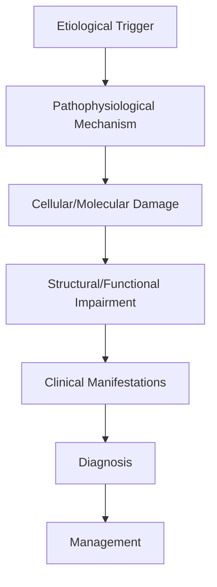
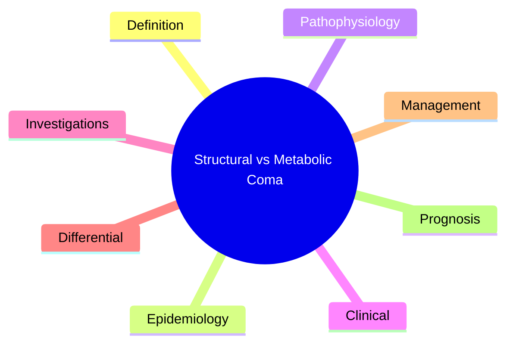

# Structural vs Metabolic Coma

> [!tip] **High-Yield Definition**
> Comprehensive clinical note for Structural vs Metabolic Coma covering definition, epidemiology, aetiology, pathophysiology, clinical features, investigations, differential diagnosis, management, drug interactions, procedures, complications, red flags, prognosis, topic correlation, and special situations for FCPS/MRCP examination preparation based on Davidson 24th Edition Chapter 25: Neurology.

---

## 1. Definition / Epidemiology / Classification

### Definition
Structural vs Metabolic Coma is a neurological disorder within the 14 coma disorders consciousness category. It is characterised by specific clinical, pathological, radiological, and laboratory features that allow differentiation from related conditions.

### Epidemiology
- **Incidence/Prevalence:** Variable depending on the specific condition.
- **Age:** Adult onset is most common, but paediatric and elderly presentations occur.
- **Sex:** Variable depending on the condition.
- **Geography:** Worldwide distribution, with higher prevalence in certain regions.
- **Risk Factors:** Genetic predisposition, environmental factors, comorbidities, family history.

### Classification
| Subtype | Key Features | Prognosis |
|---------|-------------|-----------|
| Mild/early | Subtle symptoms, preserved function | Best |
| Moderate | Clear symptoms, functional impairment | Variable |
| Severe | Significant disability, complications | Worst |

---

## 2. Aetiology / Pathophysiology

### Aetiology
- **Primary (idiopathic):** Most cases have no identifiable cause.
- **Genetic:** May be inherited (AD, AR, X-linked, mitochondrial, sporadic).
- **Autoimmune:** Autoantibodies, immune-mediated inflammation.
- **Infectious:** Viral, bacterial, fungal, parasitic.
- **Metabolic:** Electrolyte, endocrine, hepatic, renal, nutritional.
- **Toxic:** Drugs, alcohol, heavy metals, environmental toxins.
- **Vascular:** Ischaemia, haemorrhage, vasculitis.
- **Neoplastic:** Primary, secondary, paraneoplastic.
- **Traumatic:** Acute, chronic, repetitive.
- **Degenerative:** Neurodegeneration, protein misfolding.

### Pathophysiology


---

## 3. Clinical Features

### History
- **Onset/Duration:** Acute, subacute, or chronic.
- **Progression:** Static, progressive, relapsing-remitting, stepwise.
- **Key symptoms:** Specific to the condition.
- **Triggers:** Stress, infection, trauma, drugs, hormonal, environmental.
- **Systemic symptoms:** Constitutional features.
- **Drug/Family/Social history:** Relevant exposures, comorbidities.

### Examination
| Domain | Key Findings | Localisation Value |
|--------|-------------|-------------------|
| Higher function | Cognitive, behavioural | Cortical, subcortical, limbic |
| Cranial nerves | Pupils, eye movements, facial, bulbar | Brainstem, cranial nerve, NMJ |
| Motor | Weakness, tone, reflexes | UMN, LMN, NMJ, muscle |
| Sensory | All modalities, pattern | Peripheral, spinal, brainstem |
| Coordination | Ataxia, nystagmus, dysmetria | Cerebellar, sensory, vestibular |
| Gait | Spastic, ataxic, parkinsonian | Multiple |
| Autonomic | Orthostatic, sweating, GI, bladder | Autonomic, peripheral, central |

### Specific Clinical Features
The clinical features are determined by the underlying aetiology, location of pathology, and rate of progression. Patients typically present with a constellation of symptoms and signs that allow clinical localisation and subsequent targeted investigation.

---

## 4. Diagnostic Approach / Algorithm

```mermaid
flowchart TD
    A[Clinical Presentation] --> B[Anatomical Localisation]
    B --> C[Pathophysiological Category]
    C --> D[Formulate Differential]
    D --> E[Targeted Investigations]
    E --> F[Confirm Diagnosis]
    F --> G[Assess Severity/Prognosis]
    G --> H[Initiate Management]
    H --> I[Monitor Response]
    I --> J{Response?}
    J --> YES1 [Good - Continue]
    J --> NO1 [Poor - Escalate]
    YES1 --> K[Monitor]
    NO1 --> H
```

---

## 5. Investigations

### First-Line Investigations
- **Blood tests:** FBC, U&Es, LFTs, glucose, calcium, magnesium, ESR, CRP, autoimmune, infection.
- **Imaging:** CT/MRI brain/spine (essential for most neurological conditions).
- **Neurophysiology:** EEG, nerve conduction, EMG, evoked potentials.
- **CSF:** Cell count, protein, glucose, OCBs, PCR, culture.

### Second-Line Investigations
- **Genetic testing:** Gene panels, WES, WGS.
- **Antibody testing:** Antineuronal, autoimmune, paraneoplastic.
- **Biopsy:** Nerve, muscle, brain, skin.
- **Advanced imaging:** PET-CT, MR spectroscopy, fMRI.

### Specialised Investigations
- **Biomarkers:** Neurofilament light chain, tau, beta-amyloid, 14-3-3, RT-QuIC.
- **Autonomic testing:** Head-up tilt, sudomotor, QSART.
- **Neuropsychology:** Cognitive testing, behavioural assessment.
- **Genetic counselling:** Family screening, predictive testing.

---

## 6. Differential Diagnosis

| Differential | Distinguishing Features | Key Test |
|--------------|------------------------|----------|
| Vascular | Sudden onset, focal, vascular risk factors | MRI/CT, vessel imaging |
| Inflammatory | Subacute, multifocal, systemic | MRI, CSF, antibodies |
| Infectious | Fever, systemic, exposure | Bloods, CSF, imaging |
| Neoplastic | Progressive, mass effect | MRI, biopsy |
| Degenerative | Progressive, symmetric, hereditary | MRI, genetic |
| Toxic/Metabolic | Drug history, systemic, reversible | Bloods, toxicology |
| Autoimmune | Multifocal, antibodies, immunotherapy response | Antibodies, MRI, CSF |
| Functional | Inconsistent, distractible | Clinical, video, biomarkers |

---

## 7. Management

### Acute Management
- **Stabilisation:** ABCDE approach, emergency resuscitation.
- **Specific treatment:** Disease-specific interventions.
- **Symptomatic relief:** Pain, seizures, spasticity, autonomic dysfunction.
- **Prevention of complications:** DVT, pressure sores, infection.

### Disease-Modifying Treatment
- **Pharmacological:** First-line, second-line, escalation, maintenance.
- **Procedural:** Surgery, biopsy, drainage, ablation, stimulation.
- **Immunotherapy:** Steroids, IVIG, plasma exchange, immunosuppressants, biologics.
- **Rehabilitation:** Physiotherapy, OT, speech therapy.

### Long-Term Management
- **Monitoring:** Clinical, imaging, biomarkers, side effects.
- **Prevention:** Vaccinations, prophylaxis, lifestyle modification.
- **Supportive care:** Multidisciplinary team, social work, psychological support.
- **Palliative care:** Advanced care planning, end-of-life care, hospice.

---

## 8. Drug Interactions / Contraindications / Comorbidity Cautions

| Drug Class | Interaction / Caution | Management |
|------------|----------------------|------------|
| Antiseizure medications | Enzyme induction, teratogenicity | Monitor, supplement, switch |
| Immunosuppressants | Infection, malignancy, teratogenicity | Monitor, prophylaxis |
| Anticoagulants | Bleeding risk, drug interactions | Monitor INR, avoid combinations |
| Antihypertensives | Hypotension, falls | Monitor BP, adjust dose |
| Antibiotics | Nephrotoxicity, ototoxicity | Monitor renal |
| Antivirals | Nephrotoxicity, neuropsychiatric | Monitor renal, dose adjust |
| Steroids | DM, HTN, osteoporosis, infection | Monitor, prophylaxis, taper |
| Biologics | Infusion reactions, infection | Monitor, prophylaxis |

---

## 9. Procedures

### Common Procedures
- **Lumbar puncture:** Diagnostic, therapeutic (IIH, NPH). Contraindications: raised ICP, mass lesion, coagulopathy.
- **Nerve conduction studies/EMG:** Diagnostic, prognosis. Minor discomfort.
- **EEG:** Diagnostic, monitoring. No significant complications.
- **MRI brain/spine:** Diagnostic, monitoring. Contraindications: pacemaker, metallic implants.
- **CT head:** Emergency, rapid. Radiation exposure, contrast reactions.
- **Biopsy:** Stereotactic, open. Indications: diagnosis, molecular profiling.

---

## 10. Complications

| Complication | Frequency | Prevention | Management |
|--------------|-----------|------------|------------|
| Infection | Common | Hygiene, prophylaxis, vaccination | Antibiotics, antifungals |
| Thrombosis | Common | Prophylaxis, mobility | Anticoagulation |
| Pressure sores | Common | Positioning, nutrition | Wound care, surgery |
| Spasticity | Common | Positioning, stretching | Baclofen, BoNT |
| Contractures | Common | Passive movements, splints | Physiotherapy, surgery |
| Aspiration | Common | Swallow assessment | NGT, PEG, thickeners |
| Falls | Common | Environment, mobility | Walking aids |
| Fractures | Common | Bone health, prevention | Vitamin D, bisphosphonate |
| Depression | Common | Screening, support | Antidepressants, CBT |
| Cognitive decline | Variable | Monitoring, training | Rehabilitation |
| Autonomic dysfunction | Variable | Monitoring, hydration | Midodrine, fludrocortisone |
| Respiratory failure | Variable | Monitoring, supportive | Ventilation, NIV |
| Death | Variable | Monitoring, palliative | End-of-life care |

---

## 11. Red Flags / Emergencies

### Emergency Presentations
- **Rapid neurological deterioration:** New focal deficit, decreased consciousness, seizures.
- **Status epilepticus:** Continuous seizures >5 min.
- **Raised ICP:** Headache, vomiting, papilloedema, altered consciousness.
- **Respiratory failure:** Hypoxia, hypercapnia, ventilatory failure.
- **Cardiac arrest:** Arrhythmia, MI, pulmonary embolism.
- **Infection:** Sepsis, meningitis, abscess, encephalitis.
- **Drug toxicity:** Overdose, side effects, interactions.
- **Haemorrhage:** Intracranial, systemic, coagulopathy.

---

## 12. Prognosis

### Natural History
- **Acute:** May resolve with treatment, may progress, may be fatal.
- **Subacute:** Variable, depends on cause and treatment.
- **Chronic:** Often progressive, may be stable, may have relapses.
- **Recovery:** Variable, may be complete, partial, or none.

### Prognostic Factors
- **Favourable:** Young age, early treatment, mild disease, reversible cause, good premorbid function, family support.
- **Unfavourable:** Older age, delayed treatment, severe disease, irreversible cause, poor premorbid function, comorbidities.

---

## 13. Topic Correlation

| Related Topic | Link | Key Overlap |
|---------------|------|-------------|
| Davidson 24th Ed Chapter 25 | [[Davidson Chapter 25 - Neurology Hierarchy]] | Comprehensive neurology |
| Neurology MOC | [[Neurology MOC]] | All neurology topics |
| Drug Reference | [[../00_Index/Neurology Drug Reference]] | Medications |
| Local Hub | [[../14_Coma_Disorders_Consciousness/Hub]] | Section-specific |
| Clinical Examination | [[../01_Fundamentals_Examination/Neurological History Taking]] | Clinical approach |
| Investigation | [[../01_Fundamentals_Examination/Neuroimaging (CT-MRI) Principles]] | Imaging |

---

## 14. Special Situations

| Situation | Consideration |
|-----------|---------------|
| **Pregnancy** | Pre-conception counselling, teratogenicity, drug safety, monitoring, delivery planning, breastfeeding. |
| **Lactation** | Drug safety, breastfeeding, monitoring, support. |
| **Paediatric** | Developmental considerations, drug dosing, school, family, vaccination, growth, puberty. |
| **Elderly / Frail** | Comorbidities, polypharmacy, falls, bone health, cognition, social, end-of-life. |
| **Renal impairment** | Drug dose adjustment, monitoring, dialysis, transplant. |
| **Hepatic impairment** | Drug dose adjustment, monitoring, transplant. |
| **Immunocompromised** | Infection prophylaxis, vaccination, drug interactions, malignancy screening. |
| **Perioperative** | Drug management, anaesthesia planning, VTE prophylaxis, infection prevention, monitoring. |
| **Driving / DVLA** | Fitness to drive, restrictions, notification, reassessment. |
| **Occupational** | Fitness for work, adaptations, rehabilitation, disability, return to work. |

---

## FCPS/MRCP High-Yield Summary

| Category | Key Points |
|----------|------------|
| **Definition** | Comprehensive definition with key diagnostic criteria |
| **Epidemiology** | Incidence, prevalence, age, sex, geography, risk factors |
| **Aetiology** | Primary causes, secondary causes, genetic, environmental |
| **Pathophysiology** | Mechanism of disease, cellular/molecular basis |
| **Clinical Features** | History, examination, key findings, variants |
| **Diagnosis** | Diagnostic criteria, classification, severity |
| **Investigations** | First-line, second-line, specialised, biomarkers |
| **Differential Diagnosis** | Key differentials, distinguishing features, tests |
| **Management** | Acute, disease-modifying, symptomatic, supportive |
| **Complications** | Common, serious, prevention, management |
| **Prognosis** | Natural history, prognostic factors, outcomes |
| **Viva Pearls** | Key examination points |
| **Drug Doses** | First-line, second-line, emergency |
| **Scoring Systems** | Specific scores used in management |
| **Genetics** | Inheritance, genes, mutations, family screening |
| **Imaging Signs** | Characteristic findings, differential |

---

## Viva Questions (PACES/FCPS Style)

1. **Q:** Define and classify its variants.
   **A:** Comprehensive definition with classification of subtypes based on aetiology, severity, and clinical features.

2. **Q:** What are the key clinical features?
   **A:** Specific symptoms and signs including onset, progression, key features, and associated findings.

3. **Q:** What is the first-line treatment?
   **A:** First-line pharmacological and non-pharmacological management based on current evidence.

4. **Q:** What are the red flags requiring urgent referral?
   **A:** Specific emergency presentations and complications requiring immediate intervention.

5. **Q:** What is the prognosis?
   **A:** Natural history, prognostic factors, and long-term outcomes.

6. **Q:** How do you differentiate from key differentials?
   **A:** Clinical features, investigations, and response to treatment that distinguish from alternative diagnoses.

7. **Q:** What investigations are most useful?
   **A:** First-line and second-line investigations including imaging, neurophysiology, CSF, and biomarkers.

8. **Q:** Describe the stepwise management approach.
   **A:** Stepwise escalation from first-line to second-line to third-line therapy with monitoring.

9. **Q:** What are the emergency presentations?
   **A:** Specific emergency scenarios and immediate management priorities.

10. **Q:** How does management change in pregnancy/paediatrics/elderly?
    **A:** Special considerations for each population including drug safety, monitoring, and support.

---

## Common Confusions / Exam Traps

| Confusion | Clarification |
|-----------|---------------|
| Similar presentation but different cause | Differentiate by history, examination, investigations |
| Treatment response vs natural history | Assess with objective measures, biomarkers |
| Drug interactions | Check each drug, monitor, adjust doses |
| Disease progression vs treatment failure | Monitor response, escalate appropriately |
| Functional vs organic | Inconsistent, distractible, disability greater than impairment |
| Acute vs chronic | Time course, progression, reversibility |
| Primary vs secondary | Underlying cause, contributing factors |
| Side effects vs symptoms | Temporal relationship, dose relationship |

---

## Mnemonics
1. ****METABOLIC = BILATERAL** = Bilateral, reactive pupils, hyperventilation, asterixis**
2. ****STRUCTURAL = FOCAL** = Focal signs, asymmetric, often progressive**
3. ****COMA WORKUP** = CT, glucose, electrolytes, blood gas, toxicology, ECG**

---

## Mind Map



---

## Spaced Repetition Trackers

| Review Interval | Date | Score (0-5) | Notes |
|-----------------|------|-------------|-------|
| Day 1 | | | |
| Day 3 | | | |
| Day 7 | | | |
| Day 14 | | | |
| Day 30 | | | |
| Day 90 | | | |

---

## Self-Test Scorecard

| Section | Score /5 | Last Attempt |
|---------|----------|--------------|
| Definition | | | |
| Pathophysiology | | | |
| Clinical | | | |
| Investigations | | | |
| Differential | | | |
| Management Acute | | | |
| Management Long-term | | | |
| Complications | | | |
| Viva | | | |
| MCQs | | | |
| SBAs | | | |

---

## MCQs (10)

1. **Q:** Comatose patient. Pupils 3mm reactive, bilateral Babinski, generalised seizures. Most likely cause?
   **Options:** A. Structural (mass lesion) B. Metabolic/toxic C. Brainstem stroke D. Trauma
   **Answer:** B
   **Explanation:** Metabolic coma: pupils usually reactive, bilateral, symmetric, often with asterixis/myoclonus/seizures. Structural: usually focal signs, asymmetric.

2. **Q:** Comatose patient has 6mm unreactive right pupil and contralateral (left) hemiparesis. Most likely diagnosis?
   **Options:** A. Uncal herniation from right-sided mass B. Metabolic coma C. Pontine stroke D. Toxic
   **Answer:** A
   **Explanation:** Uncal herniation: medial temporal lobe (uncus) compresses ipsilateral CN III (dilated pupil) and contralateral cerebral peduncle (hemiparesis) OR ipsilateral (Kernohan's notch). Emergency: mannitol/hypertonic saline, urgent neurosurgery.

3. **Q:** Which metabolic cause produces pinpoint (1-2mm) reactive pupils?
   **Options:** A. Opioids (also pontine stroke) B. Hypoglycaemia C. Uraemia D. Hyperglycaemia
   **Answer:** A
   **Explanation:** Pinpoint pupils: opioids (pupils reactive to magnified light), pontine stroke (reactive but hard to see). Naloxone trial for opioid toxicity.

4. **Q:** Which pupillary pattern suggests atropine-like (anticholinergic) poisoning?
   **Options:** A. 8mm unreactive B. Pinpoint C. Mid-size reactive D. Small reactive
   **Answer:** A
   **Explanation:** Anticholinergic: dilated (mydriatic) pupils, dry skin, tachycardia, hyperthermia, confusion, urinary retention.

5. **Q:** Cheyne-Stokes respiration in coma is most often due to:
   **Options:** A. Bilateral hemispheric or diencephalic dysfunction B. Brainstem (medullary) lesion C. Midbrain lesion D. Cerebellar lesion
   **Answer:** A
   **Explanation:** Cheyne-Stokes: crescendo-decrescendo breathing, apnoeic pauses. Bilateral hemispheric or diencephalic dysfunction (deep).

6. **Q:** Apneustic breathing (long inspiratory pauses) localises to:
   **Options:** A. Midbrain (upper pontine) lesion B. Medulla C. Cerebellum D. Cortex
   **Answer:** A
   **Explanation:** Apneustic: prolonged inspiration, pause. Midbrain/upper pontine lesion.

7. **Q:** Central neurogenic hyperventilation localises to:
   **Options:** A. Midbrain/upper pons B. Medulla C. Cortex D. Cerebellum
   **Answer:** A
   **Explanation:** Central neurogenic hyperventilation: sustained deep breathing. Midbrain/upper pontine tegmentum.

8. **Q:** Best initial investigation in unexplained coma?
   **Options:** A. CT head (non-contrast) + capillary glucose + toxicology + electrolytes + blood gas + ECG B. LP first C. MRI first D. EEG only
   **Answer:** A
   **Explanation:** 'COMA' workup: CT head, capillary glucose, toxicology, electrolytes, liver function, ammonia, blood gas, ECG, ABG, septic screen.

9. **Q:** Mixed metabolic and structural coma can be challenging. How to differentiate?
   **Options:** A. Imaging + careful exam + response to treatment B. Always structural C. Always metabolic D. Trial of treatment
   **Answer:** A
   **Explanation:** Combination common. Treat metabolic first if correctable. Imaging critical. Exam: focal signs, asymmetry = structural.

10. **Q:** Role of lumbar puncture in coma?
    **Options:** A. Always first B. Only after CT excludes mass effect; useful for meningitis/encephalitis, SAH (if CT negative, xanthochromia), inflammatory, neoplastic C. Never D. Only if focal
    **Answer:** B
    **Explanation:** LP in coma: only after CT excludes mass effect. Indicated for: suspected meningitis/encephalitis, SAH (CT negative, xanthochromia), inflammatory, neoplastic, GBS.

---

## SBA Questions (10)

1. **Scenario:** 60-year-old with chronic liver disease, now confused, asterixis, jaundice. GCS 12. Glucose normal.
   **Question:** Most likely diagnosis?
   **Options:** A. Hepatic encephalopathy; ammonia level (supportive), treat precipitant (GI bleed, infection, electrolyte), lactulose, rifaximin B. Stroke C. TBM D. SAH
   **Answer:** A
   **Explanation:** Hepatic encephalopathy: in cirrhotic, precipitants. Treat precipitant, lactulose, rifaximin.

2. **Scenario:** Patient with known CKD, missed dialysis, GCS 8, no focal signs, reactive pupils, asterixis.
   **Question:** Most likely cause?
   **Options:** A. Uraemic encephalopathy; urgent dialysis, correct electrolytes, address acidosis B. Stroke C. TBM D. Brain death
   **Answer:** A
   **Explanation:** Uraemic encephalopathy: BUN >100 mg/dL, asterixis, myoclonus, seizures, coma. Treat: urgent haemodialysis, correct electrolytes.

3. **Scenario:** Comatose patient, CT head: left hemispheric hyperdense mass with surrounding oedema, 6mm midline shift. Pupils 3mm reactive, no focal motor findings yet.
   **Question:** Management?
   **Options:** A. Reassure B. Urgent neurosurgery consult, IV mannitol 1g/kg or 3% NaCl 150ml, head elevation, steroids if tumour, definitive surgery C. Aspirin D. LP
   **Answer:** B
   **Explanation:** Raised ICP, impending herniation: urgent neurosurgery, IV mannitol 1g/kg or 3% NaCl 150ml bolus, head elevation 30 degrees, hyperventilation (if intubated, temporary).

4. **Scenario:** Comatose patient, capillary glucose 1.5 mmol/L.
   **Question:** Immediate action?
   **Options:** A. IV 50ml 50% dextrose (or 100ml 20%); recheck glucose; if no IV, glucagon IM; consider octreotide if sulphonylurea-induced B. CT C. Insulin D. Sedation
   **Answer:** A
   **Explanation:** Hypoglycaemia = most important reversible cause of coma. Treat immediately: IV 50% dextrose. Sulphonylurea overdose: octreotide. Thiamine before glucose in alcoholics.

5. **Scenario:** 40-year-old alcoholic, found comatose, no trauma. Glucose 4, pupils 4mm reactive, no focal signs.
   **Question:** Likely cause and management?
   **Options:** A. Consider Wernicke's encephalopathy; give IV thiamine 500mg TDS for 2-3 days BEFORE further glucose; rule out other causes B. Insulin C. CT only D. Naloxone only
   **Answer:** A
   **Explanation:** Wernicke's: triad confusion, ophthalmoplegia, ataxia. Give IV thiamine BEFORE further glucose. High-dose thiamine 500mg IV TDS for 2-3 days.

6. **Scenario:** Comatose patient with pinpoint pupils, slow respiratory rate 6/min, track marks on arms.
   **Question:** Diagnosis and treatment?
   **Options:** A. Opioid overdose; naloxone 0.4-2mg IV/IM, repeat every 2-3 min, infusion if needed; airway/ventilation support B. TIA C. SAH D. Brain death
   **Answer:** A
   **Explanation:** Opioid toxidrome: CNS depression, respiratory depression, pinpoint pupils, hypotension, bradycardia. Naloxone 0.4-2mg IV/IM, repeat every 2-3 min.

7. **Scenario:** 70-year-old comatose, no focal signs, reactive pupils, no history. CT head: normal. Blood gas: pH 7.10, HCO3 12, pCO2 25.
   **Question:** Cause?
   **Options:** A. Metabolic acidosis with respiratory compensation; identify cause (DKA, lactic acidosis, uraemia, toxins) B. Respiratory failure C. Stroke D. Cardiac arrest
   **Answer:** A
   **Explanation:** Metabolic acidosis with respiratory compensation. Wide anion gap: DKA, lactic, uraemia, ingestions.

8. **Scenario:** 30-year-old found comatose, fever 39C, neck stiffness, petechial rash. Glucose 6.
   **Question:** Management?
   **Options:** A. Empiric ceftriaxone 2g + ampicillin 2g + dexamethasone IV; blood cultures; LP if no contraindication; public health notification B. Wait for LP C. Reassure D. TTE
   **Answer:** A
   **Explanation:** Meningococcal meningitis: dont delay antibiotics for LP. Empirical: ceftriaxone 2g IV + ampicillin 2g IV (Listeria) + dexamethasone 10mg IV.

---

## Tags
**Tags:** #neurology #coma #metabolic-coma #structural-coma #uncal-herniation #pupils #breathing-patterns #prognostication #FCPS #MRCP

---

## Local Navigation
**Heading Hub:** [[../Hub]]  
**Chapter Hierarchy:** [[Davidson Chapter 25 - Neurology Hierarchy]]  
**Chapter MOC:** [[Neurology MOC]]  
**Drug Reference:** [[../00_Index/Neurology Drug Reference]]  
