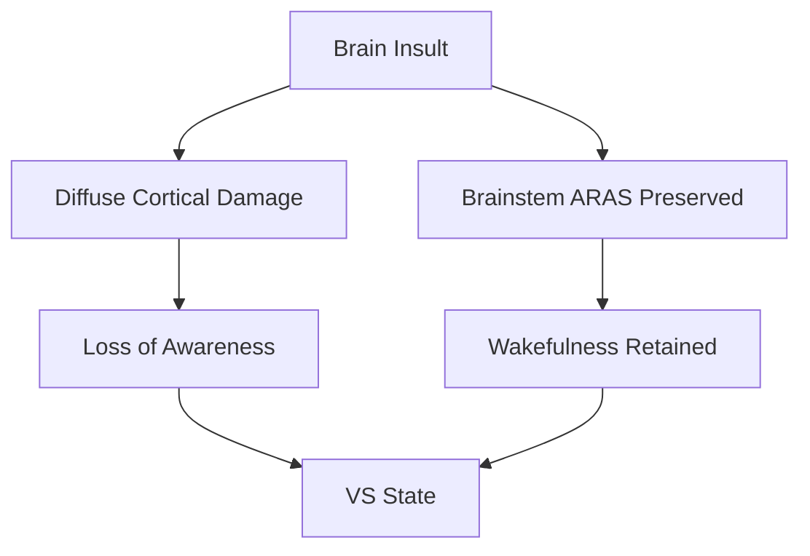
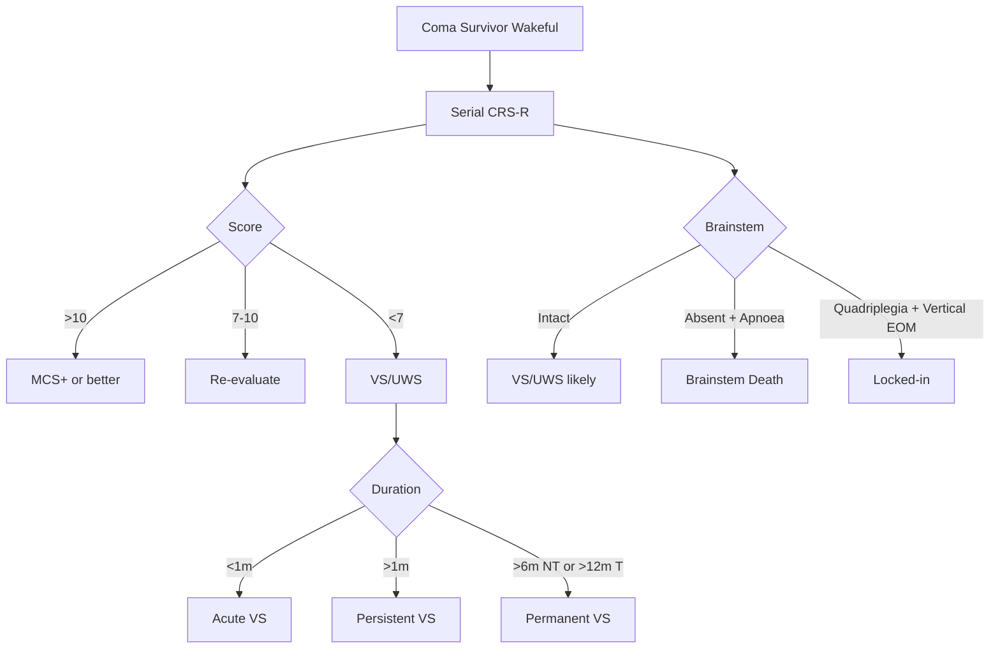

# Vegetative State / Unresponsive Wakefulness Syndrome (VS/UWS)

> [!tip] **Key Concept (RCP 2013 / EAN 2020)**
> **VS/UWS** = **wakefulness WITHOUT awareness**: sleep-wake cycles, eyes open, NO reproducible purposeful behaviour, NO language, NO pursuit.
> **Persistent VS (PVS)** = >1 month (descriptive, NOT prognostic).
> **Permanent VS** = no realistic recovery: **6m non-traumatic, 12m traumatic**.

Related: [[Coma Assessment]], [[Minimally Conscious State]], [[Locked-In Syndrome]], [[Brainstem Death Criteria]], [[Post-Cardiac Arrest Encephalopathy]]

## Learning Objectives
- [ ] Define VS/UWS; distinguish from coma, MCS, locked-in, brain death
- [ ] Persistent vs permanent VS timings
- [ ] Aetiology and pathophysiology
- [ ] CRS-R diagnostic criteria; misdiagnosis risk
- [ ] Investigations: MRI, EEG, SSEP, FDG-PET, fMRI covert awareness
- [ ] Supportive management and complications
- [ ] Prognosis and ethical/legal framework

---

## 1. Definition / Epidemiology / Classification

**VS/UWS** = disorder of consciousness with **wakefulness but no awareness**. Sleep-wake cycles and brainstem autonomic function present, but no self/environment awareness.

- **Incidence:** 0.5-2/100,000/year (PVS)
- **Misdiagnosis:** **~40%** if not assessed with CRS-R (often reclassified MCS)
- **Aetiology:** Anoxic 30-50%, TBI 20-30%, stroke 15-25%, metabolic/infectious 10-15%

| Type | Definition | Prognosis |
|------|------------|-----------|
| Acute VS | First days-weeks post-insult | Some recovery possible |
| **Persistent VS** | >1 month | Descriptive only |
| **Permanent VS** | No realistic recovery (NT 6m, T 12m) | Diagnosis, NOT a death sentence |
| UWS (Laureys 2010) | Neutral term replacing "vegetative" | Preferred |

---

## 2. Aetiology / Pathophysiology

**Aetiology:** TBI (diffuse axonal injury), anoxic (post-arrest), massive stroke, SAH, bilateral thalamic infarcts, severe meningoencephalitis, metabolic (hypoglycaemia, CO), advanced neurodegenerative.

- Anoxic: selective neuronal necrosis (cortex layers III/V/VI, hippocampus CA1, Purkinje)
- TBI: diffuse axonal injury (corpus callosum, dorsolateral brainstem)
- PET: global cortical hypometabolism (40-50% normal); preserved brainstem
- Default mode network (DMN) disconnected — precuneus/posterior cingulate

---

## 3. Clinical Features

**History:** Acute brain insult → coma → wakefulness without awareness. No functional communication, no command following, no reproducible purposeful behaviour. Sleep-wake cycles present. Autonomic preserved.

**Examination:**
| Domain | Findings | Localisation |
|--------|----------|--------------|
| Higher cortical | No awareness, no command, no language | Diffuse cortex |
| Cranial nerves | Pupils reactive, corneal present | Brainstem intact |
| Motor | No purposeful; may have posturing, withdrawal | Diffuse |
| Sensory | No consistent purposeful response | Cortex not processing |
| Autonomic | BP, HR, temperature preserved | Brainstem intact |

**Reflex behaviours (NOT purposeful):** yawning, grunting, crying, smiling, startle, withdrawal.

**Misdiagnosis red flags:** Visual pursuit = MCS; command following = MCS; vertical EOM + quadriplegia = **locked-in**.

---

## 4. Diagnostic Approach / Algorithm

**CRS-R (Coma Recovery Scale-Revised)** = gold standard. 23 items, 6 subscales: **A**uditory, **V**isual, **M**otor, **O**romotor/**V**erbal, **C**ommunication, **A**rousal (AVMOCA). Score 0-23.
- **VS/UWS:** no subscale >1
- **MCS-:** reproducible +1 on 1 subscale (e.g., visual pursuit, command)
- **MCS+:** reproducible +1 on ≥2 subscales OR functional communication
- **Emergence from MCS:** functional communication OR functional object use

---

## 5. Investigations

| Investigation | Indication | Finding |
|---------------|------------|---------|
| **Serial CRS-R** | All | Reduces misdiagnosis |
| **CT Head** | Initial | Structural lesion, hydrocephalus |
| **MRI Brain (DWI, FLAIR, SWI)** | All | Diffuse injury, thalamic, DAI |
| **EEG** | All | Slow wave; reactivity = better prognosis |
| **SSEP (median nerve)** | Anoxic prognosis | N20 bilaterally absent = poor (spec 100%) |
| **BAEP** | Brainstem | Preserved I-V in VS |
| **FDG-PET** | Diagnosis/prognosis | Global cortical hypometabolism |
| **fMRI mental imagery** | Covert awareness | ~15-20% show intentional activity |

**Covert awareness:** "Imagine playing tennis" / "Imagine walking around your home" — ~15-20% of "VS" show SMA/parahippocampal activation, indicating MCS- not true VS.

---

## 6. Differential Diagnosis

| Differential | Distinguishing Features | Key Test |
|--------------|------------------------|----------|
| Coma | No wakefulness, no sleep-wake cycles | Bedside |
| **MCS** | Reproducible purposeful behaviour | CRS-R, repeat |
| **Locked-in Syndrome** | Quadriplegia, anarthria, **preserved vertical EOM + blinking** | MRI pons (basis pontis) |
| Akinetic Mutism | Frontal/cingulate; sparse movement but aware | MRI mesial frontal |
| Catatonia | Waxy flexibility, echolalia | Lorazepam challenge |
| Severe Dementia | Progressive, no acute onset | History |
| Brainstem Death | Absent reflexes, apnoea | UK Code tests |
| Psychogenic Unresponsiveness | Eye closure resistance, normal imaging | Clinical, EEG |

---

## 7. Management

**Acute phase:** Treat underlying cause (raised ICP, status epilepticus, hydrocephalus).

**Chronic supportive care:**
| Domain | Intervention |
|--------|--------------|
| Airway | Tracheostomy if no protection |
| **Nutrition** | **PEG within 4-6 weeks** |
| Skin | Pressure-relieving mattress, 2-hourly turns |
| **DVT prophylaxis** | LMWH + mechanical |
| Bowel/Bladder | Catheter, bowel regimen |
| Spasticity | Physio → baclofen → intrathecal baclofen/botulinum |

**Symptomatic management:**
| Symptom | First-line | Second-line | Refractory |
|---------|------------|-------------|------------|
| Spasticity | Physio, positioning | Baclofen 5mg TDS (titrate) | Intrathecal baclofen, botulinum, tizanidine |
| Autonomic storms | Identify trigger | Propranolol, gabapentin | Morphine, bromocriptine, clonidine |
| Heterotopic ossification | ROM, NSAIDs | Bisphosphonates | Surgery |
| Seizures | Levetiracetam | Lamotrigine, valproate | Per SE protocol |
| Hypersalivation | Hyoscine patch | Glycopyrrolate | Botulinum to salivary glands |

**Rehabilitation (MDT):** Physio (passive ROM, contracture prevention), OT (sensory stimulation, splinting), SALT (swallow, communication), neuropsychology (family support), social work (care planning).

**Procedures:** PEG (4-6w), tracheostomy, VPS for hydrocephalus, intrathecal baclofen pump. **No proven role for DBS in VS.**

---

## 8. Drug Cautions

| Drug | Caution | Management |
|------|---------|------------|
| Baclofen | Sedation, abrupt withdrawal | Titrate slowly |
| Benzodiazepines | Respiratory depression, paradoxical agitation | Lowest effective dose |
| Anticholinergics | Confusion, urinary retention | Caution in elderly |
| Dopamine antagonists | NMS, parkinsonism | Avoid |
| Opioids | Respiratory depression, constipation | Lowest dose + laxatives |

---

## 9. Procedures

- **PEG:** Long-term feeding (>4-6w). Risks: infection, perforation, buried bumper, aspiration. MDT + family decision.
- **Tracheostomy:** Prolonged ventilation/airway. Risks: stenosis, infection.
- **LP:** Only after CT (exclude raised ICP).

---

## 10. Complications

| Complication | Frequency | Prevention |
|--------------|-----------|------------|
| Aspiration pneumonia | 30-50% | Head elevation, PEG, suctioning |
| DVT/PE | 20-30% | LMWH prophylaxis |
| Pressure ulcers | 30-50% | 2-hourly turns, pressure mattress |
| UTI | Common | Catheter care |
| Spasticity/contractures | 60-80% | Physio, baclofen |
| Heterotopic ossification | 10-20% | ROM, NSAIDs |
| Sepsis (cause of death) | Common | Bundle care |

---

## 11. Red Flags / Emergencies

| Red Flag | Action |
|----------|--------|
| New seizures | EEG, IV ASM |
| Rising ICP | CT, mannitol/hypertonic saline, neurosurgery |
| Hydrocephalus | Urgent EVD/shunt |
| Sepsis (line, urine, lung) | Cultures, broad antibiotics |
| Autonomic storm (severe) | Propranolol, morphine |
| Re-evaluation suggests MCS | Repeat CRS-R, fMRI |

---

## 12. Prognosis

| Factor | Better | Worse |
|--------|--------|-------|
| Age | <40 | >60 |
| Aetiology | TBI | Anoxic |
| Duration | <3 months | >6 months |
| CRS-R | Higher | Persistently low |
| MRI | Focal | Diffuse, thalamic, corpus callosum |
| EEG | Reactive | Non-reactive, burst-suppression |
| SSEP (N20) | Preserved | Absent (anoxic) |
| PET | Preserved metabolism | Global hypometabolism |

- **TBI VS recovery:** 50% by 6 months, 25% by 12 months
- **Anoxic VS recovery:** <10% by 6 months
- **Permanent VS:** Recovery <1% (small chance always exists)
- **Mortality:** 50% die within 2-5 years (sepsis, respiratory, withdrawal)

---

## 13. Topic Correlation

| Related Topic | Link | Overlap |
|---------------|------|---------|
| Coma Assessment | [[Coma Assessment]] | GCS, brainstem exam, aetiology |
| MCS | [[Minimally Conscious State]] | Differentiate via CRS-R |
| Locked-in | [[Locked-In Syndrome]] | Vertical EOM = LIS, not VS |
| Brainstem Death | [[Brainstem Death Criteria]] | Apnoea test, UK Code |
| Post-Cardiac Arrest | [[Post-Cardiac Arrest Encephalopathy]] | Common cause of anoxic VS |

---

## 14. Special Situations

- **Pregnancy:** Ethical complex; MDT + family + legal; consider continuation vs termination
- **Paediatric:** Better outcomes; avoid early prognostication; CRS-R adapted
- **Elderly:** Comorbidities; ceilings of treatment; advance care planning
- **Renal/Hepatic:** Drug dose adjustments (baclofen, gabapentin, benzodiazepines)
- **End-of-life / Withdrawal:** Only after **permanent** VS criteria (UK 6m NT, 12m T); MDT + family + **Court of Protection** (England/Wales); never premature
- **Driving (DVLA):** Permanent disqualification
- **Occupational:** Not applicable

---

## FCPS/MRCP High-Yield Summary

| Category | Key Points |
|----------|------------|
| Definition | VS/UWS = wakefulness + no awareness |
| Epidemiology | Misdiagnosis ~40% without CRS-R |
| Persistent vs Permanent | PVS >1m; Permanent NT 6m, T 12m |
| Pathophysiology | Diffuse cortex + preserved brainstem (ARAS) |
| Aetiology | Anoxic (worse), TBI (better), stroke, infection |
| Clinical | Eyes open, no command, no pursuit, no language |
| Diagnosis | CRS-R (gold); MRI, EEG, SSEP, FDG-PET |
| Covert awareness | 15-20% show intentional fMRI activity |
| Differentials | MCS, Locked-in, Brainstem death, Catatonia, Akinetic mutism |
| Management | PEG, tracheostomy, pressure care, DVT, spasticity |
| Complications | Aspiration, DVT, pressure ulcers, sepsis |
| Prognosis | Anoxic 6m poor (<10%); TBI 12m poor; mortality 50% at 2-5y |
| Viva Pearls | 40% misdiagnosis; N20 absent anoxic; PET global hypometabolism |
| Drug Doses | Baclofen 5mg TDS; Propranolol 10mg TDS; Gabapentin 300mg TDS |
| Scoring | CRS-R 0-23; UWS <7; MCS-/MCS+ |
| Imaging | Diffuse injury, thalamic, DAI; PET global hypometabolism |

---

## Common Confusions / Exam Traps

| Confusion | Clarification |
|-----------|---------------|
| VS = MCS | MCS = reproducible purpose; VS = none. CRS-R, repeat. |
| Permanent = death | Small recovery chance always exists. |
| Locked-in = VS | LIS = vertical EOM + blinking, full awareness, MRI pons. |
| Persistent = Permanent | Persistent = time; Permanent = clinical/legal at 6m/12m. |
| SSEP absent = VS | N20 absent = poor anoxic recovery, not specific to VS. |

---

## Mnemonics

1. **WAKE** — **W**akefulness + **A**bsent **K**nowledge + **E**ye opening
2. **AVMOCA** — CRS-R 6 subscales
3. **6m NT 12m T** — Permanent VS timings
4. **N20 absent = No recovery** (anoxic)

---

## One-Page Revision Card

| **Topic** | **VS/UWS** |
|-----------|-----------|
| Definition | Wakefulness + no awareness |
| Key Clinical | Eyes open, no command, no pursuit, no language |
| Localisation | Diffuse cortex + preserved brainstem (ARAS) |
| Dx Criteria | CRS-R (UWS <7; MCS-/MCS+ if reproducible) |
| Differentials | MCS, Locked-in, Brainstem death, Catatonia, Akinetic mutism |
| Investigations | MRI, EEG, SSEP (N20), FDG-PET, fMRI |
| Management | 1. Airway 2. PEG 3. Pressure/DVT 4. Spasticity Rx 5. MDT/family |
| Key Drugs | Baclofen 5mg TDS; Propranolol 10mg TDS |
| Red Flags | Seizures, ↑ICP, covert awareness, autonomic storm |
| Prognosis | Anoxic 6m poor (<10%); TBI 12m poor; mortality 50% at 2-5y |
| Viva Pearls | 40% misdiagnosis; N20 absent anoxic; permanent 6m NT 12m T |
| Mnemonics | WAKE; AVMOCA; 6m NT 12m T |

---

## Summary
VS/UWS = wakefulness without awareness; eye opening, sleep-wake, no reproducible purposeful behaviour. **Persistent** = >1m; **Permanent** = 6m non-traumatic, 12m traumatic (Court of Protection for withdrawal). **CRS-R gold standard** with **40% misdiagnosis** rate without it. Anoxic aetiology worse than TBI. **Covert awareness (15-20%)** on fMRI may indicate MCS. Management supportive: **PEG, tracheostomy, pressure care, DVT prophylaxis, baclofen** for spasticity. SSEP **N20 absent** = poor anoxic prognosis. Death commonly from **sepsis**.

---

## MCQs (10)

1. **Q:** Permanent VS threshold in non-traumatic injury (UK RCP 2013)?
   **Options:** A. 1m B. 3m C. 6m D. 12m
   **Answer:** C
   **Explanation:** Non-traumatic permanent VS = ≥6 months; traumatic = ≥12 months. Persistent = ≥1m descriptive.

2. **Q:** Gold-standard DOC assessment tool?
   **Options:** A. GCS B. FOUR C. CRS-R D. WHIM
   **Answer:** C
   **Explanation:** CRS-R = gold standard; 23 items, 6 subscales (AVMOCA).

3. **Q:** Misdiagnosis rate of VS without CRS-R?
   **Options:** A. 5% B. 10% C. 20% D. 40%
   **Answer:** D
   **Explanation:** ~40% reclassified (often MCS) with structured tools.

4. **Q:** Quadriplegia, anarthria, blinks "yes/no" reliably. Diagnosis?
   **Options:** A. VS B. Locked-in C. MCS D. Brainstem death
   **Answer:** B
   **Explanation:** LIS: vertical EOM + blinking preserved, full awareness, MRI pons.

5. **Q:** Bilateral absent N20 in anoxic coma indicates?
   **Options:** A. Normal B. Unilateral lesion C. Poor prognosis (specificity 100%) D. Brainstem lesion
   **Answer:** C
   **Explanation:** AAN 2014: N20 bilaterally absent = poor anoxic outcome (specificity ~100%).

6. **Q:** FDG-PET in VS shows:
   **Options:** A. Normal B. Global cortical hypometabolism C. Focal frontal hyper D. Cerebellar hypo only
   **Answer:** B
   **Explanation:** Global cortical hypometabolism (~40-50% normal); preserved brainstem.

7. **Q:** Covert awareness on fMRI in "VS" patients?
   **Options:** A. 0% B. 1-2% C. 15-20% D. 50%
   **Answer:** C
   **Explanation:** ~15-20% show intentional activation (SMA, parahippocampal); suggests MCS-.

8. **Q:** First-line spasticity in VS?
   **Options:** A. Botulinum B. Intrathecal baclofen C. Physio + positioning D. Oral baclofen
   **Answer:** C
   **Explanation:** Non-pharmacological first; oral baclofen if inadequate.

9. **Q:** Most common cause of death in VS?
   **Options:** A. Cardiac B. Sepsis C. Stroke D. SE
   **Answer:** B
   **Explanation:** Sepsis (aspiration pneumonia, UTI) is the leading cause.

10. **Q:** Withdrawal of nutritional support in UK permanent VS?
    **Options:** A. 1m B. 3m C. MDT + family + Court of Protection, only at permanent D. Never permitted
    **Answer:** C
    **Explanation:** Court of Protection approval; only after permanent criteria + full process.

---

## SBA Questions (10)

1. **Scenario:** 35-year-old severe TBI 4 months ago. Eyes open, sleep-wake, no command following. CRS-R 4. Best description?
   **Options:** A. Coma B. Persistent VS C. Permanent VS (T) D. MCS
   **Answer:** B
   **Explanation:** VS >1m = persistent VS. Permanent trauma threshold = 12m. CRS-R no reproducible signs = VS not MCS.

2. **Scenario:** 28-year-old woman post-arrest VS 7 months. MRI diffuse cortical injury. CRS-R 5. Best statement?
   **Options:** A. Recovery likely B. Permanent VS criteria met (anoxic); very poor prognosis C. Continue indefinitely D. Persistent VS
   **Answer:** B
   **Explanation:** Anoxic 6m = permanent VS; recovery <10%.

3. **Scenario:** Patient labelled VS shows reproducible visual tracking on multiple CRS-R. Diagnosis?
   **Options:** A. Persistent VS B. Permanent VS C. MCS- D. Locked-in
   **Answer:** C
   **Explanation:** Reproducible visual tracking = +1 visual subscale = MCS-.

4. **Scenario:** Brainstem stroke, no brainstem reflexes, apnoea test positive. Next step?
   **Options:** A. MRI B. Brainstem death testing per UK Code C. Continue support D. LP
   **Answer:** B
   **Explanation:** Formal brainstem death testing per UK Code (2 doctors, preconditions).

5. **Scenario:** VS with severe spasticity despite oral baclofen 30mg/d. Next step?
   **Options:** A. ↑Baclofen B. Intrathecal baclofen pump trial C. Stop baclofen D. Tizanidine only
   **Answer:** B
   **Explanation:** Oral baclofen max → consider intrathecal baclofen pump trial.

6. **Scenario:** Most important prognostic investigation post-anoxic VS at 1 month?
   **Options:** A. CSF B. EEG reactivity + SSEP N20 C. CT D. LP
   **Answer:** B
   **Explanation:** SSEP N20 + EEG reactivity = strongest anoxic prognostic markers (AAN 2014).

7. **Scenario:** "VS" patient shows SMA activation on tennis imagery fMRI. Means?
   **Options:** A. Confirms VS B. Covert awareness — MCS- likely C. Brain death D. Inconclusive
   **Answer:** B
   **Explanation:** Intentional fMRI activation = covert awareness; suggests MCS-.

8. **Scenario:** VS patient sudden fever, hypotension, crackles. Diagnosis/management?
   **Options:** A. Autonomic storm B. Aspiration pneumonia — cultures, broad antibiotics, O2 C. DVT D. Brain death
   **Answer:** B
   **Explanation:** Aspiration pneumonia is most common sepsis in VS.

9. **Scenario:** 5-year-old VS 3 months post-TBI. Family asks about recovery. Best response?
   **Options:** A. No recovery B. ~50% may recover by 6 months C. PEG only D. Brain death
   **Answer:** B
   **Explanation:** Paediatric TBI VS recovery better; ~50% recover by 6-12m. Avoid premature prognostication.

10. **Scenario:** VS patient considered for PEG. Family asks indication. Best response?
    **Options:** A. Contraindicated B. For prolonged feeding if stable C. Only if MCS D. NG forever
    **Answer:** B
    **Explanation:** PEG for prolonged feeding; MDT + family decision.

---

## Flashcards

- **Q:** Define VS/UWS — A: Wakefulness without awareness; sleep-wake, no purpose
- **Q:** Persistent vs Permanent timing — A: PVS >1m; Perm NT 6m, T 12m
- **Q:** Gold-standard DOC tool — A: CRS-R (23 items, 6 subscales AVMOCA)
- **Q:** Misdiagnosis rate without CRS-R — A: ~40%
- **Q:** VS vs Locked-in — A: LIS = vertical EOM + blinking, MRI pons
- **Q:** SSEP N20 absent anoxic — A: Bilateral absent = poor (spec 100%)
- **Q:** Covert awareness — A: ~15-20% show intentional fMRI activity
- **Q:** First-line spasticity — A: Physio + positioning; oral baclofen
- **Q:** Most common cause of death — A: Sepsis (aspiration pneumonia)
- **Q:** FDG-PET in VS — A: Global cortical hypometabolism (~40-50%)
- **Q:** Withdrawal legal — A: Court of Protection; only at permanent criteria
- **Q:** Paediatric VS prognosis — A: Better; ~50% recover by 6-12m (TBI)

---

## Answer Key with Explanations

### MCQs
1. **C** — Non-traumatic permanent VS = 6m
2. **C** — CRS-R gold standard
3. **D** — 40% misdiagnosis
4. **B** — LIS: vertical EOM + blinking
5. **C** — N20 bilaterally absent (spec 100%)
6. **B** — Global cortical hypometabolism
7. **C** — 15-20% covert awareness
8. **C** — Physio first
9. **B** — Sepsis
10. **C** — Court of Protection

### SBAs
1. **B** — Persistent VS (4m; not yet 12m T permanent)
2. **B** — Anoxic 7m = permanent VS
3. **C** — Reproducible tracking = MCS-
4. **B** — UK Code brainstem death testing
5. **B** — Intrathecal baclofen pump trial
6. **B** — SSEP N20 + EEG reactivity anoxic prognosis
7. **B** — Covert awareness = MCS-
8. **B** — Aspiration pneumonia
9. **B** — Paediatric TBI ~50% recover by 6-12m
10. **B** — PEG for prolonged feeding

---

## Local Navigation
**Heading Hub:** [[14_Coma_Disorders_Consciousness/Coma & Disorders of Consciousness Hub]]
**Chapter Hierarchy:** [[Davidson Chapter 25 - Neurology Hierarchy]]
**Chapter MOC:** [[Neurology MOC]]
**Related Topics:** [[Minimally Conscious State]], [[Locked-In Syndrome]], [[Brainstem Death Criteria]], [[Coma Assessment]], [[Post-Cardiac Arrest Encephalopathy]]

## PasTest Scenario SBAs (Clinical Vignettes)

> **Auto-generated PasTest/Mediscope-style scenario SBAs** grounded in the authored source. Each scenario tests a real clinical fact (triad, specific sign, contraindication, trial, first-line Rx) extracted from the topic. *Source: Ch 27: Neurology & Stroke — Vegetative State Unresponsive Wakefulness Syndrome*

**Q1.** What is the most appropriate first-line therapy for Vegetative State Unresponsive Wakefulness Syndrome?

  - **A.** Acute phase:
  - **B.** An advanced/surgical therapy reserved for refractory disease
  - **C.** Symptomatic treatment only, no disease-modifying therapy
  - **D.** Empiric broad-spectrum therapy without specific indication

  > **Answer: A** — Acute phase:
  >
  > *Source:* **Acute phase:** Treat underlying cause (raised ICP, status epilepticus, hydrocephalus).

