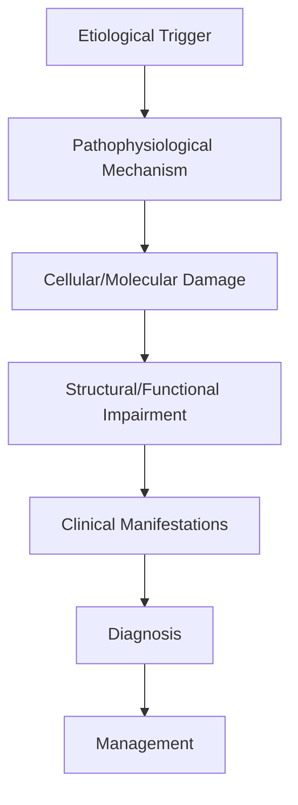
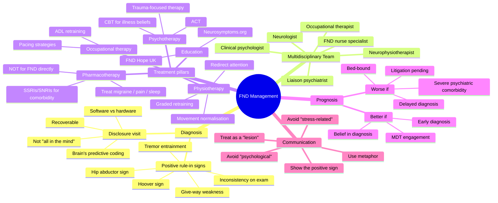

# FND Management

> [!tip] **High-Yield Definition**
> Comprehensive clinical note for FND Management covering definition, epidemiology, aetiology, pathophysiology, clinical features, investigations, differential diagnosis, management, drug interactions, procedures, complications, red flags, prognosis, topic correlation, and special situations for FCPS/MRCP examination preparation based on Davidson 24th Edition Chapter 25: Neurology.

---

## 1. Definition / Epidemiology / Classification

### Definition
FND Management is a neurological disorder within the 15 functional neurological disorders category. It is characterised by specific clinical, pathological, radiological, and laboratory features that allow differentiation from related conditions.

### Epidemiology
- **Incidence/Prevalence:** Variable depending on the specific condition.
- **Age:** Adult onset is most common, but paediatric and elderly presentations occur.
- **Sex:** Variable depending on the condition.
- **Geography:** Worldwide distribution, with higher prevalence in certain regions.
- **Risk Factors:** Genetic predisposition, environmental factors, comorbidities, family history.

### Classification
| Subtype | Key Features | Prognosis |
|---------|-------------|-----------|
| Mild/early | Subtle symptoms, preserved function | Best |
| Moderate | Clear symptoms, functional impairment | Variable |
| Severe | Significant disability, complications | Worst |

---

## 2. Aetiology / Pathophysiology

### Aetiology
- **Primary (idiopathic):** Most cases have no identifiable cause.
- **Genetic:** May be inherited (AD, AR, X-linked, mitochondrial, sporadic).
- **Autoimmune:** Autoantibodies, immune-mediated inflammation.
- **Infectious:** Viral, bacterial, fungal, parasitic.
- **Metabolic:** Electrolyte, endocrine, hepatic, renal, nutritional.
- **Toxic:** Drugs, alcohol, heavy metals, environmental toxins.
- **Vascular:** Ischaemia, haemorrhage, vasculitis.
- **Neoplastic:** Primary, secondary, paraneoplastic.
- **Traumatic:** Acute, chronic, repetitive.
- **Degenerative:** Neurodegeneration, protein misfolding.

### Pathophysiology


---

## 3. Clinical Features

### History
- **Onset/Duration:** Acute, subacute, or chronic.
- **Progression:** Static, progressive, relapsing-remitting, stepwise.
- **Key symptoms:** Specific to the condition.
- **Triggers:** Stress, infection, trauma, drugs, hormonal, environmental.
- **Systemic symptoms:** Constitutional features.
- **Drug/Family/Social history:** Relevant exposures, comorbidities.

### Examination
| Domain | Key Findings | Localisation Value |
|--------|-------------|-------------------|
| Higher function | Cognitive, behavioural | Cortical, subcortical, limbic |
| Cranial nerves | Pupils, eye movements, facial, bulbar | Brainstem, cranial nerve, NMJ |
| Motor | Weakness, tone, reflexes | UMN, LMN, NMJ, muscle |
| Sensory | All modalities, pattern | Peripheral, spinal, brainstem |
| Coordination | Ataxia, nystagmus, dysmetria | Cerebellar, sensory, vestibular |
| Gait | Spastic, ataxic, parkinsonian | Multiple |
| Autonomic | Orthostatic, sweating, GI, bladder | Autonomic, peripheral, central |

### Specific Clinical Features
The clinical features are determined by the underlying aetiology, location of pathology, and rate of progression. Patients typically present with a constellation of symptoms and signs that allow clinical localisation and subsequent targeted investigation.

---

## 4. Diagnostic Approach / Algorithm

```mermaid
flowchart TD
    A[Clinical Presentation] --> B[Anatomical Localisation]
    B --> C[Pathophysiological Category]
    C --> D[Formulate Differential]
    D --> E[Targeted Investigations]
    E --> F[Confirm Diagnosis]
    F --> G[Assess Severity/Prognosis]
    G --> H[Initiate Management]
    H --> I[Monitor Response]
    I --> J{Response?}
    J --> YES1 [Good - Continue]
    J --> NO1 [Poor - Escalate]
    YES1 --> K[Monitor]
    NO1 --> H
```

---

## 5. Investigations

### First-Line Investigations
- **Blood tests:** FBC, U&Es, LFTs, glucose, calcium, magnesium, ESR, CRP, autoimmune, infection.
- **Imaging:** CT/MRI brain/spine (essential for most neurological conditions).
- **Neurophysiology:** EEG, nerve conduction, EMG, evoked potentials.
- **CSF:** Cell count, protein, glucose, OCBs, PCR, culture.

### Second-Line Investigations
- **Genetic testing:** Gene panels, WES, WGS.
- **Antibody testing:** Antineuronal, autoimmune, paraneoplastic.
- **Biopsy:** Nerve, muscle, brain, skin.
- **Advanced imaging:** PET-CT, MR spectroscopy, fMRI.

### Specialised Investigations
- **Biomarkers:** Neurofilament light chain, tau, beta-amyloid, 14-3-3, RT-QuIC.
- **Autonomic testing:** Head-up tilt, sudomotor, QSART.
- **Neuropsychology:** Cognitive testing, behavioural assessment.
- **Genetic counselling:** Family screening, predictive testing.

---

## 6. Differential Diagnosis

| Differential | Distinguishing Features | Key Test |
|--------------|------------------------|----------|
| Vascular | Sudden onset, focal, vascular risk factors | MRI/CT, vessel imaging |
| Inflammatory | Subacute, multifocal, systemic | MRI, CSF, antibodies |
| Infectious | Fever, systemic, exposure | Bloods, CSF, imaging |
| Neoplastic | Progressive, mass effect | MRI, biopsy |
| Degenerative | Progressive, symmetric, hereditary | MRI, genetic |
| Toxic/Metabolic | Drug history, systemic, reversible | Bloods, toxicology |
| Autoimmune | Multifocal, antibodies, immunotherapy response | Antibodies, MRI, CSF |
| Functional | Inconsistent, distractible | Clinical, video, biomarkers |

---

## 7. Management

### Acute Management
- **Stabilisation:** ABCDE approach, emergency resuscitation.
- **Specific treatment:** Disease-specific interventions.
- **Symptomatic relief:** Pain, seizures, spasticity, autonomic dysfunction.
- **Prevention of complications:** DVT, pressure sores, infection.

### Disease-Modifying Treatment
- **Pharmacological:** First-line, second-line, escalation, maintenance.
- **Procedural:** Surgery, biopsy, drainage, ablation, stimulation.
- **Immunotherapy:** Steroids, IVIG, plasma exchange, immunosuppressants, biologics.
- **Rehabilitation:** Physiotherapy, OT, speech therapy.

### Long-Term Management
- **Monitoring:** Clinical, imaging, biomarkers, side effects.
- **Prevention:** Vaccinations, prophylaxis, lifestyle modification.
- **Supportive care:** Multidisciplinary team, social work, psychological support.
- **Palliative care:** Advanced care planning, end-of-life care, hospice.

---

## 8. Drug Interactions / Contraindications / Comorbidity Cautions

| Drug Class | Interaction / Caution | Management |
|------------|----------------------|------------|
| Antiseizure medications | Enzyme induction, teratogenicity | Monitor, supplement, switch |
| Immunosuppressants | Infection, malignancy, teratogenicity | Monitor, prophylaxis |
| Anticoagulants | Bleeding risk, drug interactions | Monitor INR, avoid combinations |
| Antihypertensives | Hypotension, falls | Monitor BP, adjust dose |
| Antibiotics | Nephrotoxicity, ototoxicity | Monitor renal |
| Antivirals | Nephrotoxicity, neuropsychiatric | Monitor renal, dose adjust |
| Steroids | DM, HTN, osteoporosis, infection | Monitor, prophylaxis, taper |
| Biologics | Infusion reactions, infection | Monitor, prophylaxis |

---

## 9. Procedures

### Common Procedures
- **Lumbar puncture:** Diagnostic, therapeutic (IIH, NPH). Contraindications: raised ICP, mass lesion, coagulopathy.
- **Nerve conduction studies/EMG:** Diagnostic, prognosis. Minor discomfort.
- **EEG:** Diagnostic, monitoring. No significant complications.
- **MRI brain/spine:** Diagnostic, monitoring. Contraindications: pacemaker, metallic implants.
- **CT head:** Emergency, rapid. Radiation exposure, contrast reactions.
- **Biopsy:** Stereotactic, open. Indications: diagnosis, molecular profiling.

---

## 10. Complications

| Complication | Frequency | Prevention | Management |
|--------------|-----------|------------|------------|
| Infection | Common | Hygiene, prophylaxis, vaccination | Antibiotics, antifungals |
| Thrombosis | Common | Prophylaxis, mobility | Anticoagulation |
| Pressure sores | Common | Positioning, nutrition | Wound care, surgery |
| Spasticity | Common | Positioning, stretching | Baclofen, BoNT |
| Contractures | Common | Passive movements, splints | Physiotherapy, surgery |
| Aspiration | Common | Swallow assessment | NGT, PEG, thickeners |
| Falls | Common | Environment, mobility | Walking aids |
| Fractures | Common | Bone health, prevention | Vitamin D, bisphosphonate |
| Depression | Common | Screening, support | Antidepressants, CBT |
| Cognitive decline | Variable | Monitoring, training | Rehabilitation |
| Autonomic dysfunction | Variable | Monitoring, hydration | Midodrine, fludrocortisone |
| Respiratory failure | Variable | Monitoring, supportive | Ventilation, NIV |
| Death | Variable | Monitoring, palliative | End-of-life care |

---

## 11. Red Flags / Emergencies

### Emergency Presentations
- **Rapid neurological deterioration:** New focal deficit, decreased consciousness, seizures.
- **Status epilepticus:** Continuous seizures >5 min.
- **Raised ICP:** Headache, vomiting, papilloedema, altered consciousness.
- **Respiratory failure:** Hypoxia, hypercapnia, ventilatory failure.
- **Cardiac arrest:** Arrhythmia, MI, pulmonary embolism.
- **Infection:** Sepsis, meningitis, abscess, encephalitis.
- **Drug toxicity:** Overdose, side effects, interactions.
- **Haemorrhage:** Intracranial, systemic, coagulopathy.

---

## 12. Prognosis

### Natural History
- **Acute:** May resolve with treatment, may progress, may be fatal.
- **Subacute:** Variable, depends on cause and treatment.
- **Chronic:** Often progressive, may be stable, may have relapses.
- **Recovery:** Variable, may be complete, partial, or none.

### Prognostic Factors
- **Favourable:** Young age, early treatment, mild disease, reversible cause, good premorbid function, family support.
- **Unfavourable:** Older age, delayed treatment, severe disease, irreversible cause, poor premorbid function, comorbidities.

---

## 13. Topic Correlation

| Related Topic | Link | Key Overlap |
|---------------|------|-------------|
| Davidson 24th Ed Chapter 25 | [[Davidson Chapter 25 - Neurology Hierarchy]] | Comprehensive neurology |
| Neurology MOC | [[Neurology MOC]] | All neurology topics |
| Drug Reference | [[../00_Index/Neurology Drug Reference]] | Medications |
| Local Hub | [[../15_Functional_Neurological_Disorders/Hub]] | Section-specific |
| Clinical Examination | [[../01_Fundamentals_Examination/Neurological History Taking]] | Clinical approach |
| Investigation | [[../01_Fundamentals_Examination/Neuroimaging (CT-MRI) Principles]] | Imaging |

---

## 14. Special Situations

| Situation | Consideration |
|-----------|---------------|
| **Pregnancy** | Pre-conception counselling, teratogenicity, drug safety, monitoring, delivery planning, breastfeeding. |
| **Lactation** | Drug safety, breastfeeding, monitoring, support. |
| **Paediatric** | Developmental considerations, drug dosing, school, family, vaccination, growth, puberty. |
| **Elderly / Frail** | Comorbidities, polypharmacy, falls, bone health, cognition, social, end-of-life. |
| **Renal impairment** | Drug dose adjustment, monitoring, dialysis, transplant. |
| **Hepatic impairment** | Drug dose adjustment, monitoring, transplant. |
| **Immunocompromised** | Infection prophylaxis, vaccination, drug interactions, malignancy screening. |
| **Perioperative** | Drug management, anaesthesia planning, VTE prophylaxis, infection prevention, monitoring. |
| **Driving / DVLA** | Fitness to drive, restrictions, notification, reassessment. |
| **Occupational** | Fitness for work, adaptations, rehabilitation, disability, return to work. |

---

## FCPS/MRCP High-Yield Summary

| Category | Key Points |
|----------|------------|
| **Definition** | Comprehensive definition with key diagnostic criteria |
| **Epidemiology** | Incidence, prevalence, age, sex, geography, risk factors |
| **Aetiology** | Primary causes, secondary causes, genetic, environmental |
| **Pathophysiology** | Mechanism of disease, cellular/molecular basis |
| **Clinical Features** | History, examination, key findings, variants |
| **Diagnosis** | Diagnostic criteria, classification, severity |
| **Investigations** | First-line, second-line, specialised, biomarkers |
| **Differential Diagnosis** | Key differentials, distinguishing features, tests |
| **Management** | Acute, disease-modifying, symptomatic, supportive |
| **Complications** | Common, serious, prevention, management |
| **Prognosis** | Natural history, prognostic factors, outcomes |
| **Viva Pearls** | Key examination points |
| **Drug Doses** | First-line, second-line, emergency |
| **Scoring Systems** | Specific scores used in management |
| **Genetics** | Inheritance, genes, mutations, family screening |
| **Imaging Signs** | Characteristic findings, differential |

---

## Viva Questions (PACES/FCPS Style)

1. **Q:** Define and classify its variants.
   **A:** Comprehensive definition with classification of subtypes based on aetiology, severity, and clinical features.

2. **Q:** What are the key clinical features?
   **A:** Specific symptoms and signs including onset, progression, key features, and associated findings.

3. **Q:** What is the first-line treatment?
   **A:** First-line pharmacological and non-pharmacological management based on current evidence.

4. **Q:** What are the red flags requiring urgent referral?
   **A:** Specific emergency presentations and complications requiring immediate intervention.

5. **Q:** What is the prognosis?
   **A:** Natural history, prognostic factors, and long-term outcomes.

6. **Q:** How do you differentiate from key differentials?
   **A:** Clinical features, investigations, and response to treatment that distinguish from alternative diagnoses.

7. **Q:** What investigations are most useful?
   **A:** First-line and second-line investigations including imaging, neurophysiology, CSF, and biomarkers.

8. **Q:** Describe the stepwise management approach.
   **A:** Stepwise escalation from first-line to second-line to third-line therapy with monitoring.

9. **Q:** What are the emergency presentations?
   **A:** Specific emergency scenarios and immediate management priorities.

10. **Q:** How does management change in pregnancy/paediatrics/elderly?
    **A:** Special considerations for each population including drug safety, monitoring, and support.

---

## Common Confusions / Exam Traps

| Confusion | Clarification |
|-----------|---------------|
| Similar presentation but different cause | Differentiate by history, examination, investigations |
| Treatment response vs natural history | Assess with objective measures, biomarkers |
| Drug interactions | Check each drug, monitor, adjust doses |
| Disease progression vs treatment failure | Monitor response, escalate appropriately |
| Functional vs organic | Inconsistent, distractible, disability greater than impairment |
| Acute vs chronic | Time course, progression, reversibility |
| Primary vs secondary | Underlying cause, contributing factors |
| Side effects vs symptoms | Temporal relationship, dose relationship |

---

## Mnemonics

1. **REHAB-FND** — the six pillars of FND management:
   - **R**eassurance (positive diagnosis, not exclusion)
   - **E**xplanation ("software, not hardware"; brain's predictive coding glitch)
   - **H**ope (recoverable — not "all in the mind")
   - **A**ctivity retraining (graded physiotherapy/OT, redirecting attention)
   - **B**elief change (CBT for illness beliefs, catastrophising, self-efficacy)
   - **D**isciplinary teamwork (neuro + physio + OT + psychology + psychiatry)

2. **HOOVER'S RULES** — positive rule-in bedside signs to demonstrate to the patient:
   - **H**oover's sign (hip extension weakness abolished by contralateral hip flexion)
   - **O**ut-of-bed strength > in-bed strength
   - **O**ne-leg hopping preserved in "paraplegic" leg
   - **V**ariable/contradictory examination (give-way weakness)
   - **E**nvironmental dependency of tremor (entrainment, distractibility)
   - **R**olling sign (paraplegic hip abductors)
   - **'**S**igns of inconsistency (e.g., able to dress but cannot dorsiflex)

3. **MDT-ABCDE** — what the multidisciplinary team delivers:
   - **M**ovement retraining (specialist neurophysio)
   - **D**iagnostic clarity + disclosure visit
   - **T**herapy (CBT/ACT for illness beliefs and anxiety)
   - **A**ctivities of daily living (occupational therapy)
   - **B**ehavioural reactivation (graded exercise, return to work)
   - **C**o-morbidity management (migraine, pain, sleep, depression)
   - **D**ischarge planning with relapse plan
   - **E**ducation resources (FND Hope, neurosymptoms.org)

---

## Mind Map



---

## Spaced Repetition Trackers

| Day | Focus | Self-Test Questions | Score /10 |
|-----|-------|---------------------|-----------|
| **Day 1** | Diagnosis | (1) FND is a *rule-in* diagnosis based on positive signs — name 4. (2) Hoover's sign mechanism. (3) Which bedside sign distinguishes functional from organic tremor? (4) Why avoid the term "psychosomatic"? (5) Define "positive functional sign". (6) Dissociative attacks vs epilepsy — 3 features. (7) Functional weakness vs stroke — first-line test. (8) List 3 rule-in signs for functional dystonia. (9) Disability paradox in FND. (10) What is the "software vs hardware" metaphor? |  |
| **Day 3** | MDT roles | (1) Physiotherapy principle in FND. (2) Difference between CBT for FND vs depression. (3) OT role. (4) When to involve psychiatry. (5) FND nurse role. (6) Why neurologists shouldn't manage FND alone. (7) Family/carer role. (8) When to refer to specialist FND service. (9) Peer support groups. (10) What is ACT? |  |
| **Day 7** | Communication | (1) Open the disclosure visit how? (2) What metaphors work? (3) Common patient reactions. (4) Why avoid "stress"? (5) How to demonstrate Hoover's sign. (6) Letters to GP — key elements. (7) Why not "medically unexplained"? (8) Discussing prognosis. (9) Handling "but my symptoms are real". (10) What not to say. |  |
| **Day 14** | Treatment specifics | (1) First-line physiotherapy approach. (2) CBT for FND — 4 key targets. (3) When to use SSRI. (4) When to use SNRI. (5) Role of hypnosis. (6) Role of biofeedback. (7) Graded exercise protocol. (8) Treating comorbid migraine. (9) Pain management. (10) Sleep management. |  |
| **Day 30** | Prognosis / chronicity | (1) Prognosis of functional weakness. (2) Prognosis of PNES. (3) 4 poor prognostic factors. (4) 4 good prognostic factors. (5) Workplace / litigation impact. (6) Why early diagnosis matters. (7) Relapse rate after discharge. (8) Cost of FND to NHS. (9) Children vs adult prognosis. (10) Role of self-management. |  |
| **Day 90** | Integration / advanced | (1) Functional cognitive disorder vs dementia. (2) Functional seizures vs epilepsy. (3) PPPD — overlap with FND. (4) Persistent postural-perceptual dizziness. (5) Functional visual loss — diagnosis. (6) Co-morbidity with neurological disease. (7) Co-occurrence with epilepsy (5–20%). (8) DSM-5 / ICD-11 classification. (9) Functional gait disorder subtypes. (10) Research frontiers (fMRI, biomarkers). |  |

---

## Self-Test Scorecard

Score each domain 0–5 (5 = confident, 0 = no idea). Re-test monthly.

| # | Domain | /5 |
|---|--------|-----|
| 1 | Positive diagnosis (rule-in signs) |  |
| 2 | MDT composition and roles |  |
| 3 | Physiotherapy principles in FND |  |
| 4 | Psychological therapy (CBT / ACT) |  |
| 5 | Communication & disclosure visit |  |
| 6 | Pharmacology (comorbidity only) |  |
| 7 | Prognosis & chronicity factors |  |
| 8 | Differential diagnosis |  |
| 9 | Special situations (children, pregnancy, comorbidity) |  |
| 10 | Explanation models (predictive coding) |  |
| **Total** | **/50** |  |

---

## MCQs (10)

1. **Question:** Which is the cornerstone of communicating the diagnosis of functional neurological disorder?
   **Options:** A. Telling the patient symptoms are psychological B. Listing all the negative investigations to convince them nothing is wrong C. A positive explanation that links the patient's symptoms to positive clinical signs and an understandable mechanism D. Prescribing an antidepressant as the first step E. Requesting a second opinion
   **Answer:** C
   **Explanation:** Stone & Carson and the FND guidelines emphasise a *positive* explanation framed around demonstrable clinical signs (e.g., Hoover's sign) and a model such as "software, not hardware". Telling patients "it is psychological" or relying on negative tests is associated with worse engagement and outcomes.

2. **Question:** A patient with functional leg weakness has a positive Hoover's sign. What does this demonstrate?
   **Options:** A. Organic pyramidal tract lesion B. Automatic/voluntary dissociation — hip extension is normal during contralateral hip flexion C. Conversion of psychiatric distress D. Malingering E. Cerebellar ataxia
   **Answer:** B
   **Explanation:** Hoover's sign is a positive sign of *inconsistency* — the "weak" hip extends normally when the contralateral hip flexes automatically. It reflects the dissociation between voluntary and automatic movement that is the hallmark of functional weakness.

3. **Question:** Which specialist therapy has the strongest evidence base in functional neurological disorder?
   **Options:** A. Long-term psychoanalysis B. Specialist physiotherapy based on retraining with redirection of attention C. Antiepileptic drugs for all patients D. Acupuncture E. Hyperbaric oxygen
   **Answer:** B
   **Explanation:** Randomised data (Nielsen et al., CODES/CONVERT for PNES) support specialist physiotherapy for functional motor symptoms and CBT-informed psychotherapy for functional seizures. Pharmacotherapy has no primary role in FND itself — only for comorbidity.

4. **Question:** Which factor is associated with a *better* prognosis in functional neurological disorder?
   **Options:** A. Delayed diagnosis B. Pending litigation C. Short symptom duration and belief in the diagnosis D. Severe psychiatric comorbidity E. Bed-bound state
   **Answer:** C
   **Explanation:** Strong prognostic factors are short symptom duration, identification and belief in the diagnosis, engagement in MDT rehabilitation, and absence of secondary gain / litigation. Delayed diagnosis and entrenched illness beliefs worsen outcome.

5. **Question:** Which of the following is **NOT** a recommended communication point in the disclosure visit for FND?
   **Options:** A. "Your symptoms are real." B. "The brain is producing these symptoms through a software problem." C. "Stress is the cause." D. "Recovery is possible with retraining." E. "We can demonstrate on the examination why we are confident."
   **Answer:** C
   **Explanation:** "Stress" as a cause is unhelpful and frequently rejected by patients. Explanations should focus on brain function, prediction, attention, and *demonstrable* positive signs. Reassure that the symptoms are real but produced by altered brain function.

6. **Question:** In a meta-analysis of physiotherapy for functional motor disorder, what is the typical outcome?
   **Options:** A. Universal cure B. Significant functional improvement in motivated patients receiving specialist retraining C. Worsening of symptoms D. No effect beyond placebo E. Only useful in children
   **Answer:** B
   **Explanation:** Specialist physiotherapy (e.g., Nielsen's approach — redirected attention, education, normalising movement patterns) yields clinically meaningful improvement in well-designed observational and quasi-randomised studies. Effect depends on engagement and exclusion of entrenched secondary gain.

7. **Question:** Which members of the multidisciplinary team are **essential** for an FND service?
   **Options:** A. Neurologist + surgeon B. Neurologist + specialist physiotherapist + clinical psychologist/psychiatrist C. GP + alternative therapist D. Neurologist + social worker only E. Pain team only
   **Answer:** B
   **Explanation:** Core MDT: neurology (diagnosis and disclosure), specialist neurophysiotherapy (motor retraining), clinical psychology/psychiatry (CBT, comorbidity), often OT and FND nurse. Surgical and pain services have ancillary roles only.

8. **Question:** What is the recommended first step in the management of a patient newly diagnosed with functional weakness presenting within 3 months of onset?
   **Options:** A. Long-term sick leave B. Bed rest C. Early, clear positive diagnosis + referral to specialist neurophysiotherapy D. Repeat MRI in 6 months E. Opioid analgesia
   **Answer:** C
   **Explanation:** Early positive diagnosis and prompt referral to specialist physiotherapy is the single biggest determinant of good outcome. Bed rest, sick leave, and over-investigation worsen prognosis by reinforcing illness beliefs and deconditioning.

9. **Question:** A patient with FND tells you "the doctor said it was all in my head." How should you re-frame this?
   **Options:** A. Agree and refer to a psychiatrist B. Reassure that symptoms are real, caused by a *brain* function problem (not a delusion or fabrication), with demonstrable signs and a retraining-based treatment plan C. Discharge them D. Tell them to forget what was said E. Order another scan
   **Answer:** B
   **Explanation:** "All in the head" is heard by patients as "imagined". The re-frame is: "Your symptoms are real, the brain's *software* is producing them, we can see this on examination, and with retraining they can improve." This is the Stone et al. FND explanation model.

10. **Question:** Which co-morbidity should always be screened for and treated in FND?
    **Options:** A. Hyperthyroidism B. Migraine, anxiety, depression, and PTSD C. Vitamin D deficiency alone D. Celiac disease E. Sleep apnoea only
    **Answer:** B
    **Explanation:** Anxiety, depression, PTSD, migraine, chronic pain, and sleep disorder are highly prevalent in FND (often >50%) and *treatable*. Addressing comorbidity is part of MDT management, although it is not the *cause* of FND per se.

---

## SBA Questions (10)

1. **Scenario:** 32-year-old nurse with sudden left leg weakness 6 weeks ago; normal MRI brain and spine, normal NCS/EMG. On exam, the weak leg extends normally when she is asked to flex the contralateral hip against resistance.
   **Question:** What is the most appropriate next step?
   **Options:** A. Repeat MRI in 3 months B. Lumbar puncture C. Positive diagnosis of functional weakness, explanation, and referral to specialist neurophysiotherapy D. Carbamazepine trial E. Vagal nerve stimulation
   **Answer:** C
   **Explanation:** Hoover's sign is positive — a rule-in sign of functional weakness. The correct next step is a positive explanation and rehabilitation referral, not more investigation or empirical AEDs.

2. **Scenario:** A patient with FND asks "is it psychological?"
   **Question:** What is the most accurate response?
   **Options:** A. "Yes, it's psychological." B. "No, it's not real." C. "The symptoms are real and produced by altered brain function — the brain's 'software' is misfiring; the hardware is intact, and retraining can help." D. "We will need a psychiatric evaluation first." E. "It's all in your mind."
   **Answer:** C
   **Explanation:** The current FND guideline explanation emphasises: real symptoms, brain-software metaphor, demonstrable positive signs, retraining-based treatment, and avoid dichotomising "psychological" vs "organic".

3. **Scenario:** A physiotherapist is treating a patient with functional gait disorder who keeps "giving way" when walking.
   **Question:** What is the most appropriate physiotherapy approach?
   **Options:** A. Strengthening exercises only B. Retraining with redirection of attention, normalising automatic movement, and avoiding reinforcement of abnormal gait C. Bed rest D. Wheelchair provision E. Long-term outpatient review only
   **Answer:** B
   **Explanation:** Specialist FND physiotherapy focuses on automatic movement, attention redirection, and breaking illness-related motor patterns. Strengthening alone, bed rest, and wheelchair use reinforce disability and worsen prognosis.

4. **Scenario:** A 28-year-old woman with PNES is on three antiepileptic drugs without benefit. Video-EEG captured a typical event with closed eyes, asynchronous limb movements, and weeping, with no ictal EEG change.
   **Question:** What is the most appropriate next step?
   **Options:** A. Add a fourth antiepileptic B. Refer for video-EEG-confirmed diagnosis of PNES, begin a discussion of AED withdrawal, and refer for CBT for PNES C. Vagus nerve stimulation D. Ketogenic diet E. Corpus callosotomy
   **Answer:** B
   **Explanation:** With confirmed PNES, AEDs are not indicated and should be withdrawn under supervision. First-line treatment is CBT for PNES (CODEX/CONVERT trial) plus explanation.

5. **Scenario:** A 45-year-old man with chronic functional weakness has been on long-term sick leave for 18 months and is engaged in litigation.
   **Question:** Which factor is most likely to worsen his prognosis?
   **Options:** A. Short symptom duration B. Belief in the diagnosis C. Pending litigation / secondary gain D. Engagement in physiotherapy E. Co-managed depression
   **Answer:** C
   **Explanation:** Pending litigation and entrenched secondary gain are among the strongest negative prognostic factors in FND. They are not absolute contraindications to treatment but should be acknowledged and rehabilitation should not be contingent on legal resolution.

6. **Scenario:** A patient diagnosed with FND asks for a second opinion.
   **Question:** What is the most appropriate clinician response?
   **Options:** A. Refuse B. Welcome the request; explain that FND is a recognised neurological diagnosis and offer to refer for confirmation in a specialist FND clinic C. Discharge them from follow-up D. Order repeat MRI E. Tell them it is unnecessary
   **Answer:** B
   **Explanation:** Facilitating second opinion (especially in a specialist FND service) supports diagnostic confidence, therapeutic alliance, and engagement. Refusing or being dismissive worsens the illness belief.

7. **Scenario:** A 16-year-old presents with functional weakness. Her mother is convinced it is multiple sclerosis.
   **Question:** What is the most appropriate step?
   **Options:** A. Repeat MRI every 6 months B. Family-inclusive diagnostic explanation using positive signs, and referral to paediatric FND service C. Steroid trial D. Lumbar puncture E. SMN1 gene testing
   **Answer:** B
   **Explanation:** Family-inclusive explanation is critical in paediatric FND. Family beliefs about diagnosis can perpetuate the child's symptoms. Positive sign demonstration and family therapy form part of MDT management.

8. **Scenario:** A patient with FND has comorbid PTSD from childhood abuse.
   **Question:** What is the most appropriate psychological treatment priority?
   **Options:** A. Long-term psychoanalysis B. CBT focusing on illness beliefs, with trauma-focused therapy (e.g., EMDR) considered as part of MDT plan C. Aversion therapy D. Hypnosis only E. Pharmacotherapy alone
   **Answer:** B
   **Explanation:** CBT for FND targets illness beliefs and avoidance. Trauma-focused therapy (e.g., EMDR) is indicated for comorbid PTSD but is not a first-line *primary* treatment for FND motor symptoms.

9. **Scenario:** A 50-year-old man with FND symptoms also has uncontrolled migraine.
   **Question:** What is the most appropriate approach to the migraine?
   **Options:** A. Ignore migraine B. Active migraine prophylaxis (e.g., propranolol, topiramate, CGRP antagonist) plus acute treatment, recognising that uncontrolled migraine worsens FND C. Opioid analgesia D. Bed rest E. Discontinue all medication
   **Answer:** B
   **Explanation:** Comorbid migraine is common in FND and acts as a symptom amplifier. Active management of migraine (and other comorbidities — pain, sleep, anxiety) is an essential part of FND treatment.

10. **Scenario:** A patient with FND is improving with physiotherapy and asks when they can return to work.
    **Question:** What is the most appropriate advice?
    **Options:** A. Permanent unfit certificate B. Graded return to work, with occupational therapy input and review, ideally within 6–12 weeks of starting rehabilitation C. Immediate full duties D. Wait 12 months E. Apply for disability allowance
    **Answer:** B
    **Explanation:** Graded return to work, with OT and physiotherapy input, is a key part of FND rehabilitation. Prolonged absence worsens outcome; early, supported return is protective.

---

## Tags

`#FND #FunctionalNeurologicalDisorder #ConversionDisorder #DissociativeAttack #PositiveDiagnosis #MDT #Neurophysiotherapy #CBT #HooverSign #Disclosure #Rehabilitation #FunctionalWeakness #PredictiveCoding #SoftwareNotHardware`

---

## Local Navigation
**Heading Hub:** [[../Hub]]  
**Chapter Hierarchy:** [[Davidson Chapter 25 - Neurology Hierarchy]]  
**Chapter MOC:** [[Neurology MOC]]  
**Drug Reference:** [[../00_Index/Neurology Drug Reference]]

## PasTest Scenario SBAs (Clinical Vignettes)

> **Auto-generated PasTest/Mediscope-style scenario SBAs** grounded in the authored source. Each scenario tests a real clinical fact (triad, specific sign, contraindication, trial, first-line Rx) extracted from the topic. *Source: Ch 27: Neurology & Stroke — FND Management*

**Q1.** Which of the following features is most specific or characteristic of FND Management?

  - **A.** Key symptoms:
  - **B.** A feature common to many acute inflammatory conditions
  - **C.** A non-specific sign that does not localise the diagnosis
  - **D.** An investigation finding rather than a clinical feature

  > **Answer: A** — Key symptoms:
  >
  > *Source:* - **Key symptoms:** Specific to the condition

**Q2.** What is the most appropriate first-line therapy for FND Management?

  - **A.** Rehabilitation:
  - **B.** An advanced/surgical therapy reserved for refractory disease
  - **C.** Symptomatic treatment only, no disease-modifying therapy
  - **D.** Empiric broad-spectrum therapy without specific indication

  > **Answer: A** — Rehabilitation:
  >
  > *Source:* **Rehabilitation:** Physiotherapy, OT, speech therapy.

