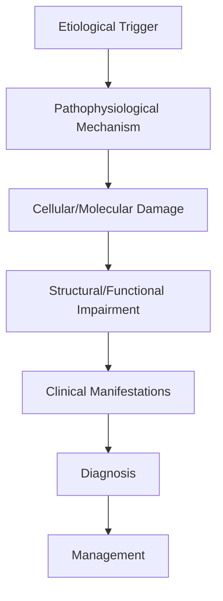
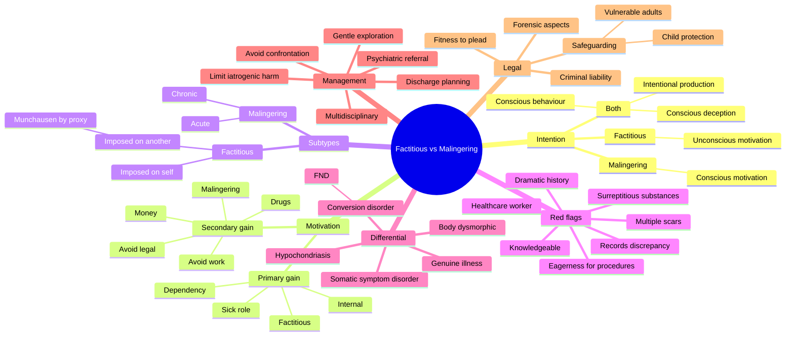

# Factitious Disorder Malingering

> [!tip] **High-Yield Definition**
> Comprehensive clinical note for Factitious Disorder Malingering covering definition, epidemiology, aetiology, pathophysiology, clinical features, investigations, differential diagnosis, management, drug interactions, procedures, complications, red flags, prognosis, topic correlation, and special situations for FCPS/MRCP examination preparation based on Davidson 24th Edition Chapter 25: Neurology.

---

## 1. Definition / Epidemiology / Classification

### Definition
Factitious Disorder Malingering is a neurological disorder within the 15 functional neurological disorders category. It is characterised by specific clinical, pathological, radiological, and laboratory features that allow differentiation from related conditions.

### Epidemiology
- **Incidence/Prevalence:** Variable depending on the specific condition.
- **Age:** Adult onset is most common, but paediatric and elderly presentations occur.
- **Sex:** Variable depending on the condition.
- **Geography:** Worldwide distribution, with higher prevalence in certain regions.
- **Risk Factors:** Genetic predisposition, environmental factors, comorbidities, family history.

### Classification
| Subtype | Key Features | Prognosis |
|---------|-------------|-----------|
| Mild/early | Subtle symptoms, preserved function | Best |
| Moderate | Clear symptoms, functional impairment | Variable |
| Severe | Significant disability, complications | Worst |

---

## 2. Aetiology / Pathophysiology

### Aetiology
- **Primary (idiopathic):** Most cases have no identifiable cause.
- **Genetic:** May be inherited (AD, AR, X-linked, mitochondrial, sporadic).
- **Autoimmune:** Autoantibodies, immune-mediated inflammation.
- **Infectious:** Viral, bacterial, fungal, parasitic.
- **Metabolic:** Electrolyte, endocrine, hepatic, renal, nutritional.
- **Toxic:** Drugs, alcohol, heavy metals, environmental toxins.
- **Vascular:** Ischaemia, haemorrhage, vasculitis.
- **Neoplastic:** Primary, secondary, paraneoplastic.
- **Traumatic:** Acute, chronic, repetitive.
- **Degenerative:** Neurodegeneration, protein misfolding.

### Pathophysiology


---

## 3. Clinical Features

### History
- **Onset/Duration:** Acute, subacute, or chronic.
- **Progression:** Static, progressive, relapsing-remitting, stepwise.
- **Key symptoms:** Specific to the condition.
- **Triggers:** Stress, infection, trauma, drugs, hormonal, environmental.
- **Systemic symptoms:** Constitutional features.
- **Drug/Family/Social history:** Relevant exposures, comorbidities.

### Examination
| Domain | Key Findings | Localisation Value |
|--------|-------------|-------------------|
| Higher function | Cognitive, behavioural | Cortical, subcortical, limbic |
| Cranial nerves | Pupils, eye movements, facial, bulbar | Brainstem, cranial nerve, NMJ |
| Motor | Weakness, tone, reflexes | UMN, LMN, NMJ, muscle |
| Sensory | All modalities, pattern | Peripheral, spinal, brainstem |
| Coordination | Ataxia, nystagmus, dysmetria | Cerebellar, sensory, vestibular |
| Gait | Spastic, ataxic, parkinsonian | Multiple |
| Autonomic | Orthostatic, sweating, GI, bladder | Autonomic, peripheral, central |

### Specific Clinical Features
The clinical features are determined by the underlying aetiology, location of pathology, and rate of progression. Patients typically present with a constellation of symptoms and signs that allow clinical localisation and subsequent targeted investigation.

---

## 4. Diagnostic Approach / Algorithm

```mermaid
flowchart TD
    A[Clinical Presentation] --> B[Anatomical Localisation]
    B --> C[Pathophysiological Category]
    C --> D[Formulate Differential]
    D --> E[Targeted Investigations]
    E --> F[Confirm Diagnosis]
    F --> G[Assess Severity/Prognosis]
    G --> H[Initiate Management]
    H --> I[Monitor Response]
    I --> J{Response?}
    J --> YES1 [Good - Continue]
    J --> NO1 [Poor - Escalate]
    YES1 --> K[Monitor]
    NO1 --> H
```

---

## 5. Investigations

### First-Line Investigations
- **Blood tests:** FBC, U&Es, LFTs, glucose, calcium, magnesium, ESR, CRP, autoimmune, infection.
- **Imaging:** CT/MRI brain/spine (essential for most neurological conditions).
- **Neurophysiology:** EEG, nerve conduction, EMG, evoked potentials.
- **CSF:** Cell count, protein, glucose, OCBs, PCR, culture.

### Second-Line Investigations
- **Genetic testing:** Gene panels, WES, WGS.
- **Antibody testing:** Antineuronal, autoimmune, paraneoplastic.
- **Biopsy:** Nerve, muscle, brain, skin.
- **Advanced imaging:** PET-CT, MR spectroscopy, fMRI.

### Specialised Investigations
- **Biomarkers:** Neurofilament light chain, tau, beta-amyloid, 14-3-3, RT-QuIC.
- **Autonomic testing:** Head-up tilt, sudomotor, QSART.
- **Neuropsychology:** Cognitive testing, behavioural assessment.
- **Genetic counselling:** Family screening, predictive testing.

---

## 6. Differential Diagnosis

| Differential | Distinguishing Features | Key Test |
|--------------|------------------------|----------|
| Vascular | Sudden onset, focal, vascular risk factors | MRI/CT, vessel imaging |
| Inflammatory | Subacute, multifocal, systemic | MRI, CSF, antibodies |
| Infectious | Fever, systemic, exposure | Bloods, CSF, imaging |
| Neoplastic | Progressive, mass effect | MRI, biopsy |
| Degenerative | Progressive, symmetric, hereditary | MRI, genetic |
| Toxic/Metabolic | Drug history, systemic, reversible | Bloods, toxicology |
| Autoimmune | Multifocal, antibodies, immunotherapy response | Antibodies, MRI, CSF |
| Functional | Inconsistent, distractible | Clinical, video, biomarkers |

---

## 7. Management

### Acute Management
- **Stabilisation:** ABCDE approach, emergency resuscitation.
- **Specific treatment:** Disease-specific interventions.
- **Symptomatic relief:** Pain, seizures, spasticity, autonomic dysfunction.
- **Prevention of complications:** DVT, pressure sores, infection.

### Disease-Modifying Treatment
- **Pharmacological:** First-line, second-line, escalation, maintenance.
- **Procedural:** Surgery, biopsy, drainage, ablation, stimulation.
- **Immunotherapy:** Steroids, IVIG, plasma exchange, immunosuppressants, biologics.
- **Rehabilitation:** Physiotherapy, OT, speech therapy.

### Long-Term Management
- **Monitoring:** Clinical, imaging, biomarkers, side effects.
- **Prevention:** Vaccinations, prophylaxis, lifestyle modification.
- **Supportive care:** Multidisciplinary team, social work, psychological support.
- **Palliative care:** Advanced care planning, end-of-life care, hospice.

---

## 8. Drug Interactions / Contraindications / Comorbidity Cautions

| Drug Class | Interaction / Caution | Management |
|------------|----------------------|------------|
| Antiseizure medications | Enzyme induction, teratogenicity | Monitor, supplement, switch |
| Immunosuppressants | Infection, malignancy, teratogenicity | Monitor, prophylaxis |
| Anticoagulants | Bleeding risk, drug interactions | Monitor INR, avoid combinations |
| Antihypertensives | Hypotension, falls | Monitor BP, adjust dose |
| Antibiotics | Nephrotoxicity, ototoxicity | Monitor renal |
| Antivirals | Nephrotoxicity, neuropsychiatric | Monitor renal, dose adjust |
| Steroids | DM, HTN, osteoporosis, infection | Monitor, prophylaxis, taper |
| Biologics | Infusion reactions, infection | Monitor, prophylaxis |

---

## 9. Procedures

### Common Procedures
- **Lumbar puncture:** Diagnostic, therapeutic (IIH, NPH). Contraindications: raised ICP, mass lesion, coagulopathy.
- **Nerve conduction studies/EMG:** Diagnostic, prognosis. Minor discomfort.
- **EEG:** Diagnostic, monitoring. No significant complications.
- **MRI brain/spine:** Diagnostic, monitoring. Contraindications: pacemaker, metallic implants.
- **CT head:** Emergency, rapid. Radiation exposure, contrast reactions.
- **Biopsy:** Stereotactic, open. Indications: diagnosis, molecular profiling.

---

## 10. Complications

| Complication | Frequency | Prevention | Management |
|--------------|-----------|------------|------------|
| Infection | Common | Hygiene, prophylaxis, vaccination | Antibiotics, antifungals |
| Thrombosis | Common | Prophylaxis, mobility | Anticoagulation |
| Pressure sores | Common | Positioning, nutrition | Wound care, surgery |
| Spasticity | Common | Positioning, stretching | Baclofen, BoNT |
| Contractures | Common | Passive movements, splints | Physiotherapy, surgery |
| Aspiration | Common | Swallow assessment | NGT, PEG, thickeners |
| Falls | Common | Environment, mobility | Walking aids |
| Fractures | Common | Bone health, prevention | Vitamin D, bisphosphonate |
| Depression | Common | Screening, support | Antidepressants, CBT |
| Cognitive decline | Variable | Monitoring, training | Rehabilitation |
| Autonomic dysfunction | Variable | Monitoring, hydration | Midodrine, fludrocortisone |
| Respiratory failure | Variable | Monitoring, supportive | Ventilation, NIV |
| Death | Variable | Monitoring, palliative | End-of-life care |

---

## 11. Red Flags / Emergencies

### Emergency Presentations
- **Rapid neurological deterioration:** New focal deficit, decreased consciousness, seizures.
- **Status epilepticus:** Continuous seizures >5 min.
- **Raised ICP:** Headache, vomiting, papilloedema, altered consciousness.
- **Respiratory failure:** Hypoxia, hypercapnia, ventilatory failure.
- **Cardiac arrest:** Arrhythmia, MI, pulmonary embolism.
- **Infection:** Sepsis, meningitis, abscess, encephalitis.
- **Drug toxicity:** Overdose, side effects, interactions.
- **Haemorrhage:** Intracranial, systemic, coagulopathy.

---

## 12. Prognosis

### Natural History
- **Acute:** May resolve with treatment, may progress, may be fatal.
- **Subacute:** Variable, depends on cause and treatment.
- **Chronic:** Often progressive, may be stable, may have relapses.
- **Recovery:** Variable, may be complete, partial, or none.

### Prognostic Factors
- **Favourable:** Young age, early treatment, mild disease, reversible cause, good premorbid function, family support.
- **Unfavourable:** Older age, delayed treatment, severe disease, irreversible cause, poor premorbid function, comorbidities.

---

## 13. Topic Correlation

| Related Topic | Link | Key Overlap |
|---------------|------|-------------|
| Davidson 24th Ed Chapter 25 | [[Davidson Chapter 25 - Neurology Hierarchy]] | Comprehensive neurology |
| Neurology MOC | [[Neurology MOC]] | All neurology topics |
| Drug Reference | [[../00_Index/Neurology Drug Reference]] | Medications |
| Local Hub | [[../15_Functional_Neurological_Disorders/Hub]] | Section-specific |
| Clinical Examination | [[../01_Fundamentals_Examination/Neurological History Taking]] | Clinical approach |
| Investigation | [[../01_Fundamentals_Examination/Neuroimaging (CT-MRI) Principles]] | Imaging |

---

## 14. Special Situations

| Situation | Consideration |
|-----------|---------------|
| **Pregnancy** | Pre-conception counselling, teratogenicity, drug safety, monitoring, delivery planning, breastfeeding. |
| **Lactation** | Drug safety, breastfeeding, monitoring, support. |
| **Paediatric** | Developmental considerations, drug dosing, school, family, vaccination, growth, puberty. |
| **Elderly / Frail** | Comorbidities, polypharmacy, falls, bone health, cognition, social, end-of-life. |
| **Renal impairment** | Drug dose adjustment, monitoring, dialysis, transplant. |
| **Hepatic impairment** | Drug dose adjustment, monitoring, transplant. |
| **Immunocompromised** | Infection prophylaxis, vaccination, drug interactions, malignancy screening. |
| **Perioperative** | Drug management, anaesthesia planning, VTE prophylaxis, infection prevention, monitoring. |
| **Driving / DVLA** | Fitness to drive, restrictions, notification, reassessment. |
| **Occupational** | Fitness for work, adaptations, rehabilitation, disability, return to work. |

---

## FCPS/MRCP High-Yield Summary

| Category | Key Points |
|----------|------------|
| **Definition** | Comprehensive definition with key diagnostic criteria |
| **Epidemiology** | Incidence, prevalence, age, sex, geography, risk factors |
| **Aetiology** | Primary causes, secondary causes, genetic, environmental |
| **Pathophysiology** | Mechanism of disease, cellular/molecular basis |
| **Clinical Features** | History, examination, key findings, variants |
| **Diagnosis** | Diagnostic criteria, classification, severity |
| **Investigations** | First-line, second-line, specialised, biomarkers |
| **Differential Diagnosis** | Key differentials, distinguishing features, tests |
| **Management** | Acute, disease-modifying, symptomatic, supportive |
| **Complications** | Common, serious, prevention, management |
| **Prognosis** | Natural history, prognostic factors, outcomes |
| **Viva Pearls** | Key examination points |
| **Drug Doses** | First-line, second-line, emergency |
| **Scoring Systems** | Specific scores used in management |
| **Genetics** | Inheritance, genes, mutations, family screening |
| **Imaging Signs** | Characteristic findings, differential |

---

## Viva Questions (PACES/FCPS Style)

1. **Q:** Define and classify its variants.
   **A:** Comprehensive definition with classification of subtypes based on aetiology, severity, and clinical features.

2. **Q:** What are the key clinical features?
   **A:** Specific symptoms and signs including onset, progression, key features, and associated findings.

3. **Q:** What is the first-line treatment?
   **A:** First-line pharmacological and non-pharmacological management based on current evidence.

4. **Q:** What are the red flags requiring urgent referral?
   **A:** Specific emergency presentations and complications requiring immediate intervention.

5. **Q:** What is the prognosis?
   **A:** Natural history, prognostic factors, and long-term outcomes.

6. **Q:** How do you differentiate from key differentials?
   **A:** Clinical features, investigations, and response to treatment that distinguish from alternative diagnoses.

7. **Q:** What investigations are most useful?
   **A:** First-line and second-line investigations including imaging, neurophysiology, CSF, and biomarkers.

8. **Q:** Describe the stepwise management approach.
   **A:** Stepwise escalation from first-line to second-line to third-line therapy with monitoring.

9. **Q:** What are the emergency presentations?
   **A:** Specific emergency scenarios and immediate management priorities.

10. **Q:** How does management change in pregnancy/paediatrics/elderly?
    **A:** Special considerations for each population including drug safety, monitoring, and support.

---

## Common Confusions / Exam Traps

| Confusion | Clarification |
|-----------|---------------|
| Similar presentation but different cause | Differentiate by history, examination, investigations |
| Treatment response vs natural history | Assess with objective measures, biomarkers |
| Drug interactions | Check each drug, monitor, adjust doses |
| Disease progression vs treatment failure | Monitor response, escalate appropriately |
| Functional vs organic | Inconsistent, distractible, disability greater than impairment |
| Acute vs chronic | Time course, progression, reversibility |
| Primary vs secondary | Underlying cause, contributing factors |
| Side effects vs symptoms | Temporal relationship, dose relationship |

---

## Mnemonics

1. **FACTITIOUS** — features of factitious disorder imposed on self (DSM-5 300.19):
   - **F**alsification of signs/symptoms
   - **A**bsent external incentives (no money, no drugs, no legal avoidance)
   - **C**ontradictory history, inconsistent exam
   - **T**he patient is *not conscious* of the deception (primary gain — "sick role")
   - **I**ntentional production (key distinction from somatic symptom disorder)
   - **T**ruth is the unconscious wish to be ill
   - **I**nvolves deception (lying, tampering, self-harm)
   - **O**ften healthcare-worker or "expert patient"
   - **U**nexplained, persistent, dramatic
   - **S**elf-induced (e.g., injecting, anticoagulant use, temperature tampering)

2. **MALINGERER** — features pointing to malingering (DSM-5 V65.2 / Z76.5):
   - **M**edical-legal context (compensation, avoidance of work/military/police)
   - **A**nti-social personality features often present
   - **L**imited cooperation with examination/treatment
   - **I**nconsistency between reported and observed function
   - **N**o unconscious motivation — the *consciously* faked behaviour
   - **G**ain is *external* (money, drugs, time off school/prison)
   - **E**xternal incentive (forensic, financial, occupational)
   - **R**efusal to accept non-organic explanation
   - **E**vidence of lying (forged documents, surreptitious substances)

3. **MUCHHAUSEN** (Baron Munchausen) — classic profile of severe chronic factitious disorder:
   - **M**ultiple hospital admissions
   - **U**nusual / dramatic presentations
   - **C**onstant lying (pseudologia fantastica)
   - **H**ealthcare knowledge (often a healthcare worker)
   - **H**ospital-hopping ( peregrination across cities/hospitals)
   - **A**bsconding when confronted
   - **U**nconscious primary gain (sick role)
   - **S**elf-harm / -induction (fever, bleeding, seizures)
   - **E**mployment in healthcare (doctor, nurse, paramedic)
   - **N**o external reward

---

## Mind Map



---

## Spaced Repetition Trackers

| Day | Focus | Self-Test Questions | Score /10 |
|-----|-------|---------------------|-----------|
| **Day 1** | Definitions | (1) Define factitious disorder. (2) Define malingering. (3) Define primary vs secondary gain. (4) DSM-5 code for factitious. (5) ICD-11 category. (6) Conscious vs unconscious motivation — which for each? (7) "Imposed on another" terminology. (8) Role of the sick role. (9) Why "intentional" but "unconscious"? (10) Difference from somatic symptom disorder. |  |
| **Day 3** | Clinical features | (1) 5 red flags for factitious disorder. (2) Pseudologia fantastica. (3) Healthcare-worker patients. (4) Common induced conditions (fever, hypoglycaemia, bleeding). (5) Wound patterns. (6) Self-tampering techniques. (7) Munchausen by proxy perpetrator profile. (8) Why children are vulnerable. (9) Mortality in factitious. (10) Male : female ratio. |  |
| **Day 7** | Differential diagnosis | (1) FND vs factitious — key difference. (2) Malingering vs factitious — key difference. (3) Somatic symptom disorder. (4) Illness anxiety disorder. (5) Body dysmorphic disorder. (6) Genuine medical disease — how to exclude. (4) Antisocial personality disorder comorbidity. (8) Substance use disorder overlap. (9) Borderline personality overlap. (10) Why "all in the mind" is wrong. |  |
| **Day 14** | Management | (1) Why direct confrontation is unhelpful. (2) "Face-saving" techniques. (3) When to involve liaison psychiatry. (4) When to involve safeguarding. (5) When to involve legal team. (6) Family meeting structure. (7) Risk of iatrogenic harm. (8) Cessation of unnecessary procedures. (9) Limit-setting. (10) Discharging difficult patients. |  |
| **Day 30** | Munchausen by proxy (FDIAB) | (1) New DSM-5 / ICD-11 terminology. (2) Perpetrator profile. (3) Common presentations. (4) Warning signs in ED. (5) Covert video surveillance — UK/MD Rashid case. (6) Duty to the child. (7) Multidisciplinary approach. (8) Child protection procedures. (9) Outcome for victims. (10) Mortality. |  |
| **Day 90** | Forensic / legal | (1) Fitness to plead (Pritchard / M'Naghten). (2) Criminal responsibility. (3) Compensation claims. (4) Personal injury litigation. (5) Insurance fraud. (6) Police custody issues. (7) Court reports — what to include. (8) Recording the diagnosis. (9) Sharing with employers. (10) Confidentiality exceptions. |  |

---

## Self-Test Scorecard

Score each domain 0–5 (5 = confident, 0 = no idea). Re-test monthly.

| # | Domain | /5 |
|---|--------|-----|
| 1 | Definitions & DSM-5 / ICD-11 classification |  |
| 2 | Distinguishing factitious vs malingering |  |
| 3 | Primary vs secondary gain |  |
| 4 | Red flags & clinical features |  |
| 5 | FND / somatic symptom disorder overlap |  |
| 6 | Munchausen by proxy (FDIAB) |  |
| 7 | Management & communication |  |
| 8 | Safeguarding & child protection |  |
| 9 | Forensic & legal aspects |  |
| 10 | Avoiding iatrogenic harm |  |
| **Total** | **/50** |  |

---

## MCQs (10)

1. **Question:** What is the *essential* difference between factitious disorder and malingering?
   **Options:** A. Conscious vs unconscious behaviour B. Conscious vs unconscious *motivation* — both involve intentional production C. Malingering is a psychiatric illness, factitious is not D. Malingering involves self-harm, factitious does not E. Malingering is more common in women
   **Answer:** B
   **Explanation:** Both factitious disorder and malingering involve *intentional* production of symptoms (conscious behaviour). The key difference is the *motivation*: in factitious disorder the motivation is unconscious (primary gain — sick role), while in malingering the motivation is conscious and external (secondary gain — money, drugs, legal avoidance).

2. **Question:** In DSM-5, factitious disorder imposed on another (formerly Munchausen by proxy) is classified as:
   **Options:** A. A form of malingering B. Factitious Disorder Imposed on Another (FDIAB), 300.19 / ICD-11 QB70.5 C. Conversion disorder D. Personality disorder E. Somatic symptom disorder
   **Answer:** B
   **Explanation:** DSM-5 renamed Munchausen by proxy to **Factitious Disorder Imposed on Another (FDIAB)** (300.19). The *victim* receives a separate diagnosis (e.g., child abuse). It is distinguished from malingering (no external gain) and FND (unconscious production).

3. **Question:** A 30-year-old healthcare worker presents with recurrent hypoglycaemia and supratherapeutic warfarin levels, with no medical indication. She denies self-administration. Investigation shows sulphonylurea in her blood and insulin C-peptide mismatch.
   **Question:** What is the most likely diagnosis?
   **Options:** A. Malingering B. Factitious disorder imposed on self C. Conversion disorder D. Insulinoma E. Munchausen by proxy
   **Answer:** B
   **Explanation:** Healthcare knowledge, recurrent unexplained presentations, surreptitious self-administration of medications, and the *unconscious* wish to be ill (sick role, no external incentive) are characteristic of factitious disorder imposed on self.

4. **Question:** A 45-year-old builder presents with low back pain after a fall at work. He is on long-term sick leave, applying for disability benefit, and his examination inconsistencies are noted. He insists on opioid analgesia and refuses physiotherapy.
   **Question:** What is the most likely diagnosis?
   **Options:** A. Factitious disorder B. Malingering C. Somatic symptom disorder D. Illness anxiety disorder E. Conversion disorder
   **Answer:** B
   **Explanation:** External incentive (compensation, sick leave), conscious exaggeration, limited cooperation, and resistance to non-organic explanation all point to **malingering** (DSM-5 V65.2 / ICD-11 Z76.5). This is *not* a psychiatric diagnosis per se.

5. **Question:** Which feature is *not* characteristic of factitious disorder?
   **Options:** A. Eagerness for invasive procedures B. Multiple scars and old surgery C. Conscious, *external* financial gain D. Healthcare-worker background E. "Doctor shopping"
   **Answer:** C
   **Explanation:** Conscious *external* financial gain is the hallmark of *malingering*, not factitious disorder. The factitious patient seeks the *sick role* itself (primary gain); no external reward is sought.

6. **Question:** What is pseudologia fantastica?
   **Options:** A. A type of seizure B. Pathological, fantastic lying seen in factitious disorder, often with detailed dramatic stories C. A neurological sign D. An EEG pattern E. A form of dementia
   **Answer:** B
   **Explanation:** Pseudologia fantastica is the elaborate, dramatic, sometimes self-aggrandising lying seen in factitious disorder (and severe personality disorder). It is not conscious deception for external gain — that would be malingering.

7. **Question:** A mother repeatedly brings her 2-year-old to ED with unexplained apnoeic episodes. Covert video surveillance shows the mother smothering the child. What is the *mother's* diagnosis?
   **Options:** A. Malingering B. Munchausen syndrome C. Factitious disorder imposed on another (FDIAB) D. Conversion disorder E. Personality disorder
   **Answer:** C
   **Explanation:** The mother is the *perpetrator* of Factitious Disorder Imposed on Another (formerly Munchausen by proxy). The child is the victim and the *mother* is the patient with the psychiatric diagnosis. Child protection procedures must be initiated.

8. **Question:** A patient with confirmed factitious disorder is confronted with the evidence of self-induced fever. What is the *most appropriate* clinician response?
   **Options:** A. Direct accusation B. Anger and discharge C. Calm, non-confrontational face-saving discussion, limit-setting, and offer of psychiatric support D. Police involvement in every case E. Public reporting on social media
   **Answer:** C
   **Explanation:** Confrontation frequently results in absconding, denial, and escalation. The recommended approach is gentle, face-saving, non-punitive discussion; clear limit-setting; and psychiatric referral. The exception is when there is a *child or vulnerable adult* at risk, where safeguarding overrides confidentiality.

9. **Question:** A patient with somatic symptom disorder (formerly somatisation disorder) presents with chronic widespread pain. Which is true?
   **Options:** A. Symptoms are intentionally produced B. There is conscious external gain C. Symptoms are *not* intentionally produced; the focus is excessive thoughts/behaviours D. It is a form of factitious disorder E. It requires antiepileptic medication
   **Answer:** C
   **Explanation:** Somatic symptom disorder is *not* consciously produced. Patients genuinely experience the symptoms; the focus is on excessive illness-related thoughts, anxiety, and behaviours. This is distinct from factitious (intentional/unconscious motivation) and malingering (intentional/external gain).

10. **Question:** In the UK, a doctor who suspects factitious disorder imposed on another has which primary duty?
    **Options:** A. Maintain confidentiality at all costs B. Treat the mother only C. Duty to the *child/vulnerable adult* — child protection referral and safeguarding procedures D. Confront the mother immediately E. Report to police first
    **Answer:** C
    **Explanation:** The *paramount* duty is to the victim. The doctor must break confidentiality and trigger safeguarding procedures (children's services, vulnerable adult safeguarding) in the *child's* interest. Police involvement follows safeguarding review.

---

## SBA Questions (10)

1. **Scenario:** A 35-year-old woman presents to A&E with seizures, facial pain, and abdominal pain. She has had 20 previous admissions, 5 surgeries, and her records are full of inconsistent accounts. She is a former nurse. She is well known to A&E staff. Examination findings vary between observers.
   **Question:** What is the most likely diagnosis?
   **Options:** A. Conversion disorder (FND) B. Somatic symptom disorder C. Factitious disorder imposed on self D. Malingering E. Borderline personality disorder
   **Answer:** C
   **Explanation:** Multiple admissions, dramatic/inconsistent symptoms, healthcare knowledge, and the absence of external incentives fit factitious disorder. FND is *unconscious* symptom production; factitious is *conscious* deception with *unconscious* primary gain.

2. **Scenario:** A 25-year-old builder presents with non-resolving back pain after a minor fall at work. He is applying for compensation, refuses physiotherapy, and is repeatedly demanding strong analgesia. Examination shows inconsistent findings.
   **Question:** What is the most likely diagnosis?
   **Options:** A. Factitious disorder B. Malingering C. Conversion disorder D. Somatic symptom disorder E. Illness anxiety disorder
   **Answer:** B
   **Explanation:** External incentive (compensation), conscious exaggeration, refusal of rehabilitation, and inconsistent findings all support malingering. Malingering is *not* a psychiatric disease — it is a behavioural category describing the conscious pursuit of secondary gain.

3. **Scenario:** A mother presents her 18-month-old with recurrent non-accidental bruising and a peculiar skin rash. Investigations repeatedly normal. Covert video surveillance is being considered.
   **Question:** What is the most appropriate next action?
   **Options:** A. Discharge the child B. Senior paediatrician + social services / child protection referral; document clearly; do *not* confront the mother before child is safe C. Confront the mother alone D. Prescribe emollient and discharge E. Discharge if no findings on one admission
   **Answer:** B
   **Explanation:** Suspected factitious disorder imposed on another (FDIAB) requires a child protection referral, multidisciplinary meeting, and safeguarding plan *before* any confrontation. The child must be safe first; covert video surveillance is reserved for specialist centres under protocol.

4. **Scenario:** A patient with confirmed factitious disorder is admitted again. The team is angry that previous investigations were "wasted".
   **Question:** What is the most appropriate team response?
   **Options:** A. Withdraw care B. Calm, MDT discussion with named consultant lead, agree on a written plan with limits, refer to liaison psychiatry C. Discharge immediately D. Police involvement E. Publicise in local news
   **Answer:** B
   **Explanation:** Hostility worsens outcome. The appropriate response is a coordinated MDT plan led by a single consultant, with a written care plan, limits on unnecessary procedures, and psychiatric referral. Police involvement is reserved for criminal behaviour or active harm to others.

5. **Scenario:** A 40-year-old man with severe factitious disorder has tampered with his IV line to cause septicaemia. He is in ICU.
   **Question:** What is the most appropriate approach?
   **Options:** A. Continue full escalation regardless B. Discontinue the line only and not document C. Discuss with the patient calmly, set clear limits, agree on a written care plan, involve liaison psychiatry and an ethics committee if needed D. Discharge E. Restrain indefinitely
   **Answer:** C
   **Explanation:** The management is calm, non-confrontational discussion, written care plan, and ethical review where appropriate. Restraint and discharge are not appropriate. The duty of care persists; escalation limits are usually appropriate to prevent iatrogenic harm.

6. **Scenario:** A patient with somatic symptom disorder has had numerous negative investigations. The GP is unsure whether to keep investigating.
   **Options:** A. Refer to a third neurologist B. Agree a *limited* investigation and review plan with the patient, focusing on function rather than exclusion C. CT and MRI every 6 months D. Stop all care E. Refer to surgeon for diagnostic laparotomy
   **Answer:** B
   **Explanation:** A negotiated, limited investigation plan with focus on function and *not* repeated exclusion of "something missed" is the appropriate strategy. It prevents iatrogenic harm and supports engagement.

7. **Scenario:** A prison inmate complains of severe headaches, demanding an MRI. The neurologist finds no neurological signs. The patient has a history of multiple unsubstantiated claims to avoid work detail.
   **Question:** What is the most likely diagnosis?
   **Options:** A. Factitious disorder B. Malingering C. Conversion disorder D. Tension-type headache E. Migraine
   **Answer:** B
   **Explanation:** External incentive (avoiding work detail in prison), conscious motivation, and absence of findings fit malingering. In a forensic setting, the diagnosis is not "psychiatric" but a behavioural pattern. Imaging is not warranted without red flags.

8. **Scenario:** A 32-year-old woman is identified as having factitious disorder. The junior doctor asks "should we just ignore her?"
   **Question:** What is the most appropriate senior response?
   **Options:** A. Yes, ignore B. No — she is a patient with a treatable psychiatric disorder; offer psychiatric support, maintain therapeutic relationship, set clear limits, document the plan C. Discharge immediately D. Confront with evidence E. Refer to a different hospital
   **Answer:** B
   **Explanation:** Factitious disorder is treatable. Psychiatric support (often with trauma-focused therapy) is associated with improvement. Maintaining a therapeutic relationship (with limits) is more effective than confrontation or abandonment.

9. **Scenario:** A child with multiple hospital admissions is identified as a victim of FDIAB. What is the *primary* duty of the medical team?
   **Options:** A. The mother B. Confidentiality to the family C. The *child* — initiate child protection procedures D. The hospital reputation E. Reduce investigation costs
   **Answer:** C
   **Explanation:** The child's welfare is paramount. Confidentiality is overridden by safeguarding duty. The child is registered on the child protection plan; the mother is offered psychiatric assessment.

10. **Scenario:** A patient previously diagnosed with factitious disorder is re-referred years later with a *new* set of symptoms. What is the most appropriate approach?
    **Options:** A. Assume factitious again B. Take a fresh history and investigate *new* symptoms appropriately, while remaining mindful of past pattern C. Discharge C. Do not examine E. Confront the patient on arrival
    **Answer:** B
    **Explanation:** A previous factitious disorder does *not* preclude a new genuine illness. Each presentation must be evaluated on its own merits. Premature closure of "factitious" risks missing genuine disease. Mindful, balanced assessment is required.

---

## Tags

`#FactitiousDisorder #Malingering #Munchausen #FDIAB #PseudologiaFantastica #PrimaryGain #SecondaryGain #SickRole #SomaticSymptomDisorder #ConversionDisorder #DSM5 #ICD11 #LiaisonPsychiatry #Safeguarding #ChildProtection #CovertVideoSurveillance`

---

## Local Navigation
**Heading Hub:** [[../Hub]]  
**Chapter Hierarchy:** [[Davidson Chapter 25 - Neurology Hierarchy]]  
**Chapter MOC:** [[Neurology MOC]]  
**Drug Reference:** [[../00_Index/Neurology Drug Reference]]  
