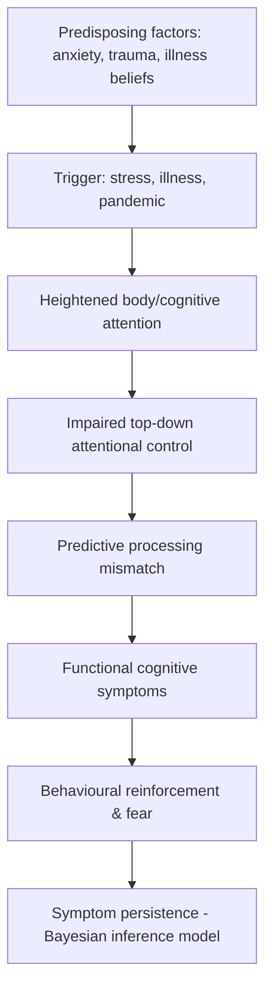
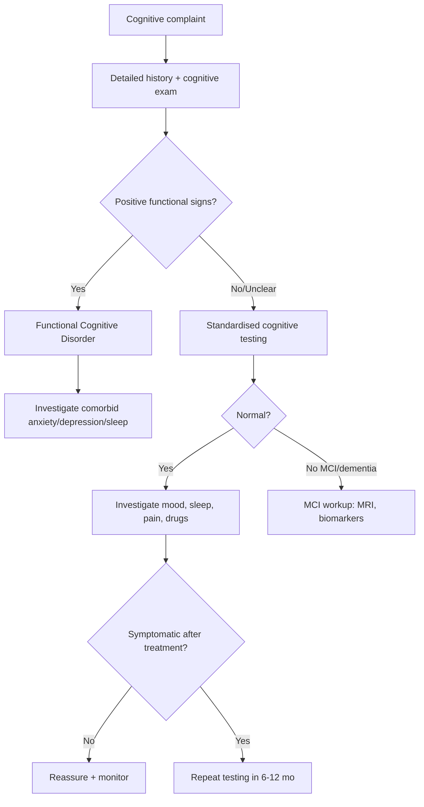
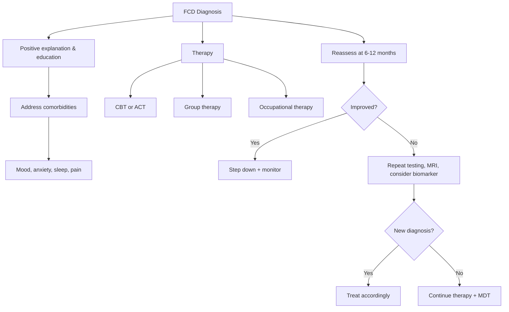
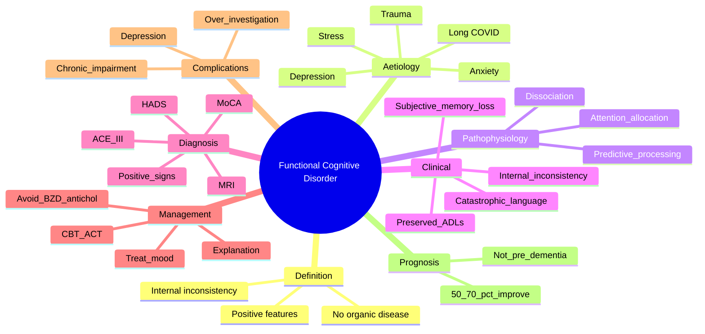

# Functional Cognitive Disorders

> [!tip] **Definition (DSM-5 / Stone 2020)**
> Subjective and/or objective cognitive complaints (memory, concentration, "brain fog") **inconsistent with recognised neurological disease**, with clinical features pointing to a **functional (psychogenic, non-organic) origin**. A diagnosis in its own right — not a diagnosis of exclusion.

> [!tip] **Key Distinction**
> Functional cognitive disorder (FCD) is the **commonest cause of memory complaints in patients <60 years** attending memory clinics (up to 30-50%). Differentiate from dementia, MCI, depression-pseudodementia, and dissociative amnesia by **positive functional features** (not just exclusion).

## 1. Definition / Epidemiology / Classification

### Definition
A cognitive disorder in which there is **inconsistency between subjective complaints, observed performance, and standardised testing** (internal inconsistency), with positive evidence of incongruence with neurological disease (e.g., selective amnesia, attentional capture by symptoms, learned behavioural patterns) and **no evidence of underlying neurodegenerative, vascular, traumatic, metabolic, or other primary CNS pathology** sufficient to explain the deficit.

### Epidemiology
- **Prevalence:** 25-40% of new memory-clinic attendees <60 years (Schmidtke 2009; Stone BMJ 2020)
- **Age:** Peak 30-50 years; bimodal — also rises in elderly alongside subjective cognitive decline
- **Sex:** F > M (2-3:1)
- **Co-morbidities:** Anxiety (60-80%), depression (40-60%), functional somatic syndromes (IBS, fibromyalgia, chronic pain), other FNDs
- **Risk factors:** Recent life stress, illness episode, pain, "long COVID brain fog", health anxiety, secondary gain, dissociation, childhood adversity

### Classification
| Type | Key Features | Notes |
|------|-------------|-------|
| **Functional Memory Disorder (FMD)** | Subjective memory loss, normal objective memory | Most common; memory clinic attendees |
| **Dissociative Amnesia** | Selective forgetting of personally significant events/trauma | Localised (specific event), generalised (whole life), systematised (category) |
| **Functional Cognitive Presentations with "Brain Fog"** | Poor concentration, slowed processing, word-finding | Long COVID, post-viral, post-ICU, menopause, ME/CFS |
| **Mild Cognitive Impairment (MCI) vs FCD** | MCI = measurable objective deficit on ≥1 domain, preserved ADL | FCD has internal inconsistency, normal or inconsistent testing |
| **"Dementia Fear" / Illness Anxiety** | Preoccupation with cognitive decline despite normal testing | Drives repeated presentations |

---

## 2. Aetiology / Pathophysiology

### Aetiology
- **Psychological:** Anxiety, depression, PTSD, dissociation, illness anxiety, somatisation
- **Stress-related:** Recent life event, occupational burnout, "brain fog" post-viral/post-ICU
- **Neurological comorbidities:** Migraine, fibromyalgia, chronic pain (shared central sensitisation)
- **Functional / Predisposing:** Childhood adversity, alexithymia, maladaptive illness beliefs, secondary gain
- **Misattribution:** Normal age-related lapses, post-chemotherapy "chemo-fog", menopause
- **Behavioural:** Catastrophising, hypervigilance, attention-allocation to symptoms

### Pathophysiology

### Molecular / Cognitive Basis
- **Predictive processing model:** Bayesian brain — top-down priors dominate over bottom-up sensory evidence
- **Attention-allocation model:** Working memory resources diverted to symptom monitoring
- **Dissociation model:** Compartmentalisation of autobiographical memory
- **Stress / HPA axis:** Cortisol effects on hippocampal function
- **Biomarkers:** None specific; research functional MRI shows altered fronto-limbic / default-mode network connectivity

---

## 3. Clinical Features

### History
- **Onset:** Often acute or subacute, often dateable to a trigger (illness, stress)
- **Subjective complaints:** Often dramatic, "my memory is gone", "I can't remember anything"
- **Internal inconsistency:** Reports forgetting recent events but remembers birthday; "forgets" grandchildren's names but recalls new passwords
- **Attentional:** Difficulty concentrating, word-finding, "brain fog"
- **Mood:** Anxiety (drives catastrophising), low mood, anhedonia
- **Functional impact:** Variable — often preserved in key domains despite complaints (drives, manages finances, works)
- **Triggers:** Stress, fatigue, sleep deprivation, illness, screen time

### Examination (Cognitive & Neurological)
| Domain | Functional Features | Differentiating from Dementia |
|--------|---------------------|---------------------------------|
| **Attention** | "Lost" within 5 min — inconsistent | Stable, progressive decline |
| **Memory (recall)** | Intrusion errors, "I don't know" responses, near-miss answers | Patchy then worse; no insight |
| **Orientation** | Preserved (or 1/10 wrong) | Disoriented in time/place later stages |
| **Language** | Word-finding pauses, normal naming | Anomia, paraphasias |
| **Praxagnosia** | Preserved | Lost early in posterior cortical atrophy |
| **Effort signs** | "Don't know" answers, marked variability | Genuine near-miss with prompting |
| **Behaviour** | Distressed by symptoms, focused on deficit | Anosognosia early; depression common later |

### Positive Features (Stone et al. BMJ 2020)
- **"I used to have a good memory"** — heavy emphasis on past vs present
- **Discrepancy** between reported severity and observed function (manages phone, banking, diary)
- **Catastrophic language** ("It's getting worse", "I'm going to end up in a home")
- **Selective forgetting** — not random; "forgets" embarrassing/stressful items
- **Hypervigilance to lapses** — every forgotten name = evidence
- **Checking behaviour** — asking family repeatedly, leaving reminders
- **Belief of dementia** despite normal test results

### Associated Findings
- Other functional symptoms: chronic pain, IBS, fibromyalgia, fatigue
- Anxiety/panic (especially during testing)
- Dissociative symptoms: derealisation, depersonalisation
- Mood symptoms: low mood, anhedonia
- "Brain fog" co-occurring with autonomic dysfunction (POTS, long COVID, ME/CFS)

---

## 4. Diagnostic Approach / Algorithm

### Diagnostic Criteria (Schmidtke 2009 / Stone 2020)
| Criterion | Detail |
|-----------|--------|
| **Memory complaint** | Self-reported cognitive decline (memory, concentration, "brain fog") |
| **Objective testing** | Normal or above-expected for age on standardised tests |
| **Positive features** | Internal inconsistency, selective deficits, hypervigilance, preserved function |
| **No organic disease** | No neurodegenerative, vascular, traumatic, metabolic, drug-related cause |
| **Functional impairment** | Often present, can be variable |
| **Mood screen** | Anxiety/depression common but NOT the sole explanation |

### Severity / Staging
| Tool | Use |
|------|-----|
| **Addenbrooke's Cognitive Examination III (ACE-III)** | Differentiate from MCI/dementia |
| **MoCA** | Brief screening, sensitive to MCI |
| **Hospital Anxiety & Depression Scale (HADS)** | Comorbid mood |
| **Patient Health Questionnaire (PHQ-15)** | Somatic symptom burden |
| **Trauma History Questionnaire** | Predisposing factors |
| **Dissociative Experiences Scale (DES-II)** | Dissociation screen |

---

## 5. Investigations

### First-Line
| Investigation | Indication | Expected Finding |
|---------------|------------|------------------|
| **Cognitive screen (ACE-III / MoCA)** | All memory complaints | Normal or inconsistent |
| **Anxiety/Depression (HADS / PHQ-9 / GAD-7)** | All | Often elevated |
| **B12, Folate, TSH, Calcium, Vitamin D** | Reversible causes | Normal |
| **FBC, U&E, LFT, Glucose, HbA1c** | Routine | Normal |
| **Drug/alcohol screen** | Suspicion | Negative |

### Neuroimaging
| Modality | Indication | Findings | Protocol |
|----------|------------|----------|----------|
| **MRI brain** | Atypical features, age <50, focal signs, diagnostic doubt | Normal; may show non-specific white matter changes | T1, T2, FLAIR, DWI, SWI (atrophy grading) |
| **CT head** | Not routine; only if MRI unavailable or rapid exclusion of mass | Normal | Non-contrast |

### Neurophysiology
| Test | Indication | Findings |
|------|------------|----------|
| **EEG** | Suspicion of seizures / encephalopathy | Normal |
| **Quantitative EEG** | Research | Altered fronto-parietal networks |

### CSF / Laboratory
| Test | Indication | Expected |
|------|------------|----------|
| **Lumbar puncture** | Atypical / rapidly progressive / suspected AD/CJD/autoimmune | Normal; AD biomarkers negative |
| **Aβ42/40, t-tau, p-tau** | Suspected AD | Normal in FCD |
| **14-3-3, RT-QuIC** | Suspected CJD | Negative |

### Neuropsychology
- **Gold standard for distinguishing FCD from MCI/dementia** (early)
- Profile: variable scores, intra-test inconsistencies, low effort indices if somatoform, but preserved encoding with high distractibility

---

## 6. Differential Diagnosis

| Differential | Distinguishing Features | Key Test |
|--------------|-------------------------|----------|
| **Alzheimer's disease (AD)** | Progressive episodic memory loss, hippocampal atrophy, biomarkers +ve | MRI (MTL atrophy), CSF Aβ/tau, PET |
| **Vascular dementia** | Stepwise, focal deficits, vascular risk factors | MRI white matter changes (Fazekas) |
| **Frontotemporal dementia** | Behavioural / language early, <65 yrs | MRI frontal/temporal atrophy, FTLD panel |
| **Lewy body dementia** | Visual hallucinations, parkinsonism, fluctuating cognition | DaTscan, FP-CIT SPECT |
| **Mild cognitive impairment (MCI)** | Objective deficit ≥1 domain, preserved ADL | Neuropsychology |
| **Depression / Pseudodementia** | Mood symptoms, "I don't know" answers, slowed | HADS, MADRS, treat depression |
| **Dissociative amnesia** | Selective, autobiographical; triggered by trauma | DES-II, trauma history |
| **Long COVID / ME/CFS "brain fog"** | Post-viral, with fatigue, PEM, autonomic | Post-exertional malaise, 6-min walk |
| **Delirium** | Acute onset, fluctuating, inattention, medical cause | CAM, ABCDE, metabolic screen |
| **Medication / drug-induced** | Benzodiazepines, anticholinergics, opioids, chemotherapy | Drug history, withdraw, retest |

---

## 7. Management

### Acute / Crisis Management
| Situation | Action |
|-----------|--------|
| **Patient terrified of dementia** | Validate symptoms; provide positive diagnosis ("your brain is fine") |
| **Severe anxiety driving symptoms** | CBT, anxiolytic, slow breathing |
| **Significant mood disorder** | Treat with SSRI/SNRI, refer psychiatry |

### Disease-Modifying / Chronic Management
| Approach | Indication | Detail | Evidence |
|----------|------------|--------|----------|
| **Explanation / Reattribution** | All | "Software not hardware" model; positive functional diagnosis | Stone 2020 |
| **Cognitive Behavioural Therapy (CBT)** | All | Cognitive restructuring of catastrophic beliefs, attention training | RCT evidence (McWhirter 2020) |
| **Acceptance & Commitment Therapy (ACT)** | Alternative to CBT | Defusion from cognitive symptoms | Growing evidence |
| **Mindfulness-based CBT (MBCT)** | Anxiety-driven | Reduces rumination, attentional capture | NICE guidance for anxiety |
| **Occupational therapy** | Functional impact | Strategy training, pacing | Useful adjunct |
| **Group therapy** | Common in clinic cohorts | Education + CBT | Stone group model |

### Symptomatic Management
| Symptom | First-line | Second-line | Refractory |
|---------|------------|-------------|------------|
| **"Brain fog"** | Sleep hygiene, exercise, pacing | CBT, modafinil (off-label) | Long COVID clinic referral |
| **Memory lapses** | External aids (phone, diary, lists) | Strategy training | OT, neuropsychology |
| **Word-finding** | Reassurance, slow speech | Speech & language therapy | Anomia clinic (rare) |
| **Anxiety** | CBT, relaxation | SSRI (sertraline, escitalopram) | Buspirone, referral |
| **Low mood** | CBT | SSRI/SNRI (mirtazapine if sleep) | Specialist referral |
| **Sleep disturbance** | Sleep hygiene, CBT-I | Melatonin, short hypnotic | Sleep clinic |

### Rehabilitation / Multidisciplinary
| Domain | Intervention |
|--------|--------------|
| **Neuropsychology** | Profile, reassurance, CBT |
| **Occupational therapy** | Strategy training, pacing |
| **Speech therapy** | Word-finding, communication strategies |
| **Physiotherapy** | For comorbid functional disorders |
| **Psychiatry** | Comorbid depression, anxiety, PTSD |
| **GP / Long-term follow-up** | Monitor for re-emergence of neurodegenerative disease |

### Management Algorithm

### Special Populations
- **Pregnancy:** CBT first-line; avoid benzodiazepines; consider psychological therapy for perinatal anxiety
- **Elderly:** Beware coexisting neurodegenerative disease; monitor for progression; treat depression
- **Children/Adolescents:** Often post-viral; family-based CBT; reassure
- **Long COVID:** Multidisciplinary long COVID clinic; pacing, autonomic rehab

---

## 8. Drug Interactions / Cautions

| Drug | Caution | Management |
|------|---------|------------|
| **Benzodiazepines** | Cognitive side effects worsen "brain fog" | Avoid; use CBT instead |
| **Anticholinergics** | Worsen cognitive complaints | Avoid (oxybutynin, TCAs) |
| **Opioids** | Sedation, cognitive blunting | Minimise; treat pain via other routes |
| **Gabapentinoids** | Cognitive slowing, dizziness | Avoid; ineffective for FCD |
| **SSRIs** | Initial anxiety, sleep disturbance | Start low, slow titration |
| **Modafinil (off-label)** | May help brain fog | Specialist initiation; monitor BP |

---

## 9. Procedures
- **No specific procedural interventions** in FCD
- **Avoid invasive procedures** (LP, biopsy) unless red flags
- **Neuropsychology** as the "investigation of choice" for diagnostic clarification

---

## 10. Complications

| Complication | Frequency | Prevention / Management |
|--------------|-----------|-------------------------|
| **Chronic functional impairment** | Common | Early CBT, OT |
| **Depression / Anxiety** | 40-60% | Treat mood disorder |
| **Iatrogenic harm** (over-investigation) | Common | Avoid repeated MRI, LP without change in features |
| **Unnecessary medication** | Common | Avoid benzodiazepines, antipsychotics |
| **Misdiagnosis of dementia** | Uncommon but serious | Monitor at 6-12 months, repeat testing |
| **Workplace disability** | Variable | OT, occupational support |

---

## 11. Red Flags

| Red Flag | Action |
|----------|--------|
| **Rapidly progressive cognitive decline (<6 months)** | Urgent MRI, CSF (CJD, autoimmune) |
| **Focal neurological signs** | Urgent MRI, vascular workup |
| **New behavioural/personality change** | FTD screen, MRI |
| **Visual hallucinations, parkinsonism** | DLB screen, DaTscan |
| **Seizures, myoclonus** | EEG, CJD screen |
| **Autoimmune features** | CSF, antibody panel (anti-NMDA, LGI1) |
| **B12 / TSH / syphilis / HIV positive** | Treat cause, re-test cognition |
| **Family history early-onset dementia** | Genetic counselling, screen |
| **Suicidal ideation (related to fear of dementia)** | Psychiatric assessment |

---

## 12. Prognosis

| Factor | Good Prognosis | Poor Prognosis |
|--------|----------------|----------------|
| **Symptom duration** | <1 year | >2 years |
| **Mood disorder** | Treated | Refractory |
| **Insight** | Present | Absent |
| **Comorbid FND** | Absent | Multiple |
| **Life stressors** | Addressed | Persistent |
| **Workplace support** | Good | Disabled / pending litigation |
| **Age** | <60 | >75 (coexisting risk) |

- **Natural history:** Generally stable; small minority (~5-10%) develop dementia at 5-10 years (especially if biomarkers borderline)
- **Recovery:** 50-70% improve with CBT and explanation
- **Risk of dementia:** Similar to age-matched population (NEJM 2023, Slot et al.)

---

## 13. Topic Correlation

| Related Topic | Link | Key Overlap |
|---------------|------|-------------|
| **Functional Neurological Disorders** | [[FND Hub]] | Shared mechanism, overlap with functional seizures, weakness |
| **Mild Cognitive Impairment** | [[Dementia Workup]] | Differentiation is the diagnostic challenge |
| **Dementia subtypes** | [[Alzheimer's Disease]], [[DLB]], [[FTD]] | Positive functional signs rule these out |
| **Depression Pseudodementia** | [[Depression]] | Common differential |
| **Long COVID Brain Fog** | [[Long COVID]] | Same phenotype in post-viral |
| **Dissociative Amnesia** | [[Dissociative Disorders]] | Trauma-related selective amnesia |

---

## 14. Special Situations

| Situation | Consideration |
|-----------|---------------|
| **Pregnancy** | CBT first; avoid benzodiazepines; consider perinatal mental health team |
| **Paediatric** | Post-viral common; family CBT; school support |
| **Elderly** | Beware co-existing neurodegenerative disease; monitor at 6-12 mo |
| **Renal/hepatic impairment** | Avoid gabapentinoids; SSRI dose adjustment |
| **Immunocompromised** | Consider PML, HIV, autoimmune encephalitis |
| **Occupational** | OT, vocational rehab; phased return |
| **Driving (DVLA)** | No mandatory cessation if diagnosis FCD alone; review if comorbid dementia |
| **Insurance / Medicolegal** | Document positive functional diagnosis; avoid over-labelling |

---

## FCPS/MRCP High-Yield Summary

| Category | Key Points |
|----------|------------|
| **Definition** | Cognitive complaint with internal inconsistency, no underlying organic disease; positive diagnosis |
| **Epidemiology** | 25-40% of <60 yr memory clinic attendees; F>M; often with anxiety/depression |
| **Pathophysiology** | Predictive processing (Bayesian); attention-allocation; dissociation |
| **Clinical** | Subjective memory loss > objective deficit; internal inconsistency; preserved ADLs; catastrophic language |
| **Diagnosis** | Positive functional features + normal cognition + no organic disease |
| **Investigations** | Cognitive testing (ACE-III, MoCA), HADS, B12/TSH, MRI (to rule out organic) |
| **Management** | **Explanation ("software not hardware")**; CBT/ACT; treat mood/sleep |
| **Drugs** | Avoid benzodiazepines, anticholinergics, gabapentinoids |
| **Complications** | Chronic impairment, over-investigation, depression |
| **Prognosis** | 50-70% improve with CBT; not pre-dementia in most cases |
| **Viva Pearls** | "Positive functional diagnosis" not exclusion; brain fog ≠ dementia; avoid LP/MRI repeating |
| **Scales** | HADS, MoCA, ACE-III, DES-II, PHQ-15 |
| **Imaging** | MRI normal; no atrophy pattern |
| **Genetics** | APOE irrelevant unless AD suspected |

---

## Viva Questions (PACES/FCPS Style)

1. **Q:** What is functional cognitive disorder?
   **A:** Cognitive complaints (memory, concentration) with positive functional features and no underlying neurological disease. Common in <60 yr memory clinics.

2. **Q:** Positive features distinguishing FCD from dementia?
   **A:** Internal inconsistency, preserved ADLs despite severe complaints, catastrophic language, "I don't know" answers, hypervigilance to lapses.

3. **Q:** Investigations in suspected FCD?
   **A:** Cognitive testing (ACE-III, MoCA), mood screen (HADS), routine bloods (B12, TSH), MRI brain if atypical; avoid LP/biomarkers unless red flag.

4. **Q:** First-line management of FCD?
   **A:** Positive explanation ("software not hardware") + CBT; treat comorbid mood/sleep.

5. **Q:** Why avoid benzodiazepines in FCD?
   **A:** They worsen cognitive symptoms, mask anxiety, cause dependence, and reinforce illness beliefs.

6. **Q:** Differentiate FCD from depression-related pseudodementia?
   **A:** Both have mood symptoms; pseudodementia has prominent low mood, "I don't know" answers, recovers with antidepressants; FCD has internal inconsistency, preserved function.

7. **Q:** How to explain the diagnosis to a patient?
   **A:** Use the software/hardware analogy — your brain is structurally fine; the issue is the way attention and memory are being processed, and this is reversible.

8. **Q:** What proportion of memory clinic attendees have FCD?
   **A:** 25-40% in those under 60.

9. **Q:** When should you suspect underlying dementia in FCD?
   **A:** Red flags: rapid progression, focal signs, behavioural change, hallucinations, parkinsonism, biomarker positivity.

10. **Q:** Long COVID brain fog — same as FCD?
    **A:** Similar phenotype; may be functional component + post-viral cognitive dysfunction; managed with pacing, CBT, autonomic rehab.

11. **Q:** Role of neuropsychology?
    **A:** Gold standard for distinguishing FCD from MCI/dementia early; profile shows internal inconsistency, preserved encoding, attention deficits.

12. **Q:** Prognosis of FCD?
    **A:** 50-70% improve with CBT; not a pre-dementia state in most; small minority progress (often with positive biomarkers at baseline).

---

## Common Confusions / Exam Traps

| Confusion | Clarification |
|-----------|---------------|
| **FCD vs MCI** | MCI = objective deficit on ≥1 domain; FCD = subjective > objective, inconsistency |
| **FCD vs Pseudodementia** | Pseudodementia = depression mimicking dementia, improves with antidepressants; FCD has positive functional signs, often anxiety |
| **"Soft" vs positive functional diagnosis** | Functional is POSITIVE diagnosis, not exclusion |
| **"Normal memory test = no problem"** | Subjective cognitive decline can be valid; check internal consistency |
| **Brain fog = dementia** | Brain fog is a symptom, not a diagnosis; treat cause (sleep, mood, post-viral, FCD) |
| **MRI atrophy = dementia** | Age-related atrophy common; correlation with clinical picture essential |
| **Anticholinergics safe in FCD** | They worsen symptoms; review medication |
| **Benzodiazepines for anxiety in FCD** | Worsen cognition; use SSRI/CBT |

---

## Mnemonics

1. **SOFTWARE vs HARDWARE** — FCD = software (processing), not hardware (structure)
2. **"I USED TO"** — Patient emphasises past good memory → functional feature
3. **DON'T KNOW responses** — Catastrophic "I don't know" = functional (vs near-miss in dementia)
4. **INCONSISTENT** — Internal inconsistency is the diagnostic hallmark
5. **"CAT-CHECKING"** — **C**atastrophic language, **A**nxious, **T**esting repeatedly, **C**hecking with family

---

## Mind Map

---

## One-Page Revision Card

| **Topic** | **Functional Cognitive Disorder** |
|-----------|-----------------------------------|
| **Definition** | Cognitive complaint with internal inconsistency, no organic cause, positive functional features |
| **Key Clinical** | Subjective >> objective deficit; preserved ADLs; catastrophic; "I used to" |
| **Diagnosis** | Positive functional features + normal ACE-III/MoCA + no organic disease |
| **Differentials** | MCI, AD, VaD, FTD, DLB, Pseudodementia, Dissociative amnesia |
| **Investigations** | Cognitive tests (ACE-III, MoCA), HADS, B12/TSH, MRI if atypical |
| **Management** | Explanation ("software vs hardware") + CBT/ACT + treat mood/sleep |
| **Avoid** | Benzodiazepines, anticholinergics, gabapentinoids, repeated MRI/LP |
| **Prognosis** | 50-70% improve; not pre-dementia in most |

---

## MCQs (10)

1. **Question:** What is the proportion of patients under 60 attending memory clinics with functional cognitive disorder?
   **Options:** A. <5% B. 10% C. 25-40% D. >70%
   **Answer:** C
   **Explanation:** 25-40% of <60 yr memory clinic attendees have FCD (Schmidtke 2009, Stone 2020).

2. **Question:** Which feature supports a positive diagnosis of FCD rather than dementia?
   **Options:** A. Progressive episodic memory loss B. Internal inconsistency in testing C. Hippocampal atrophy on MRI D. CSF Aβ42/40 positive
   **Answer:** B
   **Explanation:** Internal inconsistency and preserved ADLs are positive functional features. A, C, D point to organic dementia.

3. **Question:** Best explanation model for FCD?
   **Options:** A. Hardware failure B. Software/processing problem C. Neurodegeneration D. Vascular damage
   **Answer:** B
   **Explanation:** "Software not hardware" — brain structurally intact but attention/memory processing dysfunctional.

4. **Question:** First-line psychological therapy for FCD?
   **Options:** A. Psychoanalysis B. CBT / ACT C. ECT D. Hypnosis
   **Answer:** B
   **Explanation:** CBT and ACT have best evidence for FCD (McWhirter 2020, NICE).

5. **Question:** Which medication should be AVOIDED in FCD?
   **Options:** A. SSRI B. CBT C. Benzodiazepines D. Melatonin
   **Answer:** C
   **Explanation:** Benzodiazepines worsen cognitive symptoms and cause dependence; not first-line in FCD.

6. **Question:** ACE-III score of 95 in a 45-year-old with severe memory complaints suggests:
   **Options:** A. Alzheimer's disease B. Functional cognitive disorder C. Vascular dementia D. DLB
   **Answer:** B
   **Explanation:** High score with severe complaints = internal inconsistency → FCD.

7. **Question:** Most common comorbidity in FCD?
   **Options:** A. Parkinson's disease B. Anxiety / depression C. Multiple sclerosis D. Migraine with aura
   **Answer:** B
   **Explanation:** Anxiety (60-80%) and depression (40-60%) are common comorbidities.

8. **Question:** "Don't know" answers on cognitive testing are typical of:
   **Options:** A. Mild Alzheimer's B. Vascular dementia C. Functional cognitive disorder D. DLB
   **Answer:** C
   **Explanation:** Catastrophic "I don't know" responses (rather than near-miss) suggest FCD.

9. **Question:** Which test is gold standard for differentiating early FCD from MCI?
   **Options:** A. Routine 20-min EEG B. MRI only C. Detailed neuropsychology D. CT head
   **Answer:** C
   **Explanation:** Detailed neuropsychology shows preserved encoding + intra-test inconsistency in FCD.

10. **Question:** Does FCD increase future dementia risk?
    **Options:** A. Doubles risk B. No increase in most cases C. Always progresses D. Risk only in APOE4
    **Answer:** B
    **Explanation:** FCD is not a pre-dementia state in most; small minority with positive biomarkers may progress.

---

## SBA Questions (10)

1. **Scenario:** A 38-year-old woman presents with 6-month history of severe memory loss following a workplace stress event. She manages her own bank accounts, drives, and works full-time. ACE-III 96/100. HADS: anxiety 14, depression 8. What is the most likely diagnosis?
   **Options:** A. Alzheimer's disease B. Functional cognitive disorder C. Mild cognitive impairment D. Depression-pseudodementia
   **Answer:** B
   **Explanation:** Internal inconsistency (severe subjective vs preserved function + normal ACE-III) + anxiety + post-stress trigger = FCD.

2. **Scenario:** A 45-year-old man with FCD starts sertraline for comorbid anxiety. He reports ongoing brain fog. What medication review is most important?
   **Options:** A. Add modafinil B. Review anticholinergic load + avoid benzodiazepines C. Switch to valproate D. Start methylphenidate
   **Answer:** B
   **Explanation:** Avoid anticholinergics, benzodiazepines, gabapentinoids in FCD — they worsen brain fog.

3. **Scenario:** A 32-year-old woman with long COVID and brain fog. She has fatigue, post-exertional malaise, and orthostatic intolerance. What is the most appropriate first step?
   **Options:** A. Diagnose functional cognitive disorder and discharge B. Refer to long COVID clinic for pacing and autonomic assessment C. Start antipsychotic D. Repeat MRI brain
   **Answer:** B
   **Explanation:** Multidisciplinary long COVID clinic with pacing, autonomic rehab, CBT for brain fog.

4. **Scenario:** A 50-year-old with FCD presents with new visual hallucinations, fluctuating cognition, and parkinsonism. What investigation is most appropriate?
   **Options:** A. Repeat ACE-III B. DaTscan (FP-CIT SPECT) C. Sleep study D. EEG
   **Answer:** B
   **Explanation:** Triad suggests DLB; DaTscan supports diagnosis.

5. **Scenario:** A 40-year-old with FCD is started on CBT. What does CBT target in FCD?
   **Options:** A. Underlying trauma B. Catastrophic illness beliefs and attentional patterns C. Dopamine D. Acetylcholine
   **Answer:** B
   **Explanation:** CBT targets catastrophic illness beliefs, attentional capture, maladaptive coping.

6. **Scenario:** A 35-year-old with FCD and severe illness anxiety repeatedly requests MRI brain. What is the most appropriate response?
   **Options:** A. Repeat MRI to reassure B. Order MRI with contrast C. Validate symptoms, explain diagnosis, avoid repeat imaging D. Refer for biopsy
   **Answer:** C
   **Explanation:** Positive explanation ("software not hardware") + reassurance; avoid iatrogenic over-investigation.

7. **Scenario:** A 60-year-old previously diagnosed with FCD returns with progressive memory loss over 18 months. New ADL difficulties. What is the most appropriate next step?
   **Options:** A. Reassure — FCD is stable B. Repeat cognitive testing, MRI, consider CSF biomarkers C. Discharge to GP D. Increase CBT
   **Answer:** B
   **Explanation:** New progression = red flag; re-evaluate for neurodegenerative disease.

8. **Scenario:** A 28-year-old with FCD develops selective amnesia for a traumatic event. What is the most likely diagnosis?
   **Options:** A. Dissociative amnesia B. Transient global amnesia C. TGA D. Epilepsy
   **Answer:** A
   **Explanation:** Selective autobiographical amnesia after trauma = dissociative amnesia; trauma-focused therapy.

9. **Scenario:** A 50-year-old with FCD asks about driving. What is the DVLA advice?
   **Options:** A. Stop driving B. Notify DVLA C. No mandatory cessation for FCD alone; review if comorbid dementia D. Suspend licence
   **Answer:** C
   **Explanation:** FCD alone does not require driving cessation. Notify if comorbid dementia or seizures.

10. **Scenario:** A 42-year-old with FCD and depression is started on mirtazapine. What is the additional benefit?
    **Options:** A. Improves memory B. Helps sleep and appetite; treats depression C. Worsens brain fog D. Causes anxiety
    **Answer:** B
    **Explanation:** Mirtazapine helps sleep, appetite, mood — useful in FCD with comorbid depression.

---

## Flashcards

- **Q:** Definition of FCD?
  **A:** Cognitive complaint with internal inconsistency and no organic cause; positive functional diagnosis
- **Q:** Proportion of <60 yr memory clinic attendees with FCD?
  **A:** 25-40%
- **Q:** Most common comorbidities in FCD?
  **A:** Anxiety (60-80%) and depression (40-60%)
- **Q:** "Software not hardware" — what does it mean?
  **A:** Brain structurally fine; problem is in processing/attention
- **Q:** First-line treatment for FCD?
  **A:** Explanation + CBT/ACT; treat comorbid mood/sleep
- **Q:** Drugs to AVOID in FCD?
  **A:** Benzodiazepines, anticholinergics, gabapentinoids, opioids
- **Q:** Best investigation to differentiate FCD from MCI?
  **A:** Detailed neuropsychology
- **Q:** Do FCD patients progress to dementia?
  **A:** Most do not; small minority with positive biomarkers may
- **Q:** Cognitive screen in suspected FCD?
  **A:** ACE-III or MoCA (often normal)
- **Q:** Mood screen in FCD?
  **A:** HADS, PHQ-9, GAD-7

---

## Answer Key

### MCQs
1. **C** — 25-40% of <60 yr memory clinic
2. **B** — Internal inconsistency
3. **B** — Software not hardware
4. **B** — CBT/ACT
5. **C** — Benzodiazepines worsen cognition
6. **B** — High score + severe complaints = FCD
7. **B** — Anxiety/depression most common
8. **C** — "Don't know" answers typical
9. **C** — Detailed neuropsychology gold standard
10. **B** — No increase in most

### SBAs
1. **B** — Internal inconsistency + preserved ADLs + anxiety
2. **B** — Avoid anticholinergics + BZD
3. **B** — Long COVID clinic
4. **B** — DLB screen with DaTscan
5. **B** — Catastrophic beliefs/attention
6. **C** — Validate, explain, avoid repeat imaging
7. **B** — Red flag; re-investigate
8. **A** — Dissociative amnesia (selective, trauma)
9. **C** — No mandatory DVLA notification for FCD alone
10. **B** — Sleep, appetite, mood benefit

---

## Local Navigation
**Heading Hub:** [[15_Functional_Neurological_Disorders/FND Hub]]  
**Topic-Group Hub:** [[15_Functional_Neurological_Disorders/Functional Neurological Disorders Hub]]  
**Chapter Hierarchy:** [[Davidson Chapter 25 - Neurology Hierarchy]]  
**Chapter MOC:** [[Neurology MOC]]  
**Drug Reference:** [[00_Index/Neurology Drug Reference]]
