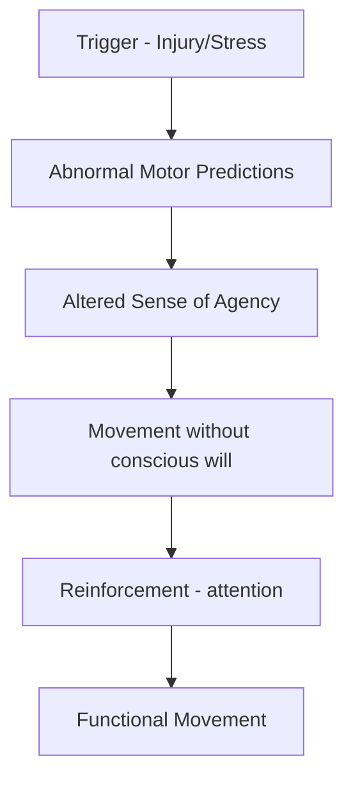
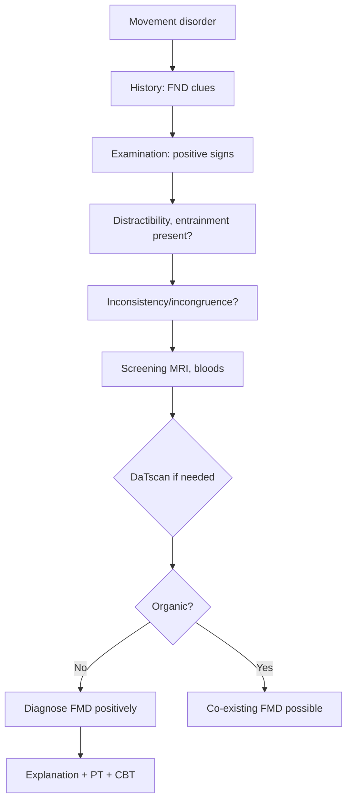

# Functional Movement Disorders

> [!tip] **Definition**
> **Functional Movement Disorders (FMD)** — abnormal movements (tremor, dystonia, gait disorder, myoclonus, tics) **incompatible with recognised movement disorder**, demonstrated by **positive bedside signs of incongruence, inconsistency, or distractibility**.

> [!tip] **Core Principle**
> Diagnosis is made POSITIVELY by demonstrating **distractibility, entrainment, variability**, NOT by exclusion. Common — **3-20% of movement disorder clinic patients**; second most common functional neurological presentation after weakness.

## 1. Definition / Epidemiology / Classification

### Definition
- Hyperkinetic or hypokinetic movement disorders caused by FND
- **Inconsistency** (varies over time, position, task)
- **Incongruence** (doesn't match classic patterns)
- **Distractibility** (improves/absent with distraction)
- **Entrainment** (matches examiner's pace)

### Epidemiology
- **Prevalence:** 3-20% of movement disorder referrals
- **F:M:** 2-3:1
- **Age:** 30-50 (peak 40s)
- **Onset:** Often sudden (60%)
- **Risk factors:** Trauma, illness, surgery, FND history, anxiety/depression
- **Comorbidities:** Pain (70%), fatigue, other FNDs, dissociative

### Classification (Fahn-Williams)
| Type | Distinguishing | Positive Sign |
|------|----------------|---------------|
| **Documented** | Persistent, incongruent, distractible | All 3 present |
| **Clinically established** | Incongruent + distractible | 2 of 3 |
| **Probable** | Incongruent OR distractible | 1 of 3 |
| **Possible** | Inconsistent with organic | 1 of 3 |

## 2. Aetiology / Pathophysiology

### Aetiology
- **Predisposing:** Female, anxiety, prior FND, illness model
- **Precipitating:** Physical injury (often minor), surgery, stress, panic
- **Perpetuating:** Attention, fear-avoidance, catastrophising

### Pathophysiology

- **Bayesian brain model:** Mismatch between predicted and actual movement
- **fMRI:** Altered SMA-premotor connectivity; increased amygdala activation
- **Hypocretin/orexin** dysfunction
- **Dissociation** of agency

## 3. Clinical Features

### Tremor (Most Common — 40-50% of FMD)

#### Positive Signs
- **Distractibility:** Tremor stops/disappears with concentration (e.g., serial 7s)
- **Entrainment:** Tremor changes frequency to match voluntary movement in opposite limb
- **Variability:** Frequency/amplitude changes with position, task
- **Inconsistency:** Tremor present in one position, absent in another
- **Co-activation sign:** Voluntary tapping of opposite hand at same frequency
- **Tremor in different body parts** simultaneously (organic usually unilateral)
- **Whack-a-mole sign:** Tremor disappears in one limb, appears in another

#### Incongruence
- **Variable direction** (organic: usually consistent)
- **Frequency change with loading** (organic: reduced)
- **No true rest tremor** in functional (organic PD: present at rest)

### Dystonia (20% of FMD)
- **Fixed dystonia** in adult (functional often, organic rare)
- **Inconsistency** (variable patterns)
- **Incongruence** (no sensory tricks, no task-specificity)
- **Distractibility**
- **Co-contraction** of agonists/antagonists

### Gait Disorder
- **Dragging monoplegic gait** (whole leg dragged, not circumducting)
- **Excessively slow** with buckling knees
- **"Walking on ice"** cautious gait
- **Sudden knee buckling** (consistent with no falls — patient catches self)
- **Tremor of trunk/limbs** that disappears when walking
- **"Chair test"** — can stand/move legs when seated (not paretic)

### Myoclonus
- **Variable** in frequency, distribution
- **Distractibility** (stops with mental task)
- **Stimulus-sensitive** to non-physiological triggers
- **Inconsistent** with known CNS patterns

### Other
- **Functional parkinsonism** (slowness, tremor but no true bradykinesia)
- **Tic-like** movements (more complex, no premonitory urge)
- **Speech:** stuttering, dysphonia (functional)

## 4. Diagnostic Approach

### Fahn-Williams Criteria (FMD)
- **Incongruence with classical movement disorder** (e.g., mixed rest/postural/intention tremor)
- **Other movement patterns** (e.g., whack-a-mole)
- **Excessive slowness/hesitancy**
- **"Humorous" movements** (e.g., "popping" gait)

### Red Flags for Organic
- **True rest tremor** with rigidity (PD)
- **Pill-rolling** tremor (PD)
- **Sustained true dystonia** in child (DYT1)
- **Progressive course**
- **Response to L-dopa** (PD)
- **No positive FND signs**

## 5. Investigations

| Investigation | Purpose | Expected (FMD) |
|---------------|---------|----------------|
| **MRI brain** | Exclude structural lesion | Normal |
| **DaTscan** | Differentiate from PD | Normal in FMD |
| **Copper, caeruloplasmin** | Wilson's | Normal |
| **Bloods:** TFT, CK, autoimmune | Exclude mimics | Normal |
| **EMG/polymyography** | Tremor/myoclonus analysis | Variable, inconsistent |
| **Accelerometry** | Tremor frequency analysis | Variable frequency |

## 6. Differential Diagnosis

| Condition | Distinguishing | Key Test |
|-----------|----------------|----------|
| **Parkinson's disease** | True rest tremor, rigidity, bradykinesia, asymmetric onset, L-dopa response | DaTscan, L-dopa trial |
| **Essential tremor** | Bilateral, postural, action, alcohol-responsive, family history | Tremor analysis |
| **Dystonia (organic)** | Sensory tricks, task-specific, sustained | Genetic testing (DYT1) |
| **Wilson's disease** | Wing-beating tremor, Kayser-Fleischer rings, age <40 | Copper, caeruloplasmin |
| **Myoclonus (organic)** | Cortical/subcortical patterns on EMG-EEG | Jerk-locked back-averaging |
| **Chorea (HD, Sydenham)** | Random, flowing, persistent | Genetic testing |
| **Tic (Tourette's)** | Premonitory urge, suppressible, complex | History |

## 7. Management

### Step 1: **Explanation** (KEY)
- Validate (real, not faked)
- Demonstrate distractibility positively
- "Hardware OK, software problem" — brain not damaged but functioning abnormally
- Address fear (e.g., "Not Parkinson's, not degenerating")
- Provide written info

### Step 2: **Physiotherapy** (FIRST-LINE for motor FMD)
- Distraction-based retraining
- Graded motor retraining
- Gait retraining
- Habituation techniques
- Avoid reinforcement of disability

### Step 3: **Psychological Therapy**
- CBT
- ACT
- EMDR for trauma

### Step 4: **Pharmacological**
- No specific drug for FMD
- Treat comorbidity: SSRI for depression/anxiety
- **Avoid:** dopamine agonists (no benefit; can worsen), benzodiazepines (dependency)
- Tetrabenazine (no benefit in FMD)

### Step 5: **Specialist FND MDT**
- Neurologist, PT, OT, psychologist
- Inpatient rehab for severe cases
- Outpatient FND programmes

### Step 6: **Other**
- **TMS** (transcranial magnetic stimulation) — emerging
- **Hypnosis**
- Group therapy
- Occupational therapy

## 8. Drug Cautions
- **Avoid dopaminergic drugs** (no benefit, side effects)
- **Avoid antipsychotics** unless psychosis (can worsen)
- **Avoid long-term benzodiazepines**
- SSRI: monitor SIADH in elderly
- Tetrabenazine: not indicated in FMD

## 9. Procedures
- **No procedures** for FMD
- Avoid DBS (no benefit, can worsen)
- Avoid lesional surgery

## 10. Complications
- Iatrogenic harm (inappropriate L-dopa, DBS)
- Chronic disability
- Secondary: contractures, falls
- Depression, suicide risk
- Lost work, healthcare costs

## 11. Red Flags / Emergencies
- **Suicidal ideation**
- **Sudden deterioration** (reconsider organic)
- **New signs** (rigidity, true bradykinesia — re-investigate)
- **Status dystonicus** (medical emergency — but rarely functional)
- **Aspiration** in functional dysphagia

## 12. Prognosis
- **~30-50% improve** with treatment
- **Good:** Acute onset, identifiable trigger, no comorbidity, engages PT
- **Poor:** Chronic (>2 years), severe psychiatric comorbidity, secondary gain, refusal of treatment

## 13. Topic Correlation
| Related Topic | Link | Key Overlap |
|---------------|------|-------------|
| Functional Weakness | [[Functional Weakness]] | Hoover's, same principles |
| Functional Visual Symptoms | [[Functional Visual Symptoms]] | OKN, tubular field |
| Parkinson's Disease | [[Parkinson's]] | Mimics FMD |
| Wilson's Disease | [[Wilson]] | Young onset tremor |

## 14. Special Situations
- **Pregnancy:** Avoid tetrabenazine; limit medications
- **Paediatric:** Family-based therapy; school support
- **Elderly:** Consider drug-induced, stroke mimics
- **Driving (DVLA):** Must notify if movement affects driving
- **Occupational:** Workplace assessment; graduated return

## FCPS/MRCP High-Yield Summary
| Category | Key Points |
|----------|------------|
| **Definition** | Movement disorder incompatible with organic; POSITIVE signs |
| **Epidemiology** | 3-20% movement disorder clinics; F:M 2-3:1; 30-50% tremor |
| **Pathophysiology** | Bayesian brain; abnormal sense of agency; SMA-premotor |
| **Clinical** | Sudden onset, distractibility, entrainment, variability, whack-a-mole |
| **Diagnosis** | POSITIVE signs (distractibility, entrainment, incongruence) — NOT exclusion |
| **Management** | Explanation + Distraction PT + CBT + SSRI for comorbidity |
| **Viva Pearls** | Distractibility = gold standard; ENTRAINMENT = unique to FMD tremor |
| **Mnemonic** | **DIVE** = Distractibility, Inconsistency, Variability, Entrainment |

## Viva Questions
1. **Q:** What are the 3 key positive signs in FMD?
   **A:** Distractibility, entrainment, incongruence/inconsistency.
2. **Q:** What is the entrainment test?
   **A:** Patient asked to tap with opposite hand at variable rates; functional tremor matches/follows the pace.
3. **Q:** Whack-a-mole sign?
   **A:** Tremor disappears in one limb, appears in another during distraction.
4. **Q:** How does FMD tremor differ from Parkinson's?
   **A:** FMD: variable, distractible, entrainable, no true rest. PD: rest tremor, rigidity, bradykinesia, asymmetric.
5. **Q:** Co-activation sign?
   **A:** Voluntary tapping with opposite hand causes suppression/entrainment of tremor.
6. **Q:** What % of movement disorder clinic patients have FMD?
   **A:** 3-20%.
7. **Q:** Fixed dystonia in adult — likely?
   **A:** Functional (organic fixed dystonia rare in adult).
8. **Q:** What is the "chair test" for functional gait?
   **A:** Patient can move legs normally when seated but "cannot" walk = functional gait.

## Common Confusions / Exam Traps
| Confusion | Clarification |
|-----------|---------------|
| FMD = psychogenic | Real brain dysfunction, not "all in the mind" |
| FMD = malingering | FMD = unconscious; Malingering = conscious for gain |
| FMD won't respond to PT | Distraction-based PT is FIRST-LINE |
| FMD = "stress-related tremor" | Trigger yes, but brain mechanism |
| Antipsychotics help FMD | NO — can worsen movement |
| DBS helps FMD | NO — no benefit, can worsen |

## Mnemonics
1. **DIVE** = Distractibility, Inconsistency, Variability, Entrainment
2. **WHACK** = Whack-a-mole, Hypervigilance, Attention-shift, Cant distract, Kinesia
3. **TREMOR** = **T**ask-variant, **R**est-absent, **E**ntertainable, **M**ismatched frequency, **O**nset acute, **R**educible

## MCQs (10)
1. **Q:** Gold standard positive sign of FMD tremor?
   **A.** Rest tremor **B.** Distractibility **C.** Rigidity **D.** Bradykinesia
   **Answer:** B
2. **Q:** Entrainment test involves:
   **A.** Loading the limb **B.** Tapping with opposite hand at variable rate; tremor matches **C.** Standing test **D.** Writing test
   **Answer:** B
3. **Q:** Whack-a-mole sign in FMD:
   **A.** Tremor persists in same limb **B.** Tremor disappears in one limb, appears in another **C.** Bradykinesia **D.** Rigidity
   **Answer:** B
4. **Q:** Fixed dystonia in an adult is most likely:
   **A.** DYT1 **B.** Functional **C.** Wilson's **D.** Huntington's
   **Answer:** B
5. **Q:** FMD tremor differs from PD in that:
   **A.** Present at rest in FMD **B.** Variable, distractible, no true rest in FMD **C.** PD tremor is distractible **D.** Both have rest tremor
   **Answer:** B
6. **Q:** What % of movement disorder clinic patients have FMD?
   **A.** 1% **B.** 3-20% **C.** 50% **D.** 90%
   **Answer:** B
7. **Q:** First-line treatment of FMD:
   **A.** L-dopa **B.** Distraction-based physiotherapy **C.** DBS **D.** Tetrabenazine
   **Answer:** B
8. **Q:** Co-activation sign in FMD tremor:
   **A.** Voluntary tap of opposite hand suppresses/matches tremor **B.** Tremor at rest **C.** Bradykinesia **D.** Rigidity
   **Answer:** A
9. **Q:** Functional gait sign:
   **A.** Spastic gait **B.** Dragging monoplegic gait with whole leg **C.** Magnetic gait **D.** Cerebellar ataxia
   **Answer:** B
10. **Q:** "Chair test" in functional gait:
    **A.** Cannot sit **B.** Can move legs normally seated but "cannot" walk **C.** Falls off chair **D.** Tremor in chair
    **Answer:** B

## SBA Questions (10)
1. **Scenario:** 35-year-old with hand tremor. When asked to tap with opposite hand at 2Hz, tremor changes to 2Hz. Diagnosis?
   **A.** Parkinson's **B.** Essential tremor **C.** Functional tremor (entrainment) **D.** Cerebellar tremor
   **Answer:** C — entrainment = functional
2. **Scenario:** 40-year-old with bilateral hand tremor. Tremor present at rest, also postural, also intention. Inconsistent, distractible. Most likely?
   **A.** Parkinson's (asymmetric) **B.** Essential tremor (bilateral, action) **C.** Functional tremor (mixed) **D.** Cerebellar (intention only)
   **Answer:** C — mixed rest/postural/intention = functional
3. **Scenario:** 25-year-old with sudden fixed dystonia of foot after injury. Inconsistent, distractible, MRI normal. Diagnosis?
   **A.** DYT1 **B.** Functional dystonia **C.** Wilson's **D.** Parkinson's
   **Answer:** B
4. **Scenario:** 30-year-old with bizarre gait — drags whole leg, knees buckle but no falls. Can move legs normally when seated. Most likely?
   **A.** Stroke **B.** Functional gait disorder **C.** MS **D.** Cord compression
   **Answer:** B — chair test positive (can move when seated)
5. **Scenario:** Patient with FMD started on L-dopa by GP. No improvement, side effects (nausea, hallucinations). Next step?
   **A.** Increase L-dopa **B.** Stop L-dopa (no role in FMD) **C.** Add dopamine agonist **D.** DBS
   **Answer:** B — L-dopa has no role in FMD
6. **Scenario:** 45-year-old with FMD tremor + depression. Best treatment?
   **A.** Avoid SSRI **B.** SSRI for depression + PT for tremor **C.** L-dopa **D.** Antipsychotic
   **Answer:** B
7. **Scenario:** FMD patient with history of severe abuse. Most appropriate therapy?
   **A.** Antipsychotic **B.** CBT + EMDR **C.** L-dopa **D.** DBS
   **Answer:** B
8. **Scenario:** Patient with FMD, persistent severe tremor 5 years, refuses PT, ongoing litigation. Prognosis?
   **A.** Excellent **B.** Poor (chronic, litigation, refusal) **C.** Will resolve spontaneously **D.** Will need surgery
   **Answer:** B
9. **Scenario:** 30-year-old with myoclonus — variable, distractible, stimulus-sensitive to non-physiological triggers. Diagnosis?
   **A.** Cortical myoclonus **B.** Functional myoclonus **C.** Subcortical myoclonus **D.** Spinal myoclonus
   **Answer:** B
10. **Scenario:** FMD patient with new rigidity, true rest tremor, bradykinesia. Next step?
    **A.** Reassure, FMD **B.** Re-investigate (DaTscan, L-dopa trial) — possible co-existing PD **C.** Increase CBT **D.** Discharge
    **Answer:** B — new signs = re-investigate for organic

## Flashcards
- **Q:** 3 key positive signs of FMD?
  **A:** Distractibility, entrainment, incongruence/inconsistency
- **Q:** Entrainment test?
  **A:** Tap opposite hand at variable rates; FMD tremor matches
- **Q:** Whack-a-mole sign?
  **A:** Tremor disappears in one limb, appears in another
- **Q:** Co-activation sign?
  **A:** Voluntary tap with opposite hand suppresses/matches tremor
- **Q:** FMD vs PD tremor?
  **A:** FMD: variable, distractible, no true rest. PD: rest, rigidity, asymmetric
- **Q:** First-line FMD treatment?
  **A:** Distraction-based PT + explanation
- **Q:** Role of L-dopa in FMD?
  **A:** NONE — no benefit
- **Q:** Fixed dystonia in adult?
  **A:** Functional (organic rare)
- **Q:** "Chair test"?
  **A:** Can move legs when seated but "can't" walk = functional
- **Q:** What % of movement disorder referrals are FMD?
  **A:** 3-20%

## Answer Key
### MCQs
1. B  2. B  3. B  4. B  5. B  6. B  7. B  8. B  9. B  10. B

### SBAs
1. C — Entrainment
2. C — Mixed rest/postural/intention
3. B — Functional dystonia
4. B — Functional gait (chair test)
5. B — Stop L-dopa
6. B — SSRI + PT
7. B — CBT + EMDR
8. B — Poor prognosis
9. B — Functional myoclonus
10. B — Re-investigate (new signs)

## Summary
Functional Movement Disorders diagnosed POSITIVELY by **distractibility, entrainment, incongruence, inconsistency**. Most common: tremor (40-50%). Key tests: **entrainment** (opposite hand tapping), **whack-a-mole** (tremor shifts), **co-activation** sign. FMD differs from PD by being variable, distractible, and lacking true rest tremor/rigidity. First-line treatment: **distraction-based physiotherapy** + explanation. **Avoid L-dopa, dopamine agonists, antipsychotics, DBS** (no role). Treat comorbidity (depression, anxiety) with **SSRI**. ~30-50% improve with treatment. Prognosis: poor with chronicity, litigation, refusal of treatment.

## PasTest Scenario SBAs (Clinical Vignettes)

> **Auto-generated PasTest/Mediscope-style scenario SBAs** grounded in the authored source. Each scenario tests a real clinical fact (triad, specific sign, contraindication, trial, first-line Rx) extracted from the topic. *Source: Ch 27: Neurology & Stroke — Functional Movement Disorders*

**Q1.** Which of the following features is most specific or characteristic of Functional Movement Disorders?

  - **A.** Incongruence
  - **B.** A feature common to many acute inflammatory conditions
  - **C.** A non-specific sign that does not localise the diagnosis
  - **D.** An investigation finding rather than a clinical feature

  > **Answer: A** — Incongruence
  >
  > *Source:* ixed dystonia** in adult (functional often, organic rare)
- **Inconsistency** (variable patterns)
- **Incongruence** (no sensory tricks, no task-specificity)
- **Distractibility**
- **Co-contraction**

