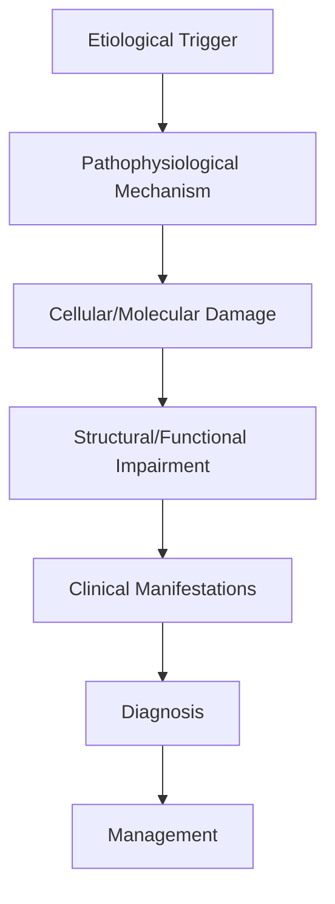
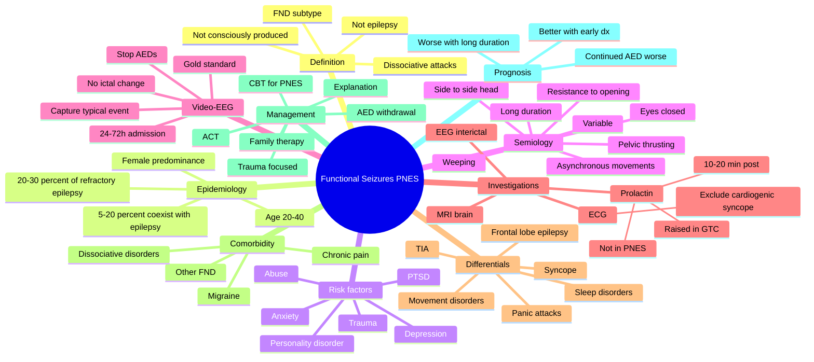

# Functional Seizures PNES

> [!tip] **High-Yield Definition**
> Comprehensive clinical note for Functional Seizures PNES covering definition, epidemiology, aetiology, pathophysiology, clinical features, investigations, differential diagnosis, management, drug interactions, procedures, complications, red flags, prognosis, topic correlation, and special situations for FCPS/MRCP examination preparation based on Davidson 24th Edition Chapter 25: Neurology.

---

## 1. Definition / Epidemiology / Classification

### Definition
Functional Seizures PNES is a neurological disorder within the 15 functional neurological disorders category. It is characterised by specific clinical, pathological, radiological, and laboratory features that allow differentiation from related conditions.

### Epidemiology
- **Incidence/Prevalence:** Variable depending on the specific condition.
- **Age:** Adult onset is most common, but paediatric and elderly presentations occur.
- **Sex:** Variable depending on the condition.
- **Geography:** Worldwide distribution, with higher prevalence in certain regions.
- **Risk Factors:** Genetic predisposition, environmental factors, comorbidities, family history.

### Classification
| Subtype | Key Features | Prognosis |
|---------|-------------|-----------|
| Mild/early | Subtle symptoms, preserved function | Best |
| Moderate | Clear symptoms, functional impairment | Variable |
| Severe | Significant disability, complications | Worst |

---

## 2. Aetiology / Pathophysiology

### Aetiology
- **Primary (idiopathic):** Most cases have no identifiable cause.
- **Genetic:** May be inherited (AD, AR, X-linked, mitochondrial, sporadic).
- **Autoimmune:** Autoantibodies, immune-mediated inflammation.
- **Infectious:** Viral, bacterial, fungal, parasitic.
- **Metabolic:** Electrolyte, endocrine, hepatic, renal, nutritional.
- **Toxic:** Drugs, alcohol, heavy metals, environmental toxins.
- **Vascular:** Ischaemia, haemorrhage, vasculitis.
- **Neoplastic:** Primary, secondary, paraneoplastic.
- **Traumatic:** Acute, chronic, repetitive.
- **Degenerative:** Neurodegeneration, protein misfolding.

### Pathophysiology


---

## 3. Clinical Features

### History
- **Onset/Duration:** Acute, subacute, or chronic.
- **Progression:** Static, progressive, relapsing-remitting, stepwise.
- **Key symptoms:** Specific to the condition.
- **Triggers:** Stress, infection, trauma, drugs, hormonal, environmental.
- **Systemic symptoms:** Constitutional features.
- **Drug/Family/Social history:** Relevant exposures, comorbidities.

### Examination
| Domain | Key Findings | Localisation Value |
|--------|-------------|-------------------|
| Higher function | Cognitive, behavioural | Cortical, subcortical, limbic |
| Cranial nerves | Pupils, eye movements, facial, bulbar | Brainstem, cranial nerve, NMJ |
| Motor | Weakness, tone, reflexes | UMN, LMN, NMJ, muscle |
| Sensory | All modalities, pattern | Peripheral, spinal, brainstem |
| Coordination | Ataxia, nystagmus, dysmetria | Cerebellar, sensory, vestibular |
| Gait | Spastic, ataxic, parkinsonian | Multiple |
| Autonomic | Orthostatic, sweating, GI, bladder | Autonomic, peripheral, central |

### Specific Clinical Features
The clinical features are determined by the underlying aetiology, location of pathology, and rate of progression. Patients typically present with a constellation of symptoms and signs that allow clinical localisation and subsequent targeted investigation.

---

## 4. Diagnostic Approach / Algorithm

```mermaid
flowchart TD
    A[Clinical Presentation] --> B[Anatomical Localisation]
    B --> C[Pathophysiological Category]
    C --> D[Formulate Differential]
    D --> E[Targeted Investigations]
    E --> F[Confirm Diagnosis]
    F --> G[Assess Severity/Prognosis]
    G --> H[Initiate Management]
    H --> I[Monitor Response]
    I --> J{Response?}
    J --> YES1 [Good - Continue]
    J --> NO1 [Poor - Escalate]
    YES1 --> K[Monitor]
    NO1 --> H
```

---

## 5. Investigations

### First-Line Investigations
- **Blood tests:** FBC, U&Es, LFTs, glucose, calcium, magnesium, ESR, CRP, autoimmune, infection.
- **Imaging:** CT/MRI brain/spine (essential for most neurological conditions).
- **Neurophysiology:** EEG, nerve conduction, EMG, evoked potentials.
- **CSF:** Cell count, protein, glucose, OCBs, PCR, culture.

### Second-Line Investigations
- **Genetic testing:** Gene panels, WES, WGS.
- **Antibody testing:** Antineuronal, autoimmune, paraneoplastic.
- **Biopsy:** Nerve, muscle, brain, skin.
- **Advanced imaging:** PET-CT, MR spectroscopy, fMRI.

### Specialised Investigations
- **Biomarkers:** Neurofilament light chain, tau, beta-amyloid, 14-3-3, RT-QuIC.
- **Autonomic testing:** Head-up tilt, sudomotor, QSART.
- **Neuropsychology:** Cognitive testing, behavioural assessment.
- **Genetic counselling:** Family screening, predictive testing.

---

## 6. Differential Diagnosis

| Differential | Distinguishing Features | Key Test |
|--------------|------------------------|----------|
| Vascular | Sudden onset, focal, vascular risk factors | MRI/CT, vessel imaging |
| Inflammatory | Subacute, multifocal, systemic | MRI, CSF, antibodies |
| Infectious | Fever, systemic, exposure | Bloods, CSF, imaging |
| Neoplastic | Progressive, mass effect | MRI, biopsy |
| Degenerative | Progressive, symmetric, hereditary | MRI, genetic |
| Toxic/Metabolic | Drug history, systemic, reversible | Bloods, toxicology |
| Autoimmune | Multifocal, antibodies, immunotherapy response | Antibodies, MRI, CSF |
| Functional | Inconsistent, distractible | Clinical, video, biomarkers |

---

## 7. Management

### Acute Management
- **Stabilisation:** ABCDE approach, emergency resuscitation.
- **Specific treatment:** Disease-specific interventions.
- **Symptomatic relief:** Pain, seizures, spasticity, autonomic dysfunction.
- **Prevention of complications:** DVT, pressure sores, infection.

### Disease-Modifying Treatment
- **Pharmacological:** First-line, second-line, escalation, maintenance.
- **Procedural:** Surgery, biopsy, drainage, ablation, stimulation.
- **Immunotherapy:** Steroids, IVIG, plasma exchange, immunosuppressants, biologics.
- **Rehabilitation:** Physiotherapy, OT, speech therapy.

### Long-Term Management
- **Monitoring:** Clinical, imaging, biomarkers, side effects.
- **Prevention:** Vaccinations, prophylaxis, lifestyle modification.
- **Supportive care:** Multidisciplinary team, social work, psychological support.
- **Palliative care:** Advanced care planning, end-of-life care, hospice.

---

## 8. Drug Interactions / Contraindications / Comorbidity Cautions

| Drug Class | Interaction / Caution | Management |
|------------|----------------------|------------|
| Antiseizure medications | Enzyme induction, teratogenicity | Monitor, supplement, switch |
| Immunosuppressants | Infection, malignancy, teratogenicity | Monitor, prophylaxis |
| Anticoagulants | Bleeding risk, drug interactions | Monitor INR, avoid combinations |
| Antihypertensives | Hypotension, falls | Monitor BP, adjust dose |
| Antibiotics | Nephrotoxicity, ototoxicity | Monitor renal |
| Antivirals | Nephrotoxicity, neuropsychiatric | Monitor renal, dose adjust |
| Steroids | DM, HTN, osteoporosis, infection | Monitor, prophylaxis, taper |
| Biologics | Infusion reactions, infection | Monitor, prophylaxis |

---

## 9. Procedures

### Common Procedures
- **Lumbar puncture:** Diagnostic, therapeutic (IIH, NPH). Contraindications: raised ICP, mass lesion, coagulopathy.
- **Nerve conduction studies/EMG:** Diagnostic, prognosis. Minor discomfort.
- **EEG:** Diagnostic, monitoring. No significant complications.
- **MRI brain/spine:** Diagnostic, monitoring. Contraindications: pacemaker, metallic implants.
- **CT head:** Emergency, rapid. Radiation exposure, contrast reactions.
- **Biopsy:** Stereotactic, open. Indications: diagnosis, molecular profiling.

---

## 10. Complications

| Complication | Frequency | Prevention | Management |
|--------------|-----------|------------|------------|
| Infection | Common | Hygiene, prophylaxis, vaccination | Antibiotics, antifungals |
| Thrombosis | Common | Prophylaxis, mobility | Anticoagulation |
| Pressure sores | Common | Positioning, nutrition | Wound care, surgery |
| Spasticity | Common | Positioning, stretching | Baclofen, BoNT |
| Contractures | Common | Passive movements, splints | Physiotherapy, surgery |
| Aspiration | Common | Swallow assessment | NGT, PEG, thickeners |
| Falls | Common | Environment, mobility | Walking aids |
| Fractures | Common | Bone health, prevention | Vitamin D, bisphosphonate |
| Depression | Common | Screening, support | Antidepressants, CBT |
| Cognitive decline | Variable | Monitoring, training | Rehabilitation |
| Autonomic dysfunction | Variable | Monitoring, hydration | Midodrine, fludrocortisone |
| Respiratory failure | Variable | Monitoring, supportive | Ventilation, NIV |
| Death | Variable | Monitoring, palliative | End-of-life care |

---

## 11. Red Flags / Emergencies

### Emergency Presentations
- **Rapid neurological deterioration:** New focal deficit, decreased consciousness, seizures.
- **Status epilepticus:** Continuous seizures >5 min.
- **Raised ICP:** Headache, vomiting, papilloedema, altered consciousness.
- **Respiratory failure:** Hypoxia, hypercapnia, ventilatory failure.
- **Cardiac arrest:** Arrhythmia, MI, pulmonary embolism.
- **Infection:** Sepsis, meningitis, abscess, encephalitis.
- **Drug toxicity:** Overdose, side effects, interactions.
- **Haemorrhage:** Intracranial, systemic, coagulopathy.

---

## 12. Prognosis

### Natural History
- **Acute:** May resolve with treatment, may progress, may be fatal.
- **Subacute:** Variable, depends on cause and treatment.
- **Chronic:** Often progressive, may be stable, may have relapses.
- **Recovery:** Variable, may be complete, partial, or none.

### Prognostic Factors
- **Favourable:** Young age, early treatment, mild disease, reversible cause, good premorbid function, family support.
- **Unfavourable:** Older age, delayed treatment, severe disease, irreversible cause, poor premorbid function, comorbidities.

---

## 13. Topic Correlation

| Related Topic | Link | Key Overlap |
|---------------|------|-------------|
| Davidson 24th Ed Chapter 25 | [[Davidson Chapter 25 - Neurology Hierarchy]] | Comprehensive neurology |
| Neurology MOC | [[Neurology MOC]] | All neurology topics |
| Drug Reference | [[../00_Index/Neurology Drug Reference]] | Medications |
| Local Hub | [[../15_Functional_Neurological_Disorders/Hub]] | Section-specific |
| Clinical Examination | [[../01_Fundamentals_Examination/Neurological History Taking]] | Clinical approach |
| Investigation | [[../01_Fundamentals_Examination/Neuroimaging (CT-MRI) Principles]] | Imaging |

---

## 14. Special Situations

| Situation | Consideration |
|-----------|---------------|
| **Pregnancy** | Pre-conception counselling, teratogenicity, drug safety, monitoring, delivery planning, breastfeeding. |
| **Lactation** | Drug safety, breastfeeding, monitoring, support. |
| **Paediatric** | Developmental considerations, drug dosing, school, family, vaccination, growth, puberty. |
| **Elderly / Frail** | Comorbidities, polypharmacy, falls, bone health, cognition, social, end-of-life. |
| **Renal impairment** | Drug dose adjustment, monitoring, dialysis, transplant. |
| **Hepatic impairment** | Drug dose adjustment, monitoring, transplant. |
| **Immunocompromised** | Infection prophylaxis, vaccination, drug interactions, malignancy screening. |
| **Perioperative** | Drug management, anaesthesia planning, VTE prophylaxis, infection prevention, monitoring. |
| **Driving / DVLA** | Fitness to drive, restrictions, notification, reassessment. |
| **Occupational** | Fitness for work, adaptations, rehabilitation, disability, return to work. |

---

## FCPS/MRCP High-Yield Summary

| Category | Key Points |
|----------|------------|
| **Definition** | Comprehensive definition with key diagnostic criteria |
| **Epidemiology** | Incidence, prevalence, age, sex, geography, risk factors |
| **Aetiology** | Primary causes, secondary causes, genetic, environmental |
| **Pathophysiology** | Mechanism of disease, cellular/molecular basis |
| **Clinical Features** | History, examination, key findings, variants |
| **Diagnosis** | Diagnostic criteria, classification, severity |
| **Investigations** | First-line, second-line, specialised, biomarkers |
| **Differential Diagnosis** | Key differentials, distinguishing features, tests |
| **Management** | Acute, disease-modifying, symptomatic, supportive |
| **Complications** | Common, serious, prevention, management |
| **Prognosis** | Natural history, prognostic factors, outcomes |
| **Viva Pearls** | Key examination points |
| **Drug Doses** | First-line, second-line, emergency |
| **Scoring Systems** | Specific scores used in management |
| **Genetics** | Inheritance, genes, mutations, family screening |
| **Imaging Signs** | Characteristic findings, differential |

---

## Viva Questions (PACES/FCPS Style)

1. **Q:** Define and classify its variants.
   **A:** Comprehensive definition with classification of subtypes based on aetiology, severity, and clinical features.

2. **Q:** What are the key clinical features?
   **A:** Specific symptoms and signs including onset, progression, key features, and associated findings.

3. **Q:** What is the first-line treatment?
   **A:** First-line pharmacological and non-pharmacological management based on current evidence.

4. **Q:** What are the red flags requiring urgent referral?
   **A:** Specific emergency presentations and complications requiring immediate intervention.

5. **Q:** What is the prognosis?
   **A:** Natural history, prognostic factors, and long-term outcomes.

6. **Q:** How do you differentiate from key differentials?
   **A:** Clinical features, investigations, and response to treatment that distinguish from alternative diagnoses.

7. **Q:** What investigations are most useful?
   **A:** First-line and second-line investigations including imaging, neurophysiology, CSF, and biomarkers.

8. **Q:** Describe the stepwise management approach.
   **A:** Stepwise escalation from first-line to second-line to third-line therapy with monitoring.

9. **Q:** What are the emergency presentations?
   **A:** Specific emergency scenarios and immediate management priorities.

10. **Q:** How does management change in pregnancy/paediatrics/elderly?
    **A:** Special considerations for each population including drug safety, monitoring, and support.

---

## Common Confusions / Exam Traps

| Confusion | Clarification |
|-----------|---------------|
| Similar presentation but different cause | Differentiate by history, examination, investigations |
| Treatment response vs natural history | Assess with objective measures, biomarkers |
| Drug interactions | Check each drug, monitor, adjust doses |
| Disease progression vs treatment failure | Monitor response, escalate appropriately |
| Functional vs organic | Inconsistent, distractible, disability greater than impairment |
| Acute vs chronic | Time course, progression, reversibility |
| Primary vs secondary | Underlying cause, contributing factors |
| Side effects vs symptoms | Temporal relationship, dose relationship |

---

## Mnemonics

1. **CLOSED EYES** — classic semiological features of PNES:
   - **C**losed eyes during the event (eyes open in 90% of GTC seizures)
   - **L**ong duration (often > 2 minutes; GTC usually < 90 seconds)
   - **O**riented immediately afterwards (no post-ictal confusion)
   - **S**ide-to-side head or body movements
   - **E**yelid *resistance* to passive opening
   - **D**ramatic, variable, non-stereotyped movements
   - **E**motional signs: weeping, screaming, pelvic thrusting
   - **Y**ielding to gentle restraint
   - **E**vents triggered by emotional / social context
   - **S**erum prolactin *not* raised (compared with GTC)

2. **PNES vs EPILEPSY** — 10 clues favouring PNES (none is 100% sensitive or specific):
   - **P**rolactin normal 10–20 min after GTC-like event
   - **N**o tongue biting (PNES: tip/lip; epilepsy: lateral tongue)
   - **E**yes closed & resisted opening
   - **S**tereo-typed pattern *absent* (variability between events)
   - **V**ideo-EEG captures typical event *without* ictal change
   - **A**sync hronous flailing / pelvic thrusting
   - **W**eeping or vocalisation during event
   - **A**bsence of cyanosis / post-ictal confusion
   - **L**ong duration (often > 2 minutes, can be 30+)
   - **S**uppressible / inducible by suggestion in some

3. **VIDEO-EEG GIVES** — why video-EEG is the diagnostic gold standard:
   - **V**isualises the *typical* event
   - **I**ctal EEG may be normal (especially frontal lobe / brief events)
   - **D**istinguishes from sleep-related, syncope, movement disorders
   - **E**xcludes epilepsy definitively *if* a typical event is captured
   - **O**bjective semiology for medical-legal clarity
   - **-E**vents captured in 50–80% within 24–72 h
   - **E**vidence-based (ILAE 2014): "documented PNES" requires typical event + no ictal EEG
   - **G**reatest yield: stop AEDs, sleep-deprive, provoke with suggestion
   - **I**ndicated when diagnosis remains in doubt after clinical assessment
   - **V**alidates for patient and clinician ("you do not have epilepsy")
   - **E**nables safe AED withdrawal
   - **S**upports onward psychological therapy

---

## Mind Map



---

## Spaced Repetition Trackers

| Day | Focus | Self-Test Questions | Score /10 |
|-----|-------|---------------------|-----------|
| **Day 1** | Definition & epidemiology | (1) Define PNES. (2) % of "refractory epilepsy". (3) Sex ratio. (4) Co-occurrence with epilepsy. (5) DSM-5 / ICD-11 term. (6) FND subtype. (7) Is it conscious? (8) Age of onset peak. (9) Why "functional" not "pseudo". (10) Why "dissociative" alternative. |  |
| **Day 3** | Semiology | (1) Eyes open or closed in PNES. (2) Eye opening resistance. (3) Duration compared with GTC. (4) Tongue biting location in PNES. (5) Pelvic thrusting. (6) Asynchronous vs synchronous movements. (7) Weeping in event. (8) Post-ictal confusion. (9) Stereotypy. (10) Ictal vocalisation. |  |
| **Day 7** | Investigations | (1) Gold standard test. (2) Sensitivity of routine EEG. (3) Prolactin timing. (4) Prolactin in GTC. (5) Prolactin in PNES. (6) Frontal lobe epilepsy caveat. (7) ECG. (8) Why MRI brain. (9) Yield of video-EEG at 24h. (10) Suggestion techniques. |  |
| **Day 14** | Differential | (1) Frontal lobe epilepsy. (2) Vasovagal syncope. (3) Cardiac syncope. (4) TIA with convulsion. (5) Panic attack. (6) REM sleep disorder. (7) Movement disorders (paroxysmal). (8) Migraine aura. (9) Transient global amnesia. (10) Hypoglycaemia. |  |
| **Day 30** | Management | (1) Disclosure of diagnosis. (2) Why "not epilepsy". (3) AED withdrawal rationale. (4) CBT for PNES evidence. (5) ACT. (6) Trauma-focused therapy. (7) Family therapy. (8) Driving regulations (UK DVLA). (9) Workplace issues. (10) Risk of iatrogenic harm. |  |
| **Day 90** | Outcomes & special situations | (1) Outcome in treated PNES. (2) Outcome in untreated. (3) Children vs adult. (4) Elderly PNES. (5) Co-existent epilepsy. (6) Pregnancy. (7) Frequency of status "PNES". (8) Mortality. (9) Long-term AED cessation. (10) Research frontiers. |  |

---

## Self-Test Scorecard

Score each domain 0–5 (5 = confident, 0 = no idea). Re-test monthly.

| # | Domain | /5 |
|---|--------|-----|
| 1 | Definition & epidemiology |  |
| 2 | Semiology (eyes, duration, movements) |  |
| 3 | Video-EEG role & interpretation |  |
| 4 | Prolactin & other biomarkers |  |
| 5 | Differential diagnosis |  |
| 6 | Risk factors & comorbidity |  |
| 7 | AED management & withdrawal |  |
| 8 | CBT for PNES & psychotherapy |  |
| 9 | Driving, legal & occupational |  |
| 10 | Outcome & prognosis |  |
| **Total** | **/50** |  |

---

## MCQs (10)

1. **Question:** What is the gold standard investigation for the diagnosis of PNES?
   **Options:** A. Routine 30-minute EEG B. Prolactin level C. Video-EEG monitoring capturing a typical event with no ictal EEG change D. CT brain E. MRI brain
   **Answer:** C
   **Explanation:** ILAE 2014 defines "documented PNES" as a typical event captured on video-EEG with *no* ictal epileptiform activity. Routine EEG has poor sensitivity, prolactin is supportive but not specific, and imaging is for exclusion of structural disease.

2. **Question:** In PNES, the eyes during the event are most commonly:
   **Options:** A. Open and deviated to one side B. Closed, with resistance to passive opening C. Open and blinking rapidly D. Forced open by the patient E. Always fluttering
   **Answer:** B
   **Explanation:** A characteristic feature of PNES is *closed* eyes with active resistance to passive opening. In generalised tonic-clonic seizures the eyes are typically open, often deviated upward. This is a useful bedside clue, especially on home video.

3. **Question:** A patient with PNES is brought to A&E. Which is the most appropriate immediate management?
   **Options:** A. IV lorazepam B. IV phenytoin loading C. Recognition that this may be PNES, observation, video if available, *avoid* intravenous anticonvulsants where possible, and consider the diagnosis calmly D. Intubation E. CT brain
   **Answer:** C
   **Explanation:** Recognising PNES early prevents iatrogenic harm (intubation, IV AEDs, ICU admission). The team should observe, capture video, and consider a confident diagnosis from semiology alone if typical. Diagnostic clarity at presentation can prevent years of inappropriate treatment.

4. **Question:** A 25-year-old woman has "seizures" lasting 30 minutes with normal post-ictal state and a normal interictal EEG. Serum prolactin is normal 15 minutes after the event. What is the most likely diagnosis?
   **Options:** A. Status epilepticus B. Frontal lobe epilepsy C. PNES D. Syncope E. Psychogenic non-epileptic status
   **Answer:** C
   **Explanation:** Long duration, normal post-ictal state, and normal prolactin in a young woman point to PNES. "Psychogenic non-epileptic status" describes prolonged PNES. Frontal lobe epilepsy can be missed on routine EEG and may require video-EEG.

5. **Question:** Up to what percentage of patients with PNES have *co-existent* epilepsy?
   **Options:** A. 1% B. 5–20% C. 50% D. 75% E. 0% — they are mutually exclusive
   **Answer:** B
   **Explanation:** Roughly 5–20% of patients with PNES also have epilepsy. This is one of the most important reasons *not* to over-diagnose PNES on clinical features alone, and to obtain video-EEG confirmation. Co-existence complicates management and prognosis.

6. **Question:** Which bedside sign is most useful in distinguishing functional weakness from an organic monoparesis?
   **Options:** A. Babinski sign B. Hoover's sign C. Kernig's sign D. Brudzinski's sign E. Lhermitte's sign
   **Answer:** B
   **Explanation:** Hoover's sign (paradoxical hip extension) is a *positive* sign of functional weakness. Kernig's, Brudzinski's, and Lhermitte's are meningeal / cord signs. Babinski reflects corticospinal tract dysfunction and does not distinguish functional from organic.

7. **Question:** Which psychological therapy has the strongest evidence base for PNES?
   **Options:** A. Long-term psychoanalysis B. CBT-informed psychotherapy (e.g., the CODES / CONVERT trials) C. Aversion therapy D. Hypnosis only E. Pharmacotherapy
   **Answer:** B
   **Explanation:** The CODES (Goldstein et al., 2020) and CONVERT trials showed CBT-informed therapy plus standardised medical care reduces seizure frequency and improves functioning in PNES. Pharmacotherapy has no primary role.

8. **Question:** A patient with PNES asks, "Can I drive?"
   **Question:** According to UK DVLA guidance, the position for a patient with **PNES alone** is:
   **Options:** A. Permanent ban B. Driving allowed after 6 months seizure-free on treatment C. Driving allowed after 1 year seizure-free *and* the episodes are confirmed not to be epileptic (neurologist confirmation; review required) D. Driving allowed immediately E. Driving allowed after 3 months
   **Answer:** C
   **Explanation:** In the UK, PNES is treated as a "non-epileptic loss of consciousness" by the DVLA. Licence restored typically after 1 year of being seizure-free *with* neurologist confirmation that the episodes are not epileptic. Local rules vary; check current DVLA guidance.

9. **Question:** A 10-year-old presents with "seizures" only at school and at home when anxious. What is the most likely diagnosis?
   **Options:** A. Juvenile myoclonic epilepsy B. Childhood absence epilepsy C. PNES (paediatric functional seizures) D. Rolandic epilepsy E. Tic disorder
   **Answer:** C
   **Explanation:** Context-dependent (school, anxiety), semiology (closed eyes, variable, long), normal EEG, and a high prevalence in children with school anxiety or trauma support paediatric PNES. Treatment is family-inclusive explanation, CBT, return to school.

10. **Question:** Which is the most important *next* step when a patient with apparent PNES does not improve with CBT?
    **Options:** A. Add more AEDs B. Re-evaluate the diagnosis with video-EEG; consider co-existent epilepsy, frontal lobe epilepsy, cardiac syncope C. Refer for surgery D. Discharge E. Prescribe antipsychotic
    **Answer:** B
    **Explanation:** Diagnostic re-evaluation is essential. Up to 20% of PNES patients have co-existent epilepsy, and frontal lobe epilepsy in particular can mimic PNES with bizarre semiology and preserved consciousness. Don't assume the original diagnosis is correct if treatment fails.

---

## SBA Questions (10)

1. **Scenario:** A 28-year-old woman with "refractory epilepsy" on three AEDs presents with daily seizures despite adequate drug levels. Video-EEG captures a typical event: closed eyes, asynchronous flailing, weeping, no ictal EEG change, no post-ictal confusion.
   **Question:** What is the most appropriate next step?
   **Options:** A. Add a fourth AED B. Vagal nerve stimulation C. Confirm PNES diagnosis, plan AED withdrawal, refer for CBT for PNES, deliver a positive explanation D. Corpus callosotomy E. Ketogenic diet
   **Answer:** C
   **Explanation:** With documented PNES, AEDs are not indicated and should be withdrawn (typically over weeks–months). CBT for PNES plus a positive explanation is first-line. Continued AED exposure risks cognitive side effects, teratogenicity, and false diagnostic certainty.

2. **Scenario:** A patient with PNES is in "status" — continuous events for 90 minutes. ABC are stable, no cyanosis, no post-ictal state, eyes closed.
   **Question:** What is the most appropriate management?
   **Options:** A. Rapid sequence induction and intubation B. IV phenytoin loading C. Calm observation, oral or no medication, gentle reassurance, avoid iatrogenic harm; consider low-dose oral lorazepam if required D. Emergency MRI E. Lumbar puncture
   **Answer:** C
   **Explanation:** "PNES status" can look dramatic but is rarely life-threatening. The key is calm observation, oral or no sedation, and avoidance of intubation, IV AEDs, and ICU admission. ABC stability is the rule; an organic emergency must be excluded first.

3. **Scenario:** A 22-year-old man has episodes of collapse with closed eyes, brief asynchronous jerking, and immediate recovery. Prolactin 20 minutes after an event is normal. Tongue tip is bitten.
   **Question:** What is the most likely diagnosis?
   **Options:** A. Generalised tonic-clonic epilepsy B. Frontal lobe epilepsy C. PNES D. Vasovagal syncope E. Cardiac syncope
   **Answer:** C
   **Explanation:** Tongue *tip* (not lateral) biting, closed eyes, asynchronous jerking, immediate recovery, and *normal* prolactin 20 min after the event all favour PNES. Lateral tongue biting is more typical of generalised tonic-clonic seizures.

4. **Scenario:** A 30-year-old with newly diagnosed PNES is concerned she has "wasted 8 years" on AEDs.
   **Question:** What is the most appropriate response?
   **Options:** A. "That was the right thing to do at the time." B. Acknowledge the harm, validate her experience, explain that PNES is a real, treatable condition, and outline a recovery plan with CBT for PNES C. Discharge D. Blame previous doctors E. Tell her it's psychological
   **Answer:** B
   **Explanation:** Empathic acknowledgement of iatrogenic harm, validation of symptoms as real, and a clear plan for the future are central. Confrontation with previous clinicians is unhelpful; building engagement is the priority.

5. **Scenario:** A 19-year-old with PNES wants to start a job as a commercial driver.
   **Question:** What is the most appropriate advice?
   **Options:** A. Encourage her to drive regardless B. Advise on DVLA rules: typically 1 year seizure-free + neurologist confirmation; vocational licensing is stricter; offer to write supporting letter once criteria are met C. Permanent ban regardless D. Refer to optician E. Refer to cardiology
   **Answer:** B
   **Explanation:** DVLA rules for non-epileptic attack disorder: typically 1 year off driving with neurologist confirmation of the diagnosis. Vocational licensing is stricter and may require longer off-driving periods. Accurate, supportive counselling is the role of the neurologist.

6. **Scenario:** A patient with PNES is taking 1200 mg/day of phenytoin with no benefit. Serum phenytoin is in range.
   **Question:** What is the most appropriate next step?
   **Options:** A. Increase phenytoin B. Add carbamazepine C. Withdraw phenytoin gradually once PNES is confirmed D. Add clobazam E. Add topiramate
   **Answer:** C
   **Explanation:** Continued AED exposure with confirmed PNES confers harm (cognitive, teratogenic, drug interactions, cost) without benefit. Withdrawal is part of the management plan and should be discussed with the patient.

7. **Scenario:** A 35-year-old with PNES has never been asked about prior trauma.
   **Question:** What is the most appropriate clinical approach?
   **Options:** A. Avoid the topic B. Sensitive, structured enquiry about adverse childhood experiences, sexual abuse, PTSD, and current stressors as part of the comprehensive assessment C. Discharge the trauma history to the GP D. Confront the patient E. Order brain MRI
   **Answer:** B
   **Explanation:** Trauma enquiry is part of the comprehensive assessment, conducted sensitively and with appropriate follow-up. Adverse childhood experiences and PTSD are common in PNES. Disclosure should be met with empathic, validating response, not a checklist-style interrogation.

8. **Scenario:** A patient with PNES is on warfarin and asks about CBD oil.
   **Question:** What is the most appropriate advice?
   **Options:** A. Endorse CBD use B. Advise that CBD interacts with warfarin and most AEDs; recommend discussion with pharmacist and not to use unregulated CBD for PNES C. Discontinue warfarin D. Stop all medications E. Refer to neurosurgery
   **Answer:** B
   **Explanation:** CBD inhibits CYP2C9 and CYP3A4 and can significantly increase warfarin effect and AED levels (especially clobazam, topiramate). It is not a recognised treatment for PNES. Patients should be counselled on drug interactions and the lack of evidence.

9. **Scenario:** A 12-year-old has "seizures" only at school. Parents are very anxious and have stopped her attending.
   **Question:** What is the most appropriate first step?
   **Options:** A. Home tuition B. Family-inclusive diagnostic explanation, school meeting, gradual return to school with support, and CBT for paediatric FND C. AED initiation D. School exclusion E. Diagnostic lumbar puncture
   **Answer:** B
   **Explanation:** Paediatric PNES is best managed with family-inclusive explanation, school liaison, and CBT. School avoidance worsens outcome. Most children improve with return to normal activities and a positive explanation.

10. **Scenario:** A patient with PNES has had no events for 12 months after CBT.
    **Question:** What is the most appropriate long-term plan?
    **Options:** A. Continue CBT weekly for life B. Discharge, with relapse plan and clear advice on returning if events recur; open-door follow-up C. Restart AEDs D. Annual MRI E. Driving ban
    **Answer:** B
    **Explanation:** With seizure freedom, most patients can be discharged with a clear relapse plan and open-door follow-up. Continued intensive therapy is rarely indicated, but low-intensity review may suit some.

---

## Tags

`#PNES #FunctionalSeizures #DissociativeAttacks #FND #VideoEEG #Prolactin #HooversSign #CBT #CONVERT #CODES #AEDWithdrawal #DVLA #MimicsEpilepsy #TongueBiting #IctalSemiology #Pseudoseizures #PsychogenicNonEpilepticSeizures`

---

## Local Navigation
**Heading Hub:** [[../Hub]]  
**Chapter Hierarchy:** [[Davidson Chapter 25 - Neurology Hierarchy]]  
**Chapter MOC:** [[Neurology MOC]]  
**Drug Reference:** [[../00_Index/Neurology Drug Reference]]

## PasTest Scenario SBAs (Clinical Vignettes)

> **Auto-generated PasTest/Mediscope-style scenario SBAs** grounded in the authored source. Each scenario tests a real clinical fact (triad, specific sign, contraindication, trial, first-line Rx) extracted from the topic. *Source: Ch 27: Neurology & Stroke — Functional Seizures PNES*

**Q1.** Which of the following features is most specific or characteristic of Functional Seizures PNES?

  - **A.** Key symptoms:
  - **B.** A feature common to many acute inflammatory conditions
  - **C.** A non-specific sign that does not localise the diagnosis
  - **D.** An investigation finding rather than a clinical feature

  > **Answer: A** — Key symptoms:
  >
  > *Source:* - **Key symptoms:** Specific to the condition

**Q2.** Which landmark clinical trial provided evidence relevant to the management of Functional Seizures PNES (specifically: CBT-informed therapy plus standardised medical care reduces seizure frequency and improves functioning in PNES)?

  - **A.** CONVERT trial
  - **B.** A different but related trial in the same area
  - **C.** A guideline (not a trial) addressing the same question
  - **D.** An observational/cohort study addressing similar outcomes

  > **Answer: A** — CONVERT trial
  >
  > *Source:* Pharmacotherapy
   **Answer:** B
   **Explanation:** The CODES (Goldstein et al., 2020) and CONVERT trials showed CBT-informed therapy plus standardised medical care reduces seizure frequency and impr

**Q3.** What is the most appropriate first-line therapy for Functional Seizures PNES?

  - **A.** Rehabilitation:
  - **B.** An advanced/surgical therapy reserved for refractory disease
  - **C.** Symptomatic treatment only, no disease-modifying therapy
  - **D.** Empiric broad-spectrum therapy without specific indication

  > **Answer: A** — Rehabilitation:
  >
  > *Source:* **Rehabilitation:** Physiotherapy, OT, speech therapy.

