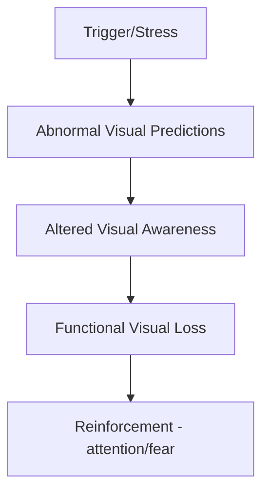
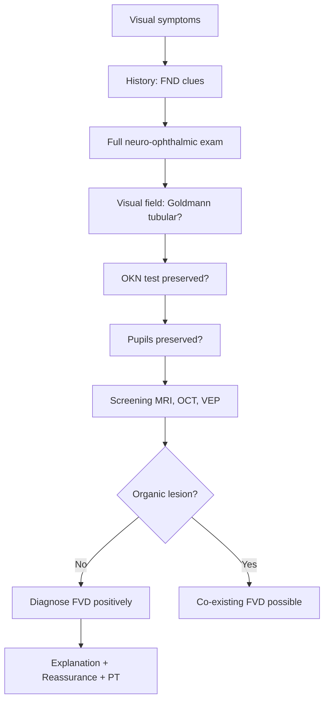

# Functional Visual Symptoms

> [!tip] **Definition**
> **Functional visual disorder (FVD)** — visual symptoms (loss, distortion, diplopia) incompatible with recognised ophthalmological/neurological disease, diagnosed by **positive bedside signs**. Common FND subtype: ~25-30% of FND presentations include visual symptoms.

> [!tip] **Key Principle**
> Diagnosis is made POSITIVELY by demonstrating **incongruence** with known ophthalmic disease (e.g., tubular field on Goldmann, intact OKN in "blindness"), NOT by exclusion. Most common patterns: **tubular visual field**, **complete blindness with preserved pupillary responses**, **convergence spasm**.

## 1. Definition / Epidemiology / Classification

### Definition
- Visual symptoms (loss, blurring, diplopia) without organic pathology, demonstrated by positive signs of **inconsistency/incongruence**
- Subtypes: **functional blindness**, **tubular field**, **functional diplopia**, **functional convergence spasm**

### Epidemiology
- **Prevalence:** 10-15% of new FND; F > M (2:1)
- **Age:** 20-50 (mean 35)
- **Risk factors:** Other FNDs, anxiety, trauma history, healthcare exposure
- **~30%** of patients referred to neuro-ophthalmology have functional symptoms

### Classification
| Subtype | Key Feature |
|---------|-------------|
| **Functional blindness** | Total vision loss, preserved OKN/pupils |
| **Tubular visual field** | Field doesn't expand with distance (Goldmann) |
| **Functional diplopia** | Monocular, inconsistent, varying |
| **Convergence spasm** | Sustained convergence, miosis, accommodation |
| **Photophobia / visual snow** | Often migraine overlap |

## 2. Aetiology / Pathophysiology

### Aetiology
- **Predisposing:** Female, anxiety, prior visual symptoms (migraine), FND history
- **Precipitating:** Stress, minor injury, panic, dissociative episode, illness
- **Perpetuating:** Fear-avoidance, attention, secondary gain

### Pathophysiology

- **Bayesian brain model:** Top-down predictions override bottom-up sensory input
- **Visual cortex hyperexcitability** (fMRI)
- **Dissociation** of visual awareness

## 3. Clinical Features

### History Clues
- **Sudden onset** (often witnessed, sometimes overnight)
- **Variable/incosistent** symptoms (e.g., can't read but can navigate)
- **Monocular diplopia** (organic: binocular)
- **Brief episodes** of total blindness
- **No progression** with time (vs. organic)
- **Stress trigger**
- **Other FND symptoms**

### Examination — **POSITIVE SIGNS** (KEY)

#### Tubular Visual Field
- **Goldmann perimetry** (kinetic) showing field that **does NOT expand** with increasing distance
- **Organic field** expands with distance (funnel-shaped); functional = **tubular** (cylindrical)
- Pathognomonic of functional visual loss

#### Optokinetic Nystagmus (OKN) Test
- Patient "blind" — pass a striped tape/drum in front of them
- **Positive functional sign:** **OKN preserved** (eyes track and nystagmus occurs) → patient CAN see
- **Snellen acuity:** Can read 6/6 line while claiming blindness

#### Pupillary Light Reflex
- **Preserved** in functional blindness (optic nerve pathway intact)
- **Absent** in optic nerve/brainstem lesions

#### Mirror Test
- Move a mirror in front of patient
- **Functional:** Eyes track the mirror (showing preserved vision)
- Patient typically unaware they are tracking

#### Finger-to-Finger Test
- Patient "blind" — bring index fingers together with eyes closed
- **Functional:** They meet accurately (proprioceptive/proprioception OK)

#### Consistent Sign of Functional Blindness
- Cannot see, but **walks around obstacles** without bumping
- Reaches accurately for objects

#### Convergence Spasm
- Sustained convergence of eyes + miosis + accommodation
- Inconsistent with any single cranial nerve palsy
- Triggered by stress or pain
- **Diagnosis:** miosis is the key (organic 3rd nerve palsy: mydriasis, not miosis)

#### Functional Diplopia Signs
- **Monocular diplopia** (organic: usually binocular)
- Disappears with pinhole test
- Inconsistent on cover/uncover testing
- Polygonal diplopia chart (organic: oval/linear)

## 4. Diagnostic Approach

### Red Flags for Organic Disease
- **Afferent pupillary defect** (RAPD)
- **Optic disc swelling/atrophy**
- **True visual field defect** (hemianopia, quadrantanopia)
- **Progressive symptoms**
- **Cranial nerve palsy** with diplopia
- **No positive functional signs**

## 5. Investigations

| Investigation | Purpose | Expected (FVD) |
|---------------|---------|----------------|
| **Visual field (Goldmann/Humphrey)** | Detect tubular field | Tubular (non-expanding) |
| **OCT** | Exclude optic neuropathy | Normal |
| **VEP** | Exclude optic nerve demyelination | Normal |
| **MRI brain + orbits** | Exclude compressive/demyelinating | Normal |
| **MRA** | If suspect aneurysm/AVM | Normal |

## 6. Differential Diagnosis

| Condition | Distinguishing | Key Test |
|-----------|----------------|----------|
| **Optic neuritis** | Pain on eye movement, RAPD, central scotoma | MRI, VEP |
| **Papilloedema** | Bilateral disc swelling, headache, TLoC | MRI, LP |
| **Cranial nerve III/IV/VI palsy** | Binocular, true diplopia, gaze palsy | Examination |
| **Migraine aura** | Fortification spectra, headache association | History |
| **Posterior circulation stroke** | Homonymous hemianopia, brainstem signs | MRI DWI |
| **Psychogenic (malingering)** | Conscious for external gain | Psychiatric assessment |

## 7. Management

### Step 1: **Explanation** (KEY)
- Validate symptoms (real, not faked)
- **Demonstrate preserved OKN** positively ("Your eyes are tracking perfectly, your vision is intact")
- Explain: "Hardware OK, software problem"
- Address fear (e.g., "Your vision is intact — your brain is misinterpreting signals")
- Provide written info

### Step 2: **Reassurance + Watchful Waiting**
- Many cases resolve spontaneously with explanation
- Avoid unnecessary follow-up if reassured

### Step 3: **Physiotherapy / Orthoptic Exercises**
- Graded visual tasks
- Convergence exercises for convergence spasm
- Habituation techniques

### Step 4: **Psychological Therapy**
- CBT
- ACT (Acceptance and Commitment Therapy)
- EMDR if trauma

### Step 5: **Pharmacological**
- No specific drug
- Treat comorbidity (depression, anxiety): SSRI
- For migraine/visual snow: preventives (topiramate, amitriptyline)

### Step 6: **Specialist FND MDT**
- Neurologist, ophthalmologist, psychologist, OT

## 8. Drug Cautions
- No specific drugs
- Avoid long-term benzodiazepines (can worsen dissociation)
- Migraine preventives: avoid topiramate in pregnancy (teratogenic)

## 9. Procedures
- No procedures indicated
- **Avoid lumbar puncture** if not needed (iatrogenic, can perpetuate)
- Avoid invasive eye procedures (laser, surgery)

## 10. Complications
- Iatrogenic harm (unnecessary procedures)
- Chronic visual symptoms (poor prognostic sign)
- Disability, lost work
- Co-morbid depression, anxiety
- Secondary: falls (functional blindness)

## 11. Red Flags / Emergencies
- **Afferent pupillary defect** (optic neuritis, compressive lesion)
- **Sudden painless loss with red eye** (acute angle-closure glaucoma — emergency)
- **Papilloedema with headache** (raised ICP)
- **Progressive symptoms** (organic disease)
- **New onset >50 years** (reconsider diagnosis)

## 12. Prognosis
- **~50% improve** with explanation alone
- **Good prognosis:** Acute onset, identifiable trigger, no comorbidity
- **Poor prognosis:** Chronic, severe anxiety, secondary gain, refusal of treatment

## 13. Topic Correlation
| Related Topic | Link | Key Overlap |
|---------------|------|-------------|
| Functional Weakness | [[Functional Weakness]] | Positive signs, same principles |
| Functional Movement Disorders | [[Functional Movement Disorders]] | Distractibility, entrainment |
| Migraine | [[Migraine]] | Visual aura, photophobia |
| Optic Neuritis | [[Optic Neuritis]] | RAPD, demyelinating |

## 14. Special Situations
- **Pregnancy:** Avoid topiramate (teratogenic); use paracetamol for migraine
- **Paediatric:** Family-based therapy, school support, gentle explanation
- **Elderly:** Consider stroke, glaucoma, cataract; functional can co-exist
- **Driving (DVLA):** Must notify if vision affected; visual field standards apply

## FCPS/MRCP High-Yield Summary
| Category | Key Points |
|----------|------------|
| **Definition** | Visual symptoms incompatible with disease; POSITIVE signs (tubular field, OKN) |
| **Epidemiology** | 10-15% of FND; F>M 2:1; 30% neuro-ophthalmology referrals |
| **Pathophysiology** | Bayesian brain; top-down predictions; visual cortex hyperexcitability |
| **Clinical** | Sudden, inconsistent, monocular diplopia, tubular field |
| **Diagnosis** | Tubular Goldmann + OKN + preserved pupils = FVD |
| **Management** | Explanation + Watchful waiting + CBT + Treat comorbidity |
| **Viva Pearls** | OKN test = most powerful bedside sign of functional blindness |
| **Mnemonic** | **OKN = Open KNowing Network (preserved in functional blindness)** |

## Viva Questions
1. **Q:** How to test for functional blindness at bedside?
   **A:** OKN test (striped tape/drum) — preserved OKN = patient can see.
2. **Q:** What is tubular visual field?
   **A:** Visual field that does NOT expand with distance on Goldmann perimetry — pathognomonic of functional visual loss.
3. **Q:** Monocular diplopia — what does it suggest?
   **A:** Functional (organic diplopia is usually binocular).
4. **Q:** Convergence spasm triad?
   **A:** Sustained convergence + miosis + accommodation. (Organic 3rd nerve palsy: mydriasis.)
5. **Q:** What is the most common neuro-ophthalmology misdiagnosis in functional patients?
   **A:** Multiple sclerosis misdiagnosis (esp. with normal MRI later).
6. **Q:** What % of neuro-ophthalmology referrals are functional?
   **A:** ~30%.
7. **Q:** OKN test in cortical blindness?
   **A:** ABSENT (if lesion affects V1/MST); preserved in functional blindness.
8. **Q:** Pinhole test in monocular diplopia?
   **A:** Improves organic (refractive) but NOT functional.

## Common Confusions / Exam Traps
| Confusion | Clarification |
|-----------|---------------|
| Tubular field = retinitis pigmentosa | RP: true constriction, expands with distance; functional: doesn't expand |
| OKN preserved = malingering | Functional; unconscious production |
| Monocular diplopia = organic | Usually functional (organic rare) |
| Functional vision loss = psychiatric | Real brain dysfunction |
| Pupils preserved = no need for MRI | Still need to exclude other causes (e.g., cortical) |

## Mnemonics
1. **OKN PRESERVED = Opens Knowledge of Normal vision (functional)**
2. **TUBULAR** = **T**racks **U**niformly **B**eyond **U**sual **L**ogic of **A**natomical **R**ules
3. **CONVERGE** = **CON**striction + **VER**gence + **GE** (miosis/accommodation)

## MCQs (10)
1. **Q:** What is the most powerful bedside test for functional blindness?
   **A.** Snellen chart **B.** OKN test **C.** Pupil reflex **D.** MRI
   **Answer:** B — OKN preserved in functional blindness
2. **Q:** Tubular visual field is pathognomonic of:
   **A.** Retinitis pigmentosa **B.** Functional visual loss **C.** Glaucoma **D.** Optic neuritis
   **Answer:** B
3. **Q:** Monocular diplopia usually suggests:
   **A.** CN III palsy **B.** Functional **C.** CN VI palsy **D.** Myasthenia
   **Answer:** B
4. **Q:** Convergence spasm triad:
   **A.** Mydriasis, divergence, no accommodation **B.** Miosis, convergence, accommodation **C.** Ptosis, mydriasis, down/out **D.** Nystagmus, miosis, diplopia
   **Answer:** B
5. **Q:** OKN test is ABSENT in:
   **A.** Functional blindness **B.** Cortical blindness (V1 lesion) **C.** Anxiety **D.** Malingering
   **Answer:** B
6. **Q:** A patient with "blindness" who walks around obstacles without bumping suggests:
   **A.** Organic blindness **B.** Functional blindness **C.** Hemianopia **D.** Cortical blindness
   **Answer:** B
7. **Q:** First-line treatment of functional visual loss:
   **A.** SSRI **B.** Explanation + reassurance **C.** Laser surgery **D.** Steroids
   **Answer:** B
8. **Q:** What % of neuro-ophthalmology referrals are functional?
   **A.** 5% **B.** 30% **C.** 60% **D.** 90%
   **Answer:** B
9. **Q:** Pinhole test improves monocular diplopia in:
   **A.** Functional **B.** Organic (refractive) **C.** Cortical **D.** Migraine
   **Answer:** B — functional NOT improved
10. **Q:** VEP in functional blindness:
    **A.** Abnormal **B.** Normal **C.** Absent **D.** Prolonged P100 only
    **Answer:** B — normal (VEP pathway intact)

## SBA Questions (10)
1. **Scenario:** 30-year-old woman with sudden total vision loss. Pupils normal, OKN preserved, Goldmann field tubular. Diagnosis?
   **A.** Optic neuritis **B.** Functional blindness **C.** Cortical blindness **D.** Retinal detachment
   **Answer:** B — preserved OKN + tubular field = functional
2. **Scenario:** 25-year-old with sudden monocular diplopia (worse in evening). Pinhole doesn't improve, MRI normal. Likely?
   **A.** Refractive error **B.** Functional diplopia **C.** CN VI palsy **D.** Myasthenia
   **Answer:** B — monocular, pinhole negative = functional
3. **Scenario:** 40-year-old with sustained convergence, miosis, accommodation. No ptosis, normal pupils otherwise. Diagnosis?
   **A.** CN III palsy **B.** Convergence spasm (functional) **C.** Migraine **D.** Botulism
   **Answer:** B — miosis not mydriasis, sustained convergence
4. **Scenario:** Patient with "blindness" reaches accurately for objects and reads 6/6 line on Snellen. Diagnosis?
   **A.** Malingering **B.** Functional blindness **C.** Optic neuritis **D.** Cortical blindness
   **Answer:** B — inconsistent (claims blindness but reads)
5. **Scenario:** 35-year-old with sudden visual loss after stress. Optic discs normal, VEP normal, MRI normal, OKN preserved. Next step?
   **A.** Urgent biopsy **B.** Explanation + reassurance + written info **C.** IV methylprednisolone **D.** Lumbar puncture
   **Answer:** B
6. **Scenario:** 50-year-old with "blindness" but pupils absent, OKN absent, MRI shows occipital infarct. Diagnosis?
   **A.** Functional **B.** Cortical blindness (organic) **C.** Malingering **D.** Anxiety
   **Answer:** B — OKN absent + MRI lesion = organic
7. **Scenario:** Functional visual loss + co-morbid depression. Treatment?
   **A.** Avoid SSRI (worsens) **B.** SSRI for depression **C.** Haloperidol **D.** ECT
   **Answer:** B — treat comorbidity
8. **Scenario:** Patient with functional visual loss and history of childhood trauma. Most appropriate therapy?
   **A.** CBT alone **B.** EMDR + CBT **C.** Antipsychotic **D.** Hypnosis only
   **Answer:** B
9. **Scenario:** Patient claims blindness, but pupils preserved, OKN preserved, mirror test shows eye tracking. Sign most consistent with:
   **A.** Optic neuritis **B.** Functional blindness **C.** Cortical blindness **D.** Anxiety
   **Answer:** B
10. **Scenario:** Patient with functional visual loss, suddenly develops new optic disc swelling. Next step?
    **A.** Reassure, FVD **B.** Urgent re-investigation (papilloedema, optic neuropathy) **C.** CBT **D.** Discharge
    **Answer:** B — new sign = re-investigate

## Flashcards
- **Q:** OKN test for functional blindness?
  **A:** Pass striped tape in front of "blind" patient; preserved OKN = functional
- **Q:** Tubular visual field?
  **A:** Field doesn't expand with distance on Goldmann = functional
- **Q:** Convergence spasm triad?
  **A:** Convergence + miosis + accommodation
- **Q:** Monocular diplopia suggests?
  **A:** Functional (organic is usually binocular)
- **Q:** First-line FVD treatment?
  **A:** Explanation + reassurance + watchful waiting
- **Q:** Pupillary reflex in functional blindness?
  **A:** Preserved
- **Q:** VEP in FVD?
  **A:** Normal
- **Q:** What % of neuro-ophthalmology referrals are functional?
  **A:** ~30%
- **Q:** Pinhole test in functional monocular diplopia?
  **A:** No improvement
- **Q:** Mirror test?
  **A:** Eyes track mirror = preserved vision (functional)

## Answer Key
### MCQs
1. B  2. B  3. B  4. B  5. B  6. B  7. B  8. B  9. B  10. B

### SBAs
1. B  2. B  3. B  4. B  5. B  6. B  7. B  8. B  9. B  10. B

## Summary
Functional visual symptoms are diagnosed by **POSITIVE bedside signs**: **OKN preserved** in "blindness" (gold standard), **tubular visual field** (non-expanding on Goldmann), **monocular diplopia** (organic usually binocular), **convergence spasm** (miosis, not mydriasis). **Pupils preserved**. ~30% of neuro-ophthalmology referrals are functional. First-line treatment: **Explanation + reassurance** (validate, demonstrate OKN positively, "software problem" analogy). 50% improve with explanation alone. Avoid iatrogenic harm (unnecessary procedures). Treat comorbidity (depression, anxiety, migraine). Prognosis: ~50% improve; worse with chronicity, secondary gain.
