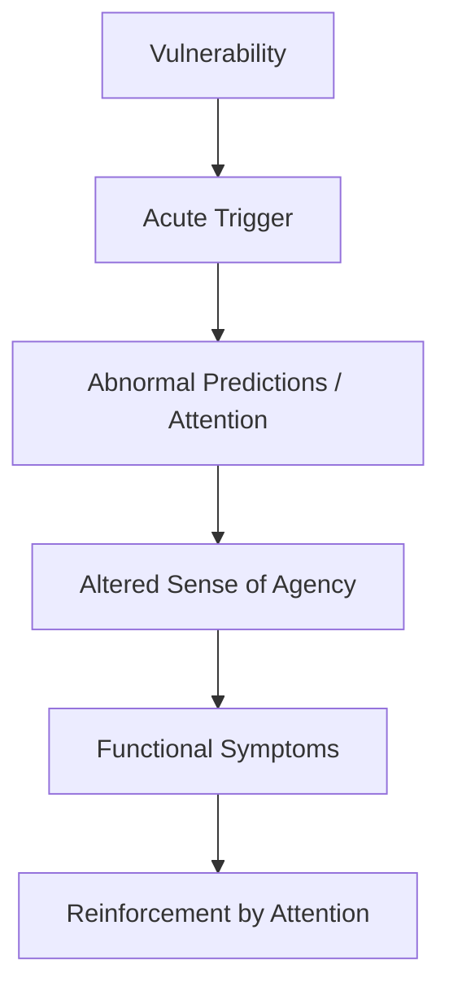
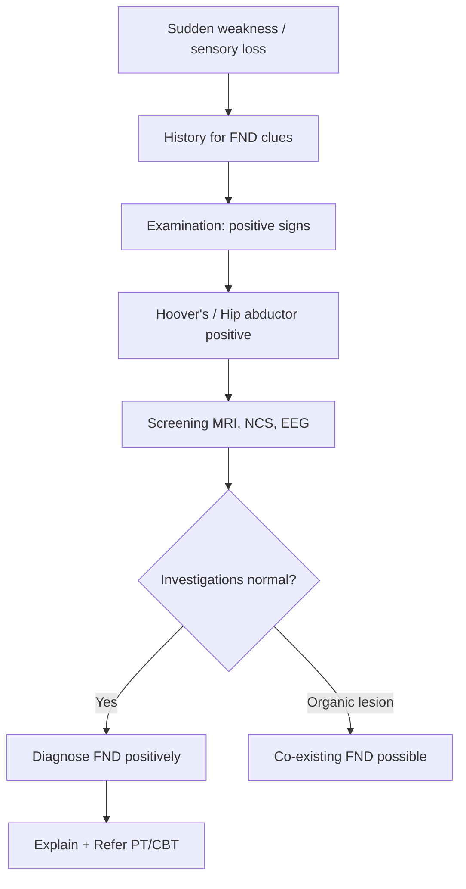

# Functional Weakness & Sensory Symptoms

> [!tip] **Definition (DSM-5)**
> **Functional Neurological Disorder (FND)** — neurological symptoms incompatible with recognised neurological disease, demonstrated by **positive clinical signs of inconsistency/incongruence**. DSM-5: Functional Neurological Symptom Disorder (formerly Conversion Disorder). Diagnosis is **POSITIVE**, NOT by exclusion.

> [!tip] **Core Principle**
> Diagnosis made by demonstrating **positive signs of functional weakness** (Hoover's, give-way, hip abductor). **~30% of neurology outpatients; 16% of neurology admissions** have FND.

## 1. Definition / Epidemiology / Classification

### Definition
- **FND:** Symptoms of altered voluntary motor/sensory function **clinically incompatible** with recognised neurological disease
- **Functional Weakness:** Limb weakness (mono/hemi/para) without corticospinal tract lesion
- **Functional Sensory Loss:** Hemisensory, stocking-glove, or complete loss incongruent with dermatomes

### Epidemiology
- **Prevalence:** 4-12/100,000/year (functional weakness); **30% neurology outpatients**
- **F:M:** 2-3:1 (higher in females, esp. limb weakness)
- **Median age:** 35-50 (bimodal: adolescents & middle-age)
- **Risk factors:** Female, prior trauma/abuse (40-50%), childhood adversity, anxiety/depression, illness model in family, healthcare exposure
- **Comorbidities:** Anxiety (40%), depression (30%), other FNDs, dissociative disorders, IBS, fibromyalgia

### Classification (DSM-5)
|| Subtype | Key Feature |
|---------|-----------|
| **Functional Weakness** | Inconsistent, give-way, Hoover's +ve |
| **Functional Sensory Loss** | Splitting midline, non-dermatomal |
| **Dissociative (functional) seizures** | PNES |
| **Functional Movement Disorder** | Tremor, dystonia, gait |
| **Functional Cognitive Disorder** | Memory/concentration |

## 2. Aetiology / Pathophysiology

### Aetiology
- **Predisposing:** Female, trauma/abuse, childhood adversity, anxiety, illness model
- **Precipitating:** Acute stress, physical injury, illness, panic, dissociation
- **Perpetuating:** Fear-avoidance, catastrophising, secondary gain (not malingering)

### Pathophysiology

- **Bayesian brain model:** Mismatch between prior predictions and sensory feedback
- **fMRI:** Altered connectivity in salience network (ACC, insula), sensorimotor cortex, DMN
- **Amygdala hyperreactivity** (trauma-associated)
- **Dissociation** = compartmentalisation of normally integrated brain functions

## 3. Clinical Features

### History Clues
- **Sudden onset** (often witnessed; sometimes overnight)
- **Precipitating stress** (often denied but present)
- **Inconsistency:** Weakness varies with distraction
- **Non-anatomical distribution:** Whole limb, "dragging like a dead weight"
- **Give-way weakness** (intermittent)
- **Dissociative symptoms** (depersonalisation, derealisation, panic)
- **La belle indifference** (historical — NOT reliable)
- **Spontaneous recovery** in some

### Examination — **POSITIVE SIGNS** (KEY)

#### Hoover's Sign (Lower Limb — gold standard)
- **Procedure:** Patient supine; examiner's hand under "weak" heel; ask patient to **lift UNAFFECTED leg against resistance** (hip flexion)
- **Positive:** **Extension of the weak leg** (involuntary hip extension)
- **Mechanism:** Reinforcement; contralateral hip flexion causes automatic ipsilateral extension
- **Sensitivity:** 85-95%; **Specificity:** >95%

#### Hip Abductor Sign
- Patient abducts both legs against resistance
- **Positive:** Weakness of contralateral "weak" leg when abducting strong leg

#### Give-Way Weakness
- Initial full strength → sudden collapse during testing
- Inconsistent, effort-dependent

#### Other Signs
| Sign | Description |
|------|-------------|
| **Hoover's (upper limb)** | "Weak" arm extends/abducts with contralateral abduction |
| **Co-contraction** | Simultaneous agonist/antagonist contraction |
| **Drift without pronation** | Arm drifts down (NO pronation — unlike UMN) |
| **Inconsistent Romberg** | Sways with eyes open AND closed |

#### Functional Sensory Signs
- **Splitting midline:** Loss stops EXACTLY at midline (organic lesions don't respect this)
- **Vibration sense split:** Tuning fork felt on one side of sternum, not the other
- **Non-dermatomal:** Loss crosses dermatomes
- **Tube sign:** Boundary moves with different examiner

## 4. Diagnostic Approach

### Diagnostic Criteria (DSM-5)
- ≥1 symptom of altered voluntary motor or sensory function
- **Clinical findings show incompatibility** with recognised condition
- Symptom not better explained by another disorder
- Causes clinically significant distress/impairment

### Red Flags for Organic Disease
- Insidious progressive weakness
- Reflex changes / wasting / fasciculations
- True extensor plantars
- Incontinence with paraparesis
- No positive FND signs

## 5. Investigations

| Investigation | Purpose | Expected (FND) |
|---------------|---------|----------------|
| **MRI Brain/Spine** | Exclude stroke, MS, cord lesion | Normal |
| **NCS/EMG** | Exclude neuropathy, myopathy | Normal |
| **EEG** | Exclude epilepsy | Normal |

- **5-10%** of FND diagnoses later re-diagnosed organic
- Up to 30% have BOTH organic and functional (e.g., MS + functional overlay)

## 6. Differential Diagnosis

| Condition | Distinguishing | Key Test |
|-----------|----------------|----------|
| **Stroke** | UMN signs, facial involvement, dysarthria, sudden with negative symptoms | MRI DWI |
| **MS** | Relapsing, optic neuritis, INO, MRI lesions | MRI, OCB |
| **Peripheral neuropathy** | Length-dependent, areflexia | NCS |
| **Spinal cord lesion** | Sensory level, sphincters, UMN signs | MRI spine |
| **NMJ (myasthenia)** | Fatigability, ptosis, fluctuating | AChR, SFEMG |
| **Malingering** | Conscious production for external gain | Psychiatric assessment |
| **Factitious disorder** | Conscious production for sick role | Psychiatric assessment |

## 7. Management

### Step 1: **Explanation** (KEY)
- Validate ("Your symptoms are real, not faked")
- **Demonstrate Hoover's** positively (raise unaffected leg → weak leg extends)
- Explain: "Hardware OK, software problem — brain functioning abnormally"
- Provide written info (neurosymptoms.org)
- Address stigma; many patients have been dismissed

### Step 2: **Physiotherapy** (FIRST-LINE for motor FND)
- Goal: **Retrain movement patterns** with distraction
- Graded exercise, functional rehab
- Avoid reinforcement of disability

### Step 3: **Psychological Therapy**
- **CBT** — first-line
- **ACT** (Acceptance and Commitment Therapy)
- EMDR for trauma history
- Psychodynamic if relevant

### Step 4: **Pharmacological**
- No specific drug for FND
- Treat co-morbid: depression/anxiety (SSRI/SNRI)
- **Avoid:** opioids, long-term benzodiazepines

### Step 5: **Specialist FND MDT**
- Neurologist + PT + OT + Psychologist + Psychiatrist
- Inpatient FND rehab for severe cases

### Step 6: **Other**
- Hypnosis (some evidence)
- TMS (emerging)
- Group therapy / peer support

## 8. Drug Cautions
- No specific FND drugs
- Avoid high-dose opioids (dependency)
- Avoid long-term benzodiazepines (tolerance, worsen dissociation)
- SSRI: monitor SIADH in elderly
- Paroxetine: avoid in pregnancy (cardiac defects)

## 9. Procedures
- No procedures for FND itself
- LP if needed to exclude inflammatory/infectious cause
- Avoid unnecessary nerve blocks, surgery (iatrogenic harm)

## 10. Complications
- Iatrogenic harm (unnecessary investigations, surgery, drugs)
- Chronic disability (30-50% at 1 year)
- Secondary: DVT, pressure ulcers, contractures
- Co-morbid depression / suicide risk
- High healthcare costs

## 11. Red Flags / Emergencies
- Suicidal ideation (depression)
- Sudden deterioration (reconsider organic)
- New signs (re-investigate)
- Refusal of food/fluids (functional dysphagia)
- Somatisation in child/elder (safeguarding)

## 12. Prognosis
- **Recovery:** 30-50% improve; ~20% severely disabled
- **Good prognosis:** Acute onset, identifiable trigger, short duration (<6 months), no comorbidity, accepts diagnosis, engages with treatment
- **Poor prognosis:** Chronic (>2 years), personality disorder, ongoing litigation, refusal of treatment

## 13. Topic Correlation
| Related Topic | Link | Key Overlap |
|---------------|------|-------------|
| Functional Visual Symptoms | [[Functional Visual Symptoms]] | Tubular field, OKN |
| Functional Movement Disorders | [[Functional Movement Disorders]] | Tremor entrainment |
| Dissociative Seizures | [[PNES]] | Trauma, dissociation |
| Somatic Symptom Disorder | [[SSD]] | Excessive thoughts |

## 14. Special Situations
- **Pregnancy:** Avoid paroxetine; continue needed AEDs if co-existing
- **Paediatric:** Family therapy, gentle explanation, return to school
- **Elderly:** Consider stroke mimic, dementia, depression
- **Litigation:** Avoid adversarial assessments; ongoing litigation worsens prognosis
- **Driving (DVLA):** Must notify if affects driving

## FCPS/MRCP High-Yield Summary
| Category | Key Points |
|----------|------------|
| **Definition** | FND = symptoms incompatible with disease; POSITIVE bedside diagnosis |
| **Epidemiology** | 30% neurology outpatients; F:M 2-3:1 |
| **Pathophysiology** | Bayesian brain; abnormal sense of agency; salience network dysfunction |
| **Clinical** | Sudden, inconsistent, give-way, Hoover's +, splitting midline |
| **Diagnosis** | POSITIVE signs (Hoover's, hip abductor, give-way) — NOT exclusion |
| **Management** | Explanation + Distraction PT + CBT + SSRI for comorbidity |
| **Prognosis** | 30-50% improve; worse with chronicity, litigation, refusal |
| **Viva Pearls** | Hoover's 85-95% sens, >95% spec; validate don't dismiss |
| **Mnemonic** | **FND = Functional Not Destroyed** |

## Viva Questions (PACES/FCPS Style)
1. **Q:** Positive signs confirming functional weakness?
   **A:** Hoover's, hip abductor, give-way, drift without pronation, co-contraction.
2. **Q:** Sensitivity and specificity of Hoover's sign?
   **A:** Sensitivity 85-95%; Specificity >95%.
3. **Q:** How to explain FND to a patient?
   **A:** Validate symptoms, demonstrate Hoover's, "software problem" analogy, written info, refer PT/CBT.
4. **Q:** Functional weakness vs stroke?
   **A:** Stroke = UMN signs, facial, dysarthria, sudden negative. FND = positive signs, inconsistent, stress trigger.
5. **Q:** Role of physiotherapy in FND?
   **A:** Retrain movement patterns with distraction; not strength building. First-line for motor FND.
6. **Q:** What % of neurology outpatients have FND?
   **A:** ~30%.
7. **Q:** What is splitting midline sign?
   **A:** Sensory loss stops at midline (organic lesions don't respect this). Test vibration over sternum.
8. **Q:** Difference FND vs malingering?
   **A:** FND = unconscious (not volitional); Malingering = conscious for external gain.

## Common Confusions / Exam Traps
| Confusion | Clarification |
|-----------|---------------|
| FND = "all in the mind" | FND is real brain dysfunction, not volitional |
| La belle indifference = FND | Not reliable; many FND patients are distressed |
| Negative investigations = FND | Diagnosis by POSITIVE signs, not exclusion |
| FND can't co-exist with organic | Up to 30% have BOTH |
| Don't refer to psychiatry only | Multidisciplinary PT, OT, psychology, neurology |

## Mnemonics
1. **FND = Functional Not Destroyed** — real, reversible
2. **HOOVER** = Hip extension with Opposite Volition (E)levation — Reinforcement
3. **SPLIT** = Sensory loss Proximal to Linea alba stops at Internal midline at Thorax
4. **PSYCH** = Positive signs, Stress trigger, Yielding weakness, Co-morbid anxiety, Hoover's

## MCQs (10)
1. **Q:** First positive bedside sign to confirm functional leg weakness?
   **A.** Absent ankle reflex **B.** Hoover's sign **C.** Babinski **D.** Sensory level
   **Answer:** B — Hoover's is the gold-standard positive sign.
2. **Q:** Sensitivity of Hoover's sign?
   **A.** 30-40% **B.** 50-60% **C.** 85-95% **D.** 99-100%
   **Answer:** C
3. **Q:** Patient with sudden left leg weakness. Contralateral hip flexion against resistance causes "weak" leg to extend. Diagnosis?
   **A.** Spastic paresis **B.** Hoover's positive (functional) **C.** Babinski **D.** Clonus
   **Answer:** B — Hoover's positive
4. **Q:** What is "give-way" weakness?
   **A.** Continuous weakness **B.** Spasticity **C.** Sudden collapse despite initial full power **D.** Reflex loss
   **Answer:** C
5. **Q:** Splitting midline sensory loss is characteristic of:
   **A.** Thalamic stroke **B.** Functional sensory loss **C.** MS **D.** Cord lesion
   **Answer:** B
6. **Q:** Most appropriate first-line treatment for functional motor weakness?
   **A.** SSRI **B.** Benzodiazepine **C.** Distraction-based physiotherapy **D.** Opioid
   **Answer:** C
7. **Q:** FND diagnosis is made by:
   **A.** Exclusion of organic disease **B.** Positive bedside signs of inconsistency **C.** MRI findings **D.** Response to placebo
   **Answer:** B
8. **Q:** Functional weakness differs from malingering in that:
   **A.** Functional symptoms are consciously produced **B.** Malingering is unconscious **C.** Functional symptoms are NOT consciously produced **D.** Both are same
   **Answer:** C
9. **Q:** Co-morbid depression in FND is treated with:
   **A.** No treatment **B.** SSRI/SNRI **C.** Opioids **D.** Antipsychotics
   **Answer:** B
10. **Q:** A "drift without pronation" of the arm in a patient with sudden weakness suggests:
    **A.** Stroke **B.** Functional weakness **C.** Parkinsonism **D.** Cerebellar
    **Answer:** B — functional drift lacks pronator drift of UMN

## SBA Questions (10)
1. **Scenario:** 38-year-old woman with sudden right leg weakness after stress. Power: full then collapses. Contralateral hip flexion causes "weak" leg to extend. MRI normal. Diagnosis?
   **A.** Stroke **B.** Functional weakness **C.** Conversion disorder (DSM-IV) **D.** Both B and C
   **Answer:** D — DSM-5 = FND; Hoover's positive.
2. **Scenario:** 50-year-old man with sudden hemisensory loss. Vibration sense absent on left sternum, present on right (splitting midline). Diagnosis?
   **A.** Thalamic stroke **B.** Functional sensory loss **C.** MS **D.** Syringomyelia
   **Answer:** B — splitting midline = functional
3. **Scenario:** 25-year-old woman with sudden paraplegia after RTA witness. Hip abductor +, give-way, normal MRI. First-line treatment?
   **A.** Cord decompression **B.** Distraction PT + CBT **C.** IV methylprednisolone **D.** Plasma exchange
   **Answer:** B — FND management.
4. **Scenario:** 45-year-old with sudden right arm weakness. When abducts left arm against resistance, right arm abducts. Upper limb Hoover's equivalent?
   **A.** Babinski **B.** Drift without pronation **C.** Hoover's sign upper limb (abduction) **D.** Lhermitte's
   **Answer:** C
5. **Scenario:** FND 3 months ago, severe weakness despite PT, unemployed, applying for benefits, refuses psychology. Most important prognostic factor?
   **A.** Age **B.** Engagement with treatment & absence of litigation **C.** Gender **D.** MRI
   **Answer:** B
6. **Scenario:** FND + depression started on SSRI in 28-year-old woman of childbearing potential. AVOID:
   **A.** Sertraline **B.** Citalopram **C.** Paroxetine **D.** Fluoxetine
   **Answer:** C — Paroxetine (cardiac malformations, Category D)
7. **Scenario:** FND leg weakness 2 years ago, now presents with progressive weakness, right quadriceps wasting, fasciculations, brisk reflexes. Next step?
   **A.** Reassure, FND relapse **B.** Urgent MRI + EMG to exclude MND/neuropathy **C.** Restart PT **D.** CBT
   **Answer:** B — new wasting, fasciculations, UMN = re-investigate.
8. **Scenario:** 16-year-old girl with sudden leg weakness after exam stress. Normal MRI, Hoover's +. Most important next step?
   **A.** Wheelchair long-term **B.** Family therapy + graded return to school + explanation **C.** Cord biopsy **D.** Opioids
   **Answer:** B — early intervention; avoid iatrogenic disability
9. **Scenario:** FND with severe childhood sexual abuse. Most appropriate psychological therapy?
   **A.** CBT alone **B.** EMDR + CBT **C.** Antipsychotic **D.** ECT
   **Answer:** B
10. **Scenario:** FND patient considered for driving. DVLA requires notification when:
    **A.** Never required for FND **B.** Any functional symptom affecting driving **C.** Only if seizures **D.** Only if on meds
    **Answer:** B

## Flashcards
- **Q:** Definition of FND?
  **A:** Symptoms incompatible with disease; diagnosed by positive bedside signs
- **Q:** Hoover's procedure?
  **A:** Supine; hand under "weak" heel; lift UNAFFECTED leg against resistance → "weak" leg extends
- **Q:** Sensitivity of Hoover's?
  **A:** 85-95%
- **Q:** Hip abductor sign?
  **A:** Weakness of "weak" leg on contralateral abduction testing
- **Q:** Give-way weakness?
  **A:** Sudden collapse during testing despite initial full power
- **Q:** Splitting midline?
  **A:** Sensory loss stops at midline (organic lesions don't)
- **Q:** First-line FND motor treatment?
  **A:** Distraction-based PT + explanation
- **Q:** Role of CBT?
  **A:** First-line psychological therapy
- **Q:** Are FND symptoms real?
  **A:** Yes — brain dysfunction, not volitional
- **Q:** Difference from malingering?
  **A:** FND = unconscious; Malingering = conscious for external gain

## Answer Key
### MCQs
1. B  2. C  3. B  4. C  5. B  6. C  7. B  8. C  9. B  10. B

### SBAs
1. D — FND (DSM-5) with positive Hoover's
2. B — Splitting midline = functional
3. B — Distraction PT + CBT
4. C — Upper limb Hoover's
5. B — Engagement & no litigation
6. C — Paroxetine in pregnancy
7. B — Re-investigate (UMN/LMN)
8. B — Family therapy, school return
9. B — EMDR + CBT
10. B — DVLA if affects driving

## Summary
Functional weakness is diagnosed by **POSITIVE bedside signs** (Hoover's, hip abductor, give-way), NOT by exclusion. Sudden onset, often with stress trigger. **Hoover's sign** is the gold standard (sensitivity 85-95%, specificity >95%). Functional sensory loss shows **splitting midline**. Management: validate the diagnosis, **demonstrate Hoover's positively**, explain as "software" problem, refer for **distraction-based physiotherapy** and **CBT**. Avoid iatrogenic harm. Treat co-morbid depression/anxiety with **SSRI** (avoid paroxetine in pregnancy). Prognosis: 30-50% improve; worse with chronicity, litigation, refusal of treatment.
