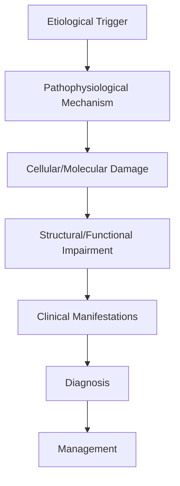
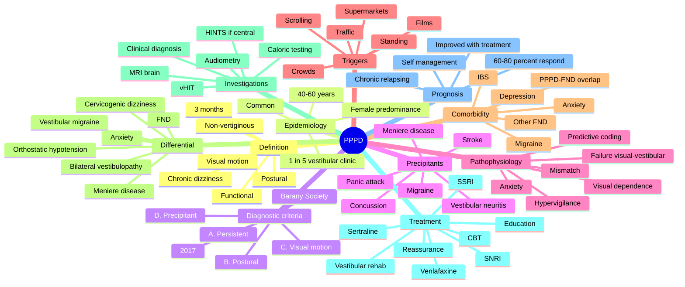

# Persistent Postural-Perceptual Dizziness

> [!tip] **High-Yield Definition**
> Comprehensive clinical note for Persistent Postural-Perceptual Dizziness covering definition, epidemiology, aetiology, pathophysiology, clinical features, investigations, differential diagnosis, management, drug interactions, procedures, complications, red flags, prognosis, topic correlation, and special situations for FCPS/MRCP examination preparation based on Davidson 24th Edition Chapter 25: Neurology.

---

## 1. Definition / Epidemiology / Classification

### Definition
Persistent Postural-Perceptual Dizziness is a neurological disorder within the 15 functional neurological disorders category. It is characterised by specific clinical, pathological, radiological, and laboratory features that allow differentiation from related conditions.

### Epidemiology
- **Incidence/Prevalence:** Variable depending on the specific condition.
- **Age:** Adult onset is most common, but paediatric and elderly presentations occur.
- **Sex:** Variable depending on the condition.
- **Geography:** Worldwide distribution, with higher prevalence in certain regions.
- **Risk Factors:** Genetic predisposition, environmental factors, comorbidities, family history.

### Classification
| Subtype | Key Features | Prognosis |
|---------|-------------|-----------|
| Mild/early | Subtle symptoms, preserved function | Best |
| Moderate | Clear symptoms, functional impairment | Variable |
| Severe | Significant disability, complications | Worst |

---

## 2. Aetiology / Pathophysiology

### Aetiology
- **Primary (idiopathic):** Most cases have no identifiable cause.
- **Genetic:** May be inherited (AD, AR, X-linked, mitochondrial, sporadic).
- **Autoimmune:** Autoantibodies, immune-mediated inflammation.
- **Infectious:** Viral, bacterial, fungal, parasitic.
- **Metabolic:** Electrolyte, endocrine, hepatic, renal, nutritional.
- **Toxic:** Drugs, alcohol, heavy metals, environmental toxins.
- **Vascular:** Ischaemia, haemorrhage, vasculitis.
- **Neoplastic:** Primary, secondary, paraneoplastic.
- **Traumatic:** Acute, chronic, repetitive.
- **Degenerative:** Neurodegeneration, protein misfolding.

### Pathophysiology


---

## 3. Clinical Features

### History
- **Onset/Duration:** Acute, subacute, or chronic.
- **Progression:** Static, progressive, relapsing-remitting, stepwise.
- **Key symptoms:** Specific to the condition.
- **Triggers:** Stress, infection, trauma, drugs, hormonal, environmental.
- **Systemic symptoms:** Constitutional features.
- **Drug/Family/Social history:** Relevant exposures, comorbidities.

### Examination
| Domain | Key Findings | Localisation Value |
|--------|-------------|-------------------|
| Higher function | Cognitive, behavioural | Cortical, subcortical, limbic |
| Cranial nerves | Pupils, eye movements, facial, bulbar | Brainstem, cranial nerve, NMJ |
| Motor | Weakness, tone, reflexes | UMN, LMN, NMJ, muscle |
| Sensory | All modalities, pattern | Peripheral, spinal, brainstem |
| Coordination | Ataxia, nystagmus, dysmetria | Cerebellar, sensory, vestibular |
| Gait | Spastic, ataxic, parkinsonian | Multiple |
| Autonomic | Orthostatic, sweating, GI, bladder | Autonomic, peripheral, central |

### Specific Clinical Features
The clinical features are determined by the underlying aetiology, location of pathology, and rate of progression. Patients typically present with a constellation of symptoms and signs that allow clinical localisation and subsequent targeted investigation.

---

## 4. Diagnostic Approach / Algorithm

```mermaid
flowchart TD
    A[Clinical Presentation] --> B[Anatomical Localisation]
    B --> C[Pathophysiological Category]
    C --> D[Formulate Differential]
    D --> E[Targeted Investigations]
    E --> F[Confirm Diagnosis]
    F --> G[Assess Severity/Prognosis]
    G --> H[Initiate Management]
    H --> I[Monitor Response]
    I --> J{Response?}
    J --> YES1 [Good - Continue]
    J --> NO1 [Poor - Escalate]
    YES1 --> K[Monitor]
    NO1 --> H
```

---

## 5. Investigations

### First-Line Investigations
- **Blood tests:** FBC, U&Es, LFTs, glucose, calcium, magnesium, ESR, CRP, autoimmune, infection.
- **Imaging:** CT/MRI brain/spine (essential for most neurological conditions).
- **Neurophysiology:** EEG, nerve conduction, EMG, evoked potentials.
- **CSF:** Cell count, protein, glucose, OCBs, PCR, culture.

### Second-Line Investigations
- **Genetic testing:** Gene panels, WES, WGS.
- **Antibody testing:** Antineuronal, autoimmune, paraneoplastic.
- **Biopsy:** Nerve, muscle, brain, skin.
- **Advanced imaging:** PET-CT, MR spectroscopy, fMRI.

### Specialised Investigations
- **Biomarkers:** Neurofilament light chain, tau, beta-amyloid, 14-3-3, RT-QuIC.
- **Autonomic testing:** Head-up tilt, sudomotor, QSART.
- **Neuropsychology:** Cognitive testing, behavioural assessment.
- **Genetic counselling:** Family screening, predictive testing.

---

## 6. Differential Diagnosis

| Differential | Distinguishing Features | Key Test |
|--------------|------------------------|----------|
| Vascular | Sudden onset, focal, vascular risk factors | MRI/CT, vessel imaging |
| Inflammatory | Subacute, multifocal, systemic | MRI, CSF, antibodies |
| Infectious | Fever, systemic, exposure | Bloods, CSF, imaging |
| Neoplastic | Progressive, mass effect | MRI, biopsy |
| Degenerative | Progressive, symmetric, hereditary | MRI, genetic |
| Toxic/Metabolic | Drug history, systemic, reversible | Bloods, toxicology |
| Autoimmune | Multifocal, antibodies, immunotherapy response | Antibodies, MRI, CSF |
| Functional | Inconsistent, distractible | Clinical, video, biomarkers |

---

## 7. Management

### Acute Management
- **Stabilisation:** ABCDE approach, emergency resuscitation.
- **Specific treatment:** Disease-specific interventions.
- **Symptomatic relief:** Pain, seizures, spasticity, autonomic dysfunction.
- **Prevention of complications:** DVT, pressure sores, infection.

### Disease-Modifying Treatment
- **Pharmacological:** First-line, second-line, escalation, maintenance.
- **Procedural:** Surgery, biopsy, drainage, ablation, stimulation.
- **Immunotherapy:** Steroids, IVIG, plasma exchange, immunosuppressants, biologics.
- **Rehabilitation:** Physiotherapy, OT, speech therapy.

### Long-Term Management
- **Monitoring:** Clinical, imaging, biomarkers, side effects.
- **Prevention:** Vaccinations, prophylaxis, lifestyle modification.
- **Supportive care:** Multidisciplinary team, social work, psychological support.
- **Palliative care:** Advanced care planning, end-of-life care, hospice.

---

## 8. Drug Interactions / Contraindications / Comorbidity Cautions

| Drug Class | Interaction / Caution | Management |
|------------|----------------------|------------|
| Antiseizure medications | Enzyme induction, teratogenicity | Monitor, supplement, switch |
| Immunosuppressants | Infection, malignancy, teratogenicity | Monitor, prophylaxis |
| Anticoagulants | Bleeding risk, drug interactions | Monitor INR, avoid combinations |
| Antihypertensives | Hypotension, falls | Monitor BP, adjust dose |
| Antibiotics | Nephrotoxicity, ototoxicity | Monitor renal |
| Antivirals | Nephrotoxicity, neuropsychiatric | Monitor renal, dose adjust |
| Steroids | DM, HTN, osteoporosis, infection | Monitor, prophylaxis, taper |
| Biologics | Infusion reactions, infection | Monitor, prophylaxis |

---

## 9. Procedures

### Common Procedures
- **Lumbar puncture:** Diagnostic, therapeutic (IIH, NPH). Contraindications: raised ICP, mass lesion, coagulopathy.
- **Nerve conduction studies/EMG:** Diagnostic, prognosis. Minor discomfort.
- **EEG:** Diagnostic, monitoring. No significant complications.
- **MRI brain/spine:** Diagnostic, monitoring. Contraindications: pacemaker, metallic implants.
- **CT head:** Emergency, rapid. Radiation exposure, contrast reactions.
- **Biopsy:** Stereotactic, open. Indications: diagnosis, molecular profiling.

---

## 10. Complications

| Complication | Frequency | Prevention | Management |
|--------------|-----------|------------|------------|
| Infection | Common | Hygiene, prophylaxis, vaccination | Antibiotics, antifungals |
| Thrombosis | Common | Prophylaxis, mobility | Anticoagulation |
| Pressure sores | Common | Positioning, nutrition | Wound care, surgery |
| Spasticity | Common | Positioning, stretching | Baclofen, BoNT |
| Contractures | Common | Passive movements, splints | Physiotherapy, surgery |
| Aspiration | Common | Swallow assessment | NGT, PEG, thickeners |
| Falls | Common | Environment, mobility | Walking aids |
| Fractures | Common | Bone health, prevention | Vitamin D, bisphosphonate |
| Depression | Common | Screening, support | Antidepressants, CBT |
| Cognitive decline | Variable | Monitoring, training | Rehabilitation |
| Autonomic dysfunction | Variable | Monitoring, hydration | Midodrine, fludrocortisone |
| Respiratory failure | Variable | Monitoring, supportive | Ventilation, NIV |
| Death | Variable | Monitoring, palliative | End-of-life care |

---

## 11. Red Flags / Emergencies

### Emergency Presentations
- **Rapid neurological deterioration:** New focal deficit, decreased consciousness, seizures.
- **Status epilepticus:** Continuous seizures >5 min.
- **Raised ICP:** Headache, vomiting, papilloedema, altered consciousness.
- **Respiratory failure:** Hypoxia, hypercapnia, ventilatory failure.
- **Cardiac arrest:** Arrhythmia, MI, pulmonary embolism.
- **Infection:** Sepsis, meningitis, abscess, encephalitis.
- **Drug toxicity:** Overdose, side effects, interactions.
- **Haemorrhage:** Intracranial, systemic, coagulopathy.

---

## 12. Prognosis

### Natural History
- **Acute:** May resolve with treatment, may progress, may be fatal.
- **Subacute:** Variable, depends on cause and treatment.
- **Chronic:** Often progressive, may be stable, may have relapses.
- **Recovery:** Variable, may be complete, partial, or none.

### Prognostic Factors
- **Favourable:** Young age, early treatment, mild disease, reversible cause, good premorbid function, family support.
- **Unfavourable:** Older age, delayed treatment, severe disease, irreversible cause, poor premorbid function, comorbidities.

---

## 13. Topic Correlation

| Related Topic | Link | Key Overlap |
|---------------|------|-------------|
| Davidson 24th Ed Chapter 25 | [[Davidson Chapter 25 - Neurology Hierarchy]] | Comprehensive neurology |
| Neurology MOC | [[Neurology MOC]] | All neurology topics |
| Drug Reference | [[../00_Index/Neurology Drug Reference]] | Medications |
| Local Hub | [[../15_Functional_Neurological_Disorders/Hub]] | Section-specific |
| Clinical Examination | [[../01_Fundamentals_Examination/Neurological History Taking]] | Clinical approach |
| Investigation | [[../01_Fundamentals_Examination/Neuroimaging (CT-MRI) Principles]] | Imaging |

---

## 14. Special Situations

| Situation | Consideration |
|-----------|---------------|
| **Pregnancy** | Pre-conception counselling, teratogenicity, drug safety, monitoring, delivery planning, breastfeeding. |
| **Lactation** | Drug safety, breastfeeding, monitoring, support. |
| **Paediatric** | Developmental considerations, drug dosing, school, family, vaccination, growth, puberty. |
| **Elderly / Frail** | Comorbidities, polypharmacy, falls, bone health, cognition, social, end-of-life. |
| **Renal impairment** | Drug dose adjustment, monitoring, dialysis, transplant. |
| **Hepatic impairment** | Drug dose adjustment, monitoring, transplant. |
| **Immunocompromised** | Infection prophylaxis, vaccination, drug interactions, malignancy screening. |
| **Perioperative** | Drug management, anaesthesia planning, VTE prophylaxis, infection prevention, monitoring. |
| **Driving / DVLA** | Fitness to drive, restrictions, notification, reassessment. |
| **Occupational** | Fitness for work, adaptations, rehabilitation, disability, return to work. |

---

## FCPS/MRCP High-Yield Summary

| Category | Key Points |
|----------|------------|
| **Definition** | Comprehensive definition with key diagnostic criteria |
| **Epidemiology** | Incidence, prevalence, age, sex, geography, risk factors |
| **Aetiology** | Primary causes, secondary causes, genetic, environmental |
| **Pathophysiology** | Mechanism of disease, cellular/molecular basis |
| **Clinical Features** | History, examination, key findings, variants |
| **Diagnosis** | Diagnostic criteria, classification, severity |
| **Investigations** | First-line, second-line, specialised, biomarkers |
| **Differential Diagnosis** | Key differentials, distinguishing features, tests |
| **Management** | Acute, disease-modifying, symptomatic, supportive |
| **Complications** | Common, serious, prevention, management |
| **Prognosis** | Natural history, prognostic factors, outcomes |
| **Viva Pearls** | Key examination points |
| **Drug Doses** | First-line, second-line, emergency |
| **Scoring Systems** | Specific scores used in management |
| **Genetics** | Inheritance, genes, mutations, family screening |
| **Imaging Signs** | Characteristic findings, differential |

---

## Viva Questions (PACES/FCPS Style)

1. **Q:** Define and classify its variants.
   **A:** Comprehensive definition with classification of subtypes based on aetiology, severity, and clinical features.

2. **Q:** What are the key clinical features?
   **A:** Specific symptoms and signs including onset, progression, key features, and associated findings.

3. **Q:** What is the first-line treatment?
   **A:** First-line pharmacological and non-pharmacological management based on current evidence.

4. **Q:** What are the red flags requiring urgent referral?
   **A:** Specific emergency presentations and complications requiring immediate intervention.

5. **Q:** What is the prognosis?
   **A:** Natural history, prognostic factors, and long-term outcomes.

6. **Q:** How do you differentiate from key differentials?
   **A:** Clinical features, investigations, and response to treatment that distinguish from alternative diagnoses.

7. **Q:** What investigations are most useful?
   **A:** First-line and second-line investigations including imaging, neurophysiology, CSF, and biomarkers.

8. **Q:** Describe the stepwise management approach.
   **A:** Stepwise escalation from first-line to second-line to third-line therapy with monitoring.

9. **Q:** What are the emergency presentations?
   **A:** Specific emergency scenarios and immediate management priorities.

10. **Q:** How does management change in pregnancy/paediatrics/elderly?
    **A:** Special considerations for each population including drug safety, monitoring, and support.

---

## Common Confusions / Exam Traps

| Confusion | Clarification |
|-----------|---------------|
| Similar presentation but different cause | Differentiate by history, examination, investigations |
| Treatment response vs natural history | Assess with objective measures, biomarkers |
| Drug interactions | Check each drug, monitor, adjust doses |
| Disease progression vs treatment failure | Monitor response, escalate appropriately |
| Functional vs organic | Inconsistent, distractible, disability greater than impairment |
| Acute vs chronic | Time course, progression, reversibility |
| Primary vs secondary | Underlying cause, contributing factors |
| Side effects vs symptoms | Temporal relationship, dose relationship |

---

## Mnemonics

1. **3 P's of PPPD** — Bárány Society diagnostic essentials:
   - **P**ersistent dizziness (≥ 3 months, present most days, often daily)
   - **P**ostural exacerbation (worse on standing / upright posture)
   - **P**erceptual exacerbation (worse with visual motion — crowds, traffic, scrolling, supermarket aisles)

2. **BARÁNY** — diagnostic and therapeutic cornerstones of PPPD:
   - **B**alance disturbance (not vertigo — non-spinning dizziness, unsteadiness)
   - **A**ctivity worsens it (motion of self or environment)
   - **R**elieved by rest and visual fixation
   - **A**cute vestibular trigger in ~50% (preceding vestibular neuritis, Ménière's, central cause)
   - **N**o spontaneous vertigo while sitting still in a quiet environment
   - **Y**ields to SSRIs / SNRIs (e.g., sertraline, paroxetine, venlafaxine) + vestibular rehab + CBT

3. **VISUAL HEIGHTS** — features and comorbidities:
   - **V**isual dependence (excessive reliance on vision for balance)
   - **I**ncreased by moving visual scenes (escalators, traffic, scrolling)
   - **S**upermarkets, crowds, shopping centres — typical aggravators
   - **U**pright posture worsens (better supine)
   - **A**ctive AND passive motion worsen (head turn, walking, riding in a car)
   - **L**ightheaded / rocking / swaying (not spinning)
   - **H**abitual triggers (computer work, films, grocery shopping)
   - **E**xcessive visual / postural processing (Bayesian prediction mismatch)
   - **I**nteracts with anxiety and hypervigilance
   - **G**enerally refractory to standard vestibular sedatives
   - **H**igh comorbidity with migraine, FND, anxiety
   - **T**reatment is multi-modal: SSRI + VRT + CBT
   - **S**leep, hydration, and exercise must be optimised

---

## Mind Map



---

## Spaced Repetition Trackers

| Day | Focus | Self-Test Questions | Score /10 |
|-----|-------|---------------------|-----------|
| **Day 1** | Definition & criteria | (1) Define PPPD. (2) Minimum duration. (3) Bárány Society criteria year. (4) 3 core features. (5) Why not vertigo. (6) Functional vs structural. (7) Is it conscious? (8) Most common precipitant. (9) What is visual dependence. (10) Why is it a FND. |  |
| **Day 3** | Pathophysiology | (1) Visual-vestibular mismatch. (2) Bayesian prediction. (3) High visual dependence. (4) Postural control theory. (5) Anxiety hypervigilance. (6) Acute trigger then chronicity. (7) Failure of visual reweighting. (8) Static vs dynamic posturography. (9) Functional imaging. (10) Connection to migraine. |  |
| **Day 7** | Triggers & clinical features | (1) Most common triggers. (2) Why supermarkets. (3) Crowds effect. (4) Screen / scrolling. (5) Standing vs sitting. (6) Head movement. (7) Driving / passenger. (8) Stress relationship. (9) Sleep deprivation. (10) Photophobia. |  |
| **Day 14** | Investigations | (1) Diagnosis clinical or test. (2) When to do HINTS. (3) Audiometry role. (4) Caloric testing. (5) vHIT. (6) MRI brain — when. (7) Vestibular migraine overlap. (8) 24-hour BP / orthostatic. (9) Video head impulse. (10) Why not to over-image. |  |
| **Day 30** | Differential diagnosis | (1) Vestibular migraine. (2) Bilateral vestibulopathy. (3) Ménière's disease. (4) Cervicogenic dizziness. (5) Orthostatic hypotension. (6) Cardiac arrhythmia. (7) Posterior circulation stroke. (8) Anxiety / panic. (9) FND overlap. (10) Persistent postural-perceptual vs phobic postural vertigo. |  |
| **Day 90** | Management & prognosis | (1) SSRI evidence. (2) SNRI evidence. (3) Vestibular rehab specifics. (4) CBT role. (5) Duration of SSRI trial. (6) Lifestyle measures. (7) Exercise. (8) Sleep. (9) Prognosis. (10) Relapse rate. |  |

---

## Self-Test Scorecard

Score each domain 0–5 (5 = confident, 0 = no idea). Re-test monthly.

| # | Domain | /5 |
|---|--------|-----|
| 1 | Bárány Society criteria |  |
| 2 | Pathophysiology (visual-vestibular mismatch) |  |
| 3 | Triggers & clinical features |  |
| 4 | Differential diagnosis (migraine, Ménière's, etc.) |  |
| 5 | Investigations & HINTS |  |
| 6 | SSRI / SNRI pharmacology |  |
| 7 | Vestibular rehabilitation |  |
| 8 | CBT & psychological therapy |  |
| 9 | Comorbidity (migraine, anxiety, FND) |  |
| 10 | Prognosis & long-term management |  |
| **Total** | **/50** |  |

---

## MCQs (10)

1. **Question:** What is the minimum duration of symptoms required for the diagnosis of PPPD (Bárány Society criteria, 2017)?
   **Options:** A. 1 week B. 1 month C. 3 months D. 6 months E. 12 months
   **Answer:** C
   **Explanation:** The Bárány Society 2017 consensus requires symptoms for ≥ 3 months, present most days (often worsening through the day), with the three core features of persistent dizziness, postural exacerbation, and visual motion exacerbation.

2. **Question:** A patient with PPPD reports worsening dizziness in supermarkets and shopping centres. This is best described as:
   **Options:** A. Visual motion-triggered exacerbation B. Vestibular migraine C. Ménière's disease D. Phobic postural vertigo E. Orthostatic hypotension
   **Answer:** A
   **Explanation:** A core feature of PPPD is exacerbation by *moving visual scenes* (supermarkets, crowds, escalators, traffic, scrolling). This is not vertigo (no spinning), but a sense of imbalance, rocking, or lightheadedness provoked by visual motion.

3. **Question:** Which of the following is the *first-line* pharmacological treatment for PPPD?
   **Options:** A. Prochlorperazine B. Betahistine C. An SSRI (e.g., sertraline) or SNRI (e.g., venlafaxine) D. Cinnarizine E. Diazepam
   **Answer:** C
   **Explanation:** SSRIs (sertraline, paroxetine, fluvoxamine) and SNRIs (venlafaxine) are the first-line pharmacological treatments for PPPD. Vestibular sedatives (prochlorperazine, cinnarizine) may help acute vertigo but are *not* effective in PPPD and can prolong symptoms.

4. **Question:** A patient with vestibular neuritis is recovering but, 4 months later, has ongoing dizziness worse in supermarkets, on standing, and when watching TV. Examination is normal. What is the most likely diagnosis?
   **Options:** A. Recurrent vestibular neuritis B. Ménière's disease C. PPPD D. Posterior circulation stroke E. Vestibular schwannoma
   **Answer:** C
   **Explanation:** PPPD is frequently *precipitated* by an acute vestibular event (vestibular neuritis, Ménière's, central). After the acute event settles, the patient develops persistent, non-vertiginous dizziness with postural and visual motion triggers — the classic PPPD phenotype.

5. **Question:** Why is vestibular rehabilitation effective in PPPD?
   **Options:** A. It suppresses the abnormal vestibular signal B. It promotes reweighting of visual, somatosensory, and vestibular inputs and reduces visual dependence C. It replaces lost vestibular function D. It treats Meniere disease E. It sedates the vestibular nucleus
   **Answer:** B
   **Explanation:** VRT in PPPD focuses on *retraining* balance, *reducing* visual dependence, and *reweighting* sensory inputs. Approaches include exposure to provocative visual stimuli (grocery-store-style tasks), static and dynamic balance work, and graded activity.

6. **Question:** A patient with PPPD asks, "Will I ever get better?" What is the most accurate response?
   **Options:** A. "No, this is permanent." B. "Most patients improve significantly with a combination of SSRI/SNRI, vestibular rehabilitation, CBT, and lifestyle measures, although relapses can occur." C. "Surgery will fix it." D. "Bed rest is required." E. "Stop all medications."
   **Answer:** B
   **Explanation:** With multimodal therapy (SSRI/SNRI + VRT + CBT + lifestyle), 60–80% of patients improve substantially. However, PPPD can be chronic and relapsing, especially with stress, fatigue, or new vestibular insults. Relapse plans are part of management.

7. **Question:** Which comorbidity is *most* strongly associated with PPPD?
   **Options:** A. Parkinson's disease B. Migraine C. Multiple sclerosis D. Motor neurone disease E. Peripheral neuropathy
   **Answer:** B
   **Explanation:** Migraine (especially vestibular migraine) is the most common comorbidity in PPPD. Anxiety, depression, and other functional neurological symptoms are also highly prevalent. Screening for these is part of the assessment.

8. **Question:** What is the typical *quality* of dizziness in PPPD?
   **Options:** A. Spinning vertigo (rotational) B. Non-spinning: lightheadedness, rocking, swaying, imbalance, "walking on a boat" C. Drop attacks D. Pulsatile tinnitus E. Brief seconds-long rotational vertigo
   **Answer:** B
   **Explanation:** PPPD is *not* a true rotational vertigo. Patients describe lightheadedness, swaying, rocking, imbalance, "walking on marshmallows", or a sensation of motion that is *not* rotational. This distinguishes it from Ménière's and vestibular neuritis.

9. **Question:** A patient with PPPD is on sertraline 50 mg for 8 weeks without benefit. What is the most appropriate next step?
   **Options:** A. Stop sertraline B. Increase dose to 100–200 mg, ensure 12-week trial, consider switching to venlafaxine, and continue / intensify VRT and CBT C. Add prochlorperazine D. Add diazepam E. Refer for surgery
   **Answer:** B
   **Explanation:** SSRIs typically require a 10–12 week trial at therapeutic dose (e.g., sertraline 100–200 mg, paroxetine 20–40 mg). Failure at low dose warrants either dose increase or switch to venlafaxine (an SNRI with positive trial data in PPPD). Vestibular rehabilitation and CBT are continuous, not optional.

10. **Question:** Why is prolonged use of prochlorperazine *not* recommended in PPPD?
    **Options:** A. It is too expensive B. It may prolong recovery by suppressing vestibular compensation and is not effective in PPPD C. It is addictive D. It causes hearing loss E. It cures PPPD too quickly
    **Answer:** B
    **Explanation:** Prochlorperazine and other vestibular sedatives (cinnarizine, dimenhydrinate) suppress vestibular compensation. They are useful for acute vertigo but prolong and worsen chronic PPPD. They should be avoided long-term.

---

## SBA Questions (10)

1. **Scenario:** A 48-year-old woman has had constant, non-spinning dizziness for 6 months. It is worse in supermarkets, in crowds, when scrolling on her phone, and on standing from a chair. She had vestibular neuritis 7 months ago. Examination is unremarkable; HINTS, ECG, and MRI brain are normal.
   **Question:** What is the most likely diagnosis?
   **Options:** A. Recurrent vestibular neuritis B. Ménière's disease C. PPPD D. Posterior circulation TIA E. Vestibular schwannoma
   **Answer:** C
   **Explanation:** Classic PPPD: chronic, non-spinning dizziness, postural and visual motion triggers, preceded by vestibular neuritis. Examination is characteristically *normal*, which is part of the diagnosis.

2. **Scenario:** A 55-year-old man with PPPD asks, "Should I avoid going to the supermarket?"
   **Question:** What is the most appropriate advice?
   **Options:** A. Yes, avoid it B. Use a wheelchair C. No — supervised, graded exposure to the supermarket is part of vestibular rehabilitation; avoidance perpetuates the problem D. Take diazepam beforehand E. Wear dark glasses only
   **Answer:** C
    **Explanation:** Avoidance (agoraphobia, supermarket avoidance) is a common iatrogenic consequence of PPPD and worsens outcome. Graded, supervised exposure to provocative environments is part of VRT and CBT. The patient should be encouraged to return, with paced progression.

3. **Scenario:** A patient with PPPD is started on sertraline. What is the most appropriate counselling regarding onset of action?
   **Options:** A. "It will work immediately." B. Explain that benefit is typically seen at 8–12 weeks at therapeutic dose, and continue VRT and CBT in parallel C. "It will work in 3 days." D. "Discontinue all other therapy." E. "Take it only when dizzy."
   **Answer:** B
   **Explanation:** SSRIs in PPPD take 8–12 weeks at adequate dose. Concomitant VRT and CBT improve outcomes. Premature discontinuation for "non-response" at 4 weeks is a common mistake.

4. **Scenario:** A 50-year-old with PPPD is severely anxious. What is the most appropriate first-line psychological therapy?
   **Options:** A. Long-term psychoanalysis B. CBT (cognitive behavioural therapy) with focus on catastrophic thinking, hypervigilance, and avoidance C. Hypnosis D. Psychodynamic therapy only E. Pharmacotherapy only
   **Answer:** B
   **Explanation:** CBT is the first-line psychological therapy for PPPD, often delivered alongside VRT. It targets catastrophic thinking, hypervigilance to body sensations, and avoidance behaviours. Pharmacotherapy alone is rarely sufficient.

5. **Scenario:** A patient with PPPD has persistent symptoms despite 6 months of VRT, an adequate SSRI trial, and CBT. What is the most appropriate next step?
   **Options:** A. Discharge B. Trial of venlafaxine (SNRI), consider combination therapy (SSRI + VRT + CBT), re-evaluate the diagnosis if no response C. Repeat MRI C. Start Epley manoeuvre E. Add carbamazepine
   **Answer:** B
   **Explanation:** Switching to venlafaxine (which has its own RCT data in PPPD) is appropriate after SSRI failure. The combination of SSRI/SNRI + VRT + CBT is the gold standard. If the patient truly fails all three, re-evaluation for vestibular migraine, bilateral vestibulopathy, or other diagnosis is appropriate.

6. **Scenario:** A 60-year-old man with PPPD has new-onset severe headache, vomiting, and ataxia. What is the most appropriate immediate action?
   **Options:** A. Increase SSRI B. Same-day neurological assessment, urgent MRI brain / CT to exclude posterior fossa stroke; do *not* assume PPPD reactivation C. CBT C. Continue current management E. Epley manoeuvre
   **Answer:** B
   **Explanation:** New red-flag features (severe headache, vomiting, focal ataxia, new neurological signs) override the PPPD diagnosis. Posterior circulation stroke must be excluded urgently. PPPD is a diagnosis of *exclusion* in atypical presentations.

7. **Scenario:** A patient with PPPD has a history of migraine with aura. What is the most appropriate approach?
   **Options:** A. Ignore migraine B. Treat migraine actively (e.g., CGRP antagonist, propranolol, topiramate) plus PPPD-specific therapy, as migraine is a common precipitant and amplifier C. Stop SSRI D. Refer for VRT only E. Stop caffeine
   **Answer:** B
   **Explanation:** Migraine and PPPD frequently coexist. Active migraine prophylaxis (e.g., CGRP antagonists, beta-blockers, topiramate) is part of the broader management. Untreated migraine worsens PPPD symptoms and limits SSRI/SNRI benefit.

8. **Scenario:** A 35-year-old with PPPD wants to start a graded exercise programme. What is the most appropriate advice?
   **Options:** A. Bed rest B. Couch-to-5K-style progression with supervision, vestibular rehabilitation, and pacing — start low, progress slowly C. Marathon training immediately D. Avoid exercise E. Only yoga
   **Answer:** B
   **Explanation:** Graded exercise (aerobic, vestibular) is part of PPPD management. Couch-to-5K-style progression is a useful model. Exercise improves central vestibular compensation, mood, sleep, and confidence.

9. **Scenario:** A patient with PPPD relapses after stopping sertraline. What is the most appropriate action?
   **Options:** A. Switch to a different SSRI immediately B. Restart the previously effective dose and continue for a longer maintenance period; review precipitants (stress, sleep, vestibular insult) C. Start long-term benzodiazepine D. Discharge E. Add a fourth-line agent
   **Answer:** B
   **Explanation:** PPPD often relapses with stress, sleep deprivation, or new vestibular insults. Restarting the previously effective SSRI/SNRI, intensifying VRT and CBT, and addressing precipitants is the standard approach.

10. **Scenario:** A patient with PPPD asks, "Is this all in my head?"
    **Question:** What is the most accurate response?
    **Options:** A. "Yes, it's all in your head." B. "The symptoms are real and produced by a brain function problem — visual and balance systems are mis-calibrated. We can retrain this with vestibular rehabilitation, and SSRI/SNRI plus CBT address the underlying brain processing." C. "There is nothing wrong." D. "Take benzodiazepines." E. "Discharge."
    **Answer:** B
    **Explanation:** Patients frequently ask this question. The current model is: real symptoms, brain function problem, demonstrable mechanism (visual dependence, postural control failure), and a multimodal, evidence-based treatment plan.

---

## Tags

`#PPPD #PersistentPosturalPerceptualDizziness #3Ps #BaranySociety #FunctionalDizziness #VisualDependence #VisualVestibularMismatch #SSRI #Venlafaxine #Sertraline #VestibularRehab #VRT #CBT #Migraine #VestibularNeuritis #FND #ChronicDizziness #PhobicPosturalVertigo`

---

## Local Navigation
**Heading Hub:** [[../Hub]]  
**Chapter Hierarchy:** [[Davidson Chapter 25 - Neurology Hierarchy]]  
**Chapter MOC:** [[Neurology MOC]]  
**Drug Reference:** [[../00_Index/Neurology Drug Reference]]

## PasTest Scenario SBAs (Clinical Vignettes)

> **Auto-generated PasTest/Mediscope-style scenario SBAs** grounded in the authored source. Each scenario tests a real clinical fact (triad, specific sign, contraindication, trial, first-line Rx) extracted from the topic. *Source: Ch 27: Neurology & Stroke — Persistent Postural-Perceptual Dizziness*

**Q1.** Which of the following features is most specific or characteristic of Persistent Postural-Perceptual Dizziness?

  - **A.** Key symptoms:
  - **B.** A feature common to many acute inflammatory conditions
  - **C.** A non-specific sign that does not localise the diagnosis
  - **D.** An investigation finding rather than a clinical feature

  > **Answer: A** — Key symptoms:
  >
  > *Source:* - **Key symptoms:** Specific to the condition

**Q2.** What is the most appropriate first-line therapy for Persistent Postural-Perceptual Dizziness?

  - **A.** Rehabilitation:
  - **B.** An advanced/surgical therapy reserved for refractory disease
  - **C.** Symptomatic treatment only, no disease-modifying therapy
  - **D.** Empiric broad-spectrum therapy without specific indication

  > **Answer: A** — Rehabilitation:
  >
  > *Source:* **Rehabilitation:** Physiotherapy, OT, speech therapy.

