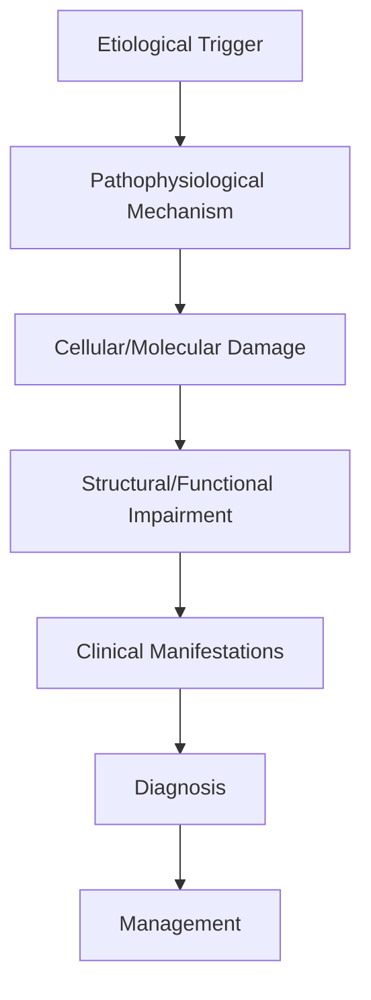
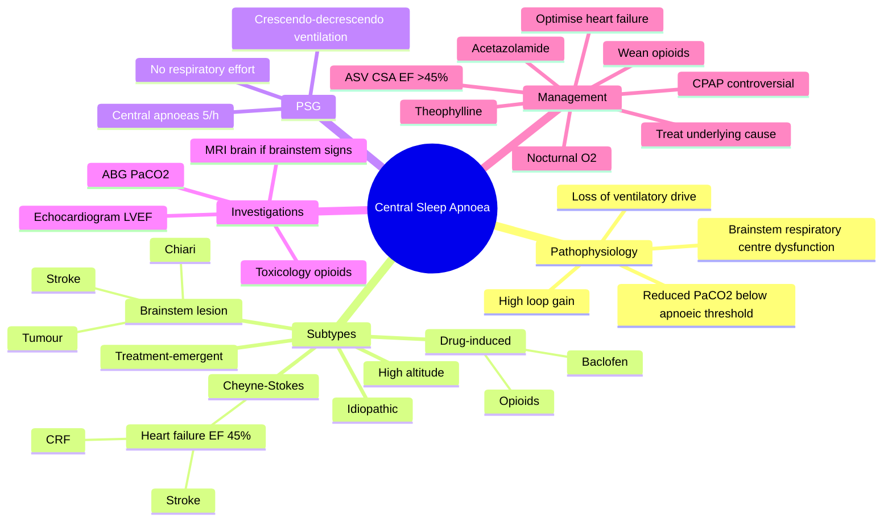

# Central Sleep Apnoea

> [!tip] **High-Yield Definition**
> Comprehensive clinical note for Central Sleep Apnoea covering definition, epidemiology, aetiology, pathophysiology, clinical features, investigations, differential diagnosis, management, drug interactions, procedures, complications, red flags, prognosis, topic correlation, and special situations for FCPS/MRCP examination preparation based on Davidson 24th Edition Chapter 25: Neurology.

---

## 1. Definition / Epidemiology / Classification

### Definition
Central Sleep Apnoea is a neurological disorder within the 16 sleep disorders category. It is characterised by specific clinical, pathological, radiological, and laboratory features that allow differentiation from related conditions.

### Epidemiology
- **Incidence/Prevalence:** Variable depending on the specific condition.
- **Age:** Adult onset is most common, but paediatric and elderly presentations occur.
- **Sex:** Variable depending on the condition.
- **Geography:** Worldwide distribution, with higher prevalence in certain regions.
- **Risk Factors:** Genetic predisposition, environmental factors, comorbidities, family history.

### Classification
| Subtype | Key Features | Prognosis |
|---------|-------------|-----------|
| Mild/early | Subtle symptoms, preserved function | Best |
| Moderate | Clear symptoms, functional impairment | Variable |
| Severe | Significant disability, complications | Worst |

---

## 2. Aetiology / Pathophysiology

### Aetiology
- **Primary (idiopathic):** Most cases have no identifiable cause.
- **Genetic:** May be inherited (AD, AR, X-linked, mitochondrial, sporadic).
- **Autoimmune:** Autoantibodies, immune-mediated inflammation.
- **Infectious:** Viral, bacterial, fungal, parasitic.
- **Metabolic:** Electrolyte, endocrine, hepatic, renal, nutritional.
- **Toxic:** Drugs, alcohol, heavy metals, environmental toxins.
- **Vascular:** Ischaemia, haemorrhage, vasculitis.
- **Neoplastic:** Primary, secondary, paraneoplastic.
- **Traumatic:** Acute, chronic, repetitive.
- **Degenerative:** Neurodegeneration, protein misfolding.

### Pathophysiology


---

## 3. Clinical Features

### History
- **Onset/Duration:** Acute, subacute, or chronic.
- **Progression:** Static, progressive, relapsing-remitting, stepwise.
- **Key symptoms:** Specific to the condition.
- **Triggers:** Stress, infection, trauma, drugs, hormonal, environmental.
- **Systemic symptoms:** Constitutional features.
- **Drug/Family/Social history:** Relevant exposures, comorbidities.

### Examination
| Domain | Key Findings | Localisation Value |
|--------|-------------|-------------------|
| Higher function | Cognitive, behavioural | Cortical, subcortical, limbic |
| Cranial nerves | Pupils, eye movements, facial, bulbar | Brainstem, cranial nerve, NMJ |
| Motor | Weakness, tone, reflexes | UMN, LMN, NMJ, muscle |
| Sensory | All modalities, pattern | Peripheral, spinal, brainstem |
| Coordination | Ataxia, nystagmus, dysmetria | Cerebellar, sensory, vestibular |
| Gait | Spastic, ataxic, parkinsonian | Multiple |
| Autonomic | Orthostatic, sweating, GI, bladder | Autonomic, peripheral, central |

### Specific Clinical Features
The clinical features are determined by the underlying aetiology, location of pathology, and rate of progression. Patients typically present with a constellation of symptoms and signs that allow clinical localisation and subsequent targeted investigation.

---

## 4. Diagnostic Approach / Algorithm

```mermaid
flowchart TD
    A[Clinical Presentation] --> B[Anatomical Localisation]
    B --> C[Pathophysiological Category]
    C --> D[Formulate Differential]
    D --> E[Targeted Investigations]
    E --> F[Confirm Diagnosis]
    F --> G[Assess Severity/Prognosis]
    G --> H[Initiate Management]
    H --> I[Monitor Response]
    I --> J{Response?}
    J --> YES1 [Good - Continue]
    J --> NO1 [Poor - Escalate]
    YES1 --> K[Monitor]
    NO1 --> H
```

---

## 5. Investigations

### First-Line Investigations
- **Blood tests:** FBC, U&Es, LFTs, glucose, calcium, magnesium, ESR, CRP, autoimmune, infection.
- **Imaging:** CT/MRI brain/spine (essential for most neurological conditions).
- **Neurophysiology:** EEG, nerve conduction, EMG, evoked potentials.
- **CSF:** Cell count, protein, glucose, OCBs, PCR, culture.

### Second-Line Investigations
- **Genetic testing:** Gene panels, WES, WGS.
- **Antibody testing:** Antineuronal, autoimmune, paraneoplastic.
- **Biopsy:** Nerve, muscle, brain, skin.
- **Advanced imaging:** PET-CT, MR spectroscopy, fMRI.

### Specialised Investigations
- **Biomarkers:** Neurofilament light chain, tau, beta-amyloid, 14-3-3, RT-QuIC.
- **Autonomic testing:** Head-up tilt, sudomotor, QSART.
- **Neuropsychology:** Cognitive testing, behavioural assessment.
- **Genetic counselling:** Family screening, predictive testing.

---

## 6. Differential Diagnosis

| Differential | Distinguishing Features | Key Test |
|--------------|------------------------|----------|
| Vascular | Sudden onset, focal, vascular risk factors | MRI/CT, vessel imaging |
| Inflammatory | Subacute, multifocal, systemic | MRI, CSF, antibodies |
| Infectious | Fever, systemic, exposure | Bloods, CSF, imaging |
| Neoplastic | Progressive, mass effect | MRI, biopsy |
| Degenerative | Progressive, symmetric, hereditary | MRI, genetic |
| Toxic/Metabolic | Drug history, systemic, reversible | Bloods, toxicology |
| Autoimmune | Multifocal, antibodies, immunotherapy response | Antibodies, MRI, CSF |
| Functional | Inconsistent, distractible | Clinical, video, biomarkers |

---

## 7. Management

### Acute Management
- **Stabilisation:** ABCDE approach, emergency resuscitation.
- **Specific treatment:** Disease-specific interventions.
- **Symptomatic relief:** Pain, seizures, spasticity, autonomic dysfunction.
- **Prevention of complications:** DVT, pressure sores, infection.

### Disease-Modifying Treatment
- **Pharmacological:** First-line, second-line, escalation, maintenance.
- **Procedural:** Surgery, biopsy, drainage, ablation, stimulation.
- **Immunotherapy:** Steroids, IVIG, plasma exchange, immunosuppressants, biologics.
- **Rehabilitation:** Physiotherapy, OT, speech therapy.

### Long-Term Management
- **Monitoring:** Clinical, imaging, biomarkers, side effects.
- **Prevention:** Vaccinations, prophylaxis, lifestyle modification.
- **Supportive care:** Multidisciplinary team, social work, psychological support.
- **Palliative care:** Advanced care planning, end-of-life care, hospice.

---

## 8. Drug Interactions / Contraindications / Comorbidity Cautions

| Drug Class | Interaction / Caution | Management |
|------------|----------------------|------------|
| Antiseizure medications | Enzyme induction, teratogenicity | Monitor, supplement, switch |
| Immunosuppressants | Infection, malignancy, teratogenicity | Monitor, prophylaxis |
| Anticoagulants | Bleeding risk, drug interactions | Monitor INR, avoid combinations |
| Antihypertensives | Hypotension, falls | Monitor BP, adjust dose |
| Antibiotics | Nephrotoxicity, ototoxicity | Monitor renal |
| Antivirals | Nephrotoxicity, neuropsychiatric | Monitor renal, dose adjust |
| Steroids | DM, HTN, osteoporosis, infection | Monitor, prophylaxis, taper |
| Biologics | Infusion reactions, infection | Monitor, prophylaxis |

---

## 9. Procedures

### Common Procedures
- **Lumbar puncture:** Diagnostic, therapeutic (IIH, NPH). Contraindications: raised ICP, mass lesion, coagulopathy.
- **Nerve conduction studies/EMG:** Diagnostic, prognosis. Minor discomfort.
- **EEG:** Diagnostic, monitoring. No significant complications.
- **MRI brain/spine:** Diagnostic, monitoring. Contraindications: pacemaker, metallic implants.
- **CT head:** Emergency, rapid. Radiation exposure, contrast reactions.
- **Biopsy:** Stereotactic, open. Indications: diagnosis, molecular profiling.

---

## 10. Complications

| Complication | Frequency | Prevention | Management |
|--------------|-----------|------------|------------|
| Infection | Common | Hygiene, prophylaxis, vaccination | Antibiotics, antifungals |
| Thrombosis | Common | Prophylaxis, mobility | Anticoagulation |
| Pressure sores | Common | Positioning, nutrition | Wound care, surgery |
| Spasticity | Common | Positioning, stretching | Baclofen, BoNT |
| Contractures | Common | Passive movements, splints | Physiotherapy, surgery |
| Aspiration | Common | Swallow assessment | NGT, PEG, thickeners |
| Falls | Common | Environment, mobility | Walking aids |
| Fractures | Common | Bone health, prevention | Vitamin D, bisphosphonate |
| Depression | Common | Screening, support | Antidepressants, CBT |
| Cognitive decline | Variable | Monitoring, training | Rehabilitation |
| Autonomic dysfunction | Variable | Monitoring, hydration | Midodrine, fludrocortisone |
| Respiratory failure | Variable | Monitoring, supportive | Ventilation, NIV |
| Death | Variable | Monitoring, palliative | End-of-life care |

---

## 11. Red Flags / Emergencies

### Emergency Presentations
- **Rapid neurological deterioration:** New focal deficit, decreased consciousness, seizures.
- **Status epilepticus:** Continuous seizures >5 min.
- **Raised ICP:** Headache, vomiting, papilloedema, altered consciousness.
- **Respiratory failure:** Hypoxia, hypercapnia, ventilatory failure.
- **Cardiac arrest:** Arrhythmia, MI, pulmonary embolism.
- **Infection:** Sepsis, meningitis, abscess, encephalitis.
- **Drug toxicity:** Overdose, side effects, interactions.
- **Haemorrhage:** Intracranial, systemic, coagulopathy.

---

## 12. Prognosis

### Natural History
- **Acute:** May resolve with treatment, may progress, may be fatal.
- **Subacute:** Variable, depends on cause and treatment.
- **Chronic:** Often progressive, may be stable, may have relapses.
- **Recovery:** Variable, may be complete, partial, or none.

### Prognostic Factors
- **Favourable:** Young age, early treatment, mild disease, reversible cause, good premorbid function, family support.
- **Unfavourable:** Older age, delayed treatment, severe disease, irreversible cause, poor premorbid function, comorbidities.

---

## 13. Topic Correlation

| Related Topic | Link | Key Overlap |
|---------------|------|-------------|
| Davidson 24th Ed Chapter 25 | [[Davidson Chapter 25 - Neurology Hierarchy]] | Comprehensive neurology |
| Neurology MOC | [[Neurology MOC]] | All neurology topics |
| Drug Reference | [[../00_Index/Neurology Drug Reference]] | Medications |
| Local Hub | [[../16_Sleep_Disorders/Hub]] | Section-specific |
| Clinical Examination | [[../01_Fundamentals_Examination/Neurological History Taking]] | Clinical approach |
| Investigation | [[../01_Fundamentals_Examination/Neuroimaging (CT-MRI) Principles]] | Imaging |

---

## 14. Special Situations

| Situation | Consideration |
|-----------|---------------|
| **Pregnancy** | Pre-conception counselling, teratogenicity, drug safety, monitoring, delivery planning, breastfeeding. |
| **Lactation** | Drug safety, breastfeeding, monitoring, support. |
| **Paediatric** | Developmental considerations, drug dosing, school, family, vaccination, growth, puberty. |
| **Elderly / Frail** | Comorbidities, polypharmacy, falls, bone health, cognition, social, end-of-life. |
| **Renal impairment** | Drug dose adjustment, monitoring, dialysis, transplant. |
| **Hepatic impairment** | Drug dose adjustment, monitoring, transplant. |
| **Immunocompromised** | Infection prophylaxis, vaccination, drug interactions, malignancy screening. |
| **Perioperative** | Drug management, anaesthesia planning, VTE prophylaxis, infection prevention, monitoring. |
| **Driving / DVLA** | Fitness to drive, restrictions, notification, reassessment. |
| **Occupational** | Fitness for work, adaptations, rehabilitation, disability, return to work. |

---

## FCPS/MRCP High-Yield Summary

| Category | Key Points |
|----------|------------|
| **Definition** | Comprehensive definition with key diagnostic criteria |
| **Epidemiology** | Incidence, prevalence, age, sex, geography, risk factors |
| **Aetiology** | Primary causes, secondary causes, genetic, environmental |
| **Pathophysiology** | Mechanism of disease, cellular/molecular basis |
| **Clinical Features** | History, examination, key findings, variants |
| **Diagnosis** | Diagnostic criteria, classification, severity |
| **Investigations** | First-line, second-line, specialised, biomarkers |
| **Differential Diagnosis** | Key differentials, distinguishing features, tests |
| **Management** | Acute, disease-modifying, symptomatic, supportive |
| **Complications** | Common, serious, prevention, management |
| **Prognosis** | Natural history, prognostic factors, outcomes |
| **Viva Pearls** | Key examination points |
| **Drug Doses** | First-line, second-line, emergency |
| **Scoring Systems** | Specific scores used in management |
| **Genetics** | Inheritance, genes, mutations, family screening |
| **Imaging Signs** | Characteristic findings, differential |

---

## Viva Questions (PACES/FCPS Style)

1. **Q:** Define and classify its variants.
   **A:** Comprehensive definition with classification of subtypes based on aetiology, severity, and clinical features.

2. **Q:** What are the key clinical features?
   **A:** Specific symptoms and signs including onset, progression, key features, and associated findings.

3. **Q:** What is the first-line treatment?
   **A:** First-line pharmacological and non-pharmacological management based on current evidence.

4. **Q:** What are the red flags requiring urgent referral?
   **A:** Specific emergency presentations and complications requiring immediate intervention.

5. **Q:** What is the prognosis?
   **A:** Natural history, prognostic factors, and long-term outcomes.

6. **Q:** How do you differentiate from key differentials?
   **A:** Clinical features, investigations, and response to treatment that distinguish from alternative diagnoses.

7. **Q:** What investigations are most useful?
   **A:** First-line and second-line investigations including imaging, neurophysiology, CSF, and biomarkers.

8. **Q:** Describe the stepwise management approach.
   **A:** Stepwise escalation from first-line to second-line to third-line therapy with monitoring.

9. **Q:** What are the emergency presentations?
   **A:** Specific emergency scenarios and immediate management priorities.

10. **Q:** How does management change in pregnancy/paediatrics/elderly?
    **A:** Special considerations for each population including drug safety, monitoring, and support.

---

## Common Confusions / Exam Traps

| Confusion | Clarification |
|-----------|---------------|
| Similar presentation but different cause | Differentiate by history, examination, investigations |
| Treatment response vs natural history | Assess with objective measures, biomarkers |
| Drug interactions | Check each drug, monitor, adjust doses |
| Disease progression vs treatment failure | Monitor response, escalate appropriately |
| Functional vs organic | Inconsistent, distractible, disability greater than impairment |
| Acute vs chronic | Time course, progression, reversibility |
| Primary vs secondary | Underlying cause, contributing factors |
| Side effects vs symptoms | Temporal relationship, dose relationship |

---

## Mnemonics

1. **CHASE** — causes of Central Sleep Apnoea:
   - **C**heyne-Stokes respiration (heart failure, stroke)
   - **H**igh altitude
   - **A**lveolar hypoventilation / **A**cetazolamide-responsive
   - **S**leep transition (post-arousal) / opioid-induced **S**uppression
   - **E**ndocrine / **E**ncephalopathy (brainstem stroke, tumour)

2. **CSA vs OSA Polysogram** — key PSG distinctions:
   - **CSA:** No respiratory effort; gradual cessation; central apnoeas ≥5/h, ≥50% central
   - **OSA:** Persistent respiratory effort against occluded airway; crescendo–decrescendo snore
   - **Mixed:** Central then obstructive component

3. **TREAT-CSA** — Management of CSA:
   - **T**reat underlying (optimise heart failure, reduce opioids, descend from altitude)
   - **R**eview polysomnogram + echocardiogram (LVEF, PASP)
   - **E**scalate to **ASV** (adaptive servo-ventilation) for CHF-CSA with EF >45%
   - **A**cetazolamide 250 mg BD or nocturnal O₂ for altitude/CSA
   - **T**heophylline (rare, refractory)
   - **C**ontraindicated: CPAP alone in CSA with Cheyne-Stokes + low EF (SERVE-HF)
   - **S**leep physician referral

---

## Mind Map



---

## Spaced Repetition Trackers

| Day | Key Facts to Recall | Self-Score /10 |
|-----|-------------------|----------------|
| **Day 1** | Definition; central apnoea = no respiratory effort; AHI ≥5 with ≥50% central events | /10 |
| **Day 3** | Cheyne-Stokes = HF (EF ≤45%) or stroke; crescendo–decrescendo ventilation with central apnoeas/hypopnoeas | /10 |
| **Day 7** | Opioid-induced CSA: long-term methadone/oxycodone; treat by opioid reduction + low-dose naloxone if needed | /10 |
| **Day 14** | High-altitude CSA: acetazolamide 250 mg BD, nocturnal O₂, gradual ascent; resolves on descent | /10 |
| **Day 30** | SERVE-HF: ASV ↑ mortality in CSA + HF + EF ≤45% → contraindicated; ASV OK if EF >45% | /10 |
| **Day 90** | Treatment-emergent CSA (complex CSA) on CPAP: switch to ASV; congenital central hypoventilation = PHOX2B mutation | /10 |

---

## Self-Test Scorecard

| Topic | Question Stem | Score /5 |
|-------|---------------|----------|
| **Definition** | Define CSA on PSG (effort threshold, % central) | /5 |
| **Cheyne-Stokes** | Two main causes + classic PSG pattern | /5 |
| **SERVE-HF** | Key finding + clinical implication | /5 |
| **ASV** | Indication vs contraindication by EF | /5 |
| **High altitude** | Three acute treatments | /5 |
| **Total** | Cumulative recall | /25 |

---

## MCQs (10)

1. **Q:** Which feature distinguishes CSA from OSA on PSG?
   A. Persisting respiratory effort during apnoea
   B. Absent respiratory effort during apnoea
   C. Snoring throughout
   D. Worse in REM
   **Answer: B** — CSA = cessation of airflow **with absent respiratory effort** (diaphragm EMG silent). OSA = effort against occlusion.

2. **Q:** Cheyne-Stokes respiration (CSR) is most commonly associated with which condition?
   A. Severe asthma B. Systolic heart failure (EF ≤45%) C. Hyperthyroidism D. Ankylosing spondylitis
   **Answer: B** — CSR is classically linked to systolic HF; delayed circulation + hyperventilation → low PaCO₂ + high loop gain.

3. **Q:** Per the SERVE-HF trial, ASV is contraindicated in CSA patients with which feature?
   A. EF >55% B. EF ≤45% (predominantly CSA) C. Hypertension D. Atrial fibrillation
   **Answer: B** — SERVE-HF: ASV in CSA + EF ≤45% had **increased cardiovascular and all-cause mortality**; do not use ASV in this subgroup.

4. **Q:** Which pharmacological agent is recommended for high-altitude periodic breathing?
   A. Theophylline B. Acetazolamide 250 mg BD C. Diazepam D. Salbutamol
   **Answer: B** — Acetazolamide causes bicarbonaturia → metabolic acidosis → stimulates respiration; reduces altitude periodic breathing.

5. **Q:** Which opioid is most strongly associated with CSA?
   A. Codeine B. Morphine C. Methadone (long-acting) D. Tramadol
   **Answer: C** — Long-acting opioids, particularly **methadone** (and high-dose sustained morphine, fentanyl), cause CSA dose-dependently.

6. **Q:** Which investigation is essential in all newly diagnosed CSA?
   A. CT thorax B. Transthoracic echocardiogram (LVEF + pulmonary pressures) C. Carotid Doppler D. Renal biopsy
   **Answer: B** — Echocardiogram to detect occult HF/PH (Cheyne-Stokes association); mandatory in CSR pattern.

7. **Q:** Brainstem stroke (lateral medullary, lateral pontine) is most likely to cause which type of CSA?
   A. Idiopathic CSA B. Cheyne-Stokes C. Positional CSA D. Treatment-emergent CSA
   **Answer: B** — Lateral pontine / medullary lesions disrupt respiratory centres → CSR pattern.

8. **Q:** Which acute intervention reduces CSA at high altitude within hours?
   A. Descent alone B. Acetazolamide + nocturnal low-flow O₂ C. CPAP D. Beta-blockers
   **Answer: B** — Acetazolamide + nocturnal O₂ rapidly stabilise breathing at altitude; descent = definitive.

9. **Q:** In opioid-induced CSA, the most effective management is:
   A. CPAP B. Reduce or discontinue opioid + consider low-dose sustained naloxone C. BiPAP D. Acetazolamide
   **Answer: B** — Opioid reduction/cessation reverses CSA; if analgesia needed, opioid rotation + low-dose naloxone infusion considered in specialist centres.

10. **Q:** A 65-year-old with CSR-CSA, EF 25%, on optimal HF therapy. Which therapy is contraindicated?
    A. Nocturnal O₂ B. Acetazolamide C. ASV D. Theophylline
    **Answer: C** — SERVE-HF contraindication: ASV in CSR + EF ≤45% → ↑ mortality; use nocturnal O₂ or acetazolamide.

---

## SBA Questions (10)

1. **Scenario:** 70-year-old man, EF 30% on optimal HF therapy, AHI 32/h with 90% central events and crescendo–decrescendo pattern. Most appropriate therapy?
   **Options:** A. CPAP B. ASV C. Nocturnal O₂ + optimise HF therapy D. Tracheostomy
   **Answer: C** — CSR-CSA with EF 30%: **ASV contraindicated** (SERVE-HF); nocturnal O₂ + optimal medical therapy is safest.

2. **Scenario:** 55-year-old with chronic pain on methadone 80 mg/day. PSG: AHI 22/h, 80% central apnoeas, BMI 25, normal EF. Best next step?
   **Options:** A. CPAP B. Reduce methadone + consider opioid rotation C. ASV D. Acetazolamide
   **Answer: B** — Opioid-induced CSA: reduce/rotate opioid; ASV may be considered only if symptoms persist after opioid reduction.

3. **Scenario:** Trekker at 4,200 m develops central apnoeas, insomnia, headache. Acute management?
   **Options:** A. Sedative for sleep B. Acetazolamide 250 mg BD + nocturnal low-flow O₂ C. CPAP D. Beta-blocker
   **Answer: B** — Acute mountain sickness with periodic breathing: acetazolamide + O₂; definitive = descent.

4. **Scenario:** 60-year-old, BMI 26, severe OSA on CPAP, AHI has now central AHI = 20/h, obstructive AHI = 5/h, complex sleep apnoea. Next step?
   **Options:** A. Continue CPAP B. Switch to ASV C. Add oxygen D. Tracheostomy
   **Answer: B** — Treatment-emergent (complex) CSA: switch from CPAP to ASV.

5. **Scenario:** 45-year-old, BMI 22, idiopathic CSA, AHI 18/h, EF 60%. Symptomatic (daytime sleepiness). Best treatment?
   **Options:** A. CPAP trial B. Acetazolamide or nocturnal O₂ + consider ASV C. Tracheostomy D. No treatment
   **Answer: B** — Idiopathic CSA: trial of CPAP, acetazolamide, nocturnal O₂ or ASV (no CHF = ASV acceptable).

6. **Scenario:** Post-lateral medullary stroke patient with CSR on PSG. EF 55%. Management?
   **Options:** A. CPAP B. ASV C. Nocturnal O₂ D. Acetazolamide
   **Answer: B** — Stroke-related CSR with preserved EF: ASV appropriate; CPAP also reasonable first trial.

7. **Scenario:** 35-year-old with congenital central hypoventilation. Genetic cause?
   **Options:** A. SCN1A B. PHOX2B C. NKX2-1 D. MECP2
   **Answer: B** — Congenital central hypoventilation syndrome (CCHS) = **PHOX2B** polyalanine expansion.

8. **Scenario:** Patient with CSA + hypoventilation from motor neuron disease. Best initial NIV?
   **Options:** A. CPAP B. BiPAP with backup rate C. ASV D. Oxygen alone
   **Answer: B** — Hypoventilation: BiPAP with backup rate (or volume-targeted) preferred; ASV may worsen in neuromuscular disease.

9. **Scenario:** Cheyne-Stokes pattern on PSG, EF 25%. What additional investigation should be prioritised?
   **Options:** A. CT brain B. Repeat echo in 1 year C. Optimisation of HF medications + cardiac resynchronisation review D. Sleep study only
   **Answer: C** — CSR with EF ≤45%: optimise guideline-directed HF therapy, consider cardiac resynchronisation therapy (CRT); review sleep study after optimisation.

10. **Scenario:** Opioid-induced CSA in palliative care — what non-ventilatory therapy may help?
    **Options:** A. ASV B. Low-dose nocturnal O₂ + opioid rotation C. CPAP D. Tracheostomy
    **Answer: B** — Palliative opioid CSA: nocturnal O₂ + opioid rotation; avoid ASV if prognosis short.

---

## Flashcards

- **Q:** PSG hallmark of CSA?
  **A:** Apnoea/hypopnoea with absent respiratory effort (paradoxical thoracoabdominal movement absent; flat oesophageal pressure).
- **Q:** SERVE-HF finding?
  **A:** ASV ↑ mortality in CSA + EF ≤45% → contraindicated.
- **Q:** Best drug for high-altitude CSA?
  **A:** Acetazolamide 250 mg BD ± nocturnal O₂.
- **Q:** Best initial test for any newly diagnosed CSA?
  **A:** Transthoracic echo (LVEF + PASP).
- **Q:** Which opioid most causes CSA?
  **A:** Methadone (long-acting).
- **Q:** Treatment-emergent CSA (complex sleep apnoea)?
  **A:** CSA emerging on CPAP for OSA; switch to ASV.
- **Q:** Genetic cause of CCHS?
  **A:** PHOX2B polyalanine expansion.
- **Q:** Loop gain in CSA?
  **A:** High — exaggerated ventilatory response to CO₂ fluctuations.
- **Q:** CSR pattern on PSG?
  **A:** Crescendo–decrescendo tidal volumes with central apnoeas/hypopnoeas, cycle ~60 s.
- **Q:** First-line management of CSR with EF 30%?
  **A:** Optimise HF therapy + nocturnal O₂; ASV contraindicated.

---

## Answer Key with Explanations

### MCQs
1. **B** — Absent effort = central.
2. **B** — CSR associated with EF ≤45%.
3. **B** — SERVE-HF contraindication.
4. **B** — Acetazolamide for altitude CSA.
5. **C** — Methadone, long-acting opioids.
6. **B** — Echocardiogram mandatory.
7. **B** — Lateral pontine/medullary stroke → CSR.
8. **B** — Acetazolamide + O₂.
9. **B** — Reduce opioid.
10. **C** — ASV contraindicated EF ≤45%.

### SBAs
1. **C** — EF 30%: ASV contraindicated; O₂ + medical optimisation.
2. **B** — Opioid reduction/rotation.
3. **B** — Acetazolamide + O₂.
4. **B** — Treatment-emergent CSA → ASV.
5. **B** — Idiopathic CSA: CPAP/O₂/acetazolamide/ASV.
6. **B** — Stroke CSR with EF 55%: ASV appropriate.
7. **B** — CCHS = PHOX2B.
8. **B** — Hypoventilation = BiPAP with backup.
9. **C** — Optimise HF therapy.
10. **B** — Nocturnal O₂ + opioid rotation.

---

---

## Local Navigation
**Heading Hub:** [[../Hub]]  
**Chapter Hierarchy:** [[Davidson Chapter 25 - Neurology Hierarchy]]  
**Chapter MOC:** [[Neurology MOC]]  
**Drug Reference:** [[../00_Index/Neurology Drug Reference]]  
