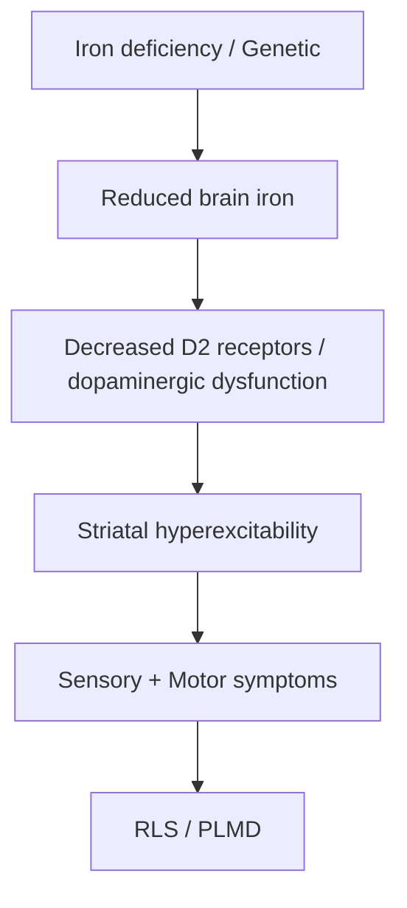
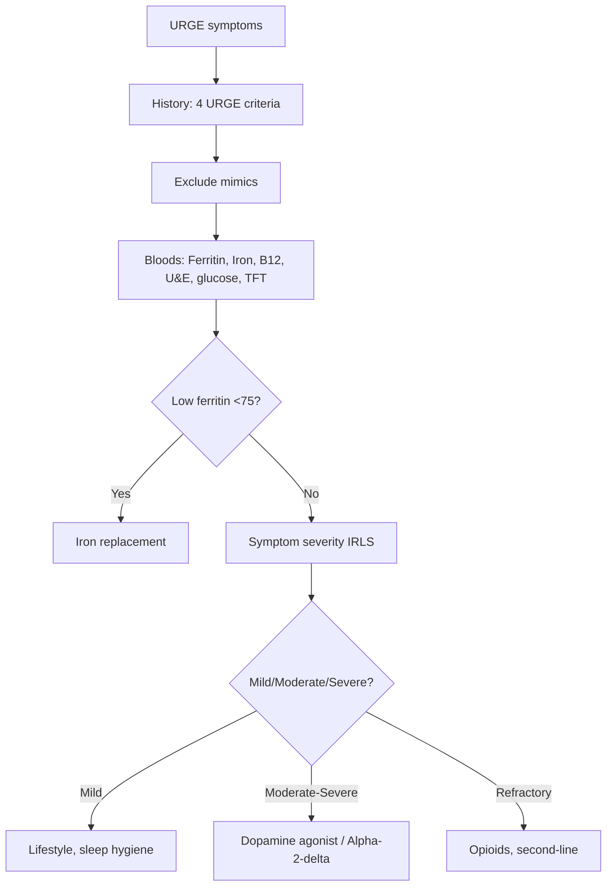

# Restless Legs Syndrome (RLS) & Periodic Limb Movement Disorder (PLMD)

> [!tip] **Definition (IRLSSG 2014)**
> **Restless Legs Syndrome (RLS / Willis-Ekbom Disease)** — sensorimotor disorder characterised by an **urge to move the legs**, usually accompanied by uncomfortable sensations, **worse at rest/evening**, **relieved by movement**.

> [!tip] **Key Clinical Features — URGE Mnemonic**
> **U**rge to move legs, **R**est worsens, **G**ets better with movement, **E**vening/night predominance. **PLMD** = repetitive limb movements during sleep, often co-exists with RLS.

## 1. Definition / Epidemiology / Classification

### Definition
- **RLS:** Clinical diagnosis; sensorimotor neurological disorder with circadian pattern
- **PLMD (Periodic Limb Movement Disorder):** Repetitive limb movements (typically legs) during sleep, causing arousal/fragmentation, **without** subjective urge

### Epidemiology
| Metric | Value |
|--------|-------|
| **Prevalence** | 5-10% adults (Western); 2-3% clinically significant |
| **F:M** | 2:1 (more common in women) |
| **Age** | Increases with age; ~20% in >60 years |
| **PLMD** | 80-90% of RLS patients; 4-11% of adults |
| **Risk factors** | Female, pregnancy (20%), iron deficiency, CKD, diabetes, family history |

### Classification (Primary vs Secondary)
| Type | Cause |
|------|-------|
| **Primary (idiopathic)** | Genetic (BTBD9, MEIS1, MAP2K5, PTPRD); ~50% familial |
| **Secondary** | Iron deficiency, pregnancy, CKD/ESRD, diabetes, MS, PD, peripheral neuropathy, drugs (antihistamines, antidepressants, antipsychotics) |

## 2. Aetiology / Pathophysiology

### Aetiology
- **Genetic:** BTBD9, MEIS1, MAP2K5, PTPRD (autosomal dominant with variable penetrance)
- **Iron deficiency** (CSF ferritin low, even with normal serum)
- **Pregnancy** (3rd trimester; resolves postpartum)
- **CKD/ESRD** (uremia; 20-60% of dialysis patients)
- **Peripheral neuropathy** (esp. small fibre)
- **Drugs:** antidepressants (SSRIs, TCAs, mirtazapine), antipsychotics, antihistamines, dopamine antagonists (metoclopramide)
- **PD, MS, spinocerebellar ataxia**

### Pathophysiology

- **Brain iron deficiency** → reduced tyrosine hydroxylase → reduced dopamine
- **Striatal D2 receptor dysfunction**
- **Glutamate, opioid, adenosine** systems involved
- **Spinal cord hyperexcitability**

## 3. Clinical Features

### History — **URGE Mnemonic**
- **U**rge to move legs (usually with uncomfortable sensation: "creeping, crawling, tingling, electric")
- **R**est worsens (sitting, lying)
- **G**ets better with movement (walking, stretching)
- **E**vening/night predominance (circadian pattern)

### Other History Clues
- **Sleep disturbance** (insomnia, daytime fatigue)
- **Periodic movements** in sleep (kicking, jerking)
- **Family history** (50% primary)
- **Restless during long flights, theatre, meetings**
- **Relief with hot/cold water**
- **Pregnancy, CKD, iron deficiency history**

### Examination
- **Usually normal** (or signs of underlying cause)
- May have **secondary RLS features** (PD signs, neuropathy)
- **PLMD** — note periodic limb movements during sleep study

### Severity Scales
- **IRLS (International RLS Severity Scale):** 0-40
  - 0-10: Mild
  - 11-20: Moderate
  - 21-30: Severe
  - 31-40: Very severe

## 4. Diagnostic Approach

### Diagnostic Criteria (IRLSSG 2014) — All 5
1. **Urge to move legs** usually with uncomfortable sensations
2. **Worsened by rest/inactivity**
3. **Relieved by movement** (at least partially)
4. **Worse in evening/night** (vs morning)
5. **Not better explained** by another condition (e.g., leg cramps, neuropathy, arthritis)

### Supportive Features
- **PLMD** (80-90%)
- **Family history** (primary)
- **Response to dopaminergic therapy**

### Mimics (Exclusion)
- **Leg cramps** (single muscle, sudden, palpable knot)
- **Positional discomfort**
- **Peripheral neuropathy** (length-dependent, sensory)
- **Arthritis**
- **Venous stasis** (worse on standing, relieved by elevation)
- **Akathisia** (no circadian pattern, no relief with movement)

## 5. Investigations

| Investigation | Purpose | Target/Notes |
|---------------|---------|--------------|
| **FBC, ferritin, iron, TIBC** | **Essential** — iron deficiency | **Ferritin <75 µg/L** = replace |
| **B12, folate** | Nutritional deficiency | Replace if low |
| **U&E, eGFR** | CKD/ESRD | Common cause |
| **Glucose, HbA1c** | Diabetes | Peripheral neuropathy |
| **TFT** | Hypothyroidism | Can mimic |
| **Pregnancy test** | If applicable | Common cause |
| **NCS** (if neuropathy suspected) | Small fibre neuropathy | |
| **Polysomnography (PSG)** | Suspected PLMD | Movements 5-90s apart |

### PSG — PLMD Criteria
- ≥5 periodic limb movements/hour of sleep
- Movements 0.5-10s duration, 5-90s apart
- Often associated with arousal

## 6. Differential Diagnosis

| Condition | Distinguishing | Key Test |
|-----------|----------------|----------|
| **Leg cramps** | Single muscle, palpable knot, sudden | Clinical |
| **Peripheral neuropathy** | Length-dependent, sensory, no urge | NCS |
| **Akathisia** | Inner restlessness, no circadian, drug-related | Drug history |
| **Venous insufficiency** | Worse on standing, relief with elevation | Doppler |
| **Arthritis** | Joint pain, stiffness | Joint exam, X-ray |
| **Restless insomnia** | Without urge to move | History |
| **Nocturnal seizures** | Stereotyped, with post-ictal | Video-EEG |

## 7. Management

### Step 1: **Address Secondary Causes**
- **Iron replacement** if ferritin <75 µg/L (or <50 in some guidelines)
  - **Oral:** Ferrous sulphate 200mg BD (vitamin C co-administration)
  - **IV iron:** Ferric carboxymaltose, iron sucrose if oral intolerant
  - **Target ferritin: >75-100 µg/L** for RLS symptom control
- Treat CKD, diabetes, neuropathy
- **Withdraw offending drugs:** SSRIs, antihistamines, dopamine antagonists

### Step 2: **Lifestyle / Non-Pharmacological**
- Sleep hygiene
- Regular exercise (moderate)
- Avoid caffeine, alcohol (esp. evening)
- Warm baths, massage, stretching
- Mental activity (distraction)

### Step 3: **Pharmacological**

| Drug | Dose | Notes |
|------|------|-------|
| **Dopamine agonists (1st line)** | | |
| **Pramipexole** | 0.125-0.75 mg nocte | **1st line**; start low, titrate |
| **Ropinirole** | 0.25-4 mg nocte | **1st line** (FDA/EMA) |
| **Rotigotine patch** | 1-3 mg/24h | Continuous; for severe/refractory |
| **Alpha-2-delta ligands (1st line)** | | |
| **Pregabalin** | 75-300 mg nocte | 1st line; esp. with pain |
| **Gabapentin** | 300-1800 mg nocte (or enacarbil 600-1200 mg) | 1st line; enacarbil extended-release |
| **Second-line** | | |
| **Clonazepam** | 0.5-2 mg nocte | Short-term; addiction risk |
| **Opioids** | | |
| **Tramadol** | 50-100 mg | Augmentation/refractory |
| **Codeine, oxycodone** | Variable | Refractory RLS (specialist only) |

> **EVIDENCE:** Both dopamine agonists and alpha-2-delta ligands are 1st line (EFNS/ESRS 2016). **Pregabalin** preferred in older patients and those with painful RLS. **Dopamine agonists** preferred in younger patients.

### Step 4: **Augmentation Management**
- **Augmentation:** Symptoms occur earlier, more severe, spread to other body parts (with chronic dopaminergic use)
- **Treatment:** Switch to alpha-2-delta ligand; add alpha-2-delta; consider drug holiday

### Step 5: **Refractory RLS**
- Combination therapy
- Opioids (specialist)
- **IV iron** if low ferritin
- Consider DBS, spinal cord stimulation (experimental)

## 8. Drug Interactions / Cautions

| Drug | Interaction / Caution | Management |
|------|----------------------|------------|
| **Dopamine agonists** | Antipsychotics (antagonise), metoclopramide | Avoid combination |
| **Pregabalin/Gabapentin** | CNS depressants, opioids | Sedation; reduce dose in renal failure |
| **Pramipexole** | Renally excreted; CI in CKD stage 4+ | Reduce dose |
| **Opioids** | Respiratory depression, addiction | Specialist only |

## 9. Procedures
- **No procedures** indicated
- **Polysomnography** for PLMD diagnosis

## 10. Complications
- **Chronic insomnia** (50%)
- **Daytime fatigue** (60%)
- **Depression / anxiety** (40%)
- **Cardiovascular disease** (HTN, stroke — sympathetic activation)
- **Augmentation** (with chronic dopamine agonist use)
- **Impaired quality of life**
- **Pregnancy:** severe RLS, possible C-section

## 11. Red Flags / Emergencies
- **Sudden severe RLS** in young patient (consider MS, neuropathy)
- **Pregnancy + severe RLS** (affects delivery, sleep)
- **Refractory to standard therapy** (re-examine diagnosis, IV iron)
- **Augmentation** (medication-induced worsening)
- **Suicidal ideation** (chronic insomnia)

## 12. Prognosis
- **Primary RLS:** chronic, progressive; ~30% spontaneous remission
- **Secondary RLS:** improves with treatment of cause
- **Pregnancy RLS:** resolves postpartum (usually)
- **Long-term:** augmentation risk with dopamine agonists (up to 30% at 5 years)

## 13. Topic Correlation
| Related Topic | Link | Key Overlap |
|---------------|------|-------------|
| Insomnia | [[Insomnia Disorder]] | Sleep disturbance |
| Narcolepsy | [[Narcolepsy Type 1]] | Excessive daytime sleepiness |
| Sleep Apnoea | [[OSA]] | Periodic movements |
| Periodic Limb Movement | [[PLMD]] | Sleep study |

## 14. Special Situations
- **Pregnancy:** Non-pharm first; IV iron if needed; avoid dopamine agonists (limited data); clonazepam low-dose if severe
- **Paediatric:** Rare; consider ADHD, growing pains; iron studies first
- **Elderly:** Common; alpha-2-delta ligands preferred (less augmentation)
- **CKD/ESRD:** IV iron; gabapentin/pregabalin preferred (renally dosed)
- **Driving (DVLA):** Severe RLS can affect driving; declare if affects safety
- **Perioperative:** Continue gabapentin/pregabalin; avoid dopamine antagonists

## FCPS/MRCP High-Yield Summary
| Category | Key Points |
|----------|------------|
| **Definition** | Sensorimotor disorder; URGE criteria; circadian pattern |
| **Epidemiology** | 5-10% adults; F:M 2:1; 80% have PLMD |
| **Pathophysiology** | Brain iron deficiency → dopamine dysfunction → striatal hyperexcitability |
| **Clinical** | URGE (Urge, Rest worsens, Gets better with movement, Evening) |
| **Diagnosis** | Clinical (5 IRLSSG criteria); exclude mimics; ferritin essential |
| **Investigations** | Ferritin <75 → iron; if refractory: bloods, sleep study |
| **Management** | Iron if ferritin<75 → Dopamine agonist (pramipexole) OR Alpha-2-delta (pregabalin) |
| **Complications** | Augmentation (dopamine agonists); insomnia; CV risk |
| **Viva Pearls** | "URGE" mnemonic; Ferritin <75 = replace; Augmentation = switch to gabapentinoids |
| **Mnemonic** | **URGE** = Urge, Rest, Gets better, Evening |

## Viva Questions
1. **Q:** URGE mnemonic for RLS?
   **A:** Urge to move, Rest worsens, Gets better with movement, Evening/night predominance.
2. **Q:** First investigation in suspected RLS?
   **A:** Serum ferritin (and iron studies).
3. **Q:** Ferritin threshold for iron replacement in RLS?
   **A:** <75 µg/L (or <50 in some guidelines).
4. **Q:** First-line drugs for RLS?
   **A:** Dopamine agonists (pramipexole, ropinirole) OR alpha-2-delta ligands (pregabalin, gabapentin).
5. **Q:** What is augmentation in RLS?
   **A:** Worsening of symptoms (earlier onset, more severe, spread) with chronic dopaminergic use; switch to alpha-2-delta.
6. **Q:** PLMD criteria on PSG?
   **A:** ≥5 periodic limb movements/hour of sleep; movements 0.5-10s, 5-90s apart.
7. **Q:** RLS in pregnancy — what to do?
   **A:** Conservative first; iron replacement if deficient; avoid dopamine agonists; low-dose clonazepam if severe.
8. **Q:** What % of RLS patients have PLMD?
   **A:** 80-90%.
9. **Q:** Drugs that worsen RLS?
   **A:** SSRIs, TCAs, mirtazapine, antipsychotics, antihistamines, dopamine antagonists.
10. **Q:** Augmentation management?
    **A:** Switch to alpha-2-delta ligand; consider drug holiday; avoid dopamine agonists.

## Common Confusions / Exam Traps
| Confusion | Clarification |
|-----------|---------------|
| RLS = leg cramps | Cramps = single muscle, palpable knot; RLS = urge, relieved by movement |
| Ferritin normal (15-200) = no deficiency | RLS can have ferritin <75; need higher threshold |
| Dopamine agonists always 1st line | Both DA and alpha-2-delta are 1st line |
| Augmentation = side effect | Augmentation = worsening despite dose increase |
| Treat with L-dopa long-term | L-dopa causes augmentation; use agonists instead |

## Mnemonics
1. **URGE** = Urge, Rest worsens, Gets better, Evening
2. **R**LS = **R**elief by **M**ovement
3. **PAINS** = Pregnancy, Anemia (iron), Insomnia, Nephropathy (CKD), Secondary (drugs)

## MCQs (10)
1. **Q:** URGE mnemonic in RLS includes all EXCEPT:
   **A.** Urge to move **B.** Rest worsens **C.** Gets better with movement **D.** Generalised weakness
   **Answer:** D
2. **Q:** Ferritin threshold for iron replacement in RLS:
   **A.** <10 **B.** <30 **C.** <75 **D.** <200
   **Answer:** C
3. **Q:** First-line drugs for RLS include:
   **A.** L-dopa **B.** Pramipexole or pregabalin **C.** Amitriptyline **D.** Haloperidol
   **Answer:** B
4. **Q:** Augmentation in RLS is associated with:
   **A.** Alpha-2-delta ligands **B.** Chronic dopamine agonist use **C.** Iron **D.** Benzodiazepines
   **Answer:** B
5. **Q:** PLMD criteria on PSG:
   **A.** ≥1 movement/hour **B.** ≥5 movements/hour **C.** ≥50 movements/hour **D.** 1 movement
   **Answer:** B
6. **Q:** Drugs that WORSEN RLS:
   **A.** Dopamine agonists **B.** SSRIs, TCAs, mirtazapine **C.** Alpha-2-delta **D.** Iron
   **Answer:** B
7. **Q:** RLS in pregnancy — what to avoid:
   **A.** Iron **B.** Conservative measures **C.** Long-term dopamine agonists (limited data) **D.** Hot baths
   **Answer:** C
8. **Q:** Augmentation is managed by:
   **A.** Increasing dopamine agonist **B.** Switching to alpha-2-delta ligand **C.** Stopping all treatment **D.** Adding haloperidol
   **Answer:** B
9. **Q:** % of RLS patients with PLMD:
   **A.** 10% **B.** 80-90% **C.** 100% **D.** 0%
   **Answer:** B
10. **Q:** Primary RLS is associated with genes:
    **A.** BRCA1 **B.** BTBD9, MEIS1 **C.** DYT1 **D.** HTT
    **Answer:** B

## SBA Questions (10)
1. **Scenario:** 50-year-old woman with evening leg discomfort, urge to move, relief with walking. Ferritin 30 µg/L. Most appropriate first step?
   **A.** Pramipexole **B.** Iron replacement (ferritin <75) **C.** Sleep study **D.** Gabapentin
   **Answer:** B — replace iron first
2. **Scenario:** RLS patient on pramipexole 1 year now has symptoms starting 6pm, more severe, arms affected. Diagnosis?
   **A.** Disease progression **B.** Augmentation **C.** Iron deficiency **D.** PLMD
   **Answer:** B — augmentation
3. **Scenario:** 65-year-old with RLS, CKD stage 4. Most appropriate drug:
   **A.** Pramipexole (renally excreted) **B.** Gabapentin (renally dosed) or pregabalin **C.** L-dopa **D.** Opioid
   **Answer:** B — gabapentinoids preferred in CKD
4. **Scenario:** RLS patient on SSRI for depression. RLS worsening. Next step?
   **A.** Increase SSRI **B.** Consider switching antidepressant (e.g., to bupropion) **C.** Add haloperidol **D.** Add L-dopa
   **Answer:** B
5. **Scenario:** 60-year-old with severe RLS refractory to dopamine agonists and gabapentin. Specialist may add:
   **A.** Haloperidol **B.** Tramadol or oxycodone (specialist only) **C.** Methotrexate **D.** IV iron infusion only
   **Answer:** B — opioids for refractory
6. **Scenario:** RLS patient with ferritin 100, transferrin saturation 25%. Diagnosis?
   **A.** Iron deficiency **B.** Iron replete (no replacement needed) **C.** Anaemia of chronic disease **D.** Haemochromatosis
   **Answer:** B — ferritin 100 is OK for RLS
7. **Scenario:** Pregnant woman with severe RLS in 3rd trimester. Treatment?
   **A.** Pramipexole **B.** Iron + conservative + low-dose clonazepam if needed **C.** L-dopa **D.** Methadone
   **Answer:** B
8. **Scenario:** RLS patient with co-morbid insomnia. Best drug for both?
   **A.** Pramipexole **B.** Pregabalin (treats RLS + insomnia) **C.** L-dopa **D.** Amitriptyline
   **Answer:** B
9. **Scenario:** RLS + PLMD on PSG. Movements every 25 seconds during sleep, 1-2s duration, with arousal. Diagnosis?
   **A.** RLS only **B.** PLMD (≥5/hour criteria met) **C.** Sleep apnoea **D.** Seizures
   **Answer:** B — PLMD confirmed
10. **Scenario:** Refractory RLS not responding to dopamine agonists, alpha-2-delta, iron, lifestyle. What about IV iron?
    **A.** No role **B.** IV iron (ferric carboxymaltose) can help even with normal ferritin **C.** Iron infusion is dangerous **D.** Iron replacement only if anaemia
    **Answer:** B — IV iron can help in RLS, esp. if ferritin <300

## Flashcards
- **Q:** URGE criteria?
  **A:** Urge to move, Rest worsens, Gets better with movement, Evening/night
- **Q:** Ferritin threshold?
  **A:** <75 µg/L — replace
- **Q:** 1st line drugs?
  **A:** Pramipexole, ropinirole, rotigotine (DA) OR pregabalin, gabapentin (alpha-2-delta)
- **Q:** Augmentation definition?
  **A:** Symptoms earlier, more severe, spread to other body parts (chronic DA)
- **Q:** Augmentation management?
  **A:** Switch to alpha-2-delta; drug holiday
- **Q:** PLMD criteria?
  **A:** ≥5 movements/hour sleep; 0.5-10s duration, 5-90s apart
- **Q:** RLS genes?
  **A:** BTBD9, MEIS1, MAP2K5, PTPRD
- **Q:** Drugs worsening RLS?
  **A:** SSRIs, TCAs, mirtazapine, antipsychotics, antihistamines
- **Q:** % RLS with PLMD?
  **A:** 80-90%
- **Q:** RLS in pregnancy management?
  **A:** Conservative + iron; avoid DA; low-dose clonazepam if severe

## Answer Key
### MCQs
1. D  2. C  3. B  4. B  5. B  6. B  7. C  8. B  9. B  10. B

### SBAs
1. B — Iron first
2. B — Augmentation
3. B — Gabapentin (renally dosed)
4. B — Switch antidepressant
5. B — Opioids for refractory
6. B — Iron replete
7. B — Conservative + low-dose clonazepam
8. B — Pregabalin
9. B — PLMD
10. B — IV iron

## Summary
**Restless Legs Syndrome** diagnosed by **URGE criteria** (Urge, Rest worsens, Gets better, Evening). Most important investigation: **serum ferritin** — replace if <75 µg/L. **First-line drugs**: dopamine agonists (pramipexole, ropinirole) OR alpha-2-delta ligands (pregabalin, gabapentin). **Augmentation** = worsening of symptoms on chronic dopaminergic use; managed by switching to alpha-2-delta. **PLMD** = repetitive limb movements during sleep (≥5/hour, 0.5-10s, 5-90s apart), 80-90% of RLS patients. Treat secondary causes (iron deficiency, CKD, pregnancy, drugs). Avoid SSRIs, TCAs, mirtazapine, antipsychotics, antihistamines (worsen RLS).

## PasTest Scenario SBAs (Clinical Vignettes)

> **Auto-generated PasTest/Mediscope-style scenario SBAs** grounded in the authored source. Each scenario tests a real clinical fact (triad, specific sign, contraindication, trial, first-line Rx) extracted from the topic. *Source: Ch 27: Neurology & Stroke — Restless Legs Syndrome PLMD*

**Q1.** What is the most appropriate first-line therapy for Restless Legs Syndrome PLMD?

  - **A.** Augmentation:
  - **B.** An advanced/surgical therapy reserved for refractory disease
  - **C.** Symptomatic treatment only, no disease-modifying therapy
  - **D.** Empiric broad-spectrum therapy without specific indication

  > **Answer: A** — Augmentation:
  >
  > *Source:* **Augmentation:** Symptoms occur earlier, more severe, spread to other body parts (with chronic dopaminergic use)

