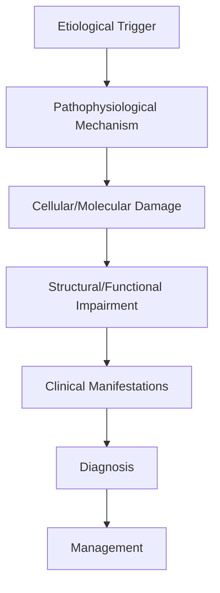
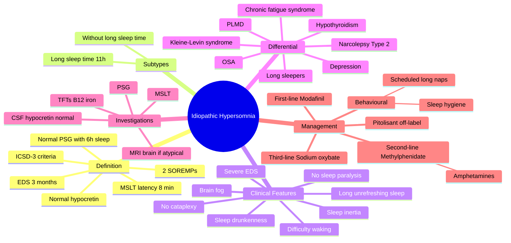

# Idiopathic Hypersomnia

> [!tip] **High-Yield Definition**
> Comprehensive clinical note for Idiopathic Hypersomnia covering definition, epidemiology, aetiology, pathophysiology, clinical features, investigations, differential diagnosis, management, drug interactions, procedures, complications, red flags, prognosis, topic correlation, and special situations for FCPS/MRCP examination preparation based on Davidson 24th Edition Chapter 25: Neurology.

---

## 1. Definition / Epidemiology / Classification

### Definition
Idiopathic Hypersomnia is a neurological disorder within the 16 sleep disorders category. It is characterised by specific clinical, pathological, radiological, and laboratory features that allow differentiation from related conditions.

### Epidemiology
- **Incidence/Prevalence:** Variable depending on the specific condition.
- **Age:** Adult onset is most common, but paediatric and elderly presentations occur.
- **Sex:** Variable depending on the condition.
- **Geography:** Worldwide distribution, with higher prevalence in certain regions.
- **Risk Factors:** Genetic predisposition, environmental factors, comorbidities, family history.

### Classification
| Subtype | Key Features | Prognosis |
|---------|-------------|-----------|
| Mild/early | Subtle symptoms, preserved function | Best |
| Moderate | Clear symptoms, functional impairment | Variable |
| Severe | Significant disability, complications | Worst |

---

## 2. Aetiology / Pathophysiology

### Aetiology
- **Primary (idiopathic):** Most cases have no identifiable cause.
- **Genetic:** May be inherited (AD, AR, X-linked, mitochondrial, sporadic).
- **Autoimmune:** Autoantibodies, immune-mediated inflammation.
- **Infectious:** Viral, bacterial, fungal, parasitic.
- **Metabolic:** Electrolyte, endocrine, hepatic, renal, nutritional.
- **Toxic:** Drugs, alcohol, heavy metals, environmental toxins.
- **Vascular:** Ischaemia, haemorrhage, vasculitis.
- **Neoplastic:** Primary, secondary, paraneoplastic.
- **Traumatic:** Acute, chronic, repetitive.
- **Degenerative:** Neurodegeneration, protein misfolding.

### Pathophysiology


---

## 3. Clinical Features

### History
- **Onset/Duration:** Acute, subacute, or chronic.
- **Progression:** Static, progressive, relapsing-remitting, stepwise.
- **Key symptoms:** Specific to the condition.
- **Triggers:** Stress, infection, trauma, drugs, hormonal, environmental.
- **Systemic symptoms:** Constitutional features.
- **Drug/Family/Social history:** Relevant exposures, comorbidities.

### Examination
| Domain | Key Findings | Localisation Value |
|--------|-------------|-------------------|
| Higher function | Cognitive, behavioural | Cortical, subcortical, limbic |
| Cranial nerves | Pupils, eye movements, facial, bulbar | Brainstem, cranial nerve, NMJ |
| Motor | Weakness, tone, reflexes | UMN, LMN, NMJ, muscle |
| Sensory | All modalities, pattern | Peripheral, spinal, brainstem |
| Coordination | Ataxia, nystagmus, dysmetria | Cerebellar, sensory, vestibular |
| Gait | Spastic, ataxic, parkinsonian | Multiple |
| Autonomic | Orthostatic, sweating, GI, bladder | Autonomic, peripheral, central |

### Specific Clinical Features
The clinical features are determined by the underlying aetiology, location of pathology, and rate of progression. Patients typically present with a constellation of symptoms and signs that allow clinical localisation and subsequent targeted investigation.

---

## 4. Diagnostic Approach / Algorithm

```mermaid
flowchart TD
    A[Clinical Presentation] --> B[Anatomical Localisation]
    B --> C[Pathophysiological Category]
    C --> D[Formulate Differential]
    D --> E[Targeted Investigations]
    E --> F[Confirm Diagnosis]
    F --> G[Assess Severity/Prognosis]
    G --> H[Initiate Management]
    H --> I[Monitor Response]
    I --> J{Response?}
    J --> YES1 [Good - Continue]
    J --> NO1 [Poor - Escalate]
    YES1 --> K[Monitor]
    NO1 --> H
```

---

## 5. Investigations

### First-Line Investigations
- **Blood tests:** FBC, U&Es, LFTs, glucose, calcium, magnesium, ESR, CRP, autoimmune, infection.
- **Imaging:** CT/MRI brain/spine (essential for most neurological conditions).
- **Neurophysiology:** EEG, nerve conduction, EMG, evoked potentials.
- **CSF:** Cell count, protein, glucose, OCBs, PCR, culture.

### Second-Line Investigations
- **Genetic testing:** Gene panels, WES, WGS.
- **Antibody testing:** Antineuronal, autoimmune, paraneoplastic.
- **Biopsy:** Nerve, muscle, brain, skin.
- **Advanced imaging:** PET-CT, MR spectroscopy, fMRI.

### Specialised Investigations
- **Biomarkers:** Neurofilament light chain, tau, beta-amyloid, 14-3-3, RT-QuIC.
- **Autonomic testing:** Head-up tilt, sudomotor, QSART.
- **Neuropsychology:** Cognitive testing, behavioural assessment.
- **Genetic counselling:** Family screening, predictive testing.

---

## 6. Differential Diagnosis

| Differential | Distinguishing Features | Key Test |
|--------------|------------------------|----------|
| Vascular | Sudden onset, focal, vascular risk factors | MRI/CT, vessel imaging |
| Inflammatory | Subacute, multifocal, systemic | MRI, CSF, antibodies |
| Infectious | Fever, systemic, exposure | Bloods, CSF, imaging |
| Neoplastic | Progressive, mass effect | MRI, biopsy |
| Degenerative | Progressive, symmetric, hereditary | MRI, genetic |
| Toxic/Metabolic | Drug history, systemic, reversible | Bloods, toxicology |
| Autoimmune | Multifocal, antibodies, immunotherapy response | Antibodies, MRI, CSF |
| Functional | Inconsistent, distractible | Clinical, video, biomarkers |

---

## 7. Management

### Acute Management
- **Stabilisation:** ABCDE approach, emergency resuscitation.
- **Specific treatment:** Disease-specific interventions.
- **Symptomatic relief:** Pain, seizures, spasticity, autonomic dysfunction.
- **Prevention of complications:** DVT, pressure sores, infection.

### Disease-Modifying Treatment
- **Pharmacological:** First-line, second-line, escalation, maintenance.
- **Procedural:** Surgery, biopsy, drainage, ablation, stimulation.
- **Immunotherapy:** Steroids, IVIG, plasma exchange, immunosuppressants, biologics.
- **Rehabilitation:** Physiotherapy, OT, speech therapy.

### Long-Term Management
- **Monitoring:** Clinical, imaging, biomarkers, side effects.
- **Prevention:** Vaccinations, prophylaxis, lifestyle modification.
- **Supportive care:** Multidisciplinary team, social work, psychological support.
- **Palliative care:** Advanced care planning, end-of-life care, hospice.

---

## 8. Drug Interactions / Contraindications / Comorbidity Cautions

| Drug Class | Interaction / Caution | Management |
|------------|----------------------|------------|
| Antiseizure medications | Enzyme induction, teratogenicity | Monitor, supplement, switch |
| Immunosuppressants | Infection, malignancy, teratogenicity | Monitor, prophylaxis |
| Anticoagulants | Bleeding risk, drug interactions | Monitor INR, avoid combinations |
| Antihypertensives | Hypotension, falls | Monitor BP, adjust dose |
| Antibiotics | Nephrotoxicity, ototoxicity | Monitor renal |
| Antivirals | Nephrotoxicity, neuropsychiatric | Monitor renal, dose adjust |
| Steroids | DM, HTN, osteoporosis, infection | Monitor, prophylaxis, taper |
| Biologics | Infusion reactions, infection | Monitor, prophylaxis |

---

## 9. Procedures

### Common Procedures
- **Lumbar puncture:** Diagnostic, therapeutic (IIH, NPH). Contraindications: raised ICP, mass lesion, coagulopathy.
- **Nerve conduction studies/EMG:** Diagnostic, prognosis. Minor discomfort.
- **EEG:** Diagnostic, monitoring. No significant complications.
- **MRI brain/spine:** Diagnostic, monitoring. Contraindications: pacemaker, metallic implants.
- **CT head:** Emergency, rapid. Radiation exposure, contrast reactions.
- **Biopsy:** Stereotactic, open. Indications: diagnosis, molecular profiling.

---

## 10. Complications

| Complication | Frequency | Prevention | Management |
|--------------|-----------|------------|------------|
| Infection | Common | Hygiene, prophylaxis, vaccination | Antibiotics, antifungals |
| Thrombosis | Common | Prophylaxis, mobility | Anticoagulation |
| Pressure sores | Common | Positioning, nutrition | Wound care, surgery |
| Spasticity | Common | Positioning, stretching | Baclofen, BoNT |
| Contractures | Common | Passive movements, splints | Physiotherapy, surgery |
| Aspiration | Common | Swallow assessment | NGT, PEG, thickeners |
| Falls | Common | Environment, mobility | Walking aids |
| Fractures | Common | Bone health, prevention | Vitamin D, bisphosphonate |
| Depression | Common | Screening, support | Antidepressants, CBT |
| Cognitive decline | Variable | Monitoring, training | Rehabilitation |
| Autonomic dysfunction | Variable | Monitoring, hydration | Midodrine, fludrocortisone |
| Respiratory failure | Variable | Monitoring, supportive | Ventilation, NIV |
| Death | Variable | Monitoring, palliative | End-of-life care |

---

## 11. Red Flags / Emergencies

### Emergency Presentations
- **Rapid neurological deterioration:** New focal deficit, decreased consciousness, seizures.
- **Status epilepticus:** Continuous seizures >5 min.
- **Raised ICP:** Headache, vomiting, papilloedema, altered consciousness.
- **Respiratory failure:** Hypoxia, hypercapnia, ventilatory failure.
- **Cardiac arrest:** Arrhythmia, MI, pulmonary embolism.
- **Infection:** Sepsis, meningitis, abscess, encephalitis.
- **Drug toxicity:** Overdose, side effects, interactions.
- **Haemorrhage:** Intracranial, systemic, coagulopathy.

---

## 12. Prognosis

### Natural History
- **Acute:** May resolve with treatment, may progress, may be fatal.
- **Subacute:** Variable, depends on cause and treatment.
- **Chronic:** Often progressive, may be stable, may have relapses.
- **Recovery:** Variable, may be complete, partial, or none.

### Prognostic Factors
- **Favourable:** Young age, early treatment, mild disease, reversible cause, good premorbid function, family support.
- **Unfavourable:** Older age, delayed treatment, severe disease, irreversible cause, poor premorbid function, comorbidities.

---

## 13. Topic Correlation

| Related Topic | Link | Key Overlap |
|---------------|------|-------------|
| Davidson 24th Ed Chapter 25 | [[Davidson Chapter 25 - Neurology Hierarchy]] | Comprehensive neurology |
| Neurology MOC | [[Neurology MOC]] | All neurology topics |
| Drug Reference | [[../00_Index/Neurology Drug Reference]] | Medications |
| Local Hub | [[../16_Sleep_Disorders/Hub]] | Section-specific |
| Clinical Examination | [[../01_Fundamentals_Examination/Neurological History Taking]] | Clinical approach |
| Investigation | [[../01_Fundamentals_Examination/Neuroimaging (CT-MRI) Principles]] | Imaging |

---

## 14. Special Situations

| Situation | Consideration |
|-----------|---------------|
| **Pregnancy** | Pre-conception counselling, teratogenicity, drug safety, monitoring, delivery planning, breastfeeding. |
| **Lactation** | Drug safety, breastfeeding, monitoring, support. |
| **Paediatric** | Developmental considerations, drug dosing, school, family, vaccination, growth, puberty. |
| **Elderly / Frail** | Comorbidities, polypharmacy, falls, bone health, cognition, social, end-of-life. |
| **Renal impairment** | Drug dose adjustment, monitoring, dialysis, transplant. |
| **Hepatic impairment** | Drug dose adjustment, monitoring, transplant. |
| **Immunocompromised** | Infection prophylaxis, vaccination, drug interactions, malignancy screening. |
| **Perioperative** | Drug management, anaesthesia planning, VTE prophylaxis, infection prevention, monitoring. |
| **Driving / DVLA** | Fitness to drive, restrictions, notification, reassessment. |
| **Occupational** | Fitness for work, adaptations, rehabilitation, disability, return to work. |

---

## FCPS/MRCP High-Yield Summary

| Category | Key Points |
|----------|------------|
| **Definition** | Comprehensive definition with key diagnostic criteria |
| **Epidemiology** | Incidence, prevalence, age, sex, geography, risk factors |
| **Aetiology** | Primary causes, secondary causes, genetic, environmental |
| **Pathophysiology** | Mechanism of disease, cellular/molecular basis |
| **Clinical Features** | History, examination, key findings, variants |
| **Diagnosis** | Diagnostic criteria, classification, severity |
| **Investigations** | First-line, second-line, specialised, biomarkers |
| **Differential Diagnosis** | Key differentials, distinguishing features, tests |
| **Management** | Acute, disease-modifying, symptomatic, supportive |
| **Complications** | Common, serious, prevention, management |
| **Prognosis** | Natural history, prognostic factors, outcomes |
| **Viva Pearls** | Key examination points |
| **Drug Doses** | First-line, second-line, emergency |
| **Scoring Systems** | Specific scores used in management |
| **Genetics** | Inheritance, genes, mutations, family screening |
| **Imaging Signs** | Characteristic findings, differential |

---

## Viva Questions (PACES/FCPS Style)

1. **Q:** Define and classify its variants.
   **A:** Comprehensive definition with classification of subtypes based on aetiology, severity, and clinical features.

2. **Q:** What are the key clinical features?
   **A:** Specific symptoms and signs including onset, progression, key features, and associated findings.

3. **Q:** What is the first-line treatment?
   **A:** First-line pharmacological and non-pharmacological management based on current evidence.

4. **Q:** What are the red flags requiring urgent referral?
   **A:** Specific emergency presentations and complications requiring immediate intervention.

5. **Q:** What is the prognosis?
   **A:** Natural history, prognostic factors, and long-term outcomes.

6. **Q:** How do you differentiate from key differentials?
   **A:** Clinical features, investigations, and response to treatment that distinguish from alternative diagnoses.

7. **Q:** What investigations are most useful?
   **A:** First-line and second-line investigations including imaging, neurophysiology, CSF, and biomarkers.

8. **Q:** Describe the stepwise management approach.
   **A:** Stepwise escalation from first-line to second-line to third-line therapy with monitoring.

9. **Q:** What are the emergency presentations?
   **A:** Specific emergency scenarios and immediate management priorities.

10. **Q:** How does management change in pregnancy/paediatrics/elderly?
    **A:** Special considerations for each population including drug safety, monitoring, and support.

---

## Common Confusions / Exam Traps

| Confusion | Clarification |
|-----------|---------------|
| Similar presentation but different cause | Differentiate by history, examination, investigations |
| Treatment response vs natural history | Assess with objective measures, biomarkers |
| Drug interactions | Check each drug, monitor, adjust doses |
| Disease progression vs treatment failure | Monitor response, escalate appropriately |
| Functional vs organic | Inconsistent, distractible, disability greater than impairment |
| Acute vs chronic | Time course, progression, reversibility |
| Primary vs secondary | Underlying cause, contributing factors |
| Side effects vs symptoms | Temporal relationship, dose relationship |

---

## Mnemonics

1. **IH 11-2-8** — diagnostic anchors for Idiopathic Hypersomnia:
   - **11** = sleep time often >11 hours per 24 h (long sleep)
   - **2** = **<2 SOREMPs** on MSLT (≤1)
   - **8** = mean MSLT sleep latency **<8 min**

2. **DIFFERS from Narcolepsy** — IH vs Narcolepsy Type 2:
   - **D**ifficulty waking (sleep inertia / drunkenness)
   - **I**nefficient/very long nocturnal sleep
   - **F**ewer SOREMPs (<2)
   - **F**eels **unrefreshed** even after long sleep
   - **E**xcessive daytime sleepiness continuous (not "sleep attacks")
   - **R**esistance to naps (long, unrefreshing)
   - **S**leep drunkenness prominent
   - Narcolepsy naps = brief, refreshing; IH naps = long, unrefreshing.

3. **MANAGE IH** — stepwise management:
   - **M**odafinil (first-line) — start 100 mg, titrate to 400 mg/day
   - **A**mphetamine salts / methylphenidate (long-acting) — second-line
   - **N**ight-time controlled-release sodium oxybate (XYREM)
   - **A**void alcohol/heavy meals before bed
   - **G**ood sleep hygiene + scheduled naps (long, scheduled — different from narcolepsy)
   - **E**xclude secondary causes first (B12, TFTs, OSA, PLMD, depression)

---

## Mind Map



---

## Spaced Repetition Trackers

| Day | Key Facts to Recall | Self-Score /10 |
|-----|-------------------|----------------|
| **Day 1** | ICSD-3 criteria: EDS ≥3 months; MSLT latency ≤8 min; <2 SOREMPs; normal hypocretin; PSG ≥6 h sleep | /10 |
| **Day 3** | Sleep inertia = "sleep drunkenness"; prolonged difficulty waking, confusion, automatic behaviour | /10 |
| **Day 7** | Long sleep form: total 24-h sleep ≥11 h; non-long form: 6–10 h | /10 |
| **Day 14** | Differentiate from narcolepsy: naps NOT refreshing; normal hypocretin; no cataplexy; ≤1 SOREMP | /10 |
| **Day 30** | First-line modafinil 200–400 mg; second-line long-acting stimulants; sodium oxybate off-label | /10 |
| **Day 90** | DVLA: stop driving until controlled; rare familial forms; autoimmune/inflammatory associations | /10 |

---

## Self-Test Scorecard

| Topic | Question Stem | Score /5 |
|-------|---------------|----------|
| **ICSD-3** | List all 5 diagnostic criteria | /5 |
| **Long sleep** | Define long sleep time (≥11 h) | /5 |
| **Sleep inertia** | Define sleep drunkenness | /5 |
| **Differential** | 4 differentials of IH | /5 |
| **Treatment** | First- and second-line agents | /5 |
| **Total** | Cumulative recall | /25 |

---

## MCQs (10)

1. **Q:** Per ICSD-3, idiopathic hypersomnia requires which MSLT finding?
   A. Mean latency ≥10 min B. Mean latency ≤8 min and ≥2 SOREMPs C. Mean latency ≤8 min and <2 SOREMPs D. Sleep latency ≤5 min and ≥3 SOREMPs
   **Answer: C** — IH: MSLT mean latency ≤8 min with <2 SOREMPs (narcolepsy requires ≥2).

2. **Q:** Which feature is **most characteristic** of idiopathic hypersomnia compared with narcolepsy?
   A. Sleep paralysis
   B. Cataplexy
   C. **Long, unrefreshing nocturnal sleep with severe sleep inertia**
   D. Hypnagogic hallucinations
   **Answer: C** — IH: prolonged nocturnal sleep, severe difficulty waking (sleep drunkenness); naps not refreshing.

3. **Q:** CSF hypocretin-1 level in idiopathic hypersomnia is typically:
   A. ≤110 pg/mL B. >200 pg/mL C. Undetectable D. Variable
   **Answer: B** — Normal hypocretin (>200 pg/mL) excludes narcolepsy Type 1; supports IH/NT2.

4. **Q:** Which is the **first-line** pharmacological treatment for IH?
   A. Sodium oxybate B. Modafinil C. Methylphenidate D. Pitolisant
   **Answer: B** — Modafinil 200–400 mg/day is first-line per AASM/EFNS for IH EDS.

5. **Q:** "Sleep drunkenness" in IH refers to:
   A. Nocturnal sleepwalking
   B. Hallucinations at sleep onset
   C. **Prolonged difficulty waking with confusion, lasting minutes to hours**
   D. Cataplexy upon waking
   **Answer: C** — Sleep inertia = severe, prolonged grogginess/confusion on awakening, often with automatic behaviour.

6. **Q:** Minimum duration of EDS symptoms for ICSD-3 diagnosis of IH?
   A. 1 week B. 1 month C. 3 months D. 6 months
   **Answer: C** — ≥3 months required (mirroring narcolepsy).

7. **Q:** Which is **NOT** a feature that distinguishes IH from narcolepsy Type 2?
   A. Number of SOREMPs (1 vs ≥2) B. Normal hypocretin C. Refreshing vs unrefreshing sleep D. Presence of cataplexy
   **Answer: D** — Cataplexy excludes IH (and NT2); it's the discriminator from NT1.

8. **Q:** A 28-year-old with EDS, MSLT latency 6 min, 1 SOREMP, sleeps 12 h/night, unrefreshed. Diagnosis?
   A. Narcolepsy Type 1 B. Narcolepsy Type 2 C. **Idiopathic hypersomnia** D. Kleine-Levin syndrome
   **Answer: C** — Long sleep + 1 SOREMP + normal hypocretin = IH (long sleep subtype).

9. **Q:** Which agent has the strongest evidence for treating both EDS and sleep inertia in IH?
   A. Modafinil B. **Sodium oxybate (low-dose nocturnal)** C. Methylphenidate D. Caffeine
   **Answer: B** — Sodium oxybate consolidates nocturnal sleep, improves sleep inertia and EDS in IH; off-label in many countries.

10. **Q:** Long-acting stimulant (e.g., methylphenidate MR) in IH — class effect?
    A. Increases nocturnal sleep quality B. **Reduces daytime sleepiness, may worsen nocturnal sleep if dosed late**
    C. Curative D. Causes cataplexy
    **Answer: B** — Stimulants improve wakefulness but may disrupt sleep if dosed late afternoon/evening.

---

## SBA Questions (10)

1. **Scenario:** 32-year-old, EDS × 4 years, sleeps 12–13 h/night, unrefreshed, MSLT latency 5 min, 1 SOREMP, CSF orexin 320 pg/mL. Diagnosis?
   **Options:** A. Narcolepsy Type 1 B. Narcolepsy Type 2 C. Idiopathic hypersomnia D. Kleine-Levin syndrome
   **Answer: C** — IH long-sleep subtype: ≤1 SOREMP, latency ≤8 min, normal orexin, prolonged sleep.

2. **Scenario:** IH patient on modafinil 400 mg still sleeping 12 h, ESS 16, severe sleep inertia. Next step?
   **Options:** A. Stop modafinil B. Add low-dose nocturnal sodium oxybate C. Diagnose as depression D. Caffeine at night
   **Answer: B** — Add low-dose sodium oxybate (XYREM 4.5–9 g/night) to consolidate nocturnal sleep and improve sleep inertia.

3. **Scenario:** Patient with EDS, MSLT latency 7 min, 2 SOREMPs, cataplexy absent, CSF orexin normal. Diagnosis?
   **Options:** A. Idiopathic hypersomnia B. Narcolepsy Type 2 C. Narcolepsy Type 1 D. OSA
   **Answer: B** — ≥2 SOREMPs + no cataplexy + normal orexin = narcolepsy Type 2 (not IH — IH requires <2).

4. **Scenario:** 25-year-old with IH, modafinil ineffective, side-effects on methylphenidate. What is third-line?
   **Options:** A. Pitolisant B. Sodium oxybate C. Clonazepam D. CPAP
   **Answer: B** — Sodium oxybate is third-line/second-line in IH for EDS + sleep inertia.

5. **Scenario:** IH patient asks about driving. What is the DVLA advice?
   **Options:** A. Continue driving normally B. Stop until symptoms controlled (ESS <10, treatment effective) C. No restriction D. Stop permanently
   **Answer: B** — DVLA: stop driving until excessive sleepiness satisfactorily controlled; clinician may certify fitness once treatment established.

6. **Scenario:** 30-year-old with severe IH, sleeps 13 h, naps 2–3 h, all unrefreshing. PSG normal, MSLT latency 5 min, 0 SOREMPs. Sleep inertia so severe she cannot wake for work. Best acute measure?
   **Options:** A. Sleep restriction B. Multiple alarm clocks + bright light + scheduled naps + modafinil C. Quinine D. Melatonin at night
   **Answer: B** — Combination of scheduled long naps (different from narcolepsy), light therapy, alerting strategies, modafinil first-line.

7. **Scenario:** IH patient on modafinil develops rash and Stevens-Johnson-like features. Action?
   **Options:** A. Continue B. Stop modafinil immediately + dermatology review C. Halve dose D. Switch to amphetamine
   **Answer: B** — Modafinil rare SJS/TEN: stop immediately, dermatology referral, supportive care.

8. **Scenario:** Differential in IH — which secondary cause MUST be excluded?
   **Options:** A. OSA B. PLMD C. Hypothyroidism D. All of the above
   **Answer: D** — IH is a diagnosis of exclusion: exclude OSA, PLMD, hypersomnia from depression, hypothyroidism, drug effects.

9. **Scenario:** Family history of IH — what is known about heritability?
   **Options:** A. Common; autosomal dominant (rare familial form) B. X-linked only C. Mitochondrial D. No genetic basis
   **Answer: A** — Rare autosomal-dominant familial IH reported; mostly sporadic.

10. **Scenario:** IH with comorbid depression. Which agent addresses BOTH?
    **Options:** A. Modafinil B. Sodium oxybate C. Methylphenidate D. Bupropion (off-label)
    **Answer: D** — Bupropion has mild alerting + antidepressant effect; modafinil augmentation also used in depressed hypersomnia but bupropion treats both axes formally.

---

## Flashcards

- **Q:** ICSD-3 MSLT criteria for IH?
  **A:** Mean latency ≤8 min AND <2 SOREMPs (≤1) AND normal hypocretin.
- **Q:** Defining feature of long-sleep IH?
  **A:** ≥11 h total sleep time per 24 h.
- **Q:** Sleep drunkenness?
  **A:** Severe, prolonged difficulty waking, minutes to hours of confusion, automatic behaviour.
- **Q:** First-line drug for IH?
  **A:** Modafinil 200–400 mg/day.
- **Q:** Key IH vs narcolepsy discriminator?
  **A:** Number of SOREMPs (<2 vs ≥2) + unrefreshing vs refreshing naps.
- **Q:** Why is sodium oxybate useful in IH?
  **A:** Consolidates nocturnal sleep; improves sleep inertia + EDS.
- **Q:** Heritability of IH?
  **A:** Mostly sporadic; rare autosomal-dominant familial form.
- **Q:** Three differentials of IH?
  **A:** Narcolepsy Type 2, hypersomnia from depression, OSA.
- **Q:** Is hypocretin low in IH?
  **A:** No — normal (>200 pg/mL); low in NT1.
- **Q:** DVLA advice?
  **A:** Stop driving until EDS controlled.

---

## Answer Key with Explanations

### MCQs
1. **C** — IH: latency ≤8 min + <2 SOREMPs.
2. **C** — Long unrefreshing sleep + sleep inertia.
3. **B** — Normal hypocretin in IH.
4. **B** — Modafinil first-line.
5. **C** — Sleep inertia = prolonged waking confusion.
6. **C** — ≥3 months.
7. **D** — Cataplexy distinguishes NT1, not NT2.
8. **C** — IH long-sleep subtype.
9. **B** — Sodium oxybate for sleep inertia + EDS.
10. **B** — Stimulants may disrupt sleep if dosed late.

### SBAs
1. **C** — IH long-sleep.
2. **B** — Add low-dose nocturnal sodium oxybate.
3. **B** — ≥2 SOREMPs + no cataplexy = NT2.
4. **B** — Sodium oxybate third-line.
5. **B** — Stop until controlled.
6. **B** — Combined alerting strategy.
7. **B** — Stop modafinil immediately.
8. **D** — Exclude all secondary causes.
9. **A** — Rare AD familial IH.
10. **D** — Bupropion treats both axes.

---

---

## Local Navigation
**Heading Hub:** [[../Hub]]  
**Chapter Hierarchy:** [[Davidson Chapter 25 - Neurology Hierarchy]]  
**Chapter MOC:** [[Neurology MOC]]  
**Drug Reference:** [[../00_Index/Neurology Drug Reference]]

## PasTest Scenario SBAs (Clinical Vignettes)

> **Auto-generated PasTest/Mediscope-style scenario SBAs** grounded in the authored source. Each scenario tests a real clinical fact (triad, specific sign, contraindication, trial, first-line Rx) extracted from the topic. *Source: Ch 27: Neurology & Stroke — Idiopathic Hypersomnia*

**Q1.** Which of the following features is most specific or characteristic of Idiopathic Hypersomnia?

  - **A.** Key symptoms:
  - **B.** A feature common to many acute inflammatory conditions
  - **C.** A non-specific sign that does not localise the diagnosis
  - **D.** An investigation finding rather than a clinical feature

  > **Answer: A** — Key symptoms:
  >
  > *Source:* - **Key symptoms:** Specific to the condition

**Q2.** What is the most appropriate first-line therapy for Idiopathic Hypersomnia?

  - **A.** Rehabilitation:
  - **B.** An advanced/surgical therapy reserved for refractory disease
  - **C.** Symptomatic treatment only, no disease-modifying therapy
  - **D.** Empiric broad-spectrum therapy without specific indication

  > **Answer: A** — Rehabilitation:
  >
  > *Source:* **Rehabilitation:** Physiotherapy, OT, speech therapy.

