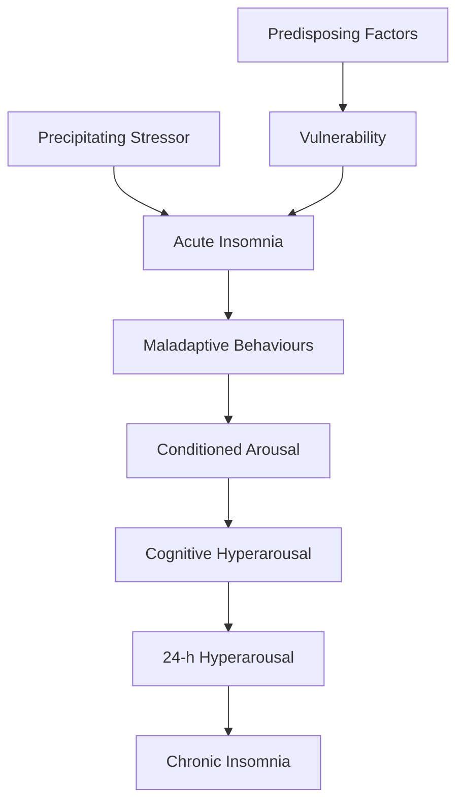
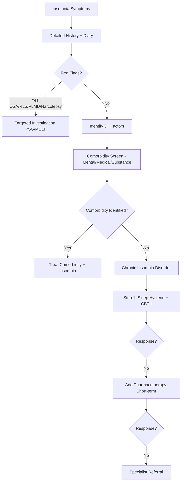
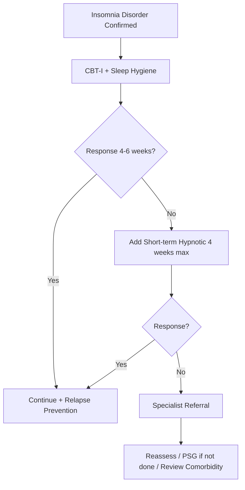

# Insomnia Disorder

Related: [[Sleep Disorders Hub]], [[Insomnia & Hypersomnia Hub]], [[Narcolepsy Type 1]], [[Idiopathic Hypersomnia]], [[Obstructive Sleep Apnoea]], [[Restless Legs Syndrome PLMD]]

> [!tip] **Definition (ICSD-3 / DSM-5)**
> Persistent difficulty with sleep initiation, maintenance, or early morning awakening with **daytime impairment**, occurring ≥3 nights/week for ≥3 months, despite adequate opportunity for sleep, and not attributable to another sleep disorder, substance, or medical condition.

> [!tip] **FCPS/MRCP focus:** Chronic insomnia = disorder with 24-hour hyperarousal (not just night-time symptoms). CBT-I is **first-line** in all guidelines; benzodiazepines/Z-drugs for ≤4 weeks only.

## Learning Objectives
- [ ] Define insomnia disorder (ICSD-3 / DSM-5)
- [ ] Describe epidemiology and predisposing/precipitating/perpetuating factors
- [ ] Explain Spielman 3P model and hyperarousal pathophysiology
- [ ] Distinguish acute vs chronic, primary vs comorbid insomnia
- [ ] Detail clinical features and history-taking
- [ ] Outline diagnostic approach (sleep diary, actigraphy, PSG)
- [ ] Differentiate from mimics (PLMD, RLS, OSA, circadian disorders)
- [ ] Manage stepwise: CBT-I → pharmacotherapy → specialist
- [ ] Identify red flags, DVLA implications, complications
- [ ] Recall drug doses, BAP/NICE recommendations, hypnotic side-effects

---

## 1. Definition / Epidemiology / Classification

### Definition
- **ICSD-3 Insomnia Disorder:** Dissatisfaction with sleep quantity/quality + daytime impairment ≥3 nights/week for ≥3 months, with adequate sleep opportunity, not better explained by another disorder.
- **DSM-5:** Dissatisfaction with sleep + clinically significant distress/impairment ≥3 nights/week for ≥3 months (separate criteria for acute <3 months).

### Epidemiology
- **Prevalence:** 10-15% chronic insomnia; 30-40% occasional symptoms
- **Age:** Increases with age; F > M (1.5:1); peak middle-age
- **Comorbidities:** Depression (40-50%), anxiety (30%), chronic pain, cardiovascular disease
- **Risk factors:** Female, elderly, shift work, mental illness, chronic disease, low socioeconomic status

### Classification
| Type | Duration | Features |
|------|----------|----------|
| **Acute/Adjustment insomnia** | <3 months | Identifiable stressor; usually self-limiting |
| **Chronic Insomnia Disorder** | ≥3 months | ≥3 nights/week + daytime impairment |
| **Comorbid insomnia** | Chronic | With medical/psychiatric/substance cause |
| **Paradoxical (Sleep state misperception)** | Chronic | Subjective severe insomnia but normal PSG |

| Sleep-onset vs Maintenance | |
|---------------------------|---|
| **Sleep-onset (initial)** | Difficulty falling asleep; common in anxiety, delayed sleep phase |
| **Maintenance (middle)** | Frequent awakenings; common in depression, OSA, pain, PLMD |
| **Terminal (early morning)** | Waking ≥2h before desired; common in depression, elderly |

---

## 2. Aetiology / Pathophysiology

### Aetiology (Spielman 3P Model)
- **Predisposing factors:** Female sex, age, hyperarousal trait, genetic (PER3, Clock), anxiety-prone personality
- **Precipitating factors:** Stress, illness, bereavement, jet lag, shift work, medications
- **Perpetuating factors:** Maladaptive sleep behaviours, conditioned arousal, dysfunctional beliefs, compensatory daytime napping

### Pathophysiology

### Molecular / Neurobiology
- **Hyperarousal:** ↑ cortisol, ↑ sympathetic activity, ↑ high-frequency EEG (beta) during sleep
- **Neurotransmitters:** ↑ glutamate, ↑ orexin; ↓ GABA, ↓ melatonin amplitude
- **Imaging:** ↑ metabolic activity in pontine reticular formation, thalamus, prefrontal cortex during sleep
- **Genetics:** PER3 VNTR polymorphism, GABA-A receptor variants, clock gene variants

---

## 3. Clinical Features

### History
- **Onset/Duration:** Acute vs chronic; identifiable trigger?
- **Pattern:** Sleep-onset, maintenance, terminal, non-restorative
- **24-hour symptoms:** Daytime fatigue, irritability, mood, cognition, occupational impact
- **Sleep hygiene:** Bed/ wake times, screen use, caffeine/alcohol, naps
- **Bedroom environment:** Noise, light, partner, temperature
- **Drug history:** Stimulants, antidepressants, opioids, decongestants, caffeine
- **Mental health:** Depression (PHQ-9), anxiety (GAD-7), trauma
- **Medical:** Pain, nocturia, dyspnoea, reflux, hyperthyroidism
- **Substances:** Alcohol (fragmenting), nicotine, caffeine, recreational drugs

### Examination / Domains
| Domain | Key Findings | Significance |
|--------|-------------|--------------|
| **Mental state** | Mood, anxiety, rumination | Comorbid psychiatric |
| **ENT/airway** | Nasal obstruction, Mallampati | OSA risk |
| **Cardiovascular** | BP, BMI, neck circumference | OSA risk |
| **Neurological** | Restless legs signs, peripheral neuropathy | RLS/PLMD |
| **Endocrine** | Thyroid signs | Hyperthyroidism |

### Specific Subtypes
| Subtype | Features |
|---------|----------|
| **Adjustment insomnia** | Recent stressor, <3 months |
| **Psychophysiological insomnia** | Conditioned arousal; better sleep away from home |
| **Paradoxical insomnia** | Severe complaint, normal PSG sleep efficiency |
| **Behavioural insomnia of childhood** | Limit-setting, sleep-onset association |

### Associated Findings
- **Daytime:** Fatigue, irritability, poor concentration, mood disturbance
- **Workplace:** Absenteeism, accidents, errors
- **Mental health:** Risk factor for depression (×2), anxiety, suicide
- **Cardiovascular:** HTN, MI, stroke association (longitudinal studies)

---

## 4. Diagnostic Approach / Algorithm

### Diagnostic Criteria (ICSD-3)
| Criterion | Description |
|-----------|-------------|
| **A** | Difficulty initiating/maintaining sleep or non-restorative sleep |
| **B** | ≥3 nights/week for ≥3 months |
| **C** | Significant daytime impairment |
| **D** | Adequate sleep opportunity |
| **E** | Not better explained by another sleep/medical/mental/substance disorder |

### Severity Assessment
| Tool | Parameters | Use |
|------|-----------|-----|
| **Insomnia Severity Index (ISI)** | 7 items, 0-28 | Screening, severity, response; ≥15 = clinical insomnia |
| **Pittsburgh Sleep Quality Index (PSQI)** | 19 items | Global sleep quality |
| **Sleep diary (2 weeks)** | Sleep onset, wake, total sleep, awakenings | Subjective pattern |
| **Actigraphy** | Movement-based sleep estimate | Objective total sleep time (TST) |

---

## 5. Investigations

### First-Line
| Investigation | Indication | Expected Finding |
|---------------|------------|------------------|
| **Sleep diary (≥2 weeks)** | All | Pattern, total sleep time, awakenings |
| **ISI / PSQI** | Screening, baseline | Severity score |
| **PHQ-9 / GAD-7** | Mood/anxiety screen | Comorbid depression/anxiety |
| **Bloods** | Comorbidity | FBC, TFT, glucose, iron studies (RLS), Vit D |

### Neurophysiology / Polysomnography (PSG)
| Indication | Findings |
|-----------|----------|
| Suspected OSA | AHI ≥5/h |
| Suspected PLMD | PLM index ≥15/h |
| Suspected narcolepsy (not needed for insomnia) | Sleep latency, SOREMPs |
| Treatment-resistant insomnia | Confirm hyperarousal / exclude mimics |
| Paradoxical insomnia | Subjective-objective mismatch |

### When NOT to Investigate
- Routine PSG not needed in uncomplicated chronic insomnia (per AASM 2017, BAP 2019)
- Reserve PSG/MSLT for suspected OSA, narcolepsy, PLMD, or treatment failure

---

## 6. Differential Diagnosis

| Differential | Distinguishing Features | Key Test |
|--------------|------------------------|----------|
| **Obstructive Sleep Apnoea** | Snoring, witnessed apnoeas, obesity, Epworth >10 | PSG (AHI) |
| **Restless Legs Syndrome** | Urge to move legs at rest, worse evening | Clinical (IRLSSG) |
| **Periodic Limb Movement Disorder** | Repetitive limb movements, arousals | PSG (PLM index) |
| **Delayed Sleep Phase Disorder** | Sleep-onset insomnia, late chronotype | Sleep diary, DLMO |
| **Advanced Sleep Phase Disorder** | Early evening sleepiness, early waking | Sleep diary |
| **Depression** | Anhedonia, low mood, early morning waking | PHQ-9 |
| **Anxiety disorders** | Rumination, GAD, panic | GAD-7 |
| **Mania / hypomania** | Decreased need for sleep, hyperactivity | Clinical, MDQ |
| **Substance-induced** | Stimulants, alcohol, caffeine, opioids | History, toxicology |
| **Medical causes** | Pain, dyspnoea, nocturia, reflux, hyperthyroidism | Targeted workup |

---

## 7. Management

### Acute / Short-Term Insomnia (≤4 weeks)
| Strategy | Details |
|----------|---------|
| **Identify stressor** | Treat/address if possible |
| **Sleep hygiene** | Consistent schedule, dark/cool room, limit screens, avoid caffeine 6h pre-bed |
| **Benzodiazepine / Z-drug** | Short-term only (≤4 weeks); lowest dose; intermittent dosing preferred |
| **Sedating antidepressant** | If depression comorbidity (e.g., Trazodone 50mg, Mirtazapine 15mg) |

### Chronic Insomnia Disorder — Stepwise
#### **Step 1: Sleep Hygiene + CBT-I (First-Line — All Guidelines)**
| Component | Details |
|-----------|---------|
| **Sleep hygiene** | Behavioural basics (see above) |
| **Stimulus control** | Bed only for sleep/sex; out if awake >20 min; consistent wake time |
| **Sleep restriction** | Restrict time in bed to actual sleep; weekly adjust |
| **Cognitive therapy** | Challenge dysfunctional beliefs about sleep |
| **Relaxation training** | Progressive muscle relaxation, mindfulness, autogenic training |
| **Paradoxical intention** | Try to stay awake (reduces performance anxiety) |
| **Biofeedback** | Optional |

> **EVIDENCE:** CBT-I has equivalent short-term efficacy to hypnotics but **superior long-term efficacy**; recommended first-line by AASM, BAP, NICE.

#### **Step 2: Pharmacotherapy (Adjunct, Short-term ≤4 weeks)**
| Agent | Class | Dose | Notes |
|-------|-------|------|-------|
| **Zopiclone** | Z-drug (non-BZD) | 3.75-7.5mg nocte | Avoid >4 weeks; risk tolerance/dependence |
| **Zolpidem** | Z-drug | 5-10mg nocte | Sleep-onset insomnia; complex sleep behaviours |
| **Melatonin (MR/prolonged-release)** | Hormone | 2mg nocte (≥55y) | First-line in ≥55y (Circadin); minimal side-effects |
| **Doxepin (3-6mg)** | TCA (low dose) | 3-6mg nocte | Sleep-maintenance insomnia; minimal anticholinergic at this dose |
| **Trazodone** | SARI | 50-100mg nocte | Sedating antidepressant; useful in depression comorbidity |
| **Mirtazapine** | NaSSA | 7.5-15mg nocte | Sedating; weight gain; useful in depression |
| **Temazepam** | BZD | 10-20mg | Short-term only; falls/cognitive risk elderly |
| **Daridorexant** | DORA (orexin antagonist) | 25-50mg | Newer; useful sleep-onset + maintenance |

#### **Step 3: Specialist / Refractory**
- Specialist sleep clinic
- Consider prolonged-release melatonin higher dose (off-label)
- Quetiapine 25-50mg (off-label; metabolic risk)
- Review diagnosis, exclude mimics

### Management Algorithm

### Special Populations
- **Pregnancy:** CBT-I first-line; avoid benzodiazepines (teratogenic), Z-drugs; sedating antihistamines (promethazine/doxylamine) if severe
- **Elderly:** CBT-I highly effective; avoid long-acting BZDs (falls, cognitive decline); melatonin MR first-line if pharmacotherapy needed
- **Children:** Behavioural interventions; parent training; melatonin (limited)
- **Comorbid depression:** CBT-I improves both; sedating antidepressant (Trazodone/Mirtazapine)

---

## 8. Drug Interactions / Cautions

| Drug | Interaction / Caution | Management |
|------|----------------------|------------|
| **BZDs / Z-drugs** | CNS depression with alcohol, opioids | Avoid combination; counsel |
| **Z-drugs** | Complex sleep behaviours (sleep-walking, eating, driving) | Discontinue if occur |
| **Trazodone** | Serotonin syndrome with SSRIs/MAOIs (rare) | Monitor |
| **Doxepin** | Anticholinergic burden (low dose OK) | Caution elderly |
| **Melatonin** | CYP1A2 substrates (ciprofloxacin, fluvoxamine) | Dose adjust |
| **Daridorexant** | CYP3A4 inhibitors (ketoconazole) | Avoid |
| **All sedatives** | Falls, daytime sedation, cognitive impairment | Counsel driving, next-day |

---

## 9. Procedures (not applicable)

- PSG (see Investigations)

---

## 10. Complications

| Complication | Frequency | Prevention/Management |
|--------------|-----------|------------------------|
| **Depression** | ×2-3 risk | CBT-I prevents |
| **Anxiety / substance use** | Common | CBT-I, avoid long-term BZD |
| **Cognitive impairment** | Common | Treat insomnia |
| **Workplace accidents** | ×2 risk | Treat, DVLA reporting |
| **Road traffic accidents** | ↑ Risk (sedative meds) | Counsel, avoid driving if drowsy |
| **Cardiovascular disease** | ↑ Long-term risk | Address overall CV risk |
| **Hypnotic dependence** | ≥4 weeks BZD/Z-drug | Limit duration, intermittent dosing |

---

## 11. Red Flags / Emergencies

| Red Flag | Immediate Action |
|----------|------------------|
| **Suicidal ideation with insomnia** | Urgent psychiatric assessment |
| **Excessive daytime sleepiness with motor vehicle use** | DVLA notification; stop driving |
| **Sudden onset insomnia + neurological signs** | Exclude encephalitis, lesion |
| **Suspected substance withdrawal** | Supportive care, detoxification |
| **Manic switch** | Stop antidepressants; mood stabiliser |

---

## 12. Prognosis

- **Acute insomnia:** Usually resolves with stressor removal (weeks-months)
- **Chronic insomnia:** Often persists for years without treatment; **CBT-I has durable benefit** (months-years)
- **Hypnotic dependence:** Risk with prolonged use; withdrawal insomnia common (rebound)
- **Comorbid depression:** Insomnia treatment reduces depression relapse
- **Mortality:** ↑ All-cause mortality (modest); strongly linked with comorbid disease

---

## 13. Topic Correlation

| Related Topic | Link | Key Overlap |
|---------------|------|-------------|
| OSA | [[Obstructive Sleep Apnoea]] | Insomnia comorbidity, overlaps with maintenance insomnia |
| Narcolepsy | [[Narcolepsy Type 1]] | Daytime sleepiness differential |
| Idiopathic Hypersomnia | [[Idiopathic Hypersomnia]] | Sleep inertia, paradox |
| RLS / PLMD | [[Restless Legs Syndrome PLMD]] | Maintenance insomnia |
| Depression | See Psychiatry | Antidepressant overlap (Trazodone, Mirtazapine) |

---

## 14. Special Situations

| Situation | Consideration |
|-----------|---------------|
| **Pregnancy** | CBT-I first-line; avoid BZD/Z-drug; sedating antihistamines (promethazine, doxylamine); Treat GERD/nausea |
| **Lactation** | Melatonin, low-dose doxepin, trazodone cautiously; avoid BZD |
| **Paediatric** | Behavioural first-line; melatonin limited evidence; avoid sedatives |
| **Elderly** | CBT-I first-line; MR melatonin (first-line); avoid long-acting BZD; falls/cognition risk |
| **Renal impairment** | Zopiclone reduced dose; melatonin safe |
| **Hepatic impairment** | All sedatives reduce dose; avoid Z-drugs in severe |
| **Driving (DVLA)** | **Must notify if chronic insomnia causing daytime sleepiness affecting driving**. License revoked until controlled (typically 3 months). |
| **Occupational** | HGV/PSV: stricter; airline pilots, train drivers — specialist review |
| **Shift workers** | Sleep hygiene, scheduled sleep, melatonin, light therapy; consider delayed sleep phase |

---

## FCPS/MRCP High-Yield Summary

| Category | Key Points |
|----------|------------|
| **Definition** | Chronic: ≥3 nights/week for ≥3 months + daytime impairment (ICSD-3) |
| **Epidemiology** | 10-15% chronic; F>M; ↑ with age |
| **Pathophysiology** | Spielman 3P model; 24-h hyperarousal; ↑ cortisol, ↑ beta EEG |
| **Clinical** | Sleep-onset/maintenance/early morning + daytime fatigue, mood, cognitive |
| **Diagnosis** | Clinical + sleep diary + ISI; PSG only if suspected OSA/narcolepsy/PLMD |
| **Investigations** | Sleep diary (≥2 weeks); PHQ-9/GAD-7; PSG only if mimics suspected |
| **Management** | **CBT-I first-line always**; pharmacotherapy short-term (≤4 weeks); melatonin MR in elderly |
| **Complications** | Depression ×2-3; accidents; hypnotic dependence; ↑ CV risk |
| **Prognosis** | CBT-I has durable benefit; chronic insomnia persists years if untreated |
| **Viva Pearls** | CBT-I = first-line ALWAYS; BZD/Z-drugs ≤4 weeks; melatonin MR first-line ≥55y; DVLA notification if driving affected |
| **Drug Doses** | Zopiclone 3.75-7.5mg; Zolpidem 5-10mg; Melatonin MR 2mg; Daridorexant 25-50mg |
| **Scoring** | ISI ≥15 = clinical insomnia; PSQI global score; Epworth for daytime sleepiness |
| **Genetics** | PER3 VNTR, Clock gene variants, GABA-A polymorphisms |
| **Imaging Signs** | ↑ metabolism in pontine reticular formation, thalamus, prefrontal cortex on PET |

---

## Viva Questions (PACES/FCPS Style)

1. **Q:** Define chronic insomnia disorder per ICSD-3.
   **A:** Difficulty initiating/maintaining sleep or non-restorative sleep with daytime impairment, ≥3 nights/week for ≥3 months, with adequate opportunity and not better explained by another disorder.
2. **Q:** What is the first-line treatment for chronic insomnia?
   **A:** Cognitive Behavioural Therapy for Insomnia (CBT-I) — superior long-term efficacy to hypnotics; recommended first-line in all guidelines (AASM, BAP, NICE).
3. **Q:** Describe the Spielman 3P model.
   **A:** Predisposing (e.g., age, female, anxiety-prone), Precipitating (stressor, illness), Perpetuating (maladaptive behaviours, conditioned arousal, dysfunctional beliefs) — perpetuating factors drive chronicity.
4. **Q:** Why is PSG not routinely indicated in insomnia?
   **A:** Per AASM 2017, BAP 2019 — routine PSG not needed in uncomplicated insomnia (clinical diagnosis). Reserve for suspected OSA, PLMD, narcolepsy, or treatment-resistant cases.
5. **Q:** What drugs worsen absence seizures? — (Wrong question) Drugs to AVOID in paradoxical insomnia: benzodiazepines (paradoxical excitation), stimulants.
6. **Q:** DVLA rules for insomnia?
   **A:** Notify DVLA if insomnia (or its treatment) affects driving. License revoked/suspended until satisfactory control, typically review at 3 months.
7. **Q:** How does CBT-I work?
   **A:** Stimulus control (bed=sleep), sleep restriction (limit time in bed), cognitive therapy (challenge beliefs), relaxation, sleep hygiene — combined ~6-8 sessions.
8. **Q:** Drug for insomnia in elderly (>55y) first-line?
   **A:** Prolonged-release melatonin 2mg (Circadin) — first-line per NICE; minimal side-effects, no dependence.
9. **Q:** Rebound insomnia?
   **A:** Worsening of sleep after stopping hypnotic (especially BZD/Z-drug) due to dependence/withdrawal — use intermittent dosing, taper slowly.
10. **Q:** What is paradoxical insomnia?
    **A:** Severe subjective complaint of insomnia but normal objective sleep on PSG — sleep state misperception; CBT-I helps.
11. **Q:** Insomnia and depression — what is the link?
    **A:** Insomnia is both a risk factor for and a symptom of depression; CBT-I improves depression outcomes and reduces relapse.
12. **Q:** Pharmacology of daridorexant?
    **A:** Dual orexin receptor antagonist (DORA); blocks orexin A/B → promotes sleep without GABA-A effects; 25-50mg nocte; useful sleep-onset + maintenance.

---

## Common Confusions / Exam Traps

| Confusion | Clarification |
|-----------|---------------|
| BZD for chronic insomnia | BZD limited to ≤4 weeks; CBT-I first-line |
| Hypnotic dependence vs addiction | Dependence = physiological tolerance/withdrawal; Addiction = compulsive misuse |
| Melatonin as supplement vs drug | MR melatonin 2mg (Circadin) is licensed drug; OTC melatonin is unregulated, variable dose |
| Sleep restriction = sleep deprivation | Restrict time in bed to actual sleep initially; titrate up |
| Antihistamines (diphenhydramine) for insomnia | Anticholinergic burden, falls, confusion in elderly; AVOID |
| Gabapentin in insomnia | Off-label, modest efficacy; tolerance, dependence |

---

## Mnemonics
1. **3P** — **P**redisposing, **P**recipitating, **P**erpetuating (Spielman model)
2. **CBT-I** — **C**ognitive, **B**ehavioural (stimulus control, sleep restriction), **T**herapy for **I**nsomnia
3. **ISI Cut-offs** — 0-7 none, 8-14 subthreshold, 15-21 moderate, 22-28 severe
4. **DORA** — **D**ual **O**rexin **R**eceptor **A**ntagonist (Daridorexant, Suvorexant, Lemborexant)
5. **Z-drugs rule** — Limit to 4 weeks max; intermittent dosing preferred; avoid in elderly

---

## FCPS/MRCP High-Yield Summary Table

| Concept | Key Point |
|---------|-----------|
| ICSD-3 Duration | ≥3 nights/week × ≥3 months |
| First-line Tx | CBT-I (NOT hypnotics) |
| Elderly first-line | MR Melatonin 2mg |
| BZD/Z-drug limit | ≤4 weeks |
| PSG routine | NOT required |
| Red flag | Suicidality, RTA risk, DVLA |
| Comorbidity | Depression ×2-3 risk; CBT-I treats both |

---

## MCQs (10)

1. **Q:** Per ICSD-3, what is the minimum duration criterion for chronic insomnia disorder?
   A. 1 week B. 1 month C. 3 months D. 6 months
   **Answer: C** — ≥3 nights/week for ≥3 months.

2. **Q:** First-line treatment for chronic insomnia disorder per NICE/AASM/BAP?
   A. Zopiclone B. Melatonin C. CBT-I D. Trazodone
   **Answer: C** — CBT-I is first-line; hypnotics for ≤4 weeks only.

3. **Q:** Which hypnotic is first-line in patients aged >55 years per NICE?
   A. Temazepam B. Zopiclone C. Prolonged-release melatonin 2mg D. Trazodone
   **Answer: C** — MR melatonin (Circadin) first-line ≥55y.

4. **Q:** Maximum recommended duration of benzodiazepine or Z-drug for insomnia?
   A. 1 week B. 2 weeks C. 4 weeks D. 12 weeks
   **Answer: C** — ≤4 weeks maximum to avoid dependence.

5. **Q:** Which agent is a dual orexin receptor antagonist (DORA)?
   A. Zolpidem B. Daridorexant C. Trazodone D. Mirtazapine
   **Answer: B** — Daridorexant (also Suvorexant, Lemborexant) are DORAs.

6. **Q:** Spielman 3P model components?
   A. Pain, Pills, Psychology B. Predisposing, Precipitating, Perpetuating C. Physical, Psychiatric, Pharmacological D. Primary, Prolonged, Permanent
   **Answer: B** — Predisposing, Precipitating, Perpetuating.

7. **Q:** Insomnia Severity Index (ISI) cut-off for clinical insomnia?
   A. ≥8 B. ≥10 C. ≥15 D. ≥22
   **Answer: C** — ISI ≥15 indicates clinical insomnia (moderate severity).

8. **Q:** Which drug class is CONTRAINDICATED in insomnia with benzodiazepine dependence history?
   A. Melatonin B. Z-drugs C. CBT-I D. Sleep hygiene
   **Answer: B** — Z-drugs cross-react with BZD receptors; avoid.

9. **Q:** Antidepressant with insomnia as side-effect?
   A. Trazodone B. Mirtazapine C. Fluoxetine D. Agomelatine
   **Answer: C** — SSRIs (fluoxetine) cause insomnia; sedating ones (trazodone, mirtazapine) treat insomnia.

10. **Q:** Paradoxical insomnia is characterised by:
    A. Insomnia only in own bed B. Severe complaint with normal PSG C. Insomnia with daytime sleepiness D. Insomnia due to pain
    **Answer: B** — Sleep state misperception; normal objective sleep on PSG.

---

## SBAs (10)

1. **Scenario:** 45-year-old woman with 6 months of difficulty maintaining sleep, daytime fatigue, ISI 19. PHQ-9 = 4. She drinks 4 cups of coffee daily and uses her phone in bed. What is the next step?
   A. Start Zopiclone B. Start Fluoxetine C. CBT-I + sleep hygiene D. PSG
   **Answer: C** — Chronic insomnia without psychiatric comorbidity: CBT-I first-line.

2. **Scenario:** 70-year-old man with insomnia, on temazepam 20mg for 3 months. He reports falls and daytime confusion. What is the most appropriate action?
   A. Increase temazepam B. Switch to zolpidem C. Taper and start CBT-I + melatonin MR D. Add mirtazapine
   **Answer: C** — Long-term BZD in elderly = falls/cognitive risk. Taper, CBT-I, MR melatonin.

3. **Scenario:** 30-year-old pregnant woman (20 weeks) with severe insomnia. CBT-I failed. Which pharmacological agent is safest?
   A. Zopiclone B. Diazepam C. Promethazine D. Melatonin MR
   **Answer: C** — Promethazine is generally considered safer in pregnancy; avoid BZD/Z-drug.

4. **Scenario:** 50-year-old man, chronic insomnia, no other sleep complaints, BMI 28, Epworth 6, no snoring. Sleep diary shows fragmented sleep. PSG was normal (sleep efficiency 88%). What is the diagnosis?
   A. OSA B. Paradoxical insomnia C. Idiopathic hypersomnia D. PLMD
   **Answer: B** — Normal PSG with severe complaint = paradoxical (sleep state misperception) insomnia.

5. **Scenario:** 35-year-old shift worker with insomnia. Sleep diary shows sleep onset 02:00, wake 09:00, with adequate duration. What is the diagnosis?
   A. Insomnia disorder B. Delayed Sleep Phase Disorder C. Shift Work Disorder D. Advanced Sleep Phase
   **Answer: B** — Late sleep onset but adequate duration when allowed = DSPD; treat with chronotherapy, light, melatonin.

6. **Scenario:** Insomnia patient started on Zopiclone 4 weeks ago. He reports sleep-walking and eating at night without recollection. What is the most appropriate action?
   A. Increase dose B. Continue, monitor C. Discontinue Zopiclone D. Add diazepam
   **Answer: C** — Complex sleep behaviour with Z-drugs: discontinue immediately.

7. **Scenario:** 60-year-old with chronic insomnia and depression on fluoxetine. Sleep is worse. Best additional agent?
   A. Add Zopiclone B. Switch fluoxetine to trazodone C. Add low-dose trazodone 50-100mg nocte D. Add mirtazapine
   **Answer: C** — Low-dose trazodone is effective add-on for SSRI-related insomnia; less complex than switching.

8. **Scenario:** 25-year-old medical student with insomnia during exam period. Onset 4 weeks ago after a stressful event. Best initial approach?
   A. CBT-I B. Zopiclone 2 weeks C. Sleep hygiene + short-term Z-drug if needed D. Melatonin MR
   **Answer: C** — Acute adjustment insomnia: sleep hygiene + short-term hypnotic (≤4 weeks) if needed.

9. **Scenario:** 55-year-old with chronic insomnia. CBT-I partially effective. PSG showed PLM index 22/h. What is the next step?
   A. Increase hypnotic B. Treat PLMD (e.g., pramipexole) C. PSG titration D. Sleep restriction alone
   **Answer: B** — PLMD with insomnia: treat with dopamine agonist (pramipexole, ropinirole) or alpha-2-delta (gabapentin).

10. **Scenario:** Insomnia patient on daridorexant complains of next-day somnolence. What is the mechanism of daridorexant?
    A. GABA-A agonism B. Orexin receptor antagonism C. Histamine antagonism D. Melatonin agonism
    **Answer: B** — DORA blocks orexin A/B; promotes sleep. Next-day effects possible at high dose.

---

## Flashcards

- **Q:** ICSD-3 duration criterion for chronic insomnia?
  **A:** ≥3 nights/week for ≥3 months
- **Q:** First-line for chronic insomnia per all guidelines?
  **A:** CBT-I
- **Q:** Maximum BZD/Z-drug duration?
  **A:** ≤4 weeks
- **Q:** First-line hypnotic in elderly (>55y)?
  **A:** Prolonged-release melatonin 2mg
- **Q:** 3P model components?
  **A:** Predisposing, Precipitating, Perpetuating
- **Q:** DORA mechanism?
  **A:** Dual Orexin Receptor Antagonist (Daridorexant, Suvorexant, Lemborexant)
- **Q:** ISI cut-off for clinical insomnia?
  **A:** ≥15
- **Q:** Drug that causes complex sleep behaviours (sleep-walking)?
  **A:** Z-drugs (Zopiclone, Zolpidem)
- **Q:** Paradoxical insomnia?
  **A:** Severe subjective insomnia + normal PSG
- **Q:** DVLA rules for insomnia?
  **A:** Notify if driving affected; suspended until controlled

---

## Answer Key

### MCQs
1. C (3 months) 2. C (CBT-I) 3. C (Melatonin MR) 4. C (4 weeks) 5. B (Daridorexant) 6. B (3P) 7. C (≥15) 8. B (Z-drugs avoid) 9. C (Fluoxetine) 10. B (Paradoxical)

### SBAs
1. C (CBT-I) 2. C (Taper, CBT-I, Melatonin) 3. C (Promethazine) 4. B (Paradoxical) 5. B (DSPD) 6. C (Discontinue Z-drug) 7. C (Trazodone add-on) 8. C (Acute - sleep hygiene + short-term) 9. B (Treat PLMD) 10. B (Orexin antagonism)

---

## Summary

Insomnia disorder is a **24-hour hyperarousal state** characterised by persistent difficulty with sleep initiation, maintenance, or early morning awakening with daytime impairment, lasting ≥3 months. The **Spielman 3P model** (predisposing, precipitating, perpetuating) explains chronicity. **CBT-I is first-line** for chronic insomnia in all major guidelines — superior long-term efficacy to hypnotics. **Pharmacotherapy** (BZDs, Z-drugs) is restricted to ≤4 weeks due to dependence risk; **prolonged-release melatonin** is first-line in ≥55 years. PSG is reserved for suspected mimics (OSA, PLMD, narcolepsy). Complications include depression, accidents, hypnotic dependence, and increased cardiovascular risk. DVLA notification required if driving affected. Always screen for and treat comorbidities (depression, anxiety, OSA, RLS, PLMD, circadian disorders).

## PasTest Scenario SBAs (Clinical Vignettes)

> **Auto-generated PasTest/Mediscope-style scenario SBAs** grounded in the authored source. Each scenario tests a real clinical fact (triad, specific sign, contraindication, trial, first-line Rx) extracted from the topic. *Source: Ch 27: Neurology & Stroke — Insomnia Disorder*

**Q1.** What is the most appropriate first-line therapy for Insomnia Disorder?

  - **A.** Identify stressor
  - **B.** An advanced/surgical therapy reserved for refractory disease
  - **C.** Symptomatic treatment only, no disease-modifying therapy
  - **D.** Empiric broad-spectrum therapy without specific indication

  > **Answer: A** — Identify stressor
  >
  > *Source:* **Identify stressor**   Treat/address if possible

