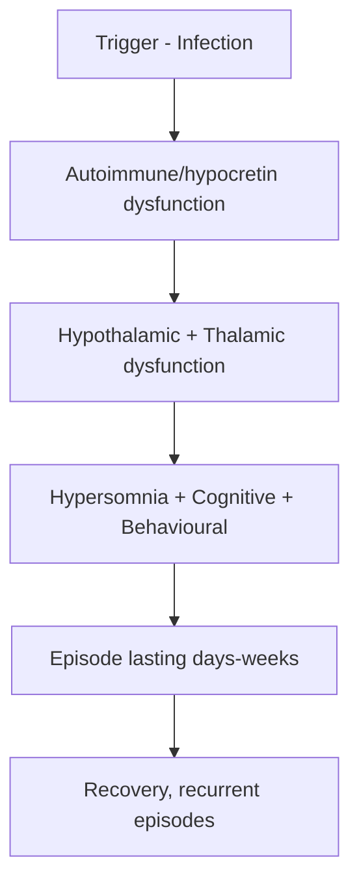
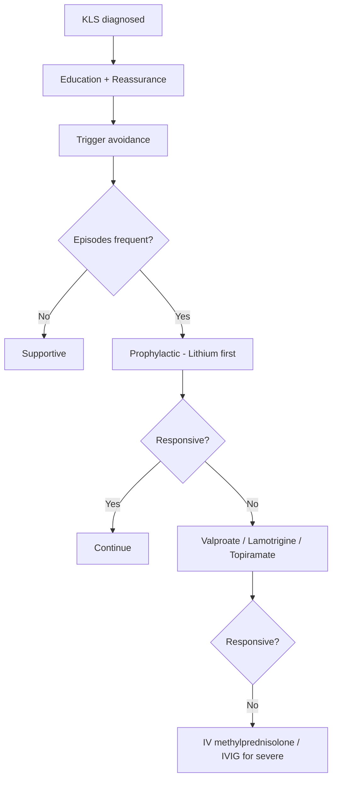

# Kleine-Levin Syndrome (KLS)

> [!tip] **Definition**
> **Kleine-Levin Syndrome** — rare **relapsing-remitting** primary hypersomnia of childhood/adolescence, characterised by **recurrent episodes** of **hypersomnia + cognitive/ behavioural disturbance** (hyperphagia, hypersexuality, irritability, confusion) lasting **days to weeks**, with **normal inter-episodic baseline**.

> [!tip] **Key Clinical Features**
> Triad: **Hypersomnia (≥18h/day) + Cognitive dysfunction + Behavioural changes (hyperphagia, hypersexuality, irritability)**. Self-limiting course; episodes decrease over years.

## 1. Definition / Epidemiology / Classification

### Definition
- Primary CNS hypersomnia, relapsing-remitting pattern
- ICDS-3 / DSM-5: recurrent primary hypersomnia

### Epidemiology
| Metric | Value |
|--------|-------|
| **Prevalence** | 1-2 per million (very rare) |
| **Incidence** | ~3 per million/year |
| **M:F** | 2:1 (males predominate) |
| **Onset** | Adolescence (median 15 years); 80% <20 years |
| **Course** | Self-limiting; 7-12 years median duration |
| **Risk factors** | Genetic (familial 5%); preceding infection (35%) |

### Classification
- **Classic KLS** (full triad)
- **Atypical KLS** (one or more cardinal features missing)
- **Secondary KLS** (rarely, with structural hypothalamic lesions)

## 2. Aetiology / Pathophysiology

### Aetiology
- **Genetic:** Familial 5%; HLA-DQB1*0602 association
- **Infectious trigger:** 35% (URI, flu-like illness, EBV)
- **Trauma, alcohol, anaesthesia** (rarely)
- **Autoimmune** hypothesis (cytokines, response to immunomodulation)
- **Hypothalamic dysfunction** (posterior, orexin/hypocretin system)

### Pathophysiology


- **Hypothalamic** (posterior) dysfunction
- **Thalamocortical** network dysfunction
- **Hypocretin/orexin** system (CSF hypocretin normal in KLS, different from narcolepsy)
- **Hyperconnectivity** in default mode network (fMRI during episodes)
- **Hypoperfusion** in hypothalamic/thalamic regions (SPECT)

## 3. Clinical Features

### Cardinal Features
- **Hypersomnia:** ≥18 hours/day sleep
- **Cognitive dysfunction:** confusion, amnesia, slowed thinking, apathy, derealisation
- **Behavioural changes:**
  - **Hyperphagia** (compulsive eating, food-seeking)
  - **Hypersexuality** (especially males; inappropriate sexual behaviour)
  - **Irritability, aggression**
  - **Childish behaviour**
  - **Mood changes**

### Episode Characteristics
- **Duration:** 2-30 days (median 10-14 days)
- **Frequency:** 2-12 episodes/year initially
- **Trigger:** Often infection, sleep deprivation, alcohol
- **Onset:** Often abrupt (overnight)
- **Recovery:** Spontaneous, but amnesia of events

### Inter-Episodic Period
- **Normal** cognition, behaviour, sleep
- May have mild residual symptoms
- **Inter-episodic EEG, MRI normal**

### Triggers (Common)
- **Infection** (URI, flu) — 35%
- **Sleep deprivation**
- **Alcohol** (sometimes)
- **Stress, trauma**

## 4. Diagnostic Approach

```mermaid
flowchart TD
    A[Recurrent hypersomnia episodes] --> B[History: triad of hypersomnia + cognitive + behavioural]
    B --> C[Exclusion of other causes]
    C --> D[Bloods: TFT, glucose, B12, autoimmune]
    D --> E[MRI brain normal]
    E --> F[Polysomnography/MSLT]
    F --> G[CSF hypocretin (excludes narcolepsy)]
    G --> H[Diagnose KLS - ICSD-3]
```

### Diagnostic Criteria (ICSD-3) — All Required
1. **Recurrent episodes** of excessive sleep (>18h/day) lasting **2-30 days**
2. **≥1 associated symptom:**
   - Cognitive dysfunction (confusion, amnesia)
   - Behavioural changes (hyperphagia, hypersexuality)
   - Perceptual disturbances
3. **Normal cognition, behaviour, sleep** between episodes
4. **Not better explained** by another disorder

### Severity/Prognostic Indicators
- **Severe:** Frequent episodes (>10/year), long duration (>15 days)
- **Mild:** Few episodes, short duration
- **Worse prognosis:** Male, adolescence onset, prolonged episodes, atypical features

## 5. Investigations

| Investigation | Purpose | Expected (KLS) |
|---------------|---------|----------------|
| **Bloods (TFT, glucose, B12, autoimmune)** | Exclude other causes | Normal |
| **MRI brain** | Exclude hypothalamic lesion | Normal |
| **Polysomnography (PSG)** | Exclude other hypersomnias | During episode: long sleep time, normal architecture |
| **MSLT** (Multiple Sleep Latency Test) | Exclude narcolepsy | Within normal; not pathological sleep latency |
| **CSF hypocretin-1** | Exclude narcolepsy type 1 | **NORMAL** (low in NT1) |
| **EEG** | Exclude encephalitis | Normal (or non-specific slowing during episode) |
| **SPECT** (during episode) | Research; supportive | Hypothalamic hypoperfusion |

## 6. Differential Diagnosis

| Condition | Distinguishing | Key Test |
|-----------|----------------|----------|
| **Narcolepsy Type 1** | Cataplexy, short sleep latency, sleep paralysis | CSF hypocretin low |
| **Narcolepsy Type 2** | EDS, no cataplexy | MSLT |
| **Bipolar disorder (depressed)** | Mood symptoms, no hypersomnia episodes | History |
| **Encephalitis (autoimmune)** | Progressive, focal signs, abnormal MRI | MRI, antibody panel |
| **Hypothalamic lesion** | Persistent, not episodic | MRI |
| **Dissociative disorders** | Not true sleep, stress-related | Video-EEG |
| **Periodic hypersomnia** (menstrual-related) | Cycle with menses | History |
| **Idiopathic hypersomnia** | Persistent, not episodic | MSLT |
| **Complex partial seizures** | Stereotyped, post-ictal | Video-EEG |
| **Substance use** | Drug-related | Toxicology |

## 7. Management

### Acute Episode Management
- **Hospitalisation** (severe cases — safety, nutrition)
- **Stimulants** (modafinil, methylphenidide, amantadine) — modest benefit
- **Lithium** — most effective prophylactic (some evidence)
- **Carbamazepine** — limited evidence
- **IV methylprednisolone** (severe episodes — emerging evidence)
- **IVIG** (post-infectious, severe)
- **Supportive care** (hydration, nutrition, prevent harm)

### Prophylactic Treatment
| Agent | Dose | Evidence |
|-------|------|----------|
| **Lithium** | 600-1200 mg/day (serum 0.6-1.0 mmol/L) | Best evidence; reduces frequency |
| **Valproate** | 500-1500 mg/day | Some evidence |
| **Lamotrigine** | 100-300 mg/day | Limited evidence |
| **Topiramate** | 100-300 mg/day | Some evidence |

### Inter-Episodic Management
- **Reassurance** (self-limiting)
- **Avoid triggers** (sleep deprivation, alcohol)
- **Education** (school, family, patient)
- **Psychological support** (depression common)
- **Driving** — no driving during episodes

### Management Algorithm


## 8. Drug Interactions / Cautions
- **Lithium:** Narrow therapeutic index; monitor TFT, renal, serum levels; avoid in pregnancy (Ebstein anomaly)
- **Valproate:** Avoid in pregnancy, women of childbearing potential
- **Stimulants:** Risk of dependence, cardiac effects
- **Carbamazepine:** CYP inducer; many interactions

## 9. Procedures
- **No procedures** indicated
- **Lumbar puncture** for CSF hypocretin (excludes narcolepsy)

## 10. Complications
- **Severe weight gain** (hyperphagia)
- **Cognitive impairment** (between episodes in 20%)
- **Behavioural disturbance** (during episodes)
- **School failure** (prolonged absences)
- **Social isolation**
- **Depression, anxiety**
- **Hyperthermia** (rare, severe)
- **Inappropriate sexual behaviour** (legal/social issues)
- **Drowning** (sleep-related accidents)

## 11. Red Flags / Emergencies
- **Hyperthermia** (autonomic dysfunction)
- **Suicidal ideation** (depression)
- **Severe aggression / violence** (during episode)
- **Refusal of food/fluids** (dehydration)
- **Status KLS** (very prolonged episode)

## 12. Prognosis
- **Self-limiting** in 60-70% (episodes decrease, eventually stop)
- **Median duration:** 7-12 years
- **Good prognosis:** Female, later onset, short episodes
- **Poor prognosis:** Early onset (<12 years), male, long episodes, atypical features
- **Cognitive sequelae:** ~20% have persistent mild cognitive impairment (memory, attention)

## 13. Topic Correlation
| Related Topic | Link | Key Overlap |
|---------------|------|-------------|
| Narcolepsy Type 1 | [[Narcolepsy Type 1]] | Hypersomnia, but with cataplexy |
| Narcolepsy Type 2 | [[Narcolepsy Type 2]] | EDS without cataplexy |
| Bipolar disorder | [[Bipolar]] | Mood symptoms, episodic |
| Encephalitis (autoimmune) | [[Autoimmune Encephalitis]] | Mimic, antibody panel |

## 14. Special Situations
- **Pregnancy:** Lithium teratogenic (Ebstein); avoid; carbamazepine limited
- **Paediatric:** Common onset; school support essential; family education
- **Elderly:** Rarely first onset; reconsider diagnosis
- **Driving (DVLA):** No driving during episodes; inter-episodic OK
- **Educational:** Special arrangements, IEP, exam accommodations
- **Occupational:** Workplace support, reduced hours during episodes

## FCPS/MRCP High-Yield Summary
| Category | Key Points |
|----------|------------|
| **Definition** | Recurrent primary hypersomnia + cognitive/behavioural disturbance |
| **Epidemiology** | 1-2/million; M:F 2:1; adolescent onset (median 15) |
| **Pathophysiology** | Hypothalamic dysfunction; hypocretin normal; autoimmune trigger |
| **Clinical** | Hypersomnia (≥18h) + Cognitive dysfunction + Hyperphagia/Hypersexuality/Irritability |
| **Diagnosis** | ICSD-3 criteria; episodes 2-30 days; normal inter-episodic |
| **Investigations** | Normal MRI, normal CSF hypocretin, normal inter-episodic PSG |
| **Management** | Acute: supportive; Prophylactic: Lithium (1st line) |
| **Complications** | Weight gain, cognitive impairment, school failure, depression |
| **Prognosis** | Self-limiting; 7-12 years median duration; 60-70% recover |
| **Viva Pearls** | "Triad = hypersomnia + cognitive + behavioural"; "Lithium = best prophylactic" |
| **Mnemonic** | **HYPER** = Hypersomnia, hyperphagia, hypersexuality, Episodes, Recurrent |

## Viva Questions
1. **Q:** Triad of KLS?
   **A:** Hypersomnia + cognitive dysfunction + behavioural changes (hyperphagia, hypersexuality, irritability).
2. **Q:** Demographics of KLS?
   **A:** M:F 2:1; median onset 15 years; 80% <20 years.
3. **Q:** Duration of KLS episodes?
   **A:** 2-30 days (median 10-14).
4. **Q:** Best prophylactic drug?
   **A:** Lithium (serum 0.6-1.0 mmol/L).
5. **Q:** CSF hypocretin in KLS?
   **A:** Normal (low in narcolepsy type 1).
6. **Q:** Common trigger?
   **A:** Infection (35%) — usually URI or flu-like.
7. **Q:** ICDS-3 criteria for KLS?
   **A:** Recurrent episodes >18h/day sleep, 2-30 days, + cognitive/ behavioural, normal inter-episodic.
8. **Q:** Prognosis?
   **A:** Self-limiting, 7-12 years median; 60-70% recover.
9. **Q:** Differential with narcolepsy?
   **A:** Narcolepsy = persistent EDS, cataplexy (NT1), low hypocretin; KLS = episodic, normal hypocretin.
10. **Q:** What is the most important investigation to exclude narcolepsy?
    **A:** CSF hypocretin-1 (low in NT1, normal in KLS).

## Common Confusions / Exam Traps
| Confusion | Clarification |
|-----------|---------------|
| KLS = narcolepsy | Narcolepsy = persistent; KLS = episodic |
| KLS = bipolar | Bipolar = mood dominant; KLS = hypersomnia dominant |
| KLS = brain tumour | MRI normal in KLS; tumour progressive |
| Hyperphagia = eating disorder | Compulsive, during episode only |
| Lithium = lifelong | Use during frequent episodes only |
| Recovery = no sequelae | 20% have persistent cognitive issues |

## Mnemonics
1. **HYPER** = Hypersomnia, hyperphagia, hypersexuality, Episodes Recurrent
2. **3 H's** = Hyper-somnia, Hyper-phagia, Hyper-sexuality
3. **KLS** = **K**leine-**L**evin = **K**atabatic, **L**ong sleep, **S**elf-limiting

## MCQs (10)
1. **Q:** Classic triad of KLS includes all EXCEPT:
   **A.** Hypersomnia **B.** Cognitive dysfunction **C.** Behavioural changes (hyperphagia) **D.** Persistent insomnia
   **Answer:** D
2. **Q:** M:F ratio in KLS:
   **A.** 1:1 **B.** 2:1 (M>F) **C.** 1:2 (F>M) **D.** 5:1
   **Answer:** B
3. **Q:** Best prophylactic drug for KLS:
   **A.** Modafinil **B.** Lithium **C.** Zolpidem **D.** Haloperidol
   **Answer:** B
4. **Q:** CSF hypocretin in KLS:
   **A.** Low **B.** Normal **C.** High **D.** Absent
   **Answer:** B
5. **Q:** Common trigger of KLS episodes:
   **A.** Head injury **B.** Infection (35%) **C.** Alcohol **D.** Pregnancy
   **Answer:** B
6. **Q:** Median age of onset of KLS:
   **A.** 5 years **B.** 15 years **C.** 30 years **D.** 50 years
   **Answer:** B
7. **Q:** Episode duration of KLS:
   **A.** Hours **B.** 2-30 days **C.** 3-6 months **D.** Years
   **Answer:** B
8. **Q:** What does SPECT show during KLS episode:
   **A.** Cortical hyperperfusion **B.** Hypothalamic hypoperfusion **C.** Cerebellar lesion **D.** Normal
   **Answer:** B
9. **Q:** Inter-episodic EEG/MRI in KLS:
   **A.** Abnormal **B.** Normal **C.** Slow waves only **D.** Spike-wave
   **Answer:** B
10. **Q:** KLS prognosis:
    **A.** Progressive dementia **B.** Self-limiting (7-12 years median) **C.** Fatal **D.** Lifelong chronic
    **Answer:** B

## SBA Questions (10)
1. **Scenario:** 15-year-old boy with recurrent 10-day episodes of 20h sleep, hyperphagia, hypersexuality, irritability. Normal inter-episodic. Most likely diagnosis?
   **A.** Narcolepsy **B.** KLS **C.** Bipolar **D.** Encephalitis
   **Answer:** B
2. **Scenario:** KLS patient with frequent episodes (>10/year). Best prophylactic?
   **A.** Modafinil **B.** Lithium **C.** Zolpidem **D.** Carbamazepine only
   **Answer:** B
3. **Scenario:** 16-year-old with KLS started on lithium. Monitoring required:
   **A.** Liver function only **B.** Serum lithium levels, TFT, U&E **C.** No monitoring **D.** MRI
   **Answer:** B
4. **Scenario:** KLS patient with persistent cognitive impairment between episodes. % of patients with this:
   **A.** 0% **B.** 20% **C.** 50% **D.** 100%
   **Answer:** B
5. **Scenario:** KLS in pregnancy. Best prophylactic?
   **A.** Lithium (teratogenic) **B.** Avoid lithium; supportive care **C.** Valproate **D.** Carbamazepine high-dose
   **Answer:** B
6. **Scenario:** Severe KLS episode with hyperthermia. Next step:
   **A.** Discontinue treatment **B.** Hospitalise, supportive, IV methylprednisolone if severe **C.** Send home **D.** Aspirin
   **Answer:** B
7. **Scenario:** KLS with severe behavioural disturbance (aggression). Next step:
   **A.** Discharge **B.** Hospitalise for safety, supportive care **C.** Police **D.** ECT
   **Answer:** B
8. **Scenario:** 14-year-old with KLS, missing school frequently. Best intervention:
   **A.** Home-school only **B.** School support, IEP, exam accommodations **C.** Discontinue education **D.** Repeat year always
   **Answer:** B
9. **Scenario:** KLS patient with depression. Best drug:
   **A.** SSRI (cautious, can affect sleep) **B.** Lithium may treat both **C.** No treatment **D.** Valproate
   **Answer:** B
10. **Scenario:** Differentiate KLS from narcolepsy:
    **A.** Narcolepsy: episodic, KLS: persistent **B.** KLS: episodic, normal hypocretin; Narcolepsy: persistent, low hypocretin (NT1) **C.** Both same **D.** MRI differentiates
    **Answer:** B

## Flashcards
- **Q:** KLS triad?
  **A:** Hypersomnia + cognitive dysfunction + behavioural changes
- **Q:** Demographics?
  **A:** M:F 2:1; onset median 15 years
- **Q:** Episode duration?
  **A:** 2-30 days (median 10-14)
- **Q:** Best prophylactic?
  **A:** Lithium
- **Q:** CSF hypocretin?
  **A:** Normal (low in NT1)
- **Q:** Common trigger?
  **A:** Infection (35%)
- **Q:** Prognosis?
  **A:** Self-limiting, 7-12 years median
- **Q:** Inter-episodic MRI/EEG?
  **A:** Normal
- **Q:** % with persistent cognitive impairment?
  **A:** 20%
- **Q:** SPECT finding during episode?
  **A:** Hypothalamic hypoperfusion

## Answer Key
### MCQs
1. D  2. B  3. B  4. B  5. B  6. B  7. B  8. B  9. B  10. B

### SBAs
1. B  2. B  3. B  4. B  5. B  6. B  7. B  8. B  9. B  10. B

## Summary
**Kleine-Levin Syndrome** is a rare, relapsing-remitting primary hypersomnia of adolescence (M:F 2:1, median onset 15 years). Cardinal features: **hypersomnia (≥18h/day) + cognitive dysfunction + behavioural changes (hyperphagia, hypersexuality, irritability)**. Episodes last 2-30 days; inter-episodic period is normal. Trigger: infection (35%). **CSF hypocretin is NORMAL** (differentiates from narcolepsy type 1). Best prophylactic: **Lithium** (serum 0.6-1.0 mmol/L). Self-limiting course, 7-12 years median duration, 60-70% recover. ~20% have persistent cognitive impairment. Avoid lithium in pregnancy (Ebstein anomaly). Supportive care for acute episodes.
