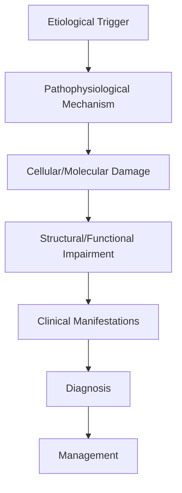
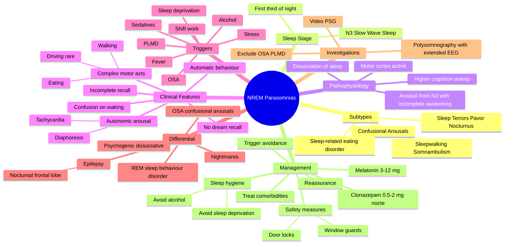

# NREM Parasomnias

> [!tip] **High-Yield Definition**
> Comprehensive clinical note for NREM Parasomnias covering definition, epidemiology, aetiology, pathophysiology, clinical features, investigations, differential diagnosis, management, drug interactions, procedures, complications, red flags, prognosis, topic correlation, and special situations for FCPS/MRCP examination preparation based on Davidson 24th Edition Chapter 25: Neurology.

---

## 1. Definition / Epidemiology / Classification

### Definition
NREM Parasomnias is a neurological disorder within the 16 sleep disorders category. It is characterised by specific clinical, pathological, radiological, and laboratory features that allow differentiation from related conditions.

### Epidemiology
- **Incidence/Prevalence:** Variable depending on the specific condition.
- **Age:** Adult onset is most common, but paediatric and elderly presentations occur.
- **Sex:** Variable depending on the condition.
- **Geography:** Worldwide distribution, with higher prevalence in certain regions.
- **Risk Factors:** Genetic predisposition, environmental factors, comorbidities, family history.

### Classification
| Subtype | Key Features | Prognosis |
|---------|-------------|-----------|
| Mild/early | Subtle symptoms, preserved function | Best |
| Moderate | Clear symptoms, functional impairment | Variable |
| Severe | Significant disability, complications | Worst |

---

## 2. Aetiology / Pathophysiology

### Aetiology
- **Primary (idiopathic):** Most cases have no identifiable cause.
- **Genetic:** May be inherited (AD, AR, X-linked, mitochondrial, sporadic).
- **Autoimmune:** Autoantibodies, immune-mediated inflammation.
- **Infectious:** Viral, bacterial, fungal, parasitic.
- **Metabolic:** Electrolyte, endocrine, hepatic, renal, nutritional.
- **Toxic:** Drugs, alcohol, heavy metals, environmental toxins.
- **Vascular:** Ischaemia, haemorrhage, vasculitis.
- **Neoplastic:** Primary, secondary, paraneoplastic.
- **Traumatic:** Acute, chronic, repetitive.
- **Degenerative:** Neurodegeneration, protein misfolding.

### Pathophysiology


---

## 3. Clinical Features

### History
- **Onset/Duration:** Acute, subacute, or chronic.
- **Progression:** Static, progressive, relapsing-remitting, stepwise.
- **Key symptoms:** Specific to the condition.
- **Triggers:** Stress, infection, trauma, drugs, hormonal, environmental.
- **Systemic symptoms:** Constitutional features.
- **Drug/Family/Social history:** Relevant exposures, comorbidities.

### Examination
| Domain | Key Findings | Localisation Value |
|--------|-------------|-------------------|
| Higher function | Cognitive, behavioural | Cortical, subcortical, limbic |
| Cranial nerves | Pupils, eye movements, facial, bulbar | Brainstem, cranial nerve, NMJ |
| Motor | Weakness, tone, reflexes | UMN, LMN, NMJ, muscle |
| Sensory | All modalities, pattern | Peripheral, spinal, brainstem |
| Coordination | Ataxia, nystagmus, dysmetria | Cerebellar, sensory, vestibular |
| Gait | Spastic, ataxic, parkinsonian | Multiple |
| Autonomic | Orthostatic, sweating, GI, bladder | Autonomic, peripheral, central |

### Specific Clinical Features
The clinical features are determined by the underlying aetiology, location of pathology, and rate of progression. Patients typically present with a constellation of symptoms and signs that allow clinical localisation and subsequent targeted investigation.

---

## 4. Diagnostic Approach / Algorithm

```mermaid
flowchart TD
    A[Clinical Presentation] --> B[Anatomical Localisation]
    B --> C[Pathophysiological Category]
    C --> D[Formulate Differential]
    D --> E[Targeted Investigations]
    E --> F[Confirm Diagnosis]
    F --> G[Assess Severity/Prognosis]
    G --> H[Initiate Management]
    H --> I[Monitor Response]
    I --> J{Response?}
    J --> YES1 [Good - Continue]
    J --> NO1 [Poor - Escalate]
    YES1 --> K[Monitor]
    NO1 --> H
```

---

## 5. Investigations

### First-Line Investigations
- **Blood tests:** FBC, U&Es, LFTs, glucose, calcium, magnesium, ESR, CRP, autoimmune, infection.
- **Imaging:** CT/MRI brain/spine (essential for most neurological conditions).
- **Neurophysiology:** EEG, nerve conduction, EMG, evoked potentials.
- **CSF:** Cell count, protein, glucose, OCBs, PCR, culture.

### Second-Line Investigations
- **Genetic testing:** Gene panels, WES, WGS.
- **Antibody testing:** Antineuronal, autoimmune, paraneoplastic.
- **Biopsy:** Nerve, muscle, brain, skin.
- **Advanced imaging:** PET-CT, MR spectroscopy, fMRI.

### Specialised Investigations
- **Biomarkers:** Neurofilament light chain, tau, beta-amyloid, 14-3-3, RT-QuIC.
- **Autonomic testing:** Head-up tilt, sudomotor, QSART.
- **Neuropsychology:** Cognitive testing, behavioural assessment.
- **Genetic counselling:** Family screening, predictive testing.

---

## 6. Differential Diagnosis

| Differential | Distinguishing Features | Key Test |
|--------------|------------------------|----------|
| Vascular | Sudden onset, focal, vascular risk factors | MRI/CT, vessel imaging |
| Inflammatory | Subacute, multifocal, systemic | MRI, CSF, antibodies |
| Infectious | Fever, systemic, exposure | Bloods, CSF, imaging |
| Neoplastic | Progressive, mass effect | MRI, biopsy |
| Degenerative | Progressive, symmetric, hereditary | MRI, genetic |
| Toxic/Metabolic | Drug history, systemic, reversible | Bloods, toxicology |
| Autoimmune | Multifocal, antibodies, immunotherapy response | Antibodies, MRI, CSF |
| Functional | Inconsistent, distractible | Clinical, video, biomarkers |

---

## 7. Management

### Acute Management
- **Stabilisation:** ABCDE approach, emergency resuscitation.
- **Specific treatment:** Disease-specific interventions.
- **Symptomatic relief:** Pain, seizures, spasticity, autonomic dysfunction.
- **Prevention of complications:** DVT, pressure sores, infection.

### Disease-Modifying Treatment
- **Pharmacological:** First-line, second-line, escalation, maintenance.
- **Procedural:** Surgery, biopsy, drainage, ablation, stimulation.
- **Immunotherapy:** Steroids, IVIG, plasma exchange, immunosuppressants, biologics.
- **Rehabilitation:** Physiotherapy, OT, speech therapy.

### Long-Term Management
- **Monitoring:** Clinical, imaging, biomarkers, side effects.
- **Prevention:** Vaccinations, prophylaxis, lifestyle modification.
- **Supportive care:** Multidisciplinary team, social work, psychological support.
- **Palliative care:** Advanced care planning, end-of-life care, hospice.

---

## 8. Drug Interactions / Contraindications / Comorbidity Cautions

| Drug Class | Interaction / Caution | Management |
|------------|----------------------|------------|
| Antiseizure medications | Enzyme induction, teratogenicity | Monitor, supplement, switch |
| Immunosuppressants | Infection, malignancy, teratogenicity | Monitor, prophylaxis |
| Anticoagulants | Bleeding risk, drug interactions | Monitor INR, avoid combinations |
| Antihypertensives | Hypotension, falls | Monitor BP, adjust dose |
| Antibiotics | Nephrotoxicity, ototoxicity | Monitor renal |
| Antivirals | Nephrotoxicity, neuropsychiatric | Monitor renal, dose adjust |
| Steroids | DM, HTN, osteoporosis, infection | Monitor, prophylaxis, taper |
| Biologics | Infusion reactions, infection | Monitor, prophylaxis |

---

## 9. Procedures

### Common Procedures
- **Lumbar puncture:** Diagnostic, therapeutic (IIH, NPH). Contraindications: raised ICP, mass lesion, coagulopathy.
- **Nerve conduction studies/EMG:** Diagnostic, prognosis. Minor discomfort.
- **EEG:** Diagnostic, monitoring. No significant complications.
- **MRI brain/spine:** Diagnostic, monitoring. Contraindications: pacemaker, metallic implants.
- **CT head:** Emergency, rapid. Radiation exposure, contrast reactions.
- **Biopsy:** Stereotactic, open. Indications: diagnosis, molecular profiling.

---

## 10. Complications

| Complication | Frequency | Prevention | Management |
|--------------|-----------|------------|------------|
| Infection | Common | Hygiene, prophylaxis, vaccination | Antibiotics, antifungals |
| Thrombosis | Common | Prophylaxis, mobility | Anticoagulation |
| Pressure sores | Common | Positioning, nutrition | Wound care, surgery |
| Spasticity | Common | Positioning, stretching | Baclofen, BoNT |
| Contractures | Common | Passive movements, splints | Physiotherapy, surgery |
| Aspiration | Common | Swallow assessment | NGT, PEG, thickeners |
| Falls | Common | Environment, mobility | Walking aids |
| Fractures | Common | Bone health, prevention | Vitamin D, bisphosphonate |
| Depression | Common | Screening, support | Antidepressants, CBT |
| Cognitive decline | Variable | Monitoring, training | Rehabilitation |
| Autonomic dysfunction | Variable | Monitoring, hydration | Midodrine, fludrocortisone |
| Respiratory failure | Variable | Monitoring, supportive | Ventilation, NIV |
| Death | Variable | Monitoring, palliative | End-of-life care |

---

## 11. Red Flags / Emergencies

### Emergency Presentations
- **Rapid neurological deterioration:** New focal deficit, decreased consciousness, seizures.
- **Status epilepticus:** Continuous seizures >5 min.
- **Raised ICP:** Headache, vomiting, papilloedema, altered consciousness.
- **Respiratory failure:** Hypoxia, hypercapnia, ventilatory failure.
- **Cardiac arrest:** Arrhythmia, MI, pulmonary embolism.
- **Infection:** Sepsis, meningitis, abscess, encephalitis.
- **Drug toxicity:** Overdose, side effects, interactions.
- **Haemorrhage:** Intracranial, systemic, coagulopathy.

---

## 12. Prognosis

### Natural History
- **Acute:** May resolve with treatment, may progress, may be fatal.
- **Subacute:** Variable, depends on cause and treatment.
- **Chronic:** Often progressive, may be stable, may have relapses.
- **Recovery:** Variable, may be complete, partial, or none.

### Prognostic Factors
- **Favourable:** Young age, early treatment, mild disease, reversible cause, good premorbid function, family support.
- **Unfavourable:** Older age, delayed treatment, severe disease, irreversible cause, poor premorbid function, comorbidities.

---

## 13. Topic Correlation

| Related Topic | Link | Key Overlap |
|---------------|------|-------------|
| Davidson 24th Ed Chapter 25 | [[Davidson Chapter 25 - Neurology Hierarchy]] | Comprehensive neurology |
| Neurology MOC | [[Neurology MOC]] | All neurology topics |
| Drug Reference | [[../00_Index/Neurology Drug Reference]] | Medications |
| Local Hub | [[../16_Sleep_Disorders/Hub]] | Section-specific |
| Clinical Examination | [[../01_Fundamentals_Examination/Neurological History Taking]] | Clinical approach |
| Investigation | [[../01_Fundamentals_Examination/Neuroimaging (CT-MRI) Principles]] | Imaging |

---

## 14. Special Situations

| Situation | Consideration |
|-----------|---------------|
| **Pregnancy** | Pre-conception counselling, teratogenicity, drug safety, monitoring, delivery planning, breastfeeding. |
| **Lactation** | Drug safety, breastfeeding, monitoring, support. |
| **Paediatric** | Developmental considerations, drug dosing, school, family, vaccination, growth, puberty. |
| **Elderly / Frail** | Comorbidities, polypharmacy, falls, bone health, cognition, social, end-of-life. |
| **Renal impairment** | Drug dose adjustment, monitoring, dialysis, transplant. |
| **Hepatic impairment** | Drug dose adjustment, monitoring, transplant. |
| **Immunocompromised** | Infection prophylaxis, vaccination, drug interactions, malignancy screening. |
| **Perioperative** | Drug management, anaesthesia planning, VTE prophylaxis, infection prevention, monitoring. |
| **Driving / DVLA** | Fitness to drive, restrictions, notification, reassessment. |
| **Occupational** | Fitness for work, adaptations, rehabilitation, disability, return to work. |

---

## FCPS/MRCP High-Yield Summary

| Category | Key Points |
|----------|------------|
| **Definition** | Comprehensive definition with key diagnostic criteria |
| **Epidemiology** | Incidence, prevalence, age, sex, geography, risk factors |
| **Aetiology** | Primary causes, secondary causes, genetic, environmental |
| **Pathophysiology** | Mechanism of disease, cellular/molecular basis |
| **Clinical Features** | History, examination, key findings, variants |
| **Diagnosis** | Diagnostic criteria, classification, severity |
| **Investigations** | First-line, second-line, specialised, biomarkers |
| **Differential Diagnosis** | Key differentials, distinguishing features, tests |
| **Management** | Acute, disease-modifying, symptomatic, supportive |
| **Complications** | Common, serious, prevention, management |
| **Prognosis** | Natural history, prognostic factors, outcomes |
| **Viva Pearls** | Key examination points |
| **Drug Doses** | First-line, second-line, emergency |
| **Scoring Systems** | Specific scores used in management |
| **Genetics** | Inheritance, genes, mutations, family screening |
| **Imaging Signs** | Characteristic findings, differential |

---

## Viva Questions (PACES/FCPS Style)

1. **Q:** Define and classify its variants.
   **A:** Comprehensive definition with classification of subtypes based on aetiology, severity, and clinical features.

2. **Q:** What are the key clinical features?
   **A:** Specific symptoms and signs including onset, progression, key features, and associated findings.

3. **Q:** What is the first-line treatment?
   **A:** First-line pharmacological and non-pharmacological management based on current evidence.

4. **Q:** What are the red flags requiring urgent referral?
   **A:** Specific emergency presentations and complications requiring immediate intervention.

5. **Q:** What is the prognosis?
   **A:** Natural history, prognostic factors, and long-term outcomes.

6. **Q:** How do you differentiate from key differentials?
   **A:** Clinical features, investigations, and response to treatment that distinguish from alternative diagnoses.

7. **Q:** What investigations are most useful?
   **A:** First-line and second-line investigations including imaging, neurophysiology, CSF, and biomarkers.

8. **Q:** Describe the stepwise management approach.
   **A:** Stepwise escalation from first-line to second-line to third-line therapy with monitoring.

9. **Q:** What are the emergency presentations?
   **A:** Specific emergency scenarios and immediate management priorities.

10. **Q:** How does management change in pregnancy/paediatrics/elderly?
    **A:** Special considerations for each population including drug safety, monitoring, and support.

---

## Common Confusions / Exam Traps

| Confusion | Clarification |
|-----------|---------------|
| Similar presentation but different cause | Differentiate by history, examination, investigations |
| Treatment response vs natural history | Assess with objective measures, biomarkers |
| Drug interactions | Check each drug, monitor, adjust doses |
| Disease progression vs treatment failure | Monitor response, escalate appropriately |
| Functional vs organic | Inconsistent, distractible, disability greater than impairment |
| Acute vs chronic | Time course, progression, reversibility |
| Primary vs secondary | Underlying cause, contributing factors |
| Side effects vs symptoms | Temporal relationship, dose relationship |

---

## Mnemonics

1. **SAFE-N3** — NREM Parasomnias anchors:
   - **S**leep terrors (pavor nocturnus)
   - **A**rousals (confusional) from **N3** deep sleep
   - **F**irst third of the night (N3 dominant)
   - **E**vents with **amnesia** for the episode

2. **NO REMEMBER** — features that distinguish from REM parasomnias:
   - **N**3 stage (deep NREM, slow wave)
   - **O**ccurs **early** in night (first third)
   - **REM** is NOT the trigger
   - **E**pisodic — none or rare recall (amnesia)
   - **M**otor behaviours — sitting, walking, complex
   - **B**radycardia/tachycardia, confusion, no dream recall
   - **E**asily returned to sleep
   - **R**uns in families
   - "If you remember the dream — it's REM; if you don't — it's NREM."

3. **SAFE-Triggers** — precipitants to avoid:
   - **S**leep deprivation (most common trigger)
   - **A**lcohol
   - **F**ever / febrile illness
   - **E**xternal stimuli (noise, touch)
   - Triggers: irregular schedule, OSA, PLMD, certain medications (sedatives/hypnotics, antidepressants)

---

## Mind Map



---

## Spaced Repetition Trackers

| Day | Key Facts to Recall | Self-Score /10 |
|-----|-------------------|----------------|
| **Day 1** | NREM parasomnias = arousal disorders from N3; sleep terrors, sleepwalking, confusional arousals | /10 |
| **Day 3** | Occurs first third of night; amnesia for the event; no dream recall (vs REM parasomnias) | /10 |
| **Day 7** | Triggers: sleep deprivation, alcohol, fever, OSA, PLMD, sedatives | /10 |
| **Day 14** | PSG: sudden arousal from N3, autonomic activation, confusion, complex behaviour; EEG = slow wave | /10 |
| **Day 30** | First-line: reassurance, safety, trigger avoidance; clonazepam 0.5–2 mg OR melatonin if refractory | /10 |
| **Day 90** | Differentiate from nocturnal epilepsy (frontal lobe), REM sleep behaviour disorder (later in night, dream enactment, recall) | /10 |

---

## Self-Test Scorecard

| Topic | Question Stem | Score /5 |
|-------|---------------|----------|
| **Stage of sleep** | Which stage + when in night | /5 |
| **Three subtypes** | Name 3 NREM parasomnias | /5 |
| **Triggers** | 5 common triggers | /5 |
| **Differential** | 3 key differentials (RBD, epilepsy, nightmares) | /5 |
| **Treatment** | First-line + pharmacological | /5 |
| **Total** | Cumulative recall | /25 |

---

## MCQs (10)

1. **Q:** NREM parasomnias arise from which sleep stage?
   A. N1 B. N2 C. **N3 (slow wave sleep)** D. REM
   **Answer: C** — N3 (slow wave sleep) is the stage from which disorders of arousal emerge.

2. **Q:** Sleep terrors (night terrors) typically occur:
   A. In the **first third of the night** when N3 predominates
   B. In the last third of the night (REM-rich)
   C. Only during daytime naps
   D. At sleep onset only
   **Answer: A** — NREM parasomnias occur in the first third of the night when slow-wave sleep is densest.

3. **Q:** Patients with sleepwalking typically:
   A. **Have amnesia for the episode**
   B. Remember vivid dreams
   C. Can describe detailed scenarios
   D. Wake fully and recall
   **Answer: A** — Complete or partial amnesia is characteristic; complex behaviour with no recollection.

4. **Q:** Which is the **most common precipitant** of NREM parasomnias in adults?
   A. Alcohol B. **Sleep deprivation** C. Heavy meals D. Cold environment
   **Answer: B** — Sleep deprivation is the strongest precipitant; alcohol is second.

5. **Q:** Which investigation is gold standard for diagnosis of NREM parasomnias?
   A. MRI brain B. EEG routine C. **Video-polysomnography with extended EEG montage** D. Actigraphy
   **Answer: C** — Video-PSG documents behaviour, characterises the event, and excludes epilepsy/OSA.

6. **Q:** First-line treatment for severe, recurrent NREM parasomnias?
   A. Haloperidol B. Sodium oxybate C. **Clonazepam 0.5–2 mg nocte** D. Modafinil
   **Answer: C** — Long-acting BZD (clonazepam) suppresses N3 arousals; alternative melatonin 3–12 mg.

7. **Q:** Which feature distinguishes NREM parasomnia from REM sleep behaviour disorder (RBD)?
   A. Age of onset B. **Sleep stage (N3 vs REM), timing in night, dream recall**
   C. Sex distribution D. Genetic basis
   **Answer: B** — RBD = REM (second half of night) with dream enactment + recall; NREM = N3 (first half) with amnesia.

8. **Q:** Sleep-related eating disorder is classified under which parasomnia group?
   A. REM parasomnia B. **NREM parasomnia** C. Isolated symptom D. Circadian disorder
   **Answer: B** — Sleep-related eating disorder (SRED) is a NREM parasomnia (arousal from N3).

9. **Q:** Which comorbidity should be screened for and treated because it can trigger NREM parasomnias?
   A. Diabetes B. **Obstructive sleep apnoea (OSA)** C. Migraine D. Eczema
   **Answer: B** — OSA-induced arousals trigger parasomnias; CPAP often resolves them.

10. **Q:** A child with sleep terrors — typical prognosis?
   A. Persists into adulthood in most B. **Usually resolves by adolescence**
    C. Progresses to epilepsy D. Causes permanent brain damage
    **Answer: B** — Childhood sleep terrors typically resolve by adolescence; adult-onset more often persists.

---

## SBA Questions (10)

1. **Scenario:** 8-year-old, screaming 1 hour after sleep onset, sits up confused, parents cannot console, no memory next morning. Diagnosis?
   **Options:** A. Nightmare B. **Sleep terror (pavor nocturnus)** C. RBD D. Nocturnal seizure
   **Answer: B** — First third of night, inconsolable, amnesia, autonomic arousal = sleep terror.

2. **Scenario:** 25-year-old, found making sandwiches at 03:00, amnestic. PSG: arousal from N3, EEG slow wave. Diagnosis?
   **Options:** A. RBD B. Nocturnal epilepsy C. **Sleep-related eating disorder (SRED)** D. Confusional arousal only
   **Answer: C** — SRED: complex eating behaviour from N3 with amnesia.

3. **Scenario:** Adult sleepwalker with weekly events, normal PSG, no OSA. After sleep hygiene + trigger avoidance, next step?
   **Options:** A. Haloperidol B. **Clonazepam 0.5 mg nocte (titrated)** C. Sodium oxybate D. CBT-I alone
   **Answer: B** — First-line pharmacology: low-dose clonazepam; melatonin alternative.

4. **Scenario:** Patient with sleepwalking, AHI 22/h. Best initial approach?
   **Options:** A. Clonazepam B. **CPAP for OSA** C. Sleep restriction D. Hypnotherapy
   **Answer: B** — OSA arousals drive NREM parasomnias; treat OSA first.

5. **Scenario:** 30-year-old partner describes "fighting in bed" — vivid recall, second half of night, EMG shows elevated muscle tone in REM. Diagnosis?
   **Options:** A. NREM parasomnia B. **REM sleep behaviour disorder** C. Nightmare D. Nocturnal epilepsy
   **Answer: B** — RBD: REM atonia absent, dream enactment, recall, second half of night.

6. **Scenario:** Recurrent night terrors and sleepwalking in 30-year-old; sleep deprived (3 h/night). First intervention?
   **Options:** A. Clonazepam B. **Sleep extension + trigger avoidance (no alcohol)** C. CPAP D. Sodium oxybate
   **Answer: B** — Sleep deprivation is the most potent trigger; behavioural first, drugs only if persistent.

7. **Scenario:** NREM parasomnia refractory to clonazepam; consider alternative; safe in elderly?
   **Options:** A. Sodium oxybate B. **Melatonin 3–12 mg nocte** C. Quetiapine D. Methylprednisolone
   **Answer: B** — Melatonin safer than clonazepam in elderly; second-line for NREM parasomnia.

8. **Scenario:** Patient with NREM parasomnia — what safety advice?
   **Options:** A. Lock bedroom door from outside B. **Ground-floor sleeping, locks/alarms on windows/doors, remove sharp objects** C. Avoid showers D. Daily naps
   **Answer: B** — Environmental safety paramount: ground floor, door/window alarms, no sharp objects, mattress on floor if needed.

9. **Scenario:** Adult with new-onset sleepwalking at age 45 — what must be excluded?
   **Options:** A. OSA only B. **Secondary causes — OSA, PLMD, medications (sedatives), neurological disease** C. Eczema D. Vitamin C deficiency
   **Answer: B** — Adult-onset parasomnia: exclude OSA, PLMD, drugs (BZDs/Z-drugs, antidepressants), neurodegenerative disease, seizures.

10. **Scenario:** Adult with nocturnal events, stereotyped, brief (<2 min), occurring many times per night, dystonic posturing — suspect?
    **Options:** A. NREM parasomnia B. **Nocturnal frontal lobe epilepsy** C. RBD D. Nightmare
    **Answer: B** — Stereotyped, brief, multiple per night, dystonic = NFLE; refer to epilepsy service + video-EEG.

---

## Flashcards

- **Q:** Sleep stage of NREM parasomnias?
  **A:** N3 (slow wave sleep).
- **Q:** Timing in night?
  **A:** First third (N3 dominant).
- **Q:** Memory for event?
  **A:** Amnesia (complete or partial).
- **Q:** Three subtypes?
  **A:** Confusional arousals, sleepwalking, sleep terrors (+ SRED).
- **Q:** Strongest trigger?
  **A:** Sleep deprivation.
- **Q:** First-line pharmacological agent?
  **A:** Clonazepam 0.5–2 mg nocte (or melatonin).
- **Q:** Investigation of choice?
  **A:** Video-polysomnography with extended EEG.
- **Q:** Key comorbidity to exclude?
  **A:** OSA (and PLMD).
- **Q:** NREM vs RBD — timing?
  **A:** NREM first third; RBD last third (REM-rich).
- **Q:** NREM vs RBD — recall?
  **A:** NREM amnesia; RBD dream recall.

---

## Answer Key with Explanations

### MCQs
1. **C** — N3 stage.
2. **A** — First third of night.
3. **A** — Amnesia for event.
4. **B** — Sleep deprivation.
5. **C** — Video-PSG.
6. **C** — Clonazepam first-line.
7. **B** — N3 vs REM, timing, recall.
8. **B** — SRED = NREM parasomnia.
9. **B** — OSA trigger.
10. **B** — Childhood resolves by adolescence.

### SBAs
1. **B** — Sleep terror.
2. **C** — SRED.
3. **B** — Clonazepam titrated.
4. **B** — Treat OSA first.
5. **B** — RBD.
6. **B** — Sleep extension + trigger avoidance.
7. **B** — Melatonin safer in elderly.
8. **B** — Environmental safety.
9. **B** — Exclude secondary causes.
10. **B** — Nocturnal frontal lobe epilepsy.

---

---

## Local Navigation
**Heading Hub:** [[../Hub]]  
**Chapter Hierarchy:** [[Davidson Chapter 25 - Neurology Hierarchy]]  
**Chapter MOC:** [[Neurology MOC]]  
**Drug Reference:** [[../00_Index/Neurology Drug Reference]]  
