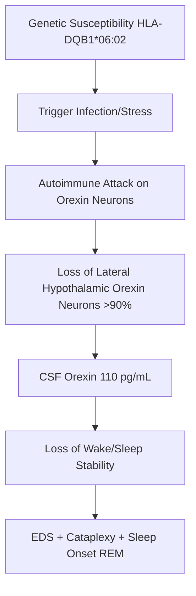
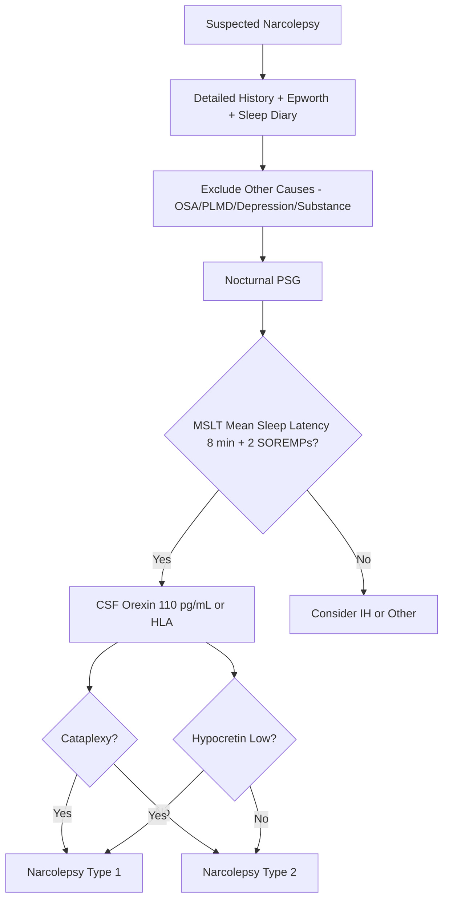
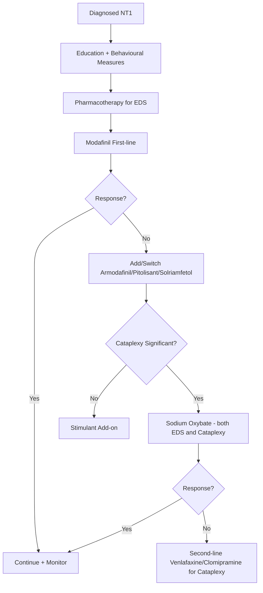

# Narcolepsy Type 1

Related: [[Narcolepsy Type 2]], [[Idiopathic Hypersomnia]], [[Kleine-Levin Syndrome]], [[Obstructive Sleep Apnoea]], [[Cataplexy]], [[Sleep Disorders Hub]]

> [!tip] **Definition (ICSD-3)**
> Excessive daytime sleepiness (EDS) + cataplexy OR CSF orexin ≤110 pg/mL OR MSLT mean sleep latency ≤8 min + ≥2 SOREMPs (Sleep Onset REM Periods).
> Narcolepsy Type 1 = with cataplexy or hypocretin deficiency.

> [!tip] **FCPS/MRCP focus:** Classic tetrad = EDS, cataplexy, hypnagogic hallucinations, sleep paralysis. Diagnosis requires **polysomnography (PSG) + Multiple Sleep Latency Test (MSLT)**. **Modafinil first-line** for EDS; **Sodium oxybate** for cataplexy + EDS.

## Learning Objectives
- [ ] Define narcolepsy Type 1 (with cataplexy)
- [ ] Describe epidemiology, age/sex distribution, HLA associations
- [ ] Explain orexin/hypocretin pathophysiology
- [ ] List clinical features (tetrad, nocturnal sleep disruption)
- [ ] Detail diagnostic criteria (ICSD-3), PSG/MSLT findings
- [ ] Differentiate from narcolepsy Type 2, IH, OSA, epilepsy
- [ ] Manage stepwise: behavioural → modafinil → sodium oxybate → pitolisant
- [ ] Identify DVLA implications, complications, prognosis
- [ ] Recall drug doses, HLA-DQB1*06:02 association

---

## 1. Definition / Epidemiology / Classification

### Definition
- **Narcolepsy Type 1 (NT1):** EDS + cataplexy OR CSF hypocretin-1 (orexin-A) ≤110 pg/mL; requires PSG + MSLT confirmation.
- **Narcolepsy Type 2 (NT2):** EDS WITHOUT cataplexy, normal hypocretin; similar MSLT criteria.

### Epidemiology
- **Prevalence:** 0.025-0.05% (1 in 2,000-3,000)
- **Incidence:** 0.7-1.4 per 100,000/year
- **Age of onset:** Bimodal: peak 15-25y and 35-45y; can occur in children
- **Sex:** M = F (slight M predominance)
- **Geographical:** Less common in Israel; more common in Japan

### Classification (ICSD-3)
| Type | Key Features |
|------|--------------|
| **Narcolepsy Type 1** | EDS + cataplexy OR CSF orexin ≤110 pg/mL |
| **Narcolepsy Type 2** | EDS WITHOUT cataplexy; normal orexin; can progress to NT1 |
| **Secondary narcolepsy** | Due to structural lesion (e.g., hypothalamic stroke, tumour, MS, sarcoidosis) |

---

## 2. Aetiology / Pathophysiology

### Aetiology
- **Genetic:** **HLA-DQB1*06:02** in >95% of NT1 (vs 20-30% general); familial risk ×10-40
- **Autoimmune:** Strong evidence — association with H1N1 vaccination/infection (AS03 adjuvanted Pandemrix), streptococcal infection
- **Environmental:** Trigger in genetically susceptible — infections, head trauma, sleep deprivation
- **Secondary:** Hypothalamic lesions (tumour, MS, sarcoidosis, paraneoplastic — anti-Ma2)

### Pathophysiology

### Molecular / Cellular
- **Orexin (hypocretin) neurons** in lateral hypothalamus — loss in NT1 (post-mortem studies show 90% loss)
- **Orexin** promotes wakefulness (via OX1R/OX2R in tuberomammillary nucleus, locus coeruleus, raphe)
- **Loss →** inability to maintain wakefulness + inappropriate REM intrusion into wakefulness (cataplexy = REM atonia)
- **CSF hypocretin-1 ≤110 pg/mL** = diagnostic biomarker
- **Biomarkers:** CSF orexin, HLA-DQB1*06:02, ↑ IgG anti-tribbles homolog (TRIB2) in some patients

---

## 3. Clinical Features

### Classic Tetrad
| Symptom | Frequency | Description |
|---------|-----------|-------------|
| **Excessive Daytime Sleepiness (EDS)** | 100% | Sleep attacks, naps, automatic behaviour |
| **Cataplexy** | 60-70% | Sudden bilateral loss of muscle tone with preserved consciousness, triggered by emotion |
| **Hypnagogic/Hypnopompic hallucinations** | 50-60% | Vivid dream-like images at sleep onset (hypnagogic) or awakening (hypnopompic) |
| **Sleep paralysis** | 25-50% | Inability to move at sleep onset/wake; frightening but brief |

### History
- **EDS:** Sleep attacks (1-10 min), naps refreshing, automatic behaviours (driving, work, conversation)
- **Cataplexy:** Brief (seconds-minutes), bilateral, partial (face/neck) or complete; triggered by laughter, anger, surprise, exertion; CONSIOUSNESS PRESERVED
- **Nocturnal sleep:** Fragmented, frequent awakenings, vivid dreams, REM behaviour disorder association
- **Weight:** Often ↑ BMI in NT1 (orexin regulates feeding/metabolism)
- **Onset:** Often insidious over months/years; may be precipitated by stress
- **Family history:** 10% first-degree relatives

### Examination
- Generally normal; may have obesity
- **Cataplexy provocation:** Tell a joke; observe for facial sagging, knee buckling, head drop
- **Pupils:** May show REM-like pupils on examination (small, sluggish)
- **Neurological exam normal** — important (no focal signs)

### Specific Features
| Subtype | Description |
|---------|-------------|
| **Classic cataplexy** | Brief (sec-min), emotional trigger, full recovery |
| **Status cataplecticus** | Prolonged cataplexy hours-days (after sudden withdrawal of anti-cataplectic) |
| **Pediatric cataplexy** | May present as prominent facial hypotonia, "cataplectic facies", oromotor dyskinesia |

### Associated Findings
- **Obesity** (BMI ↑ in NT1)
- **Anxiety/depression** (20-40%)
- **OSA coexistence** (10-20%)
- **REM Behaviour Disorder (RBD)** (up to 50%)
- **Periodic Leg Movements** (common)

---

## 4. Diagnostic Approach / Algorithm

### Diagnostic Criteria (ICSD-3)
| Criterion | NT1 | NT2 |
|-----------|-----|-----|
| **EDS** | Required | Required |
| **Cataplexy** | Present OR | Absent |
| **CSF Orexin** | ≤110 pg/mL | >110 pg/mL (or not measured) |
| **MSLT** | ≤8 min latency + ≥2 SOREMPs | ≤8 min latency + ≥2 SOREMPs |
| **PSG** | TST ≥6h; excludes other | Same |

### Severity Assessment
| Tool | Use |
|------|-----|
| **Epworth Sleepiness Scale (ESS)** | ≥11 = excessive; ≥16 = severe |
| **Ullanlinna Narcolepsy Scale** | Symptom severity |
| **Swiss Narcolepsy Scale** | Diagnostic screening |
| **Cataplexy frequency diary** | Response monitoring |
| **Maintenance of Wakefulness Test (MWT)** | Treatment response (4×40 min nap, sleep latency) |

---

## 5. Investigations

### Polysomnography (PSG) - Mandatory
| Parameter | NT1 Finding |
|-----------|-------------|
| **Total Sleep Time** | Often normal or reduced |
| **Sleep efficiency** | Reduced (fragmented) |
| **Sleep latency** | Reduced (short) |
| **REM latency** | Often very short |
| **Periodic limb movements** | Increased |
| **OSA** | Exclude |

### Multiple Sleep Latency Test (MSLT) - Mandatory
| Parameter | NT1 Finding |
|-----------|-------------|
| **Mean Sleep Latency** | ≤8 minutes (often <5 min) |
| **SOREMPs** | ≥2 (often 3-5 of 5 naps) |
| **Number of naps** | 5 (every 2h from wake) |
| **Conditions** | After PSG showing ≥6h sleep, no REM-suppressants |

### Other Investigations
| Investigation | Indication | Finding |
|---------------|------------|---------|
| **CSF hypocretin-1 (orexin-A)** | Atypical/diagnostic uncertainty | ≤110 pg/mL (diagnostic) |
| **HLA-DQB1*06:02** | Supportive but not diagnostic | Positive in >95% NT1 |
| **MRI Brain + hypothalamus** | Suspected secondary narcolepsy | Hypothalamic lesion |
| **Anti-Ma2/Trib2 antibodies** | Paraneoplastic suspicion | Paraneoplastic |

### Laboratory
- TSH, FBC, B12 — exclude medical mimics
- Iron studies — exclude RLS

---

## 6. Differential Diagnosis

| Differential | Distinguishing Features | Key Test |
|--------------|------------------------|----------|
| **Narcolepsy Type 2** | No cataplexy, normal orexin, MSLT criteria met | MSLT, CSF orexin |
| **Idiopathic Hypersomnia** | EDS but NO SOREMPs; sleep inertia; long unrefreshing naps | MSLT (≤2 SOREMPs; sleep latency ≤8 min) |
| **Obstructive Sleep Apnoea** | Snoring, witnessed apnoeas, obesity | PSG (AHI) |
| **Behaviourally-Induced Insufficient Sleep** | Long sleep on weekends, work-day sleep deprivation | Sleep diary, extension study |
| **Depression-related hypersomnia** | Anhedonia, low mood; long but unrefreshing sleep | PHQ-9, MSLT variable |
| **Kleine-Levin Syndrome** | Episodic hypersomnia, hyperphagia, hypersexuality, cognitive disturbance | Clinical, episodic course |
| **Epilepsy (absence/atonic)** | Brief stereotyped episodes, EEG correlates | EEG, video-EEG |
| **Syncope / cataplexy mimic** | Loss of consciousness, prodrome | History, EEG |

---

## 7. Management

### Stepwise Approach

### Lifestyle / Behavioural
- Scheduled daytime naps (2-3 × 15-20 min)
- Consistent sleep schedule
- Avoid shift work, alcohol
- Driver counselling (DVLA)
- Workplace accommodations
- Patient support groups

### Pharmacotherapy - EDS
| Drug | Class | Dose | Notes |
|------|-------|------|-------|
| **Modafinil** | Wake-promoter | 100-400mg/day (split BD) | **First-line**; minimal side effects; CYP3A4 inducer; ↓ OCP efficacy |
| **Armodafinil** | R-enantiomer modafinil | 150-250mg mane | Longer duration; similar profile |
| **Pitolisant** | H3 receptor antagonist (↑ histamine) | 9-36mg mane | Non-controlled; alternative to modafinil |
| **Solriamfetol** | Dopamine/norepinephrine reuptake inhibitor | 75-150mg mane | Newer; not controlled |
| **Sodium oxybate** | GABA-B agonist | 4.5-9g nocte (split) | **Both EDS + cataplexy**; controlled, expensive |
| **Methylphenidate** | Stimulant | 10-60mg/day | 2nd/3rd line; controlled; abuse potential |
| **Dextro-amfetamine** | Stimulant | 5-60mg/day | 3rd line; controlled |

### Pharmacotherapy - Cataplexy
| Drug | Class | Dose | Notes |
|------|-------|------|-------|
| **Sodium oxybate** | GABA-B | 4.5-9g nocte | **Most effective** for cataplexy + EDS |
| **Venlafaxine** | SNRI | 37.5-225mg/day | Effective; quick onset |
| **Fluoxetine** | SSRI | 20-60mg/day | Effective |
| **Clomipramine** | TCA | 25-150mg/day | Older; anticholinergic side effects |
| **Pitolisant** | H3 antagonist | 9-36mg/day | Useful for both EDS and cataplexy |
| **Atomoxetine** | NRI | 40-100mg/day | Adjunctive |

> **EVIDENCE:** Sodium oxybate is the **most effective** agent for cataplexy + EDS in NT1 (randomised trials), but limited by cost, abuse potential, respiratory depression risk.

---

## 8. Drug Interactions / Cautions

| Drug | Interaction / Caution | Management |
|------|----------------------|------------|
| **Modafinil** | CYP3A4 inducer (↓ OCP, cyclosporine, statins); ↓ warfarin | Counsel; alternative contraception |
| **Sodium oxybate** | CNS depressants (alcohol, opioids, BZD) — respiratory depression | Strict avoidance; pharmacy programme |
| **Venlafaxine** | Serotonin syndrome with MAOI/SSRI | Caution; washout |
| **Stimulants** | Hypertension, arrhythmias, abuse | Monitor BP, ECG; controlled |
| **Sodium oxybate** | Sodium-restricted diet (each dose ~0.5g Na) | Caution in CHF, HTN, renal failure |
| **Pitolisant** | QT prolongation | Avoid in prolonged QT, severe CVD |

---

## 9. Procedures

### Polysomnography + MSLT Protocol
- **PSG night:** Confirm ≥6h sleep; exclude OSA, PLMD; check REM latency
- **MSLT next day:** 5 nap opportunities (every 2h from wake); record sleep latency, SOREMPs
- **Medication washout:** Stop stimulants 1-2 weeks prior; stop REM-suppressants (SSRIs, TCAs) 2-4 weeks prior (if clinically safe)
- **Interpretation:** MSL ≤8 min + ≥2 SOREMPs = diagnostic of narcolepsy

### CSF Hypocretin
- Lumbar puncture; CSF hypocretin-1 measured by radioimmunoassay
- ≤110 pg/mL = diagnostic (95% NT1)

---

## 10. Complications

| Complication | Frequency | Prevention/Management |
|--------------|-----------|------------------------|
| **Road traffic accidents** | ↑ Risk | DVLA notification; avoid driving if uncontrolled |
| **Workplace accidents** | ↑ Risk | Scheduled naps, stimulant timing |
| **Obesity / metabolic** | 30-40% | Diet, exercise; some weight gain with sodium oxybate |
| **Depression / anxiety** | 20-40% | Screen, treat; consider modafinil benefit |
| **Social isolation** | Common | Support groups, education |
| **Cataplexy-related injury** | Falls | Precautions; treat cataplexy |
| **REM Behaviour Disorder** | Up to 50% | Clonazepam, melatonin |

---

## 11. Red Flags / Emergencies

| Red Flag | Action |
|----------|--------|
| **Status cataplecticus** | Cataplexy for hours/days after abrupt withdrawal of TCAs/SNRIs; resume medication |
| **Driving with EDS** | DVLA notification; suspend driving |
| **Suicidal ideation** | Urgent psych assessment |
| **New neurological signs** | Exclude secondary narcolepsy (MRI hypothalamic lesion) |
| **Sudden cataplexy in childhood** | Consider Niemann-Pick type C |

---

## 12. Prognosis

- **Chronic lifelong condition** — no cure
- **Stable course** — symptoms often stable after 1-2 years of diagnosis
- **Cataplexy may improve** with age in some
- **Lifelong medication** required in most
- **Mortality:** Slight ↑ due to accidents; not ↑ if well-managed
- **Quality of life:** Significantly impacted if untreated; improves with treatment
- **NT2 may evolve to NT1** in 5-10%

---

## 13. Topic Correlation

| Related Topic | Link | Key Overlap |
|---------------|------|-------------|
| Narcolepsy Type 2 | [[Narcolepsy Type 2]] | No cataplexy, normal orexin |
| Idiopathic Hypersomnia | [[Idiopathic Hypersomnia]] | EDS differential; no SOREMPs |
| OSA | [[Obstructive Sleep Apnoea]] | Common comorbidity |
| Kleine-Levin | [[Kleine-Levin Syndrome]] | Episodic hypersomnia |
| Epilepsy | See Epilepsy | Cataplexy vs atonic seizures |
| Depression | See Psychiatry | Hypersomnia differential |

---

## 14. Special Situations

| Situation | Consideration |
|-----------|---------------|
| **Pregnancy** | Modafinil limited data; Sodium oxybate contraindicated; consider behavioural + methylphenidate; Cataplexy may improve in pregnancy |
| **Paediatric** | Sodium oxybate licensed ≥7y; Modafinil off-label; Pitolisant ≥6y (EU); consider school accommodations; HLA-DQB1*06:02 testing |
| **Elderly** | Lower doses; avoid stimulants; cardiac monitoring; modafinil often preferred |
| **Renal impairment** | Modafinil reduce dose; sodium oxybate caution |
| **Hepatic impairment** | Modafinil reduce dose; sodium oxybate avoid in severe |
| **DVLA** | **Must notify**; suspended until controlled on treatment (≥3 months symptom-free, ESS <10); Group 2 stricter |
| **Occupational** | HGV/PSV/pilots/train drivers: specialist review; modafinil controlled |
| **Drug interactions** | Modafinil ↓ OCP; counsel non-hormonal contraception |

---

## FCPS/MRCP High-Yield Summary

| Category | Key Points |
|----------|------------|
| **Definition** | NT1: EDS + cataplexy OR CSF orexin ≤110 pg/mL |
| **Epidemiology** | 0.025-0.05%; bimodal 15-25y; HLA-DQB1*06:02 in >95% |
| **Pathophysiology** | Autoimmune loss of hypothalamic orexin neurons (>90%) |
| **Clinical** | Tetrad: EDS, cataplexy, hypnagogic HH, sleep paralysis |
| **Diagnosis** | PSG + MSLT (MSL ≤8 min + ≥2 SOREMPs); CSF orexin |
| **Investigations** | PSG + MSLT mandatory; HLA supportive; MRI for secondary |
| **Management** | **Modafinil first-line EDS**; **Sodium oxybate for cataplexy + EDS**; Behavioural measures |
| **Complications** | RTAs, falls, obesity, depression |
| **Prognosis** | Lifelong; stable course; ↓ QoL if untreated |
| **Viva Pearls** | Tetrad; Modafinil ↓ OCP; Sodium oxybate only effective for both; Cataplexy = preserved consciousness; HLA-DQB1*06:02 |
| **Drug Doses** | Modafinil 100-400mg; Sodium oxybate 4.5-9g nocte split; Venlafaxine 37.5-225mg |
| **Scoring** | ESS ≥11 = EDS; MSLT MSL ≤8 min + ≥2 SOREMPs = narcolepsy |
| **Genetics** | HLA-DQB1*06:02 (>95%); familial ×10-40 risk |
| **Imaging Signs** | Normal MRI in idiopathic; hypothalamic lesion = secondary |

---

## Viva Questions (PACES/FCPS Style)

1. **Q:** What is the classic tetrad of narcolepsy?
   **A:** Excessive daytime sleepiness, cataplexy, hypnagogic hallucinations, sleep paralysis.
2. **Q:** Define cataplexy.
   **A:** Sudden bilateral loss of muscle tone triggered by emotion (laughter, anger), with preserved consciousness, lasting seconds to minutes.
3. **Q:** Pathophysiology of narcolepsy Type 1?
   **A:** Autoimmune destruction of orexin (hypocretin) neurons in lateral hypothalamus (>90% loss) → ↓ CSF hypocretin-1 ≤110 pg/mL.
4. **Q:** Diagnostic criteria for narcolepsy Type 1?
   **A:** EDS + cataplexy OR MSLT (MSL ≤8 min + ≥2 SOREMPs) + CSF orexin ≤110 pg/mL.
5. **Q:** HLA association in narcolepsy?
   **A:** HLA-DQB1*06:02 in >95% of NT1.
6. **Q:** What is SOREMP?
   **A:** Sleep-Onset REM Period — REM within 15 min of sleep onset on MSLT.
7. **Q:** First-line treatment for EDS in narcolepsy?
   **A:** Modafinil 100-400mg daily.
8. **Q:** Why counsel patients about modafinil and OCP?
   **A:** Modafinil is a CYP3A4 inducer → ↓ OCP efficacy → recommend non-hormonal contraception or higher dose.
9. **Q:** Most effective treatment for both EDS and cataplexy?
   **A:** Sodium oxybate (gamma-hydroxybutyrate, GHB) — GABA-B agonist; expensive, controlled.
10. **Q:** What is status cataplecticus?
    **A:** Prolonged cataplexy lasting hours-days, typically after abrupt withdrawal of anti-cataplectic medication (TCAs, SNRIs).
11. **Q:** DVLA rules for narcolepsy?
    **A:** Must notify; suspend driving until controlled (≥3 months symptoms stable on treatment, ESS <10); Group 2 (HGV) stricter.
12. **Q:** Differential of cataplexy?
    **A:** Atonic epilepsy, syncope, drop attacks, conversion disorder, basilar migraine, periodic paralysis.

---

## Common Confusions / Exam Traps

| Confusion | Clarification |
|-----------|---------------|
| Cataplexy = loss of consciousness | NO — preserved consciousness |
| Cataplexy = epilepsy | Not a seizure; no post-ictal confusion |
| Modafinil = amfetamine | No — wake-promoter with different mechanism |
| Sodium oxybate = opioid | NO — GABA-B agonist; GHB derivative |
| Narcolepsy = insomnia | EDS not insomnia, but fragmented nocturnal sleep common |
| NT2 = early NT1 | Can evolve, but distinct diagnostic entity |
| All narcoleptics have cataplexy | NT1 yes; NT2 no |

---

## Mnemonics
1. **CHIEF** — **C**ataplexy, **H**allucinations, **I**ntrusion of REM, **E**xcessive daytime sleepiness, **F**ragmented sleep
2. **OREXIN** — **O**rexin loss in lateral hypothalamus (autoimmune)
3. **MSLT Criteria** — **M**ean sleep **S**leep latency **L**ess than 8 min + **T**wo SOREMPs (Mnemonic: 8 and 2)
4. **Modafinil Cautions** — ↓ OCP, ↓ cyclosporine, ↓ warfarin (CYP3A4 inducer)
5. **Cataplexy triggers** — Laughter, Anger, Surprise, Pride (emotion with positive valence)

---

## MCQs (10)

1. **Q:** Which HLA allele is strongly associated with narcolepsy Type 1?
   A. HLA-B27 B. HLA-DRB1 C. HLA-DQB1*06:02 D. HLA-A3
   **Answer: C** — HLA-DQB1*06:02 in >95% of NT1.
2. **Q:** CSF hypocretin-1 level diagnostic of NT1?
   A. ≤200 pg/mL B. ≤110 pg/mL C. ≤50 pg/mL D. ≤10 pg/mL
   **Answer: B** — ≤110 pg/mL (or 1/3 of normal control) = diagnostic.
3. **Q:** MSLT criteria for narcolepsy?
   A. MSL ≤10 min + 2 SOREMPs B. MSL ≤8 min + 2 SOREMPs C. MSL ≤5 min + 1 SOREMP D. MSL ≤15 min + 3 SOREMPs
   **Answer: B** — Mean Sleep Latency ≤8 min + ≥2 SOREMPs.
4. **Q:** Which drug is FIRST-LINE for EDS in narcolepsy?
   A. Methylphenidate B. Modafinil C. Sodium oxybate D. Clomipramine
   **Answer: B** — Modafinil is first-line for EDS.
5. **Q:** Cataplexy is characterised by:
   A. Loss of consciousness B. Bilateral muscle atonia with preserved consciousness C. Focal seizures D. Myoclonic jerks
   **Answer: B** — Conscious bilateral atonia, often emotionally triggered.
6. **Q:** Sodium oxybate mechanism?
   A. GABA-A agonist B. GABA-B agonist C. Dopamine antagonist D. Orexin antagonist
   **Answer: B** — Sodium oxybate (GHB) acts via GABA-B receptors.
7. **Q:** Modafinil interaction with OCP?
   A. Increases OCP levels B. Decreases OCP efficacy (CYP3A4 inducer) C. No interaction D. Causes OCP toxicity
   **Answer: B** — Modafinil induces CYP3A4 → ↓ OCP; counsel non-hormonal contraception.
8. **Q:** SOREMP = ?
   A. Slow Oscillation Rhythmic Eye Movement Pattern B. Sleep-Onset REM Period C. Sequential Onset Rapid Eye Movement Period D. Sustained Onset REM
   **Answer: B** — Sleep-Onset REM Period (REM within 15 min of sleep).
9. **Q:** NT1 vs NT2 — main distinguishing feature?
   A. EDS severity B. Cataplexy OR low CSF orexin C. Age of onset D. Response to modafinil
   **Answer: B** — NT1 has cataplexy OR low CSF orexin; NT2 has neither.
10. **Q:** Which finding supports secondary narcolepsy?
    A. HLA-DQB1*06:02 B. Hypothalamic lesion on MRI C. Cataplexy D. SOREMPs on MSLT
    **Answer: B** — Hypothalamic lesion (tumour, MS, sarcoidosis) suggests secondary.

---

## SBAs (10)

1. **Scenario:** 22-year-old student with EDS and episodes of facial sagging/head drop when laughing. ESS 18. Sleep diary shows fragmented sleep. What is the most likely diagnosis?
   A. Narcolepsy Type 2 B. Narcolepsy Type 1 C. Idiopathic hypersomnia D. OSA
   **Answer: B** — EDS + cataplexy (head drop when laughing) = NT1.
2. **Scenario:** Patient with suspected narcolepsy on SSRIs. PSG shows short sleep latency and 3 SOREMPs on MSLT. Does this confirm narcolepsy?
   A. Yes, regardless of medications B. No, REM-suppressants may suppress SOREMPs C. Only if cataplexy present D. Repeat PSG only
   **Answer: B** — SSRIs suppress REM; may reduce SOREMPs. Consider washout (2-4 weeks) if safe.
3. **Scenario:** NT1 patient on modafinil 400mg. Still sleepy (ESS 16). Adding sodium oxybate. Which side-effect must be monitored?
   A. Hypertension B. Respiratory depression (CNS depressants) C. Diabetes D. Renal failure
   **Answer: B** — Sodium oxybate + other CNS depressants = respiratory depression risk.
4. **Scenario:** 30-year-old woman with NT1 planning pregnancy. On sodium oxybate. What is the recommendation?
   A. Continue sodium oxybate B. Switch to modafinil C. Discontinue sodium oxybate; behavioural + modafinil if needed D. Increase sodium oxybate
   **Answer: C** — Sodium oxybate contraindicated in pregnancy; switch to modafinil (limited data) + behavioural.
5. **Scenario:** NT1 patient on venlafaxine for cataplexy. Sudden discontinuation. Develops prolonged severe cataplexy for 24h. What is this?
   A. Status cataplecticus B. Status epilepticus C. Conversion disorder D. Stroke
   **Answer: A** — Status cataplecticus from sudden TCA/SNRI withdrawal.
6. **Scenario:** 25-year-old with NT1, on modafinil, ESS 12, cataplexy once weekly. Wants to drive. What is required?
   A. Cannot drive B. Can drive if symptoms controlled ≥3 months, ESS <10 C. Only with restricted license D. Need 1 year symptom-free
   **Answer: B** — DVLA: suspended until controlled ≥3 months, ESS <10, on stable treatment.
7. **Scenario:** Child 8 years with EDS and facial hypotonia during laughter. Diagnosed NT1. First-line pharmacological option?
   A. Modafinil B. Pitolisant C. Sodium oxybate D. Methylphenidate
   **Answer: C** — Sodium oxybate is licensed ≥7y in EU/US for paediatric NT1; Pitolisant ≥6y in EU.
8. **Scenario:** NT1 patient on modafinil started OCP. Risk?
   A. Thrombosis B. Reduced OCP efficacy (modafinil CYP3A4 inducer) C. Cataplexy improvement D. No interaction
   **Answer: B** — Modafinil ↓ OCP → recommend non-hormonal or higher dose.
9. **Scenario:** 18-year-old with EDS and obesity (BMI 35). HLA-DQB1*06:02 positive. MSLT shows MSL 3 min, 4 SOREMPs. CSF orexin pending. Diagnosis?
   A. NT2 B. NT1 (clinical criteria sufficient) C. IH D. Behaviourally-induced EDS
   **Answer: B** — HLA-DQB1*06:02 + MSLT criteria = high probability NT1; CSF orexin confirms.
10. **Scenario:** Narcolepsy patient developed cataplexy for the first time 3 years after NT2 diagnosis. What does this suggest?
    A. Disease progression to NT1 B. Medication side-effect C. New diagnosis D. Rule out new lesion
    **Answer: A** — NT2 can evolve to NT1 in 5-10% of cases; cataplexy development = reclassify as NT1.

---

## Flashcards

- **Q:** Narcolepsy Type 1 diagnostic criteria?
  **A:** EDS + cataplexy OR CSF orexin ≤110 pg/mL + MSLT (MSL ≤8 min + ≥2 SOREMPs)
- **Q:** HLA association in NT1?
  **A:** HLA-DQB1*06:02 (>95%)
- **Q:** First-line for EDS?
  **A:** Modafinil 100-400mg
- **Q:** Most effective agent for cataplexy + EDS?
  **A:** Sodium oxybate 4.5-9g nocte
- **Q:** Modafinil interaction?
  **A:** CYP3A4 inducer → ↓ OCP, ↓ cyclosporine, ↓ warfarin
- **Q:** Status cataplecticus cause?
  **A:** Abrupt withdrawal of anti-cataplectics (TCA/SNRI)
- **Q:** SOREMP definition?
  **A:** Sleep-Onset REM Period (REM within 15 min of sleep)
- **Q:** DVLA rules for narcolepsy?
  **A:** Notify; suspend until ≥3 months stable, ESS <10
- **Q:** Pathophysiology of NT1?
  **A:** Autoimmune destruction of orexin neurons in lateral hypothalamus
- **Q:** Classic tetrad of narcolepsy?
  **A:** EDS, Cataplexy, Hypnagogic hallucinations, Sleep paralysis

---

## Answer Key

### MCQs
1. C (HLA-DQB1*06:02) 2. B (≤110 pg/mL) 3. B (MSL ≤8 + 2 SOREMPs) 4. B (Modafinil) 5. B (Conscious atonia) 6. B (GABA-B) 7. B (↓ OCP) 8. B (Sleep-Onset REM Period) 9. B (Cataplexy/orexin) 10. B (Hypothalamic lesion)

### SBAs
1. B (NT1) 2. B (Washout) 3. B (Respiratory depression) 4. C (Discontinue oxybate) 5. A (Status cataplecticus) 6. B (≥3 months) 7. C (Sodium oxybate ≥7y) 8. B (↓ OCP) 9. B (NT1 sufficient) 10. A (Progression to NT1)

---

## Summary

Narcolepsy Type 1 is characterised by **excessive daytime sleepiness + cataplexy** (or low CSF hypocretin-1), caused by **autoimmune destruction of orexin neurons** in the lateral hypothalamus (>90% loss). Strong HLA-DQB1*06:02 association (>95%). Classic **tetrad**: EDS, cataplexy, hypnagogic hallucinations, sleep paralysis. **Diagnosis**: PSG + MSLT (mean sleep latency ≤8 min + ≥2 SOREMPs); CSF hypocretin ≤110 pg/mL confirms. **Treatment**: scheduled naps + behavioural measures; **modafinil first-line for EDS**; **sodium oxybate most effective for cataplexy + EDS** (controlled substance); alternative agents include pitolisant, solriamfetol, venlafaxine. **DVLA notification required**. Modafinil induces CYP3A4 → reduces OCP efficacy. Lifelong condition with stable course; prognosis depends on treatment adherence and accident prevention.

## PasTest Scenario SBAs (Clinical Vignettes)

> **Auto-generated PasTest/Mediscope-style scenario SBAs** grounded in the authored source. Each scenario tests a real clinical fact (triad, specific sign, contraindication, trial, first-line Rx) extracted from the topic. *Source: Ch 27: Neurology & Stroke — Narcolepsy Type 1*

**Q1.** Which of the following features is most specific or characteristic of Narcolepsy Type 1?

  - **A.** CSF hypocretin-1
  - **B.** A feature common to many acute inflammatory conditions
  - **C.** A non-specific sign that does not localise the diagnosis
  - **D.** An investigation finding rather than a clinical feature

  > **Answer: A** — CSF hypocretin-1
  >
  > *Source:* Investigations
| Investigation | Indication | Finding |
|---------------|------------|---------|
| **CSF hypocretin-1 (orexin-A)** | Atypical/diagnostic uncertainty | ≤110 pg/mL (diagnostic) |
| **HLA

**Q2.** What is the most appropriate first-line therapy for Narcolepsy Type 1?

  - **A.** Modafinil
  - **B.** An advanced/surgical therapy reserved for refractory disease
  - **C.** Symptomatic treatment only, no disease-modifying therapy
  - **D.** Empiric broad-spectrum therapy without specific indication

  > **Answer: A** — Modafinil
  >
  > *Source:* **Modafinil**   Wake-promoter   100-400mg/day (split BD)   **First-line**; minimal side effects; CYP3A4 inducer; ↓ OCP efficacy

