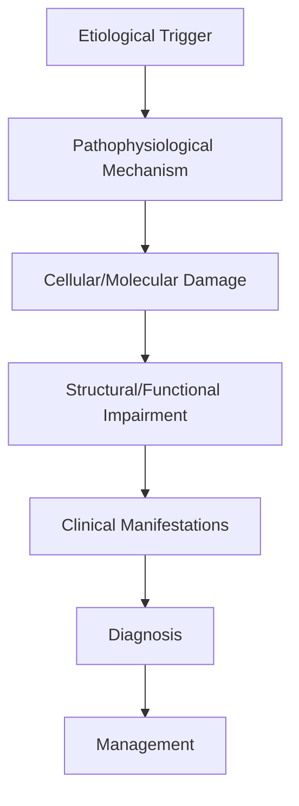
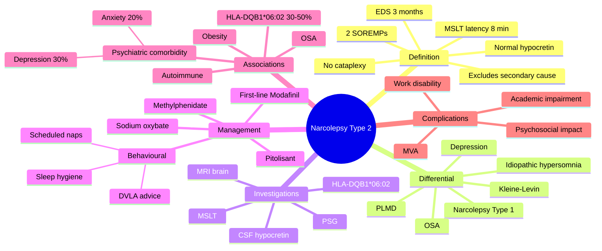

# Narcolepsy Type 2

> [!tip] **High-Yield Definition**
> Comprehensive clinical note for Narcolepsy Type 2 covering definition, epidemiology, aetiology, pathophysiology, clinical features, investigations, differential diagnosis, management, drug interactions, procedures, complications, red flags, prognosis, topic correlation, and special situations for FCPS/MRCP examination preparation based on Davidson 24th Edition Chapter 25: Neurology.

---

## 1. Definition / Epidemiology / Classification

### Definition
Narcolepsy Type 2 is a neurological disorder within the 16 sleep disorders category. It is characterised by specific clinical, pathological, radiological, and laboratory features that allow differentiation from related conditions.

### Epidemiology
- **Incidence/Prevalence:** Variable depending on the specific condition.
- **Age:** Adult onset is most common, but paediatric and elderly presentations occur.
- **Sex:** Variable depending on the condition.
- **Geography:** Worldwide distribution, with higher prevalence in certain regions.
- **Risk Factors:** Genetic predisposition, environmental factors, comorbidities, family history.

### Classification
| Subtype | Key Features | Prognosis |
|---------|-------------|-----------|
| Mild/early | Subtle symptoms, preserved function | Best |
| Moderate | Clear symptoms, functional impairment | Variable |
| Severe | Significant disability, complications | Worst |

---

## 2. Aetiology / Pathophysiology

### Aetiology
- **Primary (idiopathic):** Most cases have no identifiable cause.
- **Genetic:** May be inherited (AD, AR, X-linked, mitochondrial, sporadic).
- **Autoimmune:** Autoantibodies, immune-mediated inflammation.
- **Infectious:** Viral, bacterial, fungal, parasitic.
- **Metabolic:** Electrolyte, endocrine, hepatic, renal, nutritional.
- **Toxic:** Drugs, alcohol, heavy metals, environmental toxins.
- **Vascular:** Ischaemia, haemorrhage, vasculitis.
- **Neoplastic:** Primary, secondary, paraneoplastic.
- **Traumatic:** Acute, chronic, repetitive.
- **Degenerative:** Neurodegeneration, protein misfolding.

### Pathophysiology


---

## 3. Clinical Features

### History
- **Onset/Duration:** Acute, subacute, or chronic.
- **Progression:** Static, progressive, relapsing-remitting, stepwise.
- **Key symptoms:** Specific to the condition.
- **Triggers:** Stress, infection, trauma, drugs, hormonal, environmental.
- **Systemic symptoms:** Constitutional features.
- **Drug/Family/Social history:** Relevant exposures, comorbidities.

### Examination
| Domain | Key Findings | Localisation Value |
|--------|-------------|-------------------|
| Higher function | Cognitive, behavioural | Cortical, subcortical, limbic |
| Cranial nerves | Pupils, eye movements, facial, bulbar | Brainstem, cranial nerve, NMJ |
| Motor | Weakness, tone, reflexes | UMN, LMN, NMJ, muscle |
| Sensory | All modalities, pattern | Peripheral, spinal, brainstem |
| Coordination | Ataxia, nystagmus, dysmetria | Cerebellar, sensory, vestibular |
| Gait | Spastic, ataxic, parkinsonian | Multiple |
| Autonomic | Orthostatic, sweating, GI, bladder | Autonomic, peripheral, central |

### Specific Clinical Features
The clinical features are determined by the underlying aetiology, location of pathology, and rate of progression. Patients typically present with a constellation of symptoms and signs that allow clinical localisation and subsequent targeted investigation.

---

## 4. Diagnostic Approach / Algorithm

```mermaid
flowchart TD
    A[Clinical Presentation] --> B[Anatomical Localisation]
    B --> C[Pathophysiological Category]
    C --> D[Formulate Differential]
    D --> E[Targeted Investigations]
    E --> F[Confirm Diagnosis]
    F --> G[Assess Severity/Prognosis]
    G --> H[Initiate Management]
    H --> I[Monitor Response]
    I --> J{Response?}
    J --> YES1 [Good - Continue]
    J --> NO1 [Poor - Escalate]
    YES1 --> K[Monitor]
    NO1 --> H
```

---

## 5. Investigations

### First-Line Investigations
- **Blood tests:** FBC, U&Es, LFTs, glucose, calcium, magnesium, ESR, CRP, autoimmune, infection.
- **Imaging:** CT/MRI brain/spine (essential for most neurological conditions).
- **Neurophysiology:** EEG, nerve conduction, EMG, evoked potentials.
- **CSF:** Cell count, protein, glucose, OCBs, PCR, culture.

### Second-Line Investigations
- **Genetic testing:** Gene panels, WES, WGS.
- **Antibody testing:** Antineuronal, autoimmune, paraneoplastic.
- **Biopsy:** Nerve, muscle, brain, skin.
- **Advanced imaging:** PET-CT, MR spectroscopy, fMRI.

### Specialised Investigations
- **Biomarkers:** Neurofilament light chain, tau, beta-amyloid, 14-3-3, RT-QuIC.
- **Autonomic testing:** Head-up tilt, sudomotor, QSART.
- **Neuropsychology:** Cognitive testing, behavioural assessment.
- **Genetic counselling:** Family screening, predictive testing.

---

## 6. Differential Diagnosis

| Differential | Distinguishing Features | Key Test |
|--------------|------------------------|----------|
| Vascular | Sudden onset, focal, vascular risk factors | MRI/CT, vessel imaging |
| Inflammatory | Subacute, multifocal, systemic | MRI, CSF, antibodies |
| Infectious | Fever, systemic, exposure | Bloods, CSF, imaging |
| Neoplastic | Progressive, mass effect | MRI, biopsy |
| Degenerative | Progressive, symmetric, hereditary | MRI, genetic |
| Toxic/Metabolic | Drug history, systemic, reversible | Bloods, toxicology |
| Autoimmune | Multifocal, antibodies, immunotherapy response | Antibodies, MRI, CSF |
| Functional | Inconsistent, distractible | Clinical, video, biomarkers |

---

## 7. Management

### Acute Management
- **Stabilisation:** ABCDE approach, emergency resuscitation.
- **Specific treatment:** Disease-specific interventions.
- **Symptomatic relief:** Pain, seizures, spasticity, autonomic dysfunction.
- **Prevention of complications:** DVT, pressure sores, infection.

### Disease-Modifying Treatment
- **Pharmacological:** First-line, second-line, escalation, maintenance.
- **Procedural:** Surgery, biopsy, drainage, ablation, stimulation.
- **Immunotherapy:** Steroids, IVIG, plasma exchange, immunosuppressants, biologics.
- **Rehabilitation:** Physiotherapy, OT, speech therapy.

### Long-Term Management
- **Monitoring:** Clinical, imaging, biomarkers, side effects.
- **Prevention:** Vaccinations, prophylaxis, lifestyle modification.
- **Supportive care:** Multidisciplinary team, social work, psychological support.
- **Palliative care:** Advanced care planning, end-of-life care, hospice.

---

## 8. Drug Interactions / Contraindications / Comorbidity Cautions

| Drug Class | Interaction / Caution | Management |
|------------|----------------------|------------|
| Antiseizure medications | Enzyme induction, teratogenicity | Monitor, supplement, switch |
| Immunosuppressants | Infection, malignancy, teratogenicity | Monitor, prophylaxis |
| Anticoagulants | Bleeding risk, drug interactions | Monitor INR, avoid combinations |
| Antihypertensives | Hypotension, falls | Monitor BP, adjust dose |
| Antibiotics | Nephrotoxicity, ototoxicity | Monitor renal |
| Antivirals | Nephrotoxicity, neuropsychiatric | Monitor renal, dose adjust |
| Steroids | DM, HTN, osteoporosis, infection | Monitor, prophylaxis, taper |
| Biologics | Infusion reactions, infection | Monitor, prophylaxis |

---

## 9. Procedures

### Common Procedures
- **Lumbar puncture:** Diagnostic, therapeutic (IIH, NPH). Contraindications: raised ICP, mass lesion, coagulopathy.
- **Nerve conduction studies/EMG:** Diagnostic, prognosis. Minor discomfort.
- **EEG:** Diagnostic, monitoring. No significant complications.
- **MRI brain/spine:** Diagnostic, monitoring. Contraindications: pacemaker, metallic implants.
- **CT head:** Emergency, rapid. Radiation exposure, contrast reactions.
- **Biopsy:** Stereotactic, open. Indications: diagnosis, molecular profiling.

---

## 10. Complications

| Complication | Frequency | Prevention | Management |
|--------------|-----------|------------|------------|
| Infection | Common | Hygiene, prophylaxis, vaccination | Antibiotics, antifungals |
| Thrombosis | Common | Prophylaxis, mobility | Anticoagulation |
| Pressure sores | Common | Positioning, nutrition | Wound care, surgery |
| Spasticity | Common | Positioning, stretching | Baclofen, BoNT |
| Contractures | Common | Passive movements, splints | Physiotherapy, surgery |
| Aspiration | Common | Swallow assessment | NGT, PEG, thickeners |
| Falls | Common | Environment, mobility | Walking aids |
| Fractures | Common | Bone health, prevention | Vitamin D, bisphosphonate |
| Depression | Common | Screening, support | Antidepressants, CBT |
| Cognitive decline | Variable | Monitoring, training | Rehabilitation |
| Autonomic dysfunction | Variable | Monitoring, hydration | Midodrine, fludrocortisone |
| Respiratory failure | Variable | Monitoring, supportive | Ventilation, NIV |
| Death | Variable | Monitoring, palliative | End-of-life care |

---

## 11. Red Flags / Emergencies

### Emergency Presentations
- **Rapid neurological deterioration:** New focal deficit, decreased consciousness, seizures.
- **Status epilepticus:** Continuous seizures >5 min.
- **Raised ICP:** Headache, vomiting, papilloedema, altered consciousness.
- **Respiratory failure:** Hypoxia, hypercapnia, ventilatory failure.
- **Cardiac arrest:** Arrhythmia, MI, pulmonary embolism.
- **Infection:** Sepsis, meningitis, abscess, encephalitis.
- **Drug toxicity:** Overdose, side effects, interactions.
- **Haemorrhage:** Intracranial, systemic, coagulopathy.

---

## 12. Prognosis

### Natural History
- **Acute:** May resolve with treatment, may progress, may be fatal.
- **Subacute:** Variable, depends on cause and treatment.
- **Chronic:** Often progressive, may be stable, may have relapses.
- **Recovery:** Variable, may be complete, partial, or none.

### Prognostic Factors
- **Favourable:** Young age, early treatment, mild disease, reversible cause, good premorbid function, family support.
- **Unfavourable:** Older age, delayed treatment, severe disease, irreversible cause, poor premorbid function, comorbidities.

---

## 13. Topic Correlation

| Related Topic | Link | Key Overlap |
|---------------|------|-------------|
| Davidson 24th Ed Chapter 25 | [[Davidson Chapter 25 - Neurology Hierarchy]] | Comprehensive neurology |
| Neurology MOC | [[Neurology MOC]] | All neurology topics |
| Drug Reference | [[../00_Index/Neurology Drug Reference]] | Medications |
| Local Hub | [[../16_Sleep_Disorders/Hub]] | Section-specific |
| Clinical Examination | [[../01_Fundamentals_Examination/Neurological History Taking]] | Clinical approach |
| Investigation | [[../01_Fundamentals_Examination/Neuroimaging (CT-MRI) Principles]] | Imaging |

---

## 14. Special Situations

| Situation | Consideration |
|-----------|---------------|
| **Pregnancy** | Pre-conception counselling, teratogenicity, drug safety, monitoring, delivery planning, breastfeeding. |
| **Lactation** | Drug safety, breastfeeding, monitoring, support. |
| **Paediatric** | Developmental considerations, drug dosing, school, family, vaccination, growth, puberty. |
| **Elderly / Frail** | Comorbidities, polypharmacy, falls, bone health, cognition, social, end-of-life. |
| **Renal impairment** | Drug dose adjustment, monitoring, dialysis, transplant. |
| **Hepatic impairment** | Drug dose adjustment, monitoring, transplant. |
| **Immunocompromised** | Infection prophylaxis, vaccination, drug interactions, malignancy screening. |
| **Perioperative** | Drug management, anaesthesia planning, VTE prophylaxis, infection prevention, monitoring. |
| **Driving / DVLA** | Fitness to drive, restrictions, notification, reassessment. |
| **Occupational** | Fitness for work, adaptations, rehabilitation, disability, return to work. |

---

## FCPS/MRCP High-Yield Summary

| Category | Key Points |
|----------|------------|
| **Definition** | Comprehensive definition with key diagnostic criteria |
| **Epidemiology** | Incidence, prevalence, age, sex, geography, risk factors |
| **Aetiology** | Primary causes, secondary causes, genetic, environmental |
| **Pathophysiology** | Mechanism of disease, cellular/molecular basis |
| **Clinical Features** | History, examination, key findings, variants |
| **Diagnosis** | Diagnostic criteria, classification, severity |
| **Investigations** | First-line, second-line, specialised, biomarkers |
| **Differential Diagnosis** | Key differentials, distinguishing features, tests |
| **Management** | Acute, disease-modifying, symptomatic, supportive |
| **Complications** | Common, serious, prevention, management |
| **Prognosis** | Natural history, prognostic factors, outcomes |
| **Viva Pearls** | Key examination points |
| **Drug Doses** | First-line, second-line, emergency |
| **Scoring Systems** | Specific scores used in management |
| **Genetics** | Inheritance, genes, mutations, family screening |
| **Imaging Signs** | Characteristic findings, differential |

---

## Viva Questions (PACES/FCPS Style)

1. **Q:** Define and classify its variants.
   **A:** Comprehensive definition with classification of subtypes based on aetiology, severity, and clinical features.

2. **Q:** What are the key clinical features?
   **A:** Specific symptoms and signs including onset, progression, key features, and associated findings.

3. **Q:** What is the first-line treatment?
   **A:** First-line pharmacological and non-pharmacological management based on current evidence.

4. **Q:** What are the red flags requiring urgent referral?
   **A:** Specific emergency presentations and complications requiring immediate intervention.

5. **Q:** What is the prognosis?
   **A:** Natural history, prognostic factors, and long-term outcomes.

6. **Q:** How do you differentiate from key differentials?
   **A:** Clinical features, investigations, and response to treatment that distinguish from alternative diagnoses.

7. **Q:** What investigations are most useful?
   **A:** First-line and second-line investigations including imaging, neurophysiology, CSF, and biomarkers.

8. **Q:** Describe the stepwise management approach.
   **A:** Stepwise escalation from first-line to second-line to third-line therapy with monitoring.

9. **Q:** What are the emergency presentations?
   **A:** Specific emergency scenarios and immediate management priorities.

10. **Q:** How does management change in pregnancy/paediatrics/elderly?
    **A:** Special considerations for each population including drug safety, monitoring, and support.

---

## Common Confusions / Exam Traps

| Confusion | Clarification |
|-----------|---------------|
| Similar presentation but different cause | Differentiate by history, examination, investigations |
| Treatment response vs natural history | Assess with objective measures, biomarkers |
| Drug interactions | Check each drug, monitor, adjust doses |
| Disease progression vs treatment failure | Monitor response, escalate appropriately |
| Functional vs organic | Inconsistent, distractible, disability greater than impairment |
| Acute vs chronic | Time course, progression, reversibility |
| Primary vs secondary | Underlying cause, contributing factors |
| Side effects vs symptoms | Temporal relationship, dose relationship |

---

## Mnemonics

1. **TWO Without One** — Narcolepsy Type 2 vs Type 1:
   - **TWO** = **≥2 SOREMPs** on MSLT
   - **With**out cataplexy (the discriminator from NT1)
   - **Without** hypocretin deficiency (CSF orexin **>110 pg/mL**)
   - **Without** identifiable secondary cause (otherwise secondary narcolepsy)

2. **NT2 Diagnostic Quads** — ICSD-3 anchors:
   - **EDS** for ≥3 months (sleep attacks, naps briefly refreshing)
   - **PSG** ≥6 h sleep (excludes other causes)
   - **MSLT** mean latency ≤8 min
   - **MSLT** ≥2 SOREMPs + no cataplexy + normal hypocretin

3. **MOD-PIT-OXY** — Pharmacology for NT2:
   - **MOD**afinil (first-line EDS) — 100–400 mg/day
   - **PIT**olisant (H3 antagonist) — 9–36 mg/day
   - **OXY**bate (sodium oxybate) — for refractory EDS/sleep disruption
   - Then: methylphenidate, amphetamines, SSRIs/TCAs off-label

---

## Mind Map



---

## Spaced Repetition Trackers

| Day | Key Facts to Recall | Self-Score /10 |
|-----|-------------------|----------------|
| **Day 1** | EDS ≥3 months; MSLT ≤8 min latency + ≥2 SOREMPs; no cataplexy | /10 |
| **Day 3** | CSF hypocretin normal (>110 pg/mL); HLA-DQB1*06:02 in 30–50% | /10 |
| **Day 7** | First-line modafinil 200–400 mg; pitolisant 9–36 mg second-line | /10 |
| **Day 14** | Sodium oxybate for residual EDS/sleep disruption; SSRI/SNRI off-label | /10 |
| **Day 30** | DVLA: stop driving until controlled (≥1 month effective treatment); HLA testing supportive | /10 |
| **Day 90** | NT2 can progress to NT1 (cataplexy may develop years later); psychiatric comorbidity 30–40% | /10 |

---

## Self-Test Scorecard

| Topic | Question Stem | Score /5 |
|-------|---------------|----------|
| **Diagnostic criteria** | ICSD-3: list 5 key features | /5 |
| **Type 1 vs Type 2** | 2 key discriminators | /5 |
| **First-line drug + dose** | Modafinil dose range | /5 |
| **HLA association** | Which HLA, % positivity | /5 |
| **DVLA** | Driving rule | /5 |
| **Total** | Cumulative recall | /25 |

---

## MCQs (10)

1. **Q:** What single feature **excludes** Narcolepsy Type 2 in favour of Type 1?
   A. Cataplexy B. Hypnagogic hallucinations C. Sleep paralysis D. EDS
   **Answer: A** — Cataplexy = NT1 (or orexin-deficient); absence of cataplexy + normal hypocretin = NT2.

2. **Q:** CSF hypocretin-1 (orexin-A) level in NT2 is:
   A. ≤110 pg/mL B. >200 pg/mL C. Undetectable D. Variable, often high
   **Answer: B** — Normal (>200 pg/mL or >110 pg/mL threshold); supports NT2 over NT1.

3. **Q:** MSLT criteria for NT2?
   A. Latency ≤8 min + ≥2 SOREMPs
   B. Latency ≤5 min + ≥3 SOREMPs
   C. Latency ≥10 min + 0 SOREMPs
   D. Latency ≤15 min + ≥1 SOREMP
   **Answer: A** — Latency ≤8 min and ≥2 SOREMPs is the NT2 (and NT1) MSLT criterion.

4. **Q:** First-line pharmacological treatment of EDS in narcolepsy (both types)?
   A. Methylphenidate B. Modafinil C. Sodium oxybate D. Clonazepam
   **Answer: B** — Modafinil first-line (200–400 mg/day) per AASM, EFNS, NICE.

5. **Q:** HLA-DQB1*06:02 positivity in NT2 is approximately:
   A. <5% B. 10–20% C. **30–50%** D. >95%
   **Answer: C** — NT2: 30–50% positive; NT1: >95% positive. HLA is supportive, not diagnostic.

6. **Q:** Which agent improves both EDS and nocturnal sleep disruption in narcolepsy?
   A. Modafinil B. Pitolisant C. **Sodium oxybate** D. Caffeine
   **Answer: C** — Sodium oxybate (γ-hydroxybutyrate): consolidates REM/NREM, improves EDS, reduces cataplexy (NT1) and disrupted nocturnal sleep (NT1 and NT2).

7. **Q:** Mechanism of pitolisant?
   A. Dopamine reuptake inhibition B. **Histamine H3 receptor antagonist/inverse agonist** C. GABA-B agonism D. Sodium channel blockade
   **Answer: B** — Pitolisant blocks H3 autoreceptor → ↑histamine + ↑acetylcholine → wakefulness.

8. **Q:** DVLA rule for driver (Group 1) with NT2 and EDS on treatment?
   A. May continue driving if on treatment and symptom-free
   B. Must notify DVLA and stop driving until ≥1 month controlled
   C. Stop driving permanently
   D. No restriction
   **Answer: B** — DVLA: excessive daytime sleepiness from narcolepsy → stop driving, treated ≥1 month satisfactory control, then may resume (Group 1); Group 2 more stringent.

9. **Q:** Which psychiatric comorbidity affects ~30% of NT2 patients?
   A. Bipolar disorder B. **Major depression** C. Schizophrenia D. OCD
   **Answer: B** — Depression (~30%), anxiety (~20%) common in NT2 (and narcolepsy generally).

10. **Q:** Narcolepsy Type 2 may progress to Type 1; time course typically:
    A. Within days B. **Months to years (cataplexy may develop later)**
    C. Never D. Only in children
    **Answer: B** — Cataplexy may emerge years later; some NT2 represent "pre-cataplectic" NT1.

---

## SBA Questions (10)

1. **Scenario:** 22-year-old with EDS × 2 years, naps are refreshing (15 min), no cataplexy, MSLT latency 4 min, 3 SOREMPs, CSF orexin 280 pg/mL. Diagnosis?
   **Options:** A. Narcolepsy Type 1 B. **Narcolepsy Type 2** C. Idiopathic hypersomnia D. OSA
   **Answer: B** — NT2: refreshing naps, no cataplexy, normal orexin, ≥2 SOREMPs.

2. **Scenario:** NT2 patient on modafinil 400 mg, still sleepy (ESS 14), disrupts work. Next step?
   **Options:** A. Stop modafinil B. Add pitolisant or switch; consider sodium oxybate C. Zopiclone at night D. CBT-I
   **Answer: B** — Add/switch to pitolisant or sodium oxybate; modafinil-resistant EDS.

3. **Scenario:** NT2 patient on modafinil becomes pregnant (8 weeks). What is safest?
   **Options:** A. Continue modafinil B. Stop modafinil, behavioural measures, modafinil if essential after discussion C. Sodium oxybate C. Pitolisant
   **Answer: B** — Modafinil: limited pregnancy data; stop if possible. Sodium oxybate CONTRAINDICATED in pregnancy; pitolisant also contraindicated. Behavioural measures + re-evaluate after delivery/lactation.

4. **Scenario:** NT2 patient also has depression. Which alerting agent treats BOTH?
   **Options:** A. Sodium oxybate B. **Bupropion** C. Modafinil D. Methylphenidate
   **Answer: B** — Bupropion is alerting + antidepressant; useful for comorbid depression in narcolepsy. Modafinil also used adjunctively.

5. **Scenario:** NT2, age 17, struggling at school. DVLA category?
   **Options:** A. Group 2 licence, must notify DVLA B. Provisional licence — must stop until ≥1 month controlled C. No restrictions D. Permanent bar
   **Answer: B** — Group 1 (provisional) for young drivers: stop driving, ≥1 month effective treatment, clinician sign-off before resuming.

6. **Scenario:** NT2 patient, HLA-DQB1*06:02 positive, normal CSF orexin. What does this tell you?
   **Options:** A. Diagnosis wrong B. Supports narcolepsy spectrum, but diagnosis is clinical/PSG-based C. Predicts progression to NT1 D. Indicates autoimmune
   **Answer: B** — HLA is supportive only; not diagnostic; positive in ~40% NT2 and ~95% NT1.

7. **Scenario:** NT2 patient on sodium oxybate develops severe nocturnal confusion and falls. Cause?
   **Options:** A. Sleep paralysis B. **Sodium oxybate overdose/accumulation** C. Cataplexy D. PLMD
   **Answer: B** — Sodium oxybate CNS depressant; start low (4.5 g/night split twice), titrate slowly; caution with alcohol/BZD/opioids.

8. **Scenario:** NT2 patient continues to have fragmented nocturnal sleep despite modafinil. Best add-on?
   **Options:** A. Zopiclone B. Sodium oxybate (XYREM) C. Clonazepam D. Melatonin
   **Answer: B** — Sodium oxybate consolidates nocturnal sleep; reduces sleep fragmentation in narcolepsy.

9. **Scenario:** NT2, BMI 32 (weight gain common). Which factor contributes?
   **Options:** A. Decreased appetite B. Reduced sleep C. **Orexin deficiency reduces metabolic rate and satiety regulation**
   D. Modafinil
   **Answer: C** — Orexin regulates feeding/metabolism; deficiency or dysregulation → weight gain (more pronounced in NT1, also seen in NT2).

10. **Scenario:** NT2 patient with refractory EDS, multiple medications failed. Specialist option?
    **Options:** A. Tracheostomy B. **Combination pitolisant + sodium oxybate + behavioural** C. Stimulant laxatives D. Phrenic nerve stim
    **Answer: B** — Combination therapy under sleep specialist; pitolisant + sodium oxybate ± low-dose stimulant.

---

## Flashcards

- **Q:** What distinguishes NT2 from NT1?
  **A:** Absence of cataplexy + normal CSF hypocretin-1 (>110 pg/mL).
- **Q:** MSLT criteria for NT2?
  **A:** Mean latency ≤8 min AND ≥2 SOREMPs.
- **Q:** First-line drug?
  **A:** Modafinil 200–400 mg/day.
- **Q:** Mechanism of pitolisant?
  **A:** H3 receptor inverse agonist (↑histamine).
- **Q:** HLA-DQB1*06:02 positivity in NT2?
  **A:** ~30–50%.
- **Q:** Sodium oxybate mechanism?
  **A:** GABA-B agonist (endogenous metabolite); consolidates REM/NREM.
- **Q:** DVLA rule?
  **A:** Stop driving; ≥1 month satisfactory treatment, then may resume (Group 1).
- **Q:** Can NT2 progress to NT1?
  **A:** Yes — cataplexy may emerge years later.
- **Q:** Common psychiatric comorbidity?
  **A:** Major depression (~30%).
- **Q:** Weight gain in NT2 — why?
  **A:** Orexin dysregulation + reduced nocturnal sleep + medications.

---

## Answer Key with Explanations

### MCQs
1. **A** — Cataplexy = NT1.
2. **B** — Normal hypocretin in NT2.
3. **A** — Latency ≤8 min + ≥2 SOREMPs.
4. **B** — Modafinil first-line.
5. **C** — NT2: 30–50% HLA-DQB1*06:02.
6. **C** — Sodium oxybate improves EDS + nocturnal sleep.
7. **B** — Pitolisant = H3 antagonist.
8. **B** — DVLA stop driving, ≥1 month controlled.
9. **B** — Depression ~30%.
10. **B** — Cataplexy may emerge years later.

### SBAs
1. **B** — NT2 confirmed.
2. **B** — Add pitolisant or sodium oxybate.
3. **B** — Stop modafinil, behavioural; avoid oxybate/pitolisant in pregnancy.
4. **B** — Bupropion treats both.
5. **B** — Stop driving until controlled.
6. **B** — HLA supportive only.
7. **B** — Sodium oxybate overdose/accumulation.
8. **B** — Sodium oxybate for sleep fragmentation.
9. **C** — Orexin dysregulation + medications.
10. **B** — Combination therapy.

---

---

## Local Navigation
**Heading Hub:** [[../Hub]]  
**Chapter Hierarchy:** [[Davidson Chapter 25 - Neurology Hierarchy]]  
**Chapter MOC:** [[Neurology MOC]]  
**Drug Reference:** [[../00_Index/Neurology Drug Reference]]  
