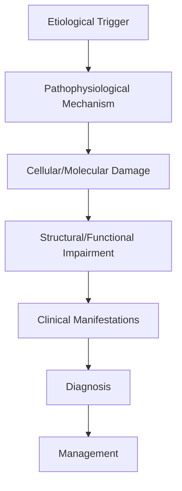
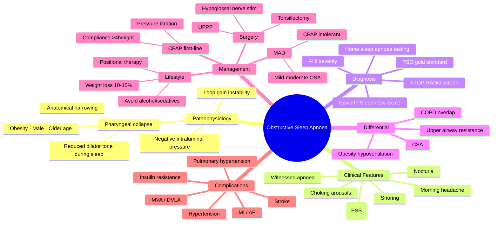

# Obstructive Sleep Apnoea

> [!tip] **High-Yield Definition**
> Comprehensive clinical note for Obstructive Sleep Apnoea covering definition, epidemiology, aetiology, pathophysiology, clinical features, investigations, differential diagnosis, management, drug interactions, procedures, complications, red flags, prognosis, topic correlation, and special situations for FCPS/MRCP examination preparation based on Davidson 24th Edition Chapter 25: Neurology.

---

## 1. Definition / Epidemiology / Classification

### Definition
Obstructive Sleep Apnoea is a neurological disorder within the 16 sleep disorders category. It is characterised by specific clinical, pathological, radiological, and laboratory features that allow differentiation from related conditions.

### Epidemiology
- **Incidence/Prevalence:** Variable depending on the specific condition.
- **Age:** Adult onset is most common, but paediatric and elderly presentations occur.
- **Sex:** Variable depending on the condition.
- **Geography:** Worldwide distribution, with higher prevalence in certain regions.
- **Risk Factors:** Genetic predisposition, environmental factors, comorbidities, family history.

### Classification
| Subtype | Key Features | Prognosis |
|---------|-------------|-----------|
| Mild/early | Subtle symptoms, preserved function | Best |
| Moderate | Clear symptoms, functional impairment | Variable |
| Severe | Significant disability, complications | Worst |

---

## 2. Aetiology / Pathophysiology

### Aetiology
- **Primary (idiopathic):** Most cases have no identifiable cause.
- **Genetic:** May be inherited (AD, AR, X-linked, mitochondrial, sporadic).
- **Autoimmune:** Autoantibodies, immune-mediated inflammation.
- **Infectious:** Viral, bacterial, fungal, parasitic.
- **Metabolic:** Electrolyte, endocrine, hepatic, renal, nutritional.
- **Toxic:** Drugs, alcohol, heavy metals, environmental toxins.
- **Vascular:** Ischaemia, haemorrhage, vasculitis.
- **Neoplastic:** Primary, secondary, paraneoplastic.
- **Traumatic:** Acute, chronic, repetitive.
- **Degenerative:** Neurodegeneration, protein misfolding.

### Pathophysiology


---

## 3. Clinical Features

### History
- **Onset/Duration:** Acute, subacute, or chronic.
- **Progression:** Static, progressive, relapsing-remitting, stepwise.
- **Key symptoms:** Specific to the condition.
- **Triggers:** Stress, infection, trauma, drugs, hormonal, environmental.
- **Systemic symptoms:** Constitutional features.
- **Drug/Family/Social history:** Relevant exposures, comorbidities.

### Examination
| Domain | Key Findings | Localisation Value |
|--------|-------------|-------------------|
| Higher function | Cognitive, behavioural | Cortical, subcortical, limbic |
| Cranial nerves | Pupils, eye movements, facial, bulbar | Brainstem, cranial nerve, NMJ |
| Motor | Weakness, tone, reflexes | UMN, LMN, NMJ, muscle |
| Sensory | All modalities, pattern | Peripheral, spinal, brainstem |
| Coordination | Ataxia, nystagmus, dysmetria | Cerebellar, sensory, vestibular |
| Gait | Spastic, ataxic, parkinsonian | Multiple |
| Autonomic | Orthostatic, sweating, GI, bladder | Autonomic, peripheral, central |

### Specific Clinical Features
The clinical features are determined by the underlying aetiology, location of pathology, and rate of progression. Patients typically present with a constellation of symptoms and signs that allow clinical localisation and subsequent targeted investigation.

---

## 4. Diagnostic Approach / Algorithm

```mermaid
flowchart TD
    A[Clinical Presentation] --> B[Anatomical Localisation]
    B --> C[Pathophysiological Category]
    C --> D[Formulate Differential]
    D --> E[Targeted Investigations]
    E --> F[Confirm Diagnosis]
    F --> G[Assess Severity/Prognosis]
    G --> H[Initiate Management]
    H --> I[Monitor Response]
    I --> J{Response?}
    J --> YES1 [Good - Continue]
    J --> NO1 [Poor - Escalate]
    YES1 --> K[Monitor]
    NO1 --> H
```

---

## 5. Investigations

### First-Line Investigations
- **Blood tests:** FBC, U&Es, LFTs, glucose, calcium, magnesium, ESR, CRP, autoimmune, infection.
- **Imaging:** CT/MRI brain/spine (essential for most neurological conditions).
- **Neurophysiology:** EEG, nerve conduction, EMG, evoked potentials.
- **CSF:** Cell count, protein, glucose, OCBs, PCR, culture.

### Second-Line Investigations
- **Genetic testing:** Gene panels, WES, WGS.
- **Antibody testing:** Antineuronal, autoimmune, paraneoplastic.
- **Biopsy:** Nerve, muscle, brain, skin.
- **Advanced imaging:** PET-CT, MR spectroscopy, fMRI.

### Specialised Investigations
- **Biomarkers:** Neurofilament light chain, tau, beta-amyloid, 14-3-3, RT-QuIC.
- **Autonomic testing:** Head-up tilt, sudomotor, QSART.
- **Neuropsychology:** Cognitive testing, behavioural assessment.
- **Genetic counselling:** Family screening, predictive testing.

---

## 6. Differential Diagnosis

| Differential | Distinguishing Features | Key Test |
|--------------|------------------------|----------|
| Vascular | Sudden onset, focal, vascular risk factors | MRI/CT, vessel imaging |
| Inflammatory | Subacute, multifocal, systemic | MRI, CSF, antibodies |
| Infectious | Fever, systemic, exposure | Bloods, CSF, imaging |
| Neoplastic | Progressive, mass effect | MRI, biopsy |
| Degenerative | Progressive, symmetric, hereditary | MRI, genetic |
| Toxic/Metabolic | Drug history, systemic, reversible | Bloods, toxicology |
| Autoimmune | Multifocal, antibodies, immunotherapy response | Antibodies, MRI, CSF |
| Functional | Inconsistent, distractible | Clinical, video, biomarkers |

---

## 7. Management

### Acute Management
- **Stabilisation:** ABCDE approach, emergency resuscitation.
- **Specific treatment:** Disease-specific interventions.
- **Symptomatic relief:** Pain, seizures, spasticity, autonomic dysfunction.
- **Prevention of complications:** DVT, pressure sores, infection.

### Disease-Modifying Treatment
- **Pharmacological:** First-line, second-line, escalation, maintenance.
- **Procedural:** Surgery, biopsy, drainage, ablation, stimulation.
- **Immunotherapy:** Steroids, IVIG, plasma exchange, immunosuppressants, biologics.
- **Rehabilitation:** Physiotherapy, OT, speech therapy.

### Long-Term Management
- **Monitoring:** Clinical, imaging, biomarkers, side effects.
- **Prevention:** Vaccinations, prophylaxis, lifestyle modification.
- **Supportive care:** Multidisciplinary team, social work, psychological support.
- **Palliative care:** Advanced care planning, end-of-life care, hospice.

---

## 8. Drug Interactions / Contraindications / Comorbidity Cautions

| Drug Class | Interaction / Caution | Management |
|------------|----------------------|------------|
| Antiseizure medications | Enzyme induction, teratogenicity | Monitor, supplement, switch |
| Immunosuppressants | Infection, malignancy, teratogenicity | Monitor, prophylaxis |
| Anticoagulants | Bleeding risk, drug interactions | Monitor INR, avoid combinations |
| Antihypertensives | Hypotension, falls | Monitor BP, adjust dose |
| Antibiotics | Nephrotoxicity, ototoxicity | Monitor renal |
| Antivirals | Nephrotoxicity, neuropsychiatric | Monitor renal, dose adjust |
| Steroids | DM, HTN, osteoporosis, infection | Monitor, prophylaxis, taper |
| Biologics | Infusion reactions, infection | Monitor, prophylaxis |

---

## 9. Procedures

### Common Procedures
- **Lumbar puncture:** Diagnostic, therapeutic (IIH, NPH). Contraindications: raised ICP, mass lesion, coagulopathy.
- **Nerve conduction studies/EMG:** Diagnostic, prognosis. Minor discomfort.
- **EEG:** Diagnostic, monitoring. No significant complications.
- **MRI brain/spine:** Diagnostic, monitoring. Contraindications: pacemaker, metallic implants.
- **CT head:** Emergency, rapid. Radiation exposure, contrast reactions.
- **Biopsy:** Stereotactic, open. Indications: diagnosis, molecular profiling.

---

## 10. Complications

| Complication | Frequency | Prevention | Management |
|--------------|-----------|------------|------------|
| Infection | Common | Hygiene, prophylaxis, vaccination | Antibiotics, antifungals |
| Thrombosis | Common | Prophylaxis, mobility | Anticoagulation |
| Pressure sores | Common | Positioning, nutrition | Wound care, surgery |
| Spasticity | Common | Positioning, stretching | Baclofen, BoNT |
| Contractures | Common | Passive movements, splints | Physiotherapy, surgery |
| Aspiration | Common | Swallow assessment | NGT, PEG, thickeners |
| Falls | Common | Environment, mobility | Walking aids |
| Fractures | Common | Bone health, prevention | Vitamin D, bisphosphonate |
| Depression | Common | Screening, support | Antidepressants, CBT |
| Cognitive decline | Variable | Monitoring, training | Rehabilitation |
| Autonomic dysfunction | Variable | Monitoring, hydration | Midodrine, fludrocortisone |
| Respiratory failure | Variable | Monitoring, supportive | Ventilation, NIV |
| Death | Variable | Monitoring, palliative | End-of-life care |

---

## 11. Red Flags / Emergencies

### Emergency Presentations
- **Rapid neurological deterioration:** New focal deficit, decreased consciousness, seizures.
- **Status epilepticus:** Continuous seizures >5 min.
- **Raised ICP:** Headache, vomiting, papilloedema, altered consciousness.
- **Respiratory failure:** Hypoxia, hypercapnia, ventilatory failure.
- **Cardiac arrest:** Arrhythmia, MI, pulmonary embolism.
- **Infection:** Sepsis, meningitis, abscess, encephalitis.
- **Drug toxicity:** Overdose, side effects, interactions.
- **Haemorrhage:** Intracranial, systemic, coagulopathy.

---

## 12. Prognosis

### Natural History
- **Acute:** May resolve with treatment, may progress, may be fatal.
- **Subacute:** Variable, depends on cause and treatment.
- **Chronic:** Often progressive, may be stable, may have relapses.
- **Recovery:** Variable, may be complete, partial, or none.

### Prognostic Factors
- **Favourable:** Young age, early treatment, mild disease, reversible cause, good premorbid function, family support.
- **Unfavourable:** Older age, delayed treatment, severe disease, irreversible cause, poor premorbid function, comorbidities.

---

## 13. Topic Correlation

| Related Topic | Link | Key Overlap |
|---------------|------|-------------|
| Davidson 24th Ed Chapter 25 | [[Davidson Chapter 25 - Neurology Hierarchy]] | Comprehensive neurology |
| Neurology MOC | [[Neurology MOC]] | All neurology topics |
| Drug Reference | [[../00_Index/Neurology Drug Reference]] | Medications |
| Local Hub | [[../16_Sleep_Disorders/Hub]] | Section-specific |
| Clinical Examination | [[../01_Fundamentals_Examination/Neurological History Taking]] | Clinical approach |
| Investigation | [[../01_Fundamentals_Examination/Neuroimaging (CT-MRI) Principles]] | Imaging |

---

## 14. Special Situations

| Situation | Consideration |
|-----------|---------------|
| **Pregnancy** | Pre-conception counselling, teratogenicity, drug safety, monitoring, delivery planning, breastfeeding. |
| **Lactation** | Drug safety, breastfeeding, monitoring, support. |
| **Paediatric** | Developmental considerations, drug dosing, school, family, vaccination, growth, puberty. |
| **Elderly / Frail** | Comorbidities, polypharmacy, falls, bone health, cognition, social, end-of-life. |
| **Renal impairment** | Drug dose adjustment, monitoring, dialysis, transplant. |
| **Hepatic impairment** | Drug dose adjustment, monitoring, transplant. |
| **Immunocompromised** | Infection prophylaxis, vaccination, drug interactions, malignancy screening. |
| **Perioperative** | Drug management, anaesthesia planning, VTE prophylaxis, infection prevention, monitoring. |
| **Driving / DVLA** | Fitness to drive, restrictions, notification, reassessment. |
| **Occupational** | Fitness for work, adaptations, rehabilitation, disability, return to work. |

---

## FCPS/MRCP High-Yield Summary

| Category | Key Points |
|----------|------------|
| **Definition** | Comprehensive definition with key diagnostic criteria |
| **Epidemiology** | Incidence, prevalence, age, sex, geography, risk factors |
| **Aetiology** | Primary causes, secondary causes, genetic, environmental |
| **Pathophysiology** | Mechanism of disease, cellular/molecular basis |
| **Clinical Features** | History, examination, key findings, variants |
| **Diagnosis** | Diagnostic criteria, classification, severity |
| **Investigations** | First-line, second-line, specialised, biomarkers |
| **Differential Diagnosis** | Key differentials, distinguishing features, tests |
| **Management** | Acute, disease-modifying, symptomatic, supportive |
| **Complications** | Common, serious, prevention, management |
| **Prognosis** | Natural history, prognostic factors, outcomes |
| **Viva Pearls** | Key examination points |
| **Drug Doses** | First-line, second-line, emergency |
| **Scoring Systems** | Specific scores used in management |
| **Genetics** | Inheritance, genes, mutations, family screening |
| **Imaging Signs** | Characteristic findings, differential |

---

## Viva Questions (PACES/FCPS Style)

1. **Q:** Define and classify its variants.
   **A:** Comprehensive definition with classification of subtypes based on aetiology, severity, and clinical features.

2. **Q:** What are the key clinical features?
   **A:** Specific symptoms and signs including onset, progression, key features, and associated findings.

3. **Q:** What is the first-line treatment?
   **A:** First-line pharmacological and non-pharmacological management based on current evidence.

4. **Q:** What are the red flags requiring urgent referral?
   **A:** Specific emergency presentations and complications requiring immediate intervention.

5. **Q:** What is the prognosis?
   **A:** Natural history, prognostic factors, and long-term outcomes.

6. **Q:** How do you differentiate from key differentials?
   **A:** Clinical features, investigations, and response to treatment that distinguish from alternative diagnoses.

7. **Q:** What investigations are most useful?
   **A:** First-line and second-line investigations including imaging, neurophysiology, CSF, and biomarkers.

8. **Q:** Describe the stepwise management approach.
   **A:** Stepwise escalation from first-line to second-line to third-line therapy with monitoring.

9. **Q:** What are the emergency presentations?
   **A:** Specific emergency scenarios and immediate management priorities.

10. **Q:** How does management change in pregnancy/paediatrics/elderly?
    **A:** Special considerations for each population including drug safety, monitoring, and support.

---

## Common Confusions / Exam Traps

| Confusion | Clarification |
|-----------|---------------|
| Similar presentation but different cause | Differentiate by history, examination, investigations |
| Treatment response vs natural history | Assess with objective measures, biomarkers |
| Drug interactions | Check each drug, monitor, adjust doses |
| Disease progression vs treatment failure | Monitor response, escalate appropriately |
| Functional vs organic | Inconsistent, distractible, disability greater than impairment |
| Acute vs chronic | Time course, progression, reversibility |
| Primary vs secondary | Underlying cause, contributing factors |
| Side effects vs symptoms | Temporal relationship, dose relationship |

---

## Mnemonics

1. **STOP-BANG** — Screening tool for OSA (score ≥3 = high risk, ≥5 = severe):
   - **S**noring loudly
   - **T**ired during day / falling asleep when stationary
   - **O**bserved to stop breathing / gasp/choke
   - **P**ressure (hypertension)
   - **B**MI >35 kg/m²
   - **A**ge >50 years
   - **N**eck circumference >40 cm (M) / >37 cm (F)
   - **G**ender male

2. **AHI Severity** — Apnoea-Hypopnoea Index events/hour:
   - **5–14** = **M**ild
   - **15–29** = **M**o**d**erate
   - **30+** = **S**evere ("5, 15, 30 — M, Mo, S")
   - AHI = apnoeas + hypopnoeas per hour of sleep

3. **OSA Complications** — high-yield ("**HTN, CVD, Crash, Endocrine**"):
   - **H**ypertension (resistant)
   - **C**ardiovascular disease (MI, AF, stroke, HFrEF/HFpEF)
   - **Crash** (RTCs — DVLA notifiable)
   - **Endocrine** (insulin resistance, T2DM, metabolic syndrome)

---

## Mind Map



---

## Spaced Repetition Trackers

| Day | Key Facts to Recall | Self-Score /10 |
|-----|-------------------|----------------|
| **Day 1** | Definition; AHI ≥5 + symptoms; STOP-BANG ≥3 = high risk; Snoring + witnessed apnoea + EDS triad | /10 |
| **Day 3** | AHI: 5–14 mild, 15–29 moderate, ≥30 severe; ESS ≥11 excessive, ≥16 severe; PSG vs HSAT | /10 |
| **Day 7** | CPAP first-line (fixed 10 cmH₂O or auto-titrating); MAD for mild/mod or CPAP failure; weight loss cornerstone | /10 |
| **Day 14** | UPPP for focal palatal collapse; tracheostomy for life-threatening OSA; bariatric surgery if BMI ≥40 | /10 |
| **Day 30** | CPAP complications: aerophagia, mask leak, claustrophobia, nasal dryness; DVLA Group 1 stop until controlled | /10 |
| **Day 90** | Resistant HTN workup → screen OSA; post-op OSA monitoring (especially opioids); OHS overlap (BMI ≥30 + daytime CO₂) | /10 |

---

## Self-Test Scorecard

| Topic | Question Stem | Score /5 |
|-------|---------------|----------|
| **AHI severity** | State the 3 AHI cut-offs and their labels | /5 |
| **STOP-BANG** | List all 8 letters and 1 point each | /5 |
| **First-line Rx** | CPAP vs MAD vs surgery vs weight loss — when to use each | /5 |
| **DVLA** | OSA driving rules for Group 1 (car) and Group 2 (HGV/PSV) | /5 |
| **Cardiovascular** | List 4 CV complications of untreated OSA | /5 |
| **Total** | Cumulative recall | /25 |

---

## MCQs (10)

1. **Q:** Per AASM, what AHI range defines **moderate** obstructive sleep apnoea?
   A. 5–14 B. 15–29 C. 30–44 D. ≥45
   **Answer: B** — AHI 15–29 = moderate; 5–14 mild; ≥30 severe.

2. **Q:** In STOP-BANG, how many points indicate "high risk" for moderate-to-severe OSA?
   A. ≥1 B. ≥2 C. ≥3 D. ≥5
   **Answer: C** — STOP-BANG ≥3 = high risk for moderate-severe OSA (sensitivity ~93%); ≥5 = very high risk.

3. **Q:** Which is the first-line treatment for moderate-to-severe symptomatic OSA?
   A. UPPP B. Mandibular advancement device C. CPAP D. Modafinil
   **Answer: C** — CPAP first-line for symptomatic moderate/severe OSA; reduces AHI, BP, MVA risk.

4. **Q:** A 55-year-old man with BMI 32, AHI 38/h, refuses CPAP. Which is the most appropriate next step?
   A. UPPP B. Mandibular advancement device (MAD) C. Tracheostomy D. Modafinil
   **Answer: B** — MAD is second-line for mild-to-moderate OSA; reasonable trial in CPAP-refusers; AHI reduction ~50%.

5. **Q:** Driver with moderate OSA (AHI 22) reports sleepiness at the wheel. What is the DVLA advice?
   A. Continue driving normally B. Stop driving until symptoms controlled C. Inform DVLA only if Group 2 licence D. Switch to public transport
   **Answer: B** — DVLA: stop driving until satisfactory control of symptoms AND treatment established (typically ≥1 month CPAP compliance ≥4 h/night for Group 1).

6. **Q:** Which cardiovascular condition is most strongly linked to untreated OSA?
   A. Mitral stenosis B. Resistant hypertension C. Hypertrophic cardiomyopathy D. Pericarditis
   **Answer: B** — OSA causes sympathetic overactivity and is the **commonest identifiable cause of resistant hypertension**; CPAP lowers BP ~2–5 mmHg.

7. **Q:** Epworth Sleepiness Scale (ESS) — what score is considered excessive daytime sleepiness?
   A. ≥6 B. ≥11 C. ≥16 D. ≥22
   **Answer: B** — ESS ≥11 = excessive daytime sleepiness; ≥16 = severe; range 0–24.

8. **Q:** Home Sleep Apnoea Testing (HSAT) is appropriate in which situation?
   A. Suspected moderate-severe OSA without comorbidities B. Suspected CSA C. Suspected PLMD D. Suspected narcolepsy
   **Answer: A** — HSAT (Type III) is validated for uncomplicated moderate–severe OSA screening; PSG required if comorbidities, suspected CSA, or negative HSAT with high suspicion.

9. **Q:** Uvulopalatopharyngoplasty (UPPP) is most effective when collapse is localised to which level?
   A. Hypopharyngeal (tongue base) B. Retropalatal / velopharyngeal C. Epiglottic D. Multi-level
   **Answer: B** — UPPP addresses retropalatal/velopharyngeal level; poor success in multi-level or tongue-base collapse (Drug-Induced Sleep Endoscopy guides selection).

10. **Q:** Which lifestyle intervention has the strongest evidence for reducing OSA severity?
    A. Sleep position B. Alcohol avoidance C. Weight loss (≥10%) C. Smoking cessation
    **Answer: C** — 10–15% weight loss reduces AHI by ~30–50%; bariatric surgery for BMI ≥40 may cure OSA in ~85%.

---

## SBA Questions (10)

1. **Scenario:** 48-year-old man, BMI 34, witnessed apnoea, ESS 16, STOP-BANG 6. ECG: LVH. What is the **next** investigation?
   A. HSAT B. Full attended PSG C. Arterial blood gas D. Echocardiogram
   **Answer: B** — Suspected severe OSA with comorbidity (LVH, obesity, hypertension) → full PSG, not HSAT, is preferred.

2. **Scenario:** Driver (Group 1) with newly diagnosed severe OSA (AHI 42). Started auto-CPAP. When can he return to driving?
   **Options:** A. Immediately B. After 1 month of satisfactory CPAP compliance + symptom control C. After 6 months D. After AHI <5 on CPAP
   **Answer: B** — DVLA: Group 1 may resume driving after ≥1 month of established CPAP (≥4 h/night, ≥70% nights), symptom control, and clinician sign-off. Need not notify DVLA if controlled.

3. **Scenario:** 60-year-old with OSA on CPAP, AHI 8/h on treatment, but still sleepy (ESS 14). What is the most appropriate next step?
   **Options:** A. Increase CPAP pressure B. Check mask fit, hours of use, exclude residual OSA on download C. Stop CPAP D. Start modafinil
   **Answer: B** — First exclude suboptimal use (mask leak, <4 h/night), residual events on CPAP download, poor sleep hygiene, other causes (PLMD, depression) before considering stimulant.

4. **Scenario:** 35-year-old pregnant woman (24 weeks), BMI 38, snoring, witnessed apnoea, BP 150/100. What is the next step?
   **Options:** A. CPAP B. HSAT then CPAP if confirmed C. Defer until postpartum D. Weight loss advice only
   **Answer: B** — Pregnancy + symptoms + hypertension: HSAT to confirm OSA, then CPAP — strongly indicated (gestational HTN/preeclampsia risk).

5. **Scenario:** 50-year-old man, AHI 28/h, refuses CPAP and MAD. BMI 41. What is the most definitive treatment?
   **Options:** A. UPPP B. Hypoglossal nerve stimulation C. Bariatric surgery D. Positional therapy
   **Answer: C** — Bariatric surgery (e.g., Roux-en-Y gastric bypass or sleeve gastrectomy) is most effective for OSA in BMI ≥40 refractory to CPAP/MAD; resolves OSA in ~75–85%.

6. **Scenario:** Patient on CPAP develops morning aerophagia and bloating. Next step?
   **Options:** A. Switch to BiPAP B. Reduce pressure / switch to auto-CPAP / try EPR C. Stop CPAP D. Add PPI
   **Answer: B** — Aerophagia from CPAP = high pressure / swallowing air → reduce pressure, enable expiratory pressure relief (EPR/CFlex), switch to auto-CPAP.

7. **Scenario:** Truck driver (Group 2) with newly diagnosed OSA, AHI 55. What must happen for licence?
   **Options:** A. CPAP established, compliance ≥4 h/night, AHI <15 on treatment, DVLA notification B. CPAP for 1 month then return C. Self-certify D. Stop driving permanently
   **Answer: A** — Group 2 (HGV/PSV) drivers must notify DVLA, demonstrate effective treatment with regular CPAP use (≥4 h/night), AHI <15 on treatment, and annual review.

8. **Scenario:** 58-year-old with resistant hypertension (BP 158/96 on 3 drugs). Which sleep test should be requested?
   **Options:** A. Insomnia screen B. PSG to assess OSA C. MSLT D. Actigraphy
   **Answer: B** — OSA is the commonest identifiable cause of resistant hypertension; screen with full PSG.

9. **Scenario:** Patient with severe OSA, AHI 65, declines CPAP/MAD/surgery. BMI 35. Best next step?
   **Options:** A. Discharge B. Trial of positional device + weight loss + repeat in 3–6 months C. Tracheostomy D. Oxygen therapy
   **Answer: B** — Conservative measures (weight loss 10–15%, positional therapy, avoid alcohol/supine sleep) should always accompany; reassess and re-engage about CPAP.

10. **Scenario:** Post-op day 2 following major abdominal surgery, BMI 38, snores loudly, desaturates to 82% on room air, drowsy. Next step?
    **Options:** A. Increase morphine B. Urgent respiratory review + start CPAP / supplemental O₂; minimise opioids C. Discharge D. Sedative to improve sleep
    **Answer: B** — Suspected post-op OSA → urgent review, supplemental O₂, position (semi-upright), minimise opioids, start CPAP if confirmed; high risk of respiratory arrest.

---

## Flashcards

- **Q:** What AHI defines OSA?
  **A:** AHI ≥5/h with symptoms OR ≥15/h regardless of symptoms (AASM/ICSD-3).
- **Q:** STOP-BANG threshold for high risk?
  **A:** ≥3 (sensitivity ~93% for moderate–severe OSA).
- **Q:** First-line for moderate–severe symptomatic OSA?
  **A:** CPAP.
- **Q:** Most effective weight-loss intervention for OSA?
  **A:** Bariatric surgery (BMI ≥40 or ≥35 with comorbidity).
- **Q:** DVLA rule for Group 1 driver with OSA?
  **A:** Stop driving until ≥1 month established CPAP (≥4 h/night) with symptom control.
- **Q:** DVLA rule for Group 2 driver?
  **A:** Must notify DVLA; CPAP established, AHI <15 on treatment, annual review.
- **Q:** Commonest identifiable cause of resistant hypertension?
  **A:** OSA.
- **Q:** ESS range and cut-offs?
  **A:** 0–24; ≥11 excessive, ≥16 severe.
- **Q:** When is HSAT (home sleep test) appropriate?
  **A:** Uncomplicated moderate–severe OSA suspicion; no significant comorbidity.
- **Q:** Three collapse sites seen on drug-induced sleep endoscopy?
  **A:** Velum, oropharynx (lateral walls/tonsils), tongue base, epiglottis (VOTE classification).

---

## Answer Key with Explanations

### MCQs
1. **B** — AHI 15–29 = moderate OSA.
2. **C** — STOP-BANG ≥3 = high risk.
3. **C** — CPAP first-line.
4. **B** — MAD for CPAP-intolerant mild–moderate OSA.
5. **B** — Stop driving until controlled.
6. **B** — OSA → resistant hypertension.
7. **B** — ESS ≥11 = excessive sleepiness.
8. **A** — HSAT for uncomplicated moderate-severe OSA suspicion.
9. **B** — UPPP effective only for retropalatal collapse.
10. **C** — Weight loss has strongest evidence for AHI reduction.

### SBAs
1. **B** — Full PSG for suspected OSA with comorbidity.
2. **B** — Group 1: 1 month established CPAP + symptom control.
3. **B** — Exclude poor compliance, mask leak, residual OSA before adding stimulant.
4. **B** — Pregnancy + symptoms + HTN: HSAT → CPAP.
5. **C** — Bariatric surgery for BMI ≥40 + CPAP failure.
6. **B** — Aerophagia: reduce pressure / EPR / auto-CPAP.
7. **A** — Group 2: notify DVLA, CPAP compliance, AHI <15, annual review.
8. **B** — PSG to screen for OSA in resistant hypertension.
9. **B** — Trial of conservative measures and re-engage.
10. **B** — Post-op OSA: urgent review, O₂, minimise opioids, start CPAP.

---

---

## Local Navigation
**Heading Hub:** [[../Hub]]  
**Chapter Hierarchy:** [[Davidson Chapter 25 - Neurology Hierarchy]]  
**Chapter MOC:** [[Neurology MOC]]  
**Drug Reference:** [[../00_Index/Neurology Drug Reference]]  
