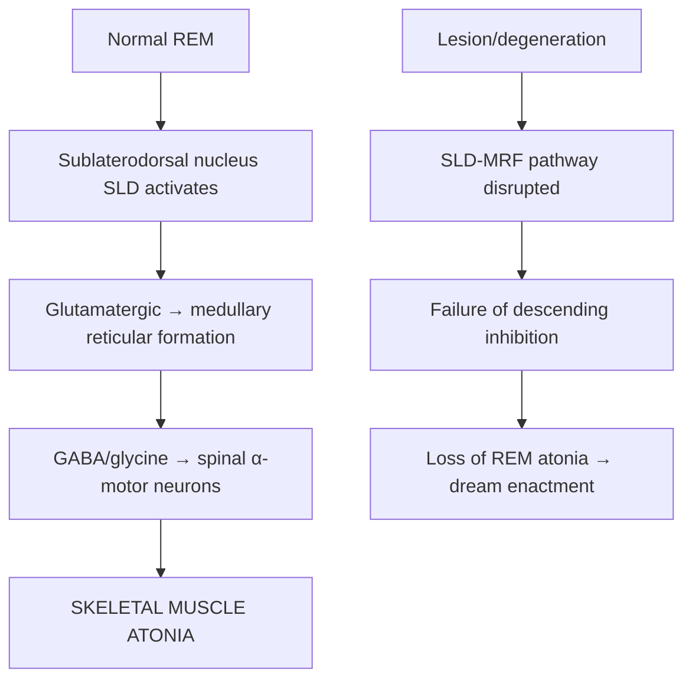
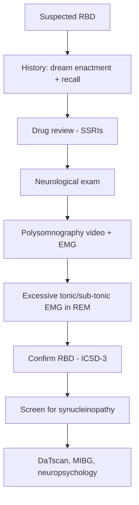
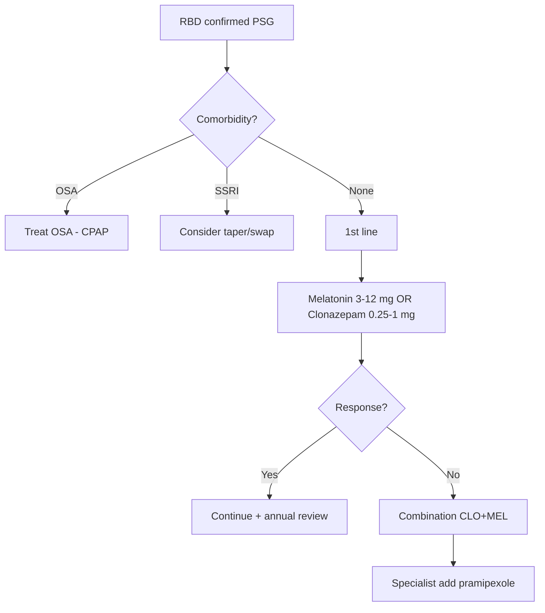
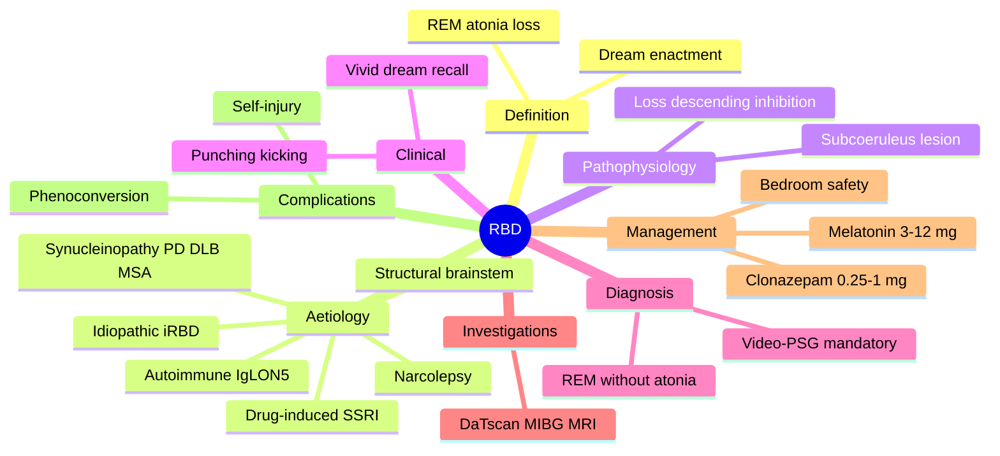

# REM Sleep Behaviour Disorder (RBD)

> [!tip] **High-Yield**
> RBD = **loss of REM atonia** → patients **act out dreams** (often violent, with recall). **Strongest known prodromal marker of α-synucleinopathy** (PD, DLB, MSA): >80% of iRBD patients phenoconvert within 10–15 yrs. Treatment: **clonazepam 0.25–1 mg nocte** (1st line) or **melatonin 3–12 mg nocte**.

## Learning Objectives
- [ ] Define RBD and distinguish from NREM parasomnias
- [ ] Describe REM atonia physiology
- [ ] Classify idiopathic vs symptomatic
- [ ] Localise brainstem REM-atonia circuits
- [ ] Recognise dream-enacting behaviours
- [ ] Order video-polysomnography
- [ ] Differentiate from sleepwalking, OSA, NFLE
- [ ] Initiate clonazepam / melatonin
- [ ] Counsel on prodromal synucleinopathy risk

---

## 1. Definition / Epidemiology / Classification

**Definition:** Parasomnia with loss of normal REM atonia → complex motor/vocal behaviours enacting dream content, often violent. Diagnosed per **ICSD-3** with video-PSG.

**Epidemiology:** Prevalence 0.5–1% (5–13% elderly); male predominance (~80%); typical onset >50 yrs. **Risk factors:** α-synucleinopathy, narcolepsy type 1, SSRIs/SNRIs/TCAs, brainstem lesions, **GBA1** mutations.

| Type | Features | Prognosis |
|------|----------|-----------|
| **Idiopathic RBD (iRBD)** | No neurological disease at diagnosis | **>80% phenoconvert** to synucleinopathy in 10–15 yrs |
| **Symptomatic RBD** | With PD, DLB, MSA, narcolepsy, structural lesion, drugs | Course mirrors underlying disease |
| **Overlap RBD + OSA** | Co-existent OSA contributing to REM motor activity | Treat OSA, may improve |

---

## 2. Aetiology / Pathophysiology

**Aetiology:**
- **Genetic:** **GBA1** (5–10× risk), SNCA, LRRK2
- **Neurodegenerative:** α-synucleinopathies (PD, DLB, MSA)
- **Narcolepsy type 1:** ~30–60% have RBD
- **Medication-induced:** SSRIs, SNRIs, TCAs, mirtazapine, β-blockers, AChEi
- **Structural:** Brainstem lesions (dorsal midbrain, pontine tegmentum, medulla)
- **Autoimmune:** Anti-**IgLON5**, Ma2, LGI1 encephalitis

**Pathophysiology:**

**Molecular basis:** α-synuclein aggregates in brainstem (locus coeruleus, subcoeruleus, substantia nigra). Subcoeruleus is first site of pathology in prodromal PD.

---

## 3. Clinical Features

**History:**
- Insidious onset, may predate synucleinopathy by decades
- **Punching, kicking, jumping, running, screaming, swearing** (often **defensive**)
- **Latter half of night** (REM-rich)
- **Vivid, unpleasant dream recall** (vs NREM parasomnia)
- Self-injury, partner assault, bruises, fractures
- Triggers: SSRIs, alcohol, sleep deprivation

**Examination:**
| Domain | Findings | Localisation |
|--------|----------|--------------|
| Motor | Subtle bradykinesia, rigidity, postural instability | Substantia nigra |
| Cranial nerves | Hyposmia (Sniffin' Sticks) | Olfactory bulb |
| Coordination | Cerebellar signs (MSA-C) | Cerebellum, brainstem |
| Gait | Freezing, falls | Basal ganglia, cerebellum |
| Autonomic | Orthostasis, urinary, erectile dysfunction | Brainstem, spinal cord |
| Cognitive | Visuospatial, attention (DLB prodrome) | Cortex |

**Syndromes:**
| Phenotype | Key Features |
|-----------|-------------|
| iRBD | Isolated dream enactment ± hyposmia, constipation, subtle slowing |
| RBD + PD | Tremor, rigidity, bradykinesia |
| RBD + DLB | Visual hallucinations, fluctuating cognition, parkinsonism |
| RBD + MSA | Autonomic failure, ataxia, RBD often years before |
| RBD + Narcolepsy | Cataplexy, sleep paralysis, hypnagogic hallucinations |

---

## 4. Diagnostic Approach

**ICSD-3 Criteria:**
- A: Repeated episodes of sleep-related vocalisation/complex motor behaviours
- B: Behave as if acting out dream content (video-PSG or witness)
- C: PSG: **excessive tonic/sub-tonic EMG in REM** (mentalis > minimum) + phasic limb EMG
- D: Not better explained by another disorder/medication

---

## 5. Investigations

| Test | Indication | Key Finding |
|------|------------|-------------|
| **Polysomnography (PSG) with video + EMG** | **Mandatory** | REM without atonia + dream enactment captured |
| **Drug history** | Exclude medication-induced | SSRIs/SNRIs/TCAs |
| **MRI Brain** | Focal signs, sudden onset | Brainstem lesion (stroke/MS/tumour) |
| **DaTscan (FP-CIT SPECT)** | Prodromal synucleinopathy | Reduced striatal uptake |
| **MIBG scintigraphy** | Distinguish PD/DLB from MSA | Reduced uptake in PD/DLB; preserved in MSA |
| **Multiple Sleep Latency Test** | Suspected narcolepsy | Sleep latency <8 min; ≥2 SOREMPs |
| **Smell test (Sniffin' Sticks/UPSIT)** | Prodromal marker | Hyposmia in PD/DLB |
| **Autoimmune panel** | Suspected IgLON5/LGI1 | Anti-IgLON5, Ma2, LGI1, CASPR2 |

---

## 6. Differential Diagnosis

| Differential | Distinguishing | Key Test |
|--------------|----------------|----------|
| **NREM Parasomnia (sleepwalking, terrors)** | N3, first third of night, no recall, no REM atonia | Video-PSG |
| **Obstructive Sleep Apnoea** | Snoring, apnoeas, daytime sleepiness | PSG respiratory channels |
| **Nocturnal Frontal Lobe Epilepsy** | Brief stereotyped events, multiple/night, no dream enactment, ictal EEG | Video-EEG-PSG |
| **Periodic Limb Movement Disorder** | Repetitive limb movements in NREM, no dream enactment | Leg EMG on PSG |
| **Confusional Arousals** | Disorientation on awakening, N3, children | Clinical, PSG |
| **PNES** | Daytime, attention-seeking, no ictal EEG | Video-EEG |

---

## 7. Management

**Bedroom safety (immediate):** padded floor, low bed, remove weapons, bed alarm, separate beds if needed.

| Agent | Indication | Dose | Monitoring | Caution |
|-------|-----------|------|------------|---------|
| **Clonazepam** | 1st line | 0.25–1 mg nocte (start 0.25 mg) | Sedation, falls, tolerance, cognition | OSA (worsen), narrow-angle glaucoma, elderly (falls) |
| **Melatonin** | 1st line alt (elderly, OSA) | 3–12 mg nocte (start 3 mg) | Daytime somnolence | Autoimmune disease (relative) |
| **Pramipexole** | Mild evidence; RBD + PD | 0.125–0.75 mg nocte | Daytime sleepiness, impulse control | ICD risk |
| **Sodium oxybate** | RBD + narcolepsy (specialist) | Specialist prescribing | Strict monitoring, abuse | Respiratory failure |

**Algorithm:**

**Special populations:** Pregnancy: avoid clonazepam (melatonin safer, off-label). Paediatric: rare, consider narcolepsy, MRI. **Elderly: start LOW (0.125 mg), prefer melatonin** (falls). Renal/hepatic: dose adjust clonazepam.

---

## 8. Drug Interactions
| Drug | Interaction | Management |
|------|-------------|------------|
| Clonazepam | CNS depressants, alcohol, opioids | Avoid combos |
| Melatonin | CYP1A2 inhibitors (fluvoxamine) | Reduce dose |
| Pramipexole | Antipsychotics | Avoid |
| SSRIs/SNRIs/TCAs | Worsen RBD | Trial taper |

---

## 9. Procedures: Polysomnography
- **Indication:** Suspected parasomnia/RBD
- **Preparation:** Avoid alcohol, caffeine; continue meds (note SSRIs)
- **Montage:** EEG 10–20, EOG, EMG (chin, bilateral tibialis, extensor digitorum), ECG, respiratory channels, infra-red video
- **Finding:** Tonic chin EMG in REM (≥2× minimum background), phasic limb EMG, dream enactment captured
- **Viva pearl:** "Excessive tonic EMG in REM = PSG hallmark of RBD"

---

## 10. Complications
| Complication | Frequency | Management |
|--------------|-----------|------------|
| Self-injury | 30–60% | Bedroom safety, Rx |
| Bed-partner assault | Common | Separate beds, counsel |
| Phenoconversion | >80% at 10–15 yrs (iRBD) | Annual review |
| Cognitive decline | Increased | Surveillance |
| Sleep disruption | Common | Treat OSA, sleep hygiene |

---

## 11. Red Flags
| Red Flag | Action | Window |
|----------|--------|--------|
| Severe injury | Urgent PSG + treat | Immediate |
| Sudden-onset + brainstem signs | MRI brain (stroke/MS/tumour) | 24 h |
| Rapid cognitive decline | DLB/autoimmune workup | 2 wks |
| Severe autonomic failure | MSA screen | 2–4 wks |
| Suspected IgLON5 | Antibody testing | 1–2 wks |

---

## 12. Prognosis
| Factor | Good | Poor |
|--------|------|------|
| Drug-induced | Reversible on taper | Persistence if structural |
| iRBD | — | High phenoconversion |
| Younger onset | Drug-induced | — |
| Treatment | Responsive | Refractory |

**Phenoconversion:** 6%/yr → 50% at 10 yrs, >80% at 14 yrs (iRBD). Outcome: DLB ~40–50%, PD ~30–40%, MSA ~10–20%.

---

## 13. Topic Correlation
- **Narcolepsy:** RBD in 30–60% NT1 (orexin)
- **PD:** RBD precedes motor by years
- **DLB:** RBD + visual hallucinations + parkinsonism
- **MSA:** RBD + autonomic failure + ataxia
- **NREM parasomnia:** Different stage, different Rx
- **OSA:** Mimic; co-exists

---

## 14. Special Situations
| Situation | Consideration |
|-----------|---------------|
| Pregnancy | Avoid clonazepam; melatonin (off-label) |
| Lactation | Avoid clonazepam (infant sedation) |
| Paediatric | RBD rare — consider narcolepsy, MRI |
| Elderly | Falls risk; melatonin preferred |
| Renal/hepatic | Clonazepam dose reduce |
| OSA | Treat OSA first; melatonin > clonazepam |
| Driving (DVLA) | RBD alone: no restriction; if severe disruption: declare |
| Perioperative | Continue meds; monitor delirium |

---

## FCPS/MRCP High-Yield Summary
- **Definition:** Loss of REM atonia → dream enactment (ICSD-3)
- **Epidemiology:** 0.5–1% prevalence; elderly men; iRBD >80% → synucleinopathy
- **Pathophysiology:** Subcoeruleus dysfunction → failure of descending inhibition
- **Clinical:** Vivid, violent dreams; punch/kick/shout; dream recall
- **Diagnosis:** **Video-PSG**: REM without atonia + dream enactment
- **Investigations:** PSG mandatory; MRI; DaTscan, MIBG, neuropsychology
- **Management:** Clonazepam 0.25–1 mg OR melatonin 3–12 mg; bedroom safety
- **Complications:** Self/partner injury, phenoconversion
- **Prognosis:** iRBD 6%/yr phenoconversion; high injury risk
- **Viva Pearls:** "REM without atonia" = PSG hallmark; "Phenoconversion" = prodromal synucleinopathy
- **Drug Doses:** Clonazepam 0.25–1 mg; Melatonin 3–12 mg
- **Genetics:** GBA1, SNCA, LRRK2
- **Imaging:** DaTscan reduced uptake; MIBG reduced in PD/DLB; preserved in MSA

---

## Viva Questions
1. **Q:** Define REM sleep behaviour disorder.
   **A:** Parasomnia of REM sleep with loss of normal atonia, leading to dream-enacting motor/vocal behaviours with full recall; ICSD-3 diagnosed.
2. **Q:** What is the PSG hallmark of RBD?
   **A:** Excessive tonic and/or phasic EMG activity during REM (REM without atonia) with dream enactment on video.
3. **Q:** Why is iRBD clinically important?
   **A:** Strongest prodromal marker of α-synucleinopathy; >80% develop PD/DLB/MSA within 10–15 yrs.
4. **Q:** First-line treatment?
   **A:** Clonazepam 0.25–1 mg OR melatonin 3–12 mg nocte.
5. **Q:** Medications that worsen RBD?
   **A:** SSRIs, SNRIs, TCAs, mirtazapine, β-blockers, AChEi.
6. **Q:** RBD vs NREM parasomnia?
   **A:** RBD = REM, latter half, dream recall, REM without atonia. NREM = N3, first third, no recall, normal REM atonia.
7. **Q:** RBD vs nocturnal epilepsy?
   **A:** RBD = REM, dream enactment, normal ictal EEG. Epilepsy = brief stereotyped, NREM, ictal EEG changes.
8. **Q:** Rate of phenoconversion from iRBD?
   **A:** ~6%/yr; 50% at 10 yrs; >80% at 14 yrs.
9. **Q:** Why prefer melatonin in elderly?
   **A:** Less falls risk, less cognitive impairment, safer in OSA, no dependence.
10. **Q:** What is the subcoeruleus nucleus?
    **A:** Pontine tegmental nucleus critical for REM atonia via descending GABA/glycine inhibition; first site of α-synuclein pathology.
11. **Q:** Investigations for prodromal synucleinopathy?
    **A:** DaTscan, MIBG, transcranial sonography, neuropsychology, smell test.
12. **Q:** Red flags warranting urgent MRI?
    **A:** Sudden-onset RBD, brainstem signs, focal deficit, suspected autoimmune.

---

## Common Confusions
| Confusion | Clarification |
|-----------|---------------|
| RBD vs sleepwalking | Sleepwalking = NREM N3, no recall, child; RBD = REM, dream recall, elderly |
| RBD vs night terrors | Terrors = N3, screaming, no recall, child; RBD = REM, enactment, recall |
| RWA = RBD diagnosis | PSG finding + clinical dream enactment required |
| RBD is benign | Wrong — injury risk + prodromal synucleinopathy |
| Melatonin OTC dose | 3–12 mg required (vs 0.5–3 mg for jet lag) |

## Mnemonics
1. **REM atonia** — **R**eticular **E**xerts **M**otor **A**tonia; lesion = enactment
2. **PRO-DROME** — RBD = **P**ro-dromal marker of synucleinopathy
3. **CLO-MEL** — **CLO**nazepam / **MEL**atonin = 1st line

## Mind Map

## One-Page Revision Card
| **Topic** | **REM Sleep Behaviour Disorder** |
|-----------|----------------------------------|
| **Definition** | Loss of REM atonia → dream enactment (ICSD-3) |
| **Key Clinical** | Vivid, violent dreams; punch/kick/shout; recall |
| **Localisation** | Subcoeruleus, pontine tegmentum |
| **Dx Criteria** | Video-PSG: REM without atonia + dream enactment |
| **Differentials** | NREM parasomnia, OSA, NFLE, PLMD, PNES |
| **Investigations** | PSG (mandatory), MRI, DaTscan, MIBG, neuropsychology |
| **Management** | 1. Bedroom safety 2. Melatonin 3-12 mg OR Clonazepam 0.25-1 mg nocte 3. Annual review |
| **Key Drugs** | Clonazepam 0.25–1 mg; Melatonin 3–12 mg |
| **Red Flags** | Sudden onset, brainstem signs, cognitive decline, autonomic failure |
| **Prognosis** | iRBD: 6%/yr phenoconversion to synucleinopathy |
| **Viva Pearls** | "REM without atonia" = PSG hallmark; "Phenoconversion" = key counselling |
| **Mnemonics** | REM atonia; CLO-MEL; PRO-DROME |

## Summary
RBD is a **parasomnia of REM sleep** with loss of atonia → **dream-enacting behaviours** with full recall. **Video-PSG is mandatory** (REM without atonia + dream enactment). **Idiopathic RBD is the strongest known prodromal marker of α-synucleinopathy** (PD, DLB, MSA) with >80% phenoconversion in 10–15 yrs. **First-line**: clonazepam 0.25–1 mg or melatonin 3–12 mg; **melatonin preferred in elderly/OSA**. Bedroom safety essential. Annual neurological surveillance for motor, cognitive, autonomic features.

---

## MCQs (10)

1. **Question:** What is the polysomnographic hallmark of RBD?
   **Options:** A. Reduced REM sleep percentage B. Excessive tonic and phasic EMG activity during REM sleep C. Sleep-onset REM periods D. Cyclic alternating pattern
   **Answer:** B — REM without atonia is the PSG hallmark. SOREMPs are for narcolepsy.

2. **Question:** Strongest prodromal marker of α-synucleinopathy?
   **Options:** A. RLS B. RBD C. OSA D. Narcolepsy type 2
   **Answer:** B — iRBD has highest predictive value for PD/DLB/MSA.

3. **Question:** Medication most likely to worsen RBD?
   **Options:** A. Levetiracetam B. Sertraline C. Melatonin D. Modafinil
   **Answer:** B — SSRIs lower REM atonia threshold.

4. **Question:** % of iRBD patients phenoconverting to synucleinopathy within 10–15 years?
   **Options:** A. <20% B. 30% C. 50% D. >80%
   **Answer:** D — Cohort studies show >80% conversion.

5. **Question:** NOT typically associated with RBD?
   **Options:** A. Parkinson's disease B. Multiple system atrophy C. Narcolepsy type 1 D. Multiple sclerosis
   **Answer:** D — MS is not typical; consider structural lesion instead.

6. **Question:** First-line Rx in elderly patient with falls risk?
   **Options:** A. Clonazepam 1 mg B. Melatonin 6 mg C. Sodium oxybate D. Pramipexole 0.5 mg
   **Answer:** B — Melatonin safer than clonazepam in elderly.

7. **Question:** Brainstem nucleus generating REM atonia?
   **Options:** A. Locus coeruleus B. Subcoeruleus C. Raphe D. Nucleus ambiguus
   **Answer:** B — Subcoeruleus is REM atonia generator.

8. **Question:** RBD vs NREM parasomnia distinguishing feature?
   **Options:** A. RBD = first third of night B. RBD has full dream recall C. NREM = REM without atonia D. RBD more common in children
   **Answer:** B — RBD has recall; NREM has no recall.

9. **Question:** Positive MIBG scan in RBD patient suggests?
   **Options:** A. MSA B. PSP C. DLB D. CBD
   **Answer:** C — Reduced MIBG = Lewy body disease (PD/DLB); preserved in MSA.

10. **Question:** Which gene mutation confers highest risk of RBD/PD?
    **Options:** A. GBA1 B. APP C. SOD1 D. NOTCH3
    **Answer:** A — GBA1 confers 5–10× PD risk, enriched in RBD.

---

## SBA Questions (10)

1. **Scenario:** 65-year-old man with 2-year history of violent dream-enacting behaviour; on sertraline.
   **Options:** A. Start clonazepam 1 mg B. Taper sertraline + arrange video-PSG C. Start melatonin 12 mg D. Order MRI urgently
   **Answer:** B — Taper SSRI; confirm with video-PSG.
2. **Scenario:** 58-year-old man with iRBD on melatonin 6 mg continues dream enactment with bruising.
   **Options:** A. Increase melatonin to 12 mg B. Add clonazepam 0.5 mg C. Counsel only D. Stop Rx
   **Answer:** B — Combine CLO+MEL for refractory.
3. **Scenario:** 70-year-old PD patient with dream-enacting behaviour; husband punched.
   **Options:** A. Increase pramipexole B. Melatonin 6 mg + bedroom safety C. Stop levodopa D. Urgent MRI
   **Answer:** B — Melatonin + safety in PD/RBD.
4. **Scenario:** 55-year-old iRBD patient; DaTscan reduced striatal uptake, asymptomatic.
   **Options:** A. Normal B. Prodromal nigrostriatal dysfunction C. MSA D. Essential tremor
   **Answer:** B — Reduced DaTscan = prodromal synucleinopathy.
5. **Scenario:** 50-year-old narcolepsy type 1 with dream enactment; PSG: REM without atonia.
   **Options:** A. Drug-induced RBD B. iRBD C. RBD secondary to narcolepsy D. Night terrors
   **Answer:** C — RBD common in NT1 (orexin deficiency).
6. **Scenario:** 12-year-old with violent sleep behaviour, vivid dreams, REM without atonia, normal MRI, daytime sleepiness.
   **Options:** A. iRBD B. Childhood narcolepsy with RBD C. Night terrors D. NFLE
   **Answer:** B — Childhood RBD = suspect narcolepsy.
7. **Scenario:** 62-year-old with iRBD develops bilateral hand tremor, gait slowing, anosmia, abnormal DaTscan.
   **Options:** A. Drug-induced parkinsonism B. Idiopathic PD C. Vascular parkinsonism D. Essential tremor
   **Answer:** B — Phenoconversion to PD.
8. **Scenario:** 67-year-old with iRBD develops urinary incontinence, erectile dysfunction, ataxia; normal MIBG.
   **Options:** A. PD B. DLB C. MSA D. PSP
   **Answer:** C — MSA: RBD + autonomic + ataxia + preserved MIBG.
9. **Scenario:** 72-year-old on clonazepam 0.5 mg develops sedation, falls, confusion.
   **Options:** A. Increase B. Switch to melatonin 6 mg C. Add BZD D. Sodium oxybate
   **Answer:** B — Switch to melatonin in elderly with benzo SE.
10. **Scenario:** 60-year-old with iRBD asks about neuroprotection.
    **Options:** A. Start rasagiline B. Lifestyle measures C. Immunotherapy D. No proven agent
    **Answer:** D — No proven neuroprotective agent; trials ongoing.

---

## Flashcards
- **Q:** PSG hallmark of RBD? **A:** REM without atonia (tonic/phasic EMG).
- **Q:** Strongest prodromal synucleinopathy marker? **A:** iRBD (>80%/10–15 yrs).
- **Q:** First-line agents? **A:** Clonazepam 0.25–1 mg OR melatonin 3–12 mg.
- **Q:** Preferred in elderly/OSA? **A:** Melatonin.
- **Q:** REM atonia nucleus? **A:** Subcoeruleus.
- **Q:** Drugs worsening RBD? **A:** SSRIs, SNRIs, TCAs.
- **Q:** MIBG in PD/DLB vs MSA? **A:** Reduced in PD/DLB; preserved in MSA.
- **Q:** ICSD-3 criteria? **A:** Dream enactment + REM without atonia, not better explained.
- **Q:** Phenoconversion rate? **A:** ~6%/yr; >80% at 10–15 yrs.
- **Q:** Brainstem site of earliest synuclein? **A:** Subcoeruleus/dorsal motor vagus.

## Answer Key
**MCQs:** 1B, 2B, 3B, 4D, 5D, 6B, 7B, 8B, 9C, 10A
**SBAs:** 1B, 2B, 3B, 4B, 5C, 6B, 7B, 8C, 9B, 10D
