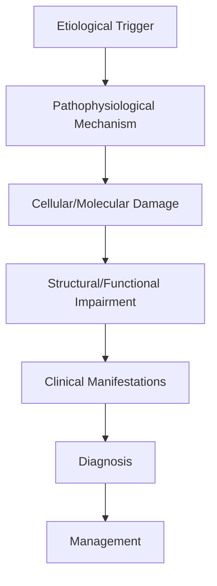
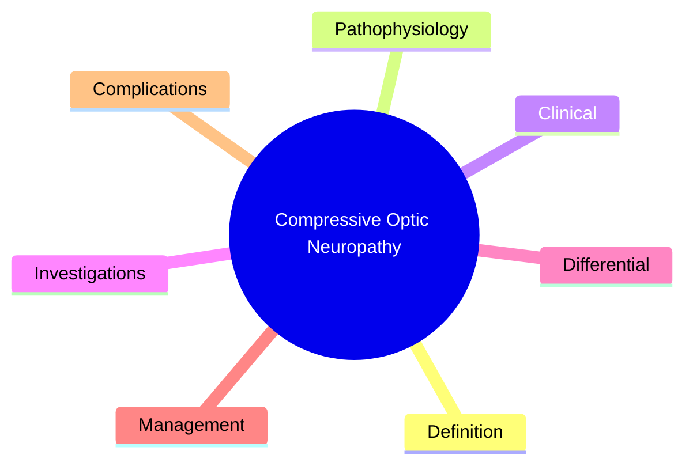

# Compressive Optic Neuropathy

> [!tip] **High-Yield Definition**
> Comprehensive clinical note for Compressive Optic Neuropathy covering definition, epidemiology, aetiology, pathophysiology, clinical features, investigations, differential diagnosis, management, drug interactions, procedures, complications, red flags, prognosis, topic correlation, and special situations for FCPS/MRCP examination preparation based on Davidson 24th Edition Chapter 25: Neurology.

---

## 1. Definition / Epidemiology / Classification

### Definition
Compressive Optic Neuropathy is a neurological disorder within the 17 neuroophthalmology category. It is characterised by specific clinical, pathological, radiological, and laboratory features that allow differentiation from related conditions.

### Epidemiology
- **Incidence/Prevalence:** Variable depending on the specific condition.
- **Age:** Adult onset is most common, but paediatric and elderly presentations occur.
- **Sex:** Variable depending on the condition.
- **Geography:** Worldwide distribution, with higher prevalence in certain regions.
- **Risk Factors:** Genetic predisposition, environmental factors, comorbidities, family history.

### Classification
| Subtype | Key Features | Prognosis |
|---------|-------------|-----------|
| Mild/early | Subtle symptoms, preserved function | Best |
| Moderate | Clear symptoms, functional impairment | Variable |
| Severe | Significant disability, complications | Worst |

---

## 2. Aetiology / Pathophysiology

### Aetiology
- **Primary (idiopathic):** Most cases have no identifiable cause.
- **Genetic:** May be inherited (AD, AR, X-linked, mitochondrial, sporadic).
- **Autoimmune:** Autoantibodies, immune-mediated inflammation.
- **Infectious:** Viral, bacterial, fungal, parasitic.
- **Metabolic:** Electrolyte, endocrine, hepatic, renal, nutritional.
- **Toxic:** Drugs, alcohol, heavy metals, environmental toxins.
- **Vascular:** Ischaemia, haemorrhage, vasculitis.
- **Neoplastic:** Primary, secondary, paraneoplastic.
- **Traumatic:** Acute, chronic, repetitive.
- **Degenerative:** Neurodegeneration, protein misfolding.

### Pathophysiology


---

## 3. Clinical Features

### History
- **Onset/Duration:** Acute, subacute, or chronic.
- **Progression:** Static, progressive, relapsing-remitting, stepwise.
- **Key symptoms:** Specific to the condition.
- **Triggers:** Stress, infection, trauma, drugs, hormonal, environmental.
- **Systemic symptoms:** Constitutional features.
- **Drug/Family/Social history:** Relevant exposures, comorbidities.

### Examination
| Domain | Key Findings | Localisation Value |
|--------|-------------|-------------------|
| Higher function | Cognitive, behavioural | Cortical, subcortical, limbic |
| Cranial nerves | Pupils, eye movements, facial, bulbar | Brainstem, cranial nerve, NMJ |
| Motor | Weakness, tone, reflexes | UMN, LMN, NMJ, muscle |
| Sensory | All modalities, pattern | Peripheral, spinal, brainstem |
| Coordination | Ataxia, nystagmus, dysmetria | Cerebellar, sensory, vestibular |
| Gait | Spastic, ataxic, parkinsonian | Multiple |
| Autonomic | Orthostatic, sweating, GI, bladder | Autonomic, peripheral, central |

### Specific Clinical Features
The clinical features are determined by the underlying aetiology, location of pathology, and rate of progression. Patients typically present with a constellation of symptoms and signs that allow clinical localisation and subsequent targeted investigation.

---

## 4. Diagnostic Approach / Algorithm

```mermaid
flowchart TD
    A[Clinical Presentation] --> B[Anatomical Localisation]
    B --> C[Pathophysiological Category]
    C --> D[Formulate Differential]
    D --> E[Targeted Investigations]
    E --> F[Confirm Diagnosis]
    F --> G[Assess Severity/Prognosis]
    G --> H[Initiate Management]
    H --> I[Monitor Response]
    I --> J{Response?}
    J --> YES1 [Good - Continue]
    J --> NO1 [Poor - Escalate]
    YES1 --> K[Monitor]
    NO1 --> H
```

---

## 5. Investigations

### First-Line Investigations
- **Blood tests:** FBC, U&Es, LFTs, glucose, calcium, magnesium, ESR, CRP, autoimmune, infection.
- **Imaging:** CT/MRI brain/spine (essential for most neurological conditions).
- **Neurophysiology:** EEG, nerve conduction, EMG, evoked potentials.
- **CSF:** Cell count, protein, glucose, OCBs, PCR, culture.

### Second-Line Investigations
- **Genetic testing:** Gene panels, WES, WGS.
- **Antibody testing:** Antineuronal, autoimmune, paraneoplastic.
- **Biopsy:** Nerve, muscle, brain, skin.
- **Advanced imaging:** PET-CT, MR spectroscopy, fMRI.

### Specialised Investigations
- **Biomarkers:** Neurofilament light chain, tau, beta-amyloid, 14-3-3, RT-QuIC.
- **Autonomic testing:** Head-up tilt, sudomotor, QSART.
- **Neuropsychology:** Cognitive testing, behavioural assessment.
- **Genetic counselling:** Family screening, predictive testing.

---

## 6. Differential Diagnosis

| Differential | Distinguishing Features | Key Test |
|--------------|------------------------|----------|
| Vascular | Sudden onset, focal, vascular risk factors | MRI/CT, vessel imaging |
| Inflammatory | Subacute, multifocal, systemic | MRI, CSF, antibodies |
| Infectious | Fever, systemic, exposure | Bloods, CSF, imaging |
| Neoplastic | Progressive, mass effect | MRI, biopsy |
| Degenerative | Progressive, symmetric, hereditary | MRI, genetic |
| Toxic/Metabolic | Drug history, systemic, reversible | Bloods, toxicology |
| Autoimmune | Multifocal, antibodies, immunotherapy response | Antibodies, MRI, CSF |
| Functional | Inconsistent, distractible | Clinical, video, biomarkers |

---

## 7. Management

### Acute Management
- **Stabilisation:** ABCDE approach, emergency resuscitation.
- **Specific treatment:** Disease-specific interventions.
- **Symptomatic relief:** Pain, seizures, spasticity, autonomic dysfunction.
- **Prevention of complications:** DVT, pressure sores, infection.

### Disease-Modifying Treatment
- **Pharmacological:** First-line, second-line, escalation, maintenance.
- **Procedural:** Surgery, biopsy, drainage, ablation, stimulation.
- **Immunotherapy:** Steroids, IVIG, plasma exchange, immunosuppressants, biologics.
- **Rehabilitation:** Physiotherapy, OT, speech therapy.

### Long-Term Management
- **Monitoring:** Clinical, imaging, biomarkers, side effects.
- **Prevention:** Vaccinations, prophylaxis, lifestyle modification.
- **Supportive care:** Multidisciplinary team, social work, psychological support.
- **Palliative care:** Advanced care planning, end-of-life care, hospice.

---

## 8. Drug Interactions / Contraindications / Comorbidity Cautions

| Drug Class | Interaction / Caution | Management |
|------------|----------------------|------------|
| Antiseizure medications | Enzyme induction, teratogenicity | Monitor, supplement, switch |
| Immunosuppressants | Infection, malignancy, teratogenicity | Monitor, prophylaxis |
| Anticoagulants | Bleeding risk, drug interactions | Monitor INR, avoid combinations |
| Antihypertensives | Hypotension, falls | Monitor BP, adjust dose |
| Antibiotics | Nephrotoxicity, ototoxicity | Monitor renal |
| Antivirals | Nephrotoxicity, neuropsychiatric | Monitor renal, dose adjust |
| Steroids | DM, HTN, osteoporosis, infection | Monitor, prophylaxis, taper |
| Biologics | Infusion reactions, infection | Monitor, prophylaxis |

---

## 9. Procedures

### Common Procedures
- **Lumbar puncture:** Diagnostic, therapeutic (IIH, NPH). Contraindications: raised ICP, mass lesion, coagulopathy.
- **Nerve conduction studies/EMG:** Diagnostic, prognosis. Minor discomfort.
- **EEG:** Diagnostic, monitoring. No significant complications.
- **MRI brain/spine:** Diagnostic, monitoring. Contraindications: pacemaker, metallic implants.
- **CT head:** Emergency, rapid. Radiation exposure, contrast reactions.
- **Biopsy:** Stereotactic, open. Indications: diagnosis, molecular profiling.

---

## 10. Complications

| Complication | Frequency | Prevention | Management |
|--------------|-----------|------------|------------|
| Infection | Common | Hygiene, prophylaxis, vaccination | Antibiotics, antifungals |
| Thrombosis | Common | Prophylaxis, mobility | Anticoagulation |
| Pressure sores | Common | Positioning, nutrition | Wound care, surgery |
| Spasticity | Common | Positioning, stretching | Baclofen, BoNT |
| Contractures | Common | Passive movements, splints | Physiotherapy, surgery |
| Aspiration | Common | Swallow assessment | NGT, PEG, thickeners |
| Falls | Common | Environment, mobility | Walking aids |
| Fractures | Common | Bone health, prevention | Vitamin D, bisphosphonate |
| Depression | Common | Screening, support | Antidepressants, CBT |
| Cognitive decline | Variable | Monitoring, training | Rehabilitation |
| Autonomic dysfunction | Variable | Monitoring, hydration | Midodrine, fludrocortisone |
| Respiratory failure | Variable | Monitoring, supportive | Ventilation, NIV |
| Death | Variable | Monitoring, palliative | End-of-life care |

---

## 11. Red Flags / Emergencies

### Emergency Presentations
- **Rapid neurological deterioration:** New focal deficit, decreased consciousness, seizures.
- **Status epilepticus:** Continuous seizures >5 min.
- **Raised ICP:** Headache, vomiting, papilloedema, altered consciousness.
- **Respiratory failure:** Hypoxia, hypercapnia, ventilatory failure.
- **Cardiac arrest:** Arrhythmia, MI, pulmonary embolism.
- **Infection:** Sepsis, meningitis, abscess, encephalitis.
- **Drug toxicity:** Overdose, side effects, interactions.
- **Haemorrhage:** Intracranial, systemic, coagulopathy.

---

## 12. Prognosis

### Natural History
- **Acute:** May resolve with treatment, may progress, may be fatal.
- **Subacute:** Variable, depends on cause and treatment.
- **Chronic:** Often progressive, may be stable, may have relapses.
- **Recovery:** Variable, may be complete, partial, or none.

### Prognostic Factors
- **Favourable:** Young age, early treatment, mild disease, reversible cause, good premorbid function, family support.
- **Unfavourable:** Older age, delayed treatment, severe disease, irreversible cause, poor premorbid function, comorbidities.

---

## 13. Topic Correlation

| Related Topic | Link | Key Overlap |
|---------------|------|-------------|
| Davidson 24th Ed Chapter 25 | [[Davidson Chapter 25 - Neurology Hierarchy]] | Comprehensive neurology |
| Neurology MOC | [[Neurology MOC]] | All neurology topics |
| Drug Reference | [[../00_Index/Neurology Drug Reference]] | Medications |
| Local Hub | [[../17_Neuroophthalmology/Hub]] | Section-specific |
| Clinical Examination | [[../01_Fundamentals_Examination/Neurological History Taking]] | Clinical approach |
| Investigation | [[../01_Fundamentals_Examination/Neuroimaging (CT-MRI) Principles]] | Imaging |

---

## 14. Special Situations

| Situation | Consideration |
|-----------|---------------|
| **Pregnancy** | Pre-conception counselling, teratogenicity, drug safety, monitoring, delivery planning, breastfeeding. |
| **Lactation** | Drug safety, breastfeeding, monitoring, support. |
| **Paediatric** | Developmental considerations, drug dosing, school, family, vaccination, growth, puberty. |
| **Elderly / Frail** | Comorbidities, polypharmacy, falls, bone health, cognition, social, end-of-life. |
| **Renal impairment** | Drug dose adjustment, monitoring, dialysis, transplant. |
| **Hepatic impairment** | Drug dose adjustment, monitoring, transplant. |
| **Immunocompromised** | Infection prophylaxis, vaccination, drug interactions, malignancy screening. |
| **Perioperative** | Drug management, anaesthesia planning, VTE prophylaxis, infection prevention, monitoring. |
| **Driving / DVLA** | Fitness to drive, restrictions, notification, reassessment. |
| **Occupational** | Fitness for work, adaptations, rehabilitation, disability, return to work. |

---

## FCPS/MRCP High-Yield Summary

| Category | Key Points |
|----------|------------|
| **Definition** | Comprehensive definition with key diagnostic criteria |
| **Epidemiology** | Incidence, prevalence, age, sex, geography, risk factors |
| **Aetiology** | Primary causes, secondary causes, genetic, environmental |
| **Pathophysiology** | Mechanism of disease, cellular/molecular basis |
| **Clinical Features** | History, examination, key findings, variants |
| **Diagnosis** | Diagnostic criteria, classification, severity |
| **Investigations** | First-line, second-line, specialised, biomarkers |
| **Differential Diagnosis** | Key differentials, distinguishing features, tests |
| **Management** | Acute, disease-modifying, symptomatic, supportive |
| **Complications** | Common, serious, prevention, management |
| **Prognosis** | Natural history, prognostic factors, outcomes |
| **Viva Pearls** | Key examination points |
| **Drug Doses** | First-line, second-line, emergency |
| **Scoring Systems** | Specific scores used in management |
| **Genetics** | Inheritance, genes, mutations, family screening |
| **Imaging Signs** | Characteristic findings, differential |

---

## Viva Questions (PACES/FCPS Style)

1. **Q:** Define and classify its variants.
   **A:** Comprehensive definition with classification of subtypes based on aetiology, severity, and clinical features.

2. **Q:** What are the key clinical features?
   **A:** Specific symptoms and signs including onset, progression, key features, and associated findings.

3. **Q:** What is the first-line treatment?
   **A:** First-line pharmacological and non-pharmacological management based on current evidence.

4. **Q:** What are the red flags requiring urgent referral?
   **A:** Specific emergency presentations and complications requiring immediate intervention.

5. **Q:** What is the prognosis?
   **A:** Natural history, prognostic factors, and long-term outcomes.

6. **Q:** How do you differentiate from key differentials?
   **A:** Clinical features, investigations, and response to treatment that distinguish from alternative diagnoses.

7. **Q:** What investigations are most useful?
   **A:** First-line and second-line investigations including imaging, neurophysiology, CSF, and biomarkers.

8. **Q:** Describe the stepwise management approach.
   **A:** Stepwise escalation from first-line to second-line to third-line therapy with monitoring.

9. **Q:** What are the emergency presentations?
   **A:** Specific emergency scenarios and immediate management priorities.

10. **Q:** How does management change in pregnancy/paediatrics/elderly?
    **A:** Special considerations for each population including drug safety, monitoring, and support.

---

## Common Confusions / Exam Traps

| Confusion | Clarification |
|-----------|---------------|
| Similar presentation but different cause | Differentiate by history, examination, investigations |
| Treatment response vs natural history | Assess with objective measures, biomarkers |
| Drug interactions | Check each drug, monitor, adjust doses |
| Disease progression vs treatment failure | Monitor response, escalate appropriately |
| Functional vs organic | Inconsistent, distractible, disability greater than impairment |
| Acute vs chronic | Time course, progression, reversibility |
| Primary vs secondary | Underlying cause, contributing factors |
| Side effects vs symptoms | Temporal relationship, dose relationship |

---

## Mnemonics
1. ****CON-THINK** = **T**hyroid eye disease, **H**ydrocephalus (papilloedema), **I**nfiltrative (lymphoma, leukaemia), **N**asopharyngeal/sinus, **K**en (sphenoid meningioma, pituitary)**
2. ****GRADUAL** = Slow progressive vision loss with optic disc pallor (vs papilloedema in early stage)**
3. ****PROM-CF** = Proptosis + Optic neuropathy in TED (Compressive type)**

---

## Mind Map



---

## Spaced Repetition Trackers

| Day 1 | Day 3 | Day 7 | Day 14 | Day 30 | Day 90 |
|------|-------|-------|--------|--------|--------|
| | | | | | |

---

## Self-Test Scorecard

| Section | Score /5 |
|---------|----------|
| Definition | |
| Pathophysiology | |
| Clinical | |
| Investigations | |
| Differential | |
| Management | |
| Complications | |

---

## MCQs (10)

1. **Q:** 40-year-old woman with bilateral proptosis, lid retraction, decreased visual acuity, RAPD. CT: extraocular muscle enlargement with tendon sparing. Diagnosis?
   **Options:** A. Thyroid eye disease (compressive optic neuropathy) B. Orbital pseudotumour C. Cavernous sinus thrombosis D. Tolosa-Hunt
   **Answer:** A
   **Explanation:** TED with compressive optic neuropathy: enlargement of EOMs with tendon sparing (vs myositis which involves tendons), bilateral often, proptosis, lid signs. Urgent treatment to prevent blindness.

2. **Q:** Most common causes of compressive optic neuropathy?
   **Options:** A. Tumours (meningioma, glioma, pituitary), thyroid eye disease, aneurysms, mucocoele B. Infection C. Trauma D. Stroke
   **Answer:** A
   **Explanation:** Compressive ON: tumours (meningioma, optic nerve glioma, pituitary adenoma, craniopharyngioma, nasopharyngeal), TED, aneurysms, mucocoeles, fibrous dysplasia. Slow progressive course.

3. **Q:** What is the most sensitive test for compressive optic neuropathy?
   **Options:** A. Visual evoked potentials B. MRI brain/orbit with contrast C. Visual fields D. OCT
   **Answer:** B
   **Explanation:** MRI brain + orbits with contrast + fat suppression: most sensitive. Visual fields show nerve fibre pattern defects. VEPs delayed. OCT shows RNFL thinning in chronic cases. Colour vision, RAPD.

4. **Q:** First-line treatment for TED with compressive optic neuropathy?
   **Options:** A. Observation B. High-dose IV methylprednisolone (pulse 500-1000mg/day for 3 days) ± urgent orbital decompression C. Antibiotics D. Surgery only
   **Answer:** B
   **Explanation:** Compressive optic neuropathy in TED: urgent IV methylprednisolone pulse therapy (3-5 days), then oral taper. If no response or vision loss: urgent orbital decompression surgery (medial, inferior, lateral wall).

5. **Q:** Distinguishing features of optic nerve sheath meningioma vs glioma on imaging?
   **Options:** A. Meningioma: perineural enhancement 'tram-track sign', calcification; glioma: fusiform expansion, may extend to chiasm B. Same C. Cannot differentiate D. Both ring-enhancing
   **Answer:** A
   **Explanation:** Optic nerve sheath meningioma: perineural enhancement with central nerve sparing ('tram-track' on axial, 'doughnut' on coronal), calcifications common, more common in middle-aged women. Optic glioma: fusiform expansion, more common in children, NF1 association.

6. **Q:** Pituitary apoplexy clinical presentation?
   **Options:** A. Sudden severe headache, visual loss (chiasmal pattern), ophthalmoplegia, altered consciousness, hormonal dysfunction B. Gradual B. Visual only C. Diplopia only
   **Answer:** A
   **Explanation:** Pituitary apoplexy: sudden haemorrhage/infarction of pituitary adenoma. Sudden severe headache ('thunderclap'), visual loss (bitemporal hemianopia from chiasmal compression), ophthalmoplegia (cavernous sinus CN III/IV/VI), altered consciousness, hypopituitarism (cortisol, vasopressin). Endocrine emergency.

7. **Q:** Management of pituitary apoplexy?
   **Options:** A. Urgent IV hydrocortisone (100mg q6h), endocrine workup, neurosurgical decompression if visual/conscious; conservative for mild cases B. Aspirin only C. Watch only D. Radiotherapy
   **Answer:** A
   **Explanation:** Pituitary apoplexy: IV hydrocortisone 100mg q6h IMMEDIATELY (treat adrenal insufficiency), endocrine workup (cortisol, free T4, TSH, GH, IGF-1, prolactin, gonadal). Urgent neurosurgical decompression (transsphenoidal) if visual loss, altered consciousness, severe. Conservative for mild/endocrinologically stable.

8. **Q:** Tolosa-Hunt syndrome features?
   **Options:** A. Painful ophthalmoplegia (CN III, IV, VI) + V1 sensory loss; granulomatous inflammation in cavernous sinus/superior orbital fissure B. Painless C. Visual only D. Isolated
   **Answer:** A
   **Explanation:** Tolosa-Hunt: painful ophthalmoplegia (CN III, IV, VI palsy) often with V1 (ophthalmic) sensory loss. Granulomatous inflammation in cavernous sinus/superior orbital fissure. Dramatic response to steroids (diagnostic). MRI shows enhancing soft tissue in region.

9. **Q:** What is the role of OCT in compressive optic neuropathy?
   **Options:** A. Diagnostic B. Monitor progression (RNFL thinning), pre-treatment baseline, follow-up C. None D. Only for screening
   **Answer:** B
   **Explanation:** OCT: quantifies RNFL (retinal nerve fibre layer) thickness. Useful for monitoring chronic compressive lesions (e.g., optic nerve sheath meningioma, sphenoid wing meningioma). Pre-treatment baseline, follow-up.

10. **Q:** Distinguishing compressive optic neuropathy from optic neuritis?
    **Options:** A. Compressive: gradual, progressive, pain rare, optic atrophy; optic neuritis: acute, painful eye movements, demyelination, recovers B. Same C. Cannot differentiate D. Both acute
    **Answer:** A
    **Explanation:** Compressive: gradual, progressive, pain rare, optic atrophy (chronic), colour desaturation. Optic neuritis: acute (hours-days), painful eye movements (90%), usually recovers, demyelinating (MS, NMOSD, MOGAD).

---

## SBA Questions (10)

1. **Scenario:** 45-year-old woman with TED, sudden visual loss in right eye (CF), colour desaturation, RAPD, proptosis, lid retraction. CT: EOM enlargement with tendon sparing.
   **Question:** Most appropriate treatment?
   **Options:** A. IV methylprednisolone 1g/day x 3 days; if no response, urgent surgical decompression B. Wait B. Antibiotics C. Aspirin
   **Answer:** A
   **Explanation:** DON (dysthyroid optic neuropathy): urgent IV methylprednisolone pulse 1g/day for 3 days, then taper. If no response or progressive, urgent orbital decompression (medial wall, floor). Smoking cessation, euthyroid state. Selenium supplementation may help mild disease.

2. **Scenario:** 50-year-old with progressive visual loss, bitemporal hemianopia, headaches. MRI: 3cm sellar mass with chiasmal compression.
   **Question:** Diagnosis and management?
   **Options:** A. Pituitary macroadenoma; endocrine workup, neurosurgical referral (transsphenoidal resection), visual field monitoring B. Migraine C. TIA D. Reassure
   **Answer:** A
   **Explanation:** Pituitary macroadenoma: visual field (bitemporal hemianopia), endocrine (prolactin, GH, ACTH, TSH deficiency), imaging. Transsphenoidal resection if compressive, hormonal active uncontrolled medically, or apoplexy. Medical: prolactinoma (cabergoline, bromocriptine).

3. **Scenario:** 60-year-old woman with painless progressive visual loss right eye, mild proptosis, optic atrophy. MRI: perineural enhancement around right optic nerve, calcifications.
   **Question:** Diagnosis?
   **Options:** A. Optic nerve sheath meningioma; serial imaging, observation or radiotherapy (fractionated SRS) if progressive B. Optic neuritis C. Glaucoma D. NAION
   **Answer:** A
   **Explanation:** ONSM: middle-aged women, painless progressive visual loss, proptosis, optic atrophy. MRI: 'tram-track' (axial) or 'doughnut' (coronal) sign, calcifications. Treatment: observation (slow growth), fractionated stereotactic radiotherapy (FSRS) or proton beam if progressive. Surgery rarely (risk of optic nerve damage).

4. **Scenario:** 35-year-old with sudden severe headache, bitemporal hemianopia, ophthalmoplegia (right CN III palsy), hypotension, hyponatraemia.
   **Question:** Management?
   **Options:** A. Pituitary apoplexy; IV hydrocortisone 100mg stat, urgent endocrine workup, MRI brain, neurosurgical decompression B. Wait C. Aspirin D. Triptans
   **Answer:** A
   **Explanation:** Pituitary apoplexy: endo/neuro emergency. IV hydrocortisone 100mg STAT (impending adrenal crisis), urgent MRI brain, endocrinology consult, neurosurgical decompression (transsphenoidal) if vision loss, altered consciousness, severe. Conservative if mild, vision stable, hormones manageable.

5. **Scenario:** 8-year-old boy with NF1, progressive visual loss, optic atrophy. MRI: fusiform expansion of right optic nerve.
   **Question:** Diagnosis?
   **Options:** A. Optic pathway glioma (NF1 associated); observation if asymptomatic, chemotherapy (carboplatin/vincristine) for progressive B. Meningioma C. Craniopharyngioma D. Pituitary adenoma
   **Answer:** A
   **Explanation:** Optic pathway glioma in NF1: 15-20% of NF1 patients, often in children. May be asymptomatic. Treatment: observation if stable, chemotherapy (carboplatin + vincristine) for progressive or vision-threatening. Radiotherapy controversial in children (cognitive, secondary malignancy).

6. **Scenario:** 40-year-old with progressive visual loss, ophthalmoplegia, V1 sensory loss. MRI: enhancing soft tissue in right cavernous sinus.
   **Question:** Likely diagnosis?
   **Options:** A. Tolosa-Hunt syndrome; dramatic response to steroids (diagnostic); exclude infection, tumour, lymphoma, sarcoid B. Bacterial infection C. Tumour only D. Migraine
   **Answer:** A
   **Explanation:** Tolosa-Hunt: painful ophthalmoplegia, V1 sensory loss. Cavernous sinus enhancing soft tissue on MRI. Dramatic response to steroids (within 24-48h) supports diagnosis. Exclude other causes (lymphoma, sarcoid, infection, tumour) before steroid trial if atypical.

7. **Scenario:** 55-year-old with sudden visual loss right eye, painful, ophthalmoplegia, fever, sinusitis. CT: subperiosteal abscess, opacified sinuses.
   **Question:** Diagnosis and management?
   **Options:** A. Subperiosteal/orbital abscess; urgent IV antibiotics, ENT for sinus drainage, ophthalmology; urgent decompression if threatened vision B. Watch C. Topical only D. Steroids alone
   **Answer:** A
   **Explanation:** Orbital cellulitis with subperiosteal abscess: ENT emergency. IV antibiotics (ceftriaxone + metronidazole + vancomycin), urgent CT, ENT sinus drainage, ophthalmology monitoring. Surgical drainage if: large abscess, vision threatened, no response to medical.

8. **Scenario:** 50-year-old with 6-month progressive visual loss right eye, optic atrophy, mild proptosis. MRI: right sphenoid wing mass with dural enhancement.
   **Question:** Diagnosis?
   **Options:** A. Sphenoid wing meningioma; observation if asymptomatic, fractionated radiotherapy or surgery if progressive B. Glioma C. Metastasis D. Sarcoid
   **Answer:** A
   **Explanation:** Sphenoid wing meningioma: slow growing, hyperostosis, optic nerve compression. Treatment: observation if small/asymptomatic; surgery (craniotomy) or fractionated stereotactic radiotherapy (FSRS) for progressive. Vision preservation challenging due to involvement of optic nerve, superior orbital fissure.

---

## Tags
**Tags:** #neurology #compressive-optic-neuropathy #TED #thyroid-eye-disease #pituitary-apoplexy #meningioma #Tolosa-Hunt #FCPS #MRCP

---

## Local Navigation
**Heading Hub:** [[../Hub]]  
**Chapter Hierarchy:** [[Davidson Chapter 25 - Neurology Hierarchy]]  
**Chapter MOC:** [[Neurology MOC]]  
**Drug Reference:** [[../00_Index/Neurology Drug Reference]]

## PasTest Scenario SBAs (Clinical Vignettes)

> **Auto-generated PasTest/Mediscope-style scenario SBAs** grounded in the authored source. Each scenario tests a real clinical fact (triad, specific sign, contraindication, trial, first-line Rx) extracted from the topic. *Source: Ch 27: Neurology & Stroke — Compressive Optic Neuropathy*

**Q1.** Which of the following features is most specific or characteristic of Compressive Optic Neuropathy?

  - **A.** Key symptoms:
  - **B.** A feature common to many acute inflammatory conditions
  - **C.** A non-specific sign that does not localise the diagnosis
  - **D.** An investigation finding rather than a clinical feature

  > **Answer: A** — Key symptoms:
  >
  > *Source:* - **Key symptoms:** Specific to the condition

**Q2.** What is the most appropriate first-line therapy for Compressive Optic Neuropathy?

  - **A.** Rehabilitation:
  - **B.** An advanced/surgical therapy reserved for refractory disease
  - **C.** Symptomatic treatment only, no disease-modifying therapy
  - **D.** Empiric broad-spectrum therapy without specific indication

  > **Answer: A** — Rehabilitation:
  >
  > *Source:* **Rehabilitation:** Physiotherapy, OT, speech therapy.

