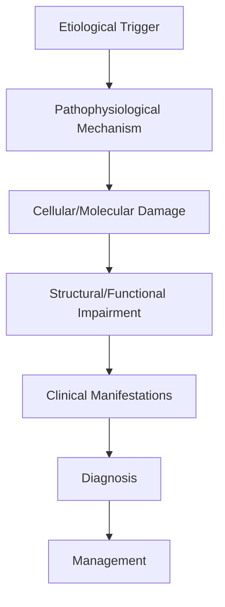
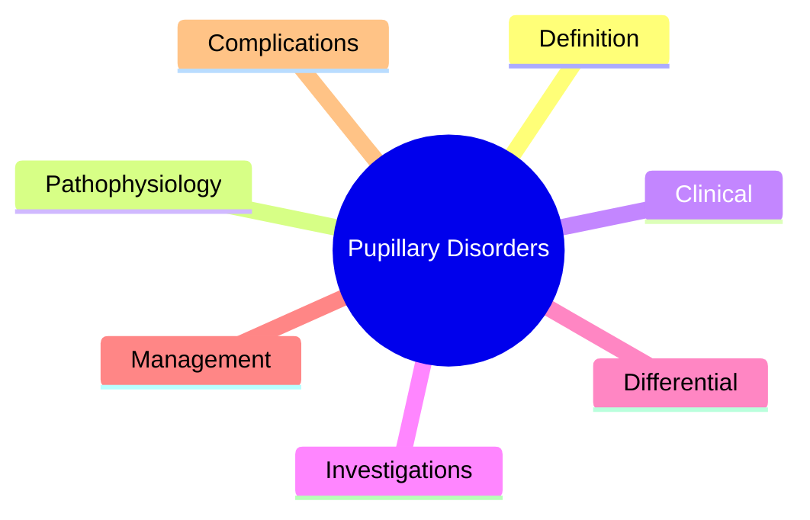

# Pupillary Disorders

> [!tip] **High-Yield Definition**
> Comprehensive clinical note for Pupillary Disorders covering definition, epidemiology, aetiology, pathophysiology, clinical features, investigations, differential diagnosis, management, drug interactions, procedures, complications, red flags, prognosis, topic correlation, and special situations for FCPS/MRCP examination preparation based on Davidson 24th Edition Chapter 25: Neurology.

---

## 1. Definition / Epidemiology / Classification

### Definition
Pupillary Disorders is a neurological disorder within the 17 neuroophthalmology category. It is characterised by specific clinical, pathological, radiological, and laboratory features that allow differentiation from related conditions.

### Epidemiology
- **Incidence/Prevalence:** Variable depending on the specific condition.
- **Age:** Adult onset is most common, but paediatric and elderly presentations occur.
- **Sex:** Variable depending on the condition.
- **Geography:** Worldwide distribution, with higher prevalence in certain regions.
- **Risk Factors:** Genetic predisposition, environmental factors, comorbidities, family history.

### Classification
| Subtype | Key Features | Prognosis |
|---------|-------------|-----------|
| Mild/early | Subtle symptoms, preserved function | Best |
| Moderate | Clear symptoms, functional impairment | Variable |
| Severe | Significant disability, complications | Worst |

---

## 2. Aetiology / Pathophysiology

### Aetiology
- **Primary (idiopathic):** Most cases have no identifiable cause.
- **Genetic:** May be inherited (AD, AR, X-linked, mitochondrial, sporadic).
- **Autoimmune:** Autoantibodies, immune-mediated inflammation.
- **Infectious:** Viral, bacterial, fungal, parasitic.
- **Metabolic:** Electrolyte, endocrine, hepatic, renal, nutritional.
- **Toxic:** Drugs, alcohol, heavy metals, environmental toxins.
- **Vascular:** Ischaemia, haemorrhage, vasculitis.
- **Neoplastic:** Primary, secondary, paraneoplastic.
- **Traumatic:** Acute, chronic, repetitive.
- **Degenerative:** Neurodegeneration, protein misfolding.

### Pathophysiology


---

## 3. Clinical Features

### History
- **Onset/Duration:** Acute, subacute, or chronic.
- **Progression:** Static, progressive, relapsing-remitting, stepwise.
- **Key symptoms:** Specific to the condition.
- **Triggers:** Stress, infection, trauma, drugs, hormonal, environmental.
- **Systemic symptoms:** Constitutional features.
- **Drug/Family/Social history:** Relevant exposures, comorbidities.

### Examination
| Domain | Key Findings | Localisation Value |
|--------|-------------|-------------------|
| Higher function | Cognitive, behavioural | Cortical, subcortical, limbic |
| Cranial nerves | Pupils, eye movements, facial, bulbar | Brainstem, cranial nerve, NMJ |
| Motor | Weakness, tone, reflexes | UMN, LMN, NMJ, muscle |
| Sensory | All modalities, pattern | Peripheral, spinal, brainstem |
| Coordination | Ataxia, nystagmus, dysmetria | Cerebellar, sensory, vestibular |
| Gait | Spastic, ataxic, parkinsonian | Multiple |
| Autonomic | Orthostatic, sweating, GI, bladder | Autonomic, peripheral, central |

### Specific Clinical Features
The clinical features are determined by the underlying aetiology, location of pathology, and rate of progression. Patients typically present with a constellation of symptoms and signs that allow clinical localisation and subsequent targeted investigation.

---

## 4. Diagnostic Approach / Algorithm

```mermaid
flowchart TD
    A[Clinical Presentation] --> B[Anatomical Localisation]
    B --> C[Pathophysiological Category]
    C --> D[Formulate Differential]
    D --> E[Targeted Investigations]
    E --> F[Confirm Diagnosis]
    F --> G[Assess Severity/Prognosis]
    G --> H[Initiate Management]
    H --> I[Monitor Response]
    I --> J{Response?}
    J --> YES1 [Good - Continue]
    J --> NO1 [Poor - Escalate]
    YES1 --> K[Monitor]
    NO1 --> H
```

---

## 5. Investigations

### First-Line Investigations
- **Blood tests:** FBC, U&Es, LFTs, glucose, calcium, magnesium, ESR, CRP, autoimmune, infection.
- **Imaging:** CT/MRI brain/spine (essential for most neurological conditions).
- **Neurophysiology:** EEG, nerve conduction, EMG, evoked potentials.
- **CSF:** Cell count, protein, glucose, OCBs, PCR, culture.

### Second-Line Investigations
- **Genetic testing:** Gene panels, WES, WGS.
- **Antibody testing:** Antineuronal, autoimmune, paraneoplastic.
- **Biopsy:** Nerve, muscle, brain, skin.
- **Advanced imaging:** PET-CT, MR spectroscopy, fMRI.

### Specialised Investigations
- **Biomarkers:** Neurofilament light chain, tau, beta-amyloid, 14-3-3, RT-QuIC.
- **Autonomic testing:** Head-up tilt, sudomotor, QSART.
- **Neuropsychology:** Cognitive testing, behavioural assessment.
- **Genetic counselling:** Family screening, predictive testing.

---

## 6. Differential Diagnosis

| Differential | Distinguishing Features | Key Test |
|--------------|------------------------|----------|
| Vascular | Sudden onset, focal, vascular risk factors | MRI/CT, vessel imaging |
| Inflammatory | Subacute, multifocal, systemic | MRI, CSF, antibodies |
| Infectious | Fever, systemic, exposure | Bloods, CSF, imaging |
| Neoplastic | Progressive, mass effect | MRI, biopsy |
| Degenerative | Progressive, symmetric, hereditary | MRI, genetic |
| Toxic/Metabolic | Drug history, systemic, reversible | Bloods, toxicology |
| Autoimmune | Multifocal, antibodies, immunotherapy response | Antibodies, MRI, CSF |
| Functional | Inconsistent, distractible | Clinical, video, biomarkers |

---

## 7. Management

### Acute Management
- **Stabilisation:** ABCDE approach, emergency resuscitation.
- **Specific treatment:** Disease-specific interventions.
- **Symptomatic relief:** Pain, seizures, spasticity, autonomic dysfunction.
- **Prevention of complications:** DVT, pressure sores, infection.

### Disease-Modifying Treatment
- **Pharmacological:** First-line, second-line, escalation, maintenance.
- **Procedural:** Surgery, biopsy, drainage, ablation, stimulation.
- **Immunotherapy:** Steroids, IVIG, plasma exchange, immunosuppressants, biologics.
- **Rehabilitation:** Physiotherapy, OT, speech therapy.

### Long-Term Management
- **Monitoring:** Clinical, imaging, biomarkers, side effects.
- **Prevention:** Vaccinations, prophylaxis, lifestyle modification.
- **Supportive care:** Multidisciplinary team, social work, psychological support.
- **Palliative care:** Advanced care planning, end-of-life care, hospice.

---

## 8. Drug Interactions / Contraindications / Comorbidity Cautions

| Drug Class | Interaction / Caution | Management |
|------------|----------------------|------------|
| Antiseizure medications | Enzyme induction, teratogenicity | Monitor, supplement, switch |
| Immunosuppressants | Infection, malignancy, teratogenicity | Monitor, prophylaxis |
| Anticoagulants | Bleeding risk, drug interactions | Monitor INR, avoid combinations |
| Antihypertensives | Hypotension, falls | Monitor BP, adjust dose |
| Antibiotics | Nephrotoxicity, ototoxicity | Monitor renal |
| Antivirals | Nephrotoxicity, neuropsychiatric | Monitor renal, dose adjust |
| Steroids | DM, HTN, osteoporosis, infection | Monitor, prophylaxis, taper |
| Biologics | Infusion reactions, infection | Monitor, prophylaxis |

---

## 9. Procedures

### Common Procedures
- **Lumbar puncture:** Diagnostic, therapeutic (IIH, NPH). Contraindications: raised ICP, mass lesion, coagulopathy.
- **Nerve conduction studies/EMG:** Diagnostic, prognosis. Minor discomfort.
- **EEG:** Diagnostic, monitoring. No significant complications.
- **MRI brain/spine:** Diagnostic, monitoring. Contraindications: pacemaker, metallic implants.
- **CT head:** Emergency, rapid. Radiation exposure, contrast reactions.
- **Biopsy:** Stereotactic, open. Indications: diagnosis, molecular profiling.

---

## 10. Complications

| Complication | Frequency | Prevention | Management |
|--------------|-----------|------------|------------|
| Infection | Common | Hygiene, prophylaxis, vaccination | Antibiotics, antifungals |
| Thrombosis | Common | Prophylaxis, mobility | Anticoagulation |
| Pressure sores | Common | Positioning, nutrition | Wound care, surgery |
| Spasticity | Common | Positioning, stretching | Baclofen, BoNT |
| Contractures | Common | Passive movements, splints | Physiotherapy, surgery |
| Aspiration | Common | Swallow assessment | NGT, PEG, thickeners |
| Falls | Common | Environment, mobility | Walking aids |
| Fractures | Common | Bone health, prevention | Vitamin D, bisphosphonate |
| Depression | Common | Screening, support | Antidepressants, CBT |
| Cognitive decline | Variable | Monitoring, training | Rehabilitation |
| Autonomic dysfunction | Variable | Monitoring, hydration | Midodrine, fludrocortisone |
| Respiratory failure | Variable | Monitoring, supportive | Ventilation, NIV |
| Death | Variable | Monitoring, palliative | End-of-life care |

---

## 11. Red Flags / Emergencies

### Emergency Presentations
- **Rapid neurological deterioration:** New focal deficit, decreased consciousness, seizures.
- **Status epilepticus:** Continuous seizures >5 min.
- **Raised ICP:** Headache, vomiting, papilloedema, altered consciousness.
- **Respiratory failure:** Hypoxia, hypercapnia, ventilatory failure.
- **Cardiac arrest:** Arrhythmia, MI, pulmonary embolism.
- **Infection:** Sepsis, meningitis, abscess, encephalitis.
- **Drug toxicity:** Overdose, side effects, interactions.
- **Haemorrhage:** Intracranial, systemic, coagulopathy.

---

## 12. Prognosis

### Natural History
- **Acute:** May resolve with treatment, may progress, may be fatal.
- **Subacute:** Variable, depends on cause and treatment.
- **Chronic:** Often progressive, may be stable, may have relapses.
- **Recovery:** Variable, may be complete, partial, or none.

### Prognostic Factors
- **Favourable:** Young age, early treatment, mild disease, reversible cause, good premorbid function, family support.
- **Unfavourable:** Older age, delayed treatment, severe disease, irreversible cause, poor premorbid function, comorbidities.

---

## 13. Topic Correlation

| Related Topic | Link | Key Overlap |
|---------------|------|-------------|
| Davidson 24th Ed Chapter 25 | [[Davidson Chapter 25 - Neurology Hierarchy]] | Comprehensive neurology |
| Neurology MOC | [[Neurology MOC]] | All neurology topics |
| Drug Reference | [[../00_Index/Neurology Drug Reference]] | Medications |
| Local Hub | [[../17_Neuroophthalmology/Hub]] | Section-specific |
| Clinical Examination | [[../01_Fundamentals_Examination/Neurological History Taking]] | Clinical approach |
| Investigation | [[../01_Fundamentals_Examination/Neuroimaging (CT-MRI) Principles]] | Imaging |

---

## 14. Special Situations

| Situation | Consideration |
|-----------|---------------|
| **Pregnancy** | Pre-conception counselling, teratogenicity, drug safety, monitoring, delivery planning, breastfeeding. |
| **Lactation** | Drug safety, breastfeeding, monitoring, support. |
| **Paediatric** | Developmental considerations, drug dosing, school, family, vaccination, growth, puberty. |
| **Elderly / Frail** | Comorbidities, polypharmacy, falls, bone health, cognition, social, end-of-life. |
| **Renal impairment** | Drug dose adjustment, monitoring, dialysis, transplant. |
| **Hepatic impairment** | Drug dose adjustment, monitoring, transplant. |
| **Immunocompromised** | Infection prophylaxis, vaccination, drug interactions, malignancy screening. |
| **Perioperative** | Drug management, anaesthesia planning, VTE prophylaxis, infection prevention, monitoring. |
| **Driving / DVLA** | Fitness to drive, restrictions, notification, reassessment. |
| **Occupational** | Fitness for work, adaptations, rehabilitation, disability, return to work. |

---

## FCPS/MRCP High-Yield Summary

| Category | Key Points |
|----------|------------|
| **Definition** | Comprehensive definition with key diagnostic criteria |
| **Epidemiology** | Incidence, prevalence, age, sex, geography, risk factors |
| **Aetiology** | Primary causes, secondary causes, genetic, environmental |
| **Pathophysiology** | Mechanism of disease, cellular/molecular basis |
| **Clinical Features** | History, examination, key findings, variants |
| **Diagnosis** | Diagnostic criteria, classification, severity |
| **Investigations** | First-line, second-line, specialised, biomarkers |
| **Differential Diagnosis** | Key differentials, distinguishing features, tests |
| **Management** | Acute, disease-modifying, symptomatic, supportive |
| **Complications** | Common, serious, prevention, management |
| **Prognosis** | Natural history, prognostic factors, outcomes |
| **Viva Pearls** | Key examination points |
| **Drug Doses** | First-line, second-line, emergency |
| **Scoring Systems** | Specific scores used in management |
| **Genetics** | Inheritance, genes, mutations, family screening |
| **Imaging Signs** | Characteristic findings, differential |

---

## Viva Questions (PACES/FCPS Style)

1. **Q:** Define and classify its variants.
   **A:** Comprehensive definition with classification of subtypes based on aetiology, severity, and clinical features.

2. **Q:** What are the key clinical features?
   **A:** Specific symptoms and signs including onset, progression, key features, and associated findings.

3. **Q:** What is the first-line treatment?
   **A:** First-line pharmacological and non-pharmacological management based on current evidence.

4. **Q:** What are the red flags requiring urgent referral?
   **A:** Specific emergency presentations and complications requiring immediate intervention.

5. **Q:** What is the prognosis?
   **A:** Natural history, prognostic factors, and long-term outcomes.

6. **Q:** How do you differentiate from key differentials?
   **A:** Clinical features, investigations, and response to treatment that distinguish from alternative diagnoses.

7. **Q:** What investigations are most useful?
   **A:** First-line and second-line investigations including imaging, neurophysiology, CSF, and biomarkers.

8. **Q:** Describe the stepwise management approach.
   **A:** Stepwise escalation from first-line to second-line to third-line therapy with monitoring.

9. **Q:** What are the emergency presentations?
   **A:** Specific emergency scenarios and immediate management priorities.

10. **Q:** How does management change in pregnancy/paediatrics/elderly?
    **A:** Special considerations for each population including drug safety, monitoring, and support.

---

## Common Confusions / Exam Traps

| Confusion | Clarification |
|-----------|---------------|
| Similar presentation but different cause | Differentiate by history, examination, investigations |
| Treatment response vs natural history | Assess with objective measures, biomarkers |
| Drug interactions | Check each drug, monitor, adjust doses |
| Disease progression vs treatment failure | Monitor response, escalate appropriately |
| Functional vs organic | Inconsistent, distractible, disability greater than impairment |
| Acute vs chronic | Time course, progression, reversibility |
| Primary vs secondary | Underlying cause, contributing factors |
| Side effects vs symptoms | Temporal relationship, dose relationship |

---

## Mnemonics
1. ****RAPD-MGN** = Relative Afferent Pupillary Defect: swinging flashlight test, Marcus Gunn**
2. ****AR-PUPIL** = Adie's pupil: dilated, poor light reaction, slow constriction to near, light-near dissociation, vermiform movements**
3. ****ARGYLL ROBERTSON** = Prostitute's pupil: accommodates but doesn't react (light-near dissociation), irregular, miotic, syphilis**

---

## Mind Map



---

## Spaced Repetition Trackers

| Day 1 | Day 3 | Day 7 | Day 14 | Day 30 | Day 90 |
|------|-------|-------|--------|--------|--------|
| | | | | | |

---

## Self-Test Scorecard

| Section | Score /5 |
|---------|----------|
| Definition | |
| Pathophysiology | |
| Clinical | |
| Investigations | |
| Differential | |
| Management | |
| Complications | |

---

## MCQs (10)

1. **Q:** Swinging flashlight test: right pupil dilates when light swings to right. Diagnosis?
   **Options:** A. Right RAPD (right optic nerve disease) B. Left RAPD C. Normal D. Bilateral
   **Answer:** A
   **Explanation:** RAPD: when light swings from normal to affected eye, the affected pupil dilates (less afferent input). Right RAPD = right optic nerve or retinal disease (e.g., optic neuritis, NAION, retinal detachment).

2. **Q:** 30-year-old with unilateral dilated pupil, poor reaction to light, slow constriction to near, vermiform movements of iris on slit-lamp.
   **Options:** A. Adie's tonic pupil (Holmes-Adie syndrome) B. Argyll Robertson C. CN III palsy D. Drug
   **Answer:** A
   **Explanation:** Adie's tonic pupil: dilated pupil, poor/segmental reaction to light, slow constriction to near ('light-near dissociation'), vermiform (worm-like) iris movements on slit-lamp. Often young women, unilateral. Holmes-Adie: Adie + absent ankle/knee reflexes.

3. **Q:** Classic Argyll Robertson pupil features?
   **Options:** A. Bilateral small irregular pupils, light-near dissociation (accommodates but doesn't react), syphilis B. Dilated C. Single dilated D. Normal
   **Answer:** A
   **Explanation:** Argyll Robertson: irregular, miotic, light-near dissociation, syphilis (neurosyphilis). 'Prostitute's pupil' (accommodates but doesn't react). Often bilateral but asymmetric.

4. **Q:** 'Light-near dissociation' in:
   **Options:** A. Neurosyphilis (AR pupil), Adie pupil, Parinaud/dorsal midbrain, severe bilateral optic neuropathy B. Only syphilis C. Only Adie D. Only midbrain
   **Answer:** A
   **Explanation:** Light-near dissociation: pupil reacts to near (accommodation) but not light. Causes: neurosyphilis (AR pupil), Adie pupil (slow tonic near), dorsal midbrain (Parinaud's), severe bilateral optic neuropathy (extreme RAPD, both pupils don't react to light but do to near - 'amaurotic pupil').

5. **Q:** 60-year-old with painful CN III palsy, dilated pupil (4mm), ptosis, eye 'down and out'.
   **Question:** Most likely cause?
   **Options:** A. Posterior communicating artery aneurysm (compressive) B. Microvascular C. MS D. Migraine
   **Answer:** A
   **Explanation:** Painful CN III palsy with PUPIL INVOLVEMENT (parasympathetic on outside of nerve) = posterior communicating artery aneurysm until proven otherwise. Emergency imaging (CTA/MRA). Surgical clipping or endovascular coiling.

6. **Q:** 60-year-old diabetic with painless CN III palsy, ptosis, eye 'down and out', PUPIL SPARED.
   **Options:** A. Microvascular ischaemic neuropathy (DM); pupil spared because parasympathetic fibres on outside (peripheral ischaemia spares central); usually resolves 3-6 months B. Aneurysm C. Tumour D. Reassure
   **Answer:** A
   **Explanation:** Microvascular CN III palsy (DM, HTN): pupil spared because parasympathetic fibres run on the periphery of the nerve (peripheral ischaemia affects central motor fibres, spares parasympathetic). Contrast with compressive (aneurysm) which affects the outside first. Usually resolves in 3-6 months.

7. **Q:** Horner's syndrome triad?
   **Options:** A. Ptosis, miosis, anhidrosis (with lesion at hypothalamus/brainstem/spinal cord) B. Mydriasis C. Ptosis, mydriasis, anhydrosis D. Diplopia, ptosis, mydriasis
   **Answer:** A
   **Explanation:** Horner's: ptosis (mild, ~2mm, Müller's muscle paralysis), miosis (sympathetic pupillary dilator paralysis), anhidrosis (sympathetic sudomotor dysfunction, depends on lesion location - first/second order neuron lesions cause facial anhidrosis, third order - medial forehead only).

8. **Q:** Pharmacological testing in Horner's syndrome - cocaine test?
   **Options:** A. Cocaine drops: dilates normal pupil but not Horner's (no sympathetic); confirms Horner B. Constricts both C. No effect D. Dilates both
   **Answer:** A
   **Explanation:** Cocaine test: blocks noradrenaline reuptake. Normal pupil: dilates (tonic sympathetic activity). Horner pupil: does NOT dilate (no sympathetic activity to be amplified). Confirms Horner's. Apraclonidine (alpha-2 agonist) reverses anisocoria in Horner's: dilates the small pupil, normal pupil minimally affected.

9. **Q:** Localisation of Horner's by anhidrosis pattern:
   **Options:** A. First-order (hypothalamus/Brainstem): ipsilateral face + arm + body anhidrosis; second-order (spinal cord/sympathetic chain): face; third-order (post-superior cervical ganglion): no anhidrosis or limited (medial forehead) B. All cause face anhidrosis C. Only first D. None
   **Answer:** A
   **Explanation:** First-order (central, hypothalamus/brainstem): face + arm + body ipsilateral. Second-order (preganglionic, C8-T2 spinal cord/sympathetic chain/apex lung): face ipsilateral. Third-order (postganglionic, post-superior cervical ganglion, ICA): no anhidrosis (or medial forehead only via external carotid branches).

10. **Q:** 40-year-old with bilateral small pupils, no reaction to light, slow reaction to near, irregular. Sexual history: MSM. Diagnosis?
    **Options:** A. Neurosyphilis (Argyll Robertson pupils); VDRL, TPHA, LP; IV penicillin; HIV test B. Adie C. Normal D. Drug
    **Answer:** A
    **Explanation:** Argyll Robertson pupils in high-risk individual: neurosyphilis. Confirm: VDRL, TPHA, LP (CSF VDRL positive). Treat: IV benzylpenicillin 18-24 MU/day for 10-14 days. HIV test.

---

## SBA Questions (10)

1. **Scenario:** 35-year-old woman with dilated right pupil, no reaction to light, slow tonic constriction to near, vermiform movements. Knee and ankle reflexes absent.
   **Question:** Diagnosis?
   **Options:** A. Holmes-Adie syndrome; no treatment usually; pilocarpine 0.125% (constricts Adie); reassurance B. Neurosyphilis C. Aneurysm D. Drug
   **Answer:** A
   **Explanation:** Holmes-Adie: Adie pupil + absent reflexes. Young women, often unilateral. Reassurance (benign). Pilocarpine 0.125% constricts the Adie pupil (cholinergic supersensitivity). Reading glasses for near work.

2. **Scenario:** 55-year-old with sudden painful CN III palsy, dilated pupil 5mm.
   **Question:** Most likely cause and management?
   **Options:** A. Compressive (PCom aneurysm); emergency CTA/MRA, urgent treatment (clipping or coiling) B. Microvascular C. MS D. Migraine
   **Answer:** A
   **Explanation:** Painful CN III palsy + pupil involvement = PCom aneurysm until proven otherwise. Emergency imaging. Treat to prevent rupture: surgical clipping or endovascular coiling.

3. **Scenario:** 65-year-old diabetic with sudden painless CN III palsy, pupil 2mm (spared).
   **Question:** Likely cause and management?
   **Options:** A. Microvascular ischaemic; risk factor control, observation; usually resolves 3-6 months; MRI if atypical B. Aneurysm C. Tumour D. Migraine
   **Answer:** A
   **Explanation:** Painless + pupil spared = microvascular. Risk factor control. Observe. MRI if atypical (pain, other CN, progressive).

4. **Scenario:** 40-year-old with left ptosis, miosis, anhidrosis left face. MRI: lesion at left lung apex.
   **Question:** Cause of Horner's?
   **Options:** A. Pancoast tumour (apical lung); chest imaging, biopsy, staging; second-order Horner B. First-order C. Third-order D. Idiopathic
   **Answer:** A
   **Explanation:** Pancoast tumour (superior sulcus tumour): apical lung mass compressing sympathetic chain (second-order neuron, preganglionic). Horner + arm pain (brachial plexus C8/T1) + hand muscle wasting. Chest CT, biopsy, staging.

5. **Scenario:** 30-year-old with isolated right Horner's, no anhidrosis, no other symptoms. MRI: enhancing lesion in right ICA.
   **Question:** Likely cause?
   **Options:** A. ICA dissection (third-order Horner); MRA, anticoagulation B. Pancoast B. Stroke C. MS D. Carotid stenosis
   **Answer:** A
   **Explanation:** ICA dissection: third-order Horner (no anhidrosis, painful Horner often). Painful Horner + amaurosis fugax / stroke symptoms in young: think carotid dissection. MRA/CTA. Anticoagulation or antiplatelet.

6. **Scenario:** 50-year-old with bilateral small pupils, irregular, react to near but not light. VDRL positive. Diagnosis?
   **Options:** A. Neurosyphilis (tabes dorsalis, AR pupils); LP, IV penicillin 18-24 MU/day for 10-14 days; HIV test B. Adie C. Normal D. Drug
   **Answer:** A
   **Explanation:** Classic AR pupils + positive VDRL = neurosyphilis. LP: CSF VDRL, cell count, protein. Treat: IV penicillin. HIV test (frequent co-infection). Partner notification.

7. **Scenario:** 25-year-old with right Horner's. Apraclonidine drops: reverses anisocoria (right pupil now larger). Confirmatory test?
   **Options:** A. Yes, apraclonidine reverses anisocoria in Horner's (alpha-2 agonist); supersensitivity; cocaine test now rarely used B. No effect C. Dilates both D. Nothing
   **Answer:** A
   **Explanation:** Apraclonidine (alpha-2 agonist): in Horner's, the affected pupil dilates (denervation supersensitivity). Normal pupil minimally affected. Reverses anisocoria. Now preferred over cocaine (which is controlled). Hydroxyamphetamine to localise (first vs second vs third order).

8. **Scenario:** 50-year-old with bilateral Horner's. MRI: hypothalamic lesion. First or second order?
   **Options:** A. First order (central); anhidrosis of face + body + arm ipsilateral; MRI hypothalamic-pontine; causes: stroke (lateral medullary), MS, tumour, syrinx B. Second order C. Third order D. Don't know
   **Answer:** A
   **Explanation:** First-order (central) Horner: lesion in hypothalamus, brainstem, upper spinal cord. Anhidrosis of ipsilateral face, arm, body. Causes: lateral medullary (Wallenberg) stroke, MS, tumour, syringomyelia, trauma. MRI brain + cervical cord.

---

## Tags
**Tags:** #neurology #RAPD #Marcus-Gunn #Adie-pupil #Argyll-Robertson #Horner #CN-III-palsy #syringomyelia #syphilis #ICA-dissection #FCPS #MRCP

---

## Local Navigation
**Heading Hub:** [[../Hub]]  
**Chapter Hierarchy:** [[Davidson Chapter 25 - Neurology Hierarchy]]  
**Chapter MOC:** [[Neurology MOC]]  
**Drug Reference:** [[../00_Index/Neurology Drug Reference]]  
