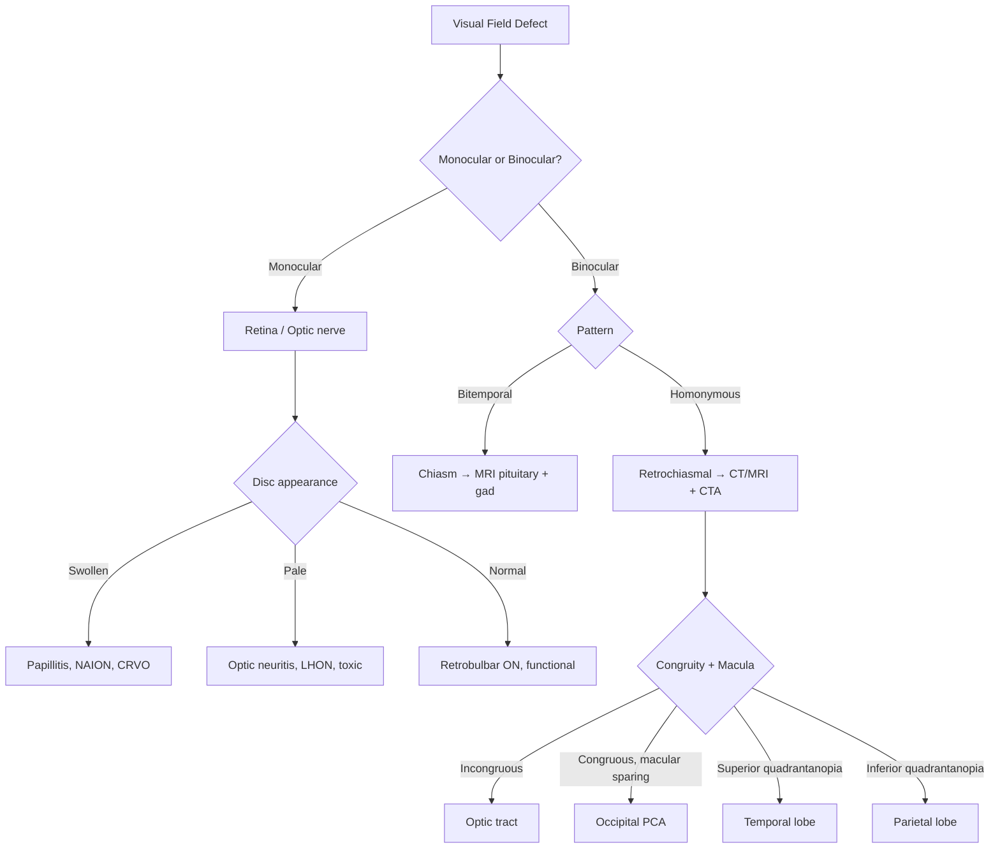
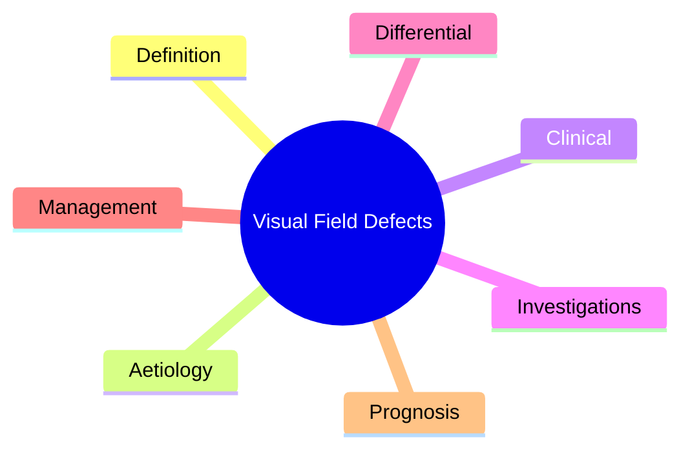

# Visual Field Defects

Related: [[Neuro-ophthalmology Hub]], [[Optic Nerve & Chiasm Hub]], [[Pupillary Disorders]], [[Stroke]], [[Pituitary Tumours]]

> [!tip] **Anatomy is the key** — Visual field defects localise precisely along the visual pathway. **Monocular = pre-chiasmal; Bitemporal = chiasmal; Homonymous = retrochiasmal.** Always plot the field, document pattern, and think anatomically.

## Learning Objectives
- [ ] Recall visual pathway anatomy from retina to cortex
- [ ] Classify field defects by anatomical level
- [ ] Recognise chiasmal and retrochiasmal patterns
- [ ] Identify common causes of each pattern
- [ ] Plan appropriate investigations
- [ ] Recognise red flags (pain, sudden onset, papilloedema)

---

## 1. Definition / Epidemiology / Classification

### Definition
A **visual field defect** is a region of reduced or absent vision: **scotoma** (isolated), **hemianopia** (half), **quadrantanopia** (quadrant), **constriction** (concentric), **altitudinal** (above/below horizontal).

### Epidemiology
- **Glaucoma:** leading global cause
- **Stroke (PCA):** most common cause of homonymous hemianopia
- **Pituitary adenoma:** most common cause of bitemporal hemianopia

### Classification by Anatomical Level
| Level | Defect | Common Cause |
|-------|--------|--------------|
| Retina | Altitudinal, arcuate, central scotoma | Vascular occlusion, glaucoma, maculopathy |
| Optic nerve | Monocular ± RAPD | Optic neuritis, NAION, compression |
| Chiasm | Bitemporal hemianopia | Pituitary adenoma, craniopharyngioma |
| Optic tract | Incongruous homonymous hemianopia | Craniopharyngioma, aneurysm |
| Temporal lobe (Meyer's loop) | Superior quadrantanopia ("pie in the sky") | Temporal stroke, tumour |
| Parietal lobe | Inferior quadrantanopia ("pie on the floor") | MCA stroke |
| Occipital cortex (V1) | Congruous HH ± macular sparing | PCA stroke |

---

## 2. Aetiology / Pathophysiology

### Aetiology
- **Vascular:** PCA/MCA stroke, retinal artery/vein occlusion, NAION, migraine, GCA
- **Neoplastic:** pituitary adenoma, meningioma, glioma, craniopharyngioma, metastases
- **Demyelinating:** MS, NMOSD, MOG
- **Infectious:** meningitis, abscess, syphilitic optic atrophy
- **Traumatic:** optic nerve avulsion, chiasmal injury
- **Toxic/nutritional:** B12, methanol, ethambutol, tobacco-alcohol
- **Hereditary:** LHON, ADOA
- **Raised ICP:** papilloedema, IIH

### Pathophysiology
- **Nasal retinal fibres** decussate at chiasm; **temporal** fibres remain ipsilateral
- **Superior retinal fibres** (inferior field) loop through **Meyer's loop** in temporal lobe → lesion = "pie in the sky"
- **Macular fibres:** dual blood supply (MCA + PCA) → **macular sparing** in PCA stroke

### Vascular Supply
| Structure | Blood Supply |
|-----------|--------------|
| Optic nerve head | Posterior ciliary arteries |
| Chiasm | ACA/AComm perforators |
| Optic tract | Anterior choroidal + PCA |
| Occipital cortex | PCA (calcarine); macular sparing via collaterals |

---

## 3. Clinical Features

### History
- **Onset:** sudden (vascular) vs subacute (compression) vs gradual (hereditary, glaucoma)
- **Pattern:** bumping into things on one side, missing half of words
- **Pain:** optic neuritis (eye movement), GCA (scalp/jaw claudication), glaucoma, migraine
- **Systemic:** endocrine (pituitary — galactorrhoea, acromegaly), pregnancy (IIH), scalp tenderness (GCA)

### Examination
| Domain | Findings | Localisation |
|--------|----------|--------------|
| Visual acuity | ↓ central | Macula/optic nerve |
| Colour vision | ↓ disproportionately | Optic nerve |
| RAPD | Present | Optic nerve (severe) |
| Fundoscopy | Pallor, swelling, cupping | Optic neuropathy |
| Confrontation | Pattern by quadrant | Anywhere |

### Specific Syndromes
| Syndrome | Field | Lesion |
|----------|-------|--------|
| Junctional scotoma | Ipsilateral central + contralateral superotemporal | Optic nerve–chiasm junction |
| Bitemporal hemianopia | Both temporal fields | Chiasm |
| Incongruous HH | Different each eye | Optic tract |
| "Pie in the sky" | Superior quadrantanopia | Meyer's loop |
| Macular-sparing HH | HH with central sparing | Occipital (PCA) |
| Altitudinal | Loss above/below horizontal | NAION, BRAO |

---

## 4. Diagnostic Approach / Algorithm

### Diagnostic Criteria
- **Humphrey/Goldmann perimetry** — gold standard
- **MRI pituitary protocol** (thin slices + gadolinium) for chiasmal lesions

### Severity (Humphrey MD)
| Stage | MD (dB) |
|-------|---------|
| Mild | -2 to -6 |
| Moderate | -6 to -12 |
| Severe | -12 to -20 |
| End-stage | <-20 |

---

## 5. Investigations

### First-Line
| Test | Indication | Finding |
|------|------------|---------|
| Visual acuity, RAPD, colour | All | Severity, anterior |
| Fundoscopy | All | Disc, macula, retina |
| Humphrey 24-2/30-2 | Stable, cooperative | Quantitative field |
| Goldmann | Inability to perform Humphrey | Manual field |
| Amsler grid | Central | Maculopathy |

### Neuroimaging
| Modality | Indication |
|----------|------------|
| **MRI brain + pituitary + orbits** | Chiasmal, optic nerve, retrochiasmal — gadolinium, fat-sat orbits |
| **CT head** | Acute stroke, trauma |
| **CTA/MRA** | Stroke, aneurysm |
| **MRV** | IIH, venous sinus thrombosis |

### Neurophysiology
- **VEP:** delayed P100 in optic neuritis (subclinical demyelination)

### Laboratory / Serology
| Test | Indication |
|------|------------|
| ESR/CRP | GCA (urgent) |
| AQP4-IgG, MOG-IgG | NMOSD/MOG |
| Pituitary hormone panel | Pituitary mass |
| B12, folate | Nutritional |
| mtDNA | LHON |

### Genetic Testing
- **LHON:** m.11778G>A, m.3460G>A, m.14484T>C (mitochondrial)
- **ADOA:** OPA1 gene

---

## 6. Differential Diagnosis

| Differential | Distinguishing | Key Test |
|--------------|----------------|----------|
| Retinal (glaucoma, RP, maculopathy) | Disc cupping, bone-spicule, drusen | Fundus, OCT, ERG |
| Optic neuritis | Pain on eye movement, RAPD, ↓colour | MRI, VEP |
| NAION | Altitudinal, painless, swollen disc | Disc, ESR |
| Functional | Inconsistent, tubular fields, no RAPD | Multiple tests |
| Migraine aura | Transient (15-30 min), fortification | History |
| Occipital seizure | Brief positive phenomena | EEG |

---

## 7. Management

### Emergency / Acute Management
| Situation | Action |
|-----------|--------|
| Sudden HH (stroke) | Stroke pathway — IV thrombolysis if <4.5h (PCA) |
| Pituitary apoplexy | IV hydrocortisone 100mg stat; urgent neurosurgical decompression |
| GCA | IV methylprednisolone 1g ×3d then oral pred 1mg/kg; TAB |
| Acute optic neuritis | IV methylprednisolone 1g ×3-5d (speeds recovery only) |
| CRAO | Ocular massage, anterior chamber paracentesis (limited evidence) |

### Disease-Modifying
| Condition | Treatment | Monitoring |
|-----------|-----------|------------|
| Pituitary macroadenoma | Transsphenoidal surgery; dopamine agonist if prolactinoma | Fields, hormones |
| Craniopharyngioma | Surgery ± radiotherapy | Vision, endocrine |
| MS-related ON | Disease-modifying Rx (interferon, ocrelizumab) | MRI, relapses |
| NMOSD | Eculizumab, satralizumab, rituximab | AQP4 titre |
| MOG | Steroids taper, IVIG, rituximab | MOG titre |

### Symptomatic
- **Prisms** for hemianopia (limited benefit)
- **Vision rehabilitation** for permanent defects
- **Driving assessment** — DVLA: ≥120° horizontal field

### Surgical / Procedural
| Procedure | Indication | Complication |
|-----------|------------|--------------|
| Transsphenoidal surgery | Pituitary macroadenoma with visual compromise | CSF leak, DI, hypopituitarism |
| Optic nerve sheath fenestration | IIH with vision loss | Diplopia |
| VP/LP shunt | IIH refractory | Obstruction, infection |

---

## 8. Drug Interactions / Cautions
| Drug | Caution |
|------|---------|
| Vigabatrin | Concentric field loss (baseline + 6/12 perimetry) |
| Ethambutol | Optic neuropathy (monthly fields) |
| Hydroxychloroquine | Retinopathy (annual fields, OCT) |
| Tamoxifen | Crystalline retinopathy |
| PDE-5 inhibitors | NAION risk (rare) |

---

## 9. Procedures
### Perimetry (Humphrey 24-2/30-2)
- **Indications:** Glaucoma, optic neuropathy, chiasmal/retrochiasmal lesions
- **Contraindications:** Cognitive/language inability
- **Preparation:** Correct near refraction, dark room
- **Complications:** None; false positives/negatives if poorly performed

---

## 10. Complications
| Complication | Frequency | Management |
|--------------|-----------|------------|
| Permanent visual loss | Variable by cause | Visual rehabilitation, low-vision aids |
| Falls (HH) | Increased risk | Mobility training, home safety |
| Driving cessation | Common | Counselling, alternative transport |
| Depression | Common | Psychology, support groups |

---

## 11. Red Flags
| Red Flag | Action | Time Window |
|----------|--------|-------------|
| Sudden HH (stroke) | Stroke team, CT/CTA | <4.5h for thrombolysis |
| Pituitary apoplexy | IV hydrocortisone + neurosurgery | Hours |
| GCA (vision loss + jaw claudication + ↑ESR) | IV methylpred before biopsy | Immediate |
| Bilateral optic nerve signs | Urgent MRI, AQP4/MOG | Days |
| New field defect with disc swelling | Urgent MRI to exclude mass | Days |

---

## 12. Prognosis
| Factor | Good | Poor |
|--------|------|------|
| Cause | Optic neuritis, microvascular | Stroke, trauma, tumour |
| Onset to treatment | <24h | Delayed |
| Visual loss | Mild | Severe (CF or worse) |
| Disc | Normal/swelling | Pale atrophy |

- **Optic neuritis:** 90% recover 6/9 or better at 1 year; 30% develop MS
- **NAION:** 30-40% improve spontaneously; 15% worsen
- **Pituitary surgery:** 70-90% visual improvement if prompt

---

## 13. Topic Correlation
| Topic | Link | Key Overlap |
|-------|------|-------------|
| Optic Neuritis | [[Optic Neuritis]] | Acute demyelinating ON |
| IIH | [[Idiopathic Intracranial Hypertension]] | Papilloedema, blind spot |
| Pituitary Tumours | [[Pituitary Tumours]] | Bitemporal hemianopia |
| Stroke | [[Stroke]] | Homonymous hemianopia |
| Compressive Optic Neuropathy | [[Compressive Optic Neuropathy]] | Optic nerve compression |

---

## 14. Special Situations
| Situation | Consideration |
|-----------|---------------|
| Pregnancy | Pituitary apoplexy (Sheehan), IIH, chiasmal compression |
| Paediatric | Craniopharyngioma, glioma, hereditary |
| Elderly | GCA, stroke, glaucoma |
| Driving | DVLA: ≥120° horizontal field; HH usually disqualifies (Group 1: ≥40° each side) |

---

## FCPS/MRCP High-Yield Summary
| Category | Key Points |
|----------|------------|
| **Definition** | Loss of part of visual field; pattern localises lesion |
| **Anatomy** | Nasal retina crosses at chiasm; Meyer's loop = superior field |
| **Patterns** | Monocular = pre-chiasm; Bitemporal = chiasm; HH = retrochiasm |
| **Incongruous HH** | Optic tract |
| **Congruous HH** | Optic radiations/cortex |
| **Macular sparing** | Occipital (PCA) |
| **Investigations** | MRI pituitary (chiasm); MRI brain + CTA (HH); Humphrey |
| **Management** | Cause-specific; Pituitary apoplexy = IV hydrocort + surgery |
| **Drugs to watch** | Vigabatrin, ethambutol, hydroxychloroquine, tamoxifen |
| **Mnemonic** | "Pie in the sky" = Temporal; "Pie on the floor" = Parietal |

---

## Viva Questions
1. **Q:** Localise bitemporal hemianopia.
   **A:** Chiasmal — midline compression (pituitary, craniopharyngioma, meningioma).
2. **Q:** Macular sparing suggests which lesion?
   **A:** Occipital cortex (PCA) — dual blood supply via posterior temporal and calcarine arteries.
3. **Q:** "Pie in the sky" defect localises where?
   **A:** Temporal lobe (Meyer's loop).
4. **Q:** Incongruous vs congruous homonymous hemianopia?
   **A:** Incongruous = optic tract; Congruous = optic radiations or cortex.
5. **Q:** Pituitary apoplexy management?
   **A:** IV hydrocortisone 100mg + urgent transsphenoidal decompression.
6. **Q:** Junctional scotoma — what is it?
   **A:** Ipsilateral central scotoma + contralateral superotemporal field loss; lesion at optic nerve–chiasm junction.
7. **Q:** GCA suspected — do you wait for biopsy?
   **A:** No — start IV methylpred 1g ×3d; biopsy within 2 weeks.
8. **Q:** LHON genetics?
   **A:** Mitochondrial DNA mutations (m.11778G>A most common); maternal inheritance; males 80-90%.

---

## Common Confusions / Exam Traps
| Confusion | Clarification |
|-----------|---------------|
| Monocular = eye, not brain | Monocular = retina or optic nerve (pre-chiasmal) |
| Altitudinal = NAION | Most common, but also BRAO, ischaemic optic neuropathy |
| Bitemporal = pituitary | Most common, but other chiasmal lesions: craniopharyngioma, meningioma |
| HH = stroke | Most common cause, but tumour, trauma, demyelination possible |
| Vigabatrin fields | Concentric constriction; baseline + 6-monthly perimetry |

---

## Mnemonics
1. ****CHIASM 4 TYPES** = **C**ompression (bitemporal hemianopia), **H**omonymous hemianopia (post-chiasmal), **I**psilateral field loss (pre-chiasmal), **A**lternative (junctional, loop), **S**cotoma (central/arcuate)**
2. ****TRACT-RADIATION-CORTEX** = Optic tract -> LGN -> optic radiation (Meyer's loop in temporal lobe = upper visual field); parietal = lower; occipital cortex = hemianopia with macular sparing**
3. ****PAPILLO-NORMAL** = Pre-chiasmal: optic disc swollen (papillitis) or normal (retrobulbar). Chiasmal: bitemporal hemianopia, may have optic atrophy. Post-chiasmal: homonymous hemianopia, no optic atrophy (or tract atrophy later)**

---

## Mind Map

---

## Spaced Repetition Trackers

| Day 1 | Day 3 | Day 7 | Day 14 | Day 30 | Day 90 |
|------|-------|-------|--------|--------|--------|
| | | | | | |

---

## Self-Test Scorecard

| Section | Score /5 |
|---------|----------|
| Definition | |
| Aetiology | |
| Clinical | |
| Investigations | |
| Differential | |
| Management | |
| Prognosis | |

---

## MCQs (10)

1. **Q:** Bitemporal hemianopia localises to:
   **Options:** A. Optic chiasm B. Optic nerve C. Optic tract D. Occipital cortex
   **Answer:** A
   **Explanation:** Bitemporal hemianopia: chiasmal lesion (compressing crossing nasal fibres from both eyes). Causes: pituitary adenoma, craniopharyngioma, suprasellar meningioma, aneurysm, glioma.

2. **Q:** Homonymous hemianopia with macular sparing suggests:
   **Options:** A. Occipital cortex (PCA territory) lesion B. Optic tract C. Temporal lobe D. Parietal lobe
   **Answer:** A
   **Explanation:** Homonymous hemianopia with macular sparing: occipital cortex (PCA territory). Macular sparing because macular representation has dual blood supply (PCA + MCA) and bilateral cortical representation.

3. **Q:** Right homonymous hemianopia localises to:
   **Options:** A. Left post-chiasmal (left optic tract, LGN, radiation, or occipital cortex) B. Right optic nerve C. Right chiasm D. Right occipital
   **Answer:** A
   **Explanation:** Right homonymous hemianopia: left post-chiasmal lesion (left optic tract, LGN, optic radiation, or occipital cortex). The further back, the more congruous the defect.

4. **Q:** 'Pie in the sky' (superior homonymous quadrantanopia) suggests lesion in:
   **Options:** A. Contralateral temporal lobe (Meyer's loop) B. Parietal C. Occipital D. Optic tract
   **Answer:** A
   **Explanation:** 'Pie in the sky' = superior homonymous quadrantanopia. Meyer's loop: inferior optic radiation fibres loop into temporal lobe. Lesion in contralateral temporal lobe (Meyer's loop) -> contralateral superior quadrantanopia.

5. **Q:** 'Pie on the floor' (inferior homonymous quadrantanopia) suggests lesion in:
   **Options:** A. Contralateral parietal lobe (superior optic radiation) B. Temporal C. Occipital D. Optic tract
   **Answer:** A
   **Explanation:** 'Pie on the floor' = inferior homonymous quadrantanopia. Superior optic radiation (parietal lobe). Lesion in contralateral parietal lobe -> contralateral inferior quadrantanopia.

6. **Q:** What is the 'junctional scotoma' or 'junctional syndrome'?
   **Options:** A. Ipsilateral central scotoma + contralateral superotemporal defect (Wilbrand's knee - now controversial) from lesion at junction of optic nerve and chiasm B. Bitemporal only C. Homonymous D. Normal
   **Answer:** A
   **Explanation:** Junctional scotoma: lesion at anterior chiasm/posterior optic nerve junction. Ipsilateral central scotoma (optic nerve) + contralateral superotemporal defect (crossing fibres from inferonasal retina). Wilbrand's knee: previously described but anatomically controversial now (likely artefact).

7. **Q:** Congruous vs incongruous homonymous hemianopia?
   **Options:** A. Congruous: defect identical in both eyes (occipital cortex); incongruous: defects different (optic tract, LGN, early radiation) B. Same as bitemporal C. Cannot tell D. Vertical only
   **Answer:** A
   **Explanation:** Congruous: identical/symmetrical in both eyes - suggests occipital cortex. Incongruous: different in each eye - optic tract, LGN, or radiation. The further back the lesion, the more congruous.

8. **Q:** Causes of bitemporal hemianopia (chiasmal)?
   **Options:** A. Pituitary adenoma, craniopharyngioma, suprasellar meningioma, Rathke cleft cyst, aneurysm, sarcoid, lymphocytic hypophysitis B. Migraine C. MS D. Glaucoma
   **Answer:** A
   **Explanation:** Chiasmal lesions: pituitary macroadenoma (most common), craniopharyngioma, suprasellar meningioma, Rathke cleft cyst, internal carotid aneurysm, sarcoidosis, lymphocytic hypophysitis, germinoma. Endocrine + visual symptoms.

9. **Q:** Optic tract lesion features?
   **Options:** A. Incongruous homonymous hemianopia + contralateral optic atrophy (band atrophy from RNFL loss); afferent pupil defect (RAPD) on contralateral eye Bitemporal B. Bitemporal C. Normal D. Vertical only
   **Answer:** A
   **Explanation:** Optic tract lesion: incongruous homonymous hemianopia + RAPD on contralateral eye (more nasal fibres crossing). Optic atrophy: 'band' (bow-tie) atrophy in contralateral eye, generalised atrophy in ipsilateral. Wernicke's pupil: pupil doesn't react to light from hemianopic field.

10. **Q:** Visual field defects in optic neuritis?
    **Options:** A. Variable - central/centrocaecal scotoma, altitudinal, arcuate, diffuse depression; usually unilateral B. Bitemporal C. Homonymous D. Always altitudinal
    **Answer:** A
    **Explanation:** Optic neuritis VF: variable. Most common: central or centrocaecal scotoma, altitudinal, arcuate, or diffuse depression. Unilateral. Helps differentiate from chiasmal (bitemporal) or post-chiasmal (homonymous).

---

## SBA Questions (10)

1. **Scenario:** 40-year-old with bitemporal hemianopia, headaches, decreased libido. MRI: 2.5cm sellar mass with chiasmal compression.
   **Question:** Diagnosis and management?
   **Options:** A. Pituitary macroadenoma; endocrine workup (prolactin, GH, ACTH, TSH), neurosurgical referral (transsphenoidal) B. Craniopharyngioma C. Meningioma D. Wait
   **Answer:** A
   **Explanation:** Pituitary macroadenoma: visual field (bitemporal hemianopia), endocrine (prolactin, GH, ACTH, TSH), imaging. Transsphenoidal resection if compressive or hormonal uncontrolled. Medical: prolactinoma (cabergoline, bromocriptine).

2. **Scenario:** 35-year-old with progressive bitemporal hemianopia. MRI: cystic suprasellar mass with calcifications.
   **Question:** Likely diagnosis?
   **Options:** A. Craniopharyngioma; endocrine workup (panhypopituitarism), neurosurgical referral (transsphenoidal or transcranial), visual monitoring B. Pituitary adenoma C. Meningioma D. MS
   **Answer:** A
   **Explanation:** Craniopharyngioma: suprasellar cystic + solid + calcifications, bimodal age (children, adults 50-70), panhypopituitarism, visual field loss. Surgical resection (often transcranial given size/calcification), adjuvant radiotherapy if not fully resected.

3. **Scenario:** 65-year-old with sudden right homonymous hemianopia. MRI: DWI hyperintensity in left occipital lobe.
   **Question:** Diagnosis and management?
   **Options:** A. Left PCA stroke (occipital lobe infarct); aspirin, statin, BP control, secondary prevention B. Migraine C. Tumour D. TIA
   **Answer:** A
   **Explanation:** PCA stroke: contralateral homonymous hemianopia, often with macular sparing (PCA + MCA supply to occipital pole). Acute stroke pathway: thrombolysis if within window (often not in occipital, vision rarely recovers), secondary prevention. Macular sparing typical of cortical (vs subcortical).

4. **Scenario:** 50-year-old with progressive right homonymous hemianopia, no macular sparing, no RAPD. MRI: enhancing lesion in left temporal lobe.
   **Question:** Likely diagnosis?
   **Options:** A. Left temporal lobe glioma (involving Meyer's loop); biopsy, staging, neurosurgical resection B. Stroke C. MS D. Aneurysm
   **Answer:** A
   **Explanation:** Superior homonymous quadrantanopia ('pie in the sky') = Meyer's loop in temporal lobe. Lesion: glioma (common), AVM, tumour. No macular sparing (cortical but not occipital pole). No RAPD (post-chiasmal).

5. **Scenario:** 30-year-old with sudden painless right inferior quadrantanopia ('pie on the floor'). MRI: small left parietal AVM.
   **Question:** Cause of visual field defect?
   **Options:** A. Left parietal AVM involving superior optic radiation; consider treatment (surgical, endovascular, SRS depending on Spetzler-Martin grade) B. Migraine C. MS D. Tumour
   **Answer:** A
   **Explanation:** Inferior homonymous quadrantanopia = superior optic radiation (parietal). AVM (arteriovenous malformation) of parietal lobe. Spetzler-Martin grade determines treatment: surgical, endovascular, stereotactic radiosurgery, or combination.

6. **Scenario:** 60-year-old with progressive right homonymous hemianopia + RAPD on right. MRI: 2cm lesion at left optic tract.
   **Question:** Likely diagnosis?
   **Options:** A. Left optic tract lesion (meningioma, glioma); further imaging, biopsy, treat cause B. Stroke C. Tumour D. MS
   **Answer:** A
   **Explanation:** Optic tract lesion: incongruous homonymous hemianopia + contralateral RAPD (right RAPD = left optic tract lesion). Optic atrophy (band atrophy contralateral). Causes: meningioma, glioma, AVM, MS. MRI with contrast.

7. **Scenario:** 45-year-old with progressive bitemporal hemianopia. MRI: 1.5cm sellar mass. Prolactin 200 ng/mL (normal <20).
   **Question:** Diagnosis and management?
   **Options:** A. Macroprolactinoma; medical first-line (cabergoline 0.5mg twice weekly, titrate), visual monitoring; surgery if refractory to medical B. Craniopharyngioma C. Non-functional adenoma D. Wait
   **Answer:** A
   **Explanation:** Macroprolactinoma (prolactin >200 ng/mL = macroprolactinoma, vs microprolactinoma <200). Medical first-line: dopamine agonist (cabergoline 0.5mg twice weekly, titrate up; bromocriptine alternative). Often shrinks tumour and restores vision. Surgery if refractory or dopamine agonist intolerant.

8. **Scenario:** 25-year-old with sudden right homonymous hemianopia, MRI: lesion in left thalamus with enhancement.
   **Question:** Differential?
   **Options:** A. Thalamic stroke (deep PCA), tumour, MS, AVM; full workup; if onset, stroke pathway; if demyelinating, MS workup B. Migraine C. Drug D. Reassure
   **Answer:** A
   **Explanation:** Thalamic lesion: deep PCA stroke (thalamogeniculate, thalamoperforating), tumour (glioma, metastasis), MS, AVM. Thalamic stroke: contralateral hemisensory loss, sometimes hemianopia. Demyelinating: MS, ADEM.

---

## Tags
**Tags:** #neurology #visual-field-defects #bitemporal-hemianopia #homonymous-hemianopia #Meyers-loop #PCA-stroke #pituitary-adenoma #chiasmal-syndrome #FCPS #MRCP

---

## Local Navigation
**Hub:** [[Neuro-ophthalmology Hub]] | **Chapter MOC:** [[Neurology MOC]] | **Related:** [[Optic Neuritis]], [[Idiopathic Intracranial Hypertension]], [[Pituitary Tumours]], [[Stroke]]

## PasTest Scenario SBAs (Clinical Vignettes)

> **Auto-generated PasTest/Mediscope-style scenario SBAs** grounded in the authored source. Each scenario tests a real clinical fact (triad, specific sign, contraindication, trial, first-line Rx) extracted from the topic. *Source: Ch 27: Neurology & Stroke — Visual Field Defects*

**Q1.** What is the most appropriate first-line therapy for Visual Field Defects?

  - **A.** Prisms + Vision rehabilitation + Driving assessment
  - **B.** An advanced/surgical therapy reserved for refractory disease
  - **C.** Symptomatic treatment only, no disease-modifying therapy
  - **D.** Empiric broad-spectrum therapy without specific indication

  > **Answer: A** — Prisms + Vision rehabilitation + Driving assessment
  >
  > *Source:* MOG   Steroids taper, IVIG, rituximab   MOG titre  

### Symptomatic
- **Prisms** for hemianopia (limited benefit)
- **Vision rehabilitation** for permanent defects
- **Driving assessment** — DVLA: ≥1

