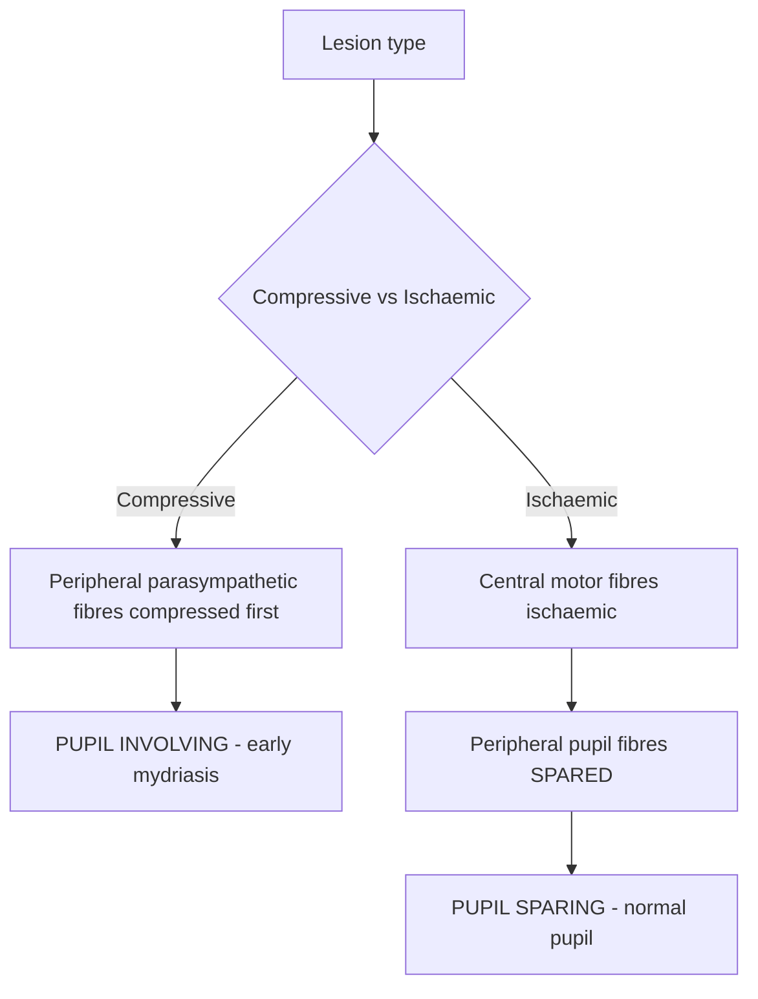
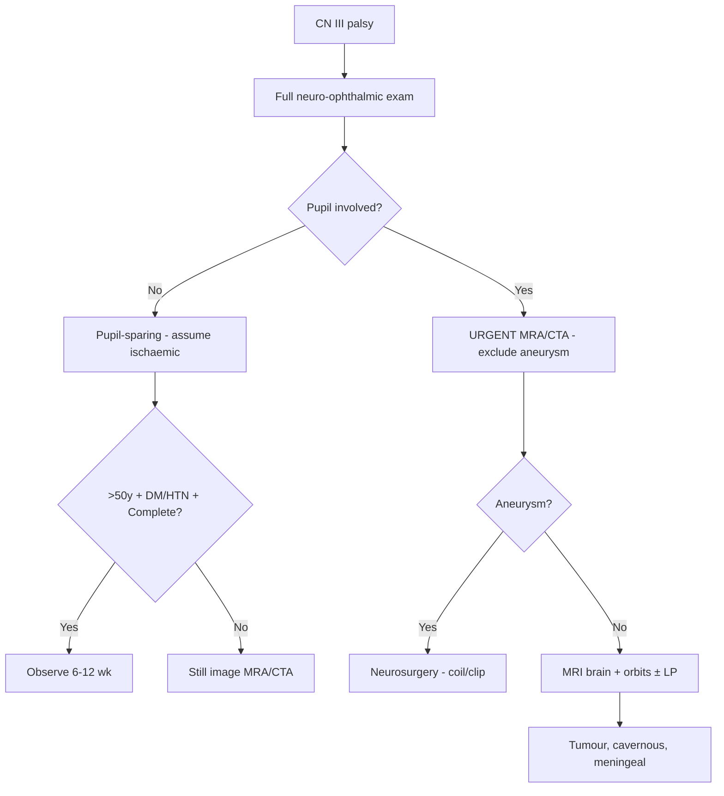
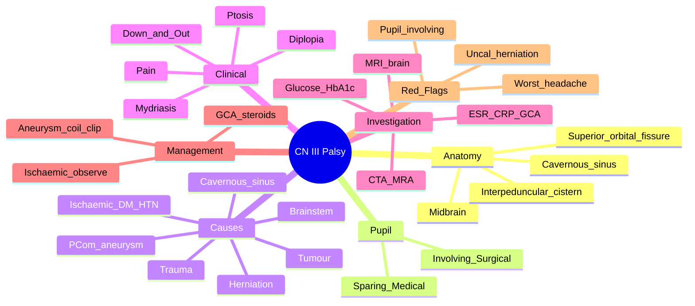

# Cranial Nerve III Palsy

Related: [[Cranial Nerve IV Palsy]], [[Cranial Nerve VI Palsy]], [[Pupillary Disorders]], [[Cavernous Sinus Thrombosis]]

> [!tip] **The Rule of the Pupil**
> **Pupil-Sparing CN III = Medical (microvascular: DM, HTN)** until proven otherwise.
> **Pupil-Involving CN III = Surgical (compressive: PCom aneurysm, uncal herniation, tumour)** until proven otherwise.
> Parasympathetic fibres run on the **outside** of CN III → compressed first; ischaemia spares them.

> [!tip] **CN III Anatomy** — Midbrain → interpeduncular cistern → tentorial edge → cavernous sinus (lateral wall) → superior orbital fissure → orbit. Functions: somatic motor (LPS, MR, IR, SR, IO) + parasympathetic (Edinger-Westphal → ciliary ganglion → pupil constrictor + ciliary muscle).

## Learning Objectives
- [ ] Classify CN III palsy by pupil involvement, aetiology, and anatomical level
- [ ] Differentiate pupil-sparing (medical) from pupil-involving (surgical)
- [ ] Recognise PCom aneurysm as the most critical surgical cause
- [ ] Localise lesion along CN III course
- [ ] Apply urgent imaging algorithm (MRA/CTA) for pupil-involving palsy
- [ ] Recognise aberrant regeneration signs

## 1. Definition / Epidemiology / Classification

### Definition
Dysfunction of the oculomotor nerve causing ptosis, ophthalmoplegia (eye "down and out"), and/or pupillary dilation.

### Epidemiology
- **Incidence:** ~5-10/100,000/year; 3rd most common isolated cranial neuropathy
- **Causes:** Ischaemic (microvascular) 30-40%, Aneurysm 10-15%, Trauma 10-15%, Tumour 10%, Undetermined 10-20%
- **Age:** Ischaemic in elderly (DM/HTN); Aneurysmal 40-70y; Congenital in children

### Classification
| Type | Key Features | Prognosis |
|------|--------------|-----------|
| **Pupil-sparing (ischaemic)** | Complete ptosis + ophthalmoplegia, normal pupil | Recovery 6-12 weeks |
| **Pupil-involving (compressive)** | Mydriasis + ophthalmoplegia ± ptosis | Urgent aneurysm exclusion |
| **Partial (incomplete)** | Some muscles spared | Good recovery |
| **Aberrant regeneration** | Lid elevation on downgaze, pupillary miosis on adduction | Suggests chronic compression |
| **Cyclic oculomotor palsy** | Spasm/palsy cycling; congenital | Rare |

## 2. Aetiology / Pathophysiology

### Aetiology
| Category | Causes |
|----------|--------|
| **Ischaemic (microvascular)** | **DM**, HTN, hyperlipidaemia, smoking, vasculitis (GCA, SLE) |
| **Compressive (aneurysm)** | **PCom aneurysm (most critical)**, basilar tip, PCA, ICA, cavernous carotid |
| **Tumour** | Pituitary adenoma, meningioma, craniopharyngioma, metastasis |
| **Trauma / Herniation** | Head injury; uncal herniation (ipsilateral blown pupil) |
| **Cavernous sinus** | Thrombosis, fistula (CCF), meningioma, Tolosa-Hunt |
| **Inflammatory** | TB/fungal meningitis, sarcoidosis, neurosyphilis |
| **Brainstem** | Weber (CN III + contralateral hemiparesis), Benedikt (CN III + ataxia), Nothnagel (CN III + ipsilateral cerebellar) |

### Pathophysiology

### Molecular/Genetic Basis
- PCom aneurysm associations: **ADPKD**, Ehlers-Danlos, fibromuscular dysplasia
- **NF1:** Sphenoid wing dysplasia → CN III compression
- GCA: Ganglion infarction

## 3. Clinical Features

### History
- **Onset:** Sudden (aneurysm, ischaemia) vs Gradual (tumour)
- **Diplopia:** Horizontal, vertical, oblique
- **Ptosis:** May be first sign (LPS weakness)
- **Pain:** Severe → aneurysm; periorbital → cavernous sinus
- **Red flags:** "Worst headache" → SAH; ↓consciousness → herniation

### Examination
| Domain | Finding | Localisation |
|--------|---------|--------------|
| **Ptosis** | LPS weakness | CN III nucleus or fascicle |
| **Eye position** | "Down and out" (unopposed LR + SO) | CN III |
| **Pupil** | Mydriasis, ↓light reflex, RAPD absent | Parasympathetic |
| **Accommodation** | Loss of accommodation | Parasympathetic |
| **Aberrant regeneration** | Lid elevation on downgaze, pupil miosis on adduction | Chronic compression |
| **Other CNs** | IV, V1, V2 (cavernous); contralateral hemiparesis (Weber) | Localisation |

### Specific Syndromes
| Syndrome | Features | Localisation |
|----------|----------|--------------|
| **Weber** | Ipsilateral CN III + contralateral hemiparesis | Midbrain base (cerebral peduncle) |
| **Benedikt** | Ipsilateral CN III + contralateral ataxia/tremor | Midbrain tegmentum (red nucleus) |
| **Nothnagel** | Ipsilateral CN III + ipsilateral cerebellar ataxia | Superior cerebellar peduncle |
| **Uncal herniation** | Ipsilateral blown pupil + contralateral hemiparesis | Medial temporal lobe |
| **Cavernous sinus** | Multiple CNs (III, IV, V1, V2, VI); VI in centre → isolated III spares VI | Cavernous sinus |

## 4. Diagnostic Approach / Algorithm

### Diagnostic Criteria
- **Ischaemic:** Complete ptosis + ophthalmoplegia + **normal pupil** + vasculopathy + age >50
- **Pupil-involving:** Any anisocoria >1mm with reduced light reflex → treat as aneurysm until excluded

### Pupil Assessment
- **Size:** Affected > Normal (mydriasis)
- **Light reflex:** Reduced/absent
- **Anisocoria:** >1mm in dim light significant
- **RAPD:** Absent (parasympathetic lesion)
- **Pharmacologic:** 1% pilocarpine → constricts (denervation hypersensitivity)

## 5. Investigations

### First-Line
| Investigation | Indication | Expected Finding |
|---------------|------------|------------------|
| **Capillary glucose, HbA1c** | All | Diabetic vasculopathy |
| **BP, lipid profile** | All | HTN, hyperlipidaemia |
| **ESR, CRP** | GCA suspicion (>50y, headache, jaw claudication) | Elevated in GCA |

### Neuroimaging
| Modality | Indication | Key Findings |
|----------|------------|--------------|
| **CT Head** | Acute, severe headache | SAH in basal cisterns |
| **CTA/MRA** | **URGENT for any pupil-involving palsy** | PCom aneurysm (5-7mm), basilar tip |
| **MRI Brain + Orbit + contrast** | Negative CTA/MRA, atypical, cavernous, brainstem | Tumour, demyelination, meningeal enhancement |
| **DSA** | Gold standard if high suspicion + negative CTA/MRA | Small aneurysm, vasculitis, dissection |

### Neurophysiology / CSF / Genetic
- Not routinely required
- **CSF** if meningitis, sarcoidosis, meningeal malignancy suspected
- **TAB** if GCA suspected (within 1-2 weeks of steroids)
- **ADPKD screen** if PCom aneurysm in young patient

## 6. Differential Diagnosis
| Differential | Distinguishing | Key Test |
|--------------|---------------|----------|
| **Myasthenia gravis** | Fatigable ptosis, fluctuating, pupil normal, no pain | Anti-AChR, MuSK, SFEMG |
| **CPEO** | Bilateral, progressive, no pupil involvement | Mitochondrial genetics, ragged red fibres |
| **Thyroid eye disease** | Proptosis, lid retraction (NOT ptosis), restrictive | Thyroid function, CT orbit |
| **INO** | Adduction deficit, abducting nystagmus, convergence preserved | MRI (MLF lesion) |
| **Skew deviation** | Vertical ocular tilt, brainstem | Otolith testing, MRI |

## 7. Management

### Emergency Management
| Situation | Immediate Action | Window |
|-----------|------------------|--------|
| **Pupil-involving CN III** | Urgent CTA/MRA → aneurysm screen | Hours |
| **PCom aneurysm rupture (SAH)** | Neurosurgery, nimodipine, BP control, ICU | Immediate |
| **Uncal herniation** | Mannitol/hypertonic saline, ICU, neurosurgery | Immediate |
| **GCA-related CN III** | High-dose IV methylprednisolone | Hours |

### Disease-Modifying Management
| Cause | Treatment | Dose/Regimen |
|-------|-----------|--------------|
| **Ischaemic (microvascular)** | Observation + risk factor control | Aspirin 75mg, statin, BP/glucose |
| **PCom aneurysm** | Endovascular coiling or neurosurgical clipping | Definitive |
| **Tumour** | Resection, RT, chemotherapy | MDT |
| **Cavernous sinus thrombosis** | IV antibiotics ± anticoagulation | Septic: broad-spectrum + metronidazole |
| **Tolosa-Hunt** | Corticosteroids | Prednisolone 60mg OD, taper 4-6 weeks |
| **Vasculitis (GCA)** | High-dose steroids | MP 1g IV ×3d → prednisolone 60mg |

### Symptomatic Management
- **Ptosis:** Patch, lubrication (prevent exposure keratopathy); avoid driving
- **Diplopia:** Alternate patch, prisms, botulinum toxin (rare)

### Surgical / Procedural
| Procedure | Indication | Notes |
|-----------|------------|-------|
| **Endovascular coiling** | PCom/basilar aneurysm | First-line |
| **Surgical clipping** | Aneurysm unsuitable for coiling | Craniotomy |
| **Strabismus surgery** | Persistent stable diplopia after 6-12 months | After recovery window |
| **Ptosis surgery** | Persistent ptosis | Levator resection, frontalis sling |

### Special Populations
- **Pregnancy:** MRI without gad; avoid radiation 1st trimester
- **Paediatric:** Consider congenital, tumour, migraine
- **Elderly:** GCA critical; aggressive risk factor control

## 8. Drug Interactions / Contraindications
| Drug | Caution | Management |
|------|---------|------------|
| **Nimodipine (SAH)** | Hypotension | Titrate, IV fluids |
| **High-dose steroids (GCA)** | DM, HTN, osteoporosis, PJP | PPI, bisphosphonates, PJP prophylaxis |
| **Statins** | LFTs, myopathy | Baseline LFT, CK monitoring |
| **Aspirin** | GI bleeding | PPI cover |

## 9. Procedures
- **Lumbar puncture:** Suspected meningitis, SAH (CT negative)
- **Temporal artery biopsy:** GCA suspicion — within 1-2 weeks of steroids
- **Cerebral angiography:** Gold standard aneurysm detection

## 10. Complications
| Complication | Frequency | Prevention |
|--------------|-----------|------------|
| **Exposure keratopathy** | Common (severe ptosis) | Lubrication, taping, moisture chamber |
| **Permanent diplopia** | 10-20% (ischaemic) | Strabismus surgery, prisms |
| **Aneurysm rupture** | 30-40%/year unruptured PCom | Urgent intervention |
| **SAH mortality** | 35-50% | Nimodipine, ICU |
| **Vision loss** | Rare | Globe protection |
| **Amblyopia (paediatric)** | Significant | Early patching |

## 11. Red Flags / Emergencies
| Red Flag | Immediate Action | Window |
|----------|------------------|--------|
| **Any pupil involvement** | **Urgent CTA/MRA** | Hours |
| **"Worst headache of life"** | CT → LP if negative → CTA | Immediate |
| **Decreased consciousness** | ICU, neurosurgery, CT | Immediate |
| **Bilateral CN III palsy** | MRI brainstem + LP (GBS, infection) | Urgent |
| **Painful CN III in young** | CTA (aneurysm even if pupil-sparing) | Urgent |
| **GCA features (age>50, jaw claudication)** | High-dose steroids | Same day |

## 12. Prognosis
| Factor | Good | Poor |
|--------|------|------|
| **Cause** | Ischaemic | Aneurysm rupture, tumour |
| **Pupil** | Spared | Involved |
| **Onset** | Sudden, isolated | Progressive, with other signs |
| **Recovery** | 6-12 weeks (ischaemic); 70-80% complete | Persistent deficit |

- **Ischaemic CN III:** 70-80% complete recovery 6-12 weeks
- **PCom aneurysm (unruptured):** Good if treated; rupture mortality 30-50%
- **Traumatic CN III:** Slow, often incomplete; aberrant regeneration common

## 13. Topic Correlation
| Related Topic | Overlap |
|---------------|---------|
| [[Cranial Nerve IV Palsy]] | SO palsy → extorsion; vertical diplopia worse on downgaze |
| [[Cranial Nerve VI Palsy]] | LR palsy; horizontal diplopia; "false localising" in raised ICP |
| [[Pupillary Disorders]] | Adie, Argyll-Robertson, Horner — different mechanisms |
| [[Cavernous Sinus Thrombosis]] | Multiple CNs (III, IV, V1, V2, VI) — proptosis, chemosis |
| [[PCom Aneurysm]] | Most critical surgical cause |

## 14. Special Situations
| Situation | Consideration |
|-----------|---------------|
| **Pregnancy** | MRI without gad; avoid radiation 1st trimester; safe: levetiracetam, labetalol |
| **Paediatric** | Congenital, tumour, post-viral; image more readily |
| **Elderly** | GCA on differential; aggressive risk factor control |
| **Driving (DVLA)** | Must notify; cease driving until diplopia resolved (often 6 months) |
| **Occupational** | Pilots, commercial drivers, surgeons — strict vision requirements |

## FCPS/MRCP High-Yield Summary
| Category | Key Points |
|----------|------------|
| **Definition** | CN III dysfunction: ptosis + "down and out" eye ± mydriasis |
| **Pupil Rule** | Sparing = Medical; Involving = Surgical |
| **PCom Aneurysm** | Most critical compressive cause; urgent CTA/MRA |
| **Anatomy** | Parasympathetic peripheral → compressed first |
| **Cavernous Sinus** | CN III alone early; VI usually first |
| **Ischaemic** | DM, HTN, vasculitis; complete ptosis + ophthalmoplegia, pupil spared |
| **Brainstem** | Weber (CN III + contralateral hemiparesis), Benedikt (CN III + ataxia) |
| **Viva Pearls** | "Pupil-sparing = medical"; "1% pilocarpine constricts CN III pupil" |
| **Drugs** | Prednisolone 60mg (GCA), MP 1g IV ×3d, Nimodipine 60mg 4H |
| **Imaging** | CTA/MRA for all pupil-involving; MRI for brainstem/cavernous |

## Viva Questions
1. **Q:** Classify CN III palsy by pupil involvement and list causes.
   **A:** Pupil-sparing = ischaemic (DM, HTN); Pupil-involving = compressive (PCom aneurysm, tumour, herniation).
2. **Q:** Why is pupil spared in ischaemic CN III palsy?
   **A:** Parasympathetic fibres are peripheral, supplied by pial vessels; ischaemia affects central motor fascicles.
3. **Q:** Most critical cause of pupil-involving CN III palsy?
   **A:** Posterior communicating artery aneurysm.
4. **Q:** Brainstem syndromes involving CN III?
   **A:** Weber (midbrain base + hemiparesis), Benedikt (tegmentum + ataxia), Nothnagel (SCP + cerebellar).
5. **Q:** Cavernous sinus CN III palsy features?
   **A:** Multiple CNs (IV, V1, V2, VI); ± Horner; orbital pain; proptosis.
6. **Q:** Distinguish CN III palsy from MG?
   **A:** MG: pupil always spared, fatigable, fluctuating, no pain; AChR antibodies, SFEMG.
7. **Q:** Aberrant regeneration significance?
   **A:** Misdirected regrowth — lid elevation on downgaze, pupil miosis on adduction; chronic compression (aneurysm, tumour, cavernous).
8. **Q:** First-line investigation in pupil-involving CN III palsy?
   **A:** **Urgent CTA or MRA** to exclude PCom aneurysm.
9. **Q:** Management of GCA-related CN III palsy?
   **A:** **IV MP 1g ×3d** then prednisolone 60mg + temporal artery biopsy.
10. **Q:** Recovery time for ischaemic CN III palsy?
    **A:** 6-12 weeks in 70-80%; near-complete recovery.
11. **Q:** Pharmacological test for CN III palsy?
    **A:** 1% pilocarpine → constricts denervated pupil (supersensitivity).
12. **Q:** Differential for unilateral dilated pupil?
    **A:** CN III palsy, Adie pupil, atropine, traumatic iridoplegia, iris sphincter rupture.

## Common Confusions / Exam Traps
| Confusion | Clarification |
|-----------|---------------|
| **Painful CN III = always aneurysm** | Pain can occur in ischaemic; pupil is key discriminator |
| **Pupil-sparing = always microvascular** | ~10% of PCom aneurysms pupil-sparing initially; complete palsy + normal pupil in DM + age >50 is reassuring |
| **Isolated CN III in cavernous sinus** | Can occur early; VI usually first affected |
| **Ptosis in CN III** | LPS only — not orbicularis (CN VII); severe = complete palsy |
| **Aberrant regeneration is benign** | **Always** investigate — tumour, aneurysm, cavernous lesion |

## Mnemonics
1. **"LMN 4 LR6"** — CN III innervates **LR SO (LPS, MR, IR, SR, IO)** all except LR (CN VI) and SO (CN IV)
2. **"PCom squeezes Parasympathetics"** — Compressive CN III = pupil-involving
3. **"PCOM"** — **P**ainful, **C**omplete palsy, **O**lder, **M**ydriasis → aneurysm
4. **"Down and Out"** — CN III palsy eye position

## Mind Map

## One-Page Revision Card
| Topic | **CN III Palsy** |
|-------|------------------|
| **Definition** | Oculomotor nerve dysfunction: ptosis + "down and out" eye ± mydriasis |
| **Key Clinical** | Ptosis, "down and out", diplopia, ± mydriasis |
| **Pupil Rule** | Sparing = Medical; Involving = Surgical |
| **Differentials** | MG, CPEO, TED, INO, skew deviation |
| **Investigations** | Glucose, HbA1c, BP, ESR/CRP; **CTA/MRA for pupil-involving**; MRI for cavernous/brainstem |
| **Management (Steps)** | 1. ABCDE 2. Pupil assessment 3. Urgent CTA if pupil involved 4. Aneurysm Rx 5. Treat cause |
| **Key Drugs** | Prednisolone 60mg (GCA); MP 1g IV ×3d; Nimodipine 60mg 4H |
| **Red Flags** | Pupil-involving; "worst headache"; ↓consciousness; GCA features |
| **Prognosis** | Ischaemic: 70-80% recovery 6-12 weeks; Aneurysm Rx good if unruptured |
| **Mnemonics** | "LMN 4 LR6"; "PCOM = Painful, Complete, Older, Mydriasis" |

## MCQs (10)

1. **Q:** 65y diabetic with sudden ptosis, "down and out" eye, normal pupils. Most likely cause?
   **Options:** A. PCom aneurysm  B. Microvascular ischaemia  C. Brainstem stroke  D. Myasthenia
   **Answer:** B
   **Explanation:** Classic pupil-sparing CN III in elderly diabetic = microvascular ischaemia.

2. **Q:** Which feature most suggests compressive CN III palsy?
   **Options:** A. Sudden onset  B. Pain  C. Mydriasis  D. Ptosis
   **Answer:** C
   **Explanation:** Pupil involvement = peripheral parasympathetic compression = PCom aneurysm or tumour.

3. **Q:** In CN III, parasympathetic fibres are located:
   **Options:** A. Centrally  B. Peripherally  C. In cavernous sinus only  D. In midbrain nucleus
   **Answer:** B
   **Explanation:** Parasympathetic peripheral → compressed first; ischaemia (central) spares them.

4. **Q:** CN III palsy with ipsilateral blown pupil + ↓consciousness. Diagnosis?
   **Options:** A. PCom aneurysm  B. Uncal herniation  C. Cavernous sinus thrombosis  D. Weber syndrome
   **Answer:** B
   **Explanation:** Uncal herniation compresses CN III → blown pupil + contralateral hemiparesis.

5. **Q:** First-line investigation in pupil-involving CN III palsy?
   **Options:** A. MRI brain  B. CT head  C. CTA/MRA brain  D. LP
   **Answer:** C
   **Explanation:** Urgent CTA/MRA to exclude PCom aneurysm; MRI may miss small aneurysms.

6. **Q:** Aberrant regeneration of CN III is associated with:
   **Options:** A. Ischaemic palsy  B. Cavernous sinus lesions  C. Migraine  D. Myasthenia
   **Answer:** B
   **Explanation:** Aberrant regrowth suggests chronic compression — cavernous sinus, aneurysm, tumour.

7. **Q:** GCA presenting with CN III palsy requires:
   **Options:** A. Aspirin  B. High-dose IV methylprednisolone  C. Anticoagulation  D. Surgical decompression
   **Answer:** B
   **Explanation:** GCA = ophthalmologic emergency; IV MP 1g ×3d to prevent fellow eye and vision loss.

8. **Q:** Pharmacological test for CN III palsy:
   **Options:** A. 0.5% pilocarpine  B. 1% pilocarpine  C. 10% phenylephrine  D. 1% atropine
   **Answer:** B
   **Explanation:** 1% pilocarpine constricts denervated pupil (supersensitivity); 0.5% differentiates Adie.

9. **Q:** 30y woman with painful CN III palsy and 2mm anisocoria. Next step?
   **Options:** A. Observe  B. Glucose check  C. Urgent CTA/MRA  D. Trial of steroids
   **Answer:** C
   **Explanation:** Any pupil involvement in young patient (no microvascular RF) requires urgent aneurysm exclusion.

10. **Q:** Weber syndrome involves CN III palsy with:
    **Options:** A. Ipsilateral ataxia  B. Contralateral hemiparesis  C. Ipsilateral tremor  D. Contralateral facial palsy
    **Answer:** B
    **Explanation:** Weber = midbrain base lesion (CN III fascicle + corticospinal tract) → ipsilateral CN III + contralateral hemiparesis.

## SBA Questions (10)

1. **Scenario:** 70M, DM/HTN, sudden ptosis, "down and out" eye, 1mm anisocoria (pupil reacts), painful.
   **Question:** Next step?
   **Options:** A. Urgent CTA  B. MRI  C. Observe  D. Aspirin + statin  E. LP
   **Answer:** C
   **Explanation:** Pupil-sparing (<1mm, reactive) in elderly diabetic = ischaemic; observe with risk factor control.

2. **Scenario:** 55F, sudden severe headache ("worst ever"), vomiting, photophobia, right ptosis with 4mm fixed dilated pupil.
   **Question:** Most likely diagnosis?
   **Options:** A. Migraine  B. Cluster headache  C. PCom aneurysm rupture  D. Pituitary apoplexy  E. Bacterial meningitis
   **Answer:** C
   **Explanation:** SAH + pupil-involving CN III palsy = PCom aneurysm rupture.

3. **Scenario:** 60M, isolated left CN III palsy, normal MRI/MRA, no DM/HTN, no pain. ESR 90.
   **Question:** Next step?
   **Options:** A. CT chest  B. High-dose steroids + TAB  C. Repeat MRI  D. LP  E. ACE
   **Answer:** B
   **Explanation:** Age >50 + ↑ESR + cranial neuropathy = GCA until proven otherwise; treat empirically.

4. **Scenario:** 35F, sudden painful left CN III palsy, 3mm pupil involvement, MRA negative, MRI shows cavernous sinus mass.
   **Question:** Most likely?
   **Options:** A. Tolosa-Hunt  B. CCF  C. Meningioma  D. Pituitary apoplexy  E. Cavernous sinus thrombosis
   **Answer:** C
   **Explanation:** Cavernous sinus mass = meningioma most common.

5. **Scenario:** 40M, head trauma, bilateral fixed dilated pupils, GCS 4.
   **Question:** Cause of pupils?
   **Options:** A. Bilateral CN III palsy  B. Brain death  C. Optic nerve avulsion  D. Adie pupils  E. Anticholinergic toxicity
   **Answer:** B
   **Explanation:** Bilateral fixed dilated + GCS 4 post-trauma = severe diffuse brain injury/impending brain death.

6. **Scenario:** 25F, new bilateral CN III palsy, areflexia, ascending weakness 2 weeks post-GI infection.
   **Question:** Diagnosis?
   **Options:** A. MG  B. Miller Fisher  C. Botulism  D. Wernicke  E. MS
   **Answer:** B
   **Explanation:** Miller Fisher = GBS variant with ophthalmoplegia, ataxia, areflexia; post-infectious.

7. **Scenario:** 50M, 6-month progressive ptosis, "down and out" eye, episodic forehead sweating; lid elevation on downgaze.
   **Question:** Diagnosis?
   **Options:** A. Microvascular  B. Aberrant regeneration  C. MG  D. CPEO  E. Cyclic CN III
   **Answer:** B
   **Explanation:** Aberrant regeneration = chronic compression; urgent imaging needed.

8. **Scenario:** 28F, painful left CN III palsy, 1 month post-partum, MRI/CTA normal. CSF: lymphocytic pleocytosis, ↑protein.
   **Question:** Next investigation?
   **Options:** A. Repeat MRI  B. AQP4 antibody  C. MOG antibody  D. Chest CT  E. Brain biopsy
   **Answer:** B
   **Explanation:** Inflammatory CSF + CN III palsy in postpartum = NMO spectrum disorder; AQP4-IgG testing.

9. **Scenario:** 8M, recurrent episodes of left eye "going up" with miosis and ptosis lasting 1-2 minutes, multiple times daily since birth.
   **Question:** Diagnosis?
   **Options:** A. CN III neuroma  B. Cyclic oculomotor palsy  C. Migraine equivalent  D. Focal seizures  E. Blepharospasm
   **Answer:** B
   **Explanation:** Congenital cyclic oculomotor palsy = rare; cycles of palsy and "spasm".

10. **Scenario:** 65M, 3 weeks after starting fingolimod for MS, blurred vision, painful right eye, RAPD, partial CN III palsy.
    **Question:** Most likely cause?
    **Options:** A. MS relapse  B. Fingolimod macular oedema  C. Crypto infection  D. NAION  E. Migraine
    **Answer:** B
    **Explanation:** Fingolimod causes macular oedema; OCT helps differentiate from optic neuritis.

## Flashcards
- **Q:** Rule of the pupil in CN III palsy?
  **A:** Sparing = Medical (microvascular); Involving = Surgical (compressive).
- **Q:** Why are parasympathetic fibres spared in ischaemic CN III palsy?
  **A:** Peripheral, supplied by pial vessels; ischaemia affects central motor fascicles.
- **Q:** Most critical surgical cause of pupil-involving CN III palsy?
  **A:** Posterior communicating artery aneurysm.
- **Q:** What is aberrant regeneration?
  **A:** Misdirected regrowth of CN III — lid elevation on downgaze, pupil miosis on adduction.
- **Q:** First investigation for pupil-involving CN III palsy?
  **A:** Urgent CTA or MRA brain to exclude PCom aneurysm.
- **Q:** Classic triad of CN III palsy?
  **A:** Ptosis, "down and out" eye, ± mydriasis.
- **Q:** What is Weber syndrome?
  **A:** Midbrain base lesion → ipsilateral CN III + contralateral hemiparesis.
- **Q:** Drug to test CN III palsy pupil?
  **A:** 1% pilocarpine → constricts denervated pupil.
- **Q:** Cavernous sinus CN III palsy features?
  **A:** Multiple CNs (III, IV, V1, V2, VI); ± Horner; proptosis; pain.
- **Q:** GCA management with CN III palsy?
  **A:** IV MP 1g ×3d → prednisolone 60mg + temporal artery biopsy.
- **Q:** Recovery time for ischaemic CN III palsy?
  **A:** 6-12 weeks in 70-80%.
- **Q:** Differential of unilateral dilated pupil?
  **A:** CN III palsy, Adie, atropine, trauma, iris sphincter rupture.

## Answer Key with Explanations

### MCQs
1. **B** — Pupil-sparing in elderly diabetic = ischaemic
2. **C** — Pupil involvement = compression
3. **B** — Parasympathetic peripheral
4. **B** — Uncal herniation
5. **C** — CTA/MRA for aneurysm
6. **B** — Aberrant regeneration = chronic compression
7. **B** — IV MP for GCA
8. **B** — 1% pilocarpine
9. **C** — Urgent aneurysm exclusion in young
10. **B** — Weber: contralateral hemiparesis

### SBAs
1. **C** — Pupil-sparing ischaemic — observe
2. **C** — PCom aneurysm rupture
3. **B** — GCA — high-dose steroids
4. **C** — Cavernous sinus mass
5. **B** — Brain death
6. **B** — Miller Fisher
7. **B** — Aberrant regeneration
8. **B** — AQP4 testing
9. **B** — Cyclic CN III palsy
10. **B** — Fingolimod macular oedema
