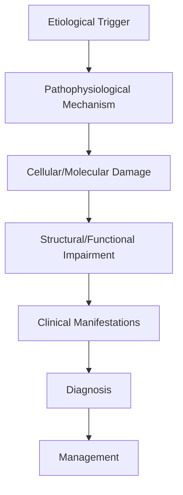

# Cranial Nerve IV Palsy

> [!tip] **High-Yield Definition**
> Comprehensive clinical note for Cranial Nerve IV Palsy covering definition, epidemiology, aetiology, pathophysiology, clinical features, investigations, differential diagnosis, management, drug interactions, procedures, complications, red flags, prognosis, topic correlation, and special situations for FCPS/MRCP examination preparation based on Davidson 24th Edition Chapter 25: Neurology.

---

## 1. Definition / Epidemiology / Classification

### Definition
Cranial Nerve IV Palsy is a neurological disorder within the 17 neuroophthalmology category. It is characterised by specific clinical, pathological, radiological, and laboratory features that allow differentiation from related conditions.

### Epidemiology
- **Incidence/Prevalence:** Variable depending on the specific condition.
- **Age:** Adult onset is most common, but paediatric and elderly presentations occur.
- **Sex:** Variable depending on the condition.
- **Geography:** Worldwide distribution, with higher prevalence in certain regions.
- **Risk Factors:** Genetic predisposition, environmental factors, comorbidities, family history.

### Classification
| Subtype | Key Features | Prognosis |
|---------|-------------|-----------|
| Mild/early | Subtle symptoms, preserved function | Best |
| Moderate | Clear symptoms, functional impairment | Variable |
| Severe | Significant disability, complications | Worst |

---

## 2. Aetiology / Pathophysiology

### Aetiology
- **Primary (idiopathic):** Most cases have no identifiable cause.
- **Genetic:** May be inherited (AD, AR, X-linked, mitochondrial, sporadic).
- **Autoimmune:** Autoantibodies, immune-mediated inflammation.
- **Infectious:** Viral, bacterial, fungal, parasitic.
- **Metabolic:** Electrolyte, endocrine, hepatic, renal, nutritional.
- **Toxic:** Drugs, alcohol, heavy metals, environmental toxins.
- **Vascular:** Ischaemia, haemorrhage, vasculitis.
- **Neoplastic:** Primary, secondary, paraneoplastic.
- **Traumatic:** Acute, chronic, repetitive.
- **Degenerative:** Neurodegeneration, protein misfolding.

### Pathophysiology


---

## 3. Clinical Features

### History
- **Onset/Duration:** Acute, subacute, or chronic.
- **Progression:** Static, progressive, relapsing-remitting, stepwise.
- **Key symptoms:** Specific to the condition.
- **Triggers:** Stress, infection, trauma, drugs, hormonal, environmental.
- **Systemic symptoms:** Constitutional features.
- **Drug/Family/Social history:** Relevant exposures, comorbidities.

### Examination
| Domain | Key Findings | Localisation Value |
|--------|-------------|-------------------|
| Higher function | Cognitive, behavioural | Cortical, subcortical, limbic |
| Cranial nerves | Pupils, eye movements, facial, bulbar | Brainstem, cranial nerve, NMJ |
| Motor | Weakness, tone, reflexes | UMN, LMN, NMJ, muscle |
| Sensory | All modalities, pattern | Peripheral, spinal, brainstem |
| Coordination | Ataxia, nystagmus, dysmetria | Cerebellar, sensory, vestibular |
| Gait | Spastic, ataxic, parkinsonian | Multiple |
| Autonomic | Orthostatic, sweating, GI, bladder | Autonomic, peripheral, central |

### Specific Clinical Features
The clinical features are determined by the underlying aetiology, location of pathology, and rate of progression. Patients typically present with a constellation of symptoms and signs that allow clinical localisation and subsequent targeted investigation.

---

## 4. Diagnostic Approach / Algorithm

```mermaid
flowchart TD
    A[Clinical Presentation] --> B[Anatomical Localisation]
    B --> C[Pathophysiological Category]
    C --> D[Formulate Differential]
    D --> E[Targeted Investigations]
    E --> F[Confirm Diagnosis]
    F --> G[Assess Severity/Prognosis]
    G --> H[Initiate Management]
    H --> I[Monitor Response]
    I --> J{Response?}
    J --> YES1 [Good - Continue]
    J --> NO1 [Poor - Escalate]
    YES1 --> K[Monitor]
    NO1 --> H
```

---

## 5. Investigations

### First-Line Investigations
- **Blood tests:** FBC, U&Es, LFTs, glucose, calcium, magnesium, ESR, CRP, autoimmune, infection.
- **Imaging:** CT/MRI brain/spine (essential for most neurological conditions).
- **Neurophysiology:** EEG, nerve conduction, EMG, evoked potentials.
- **CSF:** Cell count, protein, glucose, OCBs, PCR, culture.

### Second-Line Investigations
- **Genetic testing:** Gene panels, WES, WGS.
- **Antibody testing:** Antineuronal, autoimmune, paraneoplastic.
- **Biopsy:** Nerve, muscle, brain, skin.
- **Advanced imaging:** PET-CT, MR spectroscopy, fMRI.

### Specialised Investigations
- **Biomarkers:** Neurofilament light chain, tau, beta-amyloid, 14-3-3, RT-QuIC.
- **Autonomic testing:** Head-up tilt, sudomotor, QSART.
- **Neuropsychology:** Cognitive testing, behavioural assessment.
- **Genetic counselling:** Family screening, predictive testing.

---

## 6. Differential Diagnosis

| Differential | Distinguishing Features | Key Test |
|--------------|------------------------|----------|
| Vascular | Sudden onset, focal, vascular risk factors | MRI/CT, vessel imaging |
| Inflammatory | Subacute, multifocal, systemic | MRI, CSF, antibodies |
| Infectious | Fever, systemic, exposure | Bloods, CSF, imaging |
| Neoplastic | Progressive, mass effect | MRI, biopsy |
| Degenerative | Progressive, symmetric, hereditary | MRI, genetic |
| Toxic/Metabolic | Drug history, systemic, reversible | Bloods, toxicology |
| Autoimmune | Multifocal, antibodies, immunotherapy response | Antibodies, MRI, CSF |
| Functional | Inconsistent, distractible | Clinical, video, biomarkers |

---

## 7. Management

### Acute Management
- **Stabilisation:** ABCDE approach, emergency resuscitation.
- **Specific treatment:** Disease-specific interventions.
- **Symptomatic relief:** Pain, seizures, spasticity, autonomic dysfunction.
- **Prevention of complications:** DVT, pressure sores, infection.

### Disease-Modifying Treatment
- **Pharmacological:** First-line, second-line, escalation, maintenance.
- **Procedural:** Surgery, biopsy, drainage, ablation, stimulation.
- **Immunotherapy:** Steroids, IVIG, plasma exchange, immunosuppressants, biologics.
- **Rehabilitation:** Physiotherapy, OT, speech therapy.

### Long-Term Management
- **Monitoring:** Clinical, imaging, biomarkers, side effects.
- **Prevention:** Vaccinations, prophylaxis, lifestyle modification.
- **Supportive care:** Multidisciplinary team, social work, psychological support.
- **Palliative care:** Advanced care planning, end-of-life care, hospice.

---

## 8. Drug Interactions / Contraindications / Comorbidity Cautions

| Drug Class | Interaction / Caution | Management |
|------------|----------------------|------------|
| Antiseizure medications | Enzyme induction, teratogenicity | Monitor, supplement, switch |
| Immunosuppressants | Infection, malignancy, teratogenicity | Monitor, prophylaxis |
| Anticoagulants | Bleeding risk, drug interactions | Monitor INR, avoid combinations |
| Antihypertensives | Hypotension, falls | Monitor BP, adjust dose |
| Antibiotics | Nephrotoxicity, ototoxicity | Monitor renal |
| Antivirals | Nephrotoxicity, neuropsychiatric | Monitor renal, dose adjust |
| Steroids | DM, HTN, osteoporosis, infection | Monitor, prophylaxis, taper |
| Biologics | Infusion reactions, infection | Monitor, prophylaxis |

---

## 9. Procedures

### Common Procedures
- **Lumbar puncture:** Diagnostic, therapeutic (IIH, NPH). Contraindications: raised ICP, mass lesion, coagulopathy.
- **Nerve conduction studies/EMG:** Diagnostic, prognosis. Minor discomfort.
- **EEG:** Diagnostic, monitoring. No significant complications.
- **MRI brain/spine:** Diagnostic, monitoring. Contraindications: pacemaker, metallic implants.
- **CT head:** Emergency, rapid. Radiation exposure, contrast reactions.
- **Biopsy:** Stereotactic, open. Indications: diagnosis, molecular profiling.

---

## 10. Complications

| Complication | Frequency | Prevention | Management |
|--------------|-----------|------------|------------|
| Infection | Common | Hygiene, prophylaxis, vaccination | Antibiotics, antifungals |
| Thrombosis | Common | Prophylaxis, mobility | Anticoagulation |
| Pressure sores | Common | Positioning, nutrition | Wound care, surgery |
| Spasticity | Common | Positioning, stretching | Baclofen, BoNT |
| Contractures | Common | Passive movements, splints | Physiotherapy, surgery |
| Aspiration | Common | Swallow assessment | NGT, PEG, thickeners |
| Falls | Common | Environment, mobility | Walking aids |
| Fractures | Common | Bone health, prevention | Vitamin D, bisphosphonate |
| Depression | Common | Screening, support | Antidepressants, CBT |
| Cognitive decline | Variable | Monitoring, training | Rehabilitation |
| Autonomic dysfunction | Variable | Monitoring, hydration | Midodrine, fludrocortisone |
| Respiratory failure | Variable | Monitoring, supportive | Ventilation, NIV |
| Death | Variable | Monitoring, palliative | End-of-life care |

---

## 11. Red Flags / Emergencies

### Emergency Presentations
- **Rapid neurological deterioration:** New focal deficit, decreased consciousness, seizures.
- **Status epilepticus:** Continuous seizures >5 min.
- **Raised ICP:** Headache, vomiting, papilloedema, altered consciousness.
- **Respiratory failure:** Hypoxia, hypercapnia, ventilatory failure.
- **Cardiac arrest:** Arrhythmia, MI, pulmonary embolism.
- **Infection:** Sepsis, meningitis, abscess, encephalitis.
- **Drug toxicity:** Overdose, side effects, interactions.
- **Haemorrhage:** Intracranial, systemic, coagulopathy.

---

## 12. Prognosis

### Natural History
- **Acute:** May resolve with treatment, may progress, may be fatal.
- **Subacute:** Variable, depends on cause and treatment.
- **Chronic:** Often progressive, may be stable, may have relapses.
- **Recovery:** Variable, may be complete, partial, or none.

### Prognostic Factors
- **Favourable:** Young age, early treatment, mild disease, reversible cause, good premorbid function, family support.
- **Unfavourable:** Older age, delayed treatment, severe disease, irreversible cause, poor premorbid function, comorbidities.

---

## 13. Topic Correlation

| Related Topic | Link | Key Overlap |
|---------------|------|-------------|
| Davidson 24th Ed Chapter 25 | [[Davidson Chapter 25 - Neurology Hierarchy]] | Comprehensive neurology |
| Neurology MOC | [[Neurology MOC]] | All neurology topics |
| Drug Reference | [[../00_Index/Neurology Drug Reference]] | Medications |
| Local Hub | [[../17_Neuroophthalmology/Hub]] | Section-specific |
| Clinical Examination | [[../01_Fundamentals_Examination/Neurological History Taking]] | Clinical approach |
| Investigation | [[../01_Fundamentals_Examination/Neuroimaging (CT-MRI) Principles]] | Imaging |

---

## 14. Special Situations

| Situation | Consideration |
|-----------|---------------|
| **Pregnancy** | Pre-conception counselling, teratogenicity, drug safety, monitoring, delivery planning, breastfeeding. |
| **Lactation** | Drug safety, breastfeeding, monitoring, support. |
| **Paediatric** | Developmental considerations, drug dosing, school, family, vaccination, growth, puberty. |
| **Elderly / Frail** | Comorbidities, polypharmacy, falls, bone health, cognition, social, end-of-life. |
| **Renal impairment** | Drug dose adjustment, monitoring, dialysis, transplant. |
| **Hepatic impairment** | Drug dose adjustment, monitoring, transplant. |
| **Immunocompromised** | Infection prophylaxis, vaccination, drug interactions, malignancy screening. |
| **Perioperative** | Drug management, anaesthesia planning, VTE prophylaxis, infection prevention, monitoring. |
| **Driving / DVLA** | Fitness to drive, restrictions, notification, reassessment. |
| **Occupational** | Fitness for work, adaptations, rehabilitation, disability, return to work. |

---

## FCPS/MRCP High-Yield Summary

| Category | Key Points |
|----------|------------|
| **Definition** | Comprehensive definition with key diagnostic criteria |
| **Epidemiology** | Incidence, prevalence, age, sex, geography, risk factors |
| **Aetiology** | Primary causes, secondary causes, genetic, environmental |
| **Pathophysiology** | Mechanism of disease, cellular/molecular basis |
| **Clinical Features** | History, examination, key findings, variants |
| **Diagnosis** | Diagnostic criteria, classification, severity |
| **Investigations** | First-line, second-line, specialised, biomarkers |
| **Differential Diagnosis** | Key differentials, distinguishing features, tests |
| **Management** | Acute, disease-modifying, symptomatic, supportive |
| **Complications** | Common, serious, prevention, management |
| **Prognosis** | Natural history, prognostic factors, outcomes |
| **Viva Pearls** | Key examination points |
| **Drug Doses** | First-line, second-line, emergency |
| **Scoring Systems** | Specific scores used in management |
| **Genetics** | Inheritance, genes, mutations, family screening |
| **Imaging Signs** | Characteristic findings, differential |

---

## Viva Questions (PACES/FCPS Style)

1. **Q:** Define and classify its variants.
   **A:** Comprehensive definition with classification of subtypes based on aetiology, severity, and clinical features.

2. **Q:** What are the key clinical features?
   **A:** Specific symptoms and signs including onset, progression, key features, and associated findings.

3. **Q:** What is the first-line treatment?
   **A:** First-line pharmacological and non-pharmacological management based on current evidence.

4. **Q:** What are the red flags requiring urgent referral?
   **A:** Specific emergency presentations and complications requiring immediate intervention.

5. **Q:** What is the prognosis?
   **A:** Natural history, prognostic factors, and long-term outcomes.

6. **Q:** How do you differentiate from key differentials?
   **A:** Clinical features, investigations, and response to treatment that distinguish from alternative diagnoses.

7. **Q:** What investigations are most useful?
   **A:** First-line and second-line investigations including imaging, neurophysiology, CSF, and biomarkers.

8. **Q:** Describe the stepwise management approach.
   **A:** Stepwise escalation from first-line to second-line to third-line therapy with monitoring.

9. **Q:** What are the emergency presentations?
   **A:** Specific emergency scenarios and immediate management priorities.

10. **Q:** How does management change in pregnancy/paediatrics/elderly?
    **A:** Special considerations for each population including drug safety, monitoring, and support.

---

## Common Confusions / Exam Traps

| Confusion | Clarification |
|-----------|---------------|
| Similar presentation but different cause | Differentiate by history, examination, investigations |
| Treatment response vs natural history | Assess with objective measures, biomarkers |
| Drug interactions | Check each drug, monitor, adjust doses |
| Disease progression vs treatment failure | Monitor response, escalate appropriately |
| Functional vs organic | Inconsistent, distractible, disability greater than impairment |
| Acute vs chronic | Time course, progression, reversibility |
| Primary vs secondary | Underlying cause, contributing factors |
| Side effects vs symptoms | Temporal relationship, dose relationship |

---

## Mnemonics
1. ****CN4 SOP** = **S**uperior oblique, only cranial nerve to **d**ecussate (exit dorsally), only one with **L**ongest intracranial course**
2. ****TROCHLEAR-TILT** = Bielschowsky head tilt test (paralysed side up = worse)**
3. ****TRAUMA-MICROVASC** = Trauma most common acquired; microvascular (DM, HTN) common in adults**

---

## Mind Map

```mermaid
mindmap
  root((Cranial Nerve IV (Trochlear) Palsy))
    Definition
    Pathophysiology
    Clinical
    Investigations
    Differential
    Management
    Complications
```

---

## Spaced Repetition Trackers

| Day 1 | Day 3 | Day 7 | Day 14 | Day 30 | Day 90 |
|------|-------|-------|--------|--------|--------|
| | | | | | |

---

## Self-Test Scorecard

| Section | Score /5 |
|---------|----------|
| Definition | |
| Pathophysiology | |
| Clinical | |
| Investigations | |
| Differential | |
| Management | |
| Complications | |

---

## MCQs (10)

1. **Q:** 50-year-old with vertical diplopia worse on downgaze, head tilt to right. Which nerve?
   **Options:** A. Right CN IV (trochlear) B. Right CN III C. Left CN IV D. Right CN VI
   **Answer:** A
   **Explanation:** CN IV palsy: vertical diplopia worse on downgaze (reading, descending stairs), compensatory head tilt to opposite (unaffected) side. Right CN IV palsy = head tilt to left typically. But ask: worsened on tilt to paralysed side (Bielschowsky).

2. **Q:** Most common cause of acquired CN IV palsy?
   **Options:** A. Trauma (most common acquired) B. Microvascular C. Tumour D. Aneurysm
   **Answer:** A
   **Explanation:** Trauma = most common acquired CN IV palsy. Long intracranial course (only cranial nerve to exit dorsally from brainstem, decussate). Microvascular (DM, HTN) also common. Tumour, aneurysm, cavernous sinus, MS.

3. **Q:** Which test confirms CN IV palsy?
   **Options:** A. Bielschowsky head tilt test B. Lancaster screen C. Park 3-step D. All of the above
   **Answer:** D
   **Explanation:** Bielschowsky: tilt head to paralysed side = worsening of hypertropia. Lancaster screen: red-green test for cyclovertical deviations. Park 3-step: identifies paretic muscle in vertical diplopia. Clinical + prism testing.

4. **Q:** Features of CN IV palsy in primary position?
   **Options:** A. Hypertropia of affected eye (worse on adduction and downgaze) B. Hypotropia C. Esotropia D. No deviation
   **Answer:** A
   **Explanation:** CN IV (superior oblique) palsy: hypertropia (eye drifts up) in primary position. Worse on adduction (eye turned in) and downgaze (eye looks down). Affected eye higher than normal.

5. **Q:** Congenital vs acquired CN IV palsy differentiation?
   **Options:** A. Congenital: long-standing, large vertical fusion amplitude, often asymptomatic until decompensated; acquired: acute, small fusion amplitude, often symptomatic B. Same C. Cannot differentiate D. Both acute
   **Answer:** A
   **Explanation:** Congenital CN IV palsy: long-standing, large vertical fusion amplitude (compensation), often asymptomatic until decompensation (illness, fatigue, head trauma reveals it). Acquired: acute, small fusion, immediately symptomatic.

6. **Q:** Treatment of CN IV palsy?
   **Options:** A. Treat underlying cause (microvascular, trauma); prism glasses for small deviations; botulinum toxin (ipsilateral antagonist IR); surgery (IO recession, SO tuck, Harada-Ito) for symptomatic B. All patients surgery C. No treatment D. Steroids only
   **Answer:** A
   **Explanation:** CN IV palsy: treat cause (microvascular risk factors, trauma, MS). Prism glasses for small deviations. Botulinum toxin to ipsilateral inferior rectus (antagonist) for acute diplopia. Surgery if persistent: IO recession, SO tuck (strengthen), Harada-Ito (strengthen SO intorsion, leave vertical action).

7. **Q:** Parks-Bielschowsky 3-step test in CN IV palsy shows:
   **Options:** A. Right hypertropia worse on right gaze, right head tilt B. Left hypertropia worse on right gaze, right head tilt C. Right hypertropia worse on left gaze D. Variable
   **Answer:** A
   **Explanation:** Parks-Bielschowsky 3-step for right SO palsy: (1) Right hypertropia in primary. (2) Worse on right gaze (SO acts in adduction = right eye adducted on right gaze). (3) Worse on right head tilt (SO intorts on contralateral gaze = right head tilt activates right SO more).

8. **Q:** Why is CN IV particularly vulnerable to trauma?
   **Options:** A. Longest intracranial course, exits dorsally from brainstem, decussates B. Large B. Multiple C. Long
   **Answer:** A
   **Explanation:** CN IV (trochlear): only cranial nerve to exit from DORSAL brainstem, DECUSSATE (so nucleus controls contralateral SO), LONGEST intracranial course. Vulnerable to trauma (frontal impact, shaken baby).

9. **Q:** Bilateral CN IV palsy clinical clue?
   **Options:** A. Large V-pattern esotropia, alternating hyperdeviation on side gaze, >10 prism dioptres hyper in primary B. Unilateral C. No pattern D. Small deviation
   **Answer:** A
   **Explanation:** Bilateral CN IV palsy: large V-pattern esotropia (esotropia worse in downgaze), right hypertropia on left gaze and left hypertropia on right gaze, often >10 PD hyper. Suggests significant head trauma (often missed).

10. **Q:** Microvascular CN IV palsy prognosis?
    **Options:** A. Good - usually resolves in 3-6 months B. Poor C. Same as trauma D. Permanent
    **Answer:** A
    **Explanation:** Microvascular CN IV palsy (DM, HTN, hyperlipidaemia): good prognosis. Usually resolves in 3-6 months. Risk factor modification. If no resolution in 6 months, consider MRI to exclude other causes.

---

## SBA Questions (10)

1. **Scenario:** 30-year-old with vertical diplopia after motorbike accident. Right hypertropia worse on right gaze and right head tilt. MRI normal.
   **Question:** Diagnosis and management?
   **Options:** A. Right CN IV palsy (traumatic); prism glasses or surgery; no acute intervention needed B. CN III palsy C. CN VI palsy D. Internuclear ophthalmoplegia
   **Answer:** A
   **Explanation:** Right SO palsy: Parks 3-step positive for right SO. Trauma most common. MRI to exclude structural cause. Acute: occlusion patch or prism. If persistent: surgery (SO tuck, IO recession, Harada-Ito). Spontaneous recovery 60-70% in mild trauma.

2. **Scenario:** 60-year-old diabetic with sudden vertical diplopia, right hypertropia. No trauma. CV risk factors.
   **Question:** Likely cause and management?
   **Options:** A. Microvascular CN IV palsy; risk factor control, observation, prism; usually resolves 3-6 months; MRI if not B. Trauma C. Aneurysm D. Tumour
   **Answer:** A
   **Explanation:** Microvascular CN IV palsy in diabetic: typical. Risk factor control. Prism for diplopia. Usually resolves in 3-6 months. MRI to exclude other causes if atypical (progressive, other signs, pain).

3. **Scenario:** 35-year-old with vertical diplopia, large V-pattern esotropia, alternating hyper on side gaze. History of severe MVA 2 years ago.
   **Question:** Likely diagnosis?
   **Options:** A. Bilateral CN IV palsy; surgery typically required; complex management B. Unilateral C. CN III D. Myasthenia
   **Answer:** A
   **Explanation:** Bilateral CN IV palsy: large V-pattern esotropia, alternating hyperdeviation, often from significant head trauma. Both SO palsies. May be missed initially. Surgery: bilateral SO tuck or Harada-Ito, sometimes bilateral IO recession.

4. **Scenario:** 8-year-old with head tilt since childhood, asymptomatic, normal exam otherwise. Parks 3-step shows right SO palsy.
   **Question:** Most likely?
   **Options:** A. Congenital right CN IV palsy; observation if asymptomatic, large fusion amplitude; surgery if decompensated B. Acquired C. Trauma D. Tumour
   **Answer:** A
   **Explanation:** Congenital CN IV palsy: long-standing head tilt, large vertical fusion amplitude, often asymptomatic. May decompensate later. Old photos may show head tilt. Treatment: observation, surgery if symptomatic/diplopic/cosmetically concerning.

5. **Scenario:** 50-year-old with vertical diplopia. Parks 3-step shows left SO palsy. MRI: mass in left cavernous sinus.
   **Question:** Cause?
   **Options:** A. Cavernous sinus mass (meningioma, aneurysm, pituitary, metastasis); treat underlying cause B. Microvascular C. Trauma D. Idiopathic
   **Answer:** A
   **Explanation:** CN IV in cavernous sinus (with III, V1, V2, VI). Mass in cavernous sinus: meningioma, aneurysm, pituitary macroadenoma, metastasis, lymphoma, sarcoid. MRI with contrast, MRA. Treat underlying cause.

6. **Scenario:** 25-year-old with new vertical diplopia, no trauma, no vascular risk factors, no other symptoms. MRI: 5mm enhancing lesion at right CN IV exit zone.
   **Question:** Differential?
   **Options:** A. Demyelination (MS), small cavernoma, neoplasm (glioma, metastasis); full workup (CSF OCB, MRI brain/spine) B. Microvascular C. Trauma D. Benign
   **Answer:** A
   **Explanation:** Isolated CN IV palsy in young patient without trauma/vascular risk factors: consider demyelination (MS), small tumour, cavernoma. MRI brain + orbits with contrast. If demyelination suspected: CSF (OCB), MRI brain/spine. Treat cause.

7. **Scenario:** 70-year-old with vertical diplopia after fall hitting occiput. Bilateral CN IV palsy suspected.
   **Question:** Best test?
   **Options:** A. Park 3-step + Lancaster screen + double Maddox rod; MRI brain to exclude intracranial cause B. CT only C. Wait D. Surgery first
   **Answer:** A
   **Explanation:** Bilateral CN IV palsy diagnosis: Parks 3-step (alternating hyper), Lancaster screen, double Maddox rod (cyclotorsion - excyclotorsion >10 degrees suggests bilateral). MRI to exclude structural. Surgery planning.

8. **Scenario:** 45-year-old with CN IV palsy. Initial trial of prism glasses unsuccessful. Persisting diplopia 1 year later.
   **Question:** Surgical options?
   **Options:** A. Ipsilateral SO tuck (strengthen) + IO recession (weaken antagonist); or Harada-Ito procedure for torsion; adjustable sutures B. Antibiotics C. Steroids D. Chemo
   **Answer:** A
   **Explanation:** Persistent CN IV palsy: surgery. Options: SO tuck (strengthens SO), IO recession (weakens antagonist), Harada-Ito (anterior + temporal SO fibres - for torsion). Adjustable sutures allow fine-tuning. Prisms if small angle, not tolerated by patient.

---

## Tags
**Tags:** #neurology #CN4 #trochlear #superior-oblique #vertical-diplopia #Parks-Bielschowsky #head-tilt-test #FCPS #MRCP

---

## Local Navigation
**Heading Hub:** [[../Hub]]  
**Chapter Hierarchy:** [[Davidson Chapter 25 - Neurology Hierarchy]]  
**Chapter MOC:** [[Neurology MOC]]  
**Drug Reference:** [[../00_Index/Neurology Drug Reference]]  
