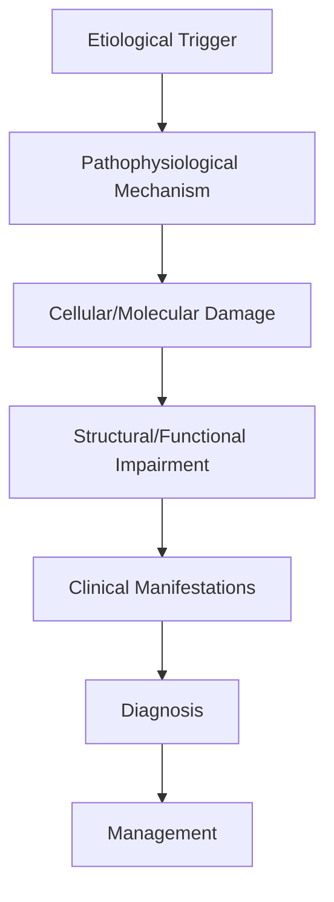

# Cranial Nerve VI Palsy

> [!tip] **High-Yield Definition**
> Comprehensive clinical note for Cranial Nerve VI Palsy covering definition, epidemiology, aetiology, pathophysiology, clinical features, investigations, differential diagnosis, management, drug interactions, procedures, complications, red flags, prognosis, topic correlation, and special situations for FCPS/MRCP examination preparation based on Davidson 24th Edition Chapter 25: Neurology.

---

## 1. Definition / Epidemiology / Classification

### Definition
Cranial Nerve VI Palsy is a neurological disorder within the 17 neuroophthalmology category. It is characterised by specific clinical, pathological, radiological, and laboratory features that allow differentiation from related conditions.

### Epidemiology
- **Incidence/Prevalence:** Variable depending on the specific condition.
- **Age:** Adult onset is most common, but paediatric and elderly presentations occur.
- **Sex:** Variable depending on the condition.
- **Geography:** Worldwide distribution, with higher prevalence in certain regions.
- **Risk Factors:** Genetic predisposition, environmental factors, comorbidities, family history.

### Classification
| Subtype | Key Features | Prognosis |
|---------|-------------|-----------|
| Mild/early | Subtle symptoms, preserved function | Best |
| Moderate | Clear symptoms, functional impairment | Variable |
| Severe | Significant disability, complications | Worst |

---

## 2. Aetiology / Pathophysiology

### Aetiology
- **Primary (idiopathic):** Most cases have no identifiable cause.
- **Genetic:** May be inherited (AD, AR, X-linked, mitochondrial, sporadic).
- **Autoimmune:** Autoantibodies, immune-mediated inflammation.
- **Infectious:** Viral, bacterial, fungal, parasitic.
- **Metabolic:** Electrolyte, endocrine, hepatic, renal, nutritional.
- **Toxic:** Drugs, alcohol, heavy metals, environmental toxins.
- **Vascular:** Ischaemia, haemorrhage, vasculitis.
- **Neoplastic:** Primary, secondary, paraneoplastic.
- **Traumatic:** Acute, chronic, repetitive.
- **Degenerative:** Neurodegeneration, protein misfolding.

### Pathophysiology


---

## 3. Clinical Features

### History
- **Onset/Duration:** Acute, subacute, or chronic.
- **Progression:** Static, progressive, relapsing-remitting, stepwise.
- **Key symptoms:** Specific to the condition.
- **Triggers:** Stress, infection, trauma, drugs, hormonal, environmental.
- **Systemic symptoms:** Constitutional features.
- **Drug/Family/Social history:** Relevant exposures, comorbidities.

### Examination
| Domain | Key Findings | Localisation Value |
|--------|-------------|-------------------|
| Higher function | Cognitive, behavioural | Cortical, subcortical, limbic |
| Cranial nerves | Pupils, eye movements, facial, bulbar | Brainstem, cranial nerve, NMJ |
| Motor | Weakness, tone, reflexes | UMN, LMN, NMJ, muscle |
| Sensory | All modalities, pattern | Peripheral, spinal, brainstem |
| Coordination | Ataxia, nystagmus, dysmetria | Cerebellar, sensory, vestibular |
| Gait | Spastic, ataxic, parkinsonian | Multiple |
| Autonomic | Orthostatic, sweating, GI, bladder | Autonomic, peripheral, central |

### Specific Clinical Features
The clinical features are determined by the underlying aetiology, location of pathology, and rate of progression. Patients typically present with a constellation of symptoms and signs that allow clinical localisation and subsequent targeted investigation.

---

## 4. Diagnostic Approach / Algorithm

```mermaid
flowchart TD
    A[Clinical Presentation] --> B[Anatomical Localisation]
    B --> C[Pathophysiological Category]
    C --> D[Formulate Differential]
    D --> E[Targeted Investigations]
    E --> F[Confirm Diagnosis]
    F --> G[Assess Severity/Prognosis]
    G --> H[Initiate Management]
    H --> I[Monitor Response]
    I --> J{Response?}
    J --> YES1 [Good - Continue]
    J --> NO1 [Poor - Escalate]
    YES1 --> K[Monitor]
    NO1 --> H
```

---

## 5. Investigations

### First-Line Investigations
- **Blood tests:** FBC, U&Es, LFTs, glucose, calcium, magnesium, ESR, CRP, autoimmune, infection.
- **Imaging:** CT/MRI brain/spine (essential for most neurological conditions).
- **Neurophysiology:** EEG, nerve conduction, EMG, evoked potentials.
- **CSF:** Cell count, protein, glucose, OCBs, PCR, culture.

### Second-Line Investigations
- **Genetic testing:** Gene panels, WES, WGS.
- **Antibody testing:** Antineuronal, autoimmune, paraneoplastic.
- **Biopsy:** Nerve, muscle, brain, skin.
- **Advanced imaging:** PET-CT, MR spectroscopy, fMRI.

### Specialised Investigations
- **Biomarkers:** Neurofilament light chain, tau, beta-amyloid, 14-3-3, RT-QuIC.
- **Autonomic testing:** Head-up tilt, sudomotor, QSART.
- **Neuropsychology:** Cognitive testing, behavioural assessment.
- **Genetic counselling:** Family screening, predictive testing.

---

## 6. Differential Diagnosis

| Differential | Distinguishing Features | Key Test |
|--------------|------------------------|----------|
| Vascular | Sudden onset, focal, vascular risk factors | MRI/CT, vessel imaging |
| Inflammatory | Subacute, multifocal, systemic | MRI, CSF, antibodies |
| Infectious | Fever, systemic, exposure | Bloods, CSF, imaging |
| Neoplastic | Progressive, mass effect | MRI, biopsy |
| Degenerative | Progressive, symmetric, hereditary | MRI, genetic |
| Toxic/Metabolic | Drug history, systemic, reversible | Bloods, toxicology |
| Autoimmune | Multifocal, antibodies, immunotherapy response | Antibodies, MRI, CSF |
| Functional | Inconsistent, distractible | Clinical, video, biomarkers |

---

## 7. Management

### Acute Management
- **Stabilisation:** ABCDE approach, emergency resuscitation.
- **Specific treatment:** Disease-specific interventions.
- **Symptomatic relief:** Pain, seizures, spasticity, autonomic dysfunction.
- **Prevention of complications:** DVT, pressure sores, infection.

### Disease-Modifying Treatment
- **Pharmacological:** First-line, second-line, escalation, maintenance.
- **Procedural:** Surgery, biopsy, drainage, ablation, stimulation.
- **Immunotherapy:** Steroids, IVIG, plasma exchange, immunosuppressants, biologics.
- **Rehabilitation:** Physiotherapy, OT, speech therapy.

### Long-Term Management
- **Monitoring:** Clinical, imaging, biomarkers, side effects.
- **Prevention:** Vaccinations, prophylaxis, lifestyle modification.
- **Supportive care:** Multidisciplinary team, social work, psychological support.
- **Palliative care:** Advanced care planning, end-of-life care, hospice.

---

## 8. Drug Interactions / Contraindications / Comorbidity Cautions

| Drug Class | Interaction / Caution | Management |
|------------|----------------------|------------|
| Antiseizure medications | Enzyme induction, teratogenicity | Monitor, supplement, switch |
| Immunosuppressants | Infection, malignancy, teratogenicity | Monitor, prophylaxis |
| Anticoagulants | Bleeding risk, drug interactions | Monitor INR, avoid combinations |
| Antihypertensives | Hypotension, falls | Monitor BP, adjust dose |
| Antibiotics | Nephrotoxicity, ototoxicity | Monitor renal |
| Antivirals | Nephrotoxicity, neuropsychiatric | Monitor renal, dose adjust |
| Steroids | DM, HTN, osteoporosis, infection | Monitor, prophylaxis, taper |
| Biologics | Infusion reactions, infection | Monitor, prophylaxis |

---

## 9. Procedures

### Common Procedures
- **Lumbar puncture:** Diagnostic, therapeutic (IIH, NPH). Contraindications: raised ICP, mass lesion, coagulopathy.
- **Nerve conduction studies/EMG:** Diagnostic, prognosis. Minor discomfort.
- **EEG:** Diagnostic, monitoring. No significant complications.
- **MRI brain/spine:** Diagnostic, monitoring. Contraindications: pacemaker, metallic implants.
- **CT head:** Emergency, rapid. Radiation exposure, contrast reactions.
- **Biopsy:** Stereotactic, open. Indications: diagnosis, molecular profiling.

---

## 10. Complications

| Complication | Frequency | Prevention | Management |
|--------------|-----------|------------|------------|
| Infection | Common | Hygiene, prophylaxis, vaccination | Antibiotics, antifungals |
| Thrombosis | Common | Prophylaxis, mobility | Anticoagulation |
| Pressure sores | Common | Positioning, nutrition | Wound care, surgery |
| Spasticity | Common | Positioning, stretching | Baclofen, BoNT |
| Contractures | Common | Passive movements, splints | Physiotherapy, surgery |
| Aspiration | Common | Swallow assessment | NGT, PEG, thickeners |
| Falls | Common | Environment, mobility | Walking aids |
| Fractures | Common | Bone health, prevention | Vitamin D, bisphosphonate |
| Depression | Common | Screening, support | Antidepressants, CBT |
| Cognitive decline | Variable | Monitoring, training | Rehabilitation |
| Autonomic dysfunction | Variable | Monitoring, hydration | Midodrine, fludrocortisone |
| Respiratory failure | Variable | Monitoring, supportive | Ventilation, NIV |
| Death | Variable | Monitoring, palliative | End-of-life care |

---

## 11. Red Flags / Emergencies

### Emergency Presentations
- **Rapid neurological deterioration:** New focal deficit, decreased consciousness, seizures.
- **Status epilepticus:** Continuous seizures >5 min.
- **Raised ICP:** Headache, vomiting, papilloedema, altered consciousness.
- **Respiratory failure:** Hypoxia, hypercapnia, ventilatory failure.
- **Cardiac arrest:** Arrhythmia, MI, pulmonary embolism.
- **Infection:** Sepsis, meningitis, abscess, encephalitis.
- **Drug toxicity:** Overdose, side effects, interactions.
- **Haemorrhage:** Intracranial, systemic, coagulopathy.

---

## 12. Prognosis

### Natural History
- **Acute:** May resolve with treatment, may progress, may be fatal.
- **Subacute:** Variable, depends on cause and treatment.
- **Chronic:** Often progressive, may be stable, may have relapses.
- **Recovery:** Variable, may be complete, partial, or none.

### Prognostic Factors
- **Favourable:** Young age, early treatment, mild disease, reversible cause, good premorbid function, family support.
- **Unfavourable:** Older age, delayed treatment, severe disease, irreversible cause, poor premorbid function, comorbidities.

---

## 13. Topic Correlation

| Related Topic | Link | Key Overlap |
|---------------|------|-------------|
| Davidson 24th Ed Chapter 25 | [[Davidson Chapter 25 - Neurology Hierarchy]] | Comprehensive neurology |
| Neurology MOC | [[Neurology MOC]] | All neurology topics |
| Drug Reference | [[../00_Index/Neurology Drug Reference]] | Medications |
| Local Hub | [[../17_Neuroophthalmology/Hub]] | Section-specific |
| Clinical Examination | [[../01_Fundamentals_Examination/Neurological History Taking]] | Clinical approach |
| Investigation | [[../01_Fundamentals_Examination/Neuroimaging (CT-MRI) Principles]] | Imaging |

---

## 14. Special Situations

| Situation | Consideration |
|-----------|---------------|
| **Pregnancy** | Pre-conception counselling, teratogenicity, drug safety, monitoring, delivery planning, breastfeeding. |
| **Lactation** | Drug safety, breastfeeding, monitoring, support. |
| **Paediatric** | Developmental considerations, drug dosing, school, family, vaccination, growth, puberty. |
| **Elderly / Frail** | Comorbidities, polypharmacy, falls, bone health, cognition, social, end-of-life. |
| **Renal impairment** | Drug dose adjustment, monitoring, dialysis, transplant. |
| **Hepatic impairment** | Drug dose adjustment, monitoring, transplant. |
| **Immunocompromised** | Infection prophylaxis, vaccination, drug interactions, malignancy screening. |
| **Perioperative** | Drug management, anaesthesia planning, VTE prophylaxis, infection prevention, monitoring. |
| **Driving / DVLA** | Fitness to drive, restrictions, notification, reassessment. |
| **Occupational** | Fitness for work, adaptations, rehabilitation, disability, return to work. |

---

## FCPS/MRCP High-Yield Summary

| Category | Key Points |
|----------|------------|
| **Definition** | Comprehensive definition with key diagnostic criteria |
| **Epidemiology** | Incidence, prevalence, age, sex, geography, risk factors |
| **Aetiology** | Primary causes, secondary causes, genetic, environmental |
| **Pathophysiology** | Mechanism of disease, cellular/molecular basis |
| **Clinical Features** | History, examination, key findings, variants |
| **Diagnosis** | Diagnostic criteria, classification, severity |
| **Investigations** | First-line, second-line, specialised, biomarkers |
| **Differential Diagnosis** | Key differentials, distinguishing features, tests |
| **Management** | Acute, disease-modifying, symptomatic, supportive |
| **Complications** | Common, serious, prevention, management |
| **Prognosis** | Natural history, prognostic factors, outcomes |
| **Viva Pearls** | Key examination points |
| **Drug Doses** | First-line, second-line, emergency |
| **Scoring Systems** | Specific scores used in management |
| **Genetics** | Inheritance, genes, mutations, family screening |
| **Imaging Signs** | Characteristic findings, differential |

---

## Viva Questions (PACES/FCPS Style)

1. **Q:** Define and classify its variants.
   **A:** Comprehensive definition with classification of subtypes based on aetiology, severity, and clinical features.

2. **Q:** What are the key clinical features?
   **A:** Specific symptoms and signs including onset, progression, key features, and associated findings.

3. **Q:** What is the first-line treatment?
   **A:** First-line pharmacological and non-pharmacological management based on current evidence.

4. **Q:** What are the red flags requiring urgent referral?
   **A:** Specific emergency presentations and complications requiring immediate intervention.

5. **Q:** What is the prognosis?
   **A:** Natural history, prognostic factors, and long-term outcomes.

6. **Q:** How do you differentiate from key differentials?
   **A:** Clinical features, investigations, and response to treatment that distinguish from alternative diagnoses.

7. **Q:** What investigations are most useful?
   **A:** First-line and second-line investigations including imaging, neurophysiology, CSF, and biomarkers.

8. **Q:** Describe the stepwise management approach.
   **A:** Stepwise escalation from first-line to second-line to third-line therapy with monitoring.

9. **Q:** What are the emergency presentations?
   **A:** Specific emergency scenarios and immediate management priorities.

10. **Q:** How does management change in pregnancy/paediatrics/elderly?
    **A:** Special considerations for each population including drug safety, monitoring, and support.

---

## Common Confusions / Exam Traps

| Confusion | Clarification |
|-----------|---------------|
| Similar presentation but different cause | Differentiate by history, examination, investigations |
| Treatment response vs natural history | Assess with objective measures, biomarkers |
| Drug interactions | Check each drug, monitor, adjust doses |
| Disease progression vs treatment failure | Monitor response, escalate appropriately |
| Functional vs organic | Inconsistent, distractible, disability greater than impairment |
| Acute vs chronic | Time course, progression, reversibility |
| Primary vs secondary | Underlying cause, contributing factors |
| Side effects vs symptoms | Temporal relationship, dose relationship |

---

## Mnemonics
1. ****CN6-LR** = Lateral rectus, horizontal diplopia worse looking to affected side**
2. ****FALSE-LOCALISING** = Long intracranial course = vulnerable to raised ICP (false localising sign)**
3. ****MICROVASC** = Most common cause in adults (DM, HTN); resolves 3-6 months**

---

## Mind Map

```mermaid
mindmap
  root((Cranial Nerve VI (Abducens) Palsy))
    Definition
    Pathophysiology
    Clinical
    Investigations
    Differential
    Management
    Complications
```

---

## Spaced Repetition Trackers

| Day 1 | Day 3 | Day 7 | Day 14 | Day 30 | Day 90 |
|------|-------|-------|--------|--------|--------|
| | | | | | |

---

## Self-Test Scorecard

| Section | Score /5 |
|---------|----------|
| Definition | |
| Pathophysiology | |
| Clinical | |
| Investigations | |
| Differential | |
| Management | |
| Complications | |

---

## MCQs (10)

1. **Q:** 60-year-old diabetic with horizontal diplopia worse on right gaze. Right eye cannot abduct. Diagnosis?
   **Options:** A. Right CN VI palsy (microvascular) B. Right CN III palsy C. Left CN VI D. INO
   **Answer:** A
   **Explanation:** Right CN VI palsy: right lateral rectus weakness, right eye esotropic (medially deviated), cannot abduct, horizontal diplopia worse on right gaze. Microvascular (DM, HTN) most common in adults.

2. **Q:** Why is CN VI a 'false localising sign' of raised ICP?
   **Options:** A. Long intracranial course, tethered at Dorello's canal, vulnerable to stretch from raised ICP B. Short C. Multiple branches D. Sensory
   **Answer:** A
   **Explanation:** CN VI: long intracranial course, tethered at Dorello's canal (over petrous ridge). Raised ICP causes downward brain displacement, stretching CN VI -> palsy. False localising: not due to local lesion but to raised ICP anywhere.

3. **Q:** First-line investigation in CN VI palsy?
   **Options:** A. MRI brain + orbits + MRA (aneurysm) B. LP C. CT only D. Observation only
   **Answer:** A
   **Explanation:** CN VI palsy: MRI brain + orbits with contrast + MRA/CTA (aneurysm, especially cavernous carotid). Exclude: aneurysm (compressive), tumour (skull base, cavernous, posterior fossa), MS (demyelination), raised ICP, thrombosis (cavernous sinus). Isolated microvascular CN VI palsy: can observe.

4. **Q:** CN VI palsy in a 25-year-old. Differential?
   **Options:** A. Demyelination (MS), aneurysm, tumour, raised ICP, cavernous sinus thrombosis, post-viral B. Microvascular C. Trauma D. Stroke
   **Answer:** A
   **Explanation:** Young patient: MS, aneurysm (especially if painful, partial - compressive, may herald rupture), tumour, raised ICP, cavernous sinus thrombosis, post-viral, post-LP (spinal anaesthesia, lumbar puncture), trauma.

5. **Q:** Treatment of CN VI palsy?
   **Options:** A. Treat underlying cause; prism glasses, botulinum toxin to MR (antagonist), surgery if persistent; microvascular usually resolves 3-6 months B. Surgery only C. Steroids only D. Antibiotics
   **Answer:** A
   **Explanation:** CN VI palsy: treat cause. Acute: botulinum toxin to ipsilateral medial rectus (antagonist) for diplopia, or occlusion patch. Prism glasses for small-angle residual. Surgery if persistent >6 months: recession of antagonist (MR) ± resection of ipsilateral LR (if some function).

6. **Q:** When to image a CN VI palsy?
   **Options:** A. Always - atypical features, pain, other cranial nerves, young age, no vascular risk factors, progressive, no recovery by 3 months B. Only if bilateral C. Never D. Always if aged >50
   **Answer:** A
   **Explanation:** Image: atypical features (pain, other CN involvement, papilloedema), young age, no vascular risk factors, bilateral, progressive, no recovery by 3 months, pupil involvement (aneurysm, compressive). Microvascular in older diabetic/Hypertensive can be observed if isolated.

7. **Q:** Bilateral CN VI palsy causes?
   **Options:** A. Raised ICP, cavernous sinus thrombosis, meningeal disease (carcinomatous, infective, inflammatory), skull base fracture, post-LP B. Microvascular only C. Trauma only D. Idiopathic
   **Answer:** A
   **Explanation:** Bilateral CN VI palsy: raised ICP (commonest non-localising), cavernous sinus thrombosis, meningeal disease (meningitis - TB, fungal, carcinomatous, sarcoid), skull base fracture, post-LP, Wernicke-Korsakoff. Urgent MRI + LP.

8. **Q:** CN VI palsy as false localising sign in raised ICP - what is seen with CN III?
   **Options:** A. CN III palsy = uncal herniation (true localising) B. CN III spared C. Same as CN VI D. Only sensory
   **Answer:** A
   **Explanation:** CN III palsy in raised ICP: uncal herniation (medial temporal lobe compresses CN III). True localising: indicates ipsilateral mass effect. Pupil involvement first (parasympathetic on outside of CN III). CN VI: false localising (long course, both sides can be affected in raised ICP).

9. **Q:** 'One and a half syndrome' includes:
   **Options:** A. CN VI palsy (one) + INO (half) from unilateral pontine lesion (PPRF or abducens nucleus + MLF) B. Bilateral CN III C. Bilateral CN IV D. Sensory only
   **Answer:** A
   **Explanation:** One and a half syndrome: ipsilateral horizontal gaze palsy (PPRF or CN VI nucleus lesion) + ipsilateral INO (MLF lesion) = 'one' gaze palsy + 'half' (INO). Causes: pontine stroke (most common), MS, tumour. Affects horizontal gaze, often vertical preserved.

10. **Q:** Recovery time of microvascular CN VI palsy?
    **Options:** A. 3-6 months B. 1 year C. 1 week D. Permanent
    **Answer:** A
    **Explanation:** Microvascular CN VI palsy: usually resolves in 3-6 months. Risk factor control. If no recovery in 6 months, re-investigate. Sometimes incomplete recovery.

---

## SBA Questions (10)

1. **Scenario:** 65-year-old hypertensive, sudden horizontal diplopia, right eye cannot abduct. No pain, no other CN signs, pupils normal. Has had viral illness last week.
   **Question:** Most likely cause and management?
   **Options:** A. Microvascular CN VI palsy; observation, risk factor control, prism; usually resolves 3-6 months B. Aneurysm C. Tumour D. Reassure only
   **Answer:** A
   **Explanation:** Older patient with vascular risk factors, isolated CN VI palsy, no pain, no other signs = microvascular. Observe, control BP/diabetes/cholesterol. Prism for diplopia. MRI to confirm if needed. If no recovery 6 months, re-image.

2. **Scenario:** 50-year-old with painful CN VI palsy, partial (eye partially abducted). MRI/MRA: posterior communicating artery aneurysm.
   **Question:** Management?
   **Options:** A. Urgent neurosurgical/endovascular treatment of aneurysm (clipping/coiling); CN VI palsy may resolve B. Watch C. Aspirin only D. Steroids
   **Answer:** A
   **Explanation:** Painful CN VI palsy, partial = consider compressive lesion (aneurysm, tumour). Posterior communicating aneurysm affects CN III more commonly; cavernous carotid aneurysm can affect CN VI. Urgent treatment (endovascular coiling or surgical clipping).

3. **Scenario:** 30-year-old with bilateral CN VI palsy, papilloedema, headaches. MRI: empty sella.
   **Question:** Likely diagnosis?
   **Options:** A. Idiopathic intracranial hypertension (IIH); LP (raised pressure, normal CSF), acetazolamide, weight loss, topiramate, VP shunt/optic nerve sheath fenestration if vision threatened B. Aneurysm C. Tumour D. Migraine
   **Answer:** A
   **Explanation:** IIH: young obese women, headaches, papilloedema, CN VI palsy (false localising), empty sella on MRI. LP: raised opening pressure (>25 cm H2O), normal CSF. Treat: weight loss, acetazolamide, topiramate, furosemide. Refractory: VP shunt, optic nerve sheath fenestration.

4. **Scenario:** 40-year-old with painful ophthalmoplegia (CN III, IV, V1, V2, VI), proptosis, chemosis, fever.
   **Question:** Likely diagnosis and management?
   **Options:** A. Cavernous sinus thrombosis; IV antibiotics, anticoagulation, source control (sinus, facial) B. Migraine C. Tolosa-Hunt D. Reassure
   **Answer:** A
   **Explanation:** Cavernous sinus thrombosis: septic (sinus, facial infection) or aseptic. Multiple CN palsies (III, IV, V1, V2, VI) + proptosis + chemosis + fever. Urgent IV antibiotics (broad-spectrum), anticoagulation (controversial), source control. Mortality high if untreated.

5. **Scenario:** 28-year-old woman with sudden right horizontal diplopia. Right eye abducted. MRI: small periventricular white matter lesions. CSF: OCB positive.
   **Question:** Diagnosis and management?
   **Options:** A. MS with brainstem relapse; high-dose IV methylprednisolone, disease-modifying therapy, MRI surveillance B. Microvascular C. Tumour D. Reassure
   **Answer:** A
   **Explanation:** MS: brainstem relapse causing CN VI palsy. MRI: periventricular lesions. CSF: OCB. Treatment: high-dose IV methylprednisolone 1g/day for 3-5 days. Start/modify disease-modifying therapy (interferon, glatiramer, ocrelizumab, etc.).

6. **Scenario:** 60-year-old with CN VI palsy post-LP (lumbar puncture for headache).
   **Question:** Cause and management?
   **Options:** A. Post-LP CN VI palsy from CSF leak/raised intracranial venous pressure; conservative, IV fluids, caffeine, epidural blood patch if persistent; usually resolves 2 weeks B. Permanent C. Aneurysm D. Tumour
   **Answer:** A
   **Explanation:** Post-LP CN VI palsy: from CSF leak causing low pressure, traction on CN VI. Conservative: bed rest, hydration, caffeine. If persistent or severe headache: epidural blood patch. Usually resolves within 2 weeks. Reassure.

7. **Scenario:** 70-year-old on heparin for AF. Sudden painful CN VI palsy. MRI: small cavernous sinus mass.
   **Question:** Cause?
   **Options:** A. Cavernous sinus pathology (aneurysm, thrombosis, tumour); full workup including MRA, anticoagulation status B. Microvascular C. MS D. Trauma
   **Answer:** A
   **Explanation:** CN VI in cavernous sinus: aneurysm, thrombosis, tumour (meningioma, pituitary, metastasis, lymphoma, sarcoid), Tolosa-Hunt. On anticoagulation: exclude haemorrhage into cavernous sinus pathology. MRA, consider LP if not contraindicated.

8. **Scenario:** 25-year-old with horizontal diplopia. One and a half syndrome. MRI: small pontine lesion. CSF positive OCB.
   **Question:** Diagnosis?
   **Options:** A. MS (brainstem relapse) B. Stroke C. Tumour D. Migraine
   **Answer:** A
   **Explanation:** One and a half syndrome: unilateral pontine lesion (PPRF or CN VI nucleus + MLF). In young patient with positive OCB: MS. Treat relapse with IV methylprednisolone. Disease-modifying therapy.

---

## Tags
**Tags:** #neurology #CN6 #abducens #lateral-rectus #horizontal-diplopia #false-localising #raised-ICP #cavernous-sinus #FCPS #MRCP

---

## Local Navigation
**Heading Hub:** [[../Hub]]  
**Chapter Hierarchy:** [[Davidson Chapter 25 - Neurology Hierarchy]]  
**Chapter MOC:** [[Neurology MOC]]  
**Drug Reference:** [[../00_Index/Neurology Drug Reference]]  
