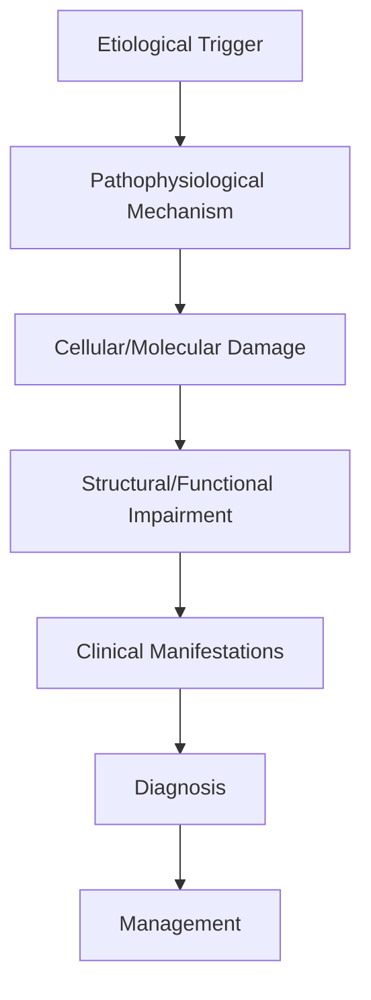
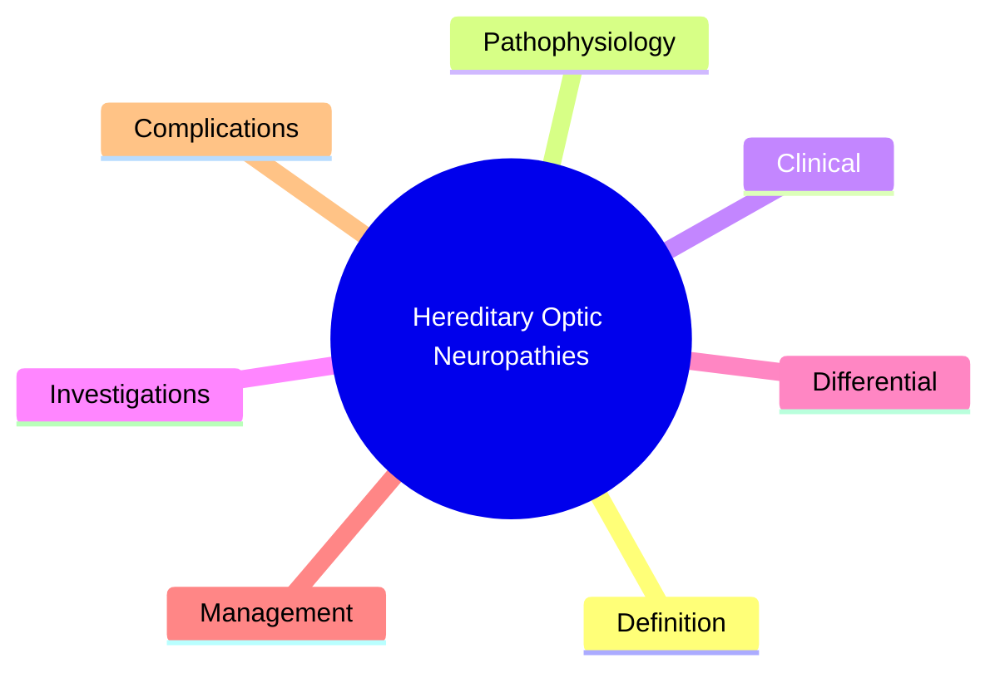

# Hereditary Optic Neuropathies

> [!tip] **High-Yield Definition**
> Comprehensive clinical note for Hereditary Optic Neuropathies covering definition, epidemiology, aetiology, pathophysiology, clinical features, investigations, differential diagnosis, management, drug interactions, procedures, complications, red flags, prognosis, topic correlation, and special situations for FCPS/MRCP examination preparation based on Davidson 24th Edition Chapter 25: Neurology.

---

## 1. Definition / Epidemiology / Classification

### Definition
Hereditary Optic Neuropathies is a neurological disorder within the 17 neuroophthalmology category. It is characterised by specific clinical, pathological, radiological, and laboratory features that allow differentiation from related conditions.

### Epidemiology
- **Incidence/Prevalence:** Variable depending on the specific condition.
- **Age:** Adult onset is most common, but paediatric and elderly presentations occur.
- **Sex:** Variable depending on the condition.
- **Geography:** Worldwide distribution, with higher prevalence in certain regions.
- **Risk Factors:** Genetic predisposition, environmental factors, comorbidities, family history.

### Classification
| Subtype | Key Features | Prognosis |
|---------|-------------|-----------|
| Mild/early | Subtle symptoms, preserved function | Best |
| Moderate | Clear symptoms, functional impairment | Variable |
| Severe | Significant disability, complications | Worst |

---

## 2. Aetiology / Pathophysiology

### Aetiology
- **Primary (idiopathic):** Most cases have no identifiable cause.
- **Genetic:** May be inherited (AD, AR, X-linked, mitochondrial, sporadic).
- **Autoimmune:** Autoantibodies, immune-mediated inflammation.
- **Infectious:** Viral, bacterial, fungal, parasitic.
- **Metabolic:** Electrolyte, endocrine, hepatic, renal, nutritional.
- **Toxic:** Drugs, alcohol, heavy metals, environmental toxins.
- **Vascular:** Ischaemia, haemorrhage, vasculitis.
- **Neoplastic:** Primary, secondary, paraneoplastic.
- **Traumatic:** Acute, chronic, repetitive.
- **Degenerative:** Neurodegeneration, protein misfolding.

### Pathophysiology


---

## 3. Clinical Features

### History
- **Onset/Duration:** Acute, subacute, or chronic.
- **Progression:** Static, progressive, relapsing-remitting, stepwise.
- **Key symptoms:** Specific to the condition.
- **Triggers:** Stress, infection, trauma, drugs, hormonal, environmental.
- **Systemic symptoms:** Constitutional features.
- **Drug/Family/Social history:** Relevant exposures, comorbidities.

### Examination
| Domain | Key Findings | Localisation Value |
|--------|-------------|-------------------|
| Higher function | Cognitive, behavioural | Cortical, subcortical, limbic |
| Cranial nerves | Pupils, eye movements, facial, bulbar | Brainstem, cranial nerve, NMJ |
| Motor | Weakness, tone, reflexes | UMN, LMN, NMJ, muscle |
| Sensory | All modalities, pattern | Peripheral, spinal, brainstem |
| Coordination | Ataxia, nystagmus, dysmetria | Cerebellar, sensory, vestibular |
| Gait | Spastic, ataxic, parkinsonian | Multiple |
| Autonomic | Orthostatic, sweating, GI, bladder | Autonomic, peripheral, central |

### Specific Clinical Features
The clinical features are determined by the underlying aetiology, location of pathology, and rate of progression. Patients typically present with a constellation of symptoms and signs that allow clinical localisation and subsequent targeted investigation.

---

## 4. Diagnostic Approach / Algorithm

```mermaid
flowchart TD
    A[Clinical Presentation] --> B[Anatomical Localisation]
    B --> C[Pathophysiological Category]
    C --> D[Formulate Differential]
    D --> E[Targeted Investigations]
    E --> F[Confirm Diagnosis]
    F --> G[Assess Severity/Prognosis]
    G --> H[Initiate Management]
    H --> I[Monitor Response]
    I --> J{Response?}
    J --> YES1 [Good - Continue]
    J --> NO1 [Poor - Escalate]
    YES1 --> K[Monitor]
    NO1 --> H
```

---

## 5. Investigations

### First-Line Investigations
- **Blood tests:** FBC, U&Es, LFTs, glucose, calcium, magnesium, ESR, CRP, autoimmune, infection.
- **Imaging:** CT/MRI brain/spine (essential for most neurological conditions).
- **Neurophysiology:** EEG, nerve conduction, EMG, evoked potentials.
- **CSF:** Cell count, protein, glucose, OCBs, PCR, culture.

### Second-Line Investigations
- **Genetic testing:** Gene panels, WES, WGS.
- **Antibody testing:** Antineuronal, autoimmune, paraneoplastic.
- **Biopsy:** Nerve, muscle, brain, skin.
- **Advanced imaging:** PET-CT, MR spectroscopy, fMRI.

### Specialised Investigations
- **Biomarkers:** Neurofilament light chain, tau, beta-amyloid, 14-3-3, RT-QuIC.
- **Autonomic testing:** Head-up tilt, sudomotor, QSART.
- **Neuropsychology:** Cognitive testing, behavioural assessment.
- **Genetic counselling:** Family screening, predictive testing.

---

## 6. Differential Diagnosis

| Differential | Distinguishing Features | Key Test |
|--------------|------------------------|----------|
| Vascular | Sudden onset, focal, vascular risk factors | MRI/CT, vessel imaging |
| Inflammatory | Subacute, multifocal, systemic | MRI, CSF, antibodies |
| Infectious | Fever, systemic, exposure | Bloods, CSF, imaging |
| Neoplastic | Progressive, mass effect | MRI, biopsy |
| Degenerative | Progressive, symmetric, hereditary | MRI, genetic |
| Toxic/Metabolic | Drug history, systemic, reversible | Bloods, toxicology |
| Autoimmune | Multifocal, antibodies, immunotherapy response | Antibodies, MRI, CSF |
| Functional | Inconsistent, distractible | Clinical, video, biomarkers |

---

## 7. Management

### Acute Management
- **Stabilisation:** ABCDE approach, emergency resuscitation.
- **Specific treatment:** Disease-specific interventions.
- **Symptomatic relief:** Pain, seizures, spasticity, autonomic dysfunction.
- **Prevention of complications:** DVT, pressure sores, infection.

### Disease-Modifying Treatment
- **Pharmacological:** First-line, second-line, escalation, maintenance.
- **Procedural:** Surgery, biopsy, drainage, ablation, stimulation.
- **Immunotherapy:** Steroids, IVIG, plasma exchange, immunosuppressants, biologics.
- **Rehabilitation:** Physiotherapy, OT, speech therapy.

### Long-Term Management
- **Monitoring:** Clinical, imaging, biomarkers, side effects.
- **Prevention:** Vaccinations, prophylaxis, lifestyle modification.
- **Supportive care:** Multidisciplinary team, social work, psychological support.
- **Palliative care:** Advanced care planning, end-of-life care, hospice.

---

## 8. Drug Interactions / Contraindications / Comorbidity Cautions

| Drug Class | Interaction / Caution | Management |
|------------|----------------------|------------|
| Antiseizure medications | Enzyme induction, teratogenicity | Monitor, supplement, switch |
| Immunosuppressants | Infection, malignancy, teratogenicity | Monitor, prophylaxis |
| Anticoagulants | Bleeding risk, drug interactions | Monitor INR, avoid combinations |
| Antihypertensives | Hypotension, falls | Monitor BP, adjust dose |
| Antibiotics | Nephrotoxicity, ototoxicity | Monitor renal |
| Antivirals | Nephrotoxicity, neuropsychiatric | Monitor renal, dose adjust |
| Steroids | DM, HTN, osteoporosis, infection | Monitor, prophylaxis, taper |
| Biologics | Infusion reactions, infection | Monitor, prophylaxis |

---

## 9. Procedures

### Common Procedures
- **Lumbar puncture:** Diagnostic, therapeutic (IIH, NPH). Contraindications: raised ICP, mass lesion, coagulopathy.
- **Nerve conduction studies/EMG:** Diagnostic, prognosis. Minor discomfort.
- **EEG:** Diagnostic, monitoring. No significant complications.
- **MRI brain/spine:** Diagnostic, monitoring. Contraindications: pacemaker, metallic implants.
- **CT head:** Emergency, rapid. Radiation exposure, contrast reactions.
- **Biopsy:** Stereotactic, open. Indications: diagnosis, molecular profiling.

---

## 10. Complications

| Complication | Frequency | Prevention | Management |
|--------------|-----------|------------|------------|
| Infection | Common | Hygiene, prophylaxis, vaccination | Antibiotics, antifungals |
| Thrombosis | Common | Prophylaxis, mobility | Anticoagulation |
| Pressure sores | Common | Positioning, nutrition | Wound care, surgery |
| Spasticity | Common | Positioning, stretching | Baclofen, BoNT |
| Contractures | Common | Passive movements, splints | Physiotherapy, surgery |
| Aspiration | Common | Swallow assessment | NGT, PEG, thickeners |
| Falls | Common | Environment, mobility | Walking aids |
| Fractures | Common | Bone health, prevention | Vitamin D, bisphosphonate |
| Depression | Common | Screening, support | Antidepressants, CBT |
| Cognitive decline | Variable | Monitoring, training | Rehabilitation |
| Autonomic dysfunction | Variable | Monitoring, hydration | Midodrine, fludrocortisone |
| Respiratory failure | Variable | Monitoring, supportive | Ventilation, NIV |
| Death | Variable | Monitoring, palliative | End-of-life care |

---

## 11. Red Flags / Emergencies

### Emergency Presentations
- **Rapid neurological deterioration:** New focal deficit, decreased consciousness, seizures.
- **Status epilepticus:** Continuous seizures >5 min.
- **Raised ICP:** Headache, vomiting, papilloedema, altered consciousness.
- **Respiratory failure:** Hypoxia, hypercapnia, ventilatory failure.
- **Cardiac arrest:** Arrhythmia, MI, pulmonary embolism.
- **Infection:** Sepsis, meningitis, abscess, encephalitis.
- **Drug toxicity:** Overdose, side effects, interactions.
- **Haemorrhage:** Intracranial, systemic, coagulopathy.

---

## 12. Prognosis

### Natural History
- **Acute:** May resolve with treatment, may progress, may be fatal.
- **Subacute:** Variable, depends on cause and treatment.
- **Chronic:** Often progressive, may be stable, may have relapses.
- **Recovery:** Variable, may be complete, partial, or none.

### Prognostic Factors
- **Favourable:** Young age, early treatment, mild disease, reversible cause, good premorbid function, family support.
- **Unfavourable:** Older age, delayed treatment, severe disease, irreversible cause, poor premorbid function, comorbidities.

---

## 13. Topic Correlation

| Related Topic | Link | Key Overlap |
|---------------|------|-------------|
| Davidson 24th Ed Chapter 25 | [[Davidson Chapter 25 - Neurology Hierarchy]] | Comprehensive neurology |
| Neurology MOC | [[Neurology MOC]] | All neurology topics |
| Drug Reference | [[../00_Index/Neurology Drug Reference]] | Medications |
| Local Hub | [[../17_Neuroophthalmology/Hub]] | Section-specific |
| Clinical Examination | [[../01_Fundamentals_Examination/Neurological History Taking]] | Clinical approach |
| Investigation | [[../01_Fundamentals_Examination/Neuroimaging (CT-MRI) Principles]] | Imaging |

---

## 14. Special Situations

| Situation | Consideration |
|-----------|---------------|
| **Pregnancy** | Pre-conception counselling, teratogenicity, drug safety, monitoring, delivery planning, breastfeeding. |
| **Lactation** | Drug safety, breastfeeding, monitoring, support. |
| **Paediatric** | Developmental considerations, drug dosing, school, family, vaccination, growth, puberty. |
| **Elderly / Frail** | Comorbidities, polypharmacy, falls, bone health, cognition, social, end-of-life. |
| **Renal impairment** | Drug dose adjustment, monitoring, dialysis, transplant. |
| **Hepatic impairment** | Drug dose adjustment, monitoring, transplant. |
| **Immunocompromised** | Infection prophylaxis, vaccination, drug interactions, malignancy screening. |
| **Perioperative** | Drug management, anaesthesia planning, VTE prophylaxis, infection prevention, monitoring. |
| **Driving / DVLA** | Fitness to drive, restrictions, notification, reassessment. |
| **Occupational** | Fitness for work, adaptations, rehabilitation, disability, return to work. |

---

## FCPS/MRCP High-Yield Summary

| Category | Key Points |
|----------|------------|
| **Definition** | Comprehensive definition with key diagnostic criteria |
| **Epidemiology** | Incidence, prevalence, age, sex, geography, risk factors |
| **Aetiology** | Primary causes, secondary causes, genetic, environmental |
| **Pathophysiology** | Mechanism of disease, cellular/molecular basis |
| **Clinical Features** | History, examination, key findings, variants |
| **Diagnosis** | Diagnostic criteria, classification, severity |
| **Investigations** | First-line, second-line, specialised, biomarkers |
| **Differential Diagnosis** | Key differentials, distinguishing features, tests |
| **Management** | Acute, disease-modifying, symptomatic, supportive |
| **Complications** | Common, serious, prevention, management |
| **Prognosis** | Natural history, prognostic factors, outcomes |
| **Viva Pearls** | Key examination points |
| **Drug Doses** | First-line, second-line, emergency |
| **Scoring Systems** | Specific scores used in management |
| **Genetics** | Inheritance, genes, mutations, family screening |
| **Imaging Signs** | Characteristic findings, differential |

---

## Viva Questions (PACES/FCPS Style)

1. **Q:** Define and classify its variants.
   **A:** Comprehensive definition with classification of subtypes based on aetiology, severity, and clinical features.

2. **Q:** What are the key clinical features?
   **A:** Specific symptoms and signs including onset, progression, key features, and associated findings.

3. **Q:** What is the first-line treatment?
   **A:** First-line pharmacological and non-pharmacological management based on current evidence.

4. **Q:** What are the red flags requiring urgent referral?
   **A:** Specific emergency presentations and complications requiring immediate intervention.

5. **Q:** What is the prognosis?
   **A:** Natural history, prognostic factors, and long-term outcomes.

6. **Q:** How do you differentiate from key differentials?
   **A:** Clinical features, investigations, and response to treatment that distinguish from alternative diagnoses.

7. **Q:** What investigations are most useful?
   **A:** First-line and second-line investigations including imaging, neurophysiology, CSF, and biomarkers.

8. **Q:** Describe the stepwise management approach.
   **A:** Stepwise escalation from first-line to second-line to third-line therapy with monitoring.

9. **Q:** What are the emergency presentations?
   **A:** Specific emergency scenarios and immediate management priorities.

10. **Q:** How does management change in pregnancy/paediatrics/elderly?
    **A:** Special considerations for each population including drug safety, monitoring, and support.

---

## Common Confusions / Exam Traps

| Confusion | Clarification |
|-----------|---------------|
| Similar presentation but different cause | Differentiate by history, examination, investigations |
| Treatment response vs natural history | Assess with objective measures, biomarkers |
| Drug interactions | Check each drug, monitor, adjust doses |
| Disease progression vs treatment failure | Monitor response, escalate appropriately |
| Functional vs organic | Inconsistent, distractible, disability greater than impairment |
| Acute vs chronic | Time course, progression, reversibility |
| Primary vs secondary | Underlying cause, contributing factors |
| Side effects vs symptoms | Temporal relationship, dose relationship |

---

## Mnemonics
1. ****LHON-11778** = Most common mutation (m.11778G>A in MT-ND4); M:F 4:1, painless, sequential**
2. ****DOA-Kjer** = AD, OPA1 gene, onset 5-30y, blue-yellow dyschromatopsia**
3. ****MITOCHONDRIAL INHERITANCE** = Maternal (LHON); nuclear AD (OPA1)**

---

## Mind Map



---

## Spaced Repetition Trackers

| Day 1 | Day 3 | Day 7 | Day 14 | Day 30 | Day 90 |
|------|-------|-------|--------|--------|--------|
| | | | | | |

---

## Self-Test Scorecard

| Section | Score /5 |
|---------|----------|
| Definition | |
| Pathophysiology | |
| Clinical | |
| Investigations | |
| Differential | |
| Management | |
| Complications | |

---

## MCQs (10)

1. **Q:** 25-year-old man with painless sequential bilateral central scotomas, dyschromatopsia. Family history: maternal uncle similarly affected. Diagnosis?
   **Options:** A. Leber's hereditary optic neuropathy (LHON) B. Optic neuritis C. Toxic optic neuropathy D. NAION
   **Answer:** A
   **Explanation:** LHON: painless, sequential (one eye then other within weeks-months), central/caecocentral scotoma, dyschromatopsia (red-green). Maternal inheritance (mitochondrial). Young men (M:F 4:1). mtDNA mutations (m.11778G>A most common, 70%).

2. **Q:** Most common LHON mutation?
   **Options:** A. m.11778G>A (MT-ND4) B. m.3460G>A (MT-ND1) C. m.14484T>C (MT-ND6) D. m.8993T>G
   **Answer:** A
   **Explanation:** m.11778G>A in MT-ND4 = most common (~70% of LHON), worst prognosis. m.3460G>A (MT-ND1) ~15%. m.14484T>C (MT-ND6) ~15%, best prognosis, often recovers. All affect complex I of mitochondrial respiratory chain.

3. **Q:** Inheritance pattern of LHON?
   **Options:** A. Maternal (mitochondrial) B. Autosomal dominant C. Autosomal recessive D. X-linked
   **Answer:** A
   **Explanation:** LHON: mitochondrial inheritance. All children of affected mother at risk (variable penetrance). Affected fathers don't transmit. Incomplete penetrance (~50% males, 10-15% females with mutation develop). Triggering factors: smoking, alcohol, certain drugs.

4. **Q:** Dominant optic atrophy (Kjer) features?
   **Options:** A. AD, OPA1 gene, insidious bilateral central vision loss, blue-yellow dyschromatopsia, onset 5-30y B. Acute C. AR D. Sudden
   **Answer:** A
   **Explanation:** DOA (Kjer): AD, OPA1 gene (chromosome 3q28), onset 5-30y, insidious bilateral symmetric central vision loss, blue-yellow dyschromatopsia (tritanopia), temporal optic disc pallor. Most common hereditary optic neuropathy (1:12,000-50,000).

5. **Q:** How to differentiate LHON from optic neuritis?
   **Options:** A. LHON: painless, no recovery, no pain on eye movement, family history, sequential; optic neuritis: painful, recovers, demyelinating B. Same C. Cannot differentiate D. Both bilateral
   **Answer:** A
   **Explanation:** LHON: painless, no pain on eye movement, sequential bilateral (weeks-months), no recovery typically, no RAPD (symmetric), family history. Optic neuritis: painful eye movement (90%), unilateral, recovers over weeks, RAPD present, demyelinating.

6. **Q:** LHON treatment?
   **Options:** A. Idebenone (synthetic CoQ10) may slow progression; avoid triggers (smoking, alcohol); genetic counselling; no proven curative B. Steroids C. Antibiotics D. Surgery
   **Answer:** A
   **Explanation:** Idebenone (synthetic CoQ10 analogue): RCT showed some benefit in slowing visual loss if started early (within 1 year of onset). Avoid triggers (smoking, alcohol, certain drugs - ethambutol, linezolid, amiodarone, sildenafil). Genetic counselling. No proven cure.

7. **Q:** What is the typical fundus appearance in acute LHON?
   **Options:** A. Hyperaemic disc with peripapillary telangiectasia, vessel tortuosity, no pallor (acute); later: optic atrophy B. Pallor only C. Normal D. Swelling only
   **Answer:** A
   **Explanation:** Acute LHON: hyperaemic optic disc, peripapillary telangiectasia (microangiopathy), vessel tortuosity, NFL oedema. No true disc pallor initially (this is the classic finding). Later: optic atrophy with NFL loss.

8. **Q:** Other mitochondrial optic neuropathies?
   **Options:** A. MELAS, MERRF, CPEO, KSS, NARP B. Only LHON C. Only AD D. Only AR
   **Answer:** A
   **Explanation:** Mitochondrial optic neuropathies: LHON, MELAS, MERRF, CPEO (chronic progressive external ophthalmoplegia), KSS (Kearns-Sayre syndrome, with cardiac block), NARP. All affect mitochondrial respiratory chain, often with systemic features.

9. **Q:** What toxic/nutritional optic neuropathies mimic hereditary?
   **Options:** A. Methanol, ethambutol, isoniazid, amiodarone, sildenafil, linezolid, B12, thiamine, tobacco-alcohol B. Only methanol C. Only ethambutol D. Only B12
   **Answer:** A
   **Explanation:** Toxic optic neuropathies: methanol (acute, severe), ethambutol (dose-dependent, ONH), isoniazid, amiodarone, sildenafil, linezolid, chloramphenicol, vincristine, cisplatin. Nutritional: B12, thiamine, folate. Tobacco-alcohol optic neuropathy (slow bilateral central scotomas, dyschromatopsia, may overlap with LHON).

10. **Q:** When is genetic testing indicated in suspected hereditary optic neuropathy?
    **Options:** A. Bilateral sequential painless central vision loss, no other cause, family history, young onset B. All optic neuropathies C. Only if severe D. Never
    **Answer:** A
    **Explanation:** Indications: bilateral painless sequential central scotoma, no other cause identified, family history, young onset, optic disc features typical. mtDNA testing for LHON mutations (11778, 3460, 14484). OPA1 for DOA. Genetic counselling important.

---

## SBA Questions (10)

1. **Scenario:** 30-year-old man with sequential bilateral painless central scotomas over 2 months. Family history: maternal uncle with similar symptoms.
   **Question:** Most likely diagnosis?
   **Options:** A. LHON; mtDNA testing (m.11778G>A most common); idebenone trial; avoid triggers; genetic counselling B. Optic neuritis C. NAION D. Toxic
   **Answer:** A
   **Explanation:** LHON clinical presentation: typical. mtDNA testing for 3 primary mutations. Idebenone 300mg TDS (RCT benefit). Avoid smoking, alcohol. Genetic counselling (maternal inheritance).

2. **Scenario:** 22-year-old with insidious bilateral central vision loss, blue-yellow colour confusion, temporal optic disc pallor. Father similar.
   **Question:** Diagnosis?
   **Options:** A. Dominant optic atrophy (OPA1); genetic testing; supportive management; low-vision aids B. LHON C. Optic neuritis D. Glaucoma
   **Answer:** A
   **Explanation:** DOA (Kjer): AD, OPA1 gene. Insidious bilateral central vision loss, blue-yellow dyschromatopsia, temporal optic disc pallor. Genetic testing confirms. No specific treatment; supportive (low-vision aids, monitoring).

3. **Scenario:** 18-year-old with sudden bilateral sequential vision loss. m.14484T>C mutation found.
   **Question:** Prognosis?
   **Options:** A. Good - 37-70% spontaneous visual recovery (best of three LHON mutations) B. Poor C. No recovery D. Variable
   **Answer:** A
   **Explanation:** m.14484T>C (MT-ND6) has best prognosis: 37-70% spontaneous visual recovery. m.11778G>A worst (~4% recovery). m.3460G>A intermediate.

4. **Scenario:** LHON patient on idebenone. 6 months later, vision stable, no further loss. Continue?
   **Options:** A. Yes, continue idebenone minimum 1-2 years; monitor VA, visual fields, OCT B. Stop C. Double dose D. Switch
   **Answer:** A
   **Explanation:** Idebenone: 300mg TDS. Continue minimum 1-2 years. Monitor VA, visual fields, OCT RNFL. Some studies suggest continued benefit. Side effects mild (GI).

5. **Scenario:** Asymptomatic male with family history of LHON (m.11778G>A). Should he be tested?
   **Options:** A. Yes, with genetic counselling; avoid triggers (smoking, alcohol); inform of risk B. No, never test C. Test children only D. Mandatory only
   **Answer:** A
   **Explanation:** Asymptomatic carriers: testing offered with genetic counselling (maternal inheritance, incomplete penetrance). Avoid triggers (smoking, alcohol major). Some centres offer idebenone to carriers (limited evidence).

6. **Scenario:** Patient with bilateral optic neuropathy. Also has heart block, ataxia, CPEO.
   **Question:** Likely diagnosis?
   **Options:** A. Mitochondrial disease (KSS/CPEO) - cardiac pacemaker, supportive B. LHON only C. DOA only D. MS
   **Answer:** A
   **Explanation:** KSS (Kearns-Sayre): onset <20y, CPEO, pigmentary retinopathy, cardiac conduction block (need pacemaker), cerebellar ataxia, CSF protein elevated. mtDNA deletions/duplications.

7. **Scenario:** LHON patient 5 years after onset. Vision no further change. OCT: diffuse RNFL thinning. Stable.
   **Question:** Approach?
   **Options:** A. Annual review; low-vision aids, registration, occupational therapy; no further intervention B. Restart idebenone C. Surgery D. Steroids
   **Answer:** A
   **Explanation:** Stable chronic LHON: annual review, low-vision aids, registration (CVI/partially sighted), occupational therapy, psychology support. No further intervention needed.

8. **Scenario:** 20-year-old with bilateral optic neuropathy, severe ataxia, peripheral neuropathy, myopathy. mtDNA testing negative for LHON.
   **Question:** Differential?
   **Options:** A. Mitochondrial disease (MELAS, MERRF, NARP, Friedreich); full mitochondrial workup (muscle biopsy, mtDNA sequencing, respiratory chain) B. DOA C. Toxic D. MS
   **Answer:** A
   **Explanation:** Multi-system features: think mitochondrial. MELAS (mitochondrial encephalopathy, lactic acidosis, stroke-like episodes), MERRF (myoclonic epilepsy with ragged-red fibres), NARP (neuropathy, ataxia, retinitis pigmentosa), Friedreich ataxia. Muscle biopsy with respiratory chain analysis.

---

## Tags
**Tags:** #neurology #LHON #Leber #hereditary-optic-neuropathy #OPA1 #DOA #Kjer #mitochondrial #idebenone #FCPS #MRCP

---

## Local Navigation
**Heading Hub:** [[../Hub]]  
**Chapter Hierarchy:** [[Davidson Chapter 25 - Neurology Hierarchy]]  
**Chapter MOC:** [[Neurology MOC]]  
**Drug Reference:** [[../00_Index/Neurology Drug Reference]]

## PasTest Scenario SBAs (Clinical Vignettes)

> **Auto-generated PasTest/Mediscope-style scenario SBAs** grounded in the authored source. Each scenario tests a real clinical fact (triad, specific sign, contraindication, trial, first-line Rx) extracted from the topic. *Source: Ch 27: Neurology & Stroke — Hereditary Optic Neuropathies*

**Q1.** Which of the following features is most specific or characteristic of Hereditary Optic Neuropathies?

  - **A.** Key symptoms:
  - **B.** A feature common to many acute inflammatory conditions
  - **C.** A non-specific sign that does not localise the diagnosis
  - **D.** An investigation finding rather than a clinical feature

  > **Answer: A** — Key symptoms:
  >
  > *Source:* - **Key symptoms:** Specific to the condition

**Q2.** What is the most appropriate first-line therapy for Hereditary Optic Neuropathies?

  - **A.** Rehabilitation:
  - **B.** An advanced/surgical therapy reserved for refractory disease
  - **C.** Symptomatic treatment only, no disease-modifying therapy
  - **D.** Empiric broad-spectrum therapy without specific indication

  > **Answer: A** — Rehabilitation:
  >
  > *Source:* **Rehabilitation:** Physiotherapy, OT, speech therapy.

