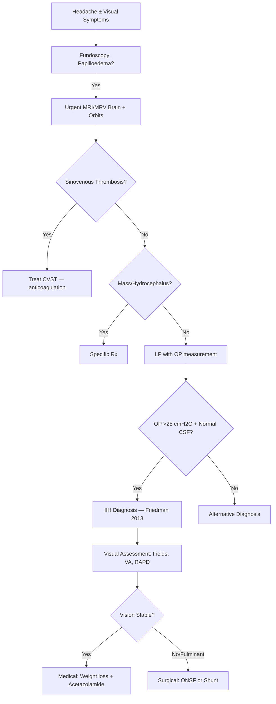
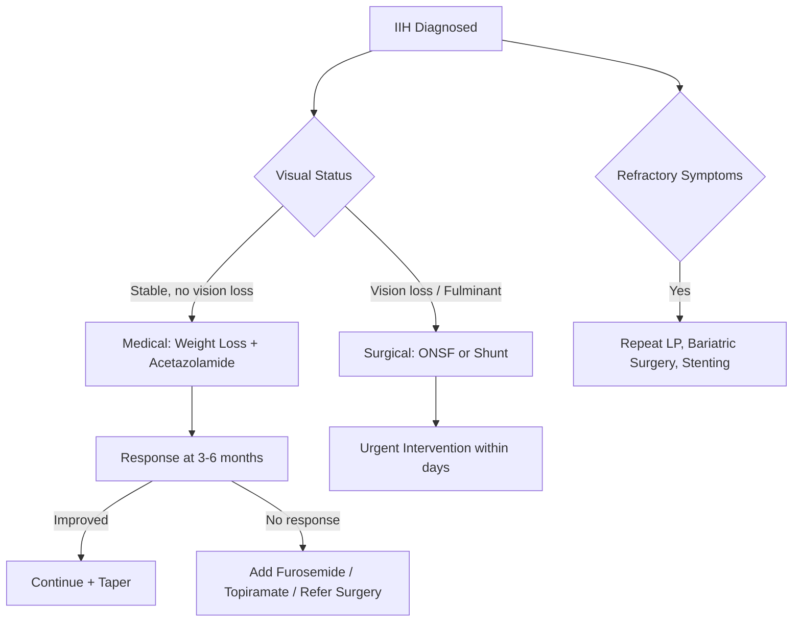

# Idiopathic Intracranial Hypertension (IIH / Pseudotumour Cerebri)

Related: [[Papilloedema]], [[Headache]], [[Visual Field Defects]], [[Cranial Nerve VI Palsy]]

> [!tip] **IIH** = raised ICP **without** mass, hydrocephalus, infection, or venous sinus thrombosis. **Classic patient:** young, obese woman of childbearing age with headache, papilloedema, and visual loss. **Diagnosis:** LP opening pressure **>25 cmH2O** (adults).

## Learning Objectives
- [ ] Apply Friedman/Friesen 2013 diagnostic criteria
- [ ] Recognise classic phenotype (obese woman, headache, papilloedema)
- [ ] Differentiate primary IIH from secondary causes (drugs, venous thrombosis)
- [ ] Initiate first-line management (weight loss, acetazolamide)
- [ ] Recognise fulminant and refractory disease
- [ ] Identify vision-threatening presentations
- [ ] Counsel on pregnancy, recurrence, and long-term outcomes

---

## 1. Definition / Epidemiology / Classification

### Definition
**IIH** (formerly pseudotumour cerebri / benign intracranial hypertension) = clinical syndrome of **raised intracranial pressure** without identifiable cause (mass lesion, hydrocephalus, infection, venous sinus thrombosis), with normal CSF composition.

### Epidemiology
- **Incidence:** 0.5-2/100,000/year (general); **12-20/100,000/year** in obese women of childbearing age
- **Sex:** F:M = 8:1 (in obese population)
- **Age:** Peak 20-40 years; rare in children
- **Ethnicity:** Higher incidence in Caucasian, Hispanic populations

### Classification
| Type | Features |
|------|----------|
| **Primary IIH** | Idiopathic (per Friedman criteria) |
| **Secondary IIH** | Identifiable cause (drugs, venous thrombosis, endocrine) |
| **Fulminant IIH** | Rapid vision loss (<4 weeks from onset) — neuro-ophthalmic emergency |
| **Refractory IIH** | Persistent symptoms despite maximal medical therapy |

---

## 2. Aetiology / Pathophysiology

### Risk Factors
- **Obesity** (BMI >30) — strongest risk factor
- **Recent weight gain** (5-15% in 12 months)
- **Female sex, reproductive age**
- **Polycystic ovarian syndrome (PCOS)**
- **Pregnancy**
- **Sleep apnoea**

### Drug Associations
| Drug Class | Examples |
|------------|----------|
| Vitamin A derivatives | Isotretinoin, all-trans retinoic acid, vitamin A excess |
| Tetracyclines | Doxycycline, minocycline, tetracycline |
| Steroid withdrawal | Long-term steroids, Cushing's |
| Growth hormone | Recombinant GH |
| Other | Lithium, amiodarone, tamoxifen, nalidixic acid |

### Secondary Causes (Must Exclude)
- **Cerebral venous sinus thrombosis** (CVST) — most important
- **Obstructive hydrocephalus**
- **Intracranial mass**
- **Meningitis/encephalitis**
- **Hypoparathyroidism, hypervitaminosis A**

### Pathophysiology
```mermaid
flowchart TD
    A[Obesity + Hormonal Factors] --> B[↑ Intra-abdominal Pressure]
    B --> C[↑ Venous Pressure]
    C --> D[↓ CSF Absorption (Arachnoid Granulations)]
    D --> E[↑ CSF Volume]
    E --> F[↑ ICP]
    F --> G[Optic Nerve Sheath Distension]
    G --> H[Papilloedema + Optic Nerve Ischaemia]
    F --> I[CN VI Stretching → Diplopia]
    F --> J[Headache, Pulsatile Tinnitus]
```

### Molecular/Cellular Basis
- **↑ CSF outflow resistance** at arachnoid villi (primary mechanism)
- **↓ CSF absorption** due to obesity-related venous hypertension
- **Adipokine dysregulation** (leptin resistance) implicated
- **Venous sinus stenosis** (transverse sinus) — primary or secondary

---

## 3. Clinical Features

### History
- **Headache** (90%): generalised, daily, worse on lying/Valsalva/cough; may mimic migraine
- **Visual disturbances:** transient visual obscurations (seconds, postural), blurring, double vision
- **Pulsatile tinnitus** (60%): "whooshing" sound synchronous with pulse
- **Diplopia** (CN VI palsy — false localising sign, ~20%)
- **Neck/back pain** (radicular from ↑ICP)
- **Photophobia, nausea**
- **Visual field loss** (peripheral → central, late)
- **Symptoms worse in morning / recumbency / with Valsalva**

### Examination
| Domain | Findings |
|--------|----------|
| **Visual acuity** | Normal (early); ↓ in late/fulminant |
| **Colour vision** | Normal (until late) |
| **Pupils** | Normal |
| **Fundoscopy** | **Papilloedema** (bilateral); spontaneous venous pulsation absent |
| **Visual fields** | Enlarged blind spot; nasal/constriction in late disease |
| **Cranial nerves** | CN VI palsy (unilateral/bilateral); ± CN VII palsy |
| **Systemic** | BMI ↑, BP, acne/PCOS features |

### Papilloedema Grading (Frisén)
| Grade | Features |
|-------|----------|
| 0 | Normal disc |
| I | Obscuration of nasal disc margin |
| II | Obscuration of all disc margins; halo |
| III | Partial obscuration of vessels at disc margin |
| IV | Total obscuration of vessels at disc |
| V | Dome-shaped disc with obliterated cup |

### Specific Syndromes
| Syndrome | Features |
|----------|----------|
| **Fulminant IIH** | Vision loss <4 weeks; severe papilloedema; surgical emergency |
| **Refractory IIH** | Persistent symptoms despite acetazolamide + weight loss |
| **IIH in pregnancy** | Often improves post-partum; acetazolamide usually avoided in 1st trimester |
| **IIH in children** | Equal sex distribution; often secondary causes |

---

## 4. Diagnostic Approach / Algorithm



### Friedman/Friesen 2013 Diagnostic Criteria
| Criterion | Requirement |
|-----------|-------------|
| **A. Required (all)** | (1) Papilloedema; (2) Normal neurological exam (except CN VI palsy); (3) Normal CSF composition; (4) Normal brain parenchyma on MRI/MRV (no hydrocephalus, mass, abnormal meningeal enhancement); (5) Normal venous sinus flow on MRV; (6) **LP opening pressure >25 cmH2O** (or >28 in obese) |
| **B. Diagnosis of IIH *without* papilloedema** | If A(2-5) satisfied + unilateral/bilateral abducens palsy + LP OP >25 cmH2O → "IIH without papilloedema" |
| **C. Probable IIH** | If A(2-5) + papilloedema absent + OP not measured |

---

## 5. Investigations

### First-Line
| Test | Indication | Finding |
|------|------------|---------|
| Fundoscopy | All suspected | Papilloedema |
| Visual fields (Humphrey 24-2) | All | Enlarged blind spot; inferior nasal step |
| Visual acuity, colour, RAPD | All | Late-stage involvement |
| BMI, BP | All | Obesity |

### Neuroimaging (mandatory)
| Modality | Indication | Key Findings |
|----------|------------|--------------|
| **MRI brain + orbits with contrast** | All suspected | Empty sella, posterior globe flattening, distended optic nerve sheaths, transverse sinus stenosis |
| **MRV** | All suspected (exclude CVST) | Sinovenous thrombosis, transverse sinus stenosis |
| **CT venogram** | If MRV unavailable | Sinus thrombosis |
| **CT head (non-contrast)** | Acute presentation, rule out mass | May show small ventricles |

### MRI Signs of IIH
| Sign | Sensitivity | Specificity |
|------|-------------|-------------|
| Posterior globe flattening | High | High |
| Distended perioptic subarachnoid space | High | Moderate |
| Empty sella | Moderate | Low (also in normal) |
| Transverse sinus stenosis | High | High |
| Vertical tortuosity of optic nerve | Moderate | Moderate |

### Lumbar Puncture
- **Indication:** Confirm diagnosis; therapeutic tap in fulminant
- **OP:** >25 cmH2O (decubitus, legs extended, calm patient)
- **CSF:** Normal composition (WCC, protein, glucose)
- **Dangers:** Herniation (if mass missed); post-LP headache
- **Caution:** Never do LP before imaging to exclude mass

### Laboratory
- **Pregnancy test** (in women of childbearing age)
- **Endocrine:** TFT, cortisol, glucose if obesity-related
- **Hypercoagulability screen** if CVST suspected

---

## 6. Differential Diagnosis

| Differential | Distinguishing | Key Test |
|--------------|----------------|----------|
| **CVST** | Focal signs, seizures, venous infarction | MRV/CTV |
| **Intracranial mass** | Focal neurological signs | MRI |
| **Hydrocephalus** | Ventriculomegaly | CT/MRI |
| **Meningitis/encephalitis** | Fever, meningism, abnormal CSF | LP + CSF analysis |
| **Optic disc drusen** | Spontaneous venous pulsation present; OCT shows drusen | Fundoscopy, OCT |
| **Malignant hypertension** | ↑BP, papilloedema | BP |
| **Hypoparathyroidism** | Low Ca, high PO4 | Calcium, PTH |
| **Vitamin A toxicity** | Drug history, skin changes | Vitamin A level |

---

## 7. Management

### Treatment Algorithm


### Medical Management
| Agent | Dose | Mechanism | Monitoring |
|-------|------|-----------|------------|
| **Acetazolamide** | 250-500mg BD (max 2g/day) | Carbonic anhydrase inhibitor; ↓ CSF production | Electrolytes (K+, HCO3-), paresthesia, taste |
| **Topiramate** | 25-50mg BD-titrated | Multiple (incl. CA inhibition) | Weight loss (bonus), cognitive side effects |
| **Furosemide** | 20-40mg OD-BD | Adjunct; ↓ CSF production | K+, hypovolaemia |
| **Weight loss** | 5-10% body weight | Reduces venous pressure, ↑CSF absorption | Dietitian, lifestyle, bariatric referral |

### Surgical / Procedural
| Procedure | Indication | Complication |
|-----------|------------|--------------|
| **Optic nerve sheath fenestration (ONSF)** | Progressive visual loss despite medical Rx; fulminant | Diplopia, pupil changes, disc swelling recurrence |
| **VP/LP shunt** | Refractory headache + vision loss; fulminant | Obstruction (50% revision), infection, Chiari |
| **Venous sinus stenting** | Transverse sinus stenosis with gradient | Stent thrombosis, re-stenosis |
| **Bariatric surgery** | BMI >40 with refractory disease | Surgical complications; highly effective |

### Symptomatic
- **Headache:** standard analgesia; avoid opioids
- **Topiramate** for headache + weight loss (dual benefit)
- **Acetazolamide** treats both pressure and headache

### Special Populations
| Group | Consideration |
|-------|---------------|
| **Pregnancy** | Acetazolamide: avoid 1st trimester; continue 2nd/3rd if needed. Weight loss not recommended. Multidisciplinary (obstetrician, neurologist, ophthalmologist) |
| **Children** | Equal sex distribution; secondary causes common; acetazolamide lower dose |
| **Refractory** | Combined medical + surgical; venous sinus stenting emerging option |

---

## 8. Drug Interactions / Cautions
| Drug | Interaction/Caution |
|------|-------------------|
| **Acetazolamide** | Metabolic acidosis; hypokalaemia; sulfa allergy; teratogenic (1st trimester); avoid in severe renal/hepatic impairment |
| **Topiramate** | Cognitive slowing; kidney stones; paresthesia; weight loss (positive); avoid in pregnancy (cleft) |
| **Furosemide** | Hypokalaemia; ototoxicity; hypovolaemia |
| **Steroid withdrawal** | Rebound ↑ICP — taper carefully |

---

## 9. Procedures
### Lumbar Puncture (Diagnostic + Therapeutic)
- **Indications:** Diagnosis confirmation; therapeutic tap in fulminant IIH
- **Contraindications:** Mass lesion, raised ICP from mass, infection at site
- **Preparation:** Patient lateral decubitus, legs extended, calm; manometer
- **Complications:** Post-LP headache (10-30%), infection, bleeding, herniation (if mass)

---

## 10. Complications
| Complication | Frequency | Management |
|--------------|-----------|------------|
| **Permanent visual loss** | 5-25% (varies) | Early surgery, ONSF, shunt |
| **Recurrence** | 20-30% (after 5 years) | Weight maintenance, acetazolamide |
| **Migraine** | Common | Standard migraine prophylaxis |
| **Empty sella** | 30-40% (MRI sign, rarely symptomatic) | None usually |
| **Spontaneous CSF leak** | Rare | Surgical repair |
| **Chiari I malformation** | Rare, post-shunt | Surgical decompression |

---

## 11. Red Flags
| Red Flag | Action | Time Window |
|----------|--------|-------------|
| Fulminant IIH (vision loss <4 weeks) | Urgent surgery (ONSF or shunt) | Days |
| New CN palsy with severe headache | Exclude CVST (MRV), mass | Same day |
| Visual field loss progression | Urgent ONSF/shunt | Within 1 week |
| Persistent diplopia despite Rx | Reassess, surgical options | Weeks |
| Pregnancy with severe disease | MDT, consider early delivery | Variable |

---

## 12. Prognosis
| Factor | Good | Poor |
|--------|------|------|
| Weight loss | Achieved 5-10% | Persistent obesity |
| Onset to treatment | <3 months | Delayed >1 year |
| Initial visual loss | Mild | Severe (CF or worse) |
| Fulminant course | No | Yes |
| Disc appearance at presentation | Mild swelling | Severe (Frisén 4-5) |

- **Vision outcome:** 50-70% stable with medical Rx; 5-25% permanent visual impairment
- **Recurrence:** 20-30% over 5-10 years
- **Mortality:** Low; long-term morbidity from chronic headache, vision loss

---

## 13. Topic Correlation
| Topic | Link | Key Overlap |
|-------|------|-------------|
| Visual Field Defects | [[Visual Field Defects]] | Enlarged blind spot |
| CN VI Palsy | [[Cranial Nerve VI Palsy]] | False localising sign |
| Papilloedema | [[Papilloedema]] | Bilateral disc swelling |
| Headache | [[Headache]] | Differential diagnosis |
| CVST | [[Cerebral Venous Thrombosis]] | Mimic; mandatory to exclude |

---

## 14. Special Situations
| Situation | Consideration |
|-----------|---------------|
| **Pregnancy** | Acetazolamide: avoid 1st trimester; continue later; obstetric MDT |
| **Lactation** | Acetazolamide compatible; monitor infant |
| **Paediatric** | Equal sex; secondary causes; lower acetazolamide dose |
| **Elderly** | Secondary causes more common; lower threshold for imaging |
| **Driving (DVLA)** | Visual field criteria; symptomatic relief required |
| **Bariatric surgery** | Effective for refractory; consider if BMI >40 |

---

## FCPS/MRCP High-Yield Summary
| Category | Key Points |
|----------|------------|
| **Definition** | Raised ICP without mass, hydrocephalus, infection, or CVST |
| **Epidemiology** | Obese women of childbearing age; F:M 8:1; 12-20/100,000 |
| **Pathophysiology** | Obesity → venous hypertension → ↓ CSF absorption |
| **Clinical** | Headache, papilloedema, transient visual obscurations, pulsatile tinnitus, CN VI palsy |
| **Diagnosis** | Friedman 2013: papilloedema + normal neuroimaging + LP OP >25 cmH2O |
| **MRI signs** | Empty sella, posterior globe flattening, transverse sinus stenosis |
| **Medical Rx** | Acetazolamide (1st line), topiramate, furosemide, weight loss |
| **Surgical Rx** | ONSF, VP/LP shunt, venous sinus stenting, bariatric surgery |
| **Fulminant IIH** | Surgical emergency (days); ONSF or shunt |
| **Recurrence** | 20-30%; weight gain = relapse risk |

---

## Viva Questions
1. **Q:** What is the diagnostic threshold for LP opening pressure in IIH?
   **A:** >25 cmH2O in adults (some criteria use >28 in obese); measured lateral decubitus, legs extended, calm patient.
2. **Q:** Most important secondary cause to exclude?
   **A:** Cerebral venous sinus thrombosis (CVST) — must do MRV/CTV in all suspected.
3. **Q:** First-line medical therapy?
   **A:** Acetazolamide 250-500mg BD (carbonic anhydrase inhibitor; ↓ CSF production) + weight loss (5-10%).
4. **Q:** Fulminant IIH management?
   **A:** Surgical emergency; optic nerve sheath fenestration or VP/LP shunt within days; consider steroids, repeat LP.
5. **Q:** Why is CN VI palsy a "false localising" sign?
   **A:** CN VI has long intracranial course; raised ICP stretches it anywhere, doesn't localise lesion.
6. **Q:** What MRI sign supports IIH?
   **A:** Empty sella, posterior globe flattening, distended optic nerve sheaths, transverse sinus stenosis.
7. **Q:** Drugs that cause secondary IIH?
   **A:** Isotretinoin, tetracyclines, vitamin A excess, steroid withdrawal, growth hormone, lithium, tamoxifen.
8. **Q:** Pregnancy with IIH — management?
   **A:** Avoid acetazolamide in 1st trimester; continue later; weight loss not recommended; MDT obstetric-neurology-ophthalmology.

---

## Common Confusions / Exam Traps
| Confusion | Clarification |
|-----------|---------------|
| IIH = brain tumour | IIH has NO mass; hence "pseudotumour" |
| Lumbar puncture in IIH | NEVER before imaging (risk of herniation) |
| CN VI palsy localises lesion | False localising sign (raised ICP stretches long nerve) |
| Acetazolamide in pregnancy | Avoid 1st trimester; continue 2nd/3rd if needed |
| Steroids for chronic IIH | NOT recommended; only short-term in fulminant |
| Weight loss is Rx | Yes — 5-10% body weight loss significantly reduces ICP |

---

## Mnemonics
1. **IIH = pseudotumour cerebri** — Young obese women, headache, papilloedema, normal CSF composition, ↑ opening pressure
1. **MODIFIED DANDY CRITERIA** — Symptoms of ↑ICP, no localising signs (except CN VI), normal neuroimaging, ↑ opening pressure, normal CSF
1. **TREATMENT** — Weight loss (10% = 50% improvement), acetazolamide 250-500mg BD, topiramate, FBC (optic nerve sheath) for vision loss, VP shunt/stent for refractory

---

## Mind Map

```mermaid
mindmap
  root((Idiopathic Intracranial Hypertension (IIH)))
    Definition
    Epidemiology
    Pathophysiology
    Clinical Features
    Investigations
    Differential Diagnosis
    Management
      Acute
      Long-term
    Complications
    Prognosis
```

---

## Spaced Repetition Trackers

| Review Interval | Date | Score (0-5) | Notes |
|-----------------|------|-------------|-------|
| Day 1 | | | |
| Day 3 | | | |
| Day 7 | | | |
| Day 14 | | | |
| Day 30 | | | |
| Day 90 | | | |

---

## Self-Test Scorecard

| Section | Score /5 | Last Attempt |
|---------|----------|--------------|
| Definition & Epidemiology | | |
| Pathophysiology | | |
| Clinical Features | | |
| Investigations | | |
| Differential Diagnosis | | |
| Management | | |
| Complications & Prognosis | | |
| Viva Questions | | |
| MCQs | | |
| SBAs | | |

---

## MCQs (10)

1. **Question:** IIH typical patient:
   **Options:** A. Young obese woman of childbearing age (15-45y) B. Elderly man C. Child D. Adolescent male
   **Answer:** A
   **Explanation:** IIH: women 15-45y, obesity (BMI >30), sometimes pregnancy. Female:male ratio 8:1.

2. **Question:** IIH clinical features:
   **Options:** A. Headache (worse morning, valsalva), papilloedema, transient visual obscurations, pulsatile tinnitus, CN VI palsy (false localising) B. Focal deficit C. Seizure D. Cognitive decline only
   **Answer:** A
   **Explanation:** IIH: headache (morning, valsalva, orthostatic), papilloedema, transient visual obscurations (seconds), pulsatile tinnitus, CN VI palsy (false localising), diplopia.

3. **Question:** IIH diagnostic criteria (Modified Dandy):
   **Options:** A. Symptoms of ↑ICP, no localising signs (except CN VI), normal neuroimaging, ↑ opening pressure, normal CSF composition B. Any C. Genetic D. Biopsy
   **Answer:** A
   **Explanation:** Modified Dandy: symptoms of ↑ICP, no focal signs (except CN VI), normal CT/MRI (or empty sella, slit-like ventricles), ↑ opening pressure (>25 cm H2O), normal CSF composition.

4. **Question:** IIH MRI features (empty sella, etc.):
   **Options:** A. Empty sella, slit-like ventricles, flattening of posterior globe, distended optic nerve sheaths, transverse venous sinus stenosis B. Tumour C. Stroke D. MS
   **Answer:** A
   **Explanation:** IIH MRI: empty sella (50%), slit-like ventricles, posterior globe flattening, distended optic nerve sheaths (with gadolinium), transverse venous sinus stenosis.

5. **Question:** IIH first-line treatment:
   **Options:** A. Weight loss (10% body weight) + acetazolamide 250-500mg BD B. Surgery C. VP shunt first D. Steroids long-term
   **Answer:** A
   **Explanation:** IIH first-line: weight loss (10% = 50% improvement in ICP), acetazolamide 250-500mg BD (carbonic anhydrase inhibitor → ↓ CSF).

6. **Question:** Acetazolamide mechanism:
   **Options:** A. Carbonic anhydrase inhibitor (↓ CSF production) B. Diuretic only C. Na+ blocker D. Steroid
   **Answer:** A
   **Explanation:** Acetazolamide: carbonic anhydrase inhibitor, ↓ CSF production at choroid plexus. Side effects: paraesthesia, metabolic acidosis, kidney stones.

7. **Question:** Topiramate in IIH:
   **Options:** A. Alternative to acetazolamide (carbonic anhydrase inhibitor + weight loss side effect) B. Steroid C. Anticoagulant D. Beta-blocker
   **Answer:** A
   **Explanation:** Topiramate: also carbonic anhydrase inhibitor. Plus weight loss side effect. Alternative if acetazolamide not tolerated.

8. **Question:** IIH vision loss risk factors:
   **Options:** A. Severe papilloedema, chronic course, male, black race, fulminant (acute vision loss) B. Mild papilloedema C. Female only D. Young age
   **Answer:** A
   **Explanation:** Vision loss risk: severe/chronic papilloedema, male, black race, fulminant course (sudden vision loss), high-grade papilloedema (Frisén). Monitor visual fields.

9. **Question:** IIH surgical options:
   **Options:** A. VP shunt, LP shunt, optic nerve sheath fenestration, venous sinus stenting B. Stereotactic radiation C. Craniotomy D. Tumour resection
   **Answer:** A
   **Explanation:** IIH surgery: VP shunt (most common), LP shunt, optic nerve sheath fenestration (for vision loss), venous sinus stenting (for refractory).

10. **Question:** Fulminant IIH is:
   **Options:** A. Acute vision loss, severe papilloedema, requires urgent surgery (ONSF or shunt) B. Mild C. Self-limiting D. No treatment needed
   **Answer:** A
   **Explanation:** Fulminant IIH: acute vision loss, severe papilloedema, marked ↑ ICP. Urgent surgical: optic nerve sheath fenestration or VP shunt.

---

## SBA Questions (10)

1. **Scenario:** 30-year-old obese woman, headache worse morning, transient visual obscurations, papilloedema, normal MRI. LP: opening pressure 32 cm H2O, normal CSF. Diagnosis?
   **Options:** A. IIH (Modified Dandy criteria met) B. Migraine C. Tumour D. MS E. Meningitis
   **Answer:** A
   **Explanation:** IIH: typical patient, headache, TVO, papilloedema, normal imaging, ↑ opening pressure, normal CSF. All Modified Dandy criteria met.

2. **Scenario:** IIH patient on acetazolamide 500mg BD, vision worsening. Next step?
   **Options:** A. Add topiramate OR refer for surgery (ONSF or VP shunt) B. Increase steroids C. Stop all treatment D. Wait E. Aspirin
   **Answer:** A
   **Explanation:** IIH with vision loss: add topiramate OR urgent surgical (ONSF, VP shunt, venous sinus stenting).

3. **Scenario:** Fulminant IIH, vision 20/200 both eyes, severe papilloedema, no response to acetazolamide. Treatment?
   **Options:** A. Urgent optic nerve sheath fenestration (ONSF) or VP shunt B. Increase acetazolamide C. Topiramate D. Wait E. No treatment
   **Answer:** A
   **Explanation:** Fulminant IIH: ONSF (preserves vision) or VP shunt urgently. Acetazolamide not enough.

---

## Tags

**Tags:** #neurology #neuro-ophthalmology #IIH #pseudotumour #papilloedema #acetazolamide #obesity #FCPS #MRCP

---

## Local Navigation
**Heading Hub:** [[../Optic Nerve & Chiasm Hub]]
**Chapter Hierarchy:** [[../../Davidson Chapter 25 - Neurology Hierarchy]]
**Chapter MOC:** [[../../Neurology MOC]]
**Drug Reference:** [[../../00_Index/Neurology Drug Reference]]

## PasTest Scenario SBAs (Clinical Vignettes)

> **Auto-generated PasTest/Mediscope-style scenario SBAs** grounded in the authored source. Each scenario tests a real clinical fact (triad, specific sign, contraindication, trial, first-line Rx) extracted from the topic. *Source: Ch 27: Neurology & Stroke — Idiopathic Intracranial Hypertension*

**Q1.** What is the most appropriate first-line therapy for Idiopathic Intracranial Hypertension?

  - **A.** Fulminant IIH with rapid visual loss   IV acetazolamide + serial LPs + surgery   Hours-days
  - **B.** An advanced/surgical therapy reserved for refractory disease
  - **C.** Symptomatic treatment only, no disease-modifying therapy
  - **D.** Empiric broad-spectrum therapy without specific indication

  > **Answer: A** — Fulminant IIH with rapid visual loss   IV acetazolamide + serial LPs + surgery   Hours-days
  >
  > *Source:* **Fulminant IIH with rapid visual loss**   IV acetazolamide + serial LPs + surgery   Hours-days

