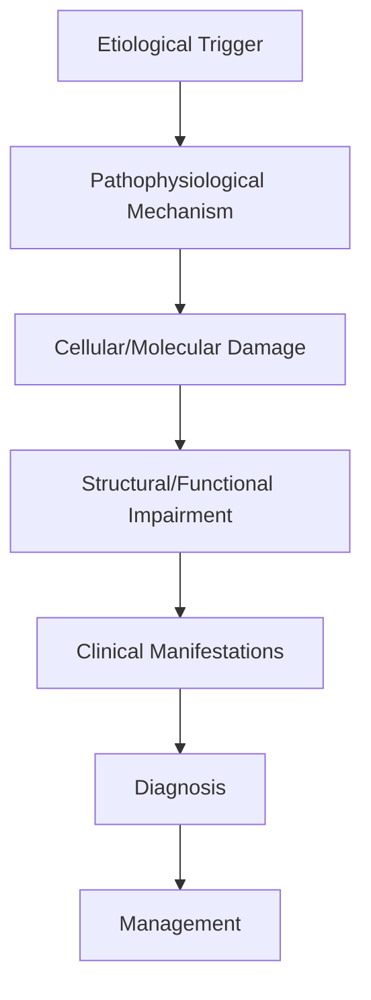

# Ischaemic Optic Neuropathy

> [!tip] **High-Yield Definition**
> Comprehensive clinical note for Ischaemic Optic Neuropathy covering definition, epidemiology, aetiology, pathophysiology, clinical features, investigations, differential diagnosis, management, drug interactions, procedures, complications, red flags, prognosis, topic correlation, and special situations for FCPS/MRCP examination preparation based on Davidson 24th Edition Chapter 25: Neurology.

---

## 1. Definition / Epidemiology / Classification

### Definition
Ischaemic Optic Neuropathy is a neurological disorder within the 17 neuroophthalmology category. It is characterised by specific clinical, pathological, radiological, and laboratory features that allow differentiation from related conditions.

### Epidemiology
- **Incidence/Prevalence:** Variable depending on the specific condition.
- **Age:** Adult onset is most common, but paediatric and elderly presentations occur.
- **Sex:** Variable depending on the condition.
- **Geography:** Worldwide distribution, with higher prevalence in certain regions.
- **Risk Factors:** Genetic predisposition, environmental factors, comorbidities, family history.

### Classification
| Subtype | Key Features | Prognosis |
|---------|-------------|-----------|
| Mild/early | Subtle symptoms, preserved function | Best |
| Moderate | Clear symptoms, functional impairment | Variable |
| Severe | Significant disability, complications | Worst |

---

## 2. Aetiology / Pathophysiology

### Aetiology
- **Primary (idiopathic):** Most cases have no identifiable cause.
- **Genetic:** May be inherited (AD, AR, X-linked, mitochondrial, sporadic).
- **Autoimmune:** Autoantibodies, immune-mediated inflammation.
- **Infectious:** Viral, bacterial, fungal, parasitic.
- **Metabolic:** Electrolyte, endocrine, hepatic, renal, nutritional.
- **Toxic:** Drugs, alcohol, heavy metals, environmental toxins.
- **Vascular:** Ischaemia, haemorrhage, vasculitis.
- **Neoplastic:** Primary, secondary, paraneoplastic.
- **Traumatic:** Acute, chronic, repetitive.
- **Degenerative:** Neurodegeneration, protein misfolding.

### Pathophysiology


---

## 3. Clinical Features

### History
- **Onset/Duration:** Acute, subacute, or chronic.
- **Progression:** Static, progressive, relapsing-remitting, stepwise.
- **Key symptoms:** Specific to the condition.
- **Triggers:** Stress, infection, trauma, drugs, hormonal, environmental.
- **Systemic symptoms:** Constitutional features.
- **Drug/Family/Social history:** Relevant exposures, comorbidities.

### Examination
| Domain | Key Findings | Localisation Value |
|--------|-------------|-------------------|
| Higher function | Cognitive, behavioural | Cortical, subcortical, limbic |
| Cranial nerves | Pupils, eye movements, facial, bulbar | Brainstem, cranial nerve, NMJ |
| Motor | Weakness, tone, reflexes | UMN, LMN, NMJ, muscle |
| Sensory | All modalities, pattern | Peripheral, spinal, brainstem |
| Coordination | Ataxia, nystagmus, dysmetria | Cerebellar, sensory, vestibular |
| Gait | Spastic, ataxic, parkinsonian | Multiple |
| Autonomic | Orthostatic, sweating, GI, bladder | Autonomic, peripheral, central |

### Specific Clinical Features
The clinical features are determined by the underlying aetiology, location of pathology, and rate of progression. Patients typically present with a constellation of symptoms and signs that allow clinical localisation and subsequent targeted investigation.

---

## 4. Diagnostic Approach / Algorithm

```mermaid
flowchart TD
    A[Clinical Presentation] --> B[Anatomical Localisation]
    B --> C[Pathophysiological Category]
    C --> D[Formulate Differential]
    D --> E[Targeted Investigations]
    E --> F[Confirm Diagnosis]
    F --> G[Assess Severity/Prognosis]
    G --> H[Initiate Management]
    H --> I[Monitor Response]
    I --> J{Response?}
    J --> YES1 [Good - Continue]
    J --> NO1 [Poor - Escalate]
    YES1 --> K[Monitor]
    NO1 --> H
```

---

## 5. Investigations

### First-Line Investigations
- **Blood tests:** FBC, U&Es, LFTs, glucose, calcium, magnesium, ESR, CRP, autoimmune, infection.
- **Imaging:** CT/MRI brain/spine (essential for most neurological conditions).
- **Neurophysiology:** EEG, nerve conduction, EMG, evoked potentials.
- **CSF:** Cell count, protein, glucose, OCBs, PCR, culture.

### Second-Line Investigations
- **Genetic testing:** Gene panels, WES, WGS.
- **Antibody testing:** Antineuronal, autoimmune, paraneoplastic.
- **Biopsy:** Nerve, muscle, brain, skin.
- **Advanced imaging:** PET-CT, MR spectroscopy, fMRI.

### Specialised Investigations
- **Biomarkers:** Neurofilament light chain, tau, beta-amyloid, 14-3-3, RT-QuIC.
- **Autonomic testing:** Head-up tilt, sudomotor, QSART.
- **Neuropsychology:** Cognitive testing, behavioural assessment.
- **Genetic counselling:** Family screening, predictive testing.

---

## 6. Differential Diagnosis

| Differential | Distinguishing Features | Key Test |
|--------------|------------------------|----------|
| Vascular | Sudden onset, focal, vascular risk factors | MRI/CT, vessel imaging |
| Inflammatory | Subacute, multifocal, systemic | MRI, CSF, antibodies |
| Infectious | Fever, systemic, exposure | Bloods, CSF, imaging |
| Neoplastic | Progressive, mass effect | MRI, biopsy |
| Degenerative | Progressive, symmetric, hereditary | MRI, genetic |
| Toxic/Metabolic | Drug history, systemic, reversible | Bloods, toxicology |
| Autoimmune | Multifocal, antibodies, immunotherapy response | Antibodies, MRI, CSF |
| Functional | Inconsistent, distractible | Clinical, video, biomarkers |

---

## 7. Management

### Acute Management
- **Stabilisation:** ABCDE approach, emergency resuscitation.
- **Specific treatment:** Disease-specific interventions.
- **Symptomatic relief:** Pain, seizures, spasticity, autonomic dysfunction.
- **Prevention of complications:** DVT, pressure sores, infection.

### Disease-Modifying Treatment
- **Pharmacological:** First-line, second-line, escalation, maintenance.
- **Procedural:** Surgery, biopsy, drainage, ablation, stimulation.
- **Immunotherapy:** Steroids, IVIG, plasma exchange, immunosuppressants, biologics.
- **Rehabilitation:** Physiotherapy, OT, speech therapy.

### Long-Term Management
- **Monitoring:** Clinical, imaging, biomarkers, side effects.
- **Prevention:** Vaccinations, prophylaxis, lifestyle modification.
- **Supportive care:** Multidisciplinary team, social work, psychological support.
- **Palliative care:** Advanced care planning, end-of-life care, hospice.

---

## 8. Drug Interactions / Contraindications / Comorbidity Cautions

| Drug Class | Interaction / Caution | Management |
|------------|----------------------|------------|
| Antiseizure medications | Enzyme induction, teratogenicity | Monitor, supplement, switch |
| Immunosuppressants | Infection, malignancy, teratogenicity | Monitor, prophylaxis |
| Anticoagulants | Bleeding risk, drug interactions | Monitor INR, avoid combinations |
| Antihypertensives | Hypotension, falls | Monitor BP, adjust dose |
| Antibiotics | Nephrotoxicity, ototoxicity | Monitor renal |
| Antivirals | Nephrotoxicity, neuropsychiatric | Monitor renal, dose adjust |
| Steroids | DM, HTN, osteoporosis, infection | Monitor, prophylaxis, taper |
| Biologics | Infusion reactions, infection | Monitor, prophylaxis |

---

## 9. Procedures

### Common Procedures
- **Lumbar puncture:** Diagnostic, therapeutic (IIH, NPH). Contraindications: raised ICP, mass lesion, coagulopathy.
- **Nerve conduction studies/EMG:** Diagnostic, prognosis. Minor discomfort.
- **EEG:** Diagnostic, monitoring. No significant complications.
- **MRI brain/spine:** Diagnostic, monitoring. Contraindications: pacemaker, metallic implants.
- **CT head:** Emergency, rapid. Radiation exposure, contrast reactions.
- **Biopsy:** Stereotactic, open. Indications: diagnosis, molecular profiling.

---

## 10. Complications

| Complication | Frequency | Prevention | Management |
|--------------|-----------|------------|------------|
| Infection | Common | Hygiene, prophylaxis, vaccination | Antibiotics, antifungals |
| Thrombosis | Common | Prophylaxis, mobility | Anticoagulation |
| Pressure sores | Common | Positioning, nutrition | Wound care, surgery |
| Spasticity | Common | Positioning, stretching | Baclofen, BoNT |
| Contractures | Common | Passive movements, splints | Physiotherapy, surgery |
| Aspiration | Common | Swallow assessment | NGT, PEG, thickeners |
| Falls | Common | Environment, mobility | Walking aids |
| Fractures | Common | Bone health, prevention | Vitamin D, bisphosphonate |
| Depression | Common | Screening, support | Antidepressants, CBT |
| Cognitive decline | Variable | Monitoring, training | Rehabilitation |
| Autonomic dysfunction | Variable | Monitoring, hydration | Midodrine, fludrocortisone |
| Respiratory failure | Variable | Monitoring, supportive | Ventilation, NIV |
| Death | Variable | Monitoring, palliative | End-of-life care |

---

## 11. Red Flags / Emergencies

### Emergency Presentations
- **Rapid neurological deterioration:** New focal deficit, decreased consciousness, seizures.
- **Status epilepticus:** Continuous seizures >5 min.
- **Raised ICP:** Headache, vomiting, papilloedema, altered consciousness.
- **Respiratory failure:** Hypoxia, hypercapnia, ventilatory failure.
- **Cardiac arrest:** Arrhythmia, MI, pulmonary embolism.
- **Infection:** Sepsis, meningitis, abscess, encephalitis.
- **Drug toxicity:** Overdose, side effects, interactions.
- **Haemorrhage:** Intracranial, systemic, coagulopathy.

---

## 12. Prognosis

### Natural History
- **Acute:** May resolve with treatment, may progress, may be fatal.
- **Subacute:** Variable, depends on cause and treatment.
- **Chronic:** Often progressive, may be stable, may have relapses.
- **Recovery:** Variable, may be complete, partial, or none.

### Prognostic Factors
- **Favourable:** Young age, early treatment, mild disease, reversible cause, good premorbid function, family support.
- **Unfavourable:** Older age, delayed treatment, severe disease, irreversible cause, poor premorbid function, comorbidities.

---

## 13. Topic Correlation

| Related Topic | Link | Key Overlap |
|---------------|------|-------------|
| Davidson 24th Ed Chapter 25 | [[Davidson Chapter 25 - Neurology Hierarchy]] | Comprehensive neurology |
| Neurology MOC | [[Neurology MOC]] | All neurology topics |
| Drug Reference | [[../00_Index/Neurology Drug Reference]] | Medications |
| Local Hub | [[../17_Neuroophthalmology/Hub]] | Section-specific |
| Clinical Examination | [[../01_Fundamentals_Examination/Neurological History Taking]] | Clinical approach |
| Investigation | [[../01_Fundamentals_Examination/Neuroimaging (CT-MRI) Principles]] | Imaging |

---

## 14. Special Situations

| Situation | Consideration |
|-----------|---------------|
| **Pregnancy** | Pre-conception counselling, teratogenicity, drug safety, monitoring, delivery planning, breastfeeding. |
| **Lactation** | Drug safety, breastfeeding, monitoring, support. |
| **Paediatric** | Developmental considerations, drug dosing, school, family, vaccination, growth, puberty. |
| **Elderly / Frail** | Comorbidities, polypharmacy, falls, bone health, cognition, social, end-of-life. |
| **Renal impairment** | Drug dose adjustment, monitoring, dialysis, transplant. |
| **Hepatic impairment** | Drug dose adjustment, monitoring, transplant. |
| **Immunocompromised** | Infection prophylaxis, vaccination, drug interactions, malignancy screening. |
| **Perioperative** | Drug management, anaesthesia planning, VTE prophylaxis, infection prevention, monitoring. |
| **Driving / DVLA** | Fitness to drive, restrictions, notification, reassessment. |
| **Occupational** | Fitness for work, adaptations, rehabilitation, disability, return to work. |

---

## FCPS/MRCP High-Yield Summary

| Category | Key Points |
|----------|------------|
| **Definition** | Comprehensive definition with key diagnostic criteria |
| **Epidemiology** | Incidence, prevalence, age, sex, geography, risk factors |
| **Aetiology** | Primary causes, secondary causes, genetic, environmental |
| **Pathophysiology** | Mechanism of disease, cellular/molecular basis |
| **Clinical Features** | History, examination, key findings, variants |
| **Diagnosis** | Diagnostic criteria, classification, severity |
| **Investigations** | First-line, second-line, specialised, biomarkers |
| **Differential Diagnosis** | Key differentials, distinguishing features, tests |
| **Management** | Acute, disease-modifying, symptomatic, supportive |
| **Complications** | Common, serious, prevention, management |
| **Prognosis** | Natural history, prognostic factors, outcomes |
| **Viva Pearls** | Key examination points |
| **Drug Doses** | First-line, second-line, emergency |
| **Scoring Systems** | Specific scores used in management |
| **Genetics** | Inheritance, genes, mutations, family screening |
| **Imaging Signs** | Characteristic findings, differential |

---

## Viva Questions (PACES/FCPS Style)

1. **Q:** Define and classify its variants.
   **A:** Comprehensive definition with classification of subtypes based on aetiology, severity, and clinical features.

2. **Q:** What are the key clinical features?
   **A:** Specific symptoms and signs including onset, progression, key features, and associated findings.

3. **Q:** What is the first-line treatment?
   **A:** First-line pharmacological and non-pharmacological management based on current evidence.

4. **Q:** What are the red flags requiring urgent referral?
   **A:** Specific emergency presentations and complications requiring immediate intervention.

5. **Q:** What is the prognosis?
   **A:** Natural history, prognostic factors, and long-term outcomes.

6. **Q:** How do you differentiate from key differentials?
   **A:** Clinical features, investigations, and response to treatment that distinguish from alternative diagnoses.

7. **Q:** What investigations are most useful?
   **A:** First-line and second-line investigations including imaging, neurophysiology, CSF, and biomarkers.

8. **Q:** Describe the stepwise management approach.
   **A:** Stepwise escalation from first-line to second-line to third-line therapy with monitoring.

9. **Q:** What are the emergency presentations?
   **A:** Specific emergency scenarios and immediate management priorities.

10. **Q:** How does management change in pregnancy/paediatrics/elderly?
    **A:** Special considerations for each population including drug safety, monitoring, and support.

---

## Common Confusions / Exam Traps

| Confusion | Clarification |
|-----------|---------------|
| Similar presentation but different cause | Differentiate by history, examination, investigations |
| Treatment response vs natural history | Assess with objective measures, biomarkers |
| Drug interactions | Check each drug, monitor, adjust doses |
| Disease progression vs treatment failure | Monitor response, escalate appropriately |
| Functional vs organic | Inconsistent, distractible, disability greater than impairment |
| Acute vs chronic | Time course, progression, reversibility |
| Primary vs secondary | Underlying cause, contributing factors |
| Side effects vs symptoms | Temporal relationship, dose relationship |

---

## Mnemonics
1. ****NAION** = Non-arteritic, anterior, disc-at-risk (small cup), altitudinal VF defect, painless, sudden**
2. ****AAION = GCA** = Arteritic, anterior, GCA, emergency, ESR/CRP elevated, high-dose steroids within 24h**
3. ****PION** = Posterior, rare, surgical/anaemia/GCA**

---

## Mind Map

```mermaid
mindmap
  root((Ischaemic Optic Neuropathy (AION/PION)))
    Definition
    Pathophysiology
    Clinical
    Investigations
    Differential
    Management
    Complications
```

---

## Spaced Repetition Trackers

| Day 1 | Day 3 | Day 7 | Day 14 | Day 30 | Day 90 |
|------|-------|-------|--------|--------|--------|
| | | | | | |

---

## Self-Test Scorecard

| Section | Score /5 |
|---------|----------|
| Definition | |
| Pathophysiology | |
| Clinical | |
| Investigations | |
| Differential | |
| Management | |
| Complications | |

---

## MCQs (10)

1. **Q:** 70-year-old with sudden painless monocular vision loss, altitudinal field defect, swollen optic disc, ESR 80, CRP 100. Diagnosis?
   **Options:** A. Arteritic AION (GCA) - emergency B. NAION C. Optic neuritis D. CRVO
   **Answer:** A
   **Explanation:** AAION: sudden painless monocular vision loss (often severe), swollen pale disc, ESR/CRP elevated (ESR >50, CRP >10 typical), GCA. Emergency: high-dose IV methylprednisolone 1g/day for 3 days before temporal artery biopsy. Other eye at risk.

2. **Q:** 60-year-old with sudden painless vision loss, altitudinal defect, swollen disc, ESR 25, CRP 5. Cardiovascular risk factors. Disc-at-risk (small cup-to-disc). Diagnosis?
   **Options:** A. NAION B. AAION D. Optic neuritis C. NAION C. CRVO
   **Answer:** A
   **Explanation:** NAION: painless, sudden, altitudinal field defect, swollen (often segmentally) optic disc, disc-at-risk (small cup-to-disc ratio = 'crowded' disc), vascular risk factors, normal ESR/CRP. Most common acute optic neuropathy >50y.

3. **Q:** Treatment of NAION?
   **Options:** A. No proven treatment; risk factor control (BP, DM, cholesterol, OSA, smoking); aspirin; avoid hypotension B. Steroids C. Surgery D. Antibiotics
   **Answer:** A
   **Explanation:** NAION: no proven treatment (steroids not proven, surgery - optic nerve sheath fenectomy not effective). Risk factor control: BP, DM, cholesterol, OSA (CPAP), smoking cessation, avoid hypotensive agents at night (no nocturnal BP meds), aspirin.

4. **Q:** Management of GCA (AAION)?
   **Options:** A. IV methylprednisolone 1g/day for 3 days; oral prednisolone 1mg/kg; temporal artery biopsy within 1-2 weeks; tocilizumab as steroid-sparing B. Wait C. Aspirin D. Surgery
   **Answer:** A
   **Explanation:** GCA: emergency. IV methylprednisolone 1g/day for 3 days (visual loss), then oral prednisolone 1mg/kg, slow taper over 1-2 years. Temporal artery biopsy within 1-2 weeks (can still show inflammation after 2 weeks of steroids). Tocilizumab (IL-6 antagonist) as steroid-sparing. Other eye at risk.

5. **Q:** What are red flags for GCA?
   **Options:** A. Age >50, new headache, jaw claudication, scalp tenderness, vision loss, polymyalgia rheumatica, fever, weight loss B. All of the above C. None D. Only age
   **Answer:** A
   **Explanation:** GCA red flags: age >50, new onset headache, jaw claudication (very specific), scalp tenderness, vision loss (transient or permanent), PMR (40-50%), constitutional (fever, weight loss, fatigue), high ESR/CRP. Treat urgently if suspected.

6. **Q:** Why is temporal artery biopsy performed if GCA is suspected?
   **Options:** A. Confirm diagnosis; show giant cell granulomatous inflammation, intimal hyperplasia, fragmentation of internal elastic lamina; skip lesions possible, so 2-3 cm segment B. Only for treatment C. For research D. To remove vessel
   **Answer:** A
   **Explanation:** TAB: confirm GCA. Histology: granulomatous inflammation with multinucleated giant cells, intimal hyperplasia, fragmentation of internal elastic lamina. Skip lesions (skip areas of normal artery) - so take 2-3 cm segment. Can still be positive within 2 weeks of starting steroids.

7. **Q:** What is the second eye involvement rate in NAION?
   **Options:** A. ~15-25% within 5 years B. 50% C. 5% D. 100%
   **Answer:** A
   **Explanation:** NAION: second eye involvement ~15-25% within 5 years. Risk factors: contralateral disc-at-risk (small cup-to-disc), OSA, nocturnal hypotension (antihypertensives at night), DM, HTN.

8. **Q:** What is the second eye involvement rate in untreated GCA?
   **Options:** A. Up to 50% within days-weeks B. 10% C. 5% D. 100%
   **Answer:** A
   **Explanation:** Untreated GCA: up to 50% second eye involvement within days-weeks (may be permanent blindness). High-dose steroids reduce this to <10-15%. Treat urgently if suspected, do not wait for biopsy results.

9. **Q:** PION (posterior ischaemic optic neuropathy) causes?
   **Options:** A. Surgical (prone spine, cardiac), severe anaemia, hypotension, GCA, dialysis B. Vasculitis C. MS only D. Aneurysm
   **Answer:** A
   **Explanation:** PION: posterior optic nerve infarction (retrobulbar). Causes: surgical (prone spine surgery - 'postoperative visual loss', cardiac surgery), severe anaemia, hypotension, GCA, dialysis. Often bilateral.

10. **Q:** Disc-at-risk (small cup-to-disc) is associated with:
    **Options:** A. NAION B. AAION C. Optic neuritis D. Glaucoma
    **Answer:** A
    **Explanation:** Disc-at-risk: small cup-to-disc ratio ('crowded' optic disc, no physiological cup). Risk factor for NAION (mechanical compartment syndrome in optic nerve head with small space). Also seen in younger patients, hyperopic eyes.

---

## SBA Questions (10)

1. **Scenario:** 75-year-old with sudden vision loss right eye, jaw claudication, headache, scalp tenderness, polymyalgia. ESR 95, CRP 120.
   **Question:** Most appropriate immediate action?
   **Options:** A. IV methylprednisolone 1g/day immediately, before biopsy; temporal artery biopsy within 1-2 weeks; tocilizumab; urgent referral B. Wait for biopsy C. Aspirin only D. Triptans
   **Answer:** A
   **Explanation:** GCA with visual loss: emergency. IV methylprednisolone 1g/day x 3 days immediately, before biopsy result. Oral prednisolone 1mg/kg, taper over 1-2 years. TAB within 1-2 weeks (can still show changes after steroids). Tocilizumab as steroid-sparing (approved for GCA).

2. **Scenario:** 60-year-old with sudden painless vision loss, altitudinal field defect, swollen disc, ESR 30, CRP 4, diabetic, hypertensive.
   **Question:** Diagnosis and management?
   **Options:** A. NAION; no proven treatment; risk factor control (BP, DM, cholesterol, OSA, smoking); aspirin; avoid nocturnal hypotension B. GCA - steroids C. Optic neuritis D. Retinal detachment
   **Answer:** A
   **Explanation:** NAION: typical presentation. No proven treatment. Risk factor control crucial. Aspirin (some evidence for second eye protection). Avoid nocturnal hypotension (no antihypertensives at bedtime). OSA evaluation (CPAP if needed).

3. **Scenario:** Post-spine surgery patient, prone position 6 hours, no vision right eye on waking.
   **Question:** Cause and management?
   **Options:** A. Perioperative ischaemic optic neuropathy (PION); MRI brain, ophthalmology, support; no proven treatment; often partial recovery B. Stroke C. Tumour D. Migraine
   **Answer:** A
   **Explanation:** Perioperative ION (PION): prone spine surgery, cardiac surgery. Risk factors: long surgery, hypotension, blood loss, anaemia, prone position. MRI brain to exclude stroke (PCA). Ophthalmology consult. No proven treatment. Often partial recovery, may be permanent.

4. **Scenario:** GCA patient 5 days into IV methylprednisolone. Visual loss stable, no new symptoms. TAB scheduled day 7.
   **Question:** Approach to TAB?
   **Options:** A. Proceed with TAB; histology may still show changes after 1-2 weeks of steroids; biopsy site: temporal artery 2-3 cm; skip lesions possible B. Wait until steroids done C. Cancel D. Repeat MRI
   **Answer:** A
   **Explanation:** TAB: proceed. Can still show granulomatous inflammation after 1-2 weeks of steroids (may be focal/skip lesions). Take 2-3 cm segment. Contralateral biopsy if first negative. Don't delay steroids for biopsy.

5. **Scenario:** 65-year-old with NAION. History reveals loud snoring, witnessed apnoeas, daytime sleepiness.
   **Question:** Next step?
   **Options:** A. Sleep study; treat OSA with CPAP; reduce risk of second eye NAION B. Aspirin only C. Steroids D. No action
   **Answer:** A
   **Explanation:** OSA = significant risk factor for NAION (nocturnal hypoxia, raised intracranial venous pressure, optic nerve oedema in disc-at-risk). Sleep study (polysomnography or home test). CPAP treatment reduces risk of second eye NAION. Treat all NAION patients for OSA.

6. **Scenario:** 60-year-old with NAION. Other eye normal. Ask about second eye risk.
   **Question:** Counselling?
   **Options:** A. ~15-25% second eye involvement over 5 years; risk factor control critical (BP, DM, cholesterol, OSA, smoking); aspirin may help; avoid nocturnal hypotension B. 50% in 1 year C. No risk D. Always
   **Answer:** A
   **Explanation:** NAION: 15-25% second eye involvement over 5 years. Risk factor control crucial. Aspirin (some evidence). Avoid nocturnal hypotension. Monitor visual symptoms.

7. **Scenario:** GCA patient on prednisolone 60mg for 3 months. Symptoms resolved, ESR normal. Now wants to reduce.
   **Question:** Taper approach?
   **Options:** A. Slow taper over 1-2 years (reduce by 5mg every 2-4 weeks to 20mg, then 2.5mg every 2-4 weeks); monitor ESR, CRP; flare increases; tocilizumab if steroid-sparing needed B. Stop immediately C. Halve and continue D. Random
   **Answer:** A
   **Explanation:** GCA: slow steroid taper. Reduce by 5mg every 2-4 weeks to 20mg, then 2.5mg every 2-4 weeks to 10mg, then 1mg every 1-2 months. Total 1-2 years. Monitor ESR/CRP (relapse: increase). Tocilizumab (IL-6 antagonist) as steroid-sparing.

8. **Scenario:** 70-year-old with GCA, on steroids. Develops hip pain, easy bruising, weight gain, diabetes.
   **Question:** Management?
   **Options:** A. Steroid side effects; consider tocilizumab as steroid-sparing; bone protection (bisphosphonate, vitamin D, calcium), PPI, monitor BP/glucose B. Increase steroids C. Stop steroids abruptly D. Continue
   **Answer:** A
   **Explanation:** GCA: long-term steroid side effects (osteoporosis, weight gain, diabetes, BP, mood, cataracts, infection). Mitigate: bone protection (bisphosphonate, vitamin D, calcium), PPI, BP/glucose monitoring, vaccination. Tocilizumab (IL-6 antagonist) as steroid-sparing if needed.

---

## Tags
**Tags:** #neurology #AION #NAION #AAION #GCA #giant-cell-arteritis #temporal-arteritis #PION #jaw-claudication #idebenone #FCPS #MRCP

---

## Local Navigation
**Heading Hub:** [[../Hub]]  
**Chapter Hierarchy:** [[Davidson Chapter 25 - Neurology Hierarchy]]  
**Chapter MOC:** [[Neurology MOC]]  
**Drug Reference:** [[../00_Index/Neurology Drug Reference]]  
