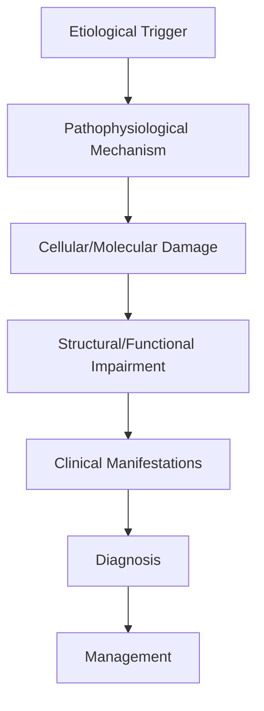
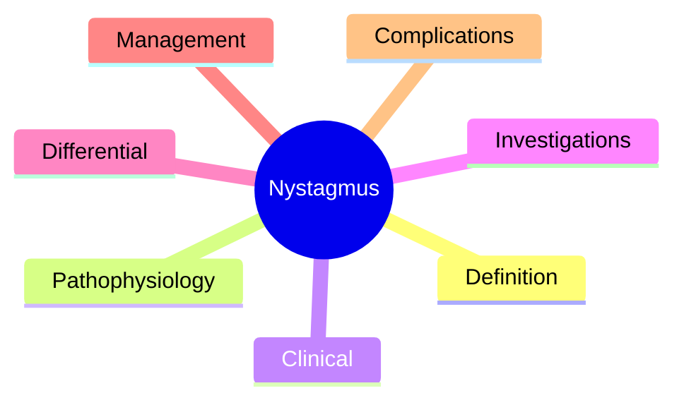

# Nystagmus

> [!tip] **High-Yield Definition**
> Comprehensive clinical note for Nystagmus covering definition, epidemiology, aetiology, pathophysiology, clinical features, investigations, differential diagnosis, management, drug interactions, procedures, complications, red flags, prognosis, topic correlation, and special situations for FCPS/MRCP examination preparation based on Davidson 24th Edition Chapter 25: Neurology.

---

## 1. Definition / Epidemiology / Classification

### Definition
Nystagmus is a neurological disorder within the 17 neuroophthalmology category. It is characterised by specific clinical, pathological, radiological, and laboratory features that allow differentiation from related conditions.

### Epidemiology
- **Incidence/Prevalence:** Variable depending on the specific condition.
- **Age:** Adult onset is most common, but paediatric and elderly presentations occur.
- **Sex:** Variable depending on the condition.
- **Geography:** Worldwide distribution, with higher prevalence in certain regions.
- **Risk Factors:** Genetic predisposition, environmental factors, comorbidities, family history.

### Classification
| Subtype | Key Features | Prognosis |
|---------|-------------|-----------|
| Mild/early | Subtle symptoms, preserved function | Best |
| Moderate | Clear symptoms, functional impairment | Variable |
| Severe | Significant disability, complications | Worst |

---

## 2. Aetiology / Pathophysiology

### Aetiology
- **Primary (idiopathic):** Most cases have no identifiable cause.
- **Genetic:** May be inherited (AD, AR, X-linked, mitochondrial, sporadic).
- **Autoimmune:** Autoantibodies, immune-mediated inflammation.
- **Infectious:** Viral, bacterial, fungal, parasitic.
- **Metabolic:** Electrolyte, endocrine, hepatic, renal, nutritional.
- **Toxic:** Drugs, alcohol, heavy metals, environmental toxins.
- **Vascular:** Ischaemia, haemorrhage, vasculitis.
- **Neoplastic:** Primary, secondary, paraneoplastic.
- **Traumatic:** Acute, chronic, repetitive.
- **Degenerative:** Neurodegeneration, protein misfolding.

### Pathophysiology


---

## 3. Clinical Features

### History
- **Onset/Duration:** Acute, subacute, or chronic.
- **Progression:** Static, progressive, relapsing-remitting, stepwise.
- **Key symptoms:** Specific to the condition.
- **Triggers:** Stress, infection, trauma, drugs, hormonal, environmental.
- **Systemic symptoms:** Constitutional features.
- **Drug/Family/Social history:** Relevant exposures, comorbidities.

### Examination
| Domain | Key Findings | Localisation Value |
|--------|-------------|-------------------|
| Higher function | Cognitive, behavioural | Cortical, subcortical, limbic |
| Cranial nerves | Pupils, eye movements, facial, bulbar | Brainstem, cranial nerve, NMJ |
| Motor | Weakness, tone, reflexes | UMN, LMN, NMJ, muscle |
| Sensory | All modalities, pattern | Peripheral, spinal, brainstem |
| Coordination | Ataxia, nystagmus, dysmetria | Cerebellar, sensory, vestibular |
| Gait | Spastic, ataxic, parkinsonian | Multiple |
| Autonomic | Orthostatic, sweating, GI, bladder | Autonomic, peripheral, central |

### Specific Clinical Features
The clinical features are determined by the underlying aetiology, location of pathology, and rate of progression. Patients typically present with a constellation of symptoms and signs that allow clinical localisation and subsequent targeted investigation.

---

## 4. Diagnostic Approach / Algorithm

```mermaid
flowchart TD
    A[Clinical Presentation] --> B[Anatomical Localisation]
    B --> C[Pathophysiological Category]
    C --> D[Formulate Differential]
    D --> E[Targeted Investigations]
    E --> F[Confirm Diagnosis]
    F --> G[Assess Severity/Prognosis]
    G --> H[Initiate Management]
    H --> I[Monitor Response]
    I --> J{Response?}
    J --> YES1 [Good - Continue]
    J --> NO1 [Poor - Escalate]
    YES1 --> K[Monitor]
    NO1 --> H
```

---

## 5. Investigations

### First-Line Investigations
- **Blood tests:** FBC, U&Es, LFTs, glucose, calcium, magnesium, ESR, CRP, autoimmune, infection.
- **Imaging:** CT/MRI brain/spine (essential for most neurological conditions).
- **Neurophysiology:** EEG, nerve conduction, EMG, evoked potentials.
- **CSF:** Cell count, protein, glucose, OCBs, PCR, culture.

### Second-Line Investigations
- **Genetic testing:** Gene panels, WES, WGS.
- **Antibody testing:** Antineuronal, autoimmune, paraneoplastic.
- **Biopsy:** Nerve, muscle, brain, skin.
- **Advanced imaging:** PET-CT, MR spectroscopy, fMRI.

### Specialised Investigations
- **Biomarkers:** Neurofilament light chain, tau, beta-amyloid, 14-3-3, RT-QuIC.
- **Autonomic testing:** Head-up tilt, sudomotor, QSART.
- **Neuropsychology:** Cognitive testing, behavioural assessment.
- **Genetic counselling:** Family screening, predictive testing.

---

## 6. Differential Diagnosis

| Differential | Distinguishing Features | Key Test |
|--------------|------------------------|----------|
| Vascular | Sudden onset, focal, vascular risk factors | MRI/CT, vessel imaging |
| Inflammatory | Subacute, multifocal, systemic | MRI, CSF, antibodies |
| Infectious | Fever, systemic, exposure | Bloods, CSF, imaging |
| Neoplastic | Progressive, mass effect | MRI, biopsy |
| Degenerative | Progressive, symmetric, hereditary | MRI, genetic |
| Toxic/Metabolic | Drug history, systemic, reversible | Bloods, toxicology |
| Autoimmune | Multifocal, antibodies, immunotherapy response | Antibodies, MRI, CSF |
| Functional | Inconsistent, distractible | Clinical, video, biomarkers |

---

## 7. Management

### Acute Management
- **Stabilisation:** ABCDE approach, emergency resuscitation.
- **Specific treatment:** Disease-specific interventions.
- **Symptomatic relief:** Pain, seizures, spasticity, autonomic dysfunction.
- **Prevention of complications:** DVT, pressure sores, infection.

### Disease-Modifying Treatment
- **Pharmacological:** First-line, second-line, escalation, maintenance.
- **Procedural:** Surgery, biopsy, drainage, ablation, stimulation.
- **Immunotherapy:** Steroids, IVIG, plasma exchange, immunosuppressants, biologics.
- **Rehabilitation:** Physiotherapy, OT, speech therapy.

### Long-Term Management
- **Monitoring:** Clinical, imaging, biomarkers, side effects.
- **Prevention:** Vaccinations, prophylaxis, lifestyle modification.
- **Supportive care:** Multidisciplinary team, social work, psychological support.
- **Palliative care:** Advanced care planning, end-of-life care, hospice.

---

## 8. Drug Interactions / Contraindications / Comorbidity Cautions

| Drug Class | Interaction / Caution | Management |
|------------|----------------------|------------|
| Antiseizure medications | Enzyme induction, teratogenicity | Monitor, supplement, switch |
| Immunosuppressants | Infection, malignancy, teratogenicity | Monitor, prophylaxis |
| Anticoagulants | Bleeding risk, drug interactions | Monitor INR, avoid combinations |
| Antihypertensives | Hypotension, falls | Monitor BP, adjust dose |
| Antibiotics | Nephrotoxicity, ototoxicity | Monitor renal |
| Antivirals | Nephrotoxicity, neuropsychiatric | Monitor renal, dose adjust |
| Steroids | DM, HTN, osteoporosis, infection | Monitor, prophylaxis, taper |
| Biologics | Infusion reactions, infection | Monitor, prophylaxis |

---

## 9. Procedures

### Common Procedures
- **Lumbar puncture:** Diagnostic, therapeutic (IIH, NPH). Contraindications: raised ICP, mass lesion, coagulopathy.
- **Nerve conduction studies/EMG:** Diagnostic, prognosis. Minor discomfort.
- **EEG:** Diagnostic, monitoring. No significant complications.
- **MRI brain/spine:** Diagnostic, monitoring. Contraindications: pacemaker, metallic implants.
- **CT head:** Emergency, rapid. Radiation exposure, contrast reactions.
- **Biopsy:** Stereotactic, open. Indications: diagnosis, molecular profiling.

---

## 10. Complications

| Complication | Frequency | Prevention | Management |
|--------------|-----------|------------|------------|
| Infection | Common | Hygiene, prophylaxis, vaccination | Antibiotics, antifungals |
| Thrombosis | Common | Prophylaxis, mobility | Anticoagulation |
| Pressure sores | Common | Positioning, nutrition | Wound care, surgery |
| Spasticity | Common | Positioning, stretching | Baclofen, BoNT |
| Contractures | Common | Passive movements, splints | Physiotherapy, surgery |
| Aspiration | Common | Swallow assessment | NGT, PEG, thickeners |
| Falls | Common | Environment, mobility | Walking aids |
| Fractures | Common | Bone health, prevention | Vitamin D, bisphosphonate |
| Depression | Common | Screening, support | Antidepressants, CBT |
| Cognitive decline | Variable | Monitoring, training | Rehabilitation |
| Autonomic dysfunction | Variable | Monitoring, hydration | Midodrine, fludrocortisone |
| Respiratory failure | Variable | Monitoring, supportive | Ventilation, NIV |
| Death | Variable | Monitoring, palliative | End-of-life care |

---

## 11. Red Flags / Emergencies

### Emergency Presentations
- **Rapid neurological deterioration:** New focal deficit, decreased consciousness, seizures.
- **Status epilepticus:** Continuous seizures >5 min.
- **Raised ICP:** Headache, vomiting, papilloedema, altered consciousness.
- **Respiratory failure:** Hypoxia, hypercapnia, ventilatory failure.
- **Cardiac arrest:** Arrhythmia, MI, pulmonary embolism.
- **Infection:** Sepsis, meningitis, abscess, encephalitis.
- **Drug toxicity:** Overdose, side effects, interactions.
- **Haemorrhage:** Intracranial, systemic, coagulopathy.

---

## 12. Prognosis

### Natural History
- **Acute:** May resolve with treatment, may progress, may be fatal.
- **Subacute:** Variable, depends on cause and treatment.
- **Chronic:** Often progressive, may be stable, may have relapses.
- **Recovery:** Variable, may be complete, partial, or none.

### Prognostic Factors
- **Favourable:** Young age, early treatment, mild disease, reversible cause, good premorbid function, family support.
- **Unfavourable:** Older age, delayed treatment, severe disease, irreversible cause, poor premorbid function, comorbidities.

---

## 13. Topic Correlation

| Related Topic | Link | Key Overlap |
|---------------|------|-------------|
| Davidson 24th Ed Chapter 25 | [[Davidson Chapter 25 - Neurology Hierarchy]] | Comprehensive neurology |
| Neurology MOC | [[Neurology MOC]] | All neurology topics |
| Drug Reference | [[../00_Index/Neurology Drug Reference]] | Medications |
| Local Hub | [[../17_Neuroophthalmology/Hub]] | Section-specific |
| Clinical Examination | [[../01_Fundamentals_Examination/Neurological History Taking]] | Clinical approach |
| Investigation | [[../01_Fundamentals_Examination/Neuroimaging (CT-MRI) Principles]] | Imaging |

---

## 14. Special Situations

| Situation | Consideration |
|-----------|---------------|
| **Pregnancy** | Pre-conception counselling, teratogenicity, drug safety, monitoring, delivery planning, breastfeeding. |
| **Lactation** | Drug safety, breastfeeding, monitoring, support. |
| **Paediatric** | Developmental considerations, drug dosing, school, family, vaccination, growth, puberty. |
| **Elderly / Frail** | Comorbidities, polypharmacy, falls, bone health, cognition, social, end-of-life. |
| **Renal impairment** | Drug dose adjustment, monitoring, dialysis, transplant. |
| **Hepatic impairment** | Drug dose adjustment, monitoring, transplant. |
| **Immunocompromised** | Infection prophylaxis, vaccination, drug interactions, malignancy screening. |
| **Perioperative** | Drug management, anaesthesia planning, VTE prophylaxis, infection prevention, monitoring. |
| **Driving / DVLA** | Fitness to drive, restrictions, notification, reassessment. |
| **Occupational** | Fitness for work, adaptations, rehabilitation, disability, return to work. |

---

## FCPS/MRCP High-Yield Summary

| Category | Key Points |
|----------|------------|
| **Definition** | Comprehensive definition with key diagnostic criteria |
| **Epidemiology** | Incidence, prevalence, age, sex, geography, risk factors |
| **Aetiology** | Primary causes, secondary causes, genetic, environmental |
| **Pathophysiology** | Mechanism of disease, cellular/molecular basis |
| **Clinical Features** | History, examination, key findings, variants |
| **Diagnosis** | Diagnostic criteria, classification, severity |
| **Investigations** | First-line, second-line, specialised, biomarkers |
| **Differential Diagnosis** | Key differentials, distinguishing features, tests |
| **Management** | Acute, disease-modifying, symptomatic, supportive |
| **Complications** | Common, serious, prevention, management |
| **Prognosis** | Natural history, prognostic factors, outcomes |
| **Viva Pearls** | Key examination points |
| **Drug Doses** | First-line, second-line, emergency |
| **Scoring Systems** | Specific scores used in management |
| **Genetics** | Inheritance, genes, mutations, family screening |
| **Imaging Signs** | Characteristic findings, differential |

---

## Viva Questions (PACES/FCPS Style)

1. **Q:** Define and classify its variants.
   **A:** Comprehensive definition with classification of subtypes based on aetiology, severity, and clinical features.

2. **Q:** What are the key clinical features?
   **A:** Specific symptoms and signs including onset, progression, key features, and associated findings.

3. **Q:** What is the first-line treatment?
   **A:** First-line pharmacological and non-pharmacological management based on current evidence.

4. **Q:** What are the red flags requiring urgent referral?
   **A:** Specific emergency presentations and complications requiring immediate intervention.

5. **Q:** What is the prognosis?
   **A:** Natural history, prognostic factors, and long-term outcomes.

6. **Q:** How do you differentiate from key differentials?
   **A:** Clinical features, investigations, and response to treatment that distinguish from alternative diagnoses.

7. **Q:** What investigations are most useful?
   **A:** First-line and second-line investigations including imaging, neurophysiology, CSF, and biomarkers.

8. **Q:** Describe the stepwise management approach.
   **A:** Stepwise escalation from first-line to second-line to third-line therapy with monitoring.

9. **Q:** What are the emergency presentations?
   **A:** Specific emergency scenarios and immediate management priorities.

10. **Q:** How does management change in pregnancy/paediatrics/elderly?
    **A:** Special considerations for each population including drug safety, monitoring, and support.

---

## Common Confusions / Exam Traps

| Confusion | Clarification |
|-----------|---------------|
| Similar presentation but different cause | Differentiate by history, examination, investigations |
| Treatment response vs natural history | Assess with objective measures, biomarkers |
| Drug interactions | Check each drug, monitor, adjust doses |
| Disease progression vs treatment failure | Monitor response, escalate appropriately |
| Functional vs organic | Inconsistent, distractible, disability greater than impairment |
| Acute vs chronic | Time course, progression, reversibility |
| Primary vs secondary | Underlying cause, contributing factors |
| Side effects vs symptoms | Temporal relationship, dose relationship |

---

## Mnemonics
1. ****J-FIX** = Jerk vs Pendular: jerk (fast phase) = central/peripheral; pendular = congenital/central**
2. ****ALEXANDER'S LAW** = Peripheral vestibular: increases with gaze in direction of fast phase, decreases with opposite gaze**
3. ****DOWNBEAT-CC** = Downbeat nystagmus: cervicomedullary junction (Chiari, basilar invagination, tumour)**

---

## Mind Map



---

## Spaced Repetition Trackers

| Day 1 | Day 3 | Day 7 | Day 14 | Day 30 | Day 90 |
|------|-------|-------|--------|--------|--------|
| | | | | | |

---

## Self-Test Scorecard

| Section | Score /5 |
|---------|----------|
| Definition | |
| Pathophysiology | |
| Clinical | |
| Investigations | |
| Differential | |
| Management | |
| Complications | |

---

## MCQs (10)

1. **Q:** 50-year-old with vertigo, horizontal-torsional nystagmus to left, increased with left gaze, suppresses with fixation. Most likely?
   **Options:** A. Left vestibular neuritis (peripheral) B. Central B. Congenital C. Physiological
   **Answer:** A
   **Explanation:** Peripheral vestibular: unidirectional horizontal-torsional nystagmus (away from lesion), increases with gaze in direction of fast phase (Alexander's law), suppresses with fixation, no vertical component. Vestibular neuritis.

2. **Q:** Direction-changing nystagmus (changes direction with gaze) suggests:
   **Options:** A. Central (brainstem/cerebellar) B. Peripheral C. Physiological D. Congenital
   **Answer:** A
   **Explanation:** Direction-changing nystagmus (gaze-evoked nystagmus beating in different directions with different gaze positions) = central (brainstem/cerebellar). Peripheral: always beats in same direction (unidirectional).

3. **Q:** Pure vertical nystagmus (downbeat or upbeat) suggests:
   **Options:** A. Central (brainstem/cerebellar) B. Peripheral C. Congenital D. Physiological
   **Answer:** A
   **Explanation:** Pure vertical nystagmus: downbeat or upbeat = central. Downbeat: cervicomedullary junction (Chiari, basilar invagination, MS, tumour, cerebellar degeneration). Upbeat: medullary/midbrain (MS, stroke, tumour, Wernicke).

4. **Q:** Downbeat nystagmus (DBN) most common cause?
   **Options:** A. Chiari malformation (cervicomedullary junction) B. MS C. Stroke D. Drug
   **Answer:** A
   **Explanation:** Downbeat nystagmus: most commonly Chiari malformation, basilar invagination (cervicomedullary junction). Other: cerebellar degeneration, MS, tumour, drugs (lithium, anticonvulsants, alcohol). Often improves with upgaze.

5. **Q:** Upbeat nystagmus (UBN) localises to:
   **Options:** A. Medulla (paramedian) or midbrain B. Pons C. Cerebellum D. Cortex
   **Answer:** A
   **Explanation:** UBN: medulla (paramedian) or midbrain. Causes: MS, brainstem stroke (medial medullary, PICA, AICA, SCA territory), tumour, Wernicke encephalopathy, toxicity.

6. **Q:** Congenital nystagmus features?
   **Options:** A. Horizontal, pendular or jerk, present since infancy, no oscillopsia, improves with convergence, null point B. Vertical C. Acquired D. Symptomatic
   **Answer:** A
   **Explanation:** Congenital nystagmus: present from infancy, horizontal (any direction), pendular or jerk, no oscillopsia (world doesn't move), improves with convergence, may have null point (gaze position where nystagmus minimal). Often with albinism, achromatopsia, retinal disorders, idiopathic infantile nystagmus.

7. **Q:** Periodic alternating nystagmus (PAN) features?
   **Options:** A. Nystagmus direction changes cyclically every 1-2 minutes; cerebellar nodulus/uvula lesion; responds to baclofen B. Stationary C. Vertical D. No treatment
   **Answer:** A
   **Explanation:** PAN: nystagmus direction changes cyclically every 1-2 minutes (e.g., right-beating for 1 min, then left-beating for 1 min). Cerebellar nodulus/uvula lesion (Chiari, MS, tumour). Responds to baclofen. Often missed clinically (need prolonged observation).

8. **Q:** Gaze-evoked nystagmus (GEN) features?
   **Options:** A. Jerk nystagmus in direction of gaze, beats away from central position; usually due to gaze-holding network dysfunction (cerebellum) B. Unidirectional C. Vertical D. None
   **Answer:** A
   **Explanation:** GEN (gaze-evoked/gaze-paretic): jerk nystagmus in direction of gaze, beats away from central. Suggests gaze-holding network dysfunction (cerebellar flocculus, brainstem, drugs - sedatives, anticonvulsants). If GEN is direction-changing, central.

9. **Q:** Seesaw nystagmus features?
   **Options:** A. Pendular, intorsion of elevating eye + extorsion of falling eye; midline (chiasmal) lesions, often bitemporal hemianopia B. Horizontal C. Rotatory only D. Vertical only
   **Answer:** A
   **Explanation:** Seesaw nystagmus: pendular, intorsion of elevating eye + extorsion of falling eye. Localises to midline (chiasmal) region. Often with bitemporal hemianopia (pituitary macroadenoma, craniopharyngioma, parasellar mass).

10. **Q:** What is 'gaze-evoked' nystagmus pattern in Alexander's law?
    **Options:** A. Peripheral: increases with gaze in direction of fast phase, decreases with opposite gaze B. Central C. Congenital D. Vertical
    **Answer:** A
    **Explanation:** Alexander's law (peripheral vestibular): nystagmus intensity increases when gaze in direction of fast phase, decreases when gaze opposite. First-degree: present only with gaze toward fast phase. Second-degree: also in primary. Third-degree: also in opposite gaze (severe, central?).

---

## SBA Questions (10)

1. **Scenario:** 60-year-old with positional vertigo, left-beating torsional nystagmus in left Dix-Hallpike, fatigues with repetition.
   **Question:** Diagnosis and treatment?
   **Options:** A. BPPV (left posterior canal); Epley manoeuvre (left); home exercises; treat cause (vitamin D, osteoporosis if present) B. Vestibular neuritis C. Central D. Migraine
   **Answer:** A
   **Explanation:** BPPV (benign paroxysmal positional vertigo): most common cause. Diagnosis: Dix-Hallpike (posterior canal BPPV: upbeating-torsional nystagmus towards affected ear). Treatment: Epley manoeuvre (posterior canal repositioning). Fatigues with repetition (peripheral).

2. **Scenario:** 50-year-old with vertigo, vertical nystagmus, gait ataxia, headache. MRI: Chiari 1 malformation.
   **Question:** Likely cause of nystagmus?
   **Options:** A. Downbeat nystagmus from Chiari (cervicomedullary junction); treat underlying cause (foramen magnum decompression) B. Peripheral B. BPPV C. Drug
   **Answer:** A
   **Explanation:** Downbeat nystagmus: Chiari malformation, basilar invagination, cerebellar degeneration, MS, tumour. Cervicomedullary junction compression. Treat underlying cause (foramen magnum decompression for Chiari I).

3. **Scenario:** 45-year-old with oscillopsia, vertical diplopia, vertical nystagmus (downbeat in primary, worse on lateral gaze and downgaze). MRI normal except cerebellar atrophy.
   **Question:** Diagnosis?
   **Options:** A. Cerebellar degeneration (multiple system atrophy, SCA, paraneoplastic); supportive; baclofen, gabapentin, clonazepam may help; treat cause B. BPPV C. Vestibular neuritis D. MS
   **Answer:** A
   **Explanation:** Downbeat nystagmus + cerebellar atrophy: think cerebellar degeneration (MSA-C, SCA, idiopathic, paraneoplastic). Supportive. Symptomatic: baclofen, gabapentin, clonazepam, 4-aminopyridine (limited evidence).

4. **Scenario:** 30-year-old with bilateral horizontal nystagmus since infancy, no oscillopsia, improves with convergence, null point at primary position. Normal MRI.
   **Question:** Diagnosis?
   **Options:** A. Congenital nystagmus (idiopathic infantile); refractive correction, base-out prisms, contact lenses may help; surgery (Anderson-Kestenbaum) for null-point head turn B. Acquired B. Drug C. Central
   **Answer:** A
   **Explanation:** Congenital nystagmus: idiopathic infantile nystagmus. Refractive correction (often high), base-out prisms (convergence dampens), contact lenses. Surgery: Anderson-Kestenbaum (move null point to primary, reduce head turn).

5. **Scenario:** 35-year-old with oscillopsia, gaze-evoked nystagmus in all directions, gait ataxia. MRI normal. Started on phenytoin recently.
   **Question:** Likely cause?
   **Options:** A. Phenytoin toxicity; check level, reduce dose; symptoms usually resolve B. BPPV C. Vestibular neuritis D. Stroke
   **Answer:** A
   **Explanation:** Phenytoin toxicity: nystagmus (gaze-evoked, vertical, on lateral gaze), ataxia, diplopia, confusion, lethargy. Check level, reduce dose. Other drugs causing nystagmus: carbamazepine, phenobarbital, lithium, alcohol, benzodiazepines.

6. **Scenario:** 60-year-old with oscillopsia, periodic alternating nystagmus (changes direction every 1-2 minutes). Ataxic gait. MRI: cerebellar atrophy.
   **Question:** Diagnosis and treatment?
   **Options:** A. Periodic alternating nystagmus (PAN); cerebellar nodulus/uvula lesion; responds to baclofen 5-10mg TDS; treat underlying cause B. BPPV C. Vestibular neuritis D. MS
   **Answer:** A
   **Explanation:** PAN: nystagmus direction changes cyclically every 1-2 minutes. Cerebellar nodulus/uvula lesion. Responds to baclofen (GABA-B agonist). Treat underlying cause (tumour, Chiari, MS).

7. **Scenario:** 25-year-old with upbeat nystagmus in primary, worse on upgaze. MRI shows demyelinating lesion in medulla.
   **Question:** Diagnosis?
   **Options:** A. MS with brainstem relapse; IV methylprednisolone 1g/day for 3-5 days; disease-modifying therapy B. Stroke C. Tumour D. BPPV
   **Answer:** A
   **Explanation:** UBN + medullary lesion in young patient: MS relapse. High-dose IV methylprednisolone. Start/modify DMT (ocrelizumab, etc.). Brain MRI + spine MRI for full assessment.

8. **Scenario:** 55-year-old with seesaw nystagmus (one eye up-in, other down-out), bitemporal hemianopia. MRI: large sellar mass.
   **Question:** Cause and management?
   **Options:** A. Pituitary macroadenoma (or other suprasellar mass); endocrine workup, neurosurgical referral (transsphenoidal), visual field monitoring B. BPPV C. Vestibular neuritis D. MS
   **Answer:** A
   **Explanation:** Seesaw nystagmus + bitemporal hemianopia = midline/chiasmal lesion. Most common: pituitary macroadenoma, craniopharyngioma, parasellar meningioma. Transsphenoidal surgery for compressive lesions. Endocrine management.

---

## Tags
**Tags:** #neurology #nystagmus #downbeat #upbeat #periodic-alternating #seesaw #BPPV #Chiari #Alexander-law #FCPS #MRCP

---

## Local Navigation
**Heading Hub:** [[../Hub]]  
**Chapter Hierarchy:** [[Davidson Chapter 25 - Neurology Hierarchy]]  
**Chapter MOC:** [[Neurology MOC]]  
**Drug Reference:** [[../00_Index/Neurology Drug Reference]]  
