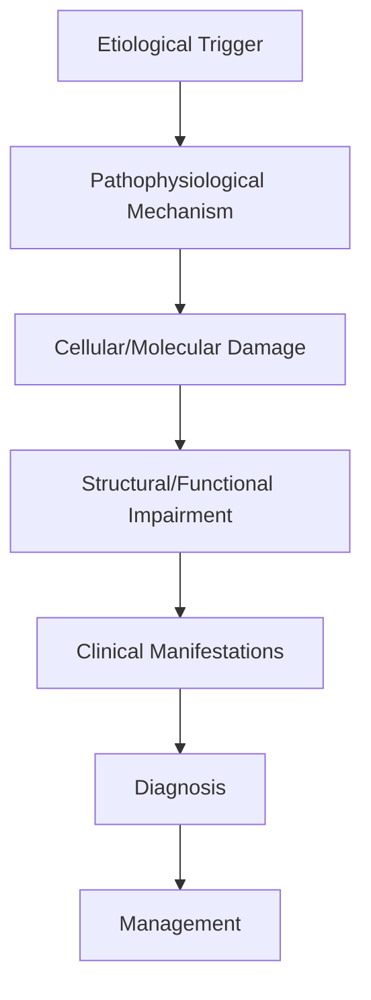
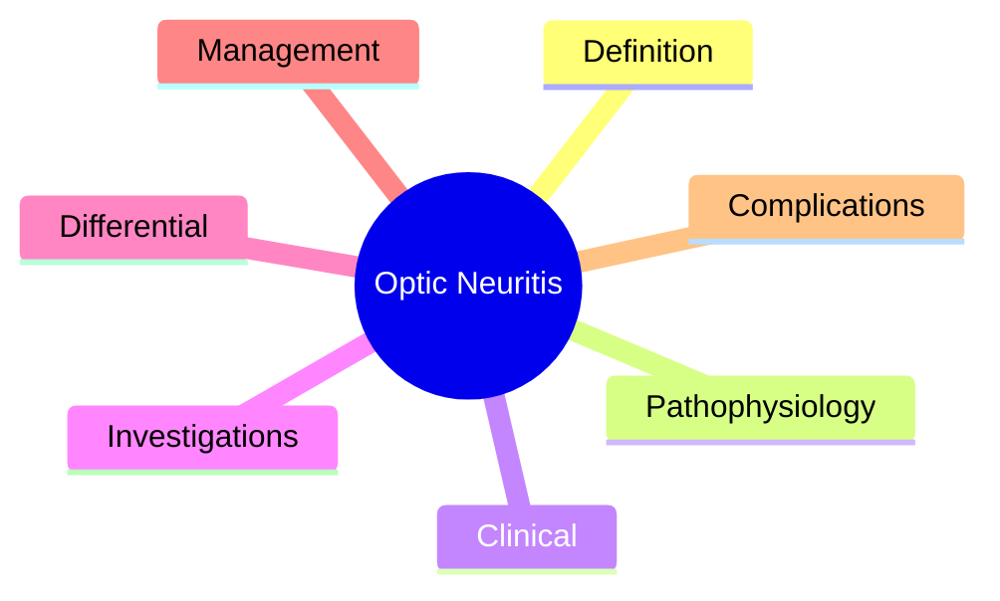

# Optic Neuritis

> [!tip] **High-Yield Definition**
> Comprehensive clinical note for Optic Neuritis covering definition, epidemiology, aetiology, pathophysiology, clinical features, investigations, differential diagnosis, management, drug interactions, procedures, complications, red flags, prognosis, topic correlation, and special situations for FCPS/MRCP examination preparation based on Davidson 24th Edition Chapter 25: Neurology.

---

## 1. Definition / Epidemiology / Classification

### Definition
Optic Neuritis is a neurological disorder within the 17 neuroophthalmology category. It is characterised by specific clinical, pathological, radiological, and laboratory features that allow differentiation from related conditions.

### Epidemiology
- **Incidence/Prevalence:** Variable depending on the specific condition.
- **Age:** Adult onset is most common, but paediatric and elderly presentations occur.
- **Sex:** Variable depending on the condition.
- **Geography:** Worldwide distribution, with higher prevalence in certain regions.
- **Risk Factors:** Genetic predisposition, environmental factors, comorbidities, family history.

### Classification
| Subtype | Key Features | Prognosis |
|---------|-------------|-----------|
| Mild/early | Subtle symptoms, preserved function | Best |
| Moderate | Clear symptoms, functional impairment | Variable |
| Severe | Significant disability, complications | Worst |

---

## 2. Aetiology / Pathophysiology

### Aetiology
- **Primary (idiopathic):** Most cases have no identifiable cause.
- **Genetic:** May be inherited (AD, AR, X-linked, mitochondrial, sporadic).
- **Autoimmune:** Autoantibodies, immune-mediated inflammation.
- **Infectious:** Viral, bacterial, fungal, parasitic.
- **Metabolic:** Electrolyte, endocrine, hepatic, renal, nutritional.
- **Toxic:** Drugs, alcohol, heavy metals, environmental toxins.
- **Vascular:** Ischaemia, haemorrhage, vasculitis.
- **Neoplastic:** Primary, secondary, paraneoplastic.
- **Traumatic:** Acute, chronic, repetitive.
- **Degenerative:** Neurodegeneration, protein misfolding.

### Pathophysiology


---

## 3. Clinical Features

### History
- **Onset/Duration:** Acute, subacute, or chronic.
- **Progression:** Static, progressive, relapsing-remitting, stepwise.
- **Key symptoms:** Specific to the condition.
- **Triggers:** Stress, infection, trauma, drugs, hormonal, environmental.
- **Systemic symptoms:** Constitutional features.
- **Drug/Family/Social history:** Relevant exposures, comorbidities.

### Examination
| Domain | Key Findings | Localisation Value |
|--------|-------------|-------------------|
| Higher function | Cognitive, behavioural | Cortical, subcortical, limbic |
| Cranial nerves | Pupils, eye movements, facial, bulbar | Brainstem, cranial nerve, NMJ |
| Motor | Weakness, tone, reflexes | UMN, LMN, NMJ, muscle |
| Sensory | All modalities, pattern | Peripheral, spinal, brainstem |
| Coordination | Ataxia, nystagmus, dysmetria | Cerebellar, sensory, vestibular |
| Gait | Spastic, ataxic, parkinsonian | Multiple |
| Autonomic | Orthostatic, sweating, GI, bladder | Autonomic, peripheral, central |

### Specific Clinical Features
The clinical features are determined by the underlying aetiology, location of pathology, and rate of progression. Patients typically present with a constellation of symptoms and signs that allow clinical localisation and subsequent targeted investigation.

---

## 4. Diagnostic Approach / Algorithm

```mermaid
flowchart TD
    A[Clinical Presentation] --> B[Anatomical Localisation]
    B --> C[Pathophysiological Category]
    C --> D[Formulate Differential]
    D --> E[Targeted Investigations]
    E --> F[Confirm Diagnosis]
    F --> G[Assess Severity/Prognosis]
    G --> H[Initiate Management]
    H --> I[Monitor Response]
    I --> J{Response?}
    J --> YES1 [Good - Continue]
    J --> NO1 [Poor - Escalate]
    YES1 --> K[Monitor]
    NO1 --> H
```

---

## 5. Investigations

### First-Line Investigations
- **Blood tests:** FBC, U&Es, LFTs, glucose, calcium, magnesium, ESR, CRP, autoimmune, infection.
- **Imaging:** CT/MRI brain/spine (essential for most neurological conditions).
- **Neurophysiology:** EEG, nerve conduction, EMG, evoked potentials.
- **CSF:** Cell count, protein, glucose, OCBs, PCR, culture.

### Second-Line Investigations
- **Genetic testing:** Gene panels, WES, WGS.
- **Antibody testing:** Antineuronal, autoimmune, paraneoplastic.
- **Biopsy:** Nerve, muscle, brain, skin.
- **Advanced imaging:** PET-CT, MR spectroscopy, fMRI.

### Specialised Investigations
- **Biomarkers:** Neurofilament light chain, tau, beta-amyloid, 14-3-3, RT-QuIC.
- **Autonomic testing:** Head-up tilt, sudomotor, QSART.
- **Neuropsychology:** Cognitive testing, behavioural assessment.
- **Genetic counselling:** Family screening, predictive testing.

---

## 6. Differential Diagnosis

| Differential | Distinguishing Features | Key Test |
|--------------|------------------------|----------|
| Vascular | Sudden onset, focal, vascular risk factors | MRI/CT, vessel imaging |
| Inflammatory | Subacute, multifocal, systemic | MRI, CSF, antibodies |
| Infectious | Fever, systemic, exposure | Bloods, CSF, imaging |
| Neoplastic | Progressive, mass effect | MRI, biopsy |
| Degenerative | Progressive, symmetric, hereditary | MRI, genetic |
| Toxic/Metabolic | Drug history, systemic, reversible | Bloods, toxicology |
| Autoimmune | Multifocal, antibodies, immunotherapy response | Antibodies, MRI, CSF |
| Functional | Inconsistent, distractible | Clinical, video, biomarkers |

---

## 7. Management

### Acute Management
- **Stabilisation:** ABCDE approach, emergency resuscitation.
- **Specific treatment:** Disease-specific interventions.
- **Symptomatic relief:** Pain, seizures, spasticity, autonomic dysfunction.
- **Prevention of complications:** DVT, pressure sores, infection.

### Disease-Modifying Treatment
- **Pharmacological:** First-line, second-line, escalation, maintenance.
- **Procedural:** Surgery, biopsy, drainage, ablation, stimulation.
- **Immunotherapy:** Steroids, IVIG, plasma exchange, immunosuppressants, biologics.
- **Rehabilitation:** Physiotherapy, OT, speech therapy.

### Long-Term Management
- **Monitoring:** Clinical, imaging, biomarkers, side effects.
- **Prevention:** Vaccinations, prophylaxis, lifestyle modification.
- **Supportive care:** Multidisciplinary team, social work, psychological support.
- **Palliative care:** Advanced care planning, end-of-life care, hospice.

---

## 8. Drug Interactions / Contraindications / Comorbidity Cautions

| Drug Class | Interaction / Caution | Management |
|------------|----------------------|------------|
| Antiseizure medications | Enzyme induction, teratogenicity | Monitor, supplement, switch |
| Immunosuppressants | Infection, malignancy, teratogenicity | Monitor, prophylaxis |
| Anticoagulants | Bleeding risk, drug interactions | Monitor INR, avoid combinations |
| Antihypertensives | Hypotension, falls | Monitor BP, adjust dose |
| Antibiotics | Nephrotoxicity, ototoxicity | Monitor renal |
| Antivirals | Nephrotoxicity, neuropsychiatric | Monitor renal, dose adjust |
| Steroids | DM, HTN, osteoporosis, infection | Monitor, prophylaxis, taper |
| Biologics | Infusion reactions, infection | Monitor, prophylaxis |

---

## 9. Procedures

### Common Procedures
- **Lumbar puncture:** Diagnostic, therapeutic (IIH, NPH). Contraindications: raised ICP, mass lesion, coagulopathy.
- **Nerve conduction studies/EMG:** Diagnostic, prognosis. Minor discomfort.
- **EEG:** Diagnostic, monitoring. No significant complications.
- **MRI brain/spine:** Diagnostic, monitoring. Contraindications: pacemaker, metallic implants.
- **CT head:** Emergency, rapid. Radiation exposure, contrast reactions.
- **Biopsy:** Stereotactic, open. Indications: diagnosis, molecular profiling.

---

## 10. Complications

| Complication | Frequency | Prevention | Management |
|--------------|-----------|------------|------------|
| Infection | Common | Hygiene, prophylaxis, vaccination | Antibiotics, antifungals |
| Thrombosis | Common | Prophylaxis, mobility | Anticoagulation |
| Pressure sores | Common | Positioning, nutrition | Wound care, surgery |
| Spasticity | Common | Positioning, stretching | Baclofen, BoNT |
| Contractures | Common | Passive movements, splints | Physiotherapy, surgery |
| Aspiration | Common | Swallow assessment | NGT, PEG, thickeners |
| Falls | Common | Environment, mobility | Walking aids |
| Fractures | Common | Bone health, prevention | Vitamin D, bisphosphonate |
| Depression | Common | Screening, support | Antidepressants, CBT |
| Cognitive decline | Variable | Monitoring, training | Rehabilitation |
| Autonomic dysfunction | Variable | Monitoring, hydration | Midodrine, fludrocortisone |
| Respiratory failure | Variable | Monitoring, supportive | Ventilation, NIV |
| Death | Variable | Monitoring, palliative | End-of-life care |

---

## 11. Red Flags / Emergencies

### Emergency Presentations
- **Rapid neurological deterioration:** New focal deficit, decreased consciousness, seizures.
- **Status epilepticus:** Continuous seizures >5 min.
- **Raised ICP:** Headache, vomiting, papilloedema, altered consciousness.
- **Respiratory failure:** Hypoxia, hypercapnia, ventilatory failure.
- **Cardiac arrest:** Arrhythmia, MI, pulmonary embolism.
- **Infection:** Sepsis, meningitis, abscess, encephalitis.
- **Drug toxicity:** Overdose, side effects, interactions.
- **Haemorrhage:** Intracranial, systemic, coagulopathy.

---

## 12. Prognosis

### Natural History
- **Acute:** May resolve with treatment, may progress, may be fatal.
- **Subacute:** Variable, depends on cause and treatment.
- **Chronic:** Often progressive, may be stable, may have relapses.
- **Recovery:** Variable, may be complete, partial, or none.

### Prognostic Factors
- **Favourable:** Young age, early treatment, mild disease, reversible cause, good premorbid function, family support.
- **Unfavourable:** Older age, delayed treatment, severe disease, irreversible cause, poor premorbid function, comorbidities.

---

## 13. Topic Correlation

| Related Topic | Link | Key Overlap |
|---------------|------|-------------|
| Davidson 24th Ed Chapter 25 | [[Davidson Chapter 25 - Neurology Hierarchy]] | Comprehensive neurology |
| Neurology MOC | [[Neurology MOC]] | All neurology topics |
| Drug Reference | [[../00_Index/Neurology Drug Reference]] | Medications |
| Local Hub | [[../17_Neuroophthalmology/Hub]] | Section-specific |
| Clinical Examination | [[../01_Fundamentals_Examination/Neurological History Taking]] | Clinical approach |
| Investigation | [[../01_Fundamentals_Examination/Neuroimaging (CT-MRI) Principles]] | Imaging |

---

## 14. Special Situations

| Situation | Consideration |
|-----------|---------------|
| **Pregnancy** | Pre-conception counselling, teratogenicity, drug safety, monitoring, delivery planning, breastfeeding. |
| **Lactation** | Drug safety, breastfeeding, monitoring, support. |
| **Paediatric** | Developmental considerations, drug dosing, school, family, vaccination, growth, puberty. |
| **Elderly / Frail** | Comorbidities, polypharmacy, falls, bone health, cognition, social, end-of-life. |
| **Renal impairment** | Drug dose adjustment, monitoring, dialysis, transplant. |
| **Hepatic impairment** | Drug dose adjustment, monitoring, transplant. |
| **Immunocompromised** | Infection prophylaxis, vaccination, drug interactions, malignancy screening. |
| **Perioperative** | Drug management, anaesthesia planning, VTE prophylaxis, infection prevention, monitoring. |
| **Driving / DVLA** | Fitness to drive, restrictions, notification, reassessment. |
| **Occupational** | Fitness for work, adaptations, rehabilitation, disability, return to work. |

---

## FCPS/MRCP High-Yield Summary

| Category | Key Points |
|----------|------------|
| **Definition** | Comprehensive definition with key diagnostic criteria |
| **Epidemiology** | Incidence, prevalence, age, sex, geography, risk factors |
| **Aetiology** | Primary causes, secondary causes, genetic, environmental |
| **Pathophysiology** | Mechanism of disease, cellular/molecular basis |
| **Clinical Features** | History, examination, key findings, variants |
| **Diagnosis** | Diagnostic criteria, classification, severity |
| **Investigations** | First-line, second-line, specialised, biomarkers |
| **Differential Diagnosis** | Key differentials, distinguishing features, tests |
| **Management** | Acute, disease-modifying, symptomatic, supportive |
| **Complications** | Common, serious, prevention, management |
| **Prognosis** | Natural history, prognostic factors, outcomes |
| **Viva Pearls** | Key examination points |
| **Drug Doses** | First-line, second-line, emergency |
| **Scoring Systems** | Specific scores used in management |
| **Genetics** | Inheritance, genes, mutations, family screening |
| **Imaging Signs** | Characteristic findings, differential |

---

## Viva Questions (PACES/FCPS Style)

1. **Q:** Define and classify its variants.
   **A:** Comprehensive definition with classification of subtypes based on aetiology, severity, and clinical features.

2. **Q:** What are the key clinical features?
   **A:** Specific symptoms and signs including onset, progression, key features, and associated findings.

3. **Q:** What is the first-line treatment?
   **A:** First-line pharmacological and non-pharmacological management based on current evidence.

4. **Q:** What are the red flags requiring urgent referral?
   **A:** Specific emergency presentations and complications requiring immediate intervention.

5. **Q:** What is the prognosis?
   **A:** Natural history, prognostic factors, and long-term outcomes.

6. **Q:** How do you differentiate from key differentials?
   **A:** Clinical features, investigations, and response to treatment that distinguish from alternative diagnoses.

7. **Q:** What investigations are most useful?
   **A:** First-line and second-line investigations including imaging, neurophysiology, CSF, and biomarkers.

8. **Q:** Describe the stepwise management approach.
   **A:** Stepwise escalation from first-line to second-line to third-line therapy with monitoring.

9. **Q:** What are the emergency presentations?
   **A:** Specific emergency scenarios and immediate management priorities.

10. **Q:** How does management change in pregnancy/paediatrics/elderly?
    **A:** Special considerations for each population including drug safety, monitoring, and support.

---

## Common Confusions / Exam Traps

| Confusion | Clarification |
|-----------|---------------|
| Similar presentation but different cause | Differentiate by history, examination, investigations |
| Treatment response vs natural history | Assess with objective measures, biomarkers |
| Drug interactions | Check each drug, monitor, adjust doses |
| Disease progression vs treatment failure | Monitor response, escalate appropriately |
| Functional vs organic | Inconsistent, distractible, disability greater than impairment |
| Acute vs chronic | Time course, progression, reversibility |
| Primary vs secondary | Underlying cause, contributing factors |
| Side effects vs symptoms | Temporal relationship, dose relationship |

---

## Mnemonics
1. ****ON-MSON** = Optic neuritis typical: pain on eye movement, subacute vision loss, dyschromatopsia, RAPD, normal disc (retrobulbar) or swollen (papillitis), recovers**
2. ****NMOSD vs MOGAD** = AQP4 (severe, bilateral, optic chiasm, LETM), MOG (ADEM, optic neuritis, longitudinally extensive)**
3. ****MS TREATMENT** = IV methylpred 1g/day for 3-5 days; oral pred not equivalent (ONTT); DMT (interferon, glatiramer, ocrelizumab, etc.)**

---

## Mind Map



---

## Spaced Repetition Trackers

| Day 1 | Day 3 | Day 7 | Day 14 | Day 30 | Day 90 |
|------|-------|-------|--------|--------|--------|
| | | | | | |

---

## Self-Test Scorecard

| Section | Score /5 |
|---------|----------|
| Definition | |
| Pathophysiology | |
| Clinical | |
| Investigations | |
| Differential | |
| Management | |
| Complications | |

---

## MCQs (10)

1. **Q:** 30-year-old woman with painful vision loss right eye, pain on eye movement, dyschromatopsia, RAPD, normal disc. MRI: 2 periventricular lesions. Diagnosis?
   **Options:** A. Multiple sclerosis (optic neuritis) B. NAION C. LHON D. Compressive
   **Answer:** A
   **Explanation:** Typical optic neuritis: young woman, painful vision loss, pain on eye movement (90%), dyschromatopsia (red desaturation), RAPD, may have normal disc (retrobulbar, 2/3) or swollen (papillitis, 1/3). MRI: periventricular lesions = MS.

2. **Q:** Optic Neuritis Treatment Trial (ONTT) - effect of IV methylprednisolone?
   **Options:** A. Faster visual recovery but no long-term benefit on final VA; reduces risk of MS in first 2 years; oral pred not equivalent B. Cure C. No effect D. Long-term VA benefit only
   **Answer:** A
   **Explanation:** ONTT (1992): IV methylprednisolone 1g/day x 3 days speeds visual recovery (within weeks) but no long-term VA benefit vs placebo. Oral prednisolone alone not equivalent (increased recurrence). Reduces risk of MS diagnosis in first 2 years. New practice: DMT early.

3. **Q:** Features distinguishing MOGAD optic neuritis from MS optic neuritis?
   **Options:** A. MOGAD: bilateral, optic disc swelling (papillitis), perineural enhancement, ADEM, less pain; MS: unilateral, pain on eye movement, retrobulbar B. Same C. Cannot differentiate D. Both acute
   **Answer:** A
   **Explanation:** MOGAD optic neuritis: bilateral (often), optic disc swelling (papillitis) common, perineural enhancement on MRI, longer segment, often with ADEM. MS: typically unilateral, pain on eye movement, retrobulbar enhancement.

4. **Q:** Features of NMOSD optic neuritis?
   **Options:** A. Severe, bilateral, simultaneous, optic chiasm involvement, longitudinally extensive cord lesions (LETM) B. Mild unilateral C. Painless D. No recovery
   **Answer:** A
   **Explanation:** NMOSD: severe, often bilateral optic neuritis, simultaneous, optic chiasm involvement (extensive enhancement), longitudinally extensive transverse myelitis (LETM, >3 vertebral segments). AQP4-IgG positive. Worse prognosis than MS.

5. **Q:** Treatment of acute optic neuritis in MS?
   **Options:** A. IV methylprednisolone 1g/day for 3-5 days; consider plasma exchange if severe; oral pred not equivalent (ONTT) B. Oral pred only C. Antibiotics D. Surgery
   **Answer:** A
   **Explanation:** Acute MS optic neuritis: IV methylprednisolone 1g/day x 3-5 days. If severe (VA <6/60) or no response: consider plasma exchange. Oral pred alone not equivalent. DMT (interferon, glatiramer, ocrelizumab, cladribine, etc.) for long-term.

6. **Q:** Long-term management after first MS optic neuritis?
   **Options:** A. MRI surveillance; consider DMT if high risk (MRI lesions, CSF OCB); disease-modifying therapy reduces relapse rate B. No follow-up C. Aspirin only D. Surgery
   **Answer:** A
   **Explanation:** After first MS optic neuritis: MRI brain + spine (look for dissemination in space + time). If MRI lesions: high risk of MS (~50% in 10-15y, much higher with newer criteria). DMT (interferon, glatiramer, ocrelizumab, etc.) reduces relapse rate and disability progression.

7. **Q:** How does optic neuritis affect the optic disc appearance?
   **Options:** A. 2/3 retrobulbar (normal disc) + 1/3 papillitis (swollen disc) in adults; 50% papillitis in children B. Always swollen C. Always normal D. Pale
   **Answer:** A
   **Explanation:** Optic neuritis: 2/3 retrobulbar (normal disc on exam) + 1/3 papillitis (swollen disc) in adults. In children, ~50% papillitis. Disc becomes pale later (optic atrophy from demyelination).

8. **Q:** What's the typical visual field defect in optic neuritis?
   **Options:** A. Variable, often central/centrocaecal scotoma, altitudinal, arcuate, diffuse depression B. Bitemporal C. Homonymous hemianopia D. Constriction
   **Answer:** A
   **Explanation:** Optic neuritis VF: variable. Most common: central or centrocaecal scotoma, altitudinal, arcuate, or diffuse depression. Helps differentiate from chiasmal (bitemporal) or post-chiasmal (homonymous) lesions.

9. **Q:** Differential diagnosis of optic neuritis?
   **Options:** A. NAION, CRVO, optic nerve glioma, sarcoidosis, syphilis, Lyme, autoimmune, NMOSD, MOGAD, Leber, toxic B. Only MS C. Only NAION D. Only LHON
   **Answer:** A
   **Explanation:** Optic neuritis differential: NAION (older, vasculopathic, painless), CRVO, optic nerve glioma, sarcoidosis, syphilis, Lyme, autoimmune (SLE, APS), NMOSD, MOGAD, Leber, toxic/nutritional, compression. Acute/subacute painful vision loss = think optic neuritis.

10. **Q:** Visual evoked potentials (VEP) in optic neuritis?
    **Options:** A. Delayed P100, preserved amplitude; supports demyelination; useful if MRI normal B. Always absent C. Normal D. Amplitude reduced only
    **Answer:** A
    **Explanation:** VEP: pattern reversal. Optic neuritis: P100 delayed (>115ms, often >130ms), amplitude may be reduced. Supports demyelination. Useful in suspected MS with normal MRI (especially historical diagnosis).

---

## SBA Questions (10)

1. **Scenario:** 28-year-old with acute painful vision loss right eye, pain on eye movement, RAPD, dyschromatopsia. VA 6/36.
   **Question:** Most likely diagnosis and acute treatment?
   **Options:** A. Optic neuritis (likely MS); IV methylprednisolone 1g/day for 3-5 days; MRI brain + spine; if high-risk MRI, start DMT B. NAION C. LHON D. Watch
   **Answer:** A
   **Explanation:** Acute optic neuritis: typical. IV methylprednisolone 1g/day x 3-5 days (faster recovery). MRI brain + spine (McDonald criteria). If high-risk (lesions on MRI, OCB), start DMT (interferon, glatiramer, ocrelizumab, etc.).

2. **Scenario:** Optic neuritis patient on IV methylprednisolone day 3. No improvement in vision (still CF). Next step?
   **Options:** A. Consider plasma exchange (PLEX); add another 3-5 days; reassess MRI; consider atypical causes B. Stop C. Antibiotics D. Surgery
   **Answer:** A
   **Explanation:** No improvement in optic neuritis after 3 days IV methylpred: consider PLEX (5-7 exchanges), especially if severe (VA <6/60). Reassess for atypical causes (NMOSD, MOGAD, sarcoid, infection).

3. **Scenario:** 32-year-old woman with bilateral sequential optic neuritis, MRI: chiasmal enhancement, LETM on spine.
   **Question:** Diagnosis?
   **Options:** A. NMOSD (AQP4-IgG); check AQP4-IgG (serum); aggressive immunotherapy (PLEX, steroids, rituximab) B. MS C. MOGAD D. Sarcoid
   **Answer:** A
   **Explanation:** NMOSD: bilateral optic neuritis, chiasmal involvement, LETM, severe. AQP4-IgG positive in 70-80%. Aggressive immunotherapy: PLEX, IV methylpred, rituximab, mycophenolate, azathioprine. Worse prognosis than MS.

4. **Scenario:** 25-year-old man with bilateral optic neuritis, ADEM, MRI: perineural enhancement of optic nerves.
   **Question:** Diagnosis?
   **Options:** A. MOGAD (MOG-IgG); check MOG-IgG cell-based assay; treat acute with IV methylpred, consider PLEX if severe B. MS C. NMOSD D. Sarcoid
   **Answer:** A
   **Explanation:** MOGAD: bilateral optic neuritis, ADEM, perineural enhancement, optic disc swelling. MOG-IgG cell-based assay. Acute: IV methylpred, PLEX if severe. Maintenance: rituximab, mycophenolate, azathioprine. Better prognosis than NMOSD, recovery common.

5. **Scenario:** 40-year-old with chronic visual loss, optic atrophy, lung nodules, mediastinal lymphadenopathy.
   **Question:** Differential?
   **Options:** A. Neurosarcoidosis (optic nerve involvement); chest imaging, biopsy, serum ACE, treat with steroids + immunosuppression B. MS C. NAION D. LHON
   **Answer:** A
   **Explanation:** Neurosarcoidosis: cranial neuropathies (CN VII, II), meningeal involvement, parenchymal. Optic nerve involvement: pain, vision loss, optic atrophy. Chest CT (hilar nodes), biopsy, serum ACE (not specific), CSF ACE. Treat: steroids, methotrexate, infliximab, adalimumab.

6. **Scenario:** 35-year-old with bilateral optic neuritis, positive syphilis serology (RPR + TPHA).
   **Question:** Diagnosis and treatment?
   **Options:** A. Syphilitic optic neuritis (neurosyphilis); IV benzylpenicillin 18-24 MU/day for 10-14 days; HIV test; partner notification B. MS C. NAION D. Reassure
   **Answer:** A
   **Explanation:** Syphilitic optic neuritis: part of neurosyphilis. Treat: IV benzylpenicillin 18-24 MU/day for 10-14 days. HIV test. Partner notification. Monitor response.

7. **Scenario:** 30-year-old with first MS optic neuritis. MRI brain: 3 periventricular lesions. CSF: OCB positive.
   **Question:** Long-term management?
   **Options:** A. Start DMT (interferon, glatiramer, ocrelizumab, etc.); high efficacy options (ocrelizumab, natalizumab, cladribine, alemtuzumab) for high-risk disease B. Wait C. Aspirin only D. Steroids only
   **Answer:** A
   **Explanation:** MS diagnosis: clinically isolated syndrome + MRI dissemination + OCB. Start DMT. High-efficacy DMT (ocrelizumab, natalizumab, cladribine, alemtuzumab) for high-risk (multiple lesions, severe, brainstem/cord). Treat-to-target approach.

8. **Scenario:** Optic neuritis patient on DMT (interferon). 2 years later, new brainstem relapse. MRI: 2 new lesions.
   **Question:** Approach?
   **Options:** A. Acute: IV methylprednisolone; escalate DMT to high-efficacy (ocrelizumab, natalizumab, etc.) B. Continue same C. Stop DMT D. Antibiotics
   **Answer:** A
   **Explanation:** Relapse on DMT: assess adherence, side effects, breakthrough disease. Acute: IV methylpred. Escalate DMT to higher efficacy (interferon -> ocrelizumab, etc.). MRI surveillance q3-6 months initially.

---

## Tags
**Tags:** #neurology #optic-neuritis #MS #NMOSD #MOGAD #demyelination #IV-methylprednisolone #AQP4 #MOG #PLEX #FCPS #MRCP

---

## Local Navigation
**Heading Hub:** [[../Hub]]  
**Chapter Hierarchy:** [[Davidson Chapter 25 - Neurology Hierarchy]]  
**Chapter MOC:** [[Neurology MOC]]  
**Drug Reference:** [[../00_Index/Neurology Drug Reference]]

## PasTest Scenario SBAs (Clinical Vignettes)

> **Auto-generated PasTest/Mediscope-style scenario SBAs** grounded in the authored source. Each scenario tests a real clinical fact (triad, specific sign, contraindication, trial, first-line Rx) extracted from the topic. *Source: Ch 27: Neurology & Stroke — Optic Neuritis*

**Q1.** Which of the following features is most specific or characteristic of Optic Neuritis?

  - **A.** Key symptoms:
  - **B.** A feature common to many acute inflammatory conditions
  - **C.** A non-specific sign that does not localise the diagnosis
  - **D.** An investigation finding rather than a clinical feature

  > **Answer: A** — Key symptoms:
  >
  > *Source:* - **Key symptoms:** Specific to the condition

**Q2.** What is the most appropriate first-line therapy for Optic Neuritis?

  - **A.** Rehabilitation:
  - **B.** An advanced/surgical therapy reserved for refractory disease
  - **C.** Symptomatic treatment only, no disease-modifying therapy
  - **D.** Empiric broad-spectrum therapy without specific indication

  > **Answer: A** — Rehabilitation:
  >
  > *Source:* **Rehabilitation:** Physiotherapy, OT, speech therapy.

